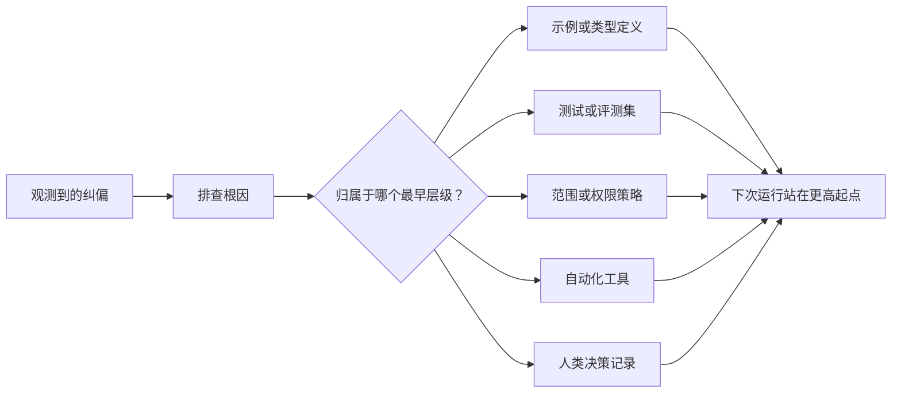

# प्रत्येक एजेंट को सुधारने के लिए सिस्टम में परिवर्तन करना

> केवल चैट रिकॉर्ड में रुके हुए सुधारों को केवल वर्तमान में सुधारने में सक्षम किया जा सकता है। परीक्षण, सीमांकन रणनीति, उदाहरण या उपकरण में नियंत्रण तंत्र में अवलंबता, प्रत्येक बाद के संचालन को बेहतर बना सकती है।

**Type:** Learn + Build
**Languages:** Python (stdlib)
**Prerequisites:** Phase 14 第 37 至 41 课
**Time:** ~65 分钟

## 学习目标

- बुद्धिमान निकाय के लिए दीर्घकालिक प्रणाली नियंत्रण तंत्र में परिवर्तन होगा।
- प्रत्येक नियंत्रण तंत्र को समस्या के पुनरावृत्ति को रोकने में सक्षम होने के लिए सबसे पहले स्तर पर रखा जाएगा।
- पुनः ग्रहण करने के लिए एक स्थिर अंगूठे की विशेषता का उपयोग करें।
- 及时退役那些不再应对现实风险的旧控制规则──

## 纠偏本身就是宝贵的证据

जब आप बुद्धिमान शरीर से कहते हैं कि उस फ़ाइल को संपादित न करें, तो आप वास्तव में यह पाया हैः मौजूदा दायरे की सीमाएं (Scope boundaries) निष्पादित करने योग्य सीमाओं की कमी है।

 बुद्धिजीवी के प्रति सुधार को कार्य प्रणाली की स्वयं की कमी के बारे में अवलोकन अंतर्दृष्टि के रूप में देखा जाना चाहिए, न कि लेखन के दौरान एक ही समय में एक ही भाषा त्रुटि के रूप में।

## 提升沉至最早有效级别

 निम्न नियंत्रण प्राथमिकताएं:

| 频发故障类型 | 长效沉淀去处 |
|---|---|
| 错误计算结果或代码回归 | 自动化测试或评测集（Test / Evaluation） |
| 超范围越界或不安全操作 | 范围契约或权限策略（Scope / Permission Policy） |
| 重复出现的环境配置或命令错误 | 自动化脚本或专用工具（Automation / Tool） |
| 重复出现的输出格式错误 | 标准规范示例外加数据校验器（Canonical Example + Validator） |
| 模糊不清的本地工程惯例 | 附带具体场景检查的指令（Instruction + Scenario Check） |
| 产品层面的分歧与争议 | 人类决策记录（Human Decision Record） |

 जितनी जल्दी प्रभावी नियंत्रण तंत्र की लागत जितनी कम है  एक प्रकार की प्रणाली स्तर से पूर्ण रूप से निष्क्रिय स्थिति की परिभाषा, बाद के कोड समीक्षा के दौरान आलोचनात्मक अनुस्मारक से अधिक मजबूत है; एक लक्षित इकाई परीक्षण, भी बहुत अधिक प्रभावी है 



## 反棘轮记录 (रैशट रिकॉर्ड)

完整的记录应当包含:

- 故障表象(प्रभाव);
- 根因分析 (मूल कारण);
- 造成的后果(परिणाम);
- 重复出现次数 (अवसरों की संख्या);
- चयनित नियंत्रण तंत्र (Selected control mechanism)
- नियंत्रण तंत्र की सत्यापन विधि (verification);
- 责任人(स्वामी);
- 审查或退役日期(पुनरावलोकन / सेवानिवृत्ति तिथि)

प्रत्येक अस्थायी व्यक्तिगत वरीयता को स्थायी रूप से स्थिर न करें। केवल समस्या की पुनरावृत्ति की आवृत्ति या संभावित परिणाम गंभीरता को दीर्घकालिक रखरखाव जटिलता की तर्कसंगतता में वृद्धि के लिए पर्याप्त साबित करने के लिए, इसे स्थायी नियंत्रण तंत्र के रूप में उन्नत किया जा सकता है।

## 区分根因与表象

智能体修改了 README只是表象── इसके पीछे की जड़ें हो सकती हैंः

- 任务框架 पूरे कोड कुंजीपटल को संशोधित करने की अनुमति देता है;
- 文档文件被默认总是可以安全编辑的;
- 执行计划将功能实现与文件编写捆绑在一起;
-  दो कामकाजी संस्थाएँ हैं जो एक दूसरे पर निर्भर हैं।

विभिन्न मूल्यों के कारण पूरी तरह से अलग नियंत्रण साधनों के प्रति प्रतिक्रियाएँ होती हैं। यदि केवल यंत्र से एक प्रतिलिपि प्रतिलिपि लिखने का आदेश दिया जाता है, तो अगली बार जब कुछ ही तरह की समस्याएं थोड़ी बदलती हैं, तो सिस्टम फिर से गायब हो जाएगा।

##  नियंत्रण नियम तथा ही होगा गिरावट

पुराने नियंत्रण नियमों का संघर्ष उत्पन्न होता है, जो निम्न विंडो पर फैलता है, और पुराने सिस्टम के उन पैकेजों को मजबूत करता है जो पहले से मौजूद नहीं हैं।

- अंडर लेयर आर्किटेक्चर में बदलाव हुआ है;
- इसके स्थान पर अधिक शक्तिशाली निष्पादन योग्य नियंत्रण तंत्र स्थापित किया गया है;
- काफी समय के दौरान इस दोष का पुनरावृत्ति नहीं हुआ।
- इस नियम के कारण होने वाली बाधाओं और घर्षणों से यह स्वयं की रक्षा करने के जोखिम से अधिक है।

工程 का लक्ष्य सबसे लंबा निर्देशात्मक दस्तावेज लिखना नहीं है, बल्कि उन कठिन इंजीनियरिंग निर्णयों को बनाए रखने के लिए न्यूनतम प्रणाली तंत्र का उपयोग करना है।

##  इसे निर्माण

इस कक्षा में प्रयोगात्मक प्रक्रिया में सुधारों को वर्गीकृत किया जाएगा, इसे नियंत्रण तंत्र में उन्नत किया जाएगा, दोहराए गए प्रोजेक्ट के लिए उंगलियों के निशान को पुनः उत्पन्न किया जाएगा, और परिणामों को लिखा जाएगा।`outputs/feedback-ratchet.json`

运行命令:

```bash
python3 code/main.py
python3 -m unittest discover code/tests -v
```

尝试输入两条表述不同但根源于相同的纠错偏记录―― निरंतर अनुकूलन एकीकृत तर्क में, जब तक वे एक एकीकृत नियंत्रण तंत्र में एकीकृत नहीं हो सकते, साथ ही साथ एक त्रुटिपूर्ण विफलता है।

## अभ्यास

1. हाल के संपादन सत्र में से पाँचों को चुनें, विश्लेषण करें और उन्हें वास्तविक स्तर पर शामिल करें।
2. एक प्रक्षेपण के पाठ नियम को एक निष्पादित स्वचालित परीक्षण के रूप में पुनः निर्माण करना
3. 增加后果权重 (परिणाम भार) मूल्यांकन, जिससे गंभीर उच्च जोखिमों का भी नियंत्रण किया जा सकता है।
4. प्रयोग आउटपुट में प्रति नियंत्रण तंत्र के लिए जिम्मेदार और निरस्त समय के लिए पूरक
5. ️ एक मौजूदा बुद्धिमान निकाय निर्देश की समीक्षा करें और यह साबित करें कि पहले से ही एक मजबूत नियंत्रण तंत्र है, इसकी पूर्वाधार पर इसे हटा दें

## 延伸阅读

- [Basili, Caldiera, and Rombach, The Goal Question Metric Approach](https://www.cs.toronto.edu/~sme/CSC444F/handouts/GQM-paper.pdf): उच्च श्रेणी के लक्ष्य को समस्या और व्यवहार्य मापने के मापने में कैसे परिवर्तित किया जाए, इसका पता लगाना।
- [Shinn et al., Reflexion](https://arxiv.org/abs/2303.11366):介绍 कैसे उपयोग किया जाए反 ट्रैकिंग वृद्धि और बाद के निर्णय गुणवत्ता, और बिना किसी मामूली मॉडलों के वजन
- [Madaan et al., Self-Refine](https://arxiv.org/abs/2303.17651):                                                                                                                                                                                                                                                               

## 交付物与沉

कृपया ठीक से बनाए रखें उत्पन्न`outputs/feedback-ratchet.json`यह स्मार्ट बॉडी सहायक इंजीनियरिंग मार्ग का दीर्घकालिक परिणाम है, यह भविष्य में कार्यक्षेत्र के मूल प्रवेश का भी और विकास है
