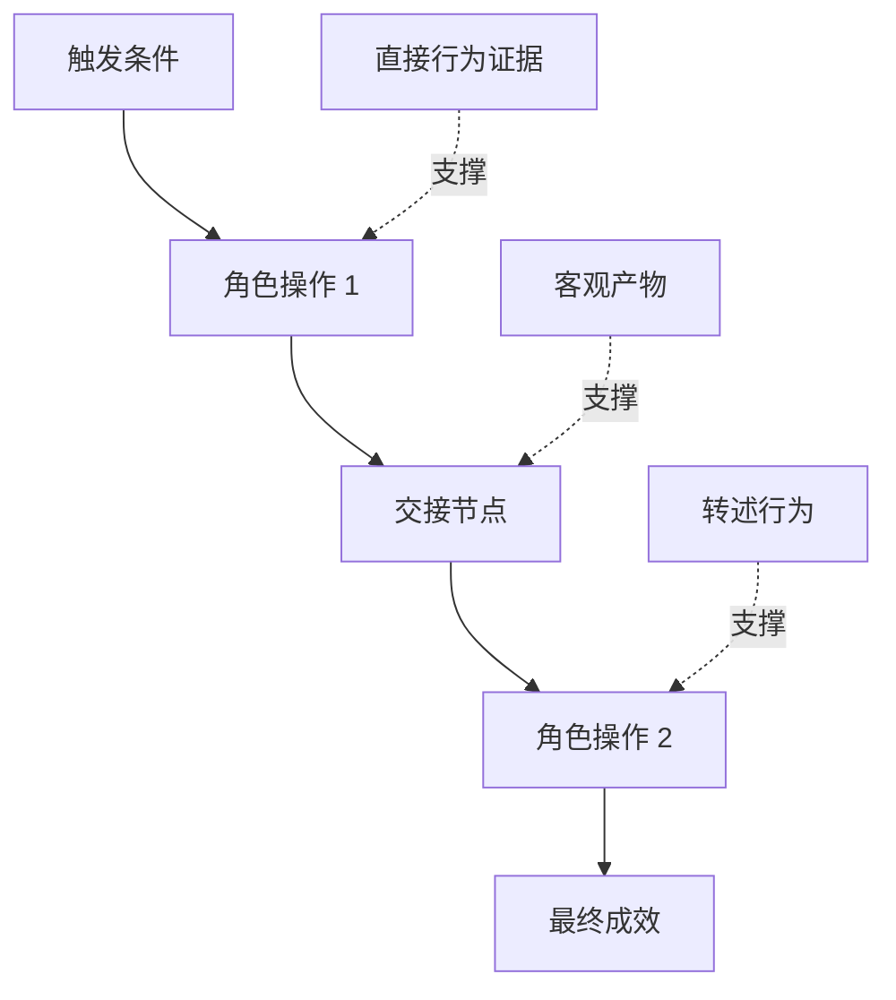

# 发掘人们真正执行的工作流

> वास्तविक आवश्यकताएं कभी पुरानी नहीं होतीं, वास्तव में बैठक कक्ष में बैठती हैं जैसे आप आते हैं  एकत्रित                                                                                                                                                                                                                                                  

**Type:** Learn + Build
**Languages:** Python (stdlib)
**Prerequisites:** Phase 14 第 47 课
**Time:** ~70 分钟

## 学习目标

- मौजूदा कार्यप्रवाह निर्माण को प्रमाणों के आधार पर व्यवस्थित करने की प्रक्रिया में शामिल करना।
-  प्रत्यक्ष अवलोकन के बीच का कठोर अंतर तथ्यों तथा घटनाओं के बारे में जानकारी देने या निष्कर्ष निकालने के बीच का अंतर 
- 定位流程中的摩擦阻力(झड़ाव) 交接节点) 交接节点) 交付) 审批权限) 权威) 及隐性状态) 隐性状态) 
- अनिश्चित रूप से मुख्य पृष्ठ की स्पष्ट दृश्यता को बनाए रखें, और न ही इसे सीधे कठोरता की आवश्यकता में बदल दें

## मौजूदा प्रणाली से प्रस्थान

切勿一开始就问用户想要什么功能──你应该做的是回原现在究竟发生了什么──

 कार्यप्रवाह में प्रत्येक चरण के लिए, निम्नलिखित खंडों को रिकॉर्ड करेंः

| 字段 | 示例 |
|---|---|
| 执行角色（Actor） | 值班工程师 |
| 触发条件（Trigger） | 生产环境告警到达 |
| 具体操作（Action） | 打开告警详情，随后在监控看板中搜索 |
| 输入信息（Input） | 告警 Payload 与发布记录 |
| 产出结果（Output） | 疑似故障服务及责任人 |
| 摩擦阻力（Friction） | 在三个不同运维工具之间来回切换上下文 |
| 审批权限（Authority） | 事故指挥官批准执行写入操作 |
| 支撑证据（Evidence） | 屏幕录像、事故复盘日志、运维手册 |

वास्तविक कार्यप्रवाह स्क्रीन पर देखे जाने वाले इंटरफ़ेस से अधिक व्यापक है। इसमें प्रतीक्षा समय, कॉपी चिपचिपापन, लाइव निजी बातचीत, अनुमोदन प्रक्रिया, त्रुटि पुनर्प्राप्ती, और उन छोटे-छोटे कार्यों को शामिल किया गया है जिनकी पहले से ही लोगों ने आदत थी और यहां तक कि ध्यान नहीं दिया था।

## सबूत है कि मजबूत कमजोर स्तर है

建立简单的证据阶梯( साक्ष्य सीढ़ी):

1. **直接行为（Direct behavior）：**现场观测、系统调用追踪(Trace) 、屏幕录屏或系统事件日志──
2. **客观产物（Artifact）：**工单记录、运维手册、审计日志、表单或完成成果文件──
3. **转述行为（Reported behavior）：**लोग अपने कामों को सामान्य रूप से वर्णन करते हैं।
4. **主观推断（Inference）：**टीम का अनुमान है कि क्या होगा।

इन चार सूचना स्रोतों में मूल्य है, लेकिन केवल पहले दो ही वर्तमान व्यवहार की प्रत्यक्ष पुष्टि कर सकते हैं।



## 重点搜寻四大要素

- **摩擦阻力（Friction）：**पुनः पुनः प्राप्ति की अव्यवस्था, पुनः प्राप्ति की अव्यवस्था, पुनः प्राप्ति की अव्यवस्था, पुनः प्राप्ति की अव्यवस्था, पुनः प्राप्ति की अव्यवस्था, पुनः प्राप्ति की अव्यवस्था, पुनः प्राप्ति की अव्यवस्था, पुनः प्राप्ति की अव्यवस्था, पुनः प्राप्ति की अव्यवस्था, पुनः प्राप्ति की अव्यवस्था, पुनः प्राप्ति की अव्यवस्था, पुनः प्राप्ति की अव्यवस्था, पुनः प्राप्ति की अव्यवस्था, पुनः प्राप्ति की अव्यवस्था, पुनः प्राप्ति की अव्यवस्था, पुनः प्राप्ति की अव्यवस्था, पुनः प्राप्ति की अव्यवस्था, पुनः प्राप्ति की अव्यवस्था, पुनः प्राप्ति की अव्यवस्था, पुनः प्राप्ति की अव्यवस्था, पुनः प्राप्ति की अव्यवस्था, पुनः प्राप्ति की अव्यवस्था, पुनः प्राप्ति, पुनः प्राप्ति की अव्यवस्था, पुनः प्राप्ति, पुनः प्राप्ति, पुनः प्राप्ति, पुनः प्राप्ति, पुनः प्राप्ति, पुनः प्राप्ति, पुनः प्राप्ति, पुनः प्राप्ति, पुनः प्राप्ति, पुनः प्राप्ति, पुनः प्राप्ति, पुनः प्राप्ति, पुनः प्राप्ति, पुनः प्राप्ति, पुनः प्राप्ति, पुनः प्राप्ति, पुनः प्राप्ति, पुनः प्राप्ति, पुनः प्राप्ति, पुनः प्राप्ति, पुनः प्राप्ति, पुनः प्राप्ति, पुनः प्राप्ति, पुनः प्राप्ति, पुनः प्राप्ति, पुनः प्राप्ति, पुनः प्राप्ति, पुनः प्राप्ति, पुनः प्राप्ति, पुनः प्राप्ति, पुनः प्राप्ति, पुनः प्राप्ति, पुनः प्राप्ति, पुनः प्राप्ति, पुनः प्राप्ति, पुनः प्राप्ति, पुनः प्राप्ति, पुनः प्राप्ति, पुनः प्राप्ति, और पुनः प्राप्ति, पुनः प्राप्ति, पुनः प्राप्ति, पुनः प्राप्ति, पुनः प्राप्ति, पुनः प्राप्ति, पुनः प्राप्ति, और पुनः प्राप्ति, पुनः प्राप्ति, पुनः प्राप्ति, पुनः प्राप्ति, पुनः प्राप्ति, और प्राप्ति, पुनः प्राप्ति, पुनः प्राप्ति, पुनः प्राप्ति, पुनः प्राप्ति, और प्राप्ति, पुनः प्राप्ति, पुनः प्राप्ति, और प्राप्ति, पुनः प्राप्ति,
- **隐性状态（Hidden state）：** केवल कर्मचारी मन में  तत्काल संचार चैट रिकॉर्ड या व्यक्तिगत निजी नोट में सूचना तथ्य 
- **审批权限（Authority）：**विशेष व्यक्ति या नियंत्रण प्रणाली के लिए महत्वपूर्ण निर्णय लेने का अधिकार है।
- **异常分支（Exceptions）：**सामान्य प्रक्रम में विराम होता है, कार्यवाही के किनारे पर निर्भरता नहीं होती है।

एआई  Function का कारण अक्सर असामान्य प्रसंस्करण के साथ संपर्क में आते समय टूट जाता है, अक्सर यह इसलिए होता है क्योंकि शुरुआत में केवल सभी चीजों के लिए आदर्श पथों के लिए डिज़ाइन किया गया था।

## 切勿通过求平均抹杀分歧

 दो उपयोगकर्ता अलग-अलग ऑपरेटिंग प्रक्रियाओं को अपनाते हैं, जिनमें अक्सर बहुत अधिक उचित कारण होते हैं

- विभिन्न संगठनिक भूमिकाएँ तथा अधिकार;
- अलग-अलग जोखिम सहिष्णुता स्तर;
- 遗留旧流程与当前新流程的交换;
-  व्यावसायिक अनुभव और प्रवीणता में अंतर;
- वास्तविक व्यापारिक रणनीति और शासन में मतभेद।

एक प्रबलित  औसत 折 में काम प्रवाह, अक्सर किसी भी वास्तविक व्यक्ति का वर्णन करने में असमर्थ हो जाता है।

##  इसे निर्माण

इस कक्षा में प्रयोगात्मक प्रक्रिया कार्यप्रवाह के प्रत्येक चरण के रिकॉर्ड प्रमाण प्रमाण प्रमाण प्रमाण, विद्यालय परीक्षा निष्पादन क्रम एवं विश्वास, गणना प्रत्यक्ष प्रमाण अनुपात, और परिणामों को लिखा जाएगा।`outputs/workflow-evidence.json`

运行命令:

```bash
python3 code/main.py
python3 -m unittest discover code/tests -v
```

 प्रयास बढ़ाएँ  तैनाती रिकॉर्ड  के अभाव  के असामान्य शाखा मार्गों  को बनाए रखें, मुख्यधारा के क्रम में परिवर्तन नहीं,并清晰 रिकॉर्ड  के प्रारंभ बिंदु स्थान 

## अभ्यास

1. किसी भी व्यक्ति से मुलाकात न करें, केवल एक प्रणाली संचालन की तारीख के साथ एक पूर्ण कार्यप्रवाह को पुनः प्राप्त करें।
2. 面谈一位真实用户,标注出其主张中所有仍缺乏直接客观证支的陈述──
3. 增加一处权限审批边界 (अधिकार सीमा)
4. ् एक ही परिदृश्य के लिए दो अलग-अलग प्रक्रियाओं के परिवर्तनों को विकसित करना, उन्हें एक साथ मजबूती से लागू करना।
5.  किसी प्रस्ताव के नए कार्य को ढूंढें: यह यद्यपि सतह पर एक दृश्य क्रिया को समाप्त करता है, लेकिन पीछे के गुप्त कार्य को पूरी तरह से छुपा नहीं है

## 延伸阅读

- [Nuseibeh and Easterbrook, Requirements Engineering: A Roadmap](https://www.cs.toronto.edu/~sme/papers/2000/ICSE2000.pdf)विशेष रूप से, इसकी आवश्यकताओं के बारे में ध्यान देना आवश्यक है कि वे केवल जानकारी प्राप्त करने के लिए नहीं बल्कि इसे प्राप्त करने के लिए विस्तृत विवरण प्रदान करें।
- [Gotel and Finkelstein, An Analysis of the Requirements Traceability Problem](https://doi.org/10.1109/ICRE.1994.292398): रखरखाव की आवश्यकताओं और इसके स्रोत आधार के बीच संबंध का अनुवर्ती कठिन चुनौतियों का विश्लेषण किया।

## 交付物与沉

कृपया ठीक से बनाए रखें उत्पन्न`outputs/workflow-evidence.json`️️️️️️️️️️️️️️️️️️️️️️️️️️️️️️️️️️️️️️️️️️️️️️️️️️️️️️️️️️️️️️️️️️️️️️️️️️️️️️️️️️️️️️️️️️️️️️️️️️️️️️️️️️️️️️️️️️️️️️️️️️️️️️️️️️️️️️️️️️️️️️️️️️️️️️️️️️️️️️️️️️️️️️️️️️️️️️️️️️️️️️️️️️️️️️️️️️️️️️️️️️️️️️️️️️️️️️️️️️️️️️️️️️️️️️️️️️️️️️️️️️️️️️️️️️️️️️️️️️️️️️️️️️️️️️️️️️️️️️️️️️️️️️️️️️️️️️️️️️️️️️️️️️️️️️️️️️️️️️️️️️️️️️️️️️️️️️️️️️️️️️️️️️️️️️️️️️️️️️️️️️️️️️️️️️️️️️️️️️️️️️️️️️️️️️️️️️️️️️️️️️️️️️️️️️️️️️️️️️️️️️️️️️️️️️️️️️️️️️️️️️️️️️️️️️️️️️️️️️️️️️️️️️️️️️️️️️️️️️️️️️️️️️️️️️️️️️️️️️️️️️️️️️️️
