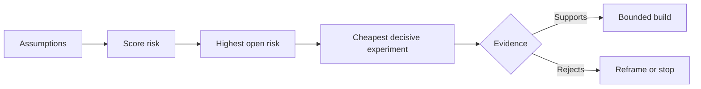

# 理假设并优先化解最高风险

> 产品路线图 (Roadmap) अक्सर कार्यसूची में अनिश्चितता को छिपाकर रखती है; जबकि परिकल्पना चार्ट (Assumption Map) यह प्रकट करता हैः इन कार्यों के निर्माण के लिए पहले, यह सुनिश्चित करना आवश्यक है कि कौन से पूर्व शर्तें हैं।

**Type:** Learn + Build
**Languages:** Python (stdlib)
**Prerequisites:** Phase 14 lesson 48
**Time:** ~65 minutes

## 学习目标

- प्रस्तावित कार्य को विघटित और स्पष्ट रूप से स्पष्ट परिकल्पनाओं में परिवर्तित किया जाएगा।
- ️️️️️️️️️️️️️️️️️️️️️️️️️️️️️️️️️️️️️️️️️️️️️️️️️️️️️️️️️️️️️️️️️️️️️️️️️️️️️️️️️️️️️️️️️️️️️️️️️️️️️️️️️️️️️️️️️️️️️️️️️️️️️️️️️️️️️️️️️️️️️️️️️️️️️️️️️️️️️️️️️️️️️️️️️️️️️️️️️️️️️️️️️️️️️️️️️️️️️️️️️️️️️️️️️️️️️️️️️️️️️️️️️️️️️️️️️️️️️️️️️️️️️️️️️️️️️️️️️️️️️️️️️️️️️️️️️️️️️️️️️️️️️️️️️️️️️️️️️️️️️️️️️️️️️️️️️️️️️️️️️️️️️️️️️️️️️️️️️️️️️️️️️️️️️️️️️️️️️️️️️️️️️️️️️️️️️️️️️️️️️️️️️️️️️️️️️️️️️️️️️️️️️️️️️️️️️️️️️️️️️️️️️️️️️️️️️️️️️️️️️️️️️️️️️️️️️️️️️️️️️️️️️️️️️️️️️️️️️️️️️️️️️️️️️️️️️️️️️️️️️️️️️️️️
- 风险排序选择下一个实验,而不是主观热情驱动
- प्रयोग प्रमाण एवं निश्चित निर्णय निष्कर्षों के साथ पूर्व-परीक्षण परिकल्पनाओं के प्रतिस्थापन हेतु

## हर निर्माण एक शर्त है

एक सेट故障排查工具 (अवसर उपकरण) का मूल्य, हो सकता है कि निम्नलिखित प्रत्येक पूर्व निर्धारित परिकल्पना पूरी तरह से मान्य हो या नहीं, इस पर निर्भर करता हैः

-  अलर्ट पर निम्नलिखित में दोष पहचानने के लिए पर्याप्त जानकारी शामिल है;
- 工程师信任 वे नहीं हैं व्यक्तिगत रूप से सुझाव प्राप्त परिणाम;
- प्रवाह और विकास के स्तर पर अपेक्षित प्रतिक्रिया समय वास्तव में महत्वपूर्ण है;
- असीमित अधिकारों की स्थिति में आवश्यक डेटा का उपयोग किया जा सकता है।
- इस कार्यप्रवाह की घटनाओं की आवृत्ति पर्याप्त उच्च है, जिससे यह सिद्ध हो सके कि इस प्रणाली के रखरखाव की लागत उचित है।

ये काम करने के लिए केवल कोड नहीं हैं, बल्कि निर्माण को मूल्यवान बनाने के लिए आवश्यक हैं।

## 假设的类别

| 类别 | 核心问题 |
|---|---|
| 价值（Value） | 产出的最终结果是否足够重要？ |
| 可用性（Usability） | 用户能否理解并据此采取行动？ |
| 可行性（Feasibility） | 现有系统能否利用可获取的数据和约束产出该结果？ |
| 存续性（Viability） | 组织能否长期承受其成本、归属权与运维负担？ |
| 安全性（Safety） | 系统出现故障时是否不会造成无法接受的后果？ |

️️️️️️️️️️️️️️️️️️️️️️️️️️️️️️️️️️️️️️️️️️️️️️️️️️️️️️️️️️️️️️️️️️️️️️️️️️️️️️️️️️️️️️️️️️️️️️️️️️️️️️️️️️️️️️️️️️️️️️️️️️️️️️️️️️️️️️️️️️️️️️️️️️️️️️️️️️️️️️️️️️️️️️️️️️️️️️️️️️️️️️️️️️️️️️️️️️️️️️️️️️️️️️️️️️️️️️️️️️️️️️️️️️️️️️️️️️️️️️️️️️️️️️️️️️️️️️️️️️️️️️️️️️️️️️️️️️️️️️️️️️️️️️️️️️️️️️️️️️️️️️️️️️️️️️️️️️️️️️️️️️️️️️️️️️️️️️️️️️️️️️️️️️️️️️️️️️️️️️️️️️️️️️️️️️️️️️️️️️️️️️️️️️️️️️️️️️️️️️️️️️️️️️️️️️️️️️️️️️️️️️️️️️️️️️️️️️️️️️️️️️️️️️️️️️️️️️️️️️️️️️️️️️️️️️️️️️️️️️️️️️️️️️️️️️️️️️️️️️️️️️️️️️️️

## 风险并非单一维度的数字

यह प्रयोग 1 से 5 मिनट तक तीन आयामों का आकलन करता हैः

- **影响（Impact）：**यदि यह धारणा नहीं बनी तो सिस्टम या व्यवसाय पर हुए नुकसान की मात्रा
- **不确定性（Uncertainty）：**पहले के प्रमाणों के कब्जे में कमजोरता।
- **不可逆性（Irreversibility）：**जब तक कोई महत्वपूर्ण प्रतिबद्धता या निवेश नहीं किया जाता तब तक गलत रिटर्न लागत का पता नहीं चलता है।

उदाहरण रेटिंग का प्रभाव अनिश्चितता से गुणा होगा, अनिश्चितता को पुनः जोड़कर अपरिवर्तनीयता पर पड़ेगा। यह सूत्र किसी भी प्रकार के मानक को नहीं छोड़ता है, इसका उद्देश्य टीम को स्पष्ट रूप से स्पष्ट करना है कि एक अज्ञात को दूसरे अज्ञात समाधान से क्यों प्राथमिकता दी जानी चाहिए।



## 设计实验,而非 पुष्टिकरण समारोह

एक वास्तविक मूल्यवान प्रयोग में निम्नलिखित तत्व होते हैंः

- एक संभावित झूठी गवाही देने वाला;
- वास्तविक दर्शकों के समूह या प्रतिनिधि के लिए नमूना;
- एक दृश्यमान वस्तुनिष्ठ परिणाम;
-  मूल्यांकन  मूल्य, जो परिणामों को देखने से पहले पहले तय किया गया है;
-                                                                                                                                                                                                                                                               

                                                                                                                                                                                                                                                              

## 可逆性会改变构建顺序

后果严重且不可逆的选择需要更早获得证据支持──只读重放(只读重播) को पहले उत्पादन वातावरण में एकीकृत करना चाहिए; अस्थायी एडिटर को पहले बड़े पैमाने पर डेटा स्थानांतरण की आवश्यकता हो सकती है; कृत्रिम स्वीकृति के सुझाव को पहले पूर्ण स्वचालित रूप से निष्पादित करना चाहिए──

 प्रणाली निर्माण के आगे बढ़ने की गति अनिश्चितता के समाधान की गति से मेल खाती होनी चाहिए

## 动手实现

इस प्रयोग में परिकल्पना को क्रमबद्ध किया गया, सत्यापित और अनिर्णित निष्कर्षों को अलग किया गया, जोखिम के उच्चतम अनिर्णित परिकल्पना को चुना गया, और उत्पन्न किया गया।`outputs/assumption-map.json`

```bash
python3 code/main.py
python3 -m unittest discover code/tests -v
```

परिवर्तन उच्चतम जोखिम परिकल्पना पर साक्ष्य की स्थिति, observation system recommendation के अगले प्रयोग में गतिशीलता कैसे समायोजित होगी

## 课后练习

1. आप एक फ़ंक्शन बनाने के लिए तैयार हैं, पांच महत्वपूर्ण धारणाएँ लिखें।
2. 補充一条您原本的功能列表中遗漏的安全假设──
3. एक निर्धारित करें जो आपको इस निर्माण की कठोरता मूल्य को समाप्त करने का निर्णय देगा
4. एक मूल रूप से विशाल परीक्षण प्रयोग को कम लागत और निर्णायक परीक्षण के लिए प्रतिस्थापित करना।
5. जोखिम प्राथमिकता के लिए मूल उत्पाद मार्ग रेखा प्राथमिकता के लिए, और व्याख्या दो क्यों वहाँ गलत स्थान है।

## 延伸阅读

- [Barry Boehm, A Spiral Model of Software Development and Enhancement](https://dl.acm.org/doi/10.1145/12944.12948),अनिश्चितता के जोखिम-प्रेरक विकास चक्रों को गहराई से आगे बढ़ाने के लिए प्रयास करें।
- [Dardenne, van Lamsweerde, and Fickas, Goal-Directed Requirements Acquisition](https://doi.org/10.1016/0167-6423(93)90021-जी), जो कि एक ही समय में विकास प्रणाली के लक्ष्य को विस्तार से उजागर करने और बाधाओं और बंधनों को जोड़ने की खोज करता है।

## 交付物沉

रखरखाव`outputs/assumption-map.json`️️️️️️️️️️️️️️️️️️️️️️️️️️️️️️️️️️️️️️️️️️️️️️️️️️️️️️️️️️️️️️️️️️️️️️️️️️️️️️️️️️️️️️️️️️️️️️️️️️️️️️️️️️️️️️️️️️️️️️️️️️️️️️️️️️️️️️️️️️️️️️️️️️️️️️️️️️️️️️️️️️️️️️️️️️️️️️️️️️️️️️️️️️️️️️️️️️️️️️️️️️️️️️️️️️️️️️️️️️️️️️️️️️️️️️️️️️️️️️️️️️️️️️️️️️️️️️️️️️️️️️️️️️️️️️️️️️️️️️️️️️️️️️️️️️️️️️️️️️️️️️️️️️️️️️️️️️️️️️️️️️️️️️️️️️️️️️️️️️️️️️️️️️️️️️️️️️️️️️️️️️️️️️️️️️️️️️️️️️️️️️️️️️️️️️️️️️️️️️️️️️️️️️️️️️️️️️️️️️️️️️️️️️️️️️️️️️️️️️️️️️️️️️️️️️️️️️️️️️️️️️️️️️️️️️️️️️️️️️️️️️️️️️️️️️️️️️️️️️️️️️️️️️️️
