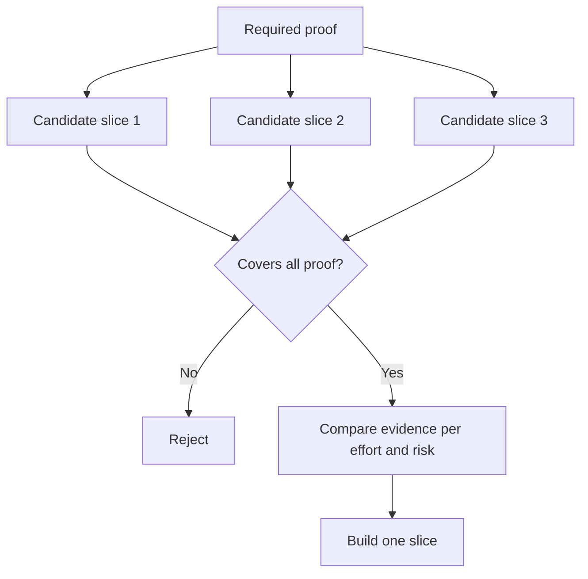

# 选择能够改变决策 के न्यूनतम टुकड़े

>                                                                                                                                                                                                                                                               

**Type:** Learn + Build
**Languages:** Python (stdlib)
**Prerequisites:** Phase 14 lesson 49
**Time:** ~65 minutes

## 学习目标

- कच्चे टुकड़े के आधार पर, कच्चे टुकड़े को परिभाषित करने के लिए एक मूल धारणा है।
- 权衡结果价值(उत्पाद मूल्य) 无确定性化解、研发投入与潜在后果──
-  प्राथमिकताएँ  वास्तविक प्रमाणों को चुनें, तथा शीघ्र जन्म के लिए प्रतिबद्धताएँ न करें
-  निर्णय या निर्णय                                                                                                                                                                                                                                                             

## 垂直切片 का अर्थ है अंत से अंत तक की वास्तविकता

垂直切片 (垂直切片) 垂直切片 (垂直切片) 垂直切片 (垂直切片) 垂直切片 (垂直切片) 垂直切片 (垂直切片) 垂直切片 (垂直切片) 垂直切片 (垂直切片) 垂直切片 (垂直切片) 垂直切片 (垂直切片) 垂直切片 (垂直切片) 垂直切片 (垂直切片) 垂直切片 (垂直切片) 垂直切片 (垂直切片) 垂直切片 (垂直切片) 垂直切片 (垂直切片) 垂直切片 (垂直切片) 垂直切片 (垂直切片) 垂直切片 (垂直切片) 垂直切片 (垂直切片) 垂直切片 (垂直切片) 垂直切片 (垂直切片) 垂直切片 (垂直切片) 垂直切片 (垂直切片) 垂直切片) 垂直切片 (垂直切片) 切片 (垂直切片) 切片) 切片 (垂直切片) 切片 (切片) 切片 (切片) 切片) 切片 (切片) 切片 (切片) 切片 (切片) 切片 (切片) 切片) 切片 (切片) 切片 (切片) 切片 (切片 (切片) 切片 (切片) 切片 (切片) (切片) (切片) (切片) (切片) (切片 (切片) (切片) (切) (切片 (切) (切) (切) (切) (切) (切) (切) (切) (切) (切) (切) (切) (切) (切 (切) (切 (切) (切) (切 (切) (切) (切 (切) (切 (切) (切) (切 (切) (切) (切 (切) (切) (切 (切 (切) (

उदाहरण:

-  10 起真故障的只读重放 (केवल पढ़ने के लिए) पर आधारित, सक्षम परीक्षण सेवा पहचान सटीकता और ऑपरेटर की विश्वसनीयता
- संश्लेषित डेटा के आधार पर निर्मित एक उत्कृष्ट उपकरण का एक सेट, शायद इंटरफ़ेस की समझ का परीक्षण कर सकता है, लेकिन डेटा प्राप्त करने की व्यवहार्यता का परीक्षण पूरी तरह से नहीं कर सकता है।
- उत्पादन वातावरण के तहत पूर्ण स्वचालित खराबी सुधारक, एक बार परीक्षण करने का प्रयास किया गया, लेकिन भारी विनाश का जोखिम लाया गया।

## पूर्व स्पष्ट आवश्यक साक्ष्य

提取风险最高的未决假设,将将其转化为必需证据集 (需证据集) ── उम्मीदवारों के लिए केवल पूर्ण रूप से इस प्रमाणपत्र के कवर में ही पात्रता प्राप्त होगी) 

इसके बाद, योग्य टुकड़ों के बीच तुलनात्मक मूल्यांकन किया गयाः

| 评估维度 | 期望方向 |
|---|---|
| 产出价值（Outcome value） | 越大越好 |
| 化解的不确定性（Uncertainty reduced） | 越多越好 |
| 研发投入（Effort） | 越小越好 |
| 潜在后果（Consequence） | 越轻越好 |
| 可逆性（Reversibility） | 越高越好 |

इस प्रयोग में प्रयोग किए जाने वाले मूल्यांकन मॉडल को सरल बनाए रखने की कोशिश की गई है, क्योंकि पात्रता प्रवेश द्वार (Eligibility Gate) स्वयं डिजिटल संचालन से कहीं अधिक महत्वपूर्ण है।



## 常见的伪极小值陷

- **纯界面极小值（UI-only minimum）：** सबसे महत्वपूर्ण डेटा प्राप्ति और संवाहक अनिश्चितता से बचें
- **纯基础设施极小值（Infrastructure-only minimum）：**⇒ प्राविधिक व्यवहार्यता का प्रमाण, लेकिन उपयोगकर्ता मूल्य का परीक्षण नहीं कर सका।
- **纯顺境极小值（Happy-path minimum）：**                                                                                                                                                                                                                                                              
- **演示极小值（Demo minimum）：** अत्यधिक प्रभावशाली प्रदर्शन उत्पाद उत्पन्न हुए, लेकिन एक पुनः प्रयोज्य मात्रात्मक मूल्यांकन प्रदान नहीं कर सके
- **平台化极小值（Platform minimum）：**एकल कार्यप्रवाह ने अपनी मूल्य की पुष्टि नहीं की है, इसके पहले ही सामान्य पुनः उपयोग घटक का निर्माण किया गया है।

## 预先设定停止规则

इस पर ध्यान दें कि यदि यह परीक्षण विफल हो जाता है तो यह कदम उठाया जाएगा।

-                                                                                                                                                                                                                                                                                                                                                                                                                                                                                                                              
- लक्ष्य उपयोगकर्ता समूह या व्यावसायिक परिदृश्य को बदलना;
- 测试替代的技术机制;
- ् ् ् ् ् ् ् ् ् ् ् ् ् ् ् ् ् ् ् ् ् ् ् ् ् ् ् ् ् ् ् ् ् ् ् ् ् ् ् ् ् ् ् ् ् ् ् ् ् ् ् ् ् ् ् ् ् ् ् ् ् ् ् ् ् ् ् ् ् ् ् ् ् ् ् ् ् ् ् ् ् ् ् ् ् ् ् ् ् ् ् ् ् ् ् ् ् ् ् ् ् ् ् ् ् ् ् ् ् ् ् ् ् ् ् ् ् ् ् ् ् ् ् ् ् ् ् ् ् ् ् ् ् ् ् ् ् ् ् ् ् ् ् ् ् ् ् ् ् ् ् ् ् ् ् ् ् ् ् ् ् ् ् ् ् ् ् ् ् ् ् ् ् ् ् ् ् ् ् ् ् ् ् ् ् ् ् ् ् ् ् ् ् ् ् ् ् ् ् ् ् ् ् ् ् ् ् ् ् ् ् ् ् ् ् ् ् ् ् ् ् ् ् ् ् ् ् ् ् ् ् ् ् ् ् ् ् ् ् ् ् ् ् ् ् ् ् ् ् ् ् ् ् ् ्
- अधिक संकुचित प्रणाली के कार्यान्वयन अधिकारों

यदि प्रत्येक परीक्षण का परिणाम अंततः दिशा-निर्देशित होता है, तो यह टुकड़ा मूलतः एक वास्तविक प्रयोग नहीं है।

## 动手实现

इस प्रयोग के आधार पर आवश्यक साक्ष्य संग्रह  उम्मीदवार                                                                                                                                                                                                                                                         `outputs/slice-decision.json`

```bash
python3 code/main.py
python3 -m unittest discover code/tests -v
```

️️️️️️️️️️️️️️️️️️️️️️️️️️️️️️️️️️️️️️️️️️️️️️️️️️️️️️️️️️️️️️️️️️️️️️️️️️️️️️️️️️️️️️️️️️️️️️️️️️️️️️️️️️️️️️️️️️️️️️️️️️️️️️️️️️️️️️️️️️️️️️️️️️️️️️️️️️️️️️️️️️️️️️️️️️️️️️️️️️️️️️️️️️️️️️️️️️️️️️️️️️️️️️️️️️️️️️️️️️️️️️️️️️️️️️️️️️️️️️️️️️️️️️️️️️️️️️️️️️️️️️️️️️️️️️️️️️️️️️️️️️️️️️️️️️️️️️️️️️️️️️️️️️️️️️️️️️️️️️️️️️️️️️️️️️️️️️️️️️️️️️️️️️️️️️️️️️️️️️️️️️️️️️️️️️️️️️️️️️️️️️️️️️️️️️️️️️️️️️️️️️️️️️️️️️️️️️️️️️️️️️️️️️️️️️️️️️️️️️️️️️️️️️️️️️️️️️️️️️️️️️️️️️️️️️️️️️️️️️️️️️️️️️️️️️️️️️️️️️️️️️️️️️️️

## 课后练习

1. एक ही अपेक्षित परिणाम के लिए, विभिन्न परिणामों के अनुरूप विभिन्न स्तरों के प्रमाणन के तीन टुकड़े तैयार किए गए।
2. उम्मीदवारों के लिए आवश्यक साक्ष्य सूचीबद्ध करें।
3. 尝试裁减一项功能, साथ ही यह सुनिश्चित करने में सक्षम होना महत्वपूर्ण निर्णयात्मक साक्ष्य
4. प्रयोजन कार्यक्रम पूरक एक वास्तविक व्यवहार्य रोकथाम नियम
5. एक कारण ज्ञात करें जो कि प्रमाणीकरण के बाद पुनः आरंभ किए जाने वाले सामान्य मंच घटक को देरी से लागू करना चाहिए

## 延伸阅读

- [Barry Boehm, A Spiral Model of Software Development and Enhancement](https://dl.acm.org/doi/10.1145/12944.12948), प्रत्येक विकास चक्र को वर्तमान में हल करने के लिए आवश्यक जोखिमों के साथ कैसे मेल खाती है, इसकी खोज करना।
- [Lenarduzzi and Taibi, MVP Explained: A Systematic Mapping Study on the Definitions of Minimal Viable Product](https://arxiv.org/abs/1609.07592), सेमॅटिकल सॉफ्टवेयर इंजीनियरिंग प्रथा में  न्यूनतम  के साथ  उपलब्ध  के लिए परिभाषित अमूर्तता

## 交付物沉

रखरखाव`outputs/slice-decision.json` इस दस्तावेज में इस टुकड़े की पहचान की गई है, जिसके कारण निर्णय को बदलने में सक्षम होने वाले न्यूनतम टुकड़े के साक्ष्य के आधार पर 
