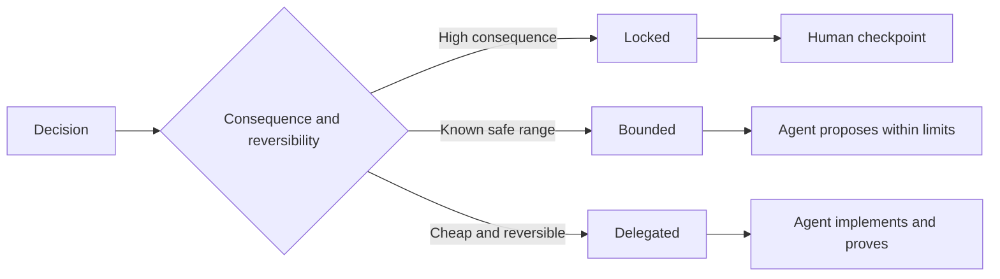

# लेखक स्वायत्त निर्णय अधिकार को बनाए रखने के कार्य के नियम

> मूल्यवान मानदंडों को स्थिरता और प्रमाण के साथ-साथ उल्टा कार्यान्वयन के विकल्प के लिए खुला रहना चाहिए। यह निर्णय की सीमा संधि है, न कि कार्य के आधार पर।

**Type:** Learn + Build
**Languages:** Python (stdlib)
**Prerequisites:** Phase 14 lesson 50
**Time:** ~75 minutes

## 学习目标

- 将预期产出、不变量(परिवर्तन)、范例、非目标(非目标)
- 将决策划分为锁定 (बंद) 限 (बंद) 委派 (उपयुक्त) 委派 (उपयुक्त) 三种模式──
- कम लागत वाले और अत्यधिक प्रतिकूल घटक चुनने में, एजेंट का स्वायत्त निर्णय अधिकार पूरी तरह से संरक्षित है।
- गंभीर परिणामों या सार्वजनिक व्यवहार के विनाश से संबंधित बिंदुओं पर, कृत्रिम आडिट जांच बिंदु (Human Checkpoints) को अनिवार्य रूप से स्थापित करना।

## 两种糟糕的极端

规范不足 (अधिसूचित) के कार्य एजेंट को बाध्य करते हैं 凭空猜测系统行为; जबकि अति规范 (अधिसूचित) के कार्य एजेंट को 机械照抄可能本身存在缺陷的具体设计――

कार्यकारी कटौती योजना**可执行契约（Executable Contract）**:

| 规范要素 | 核心作用 |
|---|---|
| 预期产出（Outcome） | 可直接观测的最终交付结果 |
| 不变量（Invariants） | 必须始终严格成立的前置与后置约束 |
| 范例（Examples） | 能够直观展现真实意图的具体用例 |
| 非目标（Non-goals） | 明确刻意排除在外的周边行为 |
| 决策策略（Decision policy） | 标明哪些选择属于锁定、受限或完全委派 |
| 验证证据（Proof） | 任务验收前必须提供的测试或观测实据 |

## 三种决策模式

- **锁定（Locked）：**严禁代理 擅自选择―― सार्वजनिक兼容性、写权限、安全红线、不可逆成本或核心产品承诺 हेतु लागू
- **受限（Bounded）：** अनुमति दें एजेंट को स्पष्ट रूप से परिभाषित सुरक्षा क्षेत्र के भीतर स्वतंत्र चयन करना।
- **委派（Delegated）：**授权代理 全权裁量并附带解释说明―― स्थानीय कोड संरचना、命名规范、可逆重构及内部实现细节――



## 通过具体范例界定行为

विशिष्ट उदाहरणों के साथ, अधिक कुशल संचयनों से अधिक है।  अनुकूल 

范例不能替代不变量: एक बार पारित सफल उपयोग के मामले, सार्वभौमिक सुरक्षा नियमों का प्रमाण नहीं दिया जा सकता है।

## सत्यापन प्रमाणपत्र को घोषणा श्रेणी के अनुरूप होना चाहिए

- 单元测试(Unit Test) को स्थानीय कार्यक्रम契约── को साबित करने के लिए प्रयोग किया जाता है।
- 传输协议测试 (वायर टेस्ट) का प्रयोग प्रमाणीकरण एवं नेटवर्क संचार व्यवहार हेतु किया जाता है।
- 浏览器旅程(ब्राउजर यात्रा) को उपयोगकर्ता इंटरफ़ेस पथ को समाप्त करने के लिए प्रयोग किया जाता है
- 重放测试集(Replay Set) का प्रयोग प्रतिनिधि परिदृश्य में संपूर्ण प्रदर्शन को प्रदर्शित करने के लिए किया जाता है
- 审计日志 (ऑडिट लॉग) प्रमाणीकरण प्रणाली के अधिकार सीमाओं के लिए हमेशा प्रभावी है।

निम्न स्तर के परीक्षाओं को उच्च स्तर के बयानों के स्वीकृति प्रमाण के रूप में कभी न लें

## 刻意保留合理的未知空间

 नियमन स्पष्ट रूप से घोषित किया जा सकता हैः विशेष रूप से लागू करने के लिए उपलब्ध है  बजट का विस्तार करने के लिए किसी भी समय केवल डेटा स्रोत को पढ़ना यह स्पष्ट रूप से स्पष्ट रूप से स्पष्ट रूप से परिभाषित नहीं है, बल्कि स्पष्ट रूप से स्पष्ट रूप से निर्धारित निर्णय है, जो साक्ष्य के साथ बाध्य है

 पहचान प्रमाण के संचय के साथ, नियमन समय के साथ विकसित होना चाहिए रिकॉर्ड लॉक और सीमित चयन के पीछे के अंतर्निहित कारणों के साथ, बाद की टीम बिना किसी  कोड पुरातात्विक  के स्पष्ट रूप से निर्णय लेने में सक्षम हो

## 动手实现

इस प्रयोग में निर्णय लेने के तरीके की वैधता की जांच करने के लिए,`outputs/executable-specification.json`

```bash
python3 code/main.py
python3 -m unittest discover code/tests -v
```

️️️️️️️️️️️️️️️️️️️️️️️️️️️️️️️️️️️️️️️️️️️️️️️️️️️️️️️️️️️️️️️️️️️️️️️️️️️️️️️️️️️️️️️️️️️️️️️️️️️️️️️️️️️️️️️️️️️️️️️️️️️️️️️️️️️️️️️️️️️️️️️️️️️️️️️️️️️️️️️️️️️️️️️️️️️️️️️️️️️️️️️️️️️️️️️️️️️️️️️️️️️️️️️️️️️️️️️️️️️️️️️️️️️️️️️️️️️️️️️️️️️️️️️️️️️️️️️️️️️️️️️️️️️️️️️️️️️️️️️️️️️️️️️️️️️️️️️️️️️️️️️️️️️️️️️️️️️️️️️️️️️️️️️️️️️️️️️️️️️️️️️️️️️️️️️️️️️️️️️️️️️️️️️️️️️️️️️️️️️️️️️️️️️️️️️️️️️️️️️️️️️️️️️️️️️️️️️️️️️️️️️️️️️️️️️️️️️️️️️️️️️️️️️️️️️️️️️️️️️️️️️️️️️️️️️️️️️️️️️️️️️️️️️️️️️️️️️️️️️️️️️️️️️️

## 课后练习

1. एक अवशेष का प्रत्याशा कार्य को नियमन संधि के छह आयामों में परिवर्तित करना
2. एक अपरिवर्तनीय नियम के साथ दो विशिष्ट उदाहरणों को बदलकर तीन कठिन आदेशों का वर्णन करें।
3.  प्रत्येक निर्णय के लिए प्रत्येक स्थान पर चयन विवरण के लिए 
4. ⇒ नियमानुसार प्रत्येक अपरिवर्तनीयता के लिए प्रमाण पत्र के प्रमाण पत्र का पूरक।
5. एक धारा का पता लगाएँ जो कि अब भी अकारथित है और जो भी अकारथित है उसे हटा दिया जायेगा

## 延伸阅读

- [Nuseibeh and Easterbrook, Requirements Engineering: A Roadmap](https://www.cs.toronto.edu/~sme/papers/2000/ICSE2000.pdf), उद्देश्यों, विशिष्ट नियमों, सत्यापन, सहमति और विकास के बीच प्रणालीगत संबंधों की चर्चा करें।
- [Zave and Jackson, Four Dark Corners of Requirements Engineering](https://doi.org/10.1145/237432.237434), गहराई से विश्लेषण पर्यावरण परिकल्पनाएँ, सिस्टम आवश्यकताएँ और तकनीकी विनियमों के मूलभूत अंतरों में से तीन में से एक।
- [Gotel and Finkelstein, An Analysis of the Requirements Traceability Problem](https://doi.org/10.1109/ICRE.1994.292398), मांग के उत्पन्न होने के कारणों और उनकी पहचान को कैसे बनाए रखा जाए, इसकी जांच करना।

## 交付物沉

रखरखाव`outputs/executable-specification.json`यह मानव समीक्षक के साथ सहकारी सहयोग संधि बनेगी।
