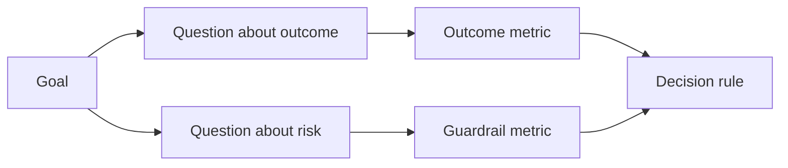

# परिणाम उत्पन्न होने से पहले डिजाइन सफलता सूचक

> मापने के संकेतकों को केवल उपकरण के रूप में सजावट के रूप में नहीं बल्कि कार्रवाई निर्णयों में सेवा करनी चाहिए।

**Type:** Learn + Build
**Languages:** Python (stdlib)
**Prerequisites:** Phase 14 lessons 47 and 51
**Time:** ~70 minutes

## 学习目标

- अपेक्षित परिणाम लक्ष्य से मूल प्रश्न और माप सूचकांक को आगे बढ़ाया जाए।
- वास्तविक परिणामों के अवलोकन से पहले, समय विंडो, डेटा स्रोत और अनुकूलन दिशा का पूर्वनिर्धारित करें।
- उत्पादन संकेत और देखभाल संकेत (Gardrails) तथा मापने के संकेत (Counter-metrics)
- इस निर्माण के लिए आवश्यक सहायता के लिए मूल्यांकन साक्ष्य को विशिष्ट निर्णयों के अनुरूप बनाना।

## 目標、問題與指标 (GQM)

से लक्ष्य (उत्पत्ति)

> संक्षिप्त स्थिति प्रभावित सेवा की आवश्यकता का समय, साथ ही किसी भी असुरक्षित संचालन में वृद्धि नहीं करता है।

推导出问题(प्रश्न):

- 定位正确服务 की गति कितनी तेज है?
- पॉइंट आउट सर्विस एक्सेसिबिलिटी दर कितनी है?
- क्या निदान प्रक्रिया हमेशा शुद्ध रूप से बनी रहती है?
- क्या इस कार्यप्रवाह ने सतर्कता को अक्सर अनदेखा या ऑपरेटर के बोझ को बढ़ा दिया है?

 तब चयन करेंगे ये समस्याएँ操作化 ऑपरेटिकेशन के सूचक मेट्रिक



## प्रत्येक सूचक को नियमन संधि की आवश्यकता होती है

प्रत्येक सूचक में निम्नलिखित होना चाहिएः

| 契约字段 | 示例 |
|---|---|
| 指标名称（Name） | `median_identification_seconds` |
| 方向（Direction） | 至多不超过（at most） |
| 阈值（Threshold） | 120 |
| 窗口（Window） | 10 次故障事件重放 |
| 数据源（Source） | 重放事件日志 |
| 统计样本（Population） | 参与试点的在岗工程师 |
| 类别（Kind） | 成果指标（outcome）或护栏指标（guardrail） |

यदि कोई डेटा स्रोत और सांख्यिकीय विंडो नहीं है, तो कोई भी संख्या प्रतिस्थापित नहीं की जा सकती है; यदि कोई पूर्वनिर्धारित मूल्य नहीं है, तो सूचक स्पष्ट निर्णय नहीं ले सकता है।

## 成果指标、护指标与衡量指标

- **成果指标（Outcome metric）：**ाशा है कि सुधार की स्थिति में सुधार होगा?
- **护栏指标（Guardrail）：**क्या निश्चित सुरक्षा रेखा एवं बाध्यता की शर्तें सदैव कायम रहेंगी?
- **制衡指标（Counter-metric）：**क्या स्थानीय अनुकूलन छिपी लागत या क्षति अन्य घटकों में स्थानांतरित हो जाएगा?

 दोषों के लिए, प्रकाश तेजी से पर्याप्त नहीं है  सटीकता दर, उत्पादन लेखन ऑपरेशन अवरुद्ध, ऑपरेटर कार्यभार और चेतावनी चूक दर, एक साथ मिलकर आपदाजनक गलत निष्कर्षों को जल्दी से रोकने के लिए सुरक्षा बाधाओं का निर्माण करते हैं

## 离线证据与在线证据

离线重放(ऑफलाइन रिप्ले) बहुत अनुकूल है परीक्षण可复现性与边缘场景覆盖率;受控试点(बंद पायलट)

始终选择能够支当前决策的最低成本证据――绝不能仅仅因为代码已经写好就商然将真实用户暴露于未知风险――

## पहले उपाय करने के लिए निर्णय

इसके बाद, टीम को मौजूदा निर्माण के लिए अस्थायी रूप से संशोधन करने की आवश्यकता होती है।

उदाहरण नियम:

- 通过(पास): सेवा निर्धारण सटीकता दर 0.9 से कम नहीं है, तथा निर्धारण समय व्यय मध्य संख्या 120 से अधिक नहीं है;
- 失败(Fail): किसी भी अवैध उत्पादन लेखन ऑपरेशन का होना, या 0.75 से कम की पोजिशनिंग सटीकता दर;
- 模糊(अस्पष्ट): प्रदर्शन में थोड़ी वृद्धि हुई है, लेकिन यह बहुत बड़ा है, इसलिए इसे पुनः परीक्षण करने की आवश्यकता है।

## 动手实现

इस प्रयोग में परिमाण योजना की पूर्णता का आकलन किया गया है, जिसमें सीमाओं के मूल्य शामिल हैं, रिकार्ड में कमी के संकेतकों का रिकॉर्ड किया गया है, और आउटपुट किया गया है।`outputs/measurement-report.json`

```bash
python3 code/main.py
python3 -m unittest discover code/tests -v
```

️️️️️️️️️️️️️️️️️️️️️️️️️️️️️️️️️️️️️️️️️️️️️️️️️️️️️️️️️️️️️️️️️️️️️️️️️️️️️️️️️️️️️️️️️️️️️️️️️️️️️️️️️️️️️️️️️️️️️️️️️️️️️️️️️️️️️️️️️️️️️️️️️️️️️️️️️️️️️️️️️️️️️️️️️️️️️️️️️️️️️️️️️️️️️️️️️️️️️️️️️️️️️️️️️️️️️️️️️️️️️️️️️️️️️️️️️️️️️️️️️️️️️️️️️️️️️️️️️️️️️️️️️️️️️️️️️️️️️️️️️️️️️️️️️️️️️️️️️️️️️️️️️️️️️️️️️️️️️️️️️️️️️️️️️️️️️️️️️️️️️️️️️️️️️️️️️️️️️️️️️️️️️️️️️️️️️️️️️️️️️️️️️️️️️️️️️️️️️️️️️️️️️️️️️️️️️️️️️️️️️️️️️️️️️️️️️️️️️️️️️️️️️️️️️️️️️️️️️️️️️️️️️️️️️️️️️️️️️️️️️️️️️️️️️️️️️️️️️️️️️️️️️️️️️

## 课后练习

1. एक ही उपलब्धि लक्ष्य से निकलकर तीन अलग-अलग मुख्य प्रश्नों का समाधान किया गया है।
2. 补一条能够捕获当前优化导致其他角色负担加重的衡量指标――
3. प्रत्येक सूचक के लिए अपने डेटा स्रोत, सांख्यिकीय नमूना समूह और समय विंडो को निर्दिष्ट करें।
4. वास्तविक संख्याओं के उत्पन्न होने से पहले, पूर्व लिखित में पारित 、 असफल और模糊三种情况下的决策──
5. एक आसान सांख्यिकीय, लेकिन किसी भी निर्णय के तरफा सूचक को बदलने में असमर्थ, उपयोग करेगा

## 延伸阅读

- [Basili, Software Modeling and Measurement: The Goal/Question/Metric Paradigm](https://drum.lib.umd.edu/items/8119803a-362b-42ec-b6ce-2311713e7236), परिचय कैसे एक निर्दिष्ट लक्ष्य से निष्पादित करने योग्य माप प्रणाली का निर्माण किया जा सकता है
- [Basili, Caldiera, and Rombach, The Goal Question Metric Approach](https://www.cs.toronto.edu/~sme/CSC444F/handouts/GQM-paper.pdf), इस पद्धति को निरंतर सुधार प्रणाली के साथ बंद चक्र के रूप में व्याख्या करेगा।

## 交付物沉

रखरखाव`outputs/measurement-report.json` यह मूल (प्रोटोटाइप) 试点 (पायलट)  उत्पादन (उत्पादन) चरण में प्रवेश करेगा
