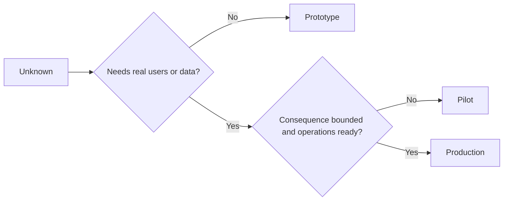

# 审慎择原型、试点还是生产

>  वे स्पष्ट रूप से भिन्न संज्ञानात्मक वातावरण का प्रतिनिधित्व करते हैं, न कि शुद्ध सटीकता अंतर ।

**Type:** Learn + Build
**Languages:** Python (stdlib)
**Prerequisites:** Phase 14 lessons 50 to 52
**Time:** ~70 minutes

## 学习目标

- अज्ञात प्रकार, दर्शकों की सीमा, डेटा संवेदनशीलता, परिणामों और परिपक्वता के अनुसार, सावधानीपूर्वक निर्माण चरण का चयन करें।
-  प्रत्येक चरण में विशेष नियंत्रण उपायों को विकसित करना
-  बिना किसी जिम्मेदारियों के मौलिक प्रणाली को उत्पादन प्रणाली में विकसित होने से रोकना
-  प्रमाण एवं运维保障充分就绪之前,推迟授予系统真实生产权──

## तीन अलग-अलग मूल प्रश्न

| 阶段 | 核心问题 |
|---|---|
| 原型（Prototype） | 该技术机制到底能不能产生预期的实证结果？ |
| 试点（Pilot） | 在受控真实受众与真实工况下，它能否安全稳定运行？ |
| 生产（Production） | 组织能否按照既定的可靠性与风险承诺，持续对该系统承担长期责任？ |

एक तकनीकी रूप से पूर्ण प्रोटोटाइप, अभी भी बाद में त्याग दिए गए अपशिष्ट के लिए डिज़ाइन किया जा सकता है; एक परीक्षण बिंदु वास्तविक उत्पादन डेटा का उपयोग कर सकता है, लेकिन इसके उपभोक्ता आकार और संचालन अधिकारों को सख्ती से सीमित किया जाना चाहिए; और केवल जब संगठन औपचारिक रूप से शामिल हो जाता है और दीर्घकालिक जिम्मेदारी लेता है, तो उत्पादन चरण वास्तव में शुरू होता है।

## मूल प्रकार

जब वास्तविक उपयोगकर्ता या वास्तविक उत्पादन डेटा को पेश करने की आवश्यकता नहीं है तो मूल चरणों का उपयोग करें।

- 随时可废弃 (डिस्कार्ड)
- 严格隔离(पृथक);
- 功能边界狭窄 (व्यवहार में संकीर्ण)
- 核心验证问题显式明确 (शिक्षा प्रश्न के बारे में स्पष्ट रूप से);
- न作假的运维稳定性承诺──

इस तंत्र को अगले चरण में प्रवेश करने के लायक साबित नहीं होने से पहले, पूरे सिस्टम संरचना को बहुत जल्दी अनुकूलित न करें।

## 试点阶段

जब अनजान परिकल्पनाओं को सत्यापित करने के लिए वास्तविक परिचालन व्यवहार, वास्तविक डेटा या वास्तविक कार्यप्रवाह पर निर्भर करना होगा, लेकिन परिणामों को नष्ट करने या परिपक्वता को पूरा करने के लिए पर्याप्त नहीं है, तो परीक्षण चरणों को अपनाएं।

एक योग्य परीक्षण में निम्नलिखित होना चाहिएः

- निर्धारित परीक्षण बिंदु;
- 明确 मानव संसाधन जिम्मेदार;
- चार्त्त्त्त्त्त्त्त्त्त्त्त्त्त्त्त्त्त्त्त्त्त्त्त्त्त्त्त्त्त्त्त्त्त्त्त्त्त्त्त्त्त्त्त्त्त्त्त्त्त्त्त्त्त्त्त्त्त्त्त्त्त्त्त्त्त्त्त्त्त्त्त्त्त्त्त्त्त्त्त्त्त्त्त्त्त्त्त्त्त्त्त्त्त्त्त्त्त्त्त्त्त्त्त्त्त्त्त्त्त्त्त्त्त्त्त्त्त्त्त्त्त्त्त्त्त्त्त्त्त्त्त्त्त्त्त्त्त्त्त्त्त्त्त्त्त्त्त्त्त्त्त्त्त्त्त्त्त्त्त्त्त्त्त्त्त्त्त्त्त्त्त्त्त्त्त्त्त्त्त्त्त्त्त्त्त्त्त्त्त्त्त्त्त्त्त्त्त्त्त्त्त्त्त्त्त्त्त्त्त्त्त्त्त्त्त्त्त्त्त्त्त्त्त्त्त्त्त्त्त्त्त्त्त्त्त्त्त्त्त्त्त्त्त्त्त्त्त्त्त्त्त्त्त्त्त्त्त्त्त्त्त्त्त्त्त्त्त्त्त्त्त्त्त्त्त्त्त्त्त्त्त्त्त्त्त्त्त्त्त्त्त्त्त्त्त्त्त्त्त्त्त्त्त्त्त्त्त्त्त्त्त्त्त्त्त्त्त्त्त्त्त्त्त्त्त्त्त्त्त्त्त्त्त्त्त्त्त्त्त्त्त्त्त्त्त्त्त्त्त्त्त्त्त्त्त्त्त्त्त्त्त्त्त्त्त्त्त्त्त्त्त्त्त्त्त्त्त्त्त्त्त्त्त्त्त्त्त्त्त्त्त्त्त्त्त्त्त्त्त्त्त्त्त्त्त्त्त्त्त्त्त्त्त्त्त्त्त्त्त्त्त्त्त्त्त्त्त्त्त्त्त्त्त्त्त्त्त्त्त्त्त्त्त्त्त्त्त्त्त्त्त्त्त्त्त्त्त्त्त्त्त्त्त्त्त्त्त्त्त्त्त्त्त्त्त्त्त्त्त्त्त्त्त्त्त्त्त्त्त्त्त्त्त्त्त्त्त्त्त्त्त्त्त्त्त्त्त
- 审计追溯与快速回滚方案;
- 成果指标与护指标值;
- स्पष्ट विस्तार, संशोधन या पूर्ण समाप्ति के लिए वापसी के नियम

## उत्पादन चरण

उत्पादन चरण केवल कोड को पूरा करने के लिए तैनात करने के बराबर नहीं हैः

- 明确的服务等级目标(SLO);
- 值班排班与故障事件处理责任人;
- सुरक्षा एवं गोपनीयता पर विशेष समीक्षा;
- व्युत्पन्न ऊपरी सीमा और संचलन क्षमता नियंत्रण;
- पूर्ण रिलॉलिंग एवं रिकवरी तंत्र;
- 7x24 小时全天候监控;
- 清晰的退役与下线路径──



## 阶段漂移陷

जब मूल कोड वास्तविक उपयोगकर्ता, संवेदनशील डेटा या कोर ऑपरेटिंग अधिकार प्राप्त करता है, तो यह बहुत खतरनाक हो जाता है।**阶段漂移（Stage Drift）** सिस्टम विनियोजन, अधिकार नियंत्रण, दूर परीक्षण संकेतकों तथा वास्तुकला दस्तावेजों में अनिवार्य रूप से मूल और परीक्षण के कठोरता सीमाओं को निर्धारित करना केवल इंटरफ़ेस पर एक  परीक्षण संस्करण चेतावनी को लटका देना है कि यह बहुत दूर पर्याप्त नहीं है

 प्रणाली के चरणों में, सिस्टम के संचालन की स्थिति में ही सीधे निरीक्षण और परीक्षण करने में सक्षम होना चाहिए

## 动手实现

इस प्रयोग के आधार पर निर्णय पर निम्नलिखित स्वचालित रूप से उपयुक्त चरणों का सुझाव दिया गया, प्रत्येक चरण में आवश्यक आवश्यक नियंत्रण उपायों को वापस किया गया,并输出 `outputs/stage-decisions.json`

```bash
python3 code/main.py
python3 -m unittest discover code/tests -v
```

 कम विनाशकारी परिणामों के लिए परीक्षण उदाहरण को संशोधित करना और परिपक्वता के लिए काम करना── विचार और व्याख्या को भी कुछ पहचान प्रमाणों को पूरक करने की आवश्यकता है, ताकि यह साबित हो सके कि यह औपचारिक रूप से उन्नत उत्पादन चरण में सक्षम है──

## 课后练习

1. ज्ञान खोज चरण के अनुसार, आपके सिर पर तीन मौजूदा परियोजनाओं को पुनः वर्गीकृत करना है।
2.  निर्णय समाप्त करने के लिए  निर्णय लेने के लिए  निर्णय लेने के लिए  निर्णय लेने के लिए  निर्णय लेने के लिए  निर्णय लेने के लिए  निर्णय लेने के लिए  निर्णय लेने के लिए  निर्णय लेने के लिए  निर्णय लेने के लिए  निर्णय लेने के लिए  निर्णय लेने के लिए  निर्णय लेने के लिए  निर्णय लेने के लिए  निर्णय लेने के लिए  निर्णय लेने के लिए  निर्णय लेने के लिए  निर्णय लेने के लिए  निर्णय लेने के लिए  निर्णय लेने के लिए  निर्णय लेने के लिए  निर्णय लेने के लिए  निर्णय लेने के लिए  निर्णय लेने के लिए  निर्णय लेने के लिए  निर्णय लेने के लिए  निर्णय लेने के लिए  निर्णय लेने के लिए  निर्णय लेने के लिए  निर्णय लेने के लिए 
3. एक तकनीकी नियंत्रण उपाय बढ़ाकर, मूल रूप से प्रोटोटाइप कोड को उत्पादन पर्यावरण डेटा से संपर्क में आने से रोकें
4. पहली चिह्नों को ढूंढना प्रणाली वास्तव में उत्पादन स्तर की जिम्मेदारी के लिए स्थानांतरित करने के लिए
5. सीमित परीक्षण बिंदु डिजाइन एक पूर्ण सेट के लिए

## 延伸阅读

- [Barry Boehm, A Spiral Model of Software Development and Enhancement](https://dl.acm.org/doi/10.1145/12944.12948), यह पता लगाने के लिए कि प्रत्येक पीढ़ी के संसाधनों को निवेश के लिए पहले से ही हल किए गए जोखिमों के स्तर के साथ कैसे मेल खाता है।
- [Fagerholm et al., Building Blocks for Continuous Experimentation](https://doi.org/10.1145/2601248.2601276), , , , , , , , , , , , , , , , , , , , , , , , , , , , , , , , , , , , , , , , , , , , , , , , , , , , , , , , , , , , , , , , , , , , , , , , , , , , , , , , , , , , , , , , , , , , , , , , , , , , , , , , , , , , , , , , , , , , , , , , , , , , , , , , , , , , , , , , , , , , , , , , , , , , , , , , , , , , , , , , , , , , , , , , , , , , , , , , , , , , , , , , , , , , , , , , , , , , , , , , , , , , , , , , , , , , , , , , , , , , , , , , , , , , , , , , , , , , , , , , , , , , , , , , , , , , , , , , , , , , , , , , , , , , , , , , , , , , , , , , , , , , , , , , , , , , , , , , , , , , , , , , , , , , , , , , , , , , , , , , , , , , , , , , , , , , , , , , , , , , , , , , , , , , , , , , , , , , , , , , , , , , , , , , , , , , , , , , , , , , , , , , , , , , , , , , , , , , , , , , , , , , , , , , , , , , , , , , , , , , , , , , , , , , , , , , , , , , , , , , , , , , , , , , , , , , , , , , , , , , , , , , , , , , , , , , , , , , , , , , , , , , , , , , , , , , , , , , , , , , , , , , , , , , , ,

## 交付物沉

रखरखाव`outputs/stage-decisions.json`यह दस्तावेज में बताया गया है कि प्रत्येक चरण के लिए तर्क क्यों चुना गया और अगले चरण में प्रवेश करने से पहले लागू किए जाने वाले विभिन्न नियंत्रण उपायों को क्यों चुना गया।
