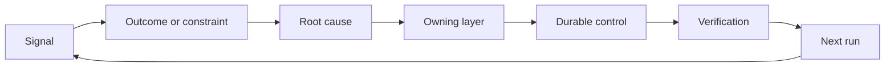

# सहायता एवं विस्थापन तंत्र के निर्माण के लिए

> कोड प्रकाशन ने वर्तमान निर्माण चक्र को समाप्त कर दिया, साथ ही एक दीर्घकालिक सीखने चक्र को शुरू किया।

**Type:** Learn + Build
**Languages:** Python (stdlib)
**Prerequisites:** Phase 14 lessons 46 and 53
**Time:** ~75 minutes

## 学习目标

- अपघटन घटनाओं, समीक्षा डेटा, उपयोगकर्ता व्यवहार और सुधारों को जिम्मेदारियों से संबंधित कार्यों में परिवर्तित करना
- विभिन्न संकेतों को सटीक रूप से परिभाषित करने के लिए निम्नलिखित से नीचे दिए गए संदेशों को परिभाषित करें, समीक्षाओं को एकत्र करें, सुरक्षा रणनीति, संचालन समय या आवश्यकताओं को पूरा करें।
- पुनरावृत्ति जोखिम के लिए गंभीरता एवं पुनरावृत्ति के आधार पर प्राथमिकता वर्गीकरण किया जाना चाहिए।
- प्रत्येक प्रणाली नियंत्रण तंत्र में सेवानिवृत्ति की शर्तें निर्धारित की जाती हैं।

## स्वयं भी बुनियादी ढांचा है

एक टीम बड़ी संख्या में सिस्टम लिंक ट्रैकिंग (ट्रेस) ✓ ✓ ✓ ✓ ✓ ✓ ✓ ✓ ✓ ✓ ✓ ✓ ✓ ✓ ✓ ✓ ✓ ✓ ✓ ✓ ✓ ✓ ✓ ✓ ✓ ✓ ✓ ✓ ✓ ✓ ✓ ✓ ✓ ✓ ✓ ✓ ✓ ✓ ✓ ✓ ✓ ✓ ✓ ✓ ✓ ✓ ✓ ✓ ✓ ✓ ✓ ✓ ✓ ✓ ✓ ✓ ✓ ✓ ✓ ✓ ✓ ✓ ✓ ✓ ✓ ✓ ✓ ✓ ✓ ✓ ✓ ✓ ✓ ✓ ✓ ✓ ✓ ✓ ✓ ✓ ✓ ✓ ✓ ✓ ✓ ✓ ✓ ✓ ✓ ✓ ✓ ✓ ✓ ✓ ✓ ✓ ✓ ✓ ✓ ✓ ✓ ✓ ✓ ✓ ✓ ✓ ✓ ✓ ✓ ✓ ✓ ✓ ✓ ✓ ✓ ✓ ✓ ✓ ✓ ✓ ✓ ✓ ✓ ✓ ✓ ✓ ✓ ✓ ✓ ✓ ✓ ✓ ✓ ✓ ✓ ✓ ✓ ✓ ✓ ✓ ✓ ✓ ✓ ✓ ✓ ✓ ✓ ✓ ✓ ✓ ✓ ✓ ✓ ✓ ✓ ✓ ✓ ✓ ✓ ✓ ✓ ✓ ✓ ✓ ✓ ✓ ✓ ✓ ✓ ✓ ✓ ✓ ✓ ✓ ✓ ✓ ✓ ✓ ✓ ✓ ✓ ✓ ✓ ✓ ✓ ✓ ✓ ✓ ✓ ✓ ✓ ✓ ✓ ✓ ✓ ✓ ✓ ✓ ✓ ✓ ✓ ✓ ✓ ✓ ✓ ✓ ✓ ✓ ✓ ✓ ✓ ✓ ✓ ✓ ✓ ✓ ✓ ✓ ✓ ✓ ✓ ✓ ✓ ✓ ✓ ✓ ✓ ✓ ✓ ✓ ✓ ✓ ✓ ✓ ✓ ✓ ✓ ✓ ✓ ✓ ✓ ✓ ✓ ✓ ✓ ✓ ✓ ✓ **晋级通道（Promotion）**: अर्थात्, निरीक्षण तथ्यों से लेकर स्पष्ट दायित्व वाले व्यक्तियों तक सत्यापन प्रमाणों के स्थायित्व प्रणाली में परिवर्तन के निश्चित मार्गों तक।

प्रतिक्रिया रत्चेट) का समापन चक्र है:

1. 观测到具体实测信号;
2. इसके संबंध में अपेक्षित उत्पादन परिणाम, बाध्यकारी शर्त या पूर्व निर्धारित परिकल्पना;
3. इस कारण से जिम्मेदारियों को संभालने के लिए सबसे निचले सिस्टम स्तर की पहचान करना;
4. 实施受控的持久化改进;
5. 验证 इस दुर्घटना के पुनरावृत्ति की संभावना को कम कर दिया गया है;
6. 定期复审该控制机制是否应继续保留──

## 精准路由至应对责任层

| 信号类型 | 归属目的地 |
|---|---|
| 误报、功能倒退、错误输出结果 | 评测集（Evaluation）或自动化测试 |
| 上下文缺失、重复劳动、过时事实 | 上下文数据源或检索路由策略 |
| 不安全操作或越权漏洞 | 安全策略（Policy）或权限硬边界 |
| 超时、重试风暴、依赖服务不可用 | 运行时控制（Runtime Control） |
| 新的产品需求或尚未决断的权衡取舍 | 经过规范成型（Shaped）的待办项 |

जब स्वचालित परीक्षण या कठोरता की सीमाएं पूरी तरह से त्रुटि को अक्षम करने के लिए पर्याप्त हों, तो शीघ्र में एक और अनुच्छेद जोड़ने की आवश्यकता नहीं है।



##  जिम्मेदारी स्वयं नियंत्रण तंत्र का हिस्सा है

प्रत्येक चरण में निम्नलिखित तत्वों का स्पष्ट रूप से निहित होना चाहिएः

- 唯一的人类责任人 (अन्यथा)
- षण्ण परिणाम और पुनरावृत्ति आवृत्ति के समग्र मूल्यांकन के आधार पर प्राथमिकता;
- 拟修改的目标系统组件 (आर्टिफैक्ट)
- ⇒ संशोधित वास्तविक प्रभाव के प्रमाणन कार्यक्रम का प्रमाणन करना;
- 复审 या स्वचालित विफलता विंडो;
- 明确的退役条件(सेवानिवृत्ति की शर्त)

एक अज्ञानी तथाकथित सुधार योजना, जिसका मात्रा केवल एक खंड है।

## 果断退役过时的控制机制

विपक्ष में लगातार जमा होने वाली रणनीति और नियंत्रण की व्यवस्थाएं हैं, जो कि परस्पर विरोधी और लागत प्रभावी हो सकती हैं। निम्नलिखित मामलों में, नियंत्रण तंत्र को सक्रिय रूप से समीक्षा और निष्कासन किया जाना चाहिएः

-  सिस्टम संरचना या व्यावसायिक कार्यप्रवाह में मौलिक परिवर्तन हुआ है;
- नीचे की परत के अपरिवर्तनीय तंत्र ने ऊपर की परत के अक्षर निर्देशों को पूरी तरह से बदल दिया है;
- पूर्व निर्धारित समय के भीतर, पूर्वोत्तर दोष कभी फिर से नहीं दिखाई देता है;
- नियंत्रण नियम सामान्य व्यापार के विकास की आवृत्ति को रोकते हुए, इसके प्रतिरक्षा के लाभों से अधिक हो गए हैं।

退役控制项 भी आवश्यक है, केवल इसलिए नहीं कि  लग रहा है वर्ष बहुत लंबे समय से 

## 打通 उत्पाद निर्माण तथा कोडिंग एजेंट का प्रति समापन

एक ही टक्कर तंत्र उत्पाद व्यवसाय और बुद्धिमान विकास दोनों पर एक साथ सेवा दे सकता हैः

- 产品业务实证驱动预期产出框架、假设图谱、最小切片或量度计划的发展;
- कोडिंग एजेंट के संचालन को सुधारने या स्वचालित स्वचालित परीक्षणों को अनुकूलित करने के लिए;
- 线上真故障既能促成产品功能边界调整,也能促成代理工作台的加固──

यह भी यही कारण है कि कार्य ढांचे का सिद्धांत कोड से पहले घोषित होने के अंत में नहीं है, बल्कि यह प्रत्येक बार सिस्टम द्वारा स्वीकार किए जाने वाले परिवर्तनों में से एक है।

## 动手实现

इस प्रयोग में प्रयोगात्मक संकेतों को वर्गीकृत किया गया, जो कि प्राथमिकता के अनुसार क्रमबद्ध, और आउटपुट के आधार पर जिम्मेदारियों के साथ कार्यवाही की योजना बनाई गई है।`outputs/feedback-backlog.json`

```bash
python3 code/main.py
python3 -m unittest discover code/tests -v
```

尝试添加一个运行时超时信号,验证它将被正确路由至运行时控制层,而不是泛化混入通用需求等待列表

## 课后练习

1. एक साथ हालिया त्रुटियों और एक उपयोगकर्ता वास्तविक शिकायत, अलग अलग रूप से विशिष्ट टर्नर एक्शन में परिवर्तित हो गया।
2. यह पहचानना कि यह मूलतः से इसके पुनः प्रकोप को रोकने में सक्षम है।
3. प्रयोगों के निष्पादन के लिए कार्रवाई के लिए पूरक वास्तविक रूप से व्यवहार्य स्वचालन सत्यापन आदेश या अवलोकन संकेतकों।
4. एक मौजूदा सुरक्षा रणनीति के नियमों के अनुसार स्पष्ट वापसी की शर्तें निर्धारित की जाएंगी।
5. एक प्रणाली द्वारा प्राप्त एक सुधारात्मक प्रशिक्षण को, अनुवर्ती अनुवर्ती और अगले कार्य ढांचे में एकीकृत करना

## 延伸阅读

- [Basili, Caldiera, and Rombach, The Goal Question Metric Approach](https://www.cs.toronto.edu/~sme/CSC444F/handouts/GQM-paper.pdf), उद्देश्य-निर्देशित माप तंत्र के माध्यम से संगठन स्तर पर निरंतर संज्ञानात्मक भार को प्राप्त करने का तरीका पता लगाने के लिए।
- [Fagerholm et al., Building Blocks for Continuous Experimentation](https://doi.org/10.1145/2601248.2601276), सैद्धांतिक साक्ष्य और उत्पादों के निरंतर विकास से जुड़े प्रौद्योगिकी और संगठन के लिए एक ठोस आधार होगा।
- [Nuseibeh and Easterbrook, Requirements Engineering: A Roadmap](https://www.cs.toronto.edu/~sme/papers/2000/ICSE2000.pdf), आवश्यकता को पूरे सिस्टम जीवन चक्र में गतिशीलता के विकास के लिए इंजीनियरिंग दृष्टिकोण के रूप में व्याख्या करेगा।

## 交付物沉

रखरखाव`outputs/feedback-backlog.json` यह  उत्पाद निर्णय शक्ति और वितरण उत्पाद निर्णय और वितरण सीखने के मार्ग के संकुचित उत्पाद है, यह भी अगले एक पूर्वानुमान उत्पादन और वितरण ढांचे के प्रवेश और प्रारंभ बिंदु को खोलता है
