# 通信协议

> एक ही भाषा में बोलने वाले कर्मचारी एक टीम नहीं हैं। वे अजनबियों के प्रति अजनबी हैं जो खाली चिल्लाते हैं।

**Type:** Build
**Languages:** TypeScript
**Prerequisites:** 第 14 阶段（代理工程），第 16.01 课（为什么使用多代理）
**Time:** ~120 分钟

## 学习目标

-                                                                                                                                                                                                                                                                                                                                                                                                                                                                                                                              
-  ए 2 ए एजेंट कार्ड और मिशन टेंपॉइंट का निर्माण, एक एजेंट को HTTP के माध्यम से काम सौंपने की अनुमति दें
- तुलना MCP (उद्यम का दौरा) ✓A2A (उपयोगकर्ता) ✓ACP (उपयोगकर्ता) ✓ उद्यम लेखा परीक्षा) और ANP (उपयोगकर्ता) ✓एन्कार्ड करें
- एक प्रणाली में कई प्रोटोकॉल कनेक्ट करने के लिए, एमसीपी के माध्यम से एजेंटों को खोजने के लिए उपकरण और ए 2 ए के माध्यम से कार्य करने के लिए

## 问题

您将系统分为多个代理人――研究员――编辑员――审阅员――他们非常擅长自己的个人工作――但是现在你需要他们真正交谈――

您的第一次尝试很明显:传递字串──研究人员回归一团文本,编码器尽可能解析它──它一直有效,直到编码员误解研究摘要,或者两个代理陷入等待对方的局,或者您需要由不同团队构建的代理合作──突然,只传递字串就崩了──

यह संचार समझौते का प्रश्न है। यदि आप एजेंटों के साथ सूचना के आदान-प्रदान के बारे में साझा समझौते के बिना, बहु-एजेंट प्रणाली कमजोर है, अवरुद्ध है और आपके द्वारा लिखित कुछ एजेंटों के अलावा विस्तार करना असंभव है।

मानव बुद्धि पारिस्थितिकी तंत्र ने चार प्रकार के प्रोटोकॉल का जवाब दिया है, प्रत्येक प्रोटोकॉल ने विभिन्न भागों को हल किया हैः

- **MCP**उपयोग करने के लिए उपकरण
- **A2A**एजेंटों के बीच सहयोग के लिए
- **ACP**उद्यम लेखांकन के लिए
- **ANP**उन्मुखता और विश्वास के लिए

यह सबक बहुत गहरा है। आप प्रत्येक नियम से वास्तविक लाइन-आउट प्रारूप को पढ़ेंगे, निर्माण कार्य को पूरा करेंगे, और सभी चार को एक एकीकृत प्रणाली में जोड़ा जाएगा।

## 概念

### 协议格局

इन चारों को एक स्तर में ले जाने से प्रत्येक स्तर अलग-अलग समस्या का समाधान करेगा।

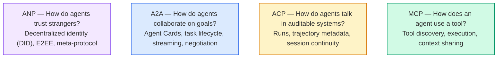

वे प्रतिस्पर्धी नहीं हैं। वे विभिन्न स्तरों पर विभिन्न समस्याओं का समाधान करते हैं।

### MCP(回顾)

एमसीपी ने 13वें चरण में गहन परिचय दिया।**客户端-服务器**协议,代理(客户端) पाया并调用服务器公开的工具──

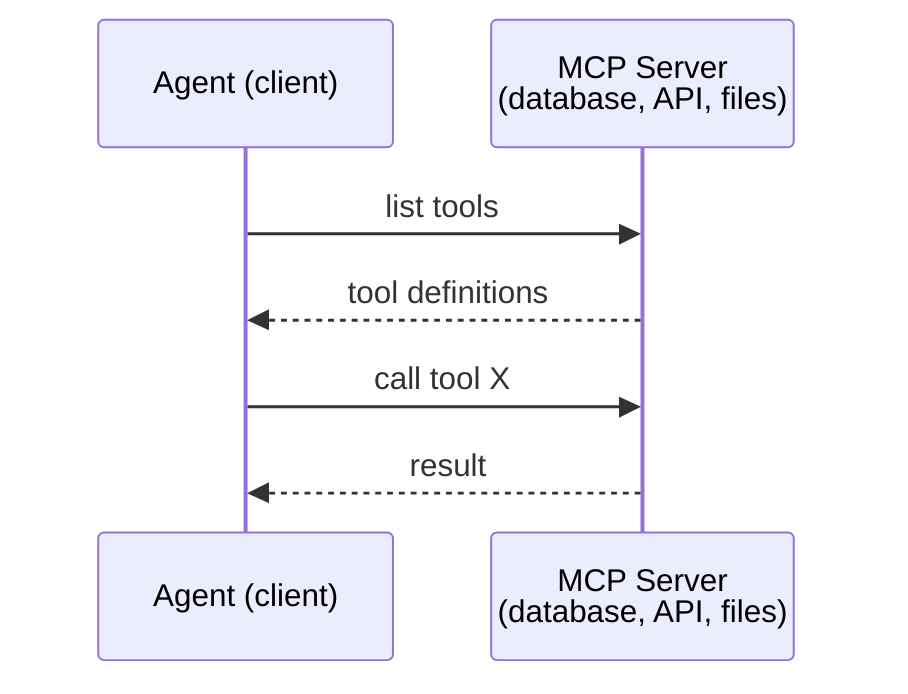

एमसीपी**代理到工具**通信── यह एक दूसरे के बीच बातचीत करने में मदद नहीं करता──

### A2A(एजेंट2एजेंट 协议)

**创建者：**गूगल (Google) अब लिनक्स के निवासी है।`lf.a2a.v1`)
**规格版本：**1.0.0
**问题：**स्व-अभिनय कैसे एक-दूसरे के साथ सहयोग, परामर्श और कार्य करने के लिए?

A2A है**点对点代理协作**MCP उपकरण से संपर्क करेगा, जबकि A2A अन्य एजेंटों से संपर्क करेगा। प्रत्येक एजेंट एक को सभी के लिए ज्ञात URL पर प्रकाशित करेगा।**代理卡**, अन्य एजेंटों को यह पता चलेगा कि यह इसके साथ परामर्श करता है और अपने कार्यकारी कार्य को सौंपता है।

#### A2A का संचालन विधि

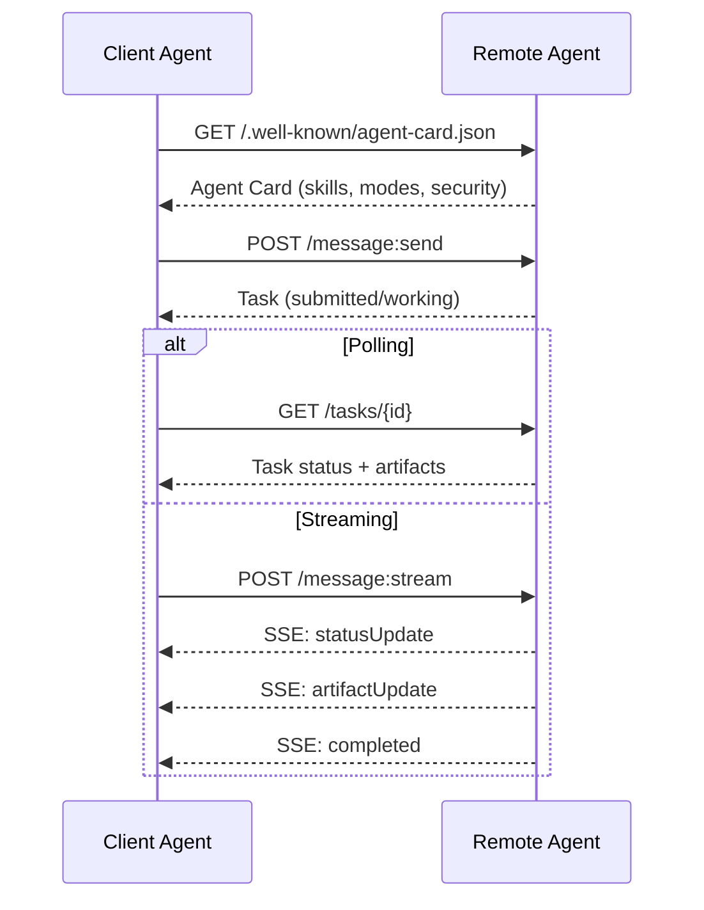

#### असली ट्रेड कार्ड

यह A2A विशेष कार्यकारिणी का वास्तविक रूप है।`GET /.well-known/agent-card.json`:

```json
{
  "name": "Research Agent",
  "description": "Searches documentation and summarizes findings",
  "version": "1.0.0",
  "supportedInterfaces": [
    {
      "url": "https://research-agent.example.com/a2a/v1",
      "protocolBinding": "JSONRPC",
      "protocolVersion": "1.0"
    },
    {
      "url": "https://research-agent.example.com/a2a/rest",
      "protocolBinding": "HTTP+JSON",
      "protocolVersion": "1.0"
    }
  ],
  "provider": {
    "organization": "Your Company",
    "url": "https://example.com"
  },
  "capabilities": {
    "streaming": true,
    "pushNotifications": false
  },
  "defaultInputModes": ["text/plain", "application/json"],
  "defaultOutputModes": ["text/plain", "application/json"],
  "skills": [
    {
      "id": "web-research",
      "name": "Web Research",
      "description": "Searches the web and synthesizes findings",
      "tags": ["research", "search", "summarization"],
      "examples": ["Research the latest changes in React 19"]
    },
    {
      "id": "doc-analysis",
      "name": "Documentation Analysis",
      "description": "Reads and analyzes technical documentation",
      "tags": ["docs", "analysis"],
      "inputModes": ["text/plain", "application/pdf"],
      "outputModes": ["application/json"]
    }
  ],
  "securitySchemes": {
    "bearer": {
      "httpAuthSecurityScheme": {
        "scheme": "Bearer",
        "bearerFormat": "JWT"
      }
    }
  },
  "security": [{ "bearer": [] }]
}
```

需要注意的关键事项:
- **技能**यह एक ऐसी चीज है जो एक व्यापारी कर सकता है। प्रत्येक में आईडी, टैग और समर्थन की एक MIME प्रकार की इनपुट/आउटपुट है। यह ग्राहक एजेंट का निर्णय है कि क्या यह दूरस्थ एजेंट अपनी अनुरोधों को संभाल सकता है।
- **supportedInterfaces**列出多个协议绑定;; एकल एजेंट एक साथ JSON-RPC、REST 和 gRPC 
- **安全**अंदर ही अंदर ही अंदर ही अंदर ही अंदर ही अंदर ही अंदर ही अंदर ही अंदर ही अंदर ही अंदर ही अंदर ही अंदर ही अंदर ही अंदर ही अंदर ही अंदर ही अंदर ही अंदर ही अंदर ही अंदर ही अंदर ही अंदर ही अंदर ही अंदर ही अंदर ही अंदर ही अंदर ही अंदर ही अंदर ही अंदर ही अंदर ही अंदर ही अंदर ही अंदर ही अंदर ही अंदर ही अंदर ही अंदर ही अंदर ही अंदर ही अंदर ही अंदर ही अंदर ही अंदर ही अंदर ही अंदर ही अंदर ही अंदर ही अंदर ही अंदर ही अंदर ही अंदर ही अंदर ही अंदर ही अंदर ही अंदर ही अंदर ही अंदर ही अंदर ही अंदर ही अंदर ही अंदर ही अंदर ही अंदर ही अंदर ही अंदर ही अंदर ही अंदर ही अंदर ही अंदर ही अंदर ही अंदर ही अंदर ही अंदर ही अंदर ही अंदर ही अंदर ही अंदर ही अंदर ही अंदर ही अंदर ही अंदर ही अंदर ही अंदर ही अंदर ही अंदर ही अंदर ही अंदर ही अंदर ही अंदर ही अंदर ही अंदर ही अंदर ही अंदर ही अंदर ही अंदर ही अंदर ही अंदर ही अंदर ही अंदर ही अंदर ही अंदर ही अंदर ही अंदर ही अंदर ही अंदर ही अंदर ही अंदर ही अंदर ही अंदर ही अंदर ही अंदर ही अंदर ही अंदर ही अंदर ही अंदर ही अंदर ही अंदर ही अंदर ही अंदर ही अंदर ही अंदर ही अंदर ही अंदर ही अंदर ही अंदर ही अंदर ही अंदर ही अंदर ही अंदर ही अंदर ही अंदर ही अंदर ही अंदर ही अंदर ही अंदर ही अंदर ही अंदर ही अंदर ही अंदर ही अंदर ही अंदर ही अंदर ही अंदर ही अंदर ही अंदर ही अंदर ही अंदर ही अंदर ही अंदर ही अंदर ही अंदर ही अंदर ही अंदर ही अंदर ही ही अंदर ही अंदर ही अंदर ही अंदर ही अंदर ही अंदर ही अंदर ही अंदर ही अंदर ही अंदर ही अंदर ही अंदर ही अंदर ही अंदर ही अंदर ही अंदर ही अंदर ही अंदर ही अंदर ही अंदर ही अंदर ही अंदर ही अंदर ही अंदर ही अंदर ही अंदर ही अंदर ही अंदर ही अंदर ही अंदर ही अंदर ही अंदर ही अंदर ही अंदर ही अंदर ही अंदर ही अंदर ही अंदर ही अंदर ही अंदर ही अंदर ही अंदर ही अंदर ही अंदर ही अंदर ही अंदर ही अंदर ही अंदर ही अंदर ही अंदर ही अंदर ही अंदर ही अंदर ही अंदर ही अंदर ही अंदर ही अंदर ही अंदर ही अंदर ही अंदर ही अंदर ही अंदर ही अंदर ही अंदर ही अंदर ही अंदर ही अंदर ही अंदर ही अंदर ही अंदर ही अंदर ही अंदर ही अंदर ही अंदर ही अंदर ही अंदर ही अंदर ही अंदर ही अंदर ही अंदर ही अंदर ही अंदर ही अंदर ही अंदर ही अंदर ही अंदर ही अंदर ही अंदर ही अंदर ही अंदर ही अंदर ही अंदर ही अंदर ही अंदर ही अंदर ही अंदर ही अंदर ही अंदर ही अंदर

#### 任务生命周期

任务是A2A के भीतर के केंद्रीय कार्य इकाईएँ.

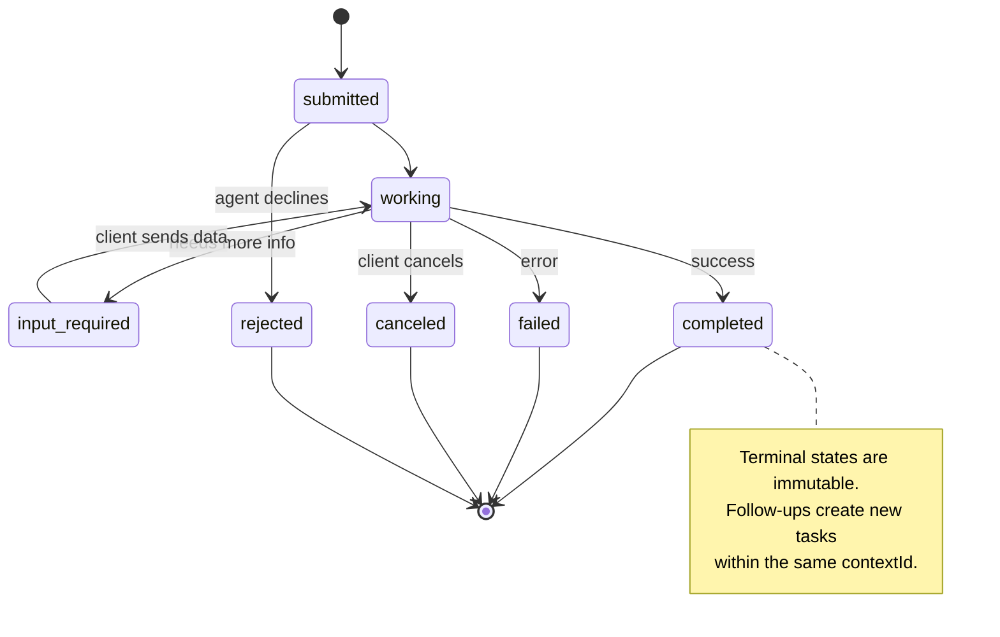

सभी 8 स्टेटस`UNSPECIFIED`作为哨兵,这里省略):

|状态|终端？ |意义|
|---|---|---|
| `TASK_STATE_SUBMITTED` |没有 |已确认，尚未处理 |
| `TASK_STATE_WORKING` |没有 |正在积极处理中 |
| `TASK_STATE_INPUT_REQUIRED` |没有 |代理需要客户提供更多信息 |
| `TASK_STATE_AUTH_REQUIRED` |没有 |需要认证 |
| `TASK_STATE_COMPLETED` |是的 |顺利完成 |
| `TASK_STATE_FAILED` |是的 |已完成但有错误 |
| `TASK_STATE_CANCELED` |是的 |完成前取消 |
| `TASK_STATE_REJECTED` |是的 |特工拒绝了任务|

एक बार जब कोई कार्य अंतिम स्थिति पर पहुंच जाता है, तो यह अपरिवर्तनीय होता है।`contextId`एक नया कार्य बनाना।

#### एक लाइन प्रारूप

A2A JSON-RPC 2.0 का उपयोग करकेः

**客户端发送任务：**
```json
{
  "jsonrpc": "2.0",
  "id": 1,
  "method": "SendMessage",
  "params": {
    "message": {
      "messageId": "msg-001",
      "role": "ROLE_USER",
      "parts": [{ "text": "Research React 19 compiler features" }]
    },
    "configuration": {
      "acceptedOutputModes": ["text/plain", "application/json"],
      "historyLength": 10
    }
  }
}
```

**代理响应任务：**
```json
{
  "jsonrpc": "2.0",
  "id": 1,
  "result": {
    "task": {
      "id": "task-abc-123",
      "contextId": "ctx-xyz-789",
      "status": {
        "state": "TASK_STATE_COMPLETED",
        "timestamp": "2026-03-27T10:30:00Z"
      },
      "artifacts": [
        {
          "artifactId": "art-001",
          "name": "research-results",
          "parts": [{
            "data": {
              "findings": [
                "React 19 compiler auto-memoizes components",
                "No more manual useMemo/useCallback needed",
                "Compiler runs at build time, not runtime"
              ]
            },
            "mediaType": "application/json"
          }]
        }
      ]
    }
  }
}
```

**通过 SSE 流式传输：**
```text
POST /message:stream HTTP/1.1
Content-Type: application/json
A2A-Version: 1.0

data: {"task":{"id":"task-123","status":{"state":"TASK_STATE_WORKING"}}}

data: {"statusUpdate":{"taskId":"task-123","status":{"state":"TASK_STATE_WORKING","message":{"role":"ROLE_AGENT","parts":[{"text":"Searching documentation..."}]}}}}

data: {"artifactUpdate":{"taskId":"task-123","artifact":{"artifactId":"art-1","parts":[{"text":"partial findings..."}]},"append":true,"lastChunk":false}}

data: {"statusUpdate":{"taskId":"task-123","status":{"state":"TASK_STATE_COMPLETED"}}}
```

### ACP (उपयोगी संचार समझौता)

**创建者：**आईबीएम / बीआईएआई
**规范版本：**0.2.0 (OpenAPI 3.1.1)
**状态：**合并到Linux 基金会 के अंतर्गत A2A
**问题：** पूर्ण रूप से सत्यापित, बैठक निरंतरता और ट्रैक ट्रैकिंग के साथ संचार कैसे करें?

ACP**企业协议** कई संक्षिप्त कथनों के विपरीत,एसीपी **不**JSON-LD का उपयोग करें। यह OpenAPI द्वारा परिभाषित सरल REST/JSON API में है। इसकी विशेषता यह है कि**TrajectoryMetadata**: प्रत्येक प्रतिनिधि प्रतिक्रिया को उसके निर्माण के लिए ले जाया जा सकता है

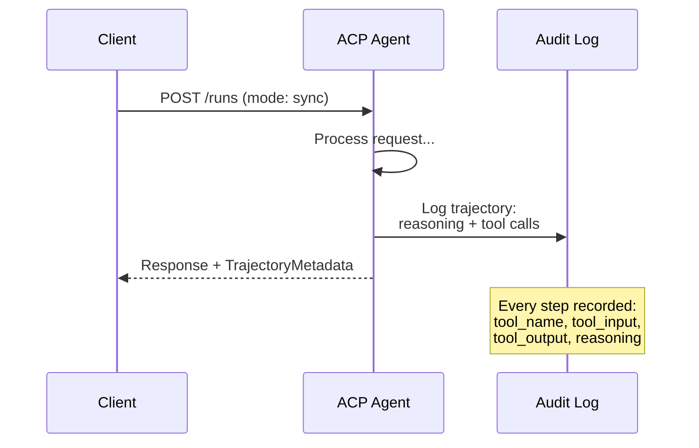

#### एसीपी के बीच के एजेंटों की खोज

एसीपी ने चार प्रकार की खोज पद्धति को परिभाषित किया हैः

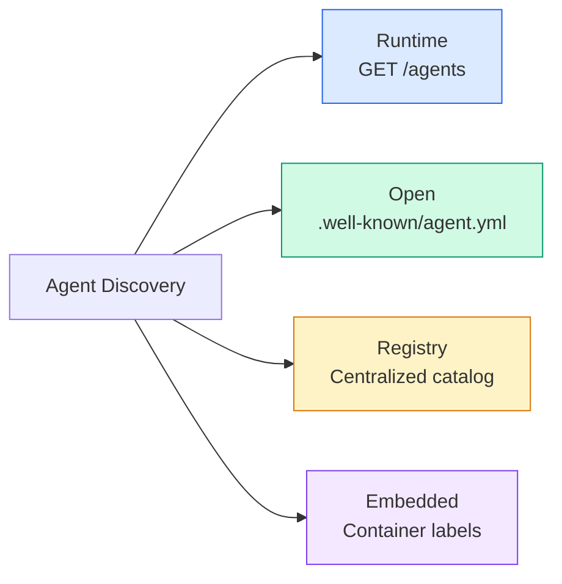

**AgentManifest**A2A के एजेंट कार्ड से सरलः

```json
{
  "name": "summarizer",
  "description": "Summarizes documents with source citations",
  "input_content_types": ["text/plain", "application/pdf"],
  "output_content_types": ["text/plain", "application/json"],
  "metadata": {
    "tags": ["summarization", "RAG"],
    "framework": "BeeAI",
    "capabilities": [
      {
        "name": "Document Summarization",
        "description": "Condenses long documents into key points"
      }
    ],
    "recommended_models": ["llama3.3:70b-instruct-fp16"],
    "license": "Apache-2.0",
    "programming_language": "Python"
  }
}
```

#### 运行 जीवन चक्र

कार्य करने के लिए एसीपी के बजाय कार्य करने के लिए तीन प्रकार के कार्यकारी कार्य हैं।

|模式|行为 |
|---|---|
| `sync` |阻塞。响应包含完整的结果。 |
| `async` |立即返回 202。轮询 `GET /runs/{id}` 的状态。 |
| `stream` | SSE 流。事件在代理工作时触发。 |

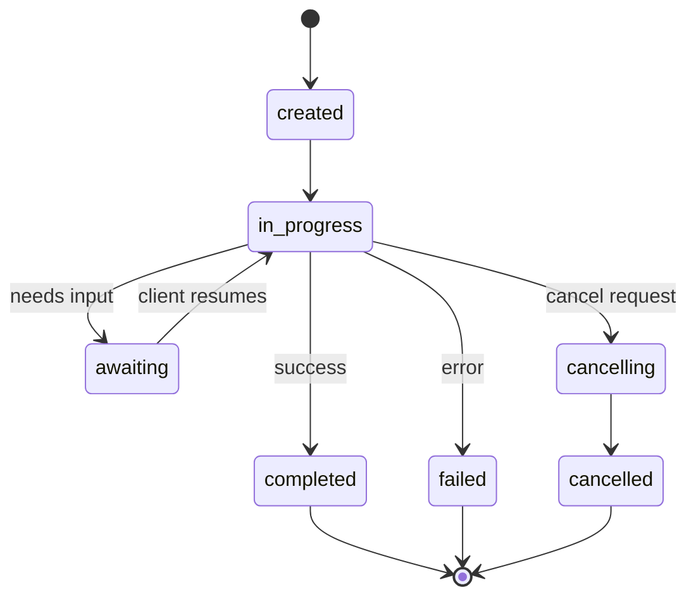

#### ट्रैकटोरियमट्रांसफॉर्मेशन

यह एसीपी के प्रमुख अंतर कारक है। प्रत्येक सूचना के भाग में एजेंट द्वारा किए गए कार्यों के सटीक रूप से प्रदर्शित होने वाले डेटा शामिल हैंः

```json
{
  "role": "agent/researcher",
  "parts": [
    {
      "content_type": "text/plain",
      "content": "The weather in San Francisco is 72F and sunny.",
      "metadata": {
        "kind": "trajectory",
        "message": "I need to check the weather for this location",
        "tool_name": "weather_api",
        "tool_input": { "location": "San Francisco, CA" },
        "tool_output": { "temperature": 72, "condition": "sunny" }
      }
    }
  ]
}
```

 अनुशासित उद्योग के लिए, यह सोना है प्रत्येक उत्तर में एक सिद्ध तर्क श्रृंखला हैः किस उपकरण का उपयोग किया गया, किस इनपुट का उपयोग किया गया, किस आउटपुट का उपयोग किया गया, कोई काला 子 नहीं

ACP और समर्थन**CitationMetadata**                                                                                                                                                                                                                                                                                                                                                                                                                                                                                                                             

```json
{
  "kind": "citation",
  "start_index": 0,
  "end_index": 47,
  "url": "https://weather.gov/sf",
  "title": "NWS San Francisco Forecast"
}
```

### ANP(代理网络协议)

**创建者：**开源社区(常高伟创办)
**仓库：** [github.com/agent-network-protocol/AgentNetworkProtocol](https://github.com/agent-network-protocol/AgentNetworkProtocol)
**问题：**बिना केंद्रीय प्राधिकरण के, विभिन्न संगठनों के एजेंट आपस में कैसे विश्वास करते हैं?

एएनपी**去中心化身份协议**यह विश्वास स्थापित करने के लिए W3C 去中心化标识符 (DID) और端到端加密 का उपयोग करता है

एएनपी分为三层:

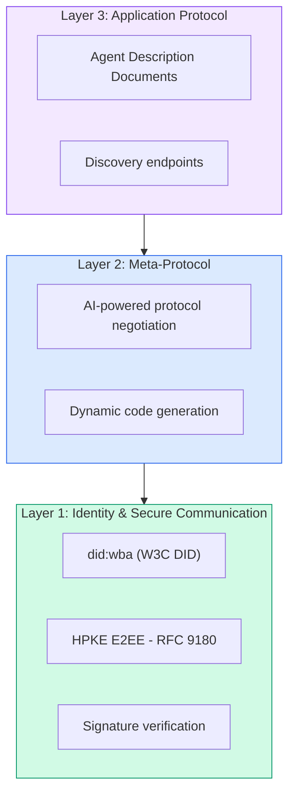

#### DID 文件(真实结构)

ANP 使用名为 `did:wba`(वेब आधारित एजेंट) के स्व-परिभाषित DID 方法― DID `did:wba:example.com:user:alice`解析为 `https://example.com/user/alice/did.json`:

```json
{
  "@context": [
    "https://www.w3.org/ns/did/v1",
    "https://w3id.org/security/suites/jws-2020/v1",
    "https://w3id.org/security/suites/secp256k1-2019/v1"
  ],
  "id": "did:wba:example.com:user:alice",
  "verificationMethod": [
    {
      "id": "did:wba:example.com:user:alice#key-1",
      "type": "EcdsaSecp256k1VerificationKey2019",
      "controller": "did:wba:example.com:user:alice",
      "publicKeyJwk": {
        "crv": "secp256k1",
        "x": "NtngWpJUr-rlNNbs0u-Aa8e16OwSJu6UiFf0Rdo1oJ4",
        "y": "qN1jKupJlFsPFc1UkWinqljv4YE0mq_Ickwnjgasvmo",
        "kty": "EC"
      }
    },
    {
      "id": "did:wba:example.com:user:alice#key-x25519-1",
      "type": "X25519KeyAgreementKey2019",
      "controller": "did:wba:example.com:user:alice",
      "publicKeyMultibase": "z9hFgmPVfmBZwRvFEyniQDBkz9LmV7gDEqytWyGZLmDXE"
    }
  ],
  "authentication": [
    "did:wba:example.com:user:alice#key-1"
  ],
  "keyAgreement": [
    "did:wba:example.com:user:alice#key-x25519-1"
  ],
  "humanAuthorization": [
    "did:wba:example.com:user:alice#key-1"
  ],
  "service": [
    {
      "id": "did:wba:example.com:user:alice#agent-description",
      "type": "AgentDescription",
      "serviceEndpoint": "https://example.com/agents/alice/ad.json"
    }
  ]
}
```

需要注意的关键事项:
- 强制执行**密钥分离**◊ हस्ताक्षर कुंजी (secp256k1) के साथ加密密钥 (X25519) का विभाजन
- **`humanAuthorization`**एएनपी के पास विशेष कुंजी है। इन कुंजी को उपयोग से पहले स्पष्ट मानव अधिकार अनुमोदन की आवश्यकता होती है।
- **`keyAgreement`**密钥用于HPKE 端到端加密 (RFC 9180)
- **服务**部分链接到代理描述文档──

#### 信任在 ANP 中如何运作

एएनपी **不**प्रयोग信任网或背书图──信任是双边的,并且每次交往都经验证:

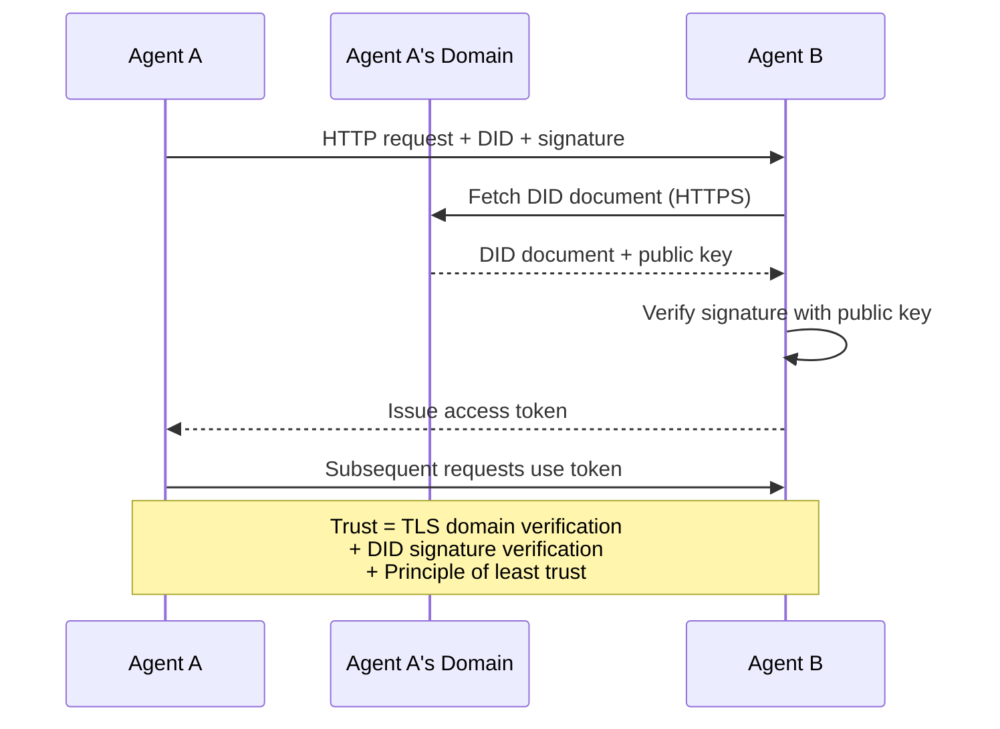

信任来自三个来源:
1. **域级 TLS**验证 DID 文档主机
2. **DID加密签名**验证代理身份
3. **最小信任原则**् केवल न्यूनतम अधिकार प्रदान करना

 कोई भी  के आधार पर विश्वास प्रसार या PageRank 评分. आप सीधे प्रत्येक एजेंट के DID के माध्यम से इसे सत्यापित कर सकते हैं.

#### पूर्व समझौता

यह एएनपी का नवीनतम कार्य है। जब दो एजेंट अलग-अलग पारिस्थितिकी तंत्र से आते हैं, तो उन्हें पहले से तय किए गए डेटा प्रारूप की आवश्यकता नहीं होती है।

```json
{
  "action": "protocolNegotiation",
  "sequenceId": 0,
  "candidateProtocols": "I can communicate using:\n1. JSON-RPC with hotel booking schema\n2. REST with OpenAPI 3.1 spec\n3. Natural language over HTTP",
  "modificationSummary": "Initial proposal",
  "status": "negotiating"
}
```

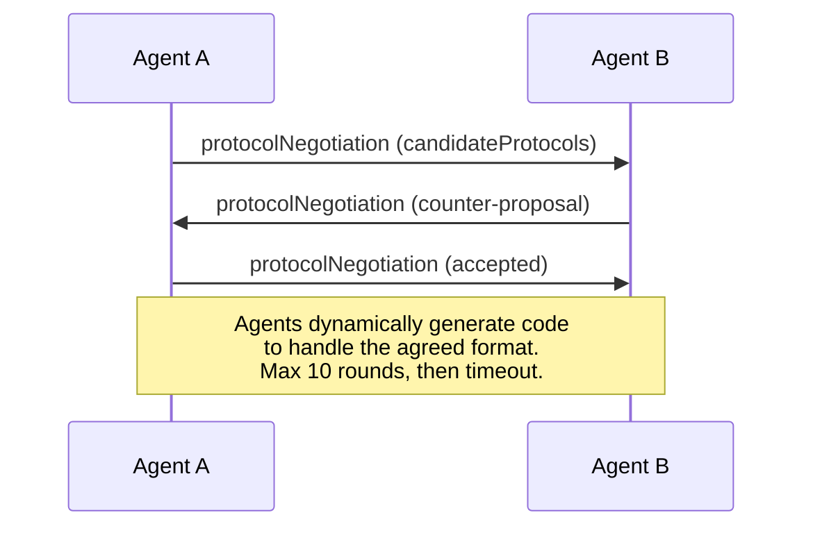

代理来回( अधिकतम 10 轮) जब तक प्रारूप पर सहमति नहीं होती, तब तक, फिर गतिशील कोड उत्पन्न करने के लिए इसे संसाधित करना।`negotiating``rejected``accepted``timeout`

इसका मतलब है कि दो अभिकर्ता जो पहले कभी नहीं मिले थे, वे यह पता लगा सकते हैं कि संचार कैसे किया जाए, बिना किसी को साझाकरण के प्रारूप को पूर्व परिभाषित करने की आवश्यकता है।

### तुलना करें

| | MCP| A2A |非加太 |心钠素 |
|---|---|---|---|---|
| **创建者** |人择 |谷歌/Linux基金会| IBM/BeeAI |社区 |
| **规格格式** | JSON-RPC | JSON-RPC / REST / gRPC | OpenAPI 3.1（休息）| JSON-RPC |
| **主要用途** |代理到工具 |代理对代理|代理对代理|代理对代理|
| **发现** |工具清单 | `/.well-known/agent-card.json` | `GET /agents`、`/.well-known/agent.yml` | `/.well-known/agent-descriptions`，DID服务端点|
| **身份** |隐式（本地）|安全方案（OAuth、mTLS）|服务器级| W3C DID (`did:wba`) 与 E2EE |
| **审计追踪** |不适用 |基本（任务历史记录）| TrajectoryMetadata（工具调用、推理） |未正式指定 |
| **状态机** |不适用 | 9 种任务状态 | 7 种运行状态 |不适用 |
| **流媒体** |不适用 |上交所 |上交所 |与传输无关 |
| **独特的功能** |工具模式|特工卡+技能|轨迹审计追踪|元协议协商|
| **最适合** |工具和数据|动态协作 |受监管行业 |跨组织信任 |
| **状态** |稳定|稳定（v1.0）|合并到A2A |积极发展|

### वे कैसे सहयोग करते हैं

इन समझौतों में एक दूसरे को अलग नहीं किया गया है।

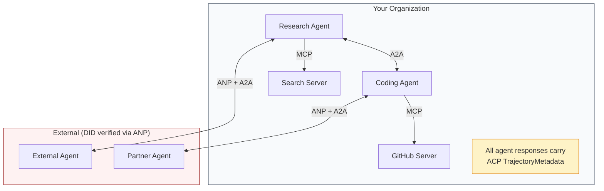

- **MCP**प्रत्येक एजेंट को अपने उपकरण से कनेक्ट करेगा
- **A2A**处理代理之间的协作(内部和外部)
- **ACP**ट्रैक डेटा में प्रतिक्रिया पैकेजिंग को सत्यापन योग्य बनाने के लिए
- **ANP**पहचान प्रमाण पत्र प्रदान करने के लिए आपके नियंत्रण में नहीं है एजेंट


```figure
swarm-message-bus
```

##  इसे निर्माण

### पहला चरण: कोर समाचार प्रकार

प्रत्येक बहु-उपयोग प्रणाली संदेश प्रारूप से शुरू होती है। हम वास्तविक प्रोटोकॉल उपयोग के प्रकार को परिभाषित करते हैंः

```typescript
import crypto from "node:crypto";

type MessageRole = "user" | "agent";

type MessagePart =
  | { kind: "text"; text: string }
  | { kind: "data"; data: unknown; mediaType: string }
  | { kind: "file"; name: string; url: string; mediaType: string };

type TrajectoryEntry = {
  reasoning: string;
  toolName?: string;
  toolInput?: unknown;
  toolOutput?: unknown;
  timestamp: number;
};

type AgentMessage = {
  id: string;
  role: MessageRole;
  parts: MessagePart[];
  trajectory?: TrajectoryEntry[];
  replyTo?: string;
  timestamp: number;
};

function createMessage(
  role: MessageRole,
  parts: MessagePart[],
  replyTo?: string
): AgentMessage {
  return {
    id: crypto.randomUUID(),
    role,
    parts,
    replyTo,
    timestamp: Date.now(),
  };
}

function textMessage(role: MessageRole, text: string): AgentMessage {
  return createMessage(role, [{ kind: "text", text }]);
}
```

ध्यान दें:`MessagePart`                                                                                                                                                                                                                                                              `TrajectoryEntry` पकड़ने के लिए संकेतक, संगत एसीपी के ट्रैक्टोरियामेटाडेटा

### द्वितीय चरण: ए 2 ए 代理卡和注册

निर्माण वास्तविक A2A 规范的代理发现:

```typescript
type Skill = {
  id: string;
  name: string;
  description: string;
  tags: string[];
  inputModes: string[];
  outputModes: string[];
};

type AgentCard = {
  name: string;
  description: string;
  version: string;
  url: string;
  capabilities: {
    streaming: boolean;
    pushNotifications: boolean;
  };
  defaultInputModes: string[];
  defaultOutputModes: string[];
  skills: Skill[];
};

class AgentRegistry {
  private cards: Map<string, AgentCard> = new Map();

  register(card: AgentCard) {
    this.cards.set(card.name, card);
  }

  discoverBySkillTag(tag: string): AgentCard[] {
    return [...this.cards.values()].filter((card) =>
      card.skills.some((skill) => skill.tags.includes(tag))
    );
  }

  discoverByInputMode(mimeType: string): AgentCard[] {
    return [...this.cards.values()].filter(
      (card) =>
        card.defaultInputModes.includes(mimeType) ||
        card.skills.some((skill) => skill.inputModes.includes(mimeType))
    );
  }

  resolve(name: string): AgentCard | undefined {
    return this.cards.get(name);
  }

  listAll(): AgentCard[] {
    return [...this.cards.values()];
  }
}
```

यह सरल नाम से फ़ंक्शन मैपिंग तक बहुत अधिक है। आप कौशल टैग के माध्यम से MIME प्रकार या नाम दर्ज कर सकते हैं।

### 步骤 3:A2A 任务 जीवन चक्र

构建完整的任务状态机:

```typescript
type TaskState =
  | "submitted"
  | "working"
  | "input-required"
  | "auth-required"
  | "completed"
  | "failed"
  | "canceled"
  | "rejected";

const TERMINAL_STATES: TaskState[] = [
  "completed",
  "failed",
  "canceled",
  "rejected",
];

type TaskStatus = {
  state: TaskState;
  message?: AgentMessage;
  timestamp: number;
};

type Artifact = {
  id: string;
  name: string;
  parts: MessagePart[];
};

type Task = {
  id: string;
  contextId: string;
  status: TaskStatus;
  artifacts: Artifact[];
  history: AgentMessage[];
};

type TaskEvent =
  | { kind: "statusUpdate"; taskId: string; status: TaskStatus }
  | {
      kind: "artifactUpdate";
      taskId: string;
      artifact: Artifact;
      append: boolean;
      lastChunk: boolean;
    };

type TaskHandler = (
  task: Task,
  message: AgentMessage
) => AsyncGenerator<TaskEvent>;

class TaskManager {
  private tasks: Map<string, Task> = new Map();
  private handlers: Map<string, TaskHandler> = new Map();
  private listeners: Map<string, ((event: TaskEvent) => void)[]> = new Map();

  registerHandler(agentName: string, handler: TaskHandler) {
    this.handlers.set(agentName, handler);
  }

  subscribe(taskId: string, listener: (event: TaskEvent) => void) {
    const existing = this.listeners.get(taskId) ?? [];
    existing.push(listener);
    this.listeners.set(taskId, existing);
  }

  async sendMessage(
    agentName: string,
    message: AgentMessage,
    contextId?: string
  ): Promise<Task> {
    const handler = this.handlers.get(agentName);
    if (!handler) {
      const task = this.createTask(contextId);
      task.status = {
        state: "rejected",
        timestamp: Date.now(),
        message: textMessage("agent", `No handler for ${agentName}`),
      };
      return task;
    }

    const task = this.createTask(contextId);
    task.history.push(message);
    task.status = { state: "submitted", timestamp: Date.now() };

    this.processTask(task, handler, message).catch((err) => {
      task.status = {
        state: "failed",
        timestamp: Date.now(),
        message: textMessage("agent", String(err)),
      };
    });
    return task;
  }

  getTask(taskId: string): Task | undefined {
    return this.tasks.get(taskId);
  }

  cancelTask(taskId: string): boolean {
    const task = this.tasks.get(taskId);
    if (!task || TERMINAL_STATES.includes(task.status.state)) return false;
    task.status = { state: "canceled", timestamp: Date.now() };
    this.emit(taskId, {
      kind: "statusUpdate",
      taskId,
      status: task.status,
    });
    return true;
  }

  private createTask(contextId?: string): Task {
    const task: Task = {
      id: crypto.randomUUID(),
      contextId: contextId ?? crypto.randomUUID(),
      status: { state: "submitted", timestamp: Date.now() },
      artifacts: [],
      history: [],
    };
    this.tasks.set(task.id, task);
    return task;
  }

  private async processTask(
    task: Task,
    handler: TaskHandler,
    message: AgentMessage
  ) {
    task.status = { state: "working", timestamp: Date.now() };
    this.emit(task.id, {
      kind: "statusUpdate",
      taskId: task.id,
      status: task.status,
    });

    try {
      for await (const event of handler(task, message)) {
        if (TERMINAL_STATES.includes(task.status.state)) break;

        if (event.kind === "statusUpdate") {
          task.status = event.status;
        }
        if (event.kind === "artifactUpdate") {
          const existing = task.artifacts.find(
            (a) => a.id === event.artifact.id
          );
          if (existing && event.append) {
            existing.parts.push(...event.artifact.parts);
          } else {
            task.artifacts.push(event.artifact);
          }
        }
        this.emit(task.id, event);
      }
    } catch (err) {
      task.status = {
        state: "failed",
        timestamp: Date.now(),
        message: textMessage("agent", String(err)),
      };
      this.emit(task.id, {
        kind: "statusUpdate",
        taskId: task.id,
        status: task.status,
      });
    }
  }

  private emit(taskId: string, event: TaskEvent) {
    for (const listener of this.listeners.get(taskId) ?? []) {
      listener(event);
    }
  }
}
```

यह वास्तविक ए 2 ए कार्य जीवन चक्र को प्राप्त करता हैः प्रस्तुत किया गया ️ काम कर रहा ️ आवश्यकताएं ️ अंतिम स्थिति️ प्रसंस्करण प्रक्रिया एक भिन्न चरण जनरेटर है, जो SSE 流 मॉडल के अनुरूप घटनाओं के साथ उत्पन्न की जा सकती है️ स्थिति अपडेट और कामकाज ब्लॉक) ️

### 步骤 4:ACP 式审计跟踪

通过轨迹跟踪包裹通信:

```typescript
type AuditEntry = {
  runId: string;
  agentName: string;
  input: AgentMessage[];
  output: AgentMessage[];
  trajectory: TrajectoryEntry[];
  status: "created" | "in-progress" | "completed" | "failed" | "awaiting";
  startedAt: number;
  completedAt?: number;
  sessionId?: string;
};

class AuditableRunner {
  private log: AuditEntry[] = [];
  private handlers: Map<
    string,
    (input: AgentMessage[]) => Promise<{
      output: AgentMessage[];
      trajectory: TrajectoryEntry[];
    }>
  > = new Map();

  registerAgent(
    name: string,
    handler: (input: AgentMessage[]) => Promise<{
      output: AgentMessage[];
      trajectory: TrajectoryEntry[];
    }>
  ) {
    this.handlers.set(name, handler);
  }

  async run(
    agentName: string,
    input: AgentMessage[],
    sessionId?: string
  ): Promise<AuditEntry> {
    const entry: AuditEntry = {
      runId: crypto.randomUUID(),
      agentName,
      input: structuredClone(input),
      output: [],
      trajectory: [],
      status: "created",
      startedAt: Date.now(),
      sessionId,
    };
    this.log.push(entry);

    const handler = this.handlers.get(agentName);
    if (!handler) {
      entry.status = "failed";
      return entry;
    }

    entry.status = "in-progress";
    try {
      const result = await handler(input);
      entry.output = structuredClone(result.output);
      entry.trajectory = structuredClone(result.trajectory);
      entry.status = "completed";
      entry.completedAt = Date.now();
    } catch (err) {
      entry.status = "failed";
      entry.trajectory.push({
        reasoning: `Error: ${String(err)}`,
        timestamp: Date.now(),
      });
      entry.completedAt = Date.now();
    }
    return entry;
  }

  getFullAuditLog(): AuditEntry[] {
    return structuredClone(this.log);
  }

  getAuditLogForAgent(agentName: string): AuditEntry[] {
    return structuredClone(
      this.log.filter((e) => e.agentName === agentName)
    );
  }

  getAuditLogForSession(sessionId: string): AuditEntry[] {
    return structuredClone(
      this.log.filter((e) => e.sessionId === sessionId)
    );
  }

  getTrajectoryForRun(runId: string): TrajectoryEntry[] {
    const entry = this.log.find((e) => e.runId === runId);
    return entry ? structuredClone(entry.trajectory) : [];
  }
}
```

प्रत्येक एजेंट निष्पादन पूर्ण लेखापरीक्षा की एक सूची उत्पन्न करता हैः प्रवेश की सामग्री, आउटपुट की सामग्री तथा उपकरण के उपयोग की पूर्ण रफ्तार तथा मध्यवर्ती विचार चरणों में। आप एजेंट के अनुसार, बैठक के अनुसार या व्यक्तिगत रूप से कार्य के अनुसार पूछताछ कर सकते हैं।

### 步骤 5:ANP 式身份验证

डिआईडी पर आधारित पहचान एवं सत्यापन:

```typescript
type VerificationMethod = {
  id: string;
  type: string;
  controller: string;
  publicKeyDer: string;
};

type DIDDocument = {
  id: string;
  verificationMethod: VerificationMethod[];
  authentication: string[];
  keyAgreement: string[];
  humanAuthorization: string[];
  service: { id: string; type: string; serviceEndpoint: string }[];
};

type AgentIdentity = {
  did: string;
  document: DIDDocument;
  privateKey: crypto.KeyObject;
  publicKey: crypto.KeyObject;
};

class IdentityRegistry {
  private documents: Map<string, DIDDocument> = new Map();

  publish(doc: DIDDocument) {
    this.documents.set(doc.id, doc);
  }

  resolve(did: string): DIDDocument | undefined {
    return this.documents.get(did);
  }

  verify(did: string, signature: string, payload: string): boolean {
    const doc = this.documents.get(did);
    if (!doc) return false;

    const authKeyIds = doc.authentication;
    const authKeys = doc.verificationMethod.filter((vm) =>
      authKeyIds.includes(vm.id)
    );

    for (const key of authKeys) {
      const publicKey = crypto.createPublicKey({
        key: Buffer.from(key.publicKeyDer, "base64"),
        format: "der",
        type: "spki",
      });
      const isValid = crypto.verify(
        null,
        Buffer.from(payload),
        publicKey,
        Buffer.from(signature, "hex")
      );
      if (isValid) return true;
    }
    return false;
  }

  requiresHumanAuth(did: string, operationKeyId: string): boolean {
    const doc = this.documents.get(did);
    if (!doc) return false;
    return doc.humanAuthorization.includes(operationKeyId);
  }
}

function createIdentity(domain: string, agentName: string): AgentIdentity {
  const did = `did:wba:${domain}:agent:${agentName}`;
  const { publicKey, privateKey } = crypto.generateKeyPairSync("ed25519");

  const publicKeyDer = publicKey
    .export({ format: "der", type: "spki" })
    .toString("base64");

  const keyId = `${did}#key-1`;
  const encKeyId = `${did}#key-x25519-1`;

  const document: DIDDocument = {
    id: did,
    verificationMethod: [
      {
        id: keyId,
        type: "Ed25519VerificationKey2020",
        controller: did,
        publicKeyDer,
      },
      {
        id: encKeyId,
        type: "X25519KeyAgreementKey2019",
        controller: did,
        publicKeyDer,
      },
    ],
    authentication: [keyId],
    keyAgreement: [encKeyId],
    humanAuthorization: [],
    service: [
      {
        id: `${did}#agent-description`,
        type: "AgentDescription",
        serviceEndpoint: `https://${domain}/agents/${agentName}/ad.json`,
      },
    ],
  };

  return { did, document, privateKey, publicKey };
}

function signPayload(identity: AgentIdentity, payload: string): string {
  return crypto
    .sign(null, Buffer.from(payload), identity.privateKey)
    .toString("hex");
}
```

यह वास्तविक एएनपी पहचान मॉडल को दर्शाता हैः एजेंट के पास एक अलग पहचान प्रमाण पत्र, कुंजी वार्ता और कृत्रिम रूप से अधिकृत कुंजी के डीआईडी दस्तावेज हैं।`IdentityRegistry`模拟 DID 解析 (उत्पादन के दौरान, यह एजेंट डोमेन के लिए HTTP 获取) ]]

### 步骤 6:协议网关

एक एकीकृत प्रणाली में सभी चार प्रोटोकॉल कनेक्ट करेगाः

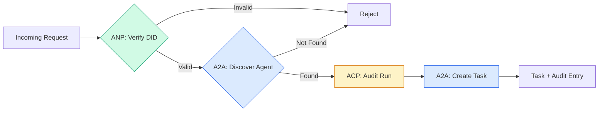

```typescript
class ProtocolGateway {
  private registry: AgentRegistry;
  private taskManager: TaskManager;
  private auditRunner: AuditableRunner;
  private identityRegistry: IdentityRegistry;

  constructor(
    registry: AgentRegistry,
    taskManager: TaskManager,
    auditRunner: AuditableRunner,
    identityRegistry: IdentityRegistry
  ) {
    this.registry = registry;
    this.taskManager = taskManager;
    this.auditRunner = auditRunner;
    this.identityRegistry = identityRegistry;
  }

  async delegateTask(
    fromDid: string,
    signature: string,
    targetAgent: string,
    message: AgentMessage,
    sessionId?: string
  ): Promise<{ task: Task; audit: AuditEntry } | { error: string }> {
    if (!this.identityRegistry.verify(fromDid, signature, message.id)) {
      return { error: "Identity verification failed" };
    }

    const card = this.registry.resolve(targetAgent);
    if (!card) {
      return { error: `Agent ${targetAgent} not found in registry` };
    }

    const audit = await this.auditRunner.run(
      targetAgent,
      [message],
      sessionId
    );
    const task = await this.taskManager.sendMessage(targetAgent, message);

    return { task, audit };
  }

  discoverAndDelegate(
    fromDid: string,
    signature: string,
    skillTag: string,
    message: AgentMessage
  ): Promise<{ task: Task; audit: AuditEntry } | { error: string }> {
    const candidates = this.registry.discoverBySkillTag(skillTag);
    if (candidates.length === 0) {
      return Promise.resolve({
        error: `No agents found with skill tag: ${skillTag}`,
      });
    }
    return this.delegateTask(
      fromDid,
      signature,
      candidates[0].name,
      message
    );
  }
}
```

网关在一次调用中完成四件事:
1. **ANP**:DID हस्ताक्षर सत्यापित呼叫者身份 के माध्यम से
2. **A2A**: पता लगाने की क्षमता
3. **ACP**: प्रस्थान के साथ लेखा परीक्षा में संलग्नक का निष्पादन किया जाएगा
4. **A2A**: पूरा जीवन चक्र का पालन करने के लिए एक मिशन का निर्माण

### 第7 步: उन्हें एक साथ जोड़ना

```typescript
async function protocolDemo() {
  const registry = new AgentRegistry();
  registry.register({
    name: "researcher",
    description: "Searches and summarizes findings",
    version: "1.0.0",
    url: "https://researcher.local/a2a/v1",
    capabilities: { streaming: true, pushNotifications: false },
    defaultInputModes: ["text/plain"],
    defaultOutputModes: ["text/plain", "application/json"],
    skills: [
      {
        id: "web-research",
        name: "Web Research",
        description: "Searches the web",
        tags: ["research", "search", "summarization"],
        inputModes: ["text/plain"],
        outputModes: ["application/json"],
      },
    ],
  });
  registry.register({
    name: "coder",
    description: "Writes code from specs",
    version: "1.0.0",
    url: "https://coder.local/a2a/v1",
    capabilities: { streaming: false, pushNotifications: false },
    defaultInputModes: ["text/plain", "application/json"],
    defaultOutputModes: ["text/plain"],
    skills: [
      {
        id: "code-gen",
        name: "Code Generation",
        description: "Generates code",
        tags: ["coding", "generation"],
        inputModes: ["text/plain", "application/json"],
        outputModes: ["text/plain"],
      },
    ],
  });

  const taskManager = new TaskManager();
  const auditRunner = new AuditableRunner();

  const researchTrajectory: TrajectoryEntry[] = [];

  taskManager.registerHandler(
    "researcher",
    async function* (task, message) {
      yield {
        kind: "statusUpdate" as const,
        taskId: task.id,
        status: { state: "working" as const, timestamp: Date.now() },
      };

      researchTrajectory.push({
        reasoning: "Searching for React 19 documentation",
        toolName: "web_search",
        toolInput: { query: "React 19 compiler features" },
        toolOutput: {
          results: ["react.dev/blog/react-19", "github.com/react/react"],
        },
        timestamp: Date.now(),
      });

      researchTrajectory.push({
        reasoning: "Extracting key findings from search results",
        toolName: "doc_analysis",
        toolInput: { url: "react.dev/blog/react-19" },
        toolOutput: {
          summary:
            "React 19 compiler auto-memoizes, no manual useMemo needed",
        },
        timestamp: Date.now(),
      });

      yield {
        kind: "artifactUpdate" as const,
        taskId: task.id,
        artifact: {
          id: crypto.randomUUID(),
          name: "research-results",
          parts: [
            {
              kind: "data" as const,
              data: {
                findings: [
                  "React 19 compiler auto-memoizes components",
                  "No more manual useMemo/useCallback needed",
                  "Compiler runs at build time, not runtime",
                ],
                sources: ["react.dev/blog/react-19"],
              },
              mediaType: "application/json",
            },
          ],
        },
        append: false,
        lastChunk: true,
      };

      yield {
        kind: "statusUpdate" as const,
        taskId: task.id,
        status: { state: "completed" as const, timestamp: Date.now() },
      };
    }
  );

  auditRunner.registerAgent("researcher", async () => ({
    output: [
      textMessage("agent", "React 19 compiler auto-memoizes components"),
    ],
    trajectory: researchTrajectory,
  }));

  const identityRegistry = new IdentityRegistry();

  const coderIdentity = createIdentity("coder.local", "coder");
  const researcherIdentity = createIdentity("researcher.local", "researcher");

  identityRegistry.publish(coderIdentity.document);
  identityRegistry.publish(researcherIdentity.document);

  const gateway = new ProtocolGateway(
    registry,
    taskManager,
    auditRunner,
    identityRegistry
  );

  console.log("=== Protocol Demo ===\n");

  console.log("1. Agent Discovery (A2A)");
  const researchAgents = registry.discoverBySkillTag("research");
  console.log(
    `   Found ${researchAgents.length} agent(s):`,
    researchAgents.map((a) => a.name)
  );

  console.log("\n2. Identity Verification (ANP)");
  const message = textMessage("user", "Research React 19 compiler features");
  const signature = signPayload(coderIdentity, message.id);
  const verified = identityRegistry.verify(
    coderIdentity.did,
    signature,
    message.id
  );
  console.log(`   Coder DID: ${coderIdentity.did}`);
  console.log(`   Signature verified: ${verified}`);

  console.log("\n3. Task Delegation (A2A + ACP + ANP)");
  const result = await gateway.delegateTask(
    coderIdentity.did,
    signature,
    "researcher",
    message,
    "session-001"
  );

  if ("error" in result) {
    console.log(`   Error: ${result.error}`);
    return;
  }

  console.log(`   Task ID: ${result.task.id}`);
  console.log(`   Task state: ${result.task.status.state}`);
  console.log(`   Artifacts: ${result.task.artifacts.length}`);

  console.log("\n4. Audit Trail (ACP)");
  console.log(`   Run ID: ${result.audit.runId}`);
  console.log(`   Status: ${result.audit.status}`);
  console.log(`   Trajectory steps: ${result.audit.trajectory.length}`);
  for (const step of result.audit.trajectory) {
    console.log(`     - ${step.reasoning}`);
    if (step.toolName) {
      console.log(`       Tool: ${step.toolName}`);
    }
  }

  console.log("\n5. Full Audit Log");
  const fullLog = auditRunner.getFullAuditLog();
  console.log(`   Total runs: ${fullLog.length}`);
  for (const entry of fullLog) {
    const duration = entry.completedAt
      ? `${entry.completedAt - entry.startedAt}ms`
      : "in-progress";
    console.log(`   ${entry.agentName}: ${entry.status} (${duration})`);
  }
}

protocolDemo().catch((err) => {
  console.error("Protocol demo failed:", err);
  process.exitCode = 1;
});
```

## क्या समस्या है?

协议解决了快乐之路―― निम्नलिखित उत्पादन में उत्पन्न हुए विराम हैंः

**架构漂移。**代理 A 发布代理卡广告 `application/json`输出── लेकिन JSON 架构在版本之间发生变化──代理 B 解析旧形式并得到垃圾──修复: आपके कौशल और आउटपुट मोड पर संस्करण化进行.`version`

**状态机违规。**代理处理程序生成 `completed`事件, फिर प्रयास करें और अधिक कार्य उत्पन्न करें। ∞ ∞ ∞ ∞ ∞ ∞ ∞ ∞ ∞ ∞ ∞ ∞ ∞ ∞ ∞ ∞ ∞ ∞ ∞ ∞ ∞ ∞ ∞ ∞ ∞ ∞ ∞ ∞ ∞ ∞ ∞ ∞ ∞ ∞ ∞ ∞ ∞ ∞ ∞ ∞ ∞ ∞ ∞ ∞ ∞ ∞ ∞ ∞ ∞ ∞ ∞ ∞ ∞ ∞ ∞ ∞ ∞ ∞ ∞ ∞ ∞ ∞ ∞ ∞ ∞ ∞ ∞ ∞ ∞ ∞ ∞ ∞ ∞ ∞ ∞ ∞ ∞ ∞ ∞ ∞ ∞ ∞ ∞ ∞ ∞ ∞ ∞ ∞ ∞ ∞ ∞ ∞ ∞ ∞ ∞ ∞ ∞ ∞ ∞ ∞ ∞ ∞ ∞ ∞ ∞ ∞ ∞ ∞ ∞ ∞ ∞ ∞ ∞ ∞ ∞ ∞ ∞ ∞ ∞ ∞ ∞ ∞ ∞ ∞ ∞ ∞ ∞ ∞ ∞ ∞ ∞ ∞ ∞ ∞ ∞ ∞ ∞ ∞ ∞ ∞ ∞ ∞ ∞ ∞ ∞ ∞ ∞ ∞ ∞ ∞ ∞ ∞ ∞ ∞ ∞ ∞ ∞ ∞ ∞ ∞ ∞ ∞ ∞ ∞ ∞ ∞ ∞ ∞ ∞ ∞ ∞ ∞ ∞ ∞ ∞ ∞ ∞ ∞ ∞ ∞ ∞ ∞ ∞ ∞ ∞ ∞ ∞ ∞ ∞ ∞ ∞ ∞ ∞ ∞ ∞ ∞ ∞ ∞ ∞ ∞`TaskManager`                                                                                                                                                                                                                                                                                                                                                                                                                                                                                                                             `break`强制执行此操作──

**信任解析失败。**代理 A 尝试验证代理 B का DID, लेकिन代理 B का डोमेन बंद है──不能获取DID 文档──您是否打开失败(接受未经验证的代理) 或关闭失败(拒绝一切)? ANP 建议按照最小信任原则关闭失败──

**轨迹膨胀。**एसीपी 轨迹记录功能强大,但价格昂贵. 200 बार प्रत्येक परिचालन के लिए उपकरण调用 जटिल एजेंसी से बड़ी संख्या में审核条例 उत्पन्न होते हैं।

**发现惊群。**50 个代理在启动时同时查询`GET /agents`◊修复: उपयोग TTL 缓存代理卡、错开发现间隔或 उपयोग पर आधारित पंजीकरण पर आधारित नहीं बल्कि राउंड क्वेरी

## इसका उपयोग करें

### 实际实现

**A2A**यह सबसे परिपक्व है।[官方spec](https://github.com/google/A2A)यह लिनक्स फंड के तहत खुला स्रोत का है। यह पायथन और टाइपस्क्रिप्ट के लिए उपयुक्त है। यदि आपके एजेंट को गतिशील खोज और सहयोग की आवश्यकता है, तो कृपया यहां से शुरू करें।

**ACP**A2A में शामिल हो रहा है IBM के [BeeAI 项目](https://github.com/i-am-bee/acp)एसीपी  के रूप में आरईएसटी  के लिए प्राथमिकता विकल्प बनाया गया है, लेकिन रस्ते की अवधारणा A2A पारिस्थितिकी तंत्र में अवशोषित की जा रही है।

**ANP**                                                                                                                                                                                                                                                              [社区 repo](https://github.com/agent-network-protocol/AgentNetworkProtocol)एक पायथन एसडीके (एजेंटकनेक्ट) है।

**MCP**已在第13 阶段涵盖── यदि आप एजेंसी के उपयोग के साधन चाहते हैं, तो एमसीपी मानक है──

### 选择正确的协议

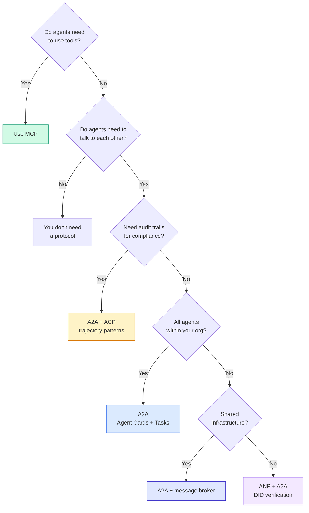

## 发货

本课产生:
- `code/main.ts`-- सभी चार प्रकार के समझौते के मॉडल का पूर्ण कार्यान्वयन
- `outputs/prompt-protocol-selector.md` प्रणाली चयन अनुबंध के लिए आपकी सहायता करने के लिए सुझाव

## अभ्यास

1. **多跳任务委托。**扩展 `TaskManager`, ताकि एजेंट प्रसंस्करण प्रक्रिया अन्य एजेंटों को कार्य सौंप सके। शोधकर्ता को एक कार्य प्राप्त हो, वह दो विशेषज्ञ एजेंटों को कार्य सौंप सके, दोनों को पूरा होने का इंतजार करे, और परिणाम अपने कार्य में सामिल हो जाए।

2. **流式审计跟踪。**修改`AuditableRunner`इस प्रकार, उत्पादन की मात्रा को बढ़ाने के लिए, पूर्ण परिणाम की प्रतीक्षा करने की आवश्यकता नहीं है।`AuditEntry` उपयोग करना                                                                                                                                                                                                                                                             

3. **DID 轮换。**                                                                                                                                                                                                                                                                                                                                                                                                                                                                                                                             `IdentityRegistry`◊ एजेंट को एक साथ रखरखाव के साथ एक नई DID  दस्तावेज़ के साथ एक नई कुंजी जारी करने में सक्षम होना चाहिए`previousDid`引用── सत्यापितकर्ता को वर्तमान कुंजी और पूर्व की कुंजी के हस्ताक्षर को व्यापक अवधि में स्वीकार करना चाहिए──

4. **协议协商。**实施ANP的元协议概念── दो एजेंटों ने उम्मीदवारों के रूप में आदान-प्रदान किया `protocolNegotiation`消息(उदाहरण के लिए,我可以讲 JSON-RPC与我更喜欢 REST) ) ) ) ) ) ) ) ) ) ) ) ) ) ) ) ) ) ) ) ) ) ) ) ) ) ) ) ) )                                                                                                                                                                                                     `TaskManager`या `AuditableRunner`

5. **速率限制发现。**添加 `RateLimitedRegistry`包装器, इस पैकेजिंग मशीन का उपयोग कर कॉन्फ़िगर करने योग्य TTL 缓存代理卡查找,并限制每代理每秒的发现查询──模拟100代理在启动时发现彼此的惊群并测量差异──

## 关键术语

|术语 |人们怎么说|它实际上意味着什么 |
|------|----------------|----------------------|
| MCP| “人工智能工具协议”|供代理发现和使用工具的客户端-服务器协议。代理到工具，而不是代理到代理。 |
| A2A | 《Google 的代理协议》| Linux 基金会下用于代理协作的点对点协议。通过代理卡进行发现，9 状态任务生命周期，通过 SSE 进行流式传输。支持 JSON-RPC、REST 和 gRPC 绑定。 |
|非加太 | 《企业代理消息传递》 | IBM/BeeAI 的代理 REST API 与 TrajectoryMetadata 一起运行：每个响应都携带完整的推理和工具调用链。合并到A2A。 |
|心钠素 | “去中心化代理身份”|使用 `did:wba` (DID) 进行加密身份的社区协议、用于 E2EE 的 HPKE 以及用于从未见过对方的代理的人工智能元协议协商。 |
|代理卡| 《代理人的名片》| `/.well-known/agent-card.json` 上的 JSON 文档描述了技能、支持的 MIME 类型、安全方案和协议绑定。 |
|确实 | “去中心化ID” |用于在代理自己的域上托管的可加密验证身份的 W3C 标准。 ANP使用`did:wba`方法。 |
|轨迹元数据 | “审计收据”| ACP 的机制，用于将推理步骤、工具调用及其输入/输出附加到每个代理响应。 |
|元协议| “代理人谈判如何交谈”| ANP 的方法是，代理使用自然语言动态地就数据格式达成一致，然后生成代码来处理它们。 |
|任务| “一个工作单元” | A2A 的状态对象跟踪工作从提交到完成。一旦终端就不可变。 |

##  आगे पढ़ें

- [Google A2A 规范](https://github.com/google/A2A)-- 官方规范和 SDK(v1.0.0,Linux 基金会)
- [IBM/BeeAI ACP 规范](https://github.com/i-am-bee/acp)-- एजेंट संचालन और रस्ते डेटा के लिए OpenAPI 3.1  विनियमन
- [代理网络协议](https://github.com/agent-network-protocol/AgentNetworkProtocol)-- DID की पहचान E2EE 元 समझौता परामर्श
- [模型上下文协议 docs](https://modelcontextprotocol.io/)-- मानविकी का एमसीपी 规范(第 13 阶段涵盖)
- [W3C 去中心化标识符](https://www.w3.org/TR/did-core/)支 ANP के पहचान मानक
- [RFC 9180 (HPKE)](https://www.rfc-editor.org/rfc/rfc9180)-- एएनपी E2EE के लिए उपयोग किया गया है
- [FIPA代理通信语言](http://www.fipa.org/specs/fipa00061/SC00061G.html)现代代理协议的学术先驱
