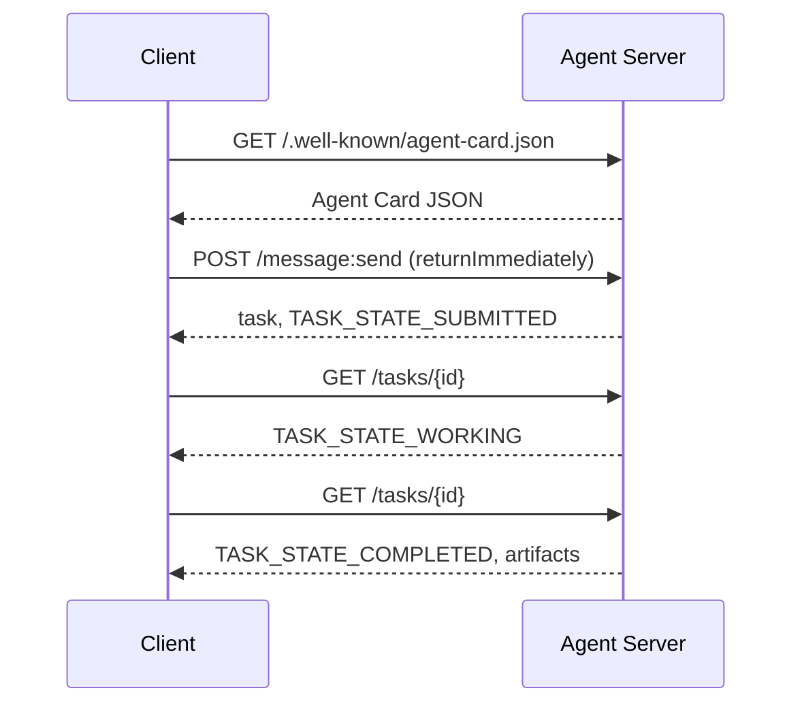

# A2A  智能体间通信协议(एजेंट-टू-एजेंट प्रोटोकॉल)

> गूगल ने अप्रैल 2025 में A2A जारी किया; अप्रैल 2026 तक, आधिकारिक विनियम 1.0.1 तक विकसित हो गए, और AWS, Microsoft, Salesforce आदि सहित 150+ संगठनों का समर्थन प्राप्त किया। A2A एमसीपी का एक पारदर्शी पूरक प्रोटोकॉल हैः MCP 聚焦纵向 (एजेन्ट  उपकरण), जबकि A2A 聚焦横向点对点 (एजेन्ट  एजेंट)  यह एजेंट कार्ड को परिभाषित करता है। यह उत्पाद के लिए उपयोग किया जाता है।

**Type:** Learn + Build
**Languages:** Python (stdlib, `http.server`, `json`)
**Prerequisites:** Phase 16 · 04（原语模型）
**Time:** ~75 分钟

## 问题背景

जब आपके एजेंट को किसी अन्य सिस्टम या संगठन के भीतर एजेंट को तैनात करने की आवश्यकता होती है, तो आपको कैसे संवाद करना चाहिए? आप निश्चित रूप से एक विशेष HTTP 端点 को उजागर कर सकते हैं, एक अनुकूलित JSON योजना को परिभाषित कर सकते हैं, और उम्मीद करते हैं कि अन्य लोग आपके नियमों के अनुसार तैनात कर सकते हैं।

ए 2 ए इस प्रकार के क्रॉस-सिस्टम रूपांतरण के लिए एक सामान्य उपयोग के लिए लाइन प्रोटोकॉल प्रदान करता है। यह मानक सेवा खोजों को परिभाषित करता है। मानक कार्य सारणी, मानक संचरण बंधन और मानक आउटपुट उत्पादों जैसे कि बुद्धिमान शरीर के लिए निर्धारित HTTP + REST बुनियादी ढांचे को परिभाषित करता है।

## 核心概念

### चार प्रमुख तत्व

**Agent Card（智能体名片）。**                                                                                                                                                                                                                                                                                                                                                                                                                                                                                                                             `/.well-known/agent-card.json`JSON 文档, के लिए व्यापक रूप से वर्णन करने के लिए एजेंटः名称、Skills、`supportedInterfaces`(端点 URL、协议绑定、协议版本) 、默认输入和输出媒体类型, तथा पहचान अधिकार आवश्यकताएं`securitySchemes``securityRequirements`)。 इसके लिए अंतराल से पढ़ लेना

```http
GET /.well-known/agent-card.json HTTP/1.1
Host: agent.example.com
```

```json
{
  "name": "code-review-agent",
  "description": "审查 Python 与 TypeScript 代码。",
  "version": "1.0.0",
  "supportedInterfaces": [
    {
      "url": "https://agent.example.com",
      "protocolBinding": "HTTP+JSON",
      "protocolVersion": "1.0"
    }
  ],
  "capabilities": {"streaming": false, "pushNotifications": false},
  "securitySchemes": {
    "bearer": {"httpAuthSecurityScheme": {"scheme": "Bearer"}}
  },
  "securityRequirements": [{"schemes": {"bearer": {"list": []}}}],
  "defaultInputModes": ["text/plain", "application/json"],
  "defaultOutputModes": ["application/json"],
  "skills": [
    {
      "id": "review-python",
      "name": "审查 Python 代码",
      "description": "审查传入的 Python 源码并给出改进建议。",
      "tags": ["code-review", "python"]
    },
    {
      "id": "review-typescript",
      "name": "审查 TypeScript 代码",
      "description": "审查传入的 TypeScript 源码并给出类型与逻辑改进建议。",
      "tags": ["code-review", "typescript"]
    }
  ]
}
```

**Task（任务）。**基本工作委托单元── एक जीवन चक्र के साथ एक अलग-अलग अवस्था वाले वस्तुः`TASK_STATE_SUBMITTED`→ `TASK_STATE_WORKING`→ `TASK_STATE_COMPLETED`/`TASK_STATE_FAILED`/`TASK_STATE_CANCELED`◊ ग्राहक  संदेश भेजता है, सर्वर  निर्माण कार्य करता है, उसके बाद ग्राहक  轮询 या流式订阅 प्राप्त अद्यतन ◊

**Artifact（产物）。**कार्य  निष्पादन पूर्ण उत्पादन का संरचनात्मक परिणाम  समर्थन文本、 संरचनात्मक JSON、图像、视频、音频 आदि`text``raw``url`या `data`之一并可指明其 `mediaType`

**不透明生命周期（Opaque Lifecycle）。**A2A 绝不规定远程代理 *内部* कैसे पूरा करें कार्य──客户 仅观察状态转换与最终产品;被调用方完全自由选择任何底层模型和框架──

### एमसीपी और ए2ए के विभाजन

- **MCP**:एजेंट  उपकरण。एजेंट 借助 JSON-RPC 读写工具 सर्वर,核心完全无状态。
- **A2A** एजेंट  एजेंट  अन्य सहयोग समझौते के लिए, संचार दोनों पक्षों में स्वतंत्र विचार करने की क्षमता के पूर्ण बुद्धिमान शरीर हैं

बहु-बुद्धिमान प्रणाली के उत्पादन में, दोनों को एक साथ संचालित किया जाता हैः ए 2 ए के लिए अपने स्वयं के पक्ष में स्थानीय विन्यास के लिए MCP उपकरण को अनुकूलित करना।

### 发现与调用时序



उपरोक्त मार्ग HTTP+JSON  बंधन नियमन का पालन करते हैं, और प्रत्येक अनुरोध को ले जाते हैं `A2A-Version: 1.0`अनुरोध शीर्षक---默认情况下 `SendMessage`कार्य समाप्त होने तक बाधा होगी, इसलिए ग्राहक के लिए प्रश्न मोड सेट करें`configuration.returnImmediately`इसलिये तुरंत कार्य प्राप्त करने के लिए।

对于流式传输:`POST /message:stream`返回 सर्वर-Send घटनाओं(首先输出 `task`, उसके बाद陆续推送`statusUpdate``artifactUpdate`事件), तथा `/tasks/{id}:subscribe`则用于重新添加到运行中的任务――流在任务进入终态时正常关闭,报文中不包含单独的 `final`标志──

### 身份认证与安全 (अधिकार)

A2A मूल जीवन समर्थन तीन मुख्य सुरक्षा मोडः

- **Bearer Token**:OAuth2 या अस्पष्ट टोकन`httpAuthSecurityScheme`या `oauth2SecurityScheme`)。
- **mTLS**: द्विಮುಖ TLS 认证, संगठन间强证明身份(`mtlsSecurityScheme`)。
- **API Key**: स्थित अनुरोध शीर्षक、URL 查询参数 या कुकी में कुंजी`apiKeySecurityScheme`)。

认证规则在代理卡 中公布:`securitySchemes`命名方案,`securityRequirements`规定调用方必须满足的要求――

```figure
sw-agent-card-discovery
```

## 动手实践

`code/main.py` ए 2 ए 1.0 HTTP + JSON पर आधारित  बंधन प्रोटोकॉल, केवल पायथन का उपयोग  मानक库 `http.server``json`极简的 A2A सर्वर एवं क्लाइंट  सर्वर 功能 शामिल हैंः

- 暴露 `/.well-known/agent-card.json`.
-  स्वीकार `POST /message:send`调用;
- 管理 कार्य 状态机转换;
- `GET /tasks/{id}`ऊपर वापसी उत्पाद

ग्राहक 功能 समाहितः

- 拉取并解析 एजेंट कार्ड;
- 发送带有 `returnImmediately`के समाचार सृजन कार्य;
- 持续轮询直至任务完成;
- 读取并验证最终 आर्टिफैक्ट。

运行命令:

```bash
python3 code/main.py
```

脚本后台线程中启动服务器, फिर क्लाइंट द्वारा इसके लिए पूर्ण प्रक्रम का调整, प्रत्यक्ष प्रदर्शन, खोज, प्रस्तुत, पूछताछ और उत्पाद प्राप्त करने की पूरी प्रक्रिया हेतु प्रक्षेपण किया जाएगा

## 交付物

本课交付 `outputs/skill-a2a-integrator.md`️ए2ए एग्जीट प्रोग्राम:एजेंट कार्ड सामग्री कार्य परीक्षा अनुबंध  पहचान अधिकार चयन प्रकार तथा प्रक्रम एवं राउंडक्वेरी रणनीति

## 核心专业术语

| 术语 | 规范定义 |
|------|---------|
| A2A | 跨系统异构智能体间互相调用的对等开放协议 |
| Agent Card | 暴露于 `/.well-known/agent-card.json` 的元数据卡片，声明技能、端点与鉴权要求 |
| Task | 具备明确生命周期、完成时生成产物的异步工作单元 |
| Artifact | 任务产出的具名、带类型结果（文本、结构化 JSON、音视频媒体等） |
| 不透明生命周期 (Opaque lifecycle) | 内部解决过程对调用方隐藏，仅对外暴露状态流转与产物 |
| 服务发现 (Discovery) | 通过发起 `GET /.well-known/agent-card.json` 获取名片并了解支持能力 |
| MCP 对比 A2A | MCP 属于垂直的 Agent 与工具交互，A2A 属于水平的 Agent 间对等协作 |

## 延伸阅读

- [A2A 规范主站](https://a2a-protocol.org/latest/specification/) 官方权威规范
- [A2A v1.0.1 源码发布](https://github.com/a2aproject/A2A/tree/v1.0.1) इस वर्ग के अनुपालन के लिए कोड संधि एवं विनियम परिभाषा
- [Google Developers Blog — A2A 发布说明](https://developers.googleblog.com/en/a2a-a-new-era-of-agent-interoperability/) 官方设计背景
