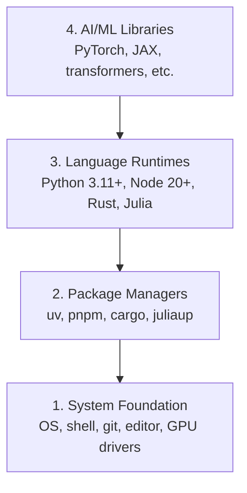

# Ambiente de desenvolvimento

> As tuas ferramentas vão moldar o teu modo de pensar.

**Type:** Build
**Languages:** Python, Node.js, Rust
**Prerequisites:** None
**Time:** ~45 分钟

## Objectivo de aprendizagem
- Desde zero começando a configurar Python 3.11+、Node.js 20+ 和 Rust toolchains
- Configurar ambientes virtuais e gerentes de pacotes, para realizar construções replicáveis
- Utilize CUDA/MPS 验证 GPU acesso,并运行一个测试 Tensor operação
- Entender quatro níveis de pilha: sistemas, pacotes, tempos de execução, bibliotecas de IA

## 问题
Você vai usar Python, TypeScript, Rust e Julia para aprender mais de 200 cursos de engenharia artificial. Se o seu ambiente estiver ruim, cada aula se transformará em ferramentas de luta, em vez de aprendizagem.

Muitas pessoas saltam a configuração do ambiente. Depois, passam algumas horas a depurar erros de importação, conflitos de versão e falta de drivers CUDA.

## 概念
Um ambiente de engenharia de IA tem quatro camadas:



Nós estamos instalados de baixo para cima. Cada camada depende de uma camada abaixo.


```figure
s0-env-stack
```

## Construí-lo
### 步骤 1: Fundação do Sistema

Verifique o seu sistema e instale componentes básicos.

```bash
# macOS
xcode-select --install
brew install git curl wget

# Ubuntu/Debian
sudo apt update && sudo apt install -y build-essential git curl wget

# Windows (use WSL2)
wsl --install -d Ubuntu-24.04
```

### 步骤 2: Python com uv

Nós usamos`uv` É 10-100x mais rápido do que o pip, e processará automaticamente ambientes virtuais

```bash
curl -LsSf https://astral.sh/uv/install.sh | sh

uv python install 3.12

uv venv
source .venv/bin/activate  # or .venv\Scripts\activate on Windows

uv pip install numpy matplotlib jupyter
```

验证:

```python
import sys
print(f"Python {sys.version}")

import numpy as np
print(f"NumPy {np.__version__}")
a = np.array([1, 2, 3])
print(f"Vector: {a}, dot product with itself: {np.dot(a, a)}")
```

### 步骤 3: Node.js com pnpm

Utilizado em TypeScript 课程(agentes、MCP servidores、aplicativos web)

```bash
curl -fsSL https://fnm.vercel.app/install | bash
fnm install 22
fnm use 22

npm install -g pnpm

node -e "console.log('Node', process.version)"
```

### 步骤 4: Corrosão

Utilizadas em cursos de desempenho crítico (inferência, sistemas)

```bash
curl --proto '=https' --tlsv1.2 -sSf https://sh.rustup.rs | sh

rustc --version
cargo --version
```

### 步骤 5: Julia (Foicional)

É uma boa aula de matemática.

```bash
curl -fsSL https://install.julialang.org | sh

julia -e 'println("Julia ", VERSION)'
```

### 步骤 6:GPU 设置( se você tiver)

```bash
# NVIDIA
nvidia-smi

# Install PyTorch with CUDA
uv pip install torch torchvision torchaudio --index-url https://download.pytorch.org/whl/cu124
```

```python
import torch
print(f"CUDA available: {torch.cuda.is_available()}")
if torch.cuda.is_available():
    print(f"GPU: {torch.cuda.get_device_name(0)}")
```

没有 GPU?没有问题──大多数课程可在CPU上运行──对于训练重的课程,使用Google Colab或云GPU──

### 步骤 7: Verifique tudo

运行验证脚本:

```bash
python phases/00-setup-and-tooling/01-dev-environment/code/verify.py
```

## Use-o
O seu ambiente está agora pronto para ser usado em cada aula do curso.

| Language | Used In | Package Manager |
|----------|---------|-----------------|
| Python | Phases 1-12 (ML, DL, NLP, Vision, Audio, LLMs) | uv |
| TypeScript | Phases 13-17 (Tools, Agents, Swarms, Infra) | pnpm |
| Rust | Phases 12, 15-17 (Performance-critical systems) | cargo |
| Julia | Phase 1 (Math foundations) | Pkg |

## Entrega-o
Este curso produz um livro de verificação que qualquer um pode usar para verificar sua própria configuração.

- Não .`outputs/prompt-env-check.md`, um deles é rápido, pode ajudar assistentes de IA  diagnósticos de problemas ambientais.

## 练习
1. 运行验证脚本并修复 qualquer falha
2. Para este curso criar um ambiente virtual Python, e instalar PyTorch
3. Usando todas as quatro línguas escrevi um "olá mundo", e cada vez mais.
