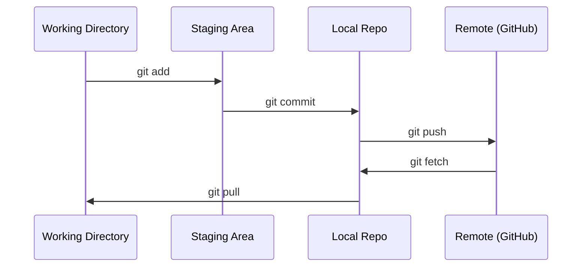

# Git & Colaboração

> O controle de versão não é uma opção. Cada experimento que você constrói aqui, cada modelo, cada aula deve ser rastreado.

**Type:** Learn
**Languages:** --
**Prerequisites:** Phase 0, Lesson 01
**Time:** ~30 分钟

## Objectivo de aprendizagem
- Configurar a identidade git,并使用 adição, compromisso e push do fluxo de trabalho diário
- Para experimentos separados, criar e fundir ramos, evitar que se estrague o principal
- 编写一个 `.gitignore`, excluir pontos de controlo de modelos e arquivos binários grandes
- Utilização `git log`浏览 commit history, compreender a evolução do projeto

## 问题
Você vai atravessar 20 fases  escrever centenas de arquivos de código ⋅ sem controle de versão, você vai perder o trabalho ⋅ destruir coisas irrevogaveis, nem poder colaborar com os outros ⋅

Git é um instrumento. GitHub é um código localizado em qualquer lugar.

## 概念


记住三件事:
1. 经常保存(`git commit`)
2. Puxar até o remoto`git push`)
3. Para experimentar  criar filial`git checkout -b experiment`)


```figure
s0-commit-dag
```

## Construí-lo
### 步骤 1: Configurar git

```bash
git config --global user.name "Your Name"
git config --global user.email "you@example.com"
```

### 步骤 2: Fluxo de trabalho diário

```bash
git status
git add file.py
git commit -m "Add perceptron implementation"
git push origin main
```

### 步骤 3: Para experiência criar

```bash
git checkout -b experiment/new-optimizer

# ... make changes, commit ...

git checkout main
git merge experiment/new-optimizer
```

### 步骤 4: Use this class repo

```bash
git clone https://github.com/rohitg00/ai-engineering-from-scratch.git
cd ai-engineering-from-scratch

git checkout -b my-progress
# work through lessons, commit your code
git push origin my-progress
```

## Use-o
Para esta aula, só precisas destes comandos:

| Command | When |
|---------|------|
| `git clone` | 获取 course repo |
| `git add` + `git commit` | 保存你的工作 |
| `git push` | 备份到 GitHub |
| `git checkout -b` | 在不破坏 main 的情况下尝试东西 |
| `git log --oneline` | 查看你做过什么 |

Assim, o curso não precisa de base ou submodules.

## 练习
1. Clone este repo, criar um nome.`my-progress`A filial, criar um arquivo, comprometê-lo, empurrá-lo.
2.  criar um `.gitignore`, excluir os ficheiros dos pontos de controlo`.pt`- Não.`.pth`- Não.`.safetensors`)
3. - Não .`git log --oneline`Veja o histórico de compromissos deste repo, e leia as lições sobre como foi adicionado.

## 关键术语
| Term | What people say | What it actually means |
|------|----------------|----------------------|
| Commit | “保存” | 你的整个 project 在某个时间点的 snapshot |
| Branch | “一个副本” | 指向某个 commit 的 pointer，会随着你的工作向前移动 |
| Merge | “合并 code” | 把一个 branch 的 changes 应用到另一个 branch |
| Remote | “云端” | 托管在其他地方的 repo 副本（GitHub、GitLab） |
