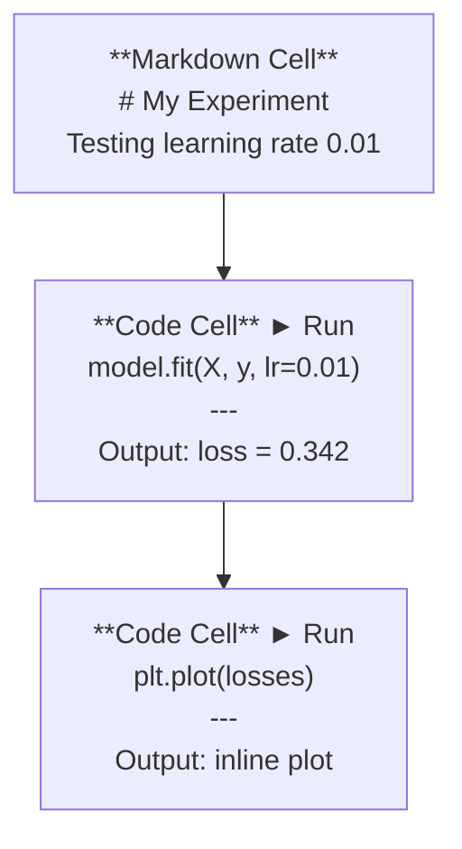
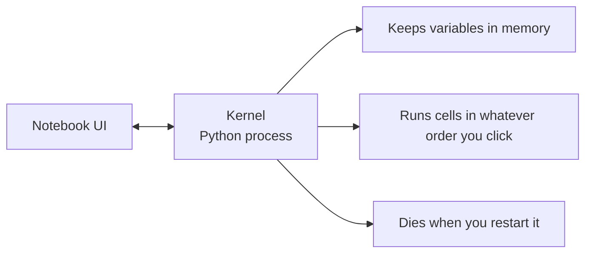

# Júpiter

> Os portáteis são uma plataforma de experiência de engenharia de IA. Você faz um protótipo aqui, e depois muda a parte eficaz para a produção.

**类型：**Construir
**语言：**Python
**前置要求：**Fase 0, Lição 01
**时间：**Cerca de 30 minutos

## Objectivo de aprendizagem

- Instalação e inicialização do JupyterLab、Jupyter Notebook, ou com a extensão de Jupyter VS Code
- Use comandos mágicos`%timeit`- Não.`%%time`- Não.`%matplotlib inline`) fazer um benchmark e inline
- 区分何时使用笔记本、何时使用脚本,并应用在笔记本中探索,在脚本中交付的工作流
- Identificação e evitar notas comuns

## 问题

Cada artigo de AI papel、tutorial 和 Kaggle competição todos usam notebooks Jupyter── eles fazem você dividir o seu tráfego de código、inline 查看输出、混合代码与说明,并快速代── se você tentar não usar notebooks aprender AI, é como fazer uma tarefa matemática, mas não há um esboço de papel──

Mas os cadernos têm uma armadilha. As pessoas usam-nos em tudo, inclusive em coisas que não são muito boas. Saber quando usar o cadastro, quando usar o script, vai fazer com que você se esqueça de muitas coisas.

## 概念

O notebook é composto por um conjunto de elementos. Cada elemento é um código, um texto.



O kernel é um processo Python que funciona na base de dados. Quando você executar uma célula, ele envia o código para o kernel, o kernel executa o código e retorna os resultados. Todas as células compartilham um mesmo kernel, então as variações são mantidas entre as células.



O que você faz é executar o que você faz. É uma super-capacidade, mas também é fácil de pisar.


```figure
s0-cell-order
```

## Construção

### 步骤 1:  escolher sua interface

三种选择,同一种格式:

| Interface | Install | Best for |
|-----------|---------|----------|
| JupyterLab | `pip install jupyterlab` then `jupyter lab` | 完整 IDE 体验、多标签、文件浏览器、terminal |
| Jupyter Notebook | `pip install notebook` then `jupyter notebook` | 简单、轻量、一次一个 notebook |
| VS Code | Install "Jupyter" extension | 已在你的 editor 中、git 集成、debugging |

Três pessoas estão a escrever.`.ipynb`文件──选你喜欢的即可──JupyterLab é a escolha mais comum no trabalho da IA──

```bash
pip install jupyterlab
jupyter lab
```

### 步骤 2: 重要键盘快捷键

Você vai operar em dois modos.`Escape`进入 comando modo(左侧蓝色),按 `Enter`进入 edit mode ((绿色) 』

**Command mode（最常用）：**

| Key | Action |
|-----|--------|
| `Shift+Enter` | 运行 cell，移动到下一个 |
| `A` | 在上方插入 cell |
| `B` | 在下方插入 cell |
| `DD` | 删除 cell |
| `M` | 转换为 markdown |
| `Y` | 转换为 code |
| `Z` | 撤销 cell 操作 |
| `Ctrl+Shift+H` | 显示所有快捷键 |

**Edit mode：**

| Key | Action |
|-----|--------|
| `Tab` | Autocomplete |
| `Shift+Tab` | 显示函数签名 |
| `Ctrl+/` | 切换 comment |

`Shift+Enter`É que você vai usar mil vezes por dia.

### 步骤 3: Tipo de célula

**Code cells**运行 Python 并显示输出:

```python
import numpy as np
data = np.random.randn(1000)
data.mean(), data.std()
```

输出:`(0.0032, 0.9987)`

**Markdown cells**染形式化文本── Use-os para registrar o que você está fazendo e por que o fazendo── apoiar cabeçalhos、bold、italic、LaTeX math(`$E = mc^2$`)、tablas 和 imagens¬¬

### 步骤 4: comandos mágicos

Estes não são Python. São ordens especiais de Júpiter.`%`(Mágico de Linha) ou `%%`- Não, não.

**为你的代码计时：**

```python
%timeit np.random.randn(10000)
```

输出:`45.2 us +/- 1.3 us per loop`

```python
%%time
model.fit(X_train, y_train, epochs=10)
```

输出:`Wall time: 2.34 s`

`%timeit`O número de vezes que se faz o código não é de média.`%%time`Só o faço uma vez.`%timeit`Fazer microbankmarks, us `%%time`Fazer corridas de treinamento.

**启用 inline plots：**

```python
%matplotlib inline
```

Agora todos.`plt.plot()`Ou `plt.show()`"Todos os dias, a gente está a ver o que está acontecendo".

**不离开 notebook 安装 packages：**

```python
!pip install scikit-learn
```

`!`Antes de começar, execute o comando de shell.

**检查环境变量：**

```python
%env CUDA_VISIBLE_DEVICES
```

### 步骤 5: Inline 显示 rica saída

Os portáteis mostram automaticamente a última expressão na célula. Mas também pode controlar:

```python
import pandas as pd

df = pd.DataFrame({
    "model": ["Linear", "Random Forest", "Neural Net"],
    "accuracy": [0.72, 0.89, 0.94],
    "training_time": [0.1, 2.3, 45.6]
})
df
```

Isto vai fazer uma tabela HTML formatizada, em vez de um depósito de texto.

```python
import matplotlib.pyplot as plt

plt.figure(figsize=(8, 4))
plt.plot([1, 2, 3, 4], [1, 4, 2, 3])
plt.title("Inline Plot")
plt.show()
```

A trama aparece na célula, mesmo abaixo. É por isso que os portáteis são os principais motivos do trabalho da IA.

对于图像:

```python
from IPython.display import Image, display
display(Image(filename="architecture.png"))
```

### 步骤 6: Google Colab

Colab é um notebook Jupyter gratuito do cloud. Ele fornece bibliotecas de GPUs e Google Drive.

1. O que é isso ?[colab.research.google.com](https://colab.research.google.com)
2. 上传本课程中的任意 `.ipynb`文件
3. Tempo de execução > Mudança de tipo de tempo de execução > T4 GPU(免费)

Colab e Jupiters:
- Arquivos não serão guardados entre as sessões (para armazenamento ou download)
- 预装:numpy、pandas、matplotlib、torch、tensorflow、sklearn
- Utilização `from google.colab import files`上传/download arquivos
- Utilização `from google.colab import drive; drive.mount('/content/drive')`Fazer armazenamento permanente
- Sessões de nível gratuitas em 90 minutos de inactividade

## Utilização

### Notebooks vs Scripts:何时使用哪一个

| Use notebooks for | Use scripts for |
|-------------------|-----------------|
| 探索 dataset | Training pipelines |
| Prototype model | Reusable utilities |
| 可视化结果 | 任何包含 `if __name__` 的东西 |
| 解释你的工作 | 按计划运行的 code |
| 快速 experiments | Production code |
| Course exercises | Packages and libraries |

规则:**在 notebooks 中探索，在 scripts 中交付**- Não.

A.I.
1. Explorar dados em um caderno
2. Em um caderno de notas, o protótipo do seu modelo
3. Assim que o fazer, vamos transferir o código.`.py`Arquivos
4. - Não.`.py`Arquivos reimportados para o bloco de notas, para mais experimentos

### 常见陷

**乱序执行。**Você primeiro corre na célula 5, re-carrega na célula 2, re-carrega na célula 7。 O livro de notas em seu aparelho pode ser usado, mas outras pessoas vão ficar mal quando estiverem em funcionamento.

**隐藏状态。**Você remove uma célula, mas a variação que ela cria ainda está em memória.

**内存泄漏。**Carregar um conjunto de dados de 4 GB, modelo de treinamento, recarregar outro conjunto de dados, tudo o que não foi liberado.`del variable_name`和 `gc.collect()`, ou reiniciar o kernel.

## 交付

本课会产出:
- `outputs/prompt-notebook-helper.md`, para a sua redacção

## 练习

1. 打开 JupyterLab, criar um notebook,并使用 `%timeit`Comparar compreensão de lista com numpy na criação de 100.000 个随机数组 时差
2. Crear um notebook que simultaneamente contenha marcas e células de código, carregar CSV, exibir dataframe, e desenhar gráfico.
3. - Não .`code/notebook_tips.py`Código de código  Aplique no notebook Colab 中,并使用免费GPU 运行

## 关键术语

| Term | What people say | What it actually means |
|------|----------------|----------------------|
| Kernel | “运行我代码的东西” | 一个独立的 Python process，用来执行 cells 并在内存中保存变量 |
| Cell | “一个 code block” | Notebook 中可独立运行的单元，可以是 code 或 markdown |
| Magic command | “Jupyter 技巧” | 以 `%` 或 `%%` 为前缀、用于控制 notebook 环境的特殊命令 |
| `.ipynb` | “Notebook file” | 一个包含 cells、outputs 和 metadata 的 JSON 文件。代表 IPython Notebook |

## 延伸阅读

- [JupyterLab Docs](https://jupyterlab.readthedocs.io/)查看完整功能集
- [Google Colab FAQ](https://research.google.com/colaboratory/faq.html)查看 Colab 特定限制与功能
- [28 Jupyter Notebook Tips](https://www.dataquest.io/blog/jupyter-notebook-tips-tricks-shortcuts/)查看进阶快捷键
