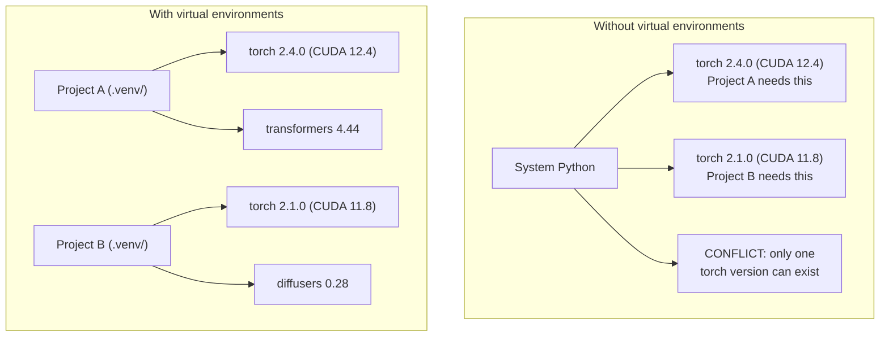

# Ambientes Python

> Dependência inferno 真实存在──virtualização dos ambientes ‒解药──

**Type:** Build
**Languages:** Shell
**Prerequisites:** Phase 0, Lesson 01
**Time:** ~30 分钟

## Objetivos de aprendizagem

- Utilização `uv`- Não.`venv`Ou `conda`Criação de ambientes virtuais isolados
- 编写带有可选依赖群的                                                                                                                                                                                                                                                                                                                                                                                                                                                                                                                   `pyproject.toml`, e gerar arquivos de fechamento para garantir a reprodução
- 诊断并修复常见陷: instalações globais pip/conda 混用、CUDA versão desajustes
- Projetos de dependência de conflito  Realização de uma estratégia ambiental de fase

## 问题

Você instalou PyTorch 2.4 para um projeto de ajuste fino, outro projeto precisa de PyTorch 2.1, porque a sua construção CUDA está fixa, depois de você ter atualizado a sua área inteira, o primeiro projeto está ruim, depois de você ter atualizado, o segundo projeto está ruim, também.

É o inferno da dependência.

- PyTorch、JAX 和 TensorFlow cada um carrega seus próprios vínculos CUDA
- Librações de modelos 会固定 específicas versões de framework
- - Não .`pip install`会覆盖 O conteúdo já existente
- CUDA 11.8 constrói não pode ser usado com drivers CUDA 12.x 配合使用,反之亦然

 solucion: cada projeto tem o seu próprio ambiente de isolamento, bem como os seus próprios pacotes.

## 概念




```figure
s0-env-isolation
```

## Construí-lo

### 选项 1:uv venv(推)

`uv`É o gerenciador de pacotes Python mais rápido ((比 pip 快 10-100 倍) ⋅ é um instrumento para processar ambientes virtuais、versões Python 和 dependência resolução。

```bash
curl -LsSf https://astral.sh/uv/install.sh | sh

uv python install 3.12

cd your-project
uv venv
source .venv/bin/activate
```

Pacotes de instalação:

```bash
uv pip install torch numpy
```

Uma fase de criação`pyproject.toml`O projeto:

```bash
uv init my-ai-project
cd my-ai-project
uv add torch numpy matplotlib
```

### 选项 2:venv(内置)

Se não conseguires instalar .`uv`,Python Automaton`venv`- Não .

```bash
python3 -m venv .venv
source .venv/bin/activate  # Linux/macOS
.venv\Scripts\activate     # Windows

pip install torch numpy
```

- Não .`uv`Lento, mas tudo pode funcionar no local instalado do Python.

### 选项 3:conda(需要时使用)

Conda  administrar kit de ferramentas CUDA cuDNN y C bibliotecas etc. não dependências Python 

- Você precisa de uma versão específica do kit de ferramentas CUDA, mas não quer instalar em todo o sistema
- Você está no cluster compartilhado, não pode instalar pacotes do sistema
- Uma biblioteca de instalações que escreve sobre condomínios

```bash
# Install miniconda (not the full Anaconda)
curl -LsSf https://repo.anaconda.com/miniconda/Miniconda3-latest-Linux-x86_64.sh -o miniconda.sh
bash miniconda.sh -b

conda create -n myproject python=3.12
conda activate myproject

conda install pytorch torchvision torchaudio pytorch-cuda=12.4 -c pytorch -c nvidia
```

Uma regra: se você usa conda em um ambiente, use conda para gerenciar os pacotes do ambiente.`pip install`O conflito de dependência e a sua luta são muito dolorosos.

### O curso é dividido em três fases:

Você pode criar um ambiente para toda a aula. Não faça isso.

策略:

```
ai-engineering-from-scratch/
├── .venv/                    <-- phases 0-3 共用的轻量 env
├── phases/
│   ├── 04-neural-networks/
│   │   └── .venv/            <-- PyTorch env
│   ├── 05-cnns/
│   │   └── .venv/            <-- 同一个 PyTorch env（symlink 或 shared）
│   ├── 08-transformers/
│   │   └── .venv/            <-- 可能需要不同的 transformer versions
│   └── 11-llm-apis/
│       └── .venv/            <-- API SDKs，不需要 torch
```

`code/env_setup.sh`O script do centro irá ser usado para criar um ambiente base para o curso.

## pyproject.toml 基础

Cada projeto Python deve ter um .`pyproject.toml`- É um documento.`setup.py`- Não.`setup.cfg`和 `requirements.txt`- Não.

```toml
[project]
name = "ai-engineering-from-scratch"
version = "0.1.0"
requires-python = ">=3.11"
dependencies = [
    "numpy>=1.26",
    "matplotlib>=3.8",
    "jupyter>=1.0",
    "scikit-learn>=1.4",
]

[project.optional-dependencies]
torch = ["torch>=2.3", "torchvision>=0.18"]
llm = ["anthropic>=0.39", "openai>=1.50"]
```

Então, instale:

```bash
uv pip install -e ".[torch]"    # base + PyTorch
uv pip install -e ".[llm]"     # base + LLM SDKs
uv pip install -e ".[torch,llm]" # everything
```

## Ficha de bloqueio

O arquivo de bloqueio vai colocar cada dependência (incluindo dependências transitivas) fixa até a versão definida. Isto garante a capacidade de repetição: qualquer pessoa que instale o arquivo de bloqueio vai obter os mesmos pacotes.

```bash
# uv generates uv.lock automatically when using uv add
uv add numpy

# pip-tools approach
uv pip compile pyproject.toml -o requirements.lock
uv pip install -r requirements.lock
```

Coloque o seu arquivo de bloqueio em compromissos até que outro clone repo, depois de instalar o arquivo de bloqueio, você vai obter versões totalmente coincidentes.

## 常见错误

### 1. Instalação completa

```bash
pip install torch  # BAD: installs to system Python

source .venv/bin/activate
pip install torch  # GOOD: installs to virtual environment
```

Revisão dos pacotes.

```bash
which python       # should show .venv/bin/python, not /usr/bin/python
which pip           # should show .venv/bin/pip
```

### 2. 混用 pip 和 conda

```bash
conda create -n myenv python=3.12
conda activate myenv
conda install pytorch -c pytorch
pip install some-other-package   # BAD: can break conda's dependency tracking
conda install some-other-package # GOOD: let conda manage everything
```

Se tiver que usar um pip dentro do condomínio, alguns pacotes só apoiam o pip, primeiro instale todos os pacotes do condomínio, e depois reinstala os pacotes do pip.

### 3.  忘记 ativar

```bash
python train.py           # uses system Python, missing packages
source .venv/bin/activate
python train.py           # uses project Python, packages found
```

Seu shell prompt 应显示 nome do ambiente:

```
(.venv) $ python train.py
```

### 4. - Não . - Compromete-te com isso .

```bash
echo ".venv/" >> .gitignore
```

Os ambientes virtuais geralmente têm 200MB-2GB. Eles são locais, não podem ser transferidos entre máquinas.`pyproject.toml`E o arquivo de fechamento.

### 5. Desconhecimento da versão CUDA

```bash
nvidia-smi                # shows driver CUDA version (e.g., 12.4)
python -c "import torch; print(torch.version.cuda)"  # shows PyTorch CUDA version

# These must be compatible.
# PyTorch CUDA version must be <= driver CUDA version.
```

## Usá-lo

运行 script de configuração  criar seu ambiente de aula:

```bash
bash phases/00-setup-and-tooling/06-python-environments/code/env_setup.sh
```

Isto vai ser na raiz repo  criar um `.venv`,并安装和验证 dependências principais.

## 练习

1. 运行 `env_setup.sh`Não confirmo que todos os exames foram aprovados
2. Crear um segundo ambiente virtual, instalar em ele diferentes versões de numpy, e confirmar dois ambientes  mutuamente isolados
3. Para um projeto de PyTorch e Anthropic SDK simultaneamente 编写 `pyproject.toml`
4. Por isso, instale um pacote, não ative venv, observe o que ele está fazendo e depois desliga.

## 关键术语

| Term | What people say | What it actually means |
|------|----------------|----------------------|
| Virtual environment | “A venv” | 一个隔离目录，包含 Python interpreter 和 packages，并与 system Python 分离 |
| Lockfile | “Pinned dependencies” | 一个列出每个 package 及其精确 version 的文件，保证跨机器安装一致 |
| pyproject.toml | “The new setup.py” | 标准 Python project 配置文件，替代 setup.py/setup.cfg/requirements.txt |
| Transitive dependency | “A dependency of a dependency” | Package B 依赖 C；如果你安装依赖 B 的 A，那么 C 就是 A 的 transitive dependency |
| CUDA mismatch | “My GPU isn't working” | PyTorch 编译所用的 CUDA version 与你的 GPU driver 支持的版本不同 |
