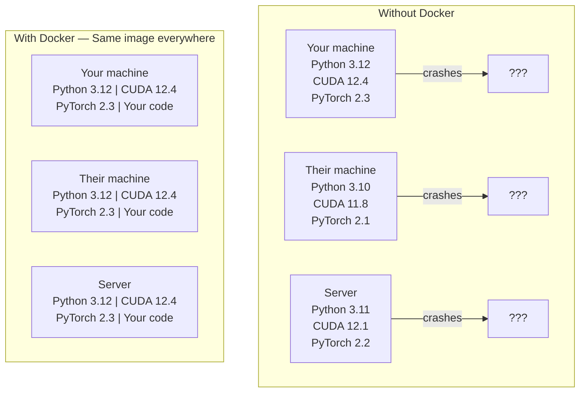

# Docker para IA

> Containers  Deixem que em meu aparelho possa correr  tornar-se passado 

**Type:** Build
**Languages:** Docker
**Prerequisites:** Phase 0, Lessons 01 and 03
**Time:** ~60 分钟

## Objetivos de aprendizagem

- Do Dockerfile Construir imagem do Docker de GPU, contendo CUDA、PyTorch e bibliotecas de IA
- Mantenha os diretórios hostes como volumes montados, para que os contêineres sejam reconstruídos entre modelos, conjuntos de dados e código
- Configure o NVIDIA Container Toolkit, deixe os contêineres  interno acessar GPUs
- Utilize Docker Compose 编排多服务 AI aplicações(servidor de inferência + banco de dados vetorial)

## 问题

Você está no laptop usando PyTorch 2.3、CUDA 12.4 和 Python 3.12 訓練一個模型──你的同事使用 PyTorch 2.1、CUDA 11.8 和 Python 3.10──你的模型在他们的机器上崩──你的Dockerfile在两边都能工作──

Os projetos de IA são pesadelos de dependência. Uma pilha típica inclui Python, Python, Python, Python, Python, Python, Python, Python, Python, Python, Python, Python, Python, Python, Python, Python, Python, Python, Python, Python, Python, Python, Python, Python, Python, Python, Python, Python, Python, Python, Python, Python, Python, Python, Python, Python, Python, Python, Python, Python, Python, Python, Python, Python, Python, Python, Python, Python, Python, Python, Python, Python, Python, Python, Python, Python, Python, Python, Python, Python, Python, Python, Python, Python, Python, Python, Python, Python, Python, Python, Python, Python, Python, Python, Python, Python, Python, Python, Python, Python, Python, Python, Python, Python, Python, Python, Python, Python, Python, Python, Python, Python, Python, Python, Python, Python, Python, Python, Python, Python, Python, Python, Python, Python, Python, Python, Python, etc.

## 概念

O Docker vai colocar seu código, tempo de execução, bibliotecas e ferramentas do sistema em um isolado chamado contêiner. Pode ser visto como uma máquina virtual de leve porte, apenas que compartilha o kernel do sistema operacional host, em vez de executar seu próprio kernel, por isso, o início leva apenas alguns segundos, em vez de algumas minutos.



### Por que os projetos de IA precisam de Docker do que a maioria dos projetos ?

1. **GPU drivers 很脆弱。**CUDA 12.4 código 不能在 CUDA 11.8 上运行──Docker 会隔离容器内 CUDA toolkit,同时通过NVIDIA Container Toolkit共享主机GPU驱动器──

2. **Model weights 很大。**Um modelo de parâmetro 7B em fp16 abaixo tem 14 GB. Você não vai querer re-descará-lo em cada reconstrução.

3. **Multi-service architectures 很常见。**Uma aplicação de IA real não é apenas um script Python. É um servidor de inferência. É usado para base de dados vetoriais RAG.

### 关键词汇

| Term | What it means |
|------|---------------|
| Image | 只读 template。你的 recipe。由 Dockerfile 构建。 |
| Container | image 的运行实例。你的 kitchen。 |
| Dockerfile | 构建 image 的 instructions。逐层构建。 |
| Volume | 可在 container restarts 后保留的持久化 storage。 |
| docker-compose | 用 YAML 定义 multi-container applications 的工具。 |

### Artigo Artigo Artigo Artigo Artigo Artigo Artigo Artigo Artigo Artigo Artigo Artigo Artigo Artigo Artigo Artigo Artigo Artigo Artigo Artigo Artigo Artigo Artigo Artigo Artigo Artigo Artigo Artigo Artigo Artigo Artigo Artigo Artigo Artigo Artigo Artigo Artigo Artigo Artigo Artigo Artigo Artigo Artigo Artigo Artigo Artigo Artigo Artigo Artigo Artigo Artigo Artigo Artigo Artigo Artigo Artigo Artigo Artigo Artigo Artigo Artigo Artigo Artigo Artigo Artigo Artigo Artigo Artigo Artigo Artigo Artigo Artigo Artigo Artigo Artigo Artigo Artigo Artigo Artigo Artigo Artigo Artigo Artigo Artigo Artigo Artigo Artigo Artigo Artigo Artigo Artigo Artigo Artigo Artigo Artigo Artigo Artigo Artigo Artigo Artigo Artigo Artigo Artigo Artigo Artigo Artigo Artigo Artigo Artigo Artigo Artigo Artigo Artigo Artigo Artigo Artigo Artigo Artigo Artigo Artigo Artigo Artigo Artigo Artigo Artigo Artigo Artigo Artigo Artigo Artigo Artigo Artigo Artigo Artigo Artigo Artigo Artigo Artigo Artigo Artigo Artigo Artigo Artigo Artigo Artigo Artigo Artigo Arti Arti Arti Arti Arti Arti Arti Arti Arti Arti Arti Arti Arti Arti Arti Arti Arti Arti Arti Arti Arti Arti Arti Arti Arti Arti Arti Arti Arti Arti Arti Arti Arti Arti Arti Arti Arti Arti Arti Arti Arti Arti Arti Arti Arti Arti Arti Arti Arti Arti Arti Arti Arti Arti Arti Arti Arti Arti Arti Arti Arti Arti Arti Arti Arti Arti Arti Arti Arti Arti Arti Arti Arti Arti Arti Arti Arti Arti Arti Arti Arti Arti Arti Arti Arti Arti Arti Arti Arti Arti Arti Arti Arti Arti Arti Arti Arti Arti Arti Arti Arti Arti Arti Arti Arti Arti Arti Arti Arti Arti Arti Arti Arti Arti Arti Arti Arti Arti Arti Arti Arti Arti Arti Arti Arti Arti Arti Arti Arti Arti Arti Arti Arti Arti Arti Arti Arti Arti Arti Arti Arti Arti Arti Arti Arti Arti Arti Arti Arti Arti Arti Arti Arti Arti Arti Arti Arti Arti Arti Arti Arti Arti Arti Arti Arti Arti Arti Arti Arti Arti Arti Arti Arti Arti Arti Arti Arti Arti Arti Arti Arti Arti Arti Arti Arti Arti Arti Arti Arti Arti Arti Arti Arti Arti Arti Arti Arti Arti Arti Arti Arti Arti Arti Arti Arti Arti Arti Arti Arti Arti Arti Arti Arti Arti Arti Arti

```
Dev Container
  完整 toolkit。Editor support。Jupyter。Debugging tools。
  用于 development 和 experimentation。

Training Container
  最小化。只有 training script 和 dependencies。
  在 GPU clusters 上运行。没有 editor，没有 Jupyter。

Inference Container
  为 serving 优化。Small image。Fast cold start。
  在 production 中运行于 load balancer 后方。
```


```figure
s0-image-layers
```

## Construí-lo

### Passo 1: Instalação do Docker

```bash
# macOS
brew install --cask docker
open /Applications/Docker.app

# Ubuntu
curl -fsSL https://get.docker.com | sh
sudo usermod -aG docker $USER
# Log out and back in for group change to take effect
```

验证:

```bash
docker --version
docker run hello-world
```

### Passo 2: Instale o Kit de Ferramentas de Container NVIDIA (com GPU de NVIDIA)

Isto permite que os contêineres docker possam acessar sua GPU;. macOS e Windows;; WSL2) os usuários podem saltar; Docker Desktop em estas plataformas processar GPU de forma diferente através do

```bash
distribution=$(. /etc/os-release;echo $ID$VERSION_ID)
curl -fsSL https://nvidia.github.io/libnvidia-container/gpgkey | sudo gpg --dearmor -o /usr/share/keyrings/nvidia-container-toolkit-keyring.gpg
curl -s -L https://nvidia.github.io/libnvidia-container/$distribution/libnvidia-container.list | \
    sed 's#deb https://#deb [signed-by=/usr/share/keyrings/nvidia-container-toolkit-keyring.gpg] https://#g' | \
    sudo tee /etc/apt/sources.list.d/nvidia-container-toolkit.list

sudo apt-get update
sudo apt-get install -y nvidia-container-toolkit
sudo nvidia-ctk runtime configure --runtime=docker
sudo systemctl restart docker
```

Em contêiner interno test acesso GPU:

```bash
docker run --rm --gpus all nvidia/cuda:12.4.1-base-ubuntu22.04 nvidia-smi
```

Se vires informações da GPU, explica o kit de ferramentas.

### Passo 3: compreender imagens de base

选择正确的基image可以省数小时调试时间──

```
nvidia/cuda:12.4.1-devel-ubuntu22.04
  完整 CUDA toolkit。包含 compilers。
  Use for: 构建需要 nvcc 的 packages（flash-attn、bitsandbytes）
  Size: ~4 GB

nvidia/cuda:12.4.1-runtime-ubuntu22.04
  仅 CUDA runtime。没有 compilers。
  Use for: 运行 pre-built code
  Size: ~1.5 GB

pytorch/pytorch:2.3.1-cuda12.4-cudnn9-runtime
  基于 CUDA 预装 PyTorch。
  Use for: 跳过 PyTorch install step
  Size: ~6 GB

python:3.12-slim
  没有 CUDA。仅 CPU。
  Use for: CPU inference、lightweight tools
  Size: ~150 MB
```

### Passo 4: Desenvolvimento de IA 编写 Dockerfile

É isso .`code/Dockerfile`Dockerfile do Centro.

```dockerfile
FROM nvidia/cuda:12.4.1-devel-ubuntu22.04

ENV DEBIAN_FRONTEND=noninteractive
ENV PYTHONUNBUFFERED=1

RUN apt-get update && apt-get install -y --no-install-recommends \
    python3.12 \
    python3.12-venv \
    python3.12-dev \
    python3-pip \
    git \
    curl \
    build-essential \
    && rm -rf /var/lib/apt/lists/*

RUN update-alternatives --install /usr/bin/python python /usr/bin/python3.12 1

RUN python -m pip install --no-cache-dir --upgrade pip setuptools wheel

RUN python -m pip install --no-cache-dir \
    torch==2.3.1 \
    torchvision==0.18.1 \
    torchaudio==2.3.1 \
    --index-url https://download.pytorch.org/whl/cu124

RUN python -m pip install --no-cache-dir \
    numpy \
    pandas \
    scikit-learn \
    matplotlib \
    jupyter \
    transformers \
    datasets \
    accelerate \
    safetensors

WORKDIR /workspace

VOLUME ["/workspace", "/models"]

EXPOSE 8888

CMD ["python"]
```

Construí-lo:

```bash
docker build -t ai-dev -f phases/00-setup-and-tooling/07-docker-for-ai/code/Dockerfile .
```

Primeiro, vamos passar algum tempo, baixando a imagem base da CUDA + PyTorch.

- Não .

```bash
docker run --rm -it --gpus all \
    -v $(pwd):/workspace \
    -v ~/models:/models \
    ai-dev python -c "import torch; print(f'PyTorch {torch.__version__}, CUDA: {torch.cuda.is_available()}')"
```

Em contêiner dentro de Júpiter:

```bash
docker run --rm -it --gpus all \
    -v $(pwd):/workspace \
    -v ~/models:/models \
    -p 8888:8888 \
    ai-dev jupyter notebook --ip=0.0.0.0 --port=8888 --no-browser --allow-root
```

### Passo 5: para utilização de dados e modelos de montagem de volume

O volume aumenta para a IA 工作至关重要──没有它们,你的14 GB模型下载会在容器 停止后消失──

```bash
# Mount your code
-v $(pwd):/workspace

# Mount a shared models directory
-v ~/models:/models

# Mount datasets
-v ~/datasets:/data
```

Em seu roteiro de treinamento, do caminho montado

```python
from transformers import AutoModel

model = AutoModel.from_pretrained("/models/llama-7b")
```

Modelo  Está em seu sistema de arquivos host 上。 Você pode reconstruir o contêiner de qualquer maneira, sem necessidade de re-descarregá-lo。

### Passo 6: Compõe Docker para aplicativos de IA de serviços múltiplos

Uma verdadeira aplicação RAG  precisa de servidor de inferência 和 vector database──Docker Compose 用一条命令运行两者──

- Não .`code/docker-compose.yml`- Não .

```yaml
services:
  ai-dev:
    build:
      context: .
      dockerfile: Dockerfile
    deploy:
      resources:
        reservations:
          devices:
            - driver: nvidia
              count: all
              capabilities: [gpu]
    volumes:
      - ../../../:/workspace
      - ~/models:/models
      - ~/datasets:/data
    ports:
      - "8888:8888"
    stdin_open: true
    tty: true
    command: jupyter notebook --ip=0.0.0.0 --port=8888 --no-browser --allow-root

  qdrant:
    image: qdrant/qdrant:v1.12.5
    ports:
      - "6333:6333"
      - "6334:6334"
    volumes:
      - qdrant_data:/qdrant/storage

volumes:
  qdrant_data:
```

启动所有服务:

```bash
cd phases/00-setup-and-tooling/07-docker-for-ai/code
docker compose up -d
```

Agora o seu recipiente de desenvolvimento de IA pode ser usado como nome de serviço.`http://qdrant:6333`访问 vector database──Docker Compose 会自动创建共享网络──

Do recipiente de IA 内测试连接:

```python
from qdrant_client import QdrantClient

client = QdrantClient(host="qdrant", port=6333)
print(client.get_collections())
```

停止所有服务:

```bash
docker compose down
```

- Não .`-v`Também vou eliminar volume:

```bash
docker compose down -v
```

### Passo 7: comandos docker em uso prático

```bash
# List running containers
docker ps

# List all images and their sizes
docker images

# Remove unused images (reclaim disk space)
docker system prune -a

# Check GPU usage inside a running container
docker exec -it <container_id> nvidia-smi

# Copy a file from container to host
docker cp <container_id>:/workspace/results.csv ./results.csv

# View container logs
docker logs -f <container_id>
```

## Usá-lo

Você agora tem um ambiente de desenvolvimento de IA replicável.

- Utilização `docker compose up`Ao mesmo tempo, inicia o seu ambiente de desenvolvimento e base de dados vetorial
- Codificar modelos e dados como volumes montados, garantir que não se perca qualquer conteúdo entre as reconstruções
- Quando uma lição precisa de um novo pacote Python, adicione-o ao Dockerfile e reconstrui-o
- Com os colegas de equipa partilham o teu ficheiro docker.

### Não tem GPU?

移除 `--gpus all`flag 和 NVIDIA deploy block──container  ainda se aplica a lições baseadas em CPU──PyTorch 会自动检测没有CUDA,并倒退到CPU──

## 练习

1. Construir o Dockerfile, e dentro do recipiente `python -c "import torch; print(torch.__version__)"`
2. Início do stack docker-composto,并验证可从AI container 访问 `http://qdrant:6333/collections`Qdrant de cima
3. - Não .`flask`Adicionar ao Dockerfile, reconstruir e colocar no porto 5000 para executar um simples servidor API.`-p 5000:5000`mapa 端口
4. Utilização `docker images`测量 image size──try to remove base image `devel`切换到 `runtime`,并比较大小

## 关键术语

| Term | What people say | What it actually means |
|------|----------------|----------------------|
| Container | “Lightweight VM” | 使用 host kernel 的隔离进程，拥有自己的 filesystem 和 network |
| Image layer | “Cached step” | 每条 Dockerfile instruction 都会创建一个 layer。未变化的 layers 会被 cached，因此 rebuilds 很快。 |
| NVIDIA Container Toolkit | “GPU in Docker” | 一个 runtime hook，通过 `--gpus` flag 将 host GPUs 暴露给 containers |
| Volume mount | “Shared folder” | host 上映射进 container 的目录。container 停止后 changes 仍会保留。 |
| Base image | “Starting point” | 你的 Dockerfile 基于其构建的 `FROM` image。它决定了预装内容。 |
