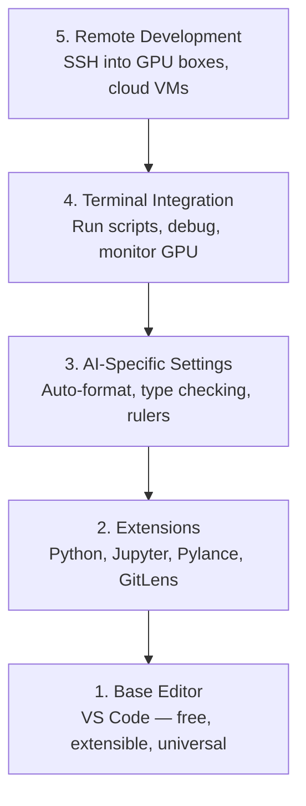

# Configuração do editor

> Seu editor é seu parceiro de colaboração. Configure-o de uma vez em uma, deixe que ele deixe de ser um obstáculo e comece a funcionar realmente.

**Type:** Build
**Languages:** --
**Prerequisites:** Phase 0, Lesson 01
**Time:** ~20 分钟

## Objectivo de aprendizagem
- Instalação VS Code, configuração Python、Jupyter、linting 和 remoto SSH necessários extensões de núcleo
- Para os fluxos de trabalho da IA Configuração de formato-em-salvo, verificação de tipo e rolagem de saída de notebook
- Configurar Remote SSH, como editores locais como em GPU de distância  máquina de edição e depuração  código
- 评估其他编辑器选择(Cursor、Windsurf、Neovim) e suas intervenções no trabalho da IA

## 问题
Você gastará milhares de horas no editor: escrever Python, executar notebooks, depurar os loops de treinamento, bem como SSH para GPU 机器―― um editor de configuração inadequada fará com que cada trabalho esteja cheio de resistência: sem autocompleto, sem sugestões de tipo, sem erros de linha, precisa de formatagem manual, bem como um fluxo de trabalho terminal pesado―.

A configuração precisa de 20 minutos. Salto, todos os dias perdem 20 minutos.

## 概念
A configuração de editores de engenharia de IA requer cinco coisas:




```figure
s0-lsp-roundtrip
```

## Construí-lo
### 步骤 1: Instalar Código VS

 Use VS Code── é gratuito, pode ser executado em todos os sistemas operacionais  no notebook Jupyter tem um suporte, e o modo de extensão cobre tudo o que é necessário para o trabalho da IA──

De[code.visualstudio.com](https://code.visualstudio.com/)Desça.

Em terminal:

```bash
code --version
```

Se macOS 上找不到 `code`, abre VS Código, press `Cmd+Shift+P`,输入 "Shell Command", então selecione "Install 'code' comando em PATH"。

### 步骤 2: instalação necessária expansão

Em VS Code em 中打开集成终端`Ctrl+`` `Ou `` Cmd+```), installar trabalho de IA 需要的扩展:

```bash
code --install-extension ms-python.python
code --install-extension ms-python.vscode-pylance
code --install-extension ms-toolsai.jupyter
code --install-extension eamodio.gitlens
code --install-extension ms-vscode-remote.remote-ssh
code --install-extension ms-python.debugpy
code --install-extension ms-python.black-formatter
code --install-extension charliermarsh.ruff
```

Cada extensão de efeitos:

| Extension | Why |
|-----------|-----|
| Python | Language 支持、virtual env 检测、run/debug |
| Pylance | 快速 type checking、autocomplete、import resolution |
| Jupyter | 在 VS Code 内运行 notebooks、variable explorer |
| GitLens | 查看谁改了什么、inline git blame |
| Remote SSH | 像本地一样打开远程 GPU 机器上的文件夹 |
| Debugpy | Python 的 step-through debugging |
| Black Formatter | 保存时自动格式化，保持风格一致 |
| Ruff | 快速 linting，捕获常见错误 |

本课中 `code/.vscode/extensions.json`文件包含完整推列表──当你打开项目文件时,VS Code 会提示你安装它们──

### 步骤 3: Configuração

复制本课 `code/.vscode/settings.json`Em meio a configurações, ou através de `Settings > Open Settings (JSON)`Aplicação manual.

Configurações de trabalho da IA:

```jsonc
{
    "python.analysis.typeCheckingMode": "basic",
    "editor.formatOnSave": true,
    "editor.rulers": [88, 120],
    "notebook.output.scrolling": true,
    "files.autoSave": "afterDelay"
}
```

Por que é isso tão importante:

- **Type checking on basic**: в运行前捕获错误的参数类型──能节省 debug tensor shape mismatches 和错误 API parâmetros 的时间──
- **Format on save**Não é preciso pensar em formalização.
- **Rulers at 88 and 120**: Negro 在 88 处换行──120 标记显示docstrings 和 comments 什么时候过长──
- **Notebook output scrolling**Loops de treinamento 会印数千行──没有滚动时,输出板 会无限膨胀──
- **Auto-save**Você vai esquecer de guardar. Seu script de treinamento vai funcionar com o código antigo.

### 步骤 4: Terminal 集成

O terminal integrado do VS Code é o local onde você opera scripts de treinamento, controla GPUs e gerencia ambientes.

Configuração:

```jsonc
{
    "terminal.integrated.defaultProfile.osx": "zsh",
    "terminal.integrated.defaultProfile.linux": "bash",
    "terminal.integrated.fontSize": 13,
    "terminal.integrated.scrollback": 10000
}
```

Há um rápido chave útil:

| Action | macOS | Linux/Windows |
|--------|-------|---------------|
| Toggle terminal | `` Ctrl+` `` | `` Ctrl+` `` |
| New terminal | `Ctrl+Shift+`` ` | `Ctrl+Shift+`` ` |
| Split terminal | `Cmd+\` | `Ctrl+\` |

Terminals divididos  muito útil: um para executar o seu script, outro para usar `nvidia-smi -l 1`Ou `watch -n 1 nvidia-smi`- Supervisão de GPU.

### 步骤 5: desenvolvimento de distância ((SSH até GPU 机器)

É a maior extensão de trabalho da IA. Você vai executar treinamento em máquinas de distância.

Configuração:

1. Instalação de extensão remota de SSH ((já está no passo 2 完成)
2. 按 `Ctrl+Shift+P`(ou `Cmd+Shift+P`),输入 "Remote-SSH: Conectar-se ao host"―
3. 输入 `user@your-gpu-box-ip`- Não.
4. O código VS irá instalar automaticamente o seu componente de servidor em uma máquina remota.

Para acesso sem senha, configure chaves SSH:

```bash
ssh-keygen -t ed25519 -C "your-email@example.com"
ssh-copy-id user@your-gpu-box-ip
```

Para facilitar, adicione o anfitrião.`~/.ssh/config`- Não .

```
Host gpu-box
    HostName 203.0.113.50
    User ubuntu
    IdentityFile ~/.ssh/id_ed25519
    ForwardAgent yes
```

Agora , agora .`Remote-SSH: Connect to Host > gpu-box`"Ao mesmo tempo, eu vou estar ligada".

## Alternativas

### Cursor

[cursor.com](https://cursor.com)É uma geração de código de IA embutido de VS Code fork. Ele usa a mesma extensão, modo e configuração.`settings.json`和 `extensions.json`- Não.

### Windsurf

[windsurf.com](https://windsurf.com)É outro fork de código VS-primeiro AI. A situação é a mesma: as mesmas extensões, as mesmas configurações, o mesmo formato, o mesmo Remote SSH 支持。

### Vim/Neovim

Se já estiveres usando Vim ou Neovim e a eficiência é muito alta, então continua a usar.

- **pyright**Ou **pylsp**Usado para verificação de tipo (via Mason ou manual)
- **nvim-lspconfig**Utilize para a integração de servidor de linguagem
- **jupyter-vim**Ou **molten-nvim**Utilizando execução de notebook
- **telescope.nvim**Usado para pesquisa de arquivo/símbolo
- **none-ls.nvim**搭配 black 和 ruff Usado para formatar/limpar

Se ainda não usaste o Vim, não comece agora.

## Use-o
Com este conjunto, o seu fluxo de trabalho diário parece assim:

1. Em VS Code 中打开项目文件 (或通过远程SSH 连接到GPU机器)
2. Em editores, escrever Python, usando autocompleto, tipografia e erros de linha.
3. Utilize extensão Jupyter 内联运行 Júpiter notebooks。
4. Utilize terminal integrado 运行 treinamento scripts`uv pip install`E monitoramento da GPU.
5. 提交前用 GitLens revisão de alterações。

## 练习
1. Instalação VS Código e Passo 2 Na lista de todas as extensões
2. O que é isso?`settings.json`复制到你的 VS Código de configuração 中
3. 打开一个Python文件,验证Pylance 显示类型提示,并且黑会在保存时格式化
4. Se você pode acessar uma máquina remota, configure Remote SSH e abra um arquivo sobre ele

## 关键术语
| Term | What people say | What it actually means |
|------|----------------|----------------------|
| LSP | "Autocomplete engine" | Language Server Protocol：一种标准，让 editors 可以从特定 language 的 server 获取 type info、completions 和 diagnostics |
| Pylance | "The Python plugin" | Microsoft 的 Python language server，使用 Pyright 进行 type checking 和 IntelliSense |
| Remote SSH | "Working on the server" | VS Code extension，在远程机器上运行轻量 server，并将 UI stream 到本地 editor |
| Format on save | "Auto-prettier" | 每次保存时 editor 都会运行 formatter（Black、Ruff），因此 code style 始终一致 |
