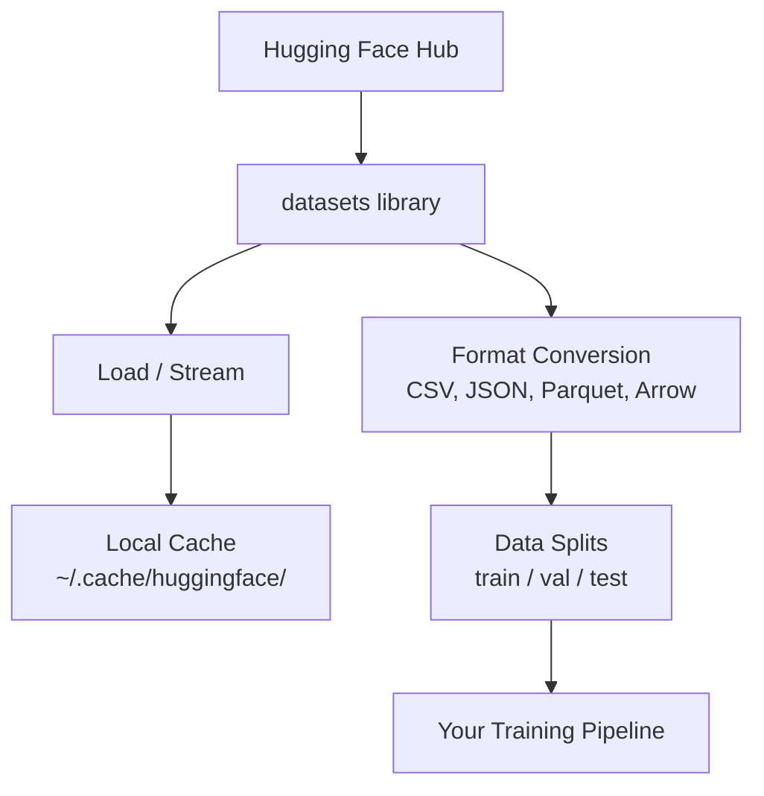

# Gestão de dados

> Os dados são combustível. Como os gerenciar, é o que determina se consegues ir mais rápido.

**Type:** Build
**Language:**Python
**Prerequisites:** Phase 0, Lesson 01
**Time:** ~45 分钟

## Objectivo de aprendizagem
- Uso de cara abraçada .`datasets`biblioteca, uploads, streams e conjuntos de dados do cache
- Transformar entre os formatos CSV、JSON、Parquet e Arrow, e explicar a sua utilização
- Use fixed random seeds 创建可复现的火车/验证/测试分区
- Utilização `.gitignore`、Git LFS ou DVC 管理大型模型 和数据集文件

## 问题
Cada projeto de IA é baseado em dados. Você precisa encontrar conjuntos de dados, baixá-los, transformá-los entre formatos, separá-los para treinamento e avaliação, fazer versões com eles, fazer experimentos, fazer repetitivos.

## 概念


Abraçando o rosto`datasets`A biblioteca é para o trabalho da IA.


```figure
s0-data-pipeline
```

## Construí-lo
### 步骤 1: Instalação de bibliotecas de conjuntos de dados

```bash
pip install datasets huggingface_hub
```

### 步骤 2: Carregar um conjunto de dados

```python
from datasets import load_dataset

dataset = load_dataset("imdb")
print(dataset)
print(dataset["train"][0])
```

Esta será a primeira vez que o filme será baixado no IMDB.`~/.cache/huggingface/datasets/`De cache carregado.

### 步骤 3: Processamento de grandes conjuntos de dados

Alguns conjuntos de dados são muito grandes, não podem ser inseridos no disco.

```python
dataset = load_dataset("wikimedia/wikipedia", "20220301.en", split="train", streaming=True)

for i, example in enumerate(dataset):
    print(example["title"])
    if i >= 4:
        break
```

O streaming vai dar-te um .`IterableDataset` Você vai ficar em filas até chegar a tempo de processá-los.

### 步骤 4: Formatos de conjuntos de dados

`datasets`Biblioteca 底层 usando Apache Arrow。 você pode, de acordo com as necessidades do pipeline, converter para outros formatos。

```python
dataset = load_dataset("imdb", split="train")

dataset.to_csv("imdb_train.csv")
dataset.to_json("imdb_train.json")
dataset.to_parquet("imdb_train.parquet")
```

Formatos para:

| Format | Size | Read Speed | Best For |
|--------|------|-----------|----------|
| CSV | 大 | 慢 | Human readability、spreadsheets |
| JSON | 大 | 慢 | APIs、nested data |
| Parquet | 小 | 快 | Analytics、columnar queries |
| Arrow | 小 | 最快 | In-memory processing（`datasets` 内部使用的格式） |

Para o trabalho da IA, o Parquet é o melhor formato de armazenamento. Arrow é o formato que você usa na memória.

### 步骤 5: Divisão de dados

Cada projeto de MLM precisa de três divisões:

- **Train**:modelo de aqui aprender(normalmente 80%)
- **Validation**O processo de formação é de 10% (normalmente 10%).
- **Test**A formação 完成后的最终评估 (normalmente 10%)

Alguns conjuntos de dados já foram divididos.

```python
dataset = load_dataset("imdb", split="train")

split = dataset.train_test_split(test_size=0.2, seed=42)
train_val = split["train"].train_test_split(test_size=0.125, seed=42)

train_ds = train_val["train"]
val_ds = train_val["test"]
test_ds = split["test"]

print(f"Train: {len(train_ds)}, Val: {len(val_ds)}, Test: {len(test_ds)}")
```

Sempre configurar sementes para garantir a reproducibilidade.

### 步骤 6: Download e cache

Os modelos são grandes documentos.`huggingface_hub`Biblioteca 会处理 downloading 和 caching。

```python
from huggingface_hub import hf_hub_download, snapshot_download

model_path = hf_hub_download(
    repo_id="sentence-transformers/all-MiniLM-L6-v2",
    filename="config.json"
)
print(f"Cached at: {model_path}")

model_dir = snapshot_download("sentence-transformers/all-MiniLM-L6-v2")
print(f"Full model at: {model_dir}")
```

Os modelos vão ser armazenados até`~/.cache/huggingface/hub/` 下载一次后后,后续运行会立即加载──

### 步骤 7: processar grandes documentos

Pesos de modelo e grandes conjuntos de dados não devem entrar em git.

**Option A: .gitignore（最简单）**

```
*.bin
*.safetensors
*.pt
*.onnx
data/*.parquet
data/*.csv
models/
```

**Option B: Git LFS（在 git 中跟踪大型文件）**

```bash
git lfs install
git lfs track "*.bin"
git lfs track "*.safetensors"
git add .gitattributes
```

Git LFS em seu repo em indicadores de armazenamento, e vai armazenar os arquivos reais em um servidor separado.

**Option C: DVC（data version control）**

```bash
pip install dvc
dvc init
dvc add data/training_set.parquet
git add data/training_set.parquet.dvc data/.gitignore
git commit -m "Track training data with DVC"
```

DVC 会创建小型 `.dvc`文件,指向你的数据──Data 本身存储在S3、GCS或其他远程存储后端中──

| Approach | Complexity | Best For |
|----------|-----------|----------|
| .gitignore | 低 | 个人项目、可重新获取的 downloaded data |
| Git LFS | 中 | 通过 git 共享 model weights 的团队 |
| DVC | 高 | 可复现 experiments、大型 datasets、团队 |

对于本课程,`.gitignore`已足够── quando você precisa de experimentos precisos 时, reutilize DVC──

### 步骤 8: padrões de armazenamento

**Local storage** Adaptado para conjuntos de dados de ~ 10 GB. HF cache 会自动处理──

**Cloud storage** para conteúdo maior, ou necessitam de conteúdo compartilhado através de máquinas:

```python
import os

local_path = os.path.expanduser("~/.cache/huggingface/datasets/")

# s3_path = "s3://my-bucket/datasets/"
# gcs_path = "gs://my-bucket/datasets/"
```

DVC pode ser integrado directamente com S3 e GCS:

```bash
dvc remote add -d myremote s3://my-bucket/dvc-store
dvc push
```

对于本课程,本课程,本课程,本课程,本课程,本课程,本课程,本课程,本课程,本课程,本课程,本课程,本课程,本课程,本课程,本课程,本课程,本课程,本课程,本课程,本课程,本课程,本课程,本课程,本课程,本课程,本课程,本课程,本课程,本课程,本课程,本课程,本课程,本课程,本课程,本课,本课,本课,本课,本课,本课,本课,本课,本课,本课,本课,本课,本课,本课,本课,本课,本课,本课,本课,本课,本课,本课,本课,本课,本课,本课,本课,本课,本课,本课,本课,本课,本课,本课,本课,本课,本课,本课,本课,本课,本课,本课,本课,本课,本课,本课,本课,课,课,课,课, 

## Este curso utiliza conjuntos de dados

| Dataset | Lessons | Size | What It Teaches |
|---------|---------|------|----------------|
| IMDB | Tokenization、classification | 84 MB | Text classification 基础 |
| WikiText | Language modeling | 181 MB | Next-token prediction |
| SQuAD | QA systems | 35 MB | Question answering、spans |
| Common Crawl (subset) | Embeddings | 不定 | Large-scale text processing |
| MNIST | Vision basics | 21 MB | Image classification fundamentals |
| COCO (subset) | Multimodal | 不定 | Image-text pairs |

Agora não precisas de baixar tudo isto. Cada aula vai explicar o que é preciso.

## Use-o
运行 utility script 验证一切正常:

```bash
python code/data_utils.py
```

Isto vai baixar um pequeno conjunto de dados, transformá-lo, dividir-lo, e imprimir o resumo.

## Entrega-o
本课产出:
- `code/data_utils.py`- Utilidade de carregamento de dados e caching de recorrente
- `outputs/prompt-data-helper.md`- Usado para tarefas de busca de um conjunto de dados adequado

## 练习
1. Utilização `mrpc`Config `glue`conjunto de dados,并检查前 5 个例
2. - Corrente .`c4`conjunto de dados,并统计 10 秒内可以处理多少例
3. Transformar um conjunto de dados em Parquet, e comparar o tamanho do arquivo com o CSV
4. Utilize semente fixa 创建 70/15/15 tren/val/test split,并验证 size

## 关键术语
| Term | What people say | What it actually means |
|------|----------------|----------------------|
| Dataset split | "Training data" | 一个命名 subset（train/val/test），用于 ML lifecycle 的不同阶段 |
| Streaming | "Load it lazily" | 从远程 source 逐行处理 data，而不下载完整 dataset |
| Parquet | "Compressed CSV" | 一种 columnar file format，针对 analytical queries 和 storage efficiency 优化 |
| Arrow | "Fast dataframe" | `datasets` library 内部使用的 in-memory columnar format，用于 zero-copy reads |
| Git LFS | "Git for big files" | 一个 extension，将大型文件存储在 git repo 外，同时在 version control 中保留 pointers |
| DVC | "Git for data" | 一个用于 datasets 和 models 的 version control system，可与 cloud storage 集成 |
| Cache | "Already downloaded" | 之前获取过的 data 的本地副本，默认存储在 ~/.cache/huggingface/ |
