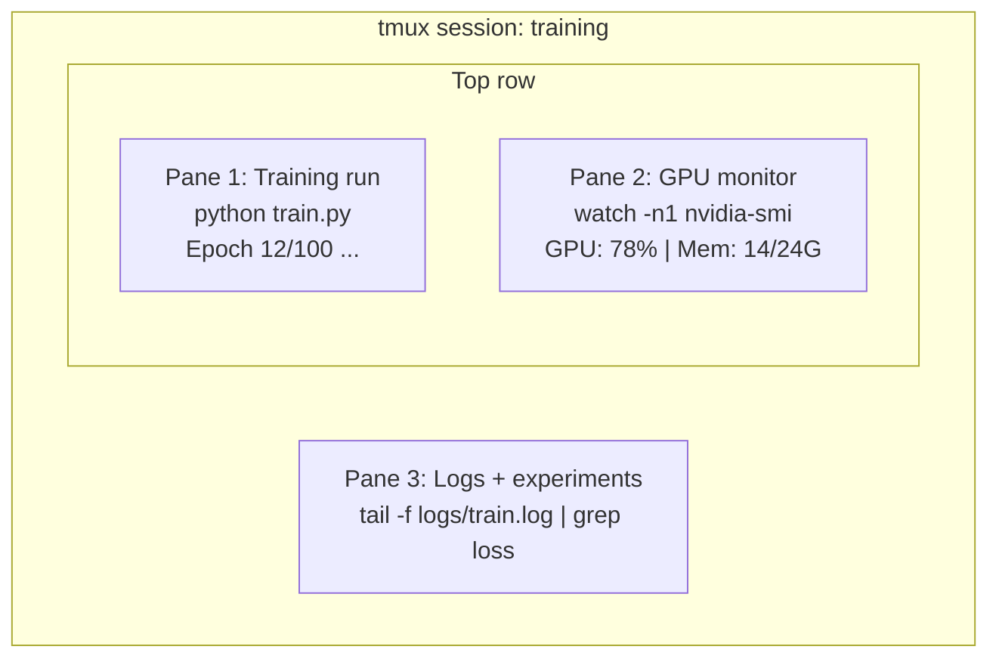

# Terminal e Shell

> O terminal é o principal campo de engenheiros de IA.

**类型：**- aprendizagem
**语言：**- Não .
**先修要求：**Fase 0, Lição 01
**时间：**- 35 minutos.

## Objectivo de aprendizagem

- Utilize tubulação, redireções e`grep`Desde a ordem de execução e tratamento de treinamento
-  criar contendo vários painéis de duração tmux sessões, para desenvolver treinamento e GPU  monitoramento
- Utilização `htop`- Não.`nvtop`和 `nvidia-smi` Sistema de monitoramento e recursos de GPU
- Utilize SSH`scp`和 `rsync`Ficha de transmissão entre máquinas locais e remotas

## 问题

Você passou mais tempo no terminal do que qualquer editor. Treinings run­ge, GPUs monitor, diários, tail, sessions de SSH remotas, gestão ambiental.

本课覆盖 AI 工作真正需要的终端 技能──不讲 Unix 历史──不深入 Bash scripting──只讲你需要的内容──

## 概念



Três coisas funcionam simultaneamente. Um terminal. Podes desligar, voltar para casa, voltar para casa, depois religar.


```figure
s0-shell-pipeline
```

## Construí-lo

### 步骤 1: 了解你的贝

Verifique qual é o seu sistema de navegação:

```bash
echo $SHELL
```

                                                                                                                                                                                                                                                                                                                                                                                                                                                                                                                             `bash`Ou `zsh`                                                                                                                                                                                                                                                              

需要知道的关键内容:

```bash
# Move around
cd ~/projects/ai-engineering-from-scratch
pwd
ls -la

# History search (most useful shortcut you'll learn)
# Ctrl+R then type part of a previous command
# Press Ctrl+R again to cycle through matches

# Clear terminal
clear   # or Ctrl+L

# Cancel a running command
# Ctrl+C

# Suspend a running command (resume with fg)
# Ctrl+Z
```

### 步骤 2: Piping e redirecionamento

Piping 会把命令 连接起来──这就是你处理日志、过输出、串联工具──你会经常使用它──

```bash
# Count how many times "loss" appears in a log
cat train.log | grep "loss" | wc -l

# Extract just the loss values from training output
grep "loss:" train.log | awk '{print $NF}' > losses.txt

# Watch a log file update in real time, filtering for errors
tail -f train.log | grep --line-buffered "ERROR"

# Sort experiments by final accuracy
grep "final_accuracy" results/*.log | sort -t= -k2 -n -r

# Redirect stdout and stderr to separate files
python train.py > output.log 2> errors.log

# Redirect both to the same file
python train.py > train_full.log 2>&1
```

Você precisa de dominar os três redirecionamentos:

| 符号 | 作用 |
|--------|-------------|
| `>` | 将 stdout 写入文件（覆盖） |
| `>>` | 将 stdout 追加到文件 |
| `2>` | 将 stderr 写入文件 |
| `2>&1` | 将 stderr 发送到与 stdout 相同的位置 |
| `\|` | 将一个 command 的 stdout 作为 stdin 发送给下一个 command |

### 步骤 3: 后台 processo

O treinamento leva algumas horas. Não queres estar no terminal.

```bash
# Run in background (output still goes to terminal)
python train.py &

# Run in background, immune to hangup (closing terminal won't kill it)
nohup python train.py > train.log 2>&1 &

# Check what's running in background
jobs
ps aux | grep train.py

# Bring a background job to foreground
fg %1

# Kill a background process
kill %1
# or find its PID and kill that
kill $(pgrep -f "train.py")
```

`&`- Não.`nohup`和 `screen`- Não .`tmux`É um problema.

| 方法 | 关闭 terminal 后还能继续？ | 可以 reattach？ |
|--------|-------------------------|---------------|
| `command &` | 否 | 否 |
| `nohup command &` | 是 | 否（查看 log file） |
| `screen` / `tmux` | 是 | 是 |

Qualquer tarefa que exceda alguns minutos, é tudo para mim.

### 步骤 4: tmux

Tmux 让你创建包含多面板的持久终端会议── é o único instrumento mais útil para executar um treinamento de gestão──

```bash
# Install
# macOS
brew install tmux
# Ubuntu
sudo apt install tmux

# Start a named session
tmux new -s training

# Split horizontally
# Ctrl+B then "

# Split vertically
# Ctrl+B then %

# Navigate between panes
# Ctrl+B then arrow keys

# Detach (session keeps running)
# Ctrl+B then d

# Reattach
tmux attach -t training

# List sessions
tmux ls

# Kill a session
tmux kill-session -t training
```

Sessão de fluxo de trabalho típico de IA:

```bash
tmux new -s train

# Pane 1: start training
python train.py --epochs 100 --lr 1e-4

# Ctrl+B, " to split, then run GPU monitor
watch -n1 nvidia-smi

# Ctrl+B, % to split vertically, tail the logs
tail -f logs/experiment.log

# Now detach with Ctrl+B, d
# SSH out, go get coffee, come back
# tmux attach -t train
```

### 步骤 5: 使用 htop 和 nvtop 监控

```bash
# System processes (better than top)
htop

# GPU processes (if you have NVIDIA GPU)
# Install: sudo apt install nvtop (Ubuntu) or brew install nvtop (macOS)
nvtop

# Quick GPU check without nvtop
nvidia-smi

# Watch GPU usage update every second
watch -n1 nvidia-smi

# See which processes are using the GPU
nvidia-smi --query-compute-apps=pid,name,used_memory --format=csv
```

Vais usar isso.`htop`Telas de chave:
- `F6`Ou `>`按列排序(按 memorias 排序可查找 memorias em fuga)
- `F5`切换 tree view(查看 processos infantis)
- `F9`Matar um processo
- `/`搜索 nome do processo

### 步骤 6: Usar SSH  Conectar GPU de distância 机器

Quando você aluga com GPU em nuvem ((Lambda、RunPod、Vast.ai)), vai passar por SSH 连接。

```bash
# Basic connection
ssh user@gpu-box-ip

# With a specific key
ssh -i ~/.ssh/my_gpu_key user@gpu-box-ip

# Copy files to remote
scp model.pt user@gpu-box-ip:~/models/

# Copy files from remote
scp user@gpu-box-ip:~/results/metrics.json ./

# Sync a whole directory (faster for many files)
rsync -avz ./data/ user@gpu-box-ip:~/data/

# Port forward (access remote Jupyter/TensorBoard locally)
ssh -L 8888:localhost:8888 user@gpu-box-ip
# Now open localhost:8888 in your browser

# SSH config for convenience
# Add to ~/.ssh/config:
# Host gpu
#     HostName 192.168.1.100
#     User ubuntu
#     IdentityFile ~/.ssh/gpu_key
#
# Then just:
# ssh gpu
```

### 步骤 7: AI 工作 usadas sobrenomes

Apresentar isto contigo.`~/.bashrc`Ou `~/.zshrc`- Não .

```bash
source phases/00-setup-and-tooling/10-terminal-and-shell/code/shell_aliases.sh
```

Ou copiar o que você quer.

```bash
# GPU status at a glance
alias gpu='nvidia-smi --query-gpu=index,name,utilization.gpu,memory.used,memory.total,temperature.gpu --format=csv,noheader'

# Kill all Python training processes
alias killtraining='pkill -f "python.*train"'

# Quick virtual environment activate
alias ae='source .venv/bin/activate'

# Watch training loss
alias watchloss='tail -f logs/*.log | grep --line-buffered "loss"'
```

完整集合见 `code/shell_aliases.sh`- Não.

### 步骤 8: 常见 AI terminal padrões

Estes surgem repetidamente na prática:

```bash
# Run training, log everything, notify when done
python train.py 2>&1 | tee train.log; echo "DONE" | mail -s "Training complete" you@email.com

# Compare two experiment logs side by side
diff <(grep "accuracy" exp1.log) <(grep "accuracy" exp2.log)

# Find the largest model files (clean up disk space)
find . -name "*.pt" -o -name "*.safetensors" | xargs du -h | sort -rh | head -20

# Download a model from Hugging Face
wget https://huggingface.co/model/resolve/main/model.safetensors

# Untar a dataset
tar xzf dataset.tar.gz -C ./data/

# Count lines in all Python files (see how big your project is)
find . -name "*.py" | xargs wc -l | tail -1

# Check disk space (training data fills disks fast)
df -h
du -sh ./data/*

# Environment variable check before training
env | grep -i cuda
env | grep -i torch
```

## Use-o

O uso de cada ferramenta neste curso:

| 工具 | 使用时机 |
|------|----------------|
| tmux | 每次训练运行（Phases 3+） |
| `tail -f` + `grep` | 监控训练日志 |
| `nohup` / `&` | 快速后台任务 |
| `htop` / `nvtop` | 调试慢训练、OOM errors |
| SSH + `rsync` | 在 cloud GPUs 上工作 |
| Piping + redirects | 处理实验结果 |
| Aliases | 节省重复 commands 的时间 |

## 练习

1. Instale o tmux, crie uma sessão que contém três painéis e execute um deles `htop`, outro operário `watch -n1 date`, terço executar um script Python... Desligar e depois religar...
2. - Não .`code/shell_aliases.sh`Os alias do meio são adicionados à configuração do shell, não usam.`source ~/.zshrc`(ou `~/.bashrc`) Recarregamento:
3. - Não .`for i in $(seq 1 100); do echo "epoch $i loss: $(echo "scale=4; 1/$i" | bc)"; sleep 0.1; done > fake_train.log`Crear um falso diário de treinamento, e depois usar `grep`- Não.`tail`和 `awk`Só aumentam os valores de perda.
4. Por você tem o direito de acesso limitado ao servidor  Configurar uma entrada de configuração SSH(ou usar `localhost`练习语法) ⋅

## 关键术语

| 术语 | 人们怎么说 | 实际含义 |
|------|----------------|----------------------|
| Shell | “The terminal” | 解释你的 commands 的程序（bash、zsh、fish） |
| tmux | “Terminal multiplexer” | 一个让你在一个窗口中运行多个 terminal sessions，并支持 detach/reattach 的程序 |
| Pipe | “The bar thing” | `\|` operator，会把一个 command 的 output 作为 input 发送给另一个 command |
| PID | “Process ID” | 分配给每个运行中 process 的唯一编号，用于监控或 kill 它 |
| nohup | “No hangup” | 运行一个不受 hangup signal 影响的 command，因此关闭 terminal 不会 kill 它 |
| SSH | “Connecting to the server” | Secure Shell，一种用于在远程机器上运行 commands 的加密 protocol |
