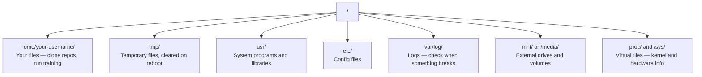

# Façados para o Linux da IA

> A maioria da IA funciona no Linux. Você precisa ter conhecimento de que não vai ficar ligado.

**类型：**- aprendizagem
**语言：**- Não .
**先修要求：**Fase 0, Lição 01
**时间：**- 30 minutos.

## Objectivo de aprendizagem

- 浏览 Linux file system,并从命令行执行基本文件操作
- Utilização `chmod`和 `chown`administra permissões de arquivo, para resolver erros "Permissão negada"
- Utilização `apt`Instalação de pacotes de sistema,并为AI 工作设置一台新GPU box
- 识别 When switch from macOS to Linux, o desenvolvedor está sempre pisando em uma máquina remota

## 问题

Você está em macOS ou Windows, mas assim que você entrar em uma caixa de GPU em nuvem, alugar uma instância Lambda, ou iniciar uma máquina EC2, você entrará em Ubuntu. O terminal é a sua única interface.

Este é um guia de sobrevivência. Só cobre o conteúdo necessário para fazer trabalho de IA em máquinas Linux remotas.

## Sistema de arquivos 布局

Linux, organizar tudo numa única raiz.`/`Não há nada.`C:\`Ou `/Volumes`你实际会接触的目录:



O seu diretório de casa é`~`Ou `/home/your-username`Quase tudo acontece aqui.

## Comandos necessários

Os seguintes 15 comandos cobrem a sua caixa de GPU remoto, 95% da operação.

###  Mudança de posição

```bash
pwd                         # Where am I?
ls                          # What's here?
ls -la                      # What's here, including hidden files with details?
cd /path/to/dir             # Go there
cd ~                        # Go home
cd ..                       # Go up one level
```

### 文件和目录

```bash
mkdir my-project            # Create a directory
mkdir -p a/b/c              # Create nested directories in one shot

cp file.txt backup.txt      # Copy a file
cp -r src/ src-backup/      # Copy a directory (recursive)

mv old.txt new.txt          # Rename a file
mv file.txt /tmp/           # Move a file

rm file.txt                 # Delete a file (no trash, it's gone)
rm -rf my-dir/              # Delete a directory and everything inside
```

`rm -rf`Não há nada que possa ser feito.

### 读取文件

```bash
cat file.txt                # Print entire file
head -20 file.txt           # First 20 lines
tail -20 file.txt           # Last 20 lines
tail -f log.txt             # Follow a log file in real time (Ctrl+C to stop)
less file.txt               # Scroll through a file (q to quit)
```

###  busca

```bash
grep "error" training.log           # Find lines containing "error"
grep -r "learning_rate" .           # Search all files in current directory
grep -i "cuda" config.yaml          # Case-insensitive search

find . -name "*.py"                 # Find all Python files under current dir
find . -name "*.ckpt" -size +1G     # Find checkpoint files larger than 1GB
```

## Permissões

Cada arquivo no Linux tem proprietário e bits de permissão. Quando os scripts não podem ser executados ou você não pode escrever em algum catálogo, você vai encontrar este problema.

```bash
ls -l train.py
# -rwxr-xr-- 1 user group 2048 Mar 19 10:00 train.py
#  ^^^             owner permissions: read, write, execute
#     ^^^          group permissions: read, execute
#        ^^        everyone else: read only
```

常见修复方式:

```bash
chmod +x train.sh           # Make a script executable
chmod 755 deploy.sh         # Owner: full, others: read+execute
chmod 644 config.yaml       # Owner: read+write, others: read only

chown user:group file.txt   # Change who owns a file (needs sudo)
```

Quando alguém diz "permissão negada", quase sempre são permissões.`chmod +x`Ou `sudo`Pode-se corrigir a maioria das situações.

## Gestão de pacotes (apto)

Ubuntu 使用 `apt` É o modo de instalar software de nível de sistema

```bash
sudo apt update             # Refresh the package list (always do this first)
sudo apt install -y htop    # Install a package (-y skips confirmation)
sudo apt install -y build-essential  # C compiler, make, etc. Needed by many Python packages
sudo apt install -y tmux    # Terminal multiplexer (keep sessions alive after disconnect)

apt list --installed        # What's installed?
sudo apt remove htop        # Uninstall
```

Você vai encontrar em uma nova caixa de GPU em pacotes de montagem regular:

```bash
sudo apt update && sudo apt install -y \
    build-essential \
    git \
    curl \
    wget \
    tmux \
    htop \
    unzip \
    python3-venv
```

## Usuários 和 sudo

Você normalmente é um usuário comum 登录── algumas operações necessitam de roteiro(admin)

```bash
whoami                      # What user am I?
sudo command                # Run a single command as root
sudo su                     # Become root (exit to go back, use sparingly)
```

Em instâncias de GPU em nuvem, você é normalmente o único usuário, e já tem acesso ao sudo. Não deixe tudo funcionar com o root.

## Processos e sistemas

Quando você está treinando, ou você precisa verificar o conteúdo em execução:

```bash
htop                        # Interactive process viewer (q to quit)
ps aux | grep python        # Find running Python processes
kill 12345                  # Gracefully stop process with PID 12345
kill -9 12345               # Force kill (use when graceful doesn't work)
nvidia-smi                  # GPU processes and memory usage
```

Sistema de gestão de serviços de dados de fundo. Se você usar servidores de inferência, usará:

```bash
sudo systemctl start nginx          # Start a service
sudo systemctl stop nginx           # Stop it
sudo systemctl restart nginx        # Restart it
sudo systemctl status nginx         # Check if it's running
sudo systemctl enable nginx         # Start automatically on boot
```

## Espaço de disco

O espaço no disco das caixas de GPU é normalmente limitado.

```bash
df -h                       # Disk usage for all mounted drives
df -h /home                 # Disk usage for /home specifically

du -sh *                    # Size of each item in current directory
du -sh ~/.cache             # Size of your cache (pip, huggingface models land here)
du -sh /data/checkpoints/   # Check how big your checkpoints are

# Find the biggest space hogs
du -h --max-depth=1 / 2>/dev/null | sort -hr | head -20
```

常见省空间方式:

```bash
# Clear pip cache
pip cache purge

# Clear apt cache
sudo apt clean

# Remove old checkpoints you don't need
rm -rf checkpoints/epoch_01/ checkpoints/epoch_02/
```

## Rede

Você vai fazer download de modelos, de transferência de arquivos e de APIs.

```bash
# Download files
wget https://example.com/model.bin                   # Download a file
curl -O https://example.com/data.tar.gz              # Same thing with curl
curl -s https://api.example.com/health | python3 -m json.tool  # Hit an API, pretty-print JSON

# Transfer files between machines
scp model.bin user@remote:/data/                     # Copy file to remote machine
scp user@remote:/data/results.csv .                  # Copy file from remote to local
scp -r user@remote:/data/checkpoints/ ./local-dir/   # Copy directory

# Sync directories (faster than scp for large transfers, resumes on failure)
rsync -avz --progress ./data/ user@remote:/data/
rsync -avz --progress user@remote:/results/ ./results/
```

Para qualquer grande transporte, utilização prioritária `rsync`Não é?`scp` É capaz de transmitir apenas bytes que mudam e de processar interrupções de ligação

## Tmux: manter Sessions 存活

Quando você chegar à caixa de distância, o laptop vai matar o seu treinamento.

```bash
tmux new -s train           # Start a new session named "train"
# ... start your training, then:
# Ctrl+B, then D            # Detach (training keeps running)

tmux ls                     # List sessions
tmux attach -t train        # Reattach to session

# Inside tmux:
# Ctrl+B, then %            # Split pane vertically
# Ctrl+B, then "            # Split pane horizontally
# Ctrl+B, then arrow keys   # Switch between panes
```

长时间训练任务总是放在tmux 里运行――总是如此――

## Face towards Windows usuário WSL2

Se você estiver no Windows, o WSL2 pode fornecer um ambiente Linux real sem necessidade de dual-boot.

```bash
# In PowerShell (admin)
wsl --install -d Ubuntu-24.04

# After restart, open Ubuntu from Start menu
sudo apt update && sudo apt upgrade -y
```

WSL2 运行真实Linux kernel──本课中的所有内容都能在其中工作──从 WSL 内部看, seus arquivos do Windows 位于 `/mnt/c/Users/YourName/`- Não.

GPU passthrough 需要 Windows 侧安装 NVIDIA drivers──安装 Windows NVIDIA driver( não driver Linux),CUDA 就会在 WSL2 内可用──

## MacOS para Linux

Se você é do macOS, estas coisas vão ficar contigo:

| macOS | Linux | 说明 |
|-------|-------|-------|
| `brew install` | `sudo apt install` | package names 有时不同。`brew install htop` 和 `sudo apt install htop` 效果相同，但 `brew install readline` 和 `sudo apt install libreadline-dev` 不同。 |
| `open file.txt` | `xdg-open file.txt` | 但远程 box 上通常没有 GUI。使用 `cat` 或 `less`。 |
| `pbcopy` / `pbpaste` | 不可用 | SSH 上不存在 pipe 到/来自 clipboard 的能力。 |
| `~/.zshrc` | `~/.bashrc` | macOS 默认使用 zsh。大多数 Linux servers 使用 bash。 |
| `/opt/homebrew/` | `/usr/bin/`, `/usr/local/bin/` | Binaries 位于不同位置。 |
| `sed -i '' 's/a/b/' file` | `sed -i 's/a/b/' file` | macOS sed 需要在 `-i` 后加一个空字符串。Linux 不需要。 |
| Case-insensitive filesystem | Case-sensitive filesystem | 在 Linux 上，`Model.py` 和 `model.py` 是两个不同文件。 |
| Line endings `\n` | Line endings `\n` | 相同。但 Windows 使用 `\r\n`，会破坏 bash scripts。运行 `dos2unix` 修复。 |

## 快速参考卡

```
Navigation:     pwd, ls, cd, find
Files:          cp, mv, rm, mkdir, cat, head, tail, less
Search:         grep, find
Permissions:    chmod, chown, sudo
Packages:       apt update, apt install
Processes:      htop, ps, kill, nvidia-smi
Services:       systemctl start/stop/restart/status
Disk:           df -h, du -sh
Network:        curl, wget, scp, rsync
Sessions:       tmux new/attach/detach
```


```figure
s0-process-fork
```

## 练习

1. SSH para qualquer máquina Linux ((( ou abrir WSL2),并导航到你的家庭目录── criar uma pasta de projeto, entre eles usar `touch`Crear três documentos vazios, e depois usar `ls -la`- Não.
2. Utilizado para o equipamento .`htop`, executá-lo, e descobrir qual processo utiliza a maior memória.
3. Iniciar uma sessão de discussão, entre elas,`sleep 300`, desligado, sessões de saída, e depois religar.
4. Utilização `df -h`检查可用磁盘空间, então usar `du -sh ~/.cache/*`找出 cache 中占空间的内容──
5. Utilização `scp`Transmitir um arquivo de uma máquina local para uma máquina remota, e depois usar.`rsync`Faça a mesma transmissão,并比较体验──
