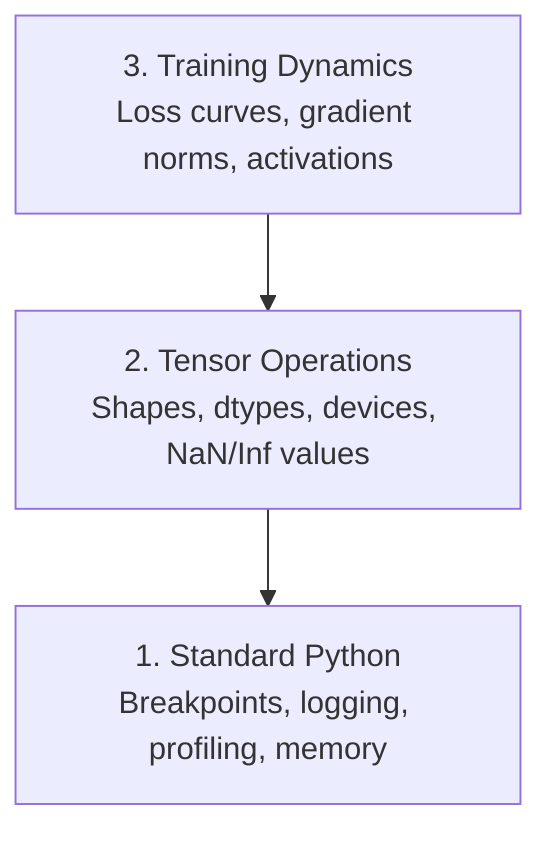

# Debugging e Profiling

> Os piores bugs da IA não se desmoronam. Treinam silenciosamente em dados de lixo e relatam uma curva de perda bonita.

**类型：**Construção
**语言：**Python
**先修要求：**Lição 1 ((Dev Environment), Basic PyTorch 熟悉度
**时间：**- 60 minutos.

## Objectivo de aprendizagem

- Uso condicional`breakpoint()`和 `debug_print`Em treinamento no meio do caminho de inspecção tensor formas, tipos e valores NaN
- Utilização `cProfile`- Não.`line_profiler`和 `tracemalloc`Profil  formação ciclo, encontrar gargalos de engarrafamento
- 检测常见 AI bugs: desajustes de forma, perda de NaN, vazamento de dados e tensores de dispositivo errado
- Configuração TensorBoard para curvas de perda visíveis, histogramas de peso e distribuições de gradientes

## 问题

O método de falha do código AI é diferente do código comum. Aplicações web vão levar o rastro de pilha de colapso. Configuração de erro de treinamento loop irá funcionar 8 horas, queimar 200 dólares GPU  tempo, e então produzir um modelo de valor médio de previsão para cada entrada.`.detach()`, ou etiquetas                                                                                                                                                                                                                                                                                                                                                                                                                                                                                                                         

Precisas de ferramentas de depuração, perdas o teu tempo e computação antes de as capturar.

## 概念

A desativação da IA é dividida em três níveis:



A maioria das pessoas salta diretamente para o 3o nível. Mas 80% dos bugs da IA estão no 1o e 2o nível.


```figure
s0-flame-hot
```

## Construí-lo

### Parte 1: Impressão Debug ((( é de, é válido)

O depuração de impressão é frequentemente levado em conta, mas não é. Para o código tensor, uma declaração de impressão com objetivo geralmente é superada por um teste de graduação, porque você precisa ver uma vez as formas, tipos e intervalos de valores.

```python
def debug_print(name, tensor):
    print(f"{name}: shape={tensor.shape}, dtype={tensor.dtype}, "
          f"device={tensor.device}, "
          f"min={tensor.min().item():.4f}, max={tensor.max().item():.4f}, "
          f"mean={tensor.mean().item():.4f}, "
          f"has_nan={tensor.isnan().any().item()}")
```

Em cada operação de suspeita, depois de usá-lo, encontrar o bug, remover essas impressões.

### Parte 2: Python Debugger ((pdb 和 ponto de ruptura)

O defeitador interno foi subestimado no trabalho da IA.`breakpoint()`放进训练循环,并交互式检查门子──

```python
def training_step(model, batch, criterion, optimizer):
    inputs, labels = batch
    outputs = model(inputs)
    loss = criterion(outputs, labels)

    if loss.item() > 100 or torch.isnan(loss):
        breakpoint()

    loss.backward()
    optimizer.step()
```

Quando o depurador stop downcome, comandos úteis:

- `p outputs.shape`检查 formas
- `p loss.item()`查看 valor da perda
- `p torch.isnan(outputs).sum()`统计 NaNs
- `p model.fc1.weight.grad`检查 gradientes
- `c`Continuar,`q` Retiro

É o que é condicional debugging. É muito importante para o treinamento de 10 mil passos.

### Parte 3: Logging Python

Quando o seu depósito de erros 超出快速检查范围时, use logging 替换打印声明──

```python
import logging

logging.basicConfig(
    level=logging.INFO,
    format="%(asctime)s [%(levelname)s] %(message)s",
    handlers=[
        logging.FileHandler("training.log"),
        logging.StreamHandler()
    ]
)
logger = logging.getLogger(__name__)

logger.info("Starting training: lr=%.4f, batch_size=%d", lr, batch_size)
logger.warning("Loss spike detected: %.4f at step %d", loss.item(), step)
logger.error("NaN loss at step %d, stopping", step)
```

Logging  fornecer timestamps、severity levels 和 file output── quando o treinamento é executado em 3 horas da manhã, você quer o arquivo de log, e não o terminal de saída já rolou na tela──

### Parte 4: Por code区段计时

Saber o tempo passar por lá é o primeiro passo para melhorar.

```python
import time

class Timer:
    def __init__(self, name=""):
        self.name = name

    def __enter__(self):
        self.start = time.perf_counter()
        return self

    def __exit__(self, *args):
        elapsed = time.perf_counter() - self.start
        print(f"[{self.name}] {elapsed:.4f}s")

with Timer("data loading"):
    batch = next(dataloader_iter)

with Timer("forward pass"):
    outputs = model(batch)

with Timer("backward pass"):
    loss.backward()
```

常见发现:carga de dados ocupa 60% do tempo de treinamento.`num_workers > 0`Em vez de mudar a GPU mais rápida.

### Parte 5: cProfile 和 line_profiiler

Quando você precisa de mais informações do que os cronometradores manuais:

```bash
python -m cProfile -s cumtime train.py
```

Isto mostrará cada chamada de função, e em tempo cumulativo 排序──若要逐行配置:

```bash
pip install line_profiler
```

```python
@profile
def train_step(model, data, target):
    output = model(data)
    loss = F.cross_entropy(output, target)
    loss.backward()
    return loss

# Run with: kernprof -l -v train.py
```

### Parte 6: Profilagem da memória

#### Utilize tracemalloc 查看 CPU Memória

```python
import tracemalloc

tracemalloc.start()

# your code here
model = build_model()
data = load_dataset()

snapshot = tracemalloc.take_snapshot()
top_stats = snapshot.statistics("lineno")
for stat in top_stats[:10]:
    print(stat)
```

#### Utilize memory_profile 查看 CPU Memory

```bash
pip install memory_profiler
```

```python
from memory_profiler import profile

@profile
def load_data():
    raw = read_csv("data.csv")       # watch memory jump here
    processed = preprocess(raw)       # and here
    return processed
```

- Não .`python -m memory_profiler your_script.py`运行,以查看逐行 memória utilização

#### Utilize PyTorch 查看 Memória de GPU

```python
import torch

if torch.cuda.is_available():
    print(torch.cuda.memory_summary())

    print(f"Allocated: {torch.cuda.memory_allocated() / 1e9:.2f} GB")
    print(f"Cached: {torch.cuda.memory_reserved() / 1e9:.2f} GB")
```

Quando você se encontra com a minha mãe (Out of Memory)

1. 减小批量 (perpétuo é o primeiro a tentar)
2. Utilização `torch.cuda.empty_cache()`释放 memória em cache
3. Para grandes intermediários`del tensor`, em seguida调用 `torch.cuda.empty_cache()`
4. Utilize precisão mista`torch.cuda.amp`) vai o uso de memória  reduzir em metade
5. Para modelos muito profundos, utilizar ponto de verificação de gradiente

### Parte 7:                                                                                                                                                                                                                                                                                                                                                                                                                                                                                                                            

#### Desconformidade de forma

A forma mais comum de um tensor é`[batch, features]`, mas o modelo 期望 `[batch, channels, height, width]`- Não.

```python
def check_shapes(model, sample_input):
    print(f"Input: {sample_input.shape}")
    hooks = []

    def make_hook(name):
        def hook(module, inp, out):
            in_shape = inp[0].shape if isinstance(inp, tuple) else inp.shape
            out_shape = out.shape if hasattr(out, "shape") else type(out)
            print(f"  {name}: {in_shape} -> {out_shape}")
        return hook

    for name, module in model.named_modules():
        hooks.append(module.register_forward_hook(make_hook(name)))

    with torch.no_grad():
        model(sample_input)

    for h in hooks:
        h.remove()
```

Usar um lote de amostra 运行一次──它会映射模型 中每一次形转换──

#### Perda de N

A perda de NaN diz que algumas coisas explodiram.

- Taxa de aprendizagem 太高
- perda de aluguel
- Para o log de 0 ou negativo
- RNNs entre gradientes  explosão

```python
def detect_nan(model, loss, step):
    if torch.isnan(loss):
        print(f"NaN loss at step {step}")
        for name, param in model.named_parameters():
            if param.grad is not None:
                if torch.isnan(param.grad).any():
                    print(f"  NaN gradient in {name}")
                if torch.isinf(param.grad).any():
                    print(f"  Inf gradient in {name}")
        return True
    return False
```

#### Fugas de dados

Seu modelo no set de testes alcançou 99% de precisão.

```python
def check_data_leakage(train_set, test_set, id_column="id"):
    train_ids = set(train_set[id_column].tolist())
    test_ids = set(test_set[id_column].tolist())
    overlap = train_ids & test_ids
    if overlap:
        print(f"DATA LEAKAGE: {len(overlap)} samples in both train and test")
        return True
    return False
```

Também preciso verificar a fuga temporal: Using futur data pré测过去── dividir 排序前先按时间标签──

#### Dispositivo errado

Os tensores em diferentes dispositivos (CPU vs GPU) podem causar erros de tempo de execução. Mas às vezes um tensor fica parado na CPU, enquanto tudo o resto está na GPU.

```python
def check_devices(model, *tensors):
    model_device = next(model.parameters()).device
    print(f"Model device: {model_device}")
    for i, t in enumerate(tensors):
        if t.device != model_device:
            print(f"  WARNING: tensor {i} on {t.device}, model on {model_device}")
```

### Parte 8: TensorBoard 基础

TensorBoard vai mostrar o que aconteceu no processo de treinamento.

```bash
pip install tensorboard
```

```python
from torch.utils.tensorboard import SummaryWriter

writer = SummaryWriter("runs/experiment_1")

for step in range(num_steps):
    loss = train_step(model, batch)

    writer.add_scalar("loss/train", loss.item(), step)
    writer.add_scalar("lr", optimizer.param_groups[0]["lr"], step)

    if step % 100 == 0:
        for name, param in model.named_parameters():
            writer.add_histogram(f"weights/{name}", param, step)
            if param.grad is not None:
                writer.add_histogram(f"grads/{name}", param.grad, step)

writer.close()
```

Inicie-o:

```bash
tensorboard --logdir=runs
```

Para que se preocupar:

- **Loss 不下降**: Taxa de aprendizagem  muito baixa, ou arquitetura de modelo  problema
- **Loss 剧烈震荡**Taxa de aprendizagem 太高
- **Loss 变成 NaN**:Instabilidade numérica ((see supra de NaN 部分)
- **Train loss 下降，val loss 上升**Oficinas de montagem:
- **Weight histograms 坍缩到零**Gradientes em desvanecimento:
- **Gradient histograms 爆炸**: precisa de cortar gradiente

### Parte 9: Debugger de código VS

Para o debugging de intercâmbio, us`launch.json`配置 VS Código:

```json
{
    "version": "0.2.0",
    "configurations": [
        {
            "name": "Debug Training",
            "type": "debugpy",
            "request": "launch",
            "program": "${file}",
            "console": "integratedTerminal",
            "justMyCode": false
        }
    ]
}
```

Clique no botão de entrada  Configuração de pontos de interrupção。 use Variables pane  check tensor properties。Debug Console 让你在执行中途运行任意Python expressions。

Isto é muito útil para ver as linhas de pré-processamento de dados passo a passo, especialmente quando você quer ver cada transformação.

## Use-o

Os seguintes fluxos de trabalho de depuração podem capturar a maioria dos bugs da IA:

1. **训练前**:用 amostra lot 运行 `check_shapes` Verificação das dimensões de entrada e saída  conforme o esperado.
2. **前 10 步**: para perdas, saídas e gradientes `debug_print`                                                                                                                                                                                                                                                              
3. **训练期间**A taxa de aprendizagem e as normas de gradiente.
4. **出问题时**:                                                                                                                                                                                                                                                                                                                                                                                                                                                                                                                             `breakpoint()`◊ 交互式检查 Tensores
5. **针对性能**:计时数据 loading、forward、backward pass──若接近 OOM,则profile memory──

## Entrega-o

运行 script de depuração de kit de ferramentas:

```bash
python phases/00-setup-and-tooling/12-debugging-and-profiling/code/debug_tools.py
```

- Não .`outputs/prompt-debug-ai-code.md`, um deles ajuda a diagnosticar bugs específicos da IA.

## 练习

1. 运行 `debug_tools.py`, , , , , , , , , , , , , , , , , , , , , , , , , , , , , , , , , , , , , , , , , , , , , , , , , , , , , , , , , , , , , , , , , , , , , , , , , , , , , , , , , , , , , , , , , , , , , , , , , , , , , , , , , , , , , , , , , , , , , , , , , , , , , , , , , , , , , , , , , , , , , , , , , , , , , , , , , , , , , , , , , , , , , , , , , , , , , , , , , , , , , , , , , , , , , , , , , , , , , , , , , , , , , , , , , , , , , , , , , , , , , , , , , , , , , , , , , , , , , , , , , , , , , , , , , , , , , , , , , , , , , , , , , , , , , , , , , , , , , , , , , , , , , , , , , , , , , , , , , , , , , , , , , , , , , , , , , , , , , , , , , , , , , , , , , , , , , , , , , , , , , , , , , , , , , , , , , , , , , , , , , , , , , , , , , , , , , , , , , , , , , , , , , , , , , , , , , , , , , , , , , , , , , , , , , , , , , , , , , , , , , , , , , , , , , , , , , , , , , , , , , , , , , , , , , , , , , , , , , , , , , , , , , , , , , , , , , , , , , , , , , , , , , , , , , , , , , , , , , , , , , , , , , , , , , ,
2. Utilização `cProfile`perfil um ciclo de treinamento,并识别最慢的功能──
3. Utilização `tracemalloc`找出数据 loading pipeline 中哪一行分配了最多内存的部分──
4. Para uma simples execução de treinamento, configurar TensorBoard, não identificar o modelo ou não sobre-ajustamento.
5. Em circuito de treinamento`breakpoint()`◊ Exercícios de desmantelamento de instâncias                                                                                                                                                                                                                                                                                                                                                                                                                                                                                                                 
