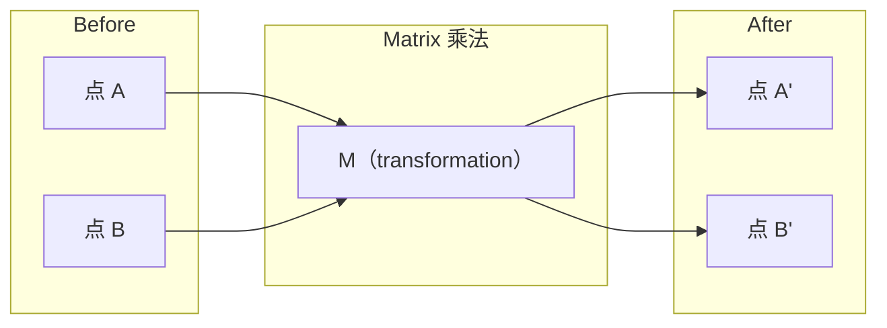
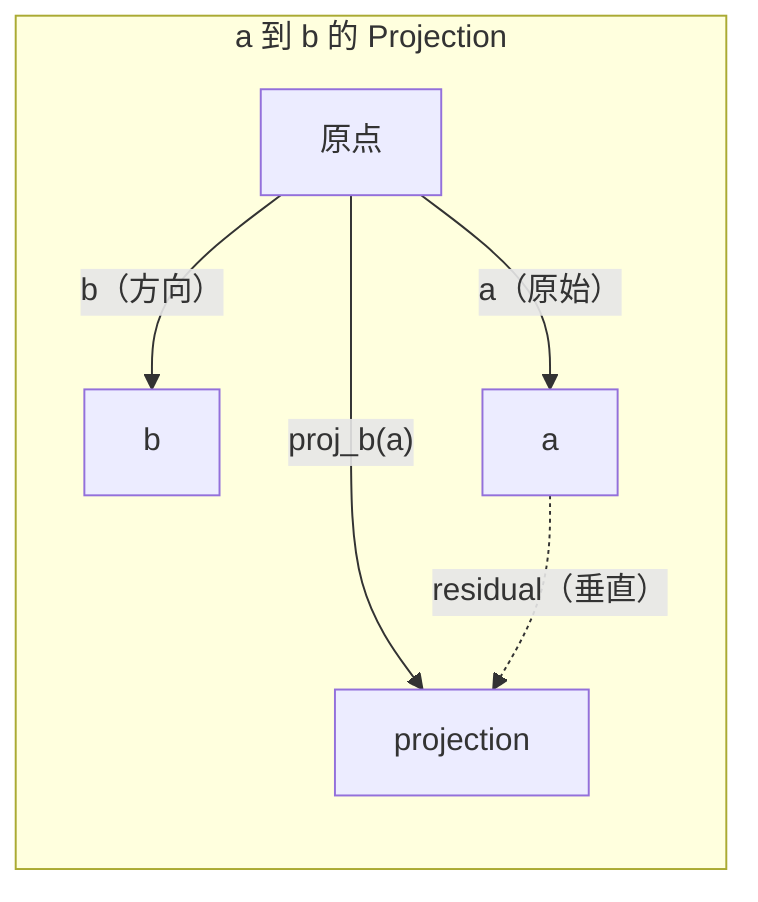

# Algebra linear 直觉

> Cada modelo de IA é apenas um modelo de matemática com um boné de beleza.

**类型：**- aprendizagem
**语言：**Python, Julia
**先修要求：**Fase 0
**时间：**- 60 minutos.

## Objectivo de aprendizagem

- Em Python, desde zero implementar Vector 和 Matrix 运算 (a)
- Desde um ponto de vista de explicação do produto, projeção e processo de Gram-Schmidt em fazer o que
- Utilize redução de filas 判断一组 Vector de independência linear、rank 和 base
- Para que o conceito de álgebra linear se conecte a eles em aplicações de IA: embutidos, pontuações de atenção e LoRA

## 问题

打开任意一篇 ML论文──在第一页之内, você verá Vector、Matrix、dot product 和 transformation──没有线性代数 直觉时,这些只是符号──有它,你就能看到神经网络 实际上在做什么-- 在空间中移动点──

Não precisas de ser matemático. Tens de ver o que significam estes cálculos na geometria e depois escrever-os em código.

## 概念

### Vêctores é o ponto (ou direção)

O vetor é apenas uma lista de números. Mas esses números têm significado.

**2D Vector [3, 2]：**

| x | y | 点 |
|---|---|-------|
| 3 | 2 | 这个 Vector 从原点 (0,0) 指向平面上的 (3, 2) |

Essa magnitude do vetor é = 3^2 + 2^2) = 13), direção para cima e para direita.

Em AI, Vector diz tudo:
- Um termo → um que contém 768 números de vetor (esta em incorporação 空间中的含义)
- Uma imagem → Um vetor composto por milhões de imagens de valor
- Um usuário → Um vector de preferência de expressão

### Matrizes são transformações

A matriz vai transformar um vetor em outro vetor. Pode girar, acumular, esticar ou projetar.



Em IA, a Matrix é o modelo:
- Pesos da Rede Neural → 将 input 转换为 output 的矩阵
- Pontos de atenção → decidir concentrar o que
- Embedings → 将词映射到 Vectors of Matrices

### Produto ponto 衡量相似性

O produto de pontos de dois vetores vai dizer-lhe que eles têm muitas semelhanças.

```
a · b = a₁×b₁ + a₂×b₂ + ... + aₙ×bₙ

方向相同：      a · b > 0  （相似）
相互垂直：      a · b = 0  （无关）
方向相反：      a · b < 0  （不相似）
```

É o que o motor de busca, o sistema de recomendação e o RAG fazem: encontram vetores de produto de pontos mais altos.

### Independência Linear

Se no conjunto não houver nenhum vetor que possa ser escrito em conjunto de outros vetores, então esses vetores são linearmente independentes. Se v1、v2、v3 independentes, eles abrangem um espaço 3D. Se um deles for um conjunto de outros vetores, eles apenas abrangem um plano.

É importante para a IA: sua matriz de características  deve ter colunas linearmente independentes ▌se duas características ▌ estão totalmente relacionadas ▌linearmente dependentes), o modelo não pode distinguir os seus respectivos efeitos ▌, o que causará multicolinariedade na Regressão ▌ - a matriz de peso ▌ vai ficar instável, as pequenas variações de entrada levarão à saída ▌

**具体示例：**

```
v1 = [1, 0, 0]
v2 = [0, 1, 0]
v3 = [2, 1, 0]   # v3 = 2*v1 + v2
```

V1 e v2 são independentes de -- 二者都不是另一个标量倍数或组合──但 v3 = 2*v1 + v2,所以 {v1, v2, v3} é um conjunto dependente── estes três vetores estão todos no plano xy── não importa como você os reunir, não pode chegar a [0, 0, 1]── você tem três vetores, mas apenas duas dimensões livres──

Em conjunto de dados: se feature_3 = 2*feature_1 + feature_2, adere feature_3 não vai dar o modelo  trazer qualquer nova informação.

### Base e Classe

Base é um conjunto de vectores linearmente independentes menores, que abrangem todo o espaço.

A base padrão do espaço 3D é {1,0,0], [0,1,0], [0,0,1]}── mas qualquer três vetores independentes no 3D podem constituir uma base válida── base de seleção é a base de seleção 坐标系────

Matrix of rank = linearmente independente colunas de número = linearmente independente linhas de número de linhas.
- O sistema tem infinitos soluções (ou não)
- Transformação 中丢失信息
- Matrix Não pode ser invertida

| 情况 | Rank | 对 ML 的含义 |
|-----------|------|---------------------|
| Full rank (rank = min(m, n)) | 最大可能值 | 存在唯一 least-squares solution。Model well-conditioned。 |
| Rank deficient (rank < min(m, n)) | 低于最大值 | Features 冗余。有无穷多个 weight solutions。需要 regularization。 |
| Rank 1 | 1 | 每一列都是某个 Vector 的缩放副本。所有数据都位于一条线上。 |
| Near rank-deficient（较小的 singular values） | 数值上较低 | Matrix ill-conditioned。极小的 input noise 会造成很大的 output changes。使用 SVD truncation 或 ridge regression。 |

### Projeção

Vector**a**投影到 Vector **b**- Eu vou.**a**Em**b**方向上的分量:

```
proj_b(a) = (a dot b / b dot b) * b
```

A decomposição ortogonal é a base do ajuste dos mínimos quadrados.

Projeção em ML
- Regressão linear Minimizar observações até espaço coluna de distância - 解本身就是一个投影
- A PCA irá projetar dados na direcção da maior variação
- Transformadores Interno Atenção 会 calcular consultas para projeções de chaves



**示例：**A) A posição de referência do produto

Proj_b(a) = (3*1 + 4*0) / (1*1 + 0*0) * [1, 0] = 3 * [1, 0] = [3, 0]

Esta projeção perdeu o y-part-volume. É a forma mais simples de redução de dimensão.

### Processo Gram-Schmidt

将任意一组独立向量 转换为正规的基础──正规的意思是每个向量 长度为 1,并且任意一对向量都互相垂直──

- Não .
1. O primeiro vetor, normaliza-se.
2. Tome o segundo vetor, diminua-o na primeira projeção do vetor, re-normalizar
3. Tire o terceiro vetor, diminui-lo em todos os vetores anteriores de projeções, re-normalizar
4. Para os restantes vetores 重复该过程

```
Input:  v1, v2, v3, ...（linearly independent）

u1 = v1 / |v1|

w2 = v2 - (v2 dot u1) * u1
u2 = w2 / |w2|

w3 = v3 - (v3 dot u1) * u1 - (v3 dot u2) * u2
u3 = w3 / |w3|

Output: u1, u2, u3, ...（orthonormal basis）
```

É o método de decomposição QR.
- 求解线路系统 ((比高斯的消除 更稳定)
- 计算 eigenvalues(Algorithm de RQ)
- Regressão de mínimos quadrados (standard数值方法)


```figure
eigen-directions
```

## Construí-lo

### 步骤 1: Desde zero implementar vetores ((Python)

```python
class Vector:
    def __init__(self, components):
        self.components = list(components)
        self.dim = len(self.components)

    def __add__(self, other):
        return Vector([a + b for a, b in zip(self.components, other.components)])

    def __sub__(self, other):
        return Vector([a - b for a, b in zip(self.components, other.components)])

    def dot(self, other):
        return sum(a * b for a, b in zip(self.components, other.components))

    def magnitude(self):
        return sum(x**2 for x in self.components) ** 0.5

    def normalize(self):
        mag = self.magnitude()
        return Vector([x / mag for x in self.components])

    def cosine_similarity(self, other):
        return self.dot(other) / (self.magnitude() * other.magnitude())

    def __repr__(self):
        return f"Vector({self.components})"


a = Vector([1, 2, 3])
b = Vector([4, 5, 6])

print(f"a + b = {a + b}")
print(f"a · b = {a.dot(b)}")
print(f"|a| = {a.magnitude():.4f}")
print(f"cosine similarity = {a.cosine_similarity(b):.4f}")
```

### 步骤 2: From zero realizando Matrices (Python)

```python
class Matrix:
    def __init__(self, rows):
        self.rows = [list(row) for row in rows]
        self.shape = (len(self.rows), len(self.rows[0]))

    def __matmul__(self, other):
        if isinstance(other, Vector):
            return Vector([
                sum(self.rows[i][j] * other.components[j] for j in range(self.shape[1]))
                for i in range(self.shape[0])
            ])
        rows = []
        for i in range(self.shape[0]):
            row = []
            for j in range(other.shape[1]):
                row.append(sum(
                    self.rows[i][k] * other.rows[k][j]
                    for k in range(self.shape[1])
                ))
            rows.append(row)
        return Matrix(rows)

    def transpose(self):
        return Matrix([
            [self.rows[j][i] for j in range(self.shape[0])]
            for i in range(self.shape[1])
        ])

    def __repr__(self):
        return f"Matrix({self.rows})"


rotation_90 = Matrix([[0, -1], [1, 0]])
point = Vector([3, 1])

rotated = rotation_90 @ point
print(f"Original: {point}")
print(f"Rotated 90°: {rotated}")
```

### Passo 3: Por que é importante para a IA ?

```python
import random

random.seed(42)
weights = Matrix([[random.gauss(0, 0.1) for _ in range(3)] for _ in range(2)])
input_vector = Vector([1.0, 0.5, -0.3])

output = weights @ input_vector
print(f"Input (3D): {input_vector}")
print(f"Output (2D): {output}")
print("This is what a neural network layer does -- matrix multiplication.")
```

### 步骤 4: Julia 版本

```julia
a = [1.0, 2.0, 3.0]
b = [4.0, 5.0, 6.0]

println("a + b = ", a + b)
println("a · b = ", a ⋅ b)       # Julia supports unicode operators
println("|a| = ", √(a ⋅ a))
println("cosine = ", (a ⋅ b) / (√(a ⋅ a) * √(b ⋅ b)))

# Matrix-vector multiplication
W = [0.1 -0.2 0.3; 0.4 0.5 -0.1]
x = [1.0, 0.5, -0.3]
println("Wx = ", W * x)
println("This is a neural network layer.")
```

### 步骤 5: Desde zero realizar a independência linear 和 projeção (Python)

```python
def is_linearly_independent(vectors):
    n = len(vectors)
    dim = len(vectors[0].components)
    mat = Matrix([v.components[:] for v in vectors])
    rows = [row[:] for row in mat.rows]
    rank = 0
    for col in range(dim):
        pivot = None
        for row in range(rank, len(rows)):
            if abs(rows[row][col]) > 1e-10:
                pivot = row
                break
        if pivot is None:
            continue
        rows[rank], rows[pivot] = rows[pivot], rows[rank]
        scale = rows[rank][col]
        rows[rank] = [x / scale for x in rows[rank]]
        for row in range(len(rows)):
            if row != rank and abs(rows[row][col]) > 1e-10:
                factor = rows[row][col]
                rows[row] = [rows[row][j] - factor * rows[rank][j] for j in range(dim)]
        rank += 1
    return rank == n


def project(a, b):
    scalar = a.dot(b) / b.dot(b)
    return Vector([scalar * x for x in b.components])


def gram_schmidt(vectors):
    orthonormal = []
    for v in vectors:
        w = v
        for u in orthonormal:
            proj = project(w, u)
            w = w - proj
        if w.magnitude() < 1e-10:
            continue
        orthonormal.append(w.normalize())
    return orthonormal


v1 = Vector([1, 0, 0])
v2 = Vector([1, 1, 0])
v3 = Vector([1, 1, 1])
basis = gram_schmidt([v1, v2, v3])
for i, u in enumerate(basis):
    print(f"u{i+1} = {u}")
    print(f"  |u{i+1}| = {u.magnitude():.6f}")

print(f"u1 · u2 = {basis[0].dot(basis[1]):.6f}")
print(f"u1 · u3 = {basis[0].dot(basis[2]):.6f}")
print(f"u2 · u3 = {basis[1].dot(basis[2]):.6f}")
```

## Use-o

Agora, faz o mesmo com o NumPy - é a forma como você realmente usará na prática:

```python
import numpy as np

a = np.array([1, 2, 3], dtype=float)
b = np.array([4, 5, 6], dtype=float)

print(f"a + b = {a + b}")
print(f"a · b = {np.dot(a, b)}")
print(f"|a| = {np.linalg.norm(a):.4f}")
print(f"cosine = {np.dot(a, b) / (np.linalg.norm(a) * np.linalg.norm(b)):.4f}")

W = np.random.randn(2, 3) * 0.1
x = np.array([1.0, 0.5, -0.3])
print(f"Wx = {W @ x}")
```

### Use NumPy  Processar Rank、Projeção 和 QR

```python
import numpy as np

A = np.array([[1, 2], [2, 4]])
print(f"Rank: {np.linalg.matrix_rank(A)}")

a = np.array([3, 4])
b = np.array([1, 0])
proj = (np.dot(a, b) / np.dot(b, b)) * b
print(f"Projection of {a} onto {b}: {proj}")

Q, R = np.linalg.qr(np.random.randn(3, 3))
print(f"Q is orthogonal: {np.allclose(Q @ Q.T, np.eye(3))}")
print(f"R is upper triangular: {np.allclose(R, np.triu(R))}")
```

### PyTorch -- Tensores são com vetores de autodiff

```python
import torch

x = torch.randn(3, requires_grad=True)
y = torch.tensor([1.0, 0.0, 0.0])

similarity = torch.dot(x, y)
similarity.backward()

print(f"x = {x.data}")
print(f"y = {y.data}")
print(f"dot product = {similarity.item():.4f}")
print(f"d(dot)/dx = {x.grad}")
```

O produto ponto  Sobre o produto x do Gradiente é o y。PyTorch calcula automaticamente este ponto。Cada operação na rede neural é composta por este tipo de operações--Matriz multiplica、produtos ponto、projeções--autodiff 会在所有这些运算中追踪 Gradientes。

Você acabou de construir o NumPy, uma linha de código que pode ser feito. Agora sabe o que aconteceu no fundo.

## Entrega-o

本课会产出:
- `outputs/prompt-linear-algebra-tutor.md`-- um para fazer assistentes de IA através de geometria diretamente professor de álgebra linear

##                                                                                                                                                                                                                                                                                                                                                                                                                                                                                                                              

Cada um dos conteúdos desta aula está ligado a uma parte específica da IA moderna:

| 概念 | 出现位置 |
|---------|------------------|
| Dot product | Transformers 中的 Attention scores，RAG 中的 cosine similarity |
| Matrix multiply | 每个 Neural Network layer，每个 linear transformation |
| Linear independence | Feature selection，避免 multicollinearity |
| Rank | 判断一个系统是否可解，LoRA（low-rank adaptation） |
| Projection | Linear Regression（投影到 column space）、PCA |
| Gram-Schmidt / QR | Numerical solvers，eigenvalue computation |
| Orthonormal basis | 稳定的 numerical computation，whitening transforms |

LoRA  Vale a pena um especial detalhe. Ele passa por atualizações de peso divididas em matrizes de baixo nível para LLM de afinidade. Com ele, a LoRA 更新一个4096x4096的重矩阵;;16M parâmetros),LoRA 更新两个尺寸为4096x16和16x4096的矩阵;;131K parâmetros) ・rank-16 约束意味着LoRA 假设重量更新 位于完整的4096维空间内内.

## 练习

1.  realização `Vector.angle_between(other)`, retornar a dois vectores entre ângulos
2. Crear uma matriz de escala 2D, fazer x-coordenada 翻倍、y-coordenada 变为三倍, então将将其应用到矢量 [1, 1]
3. 给定 5 个随机类词 矢量 ((dimensão 50), usando similaridade cosínica 找出最相似的两个
4. 验证 Gram-Schmidt output 确实是正规的:检查每一对的点产品都为 0,并且每个向量的大小都为 1
5. Crear uma classificação 为 2 de 3x3 Matrix── utiliza `rank()`método 验证── Então explicar que é o que são estes objetos de geometria de expansão colunas.
6. 将 vector [1, 2, 3] 投投到 [1, 1, 1] 上──结果在几何上表示什么?

## 关键术语

| 术语 | 人们常说 | 实际含义 |
|------|----------------|----------------------|
| Vector | “一个箭头” | 一个数字列表，表示 n-dimensional space 中的点或方向 |
| Matrix | “一个数字表” | 一种 transformation，将 Vectors 从一个空间映射到另一个空间 |
| Dot product | “相乘再求和” | 衡量两个 Vectors 对齐程度的指标 -- similarity search 的核心 |
| Embedding | “某种 AI 魔法” | 一个表示某物含义（词、图像、用户）的 Vector |
| Linear independence | “它们不重叠” | 集合中没有任何 Vector 可以写成其他 Vector 的组合 |
| Rank | “有多少维” | Matrix 中 linearly independent columns（或 rows）的数量 |
| Projection | “影子” | 一个 Vector 在另一个 Vector 方向上的分量 |
| Basis | “坐标轴” | 一组最小的 independent Vectors，它们 span 该空间 |
| Orthonormal | “垂直的单位 Vectors” | 彼此互相垂直且各自长度为 1 的 Vectors |
