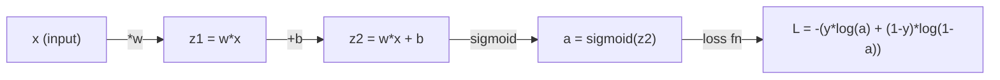
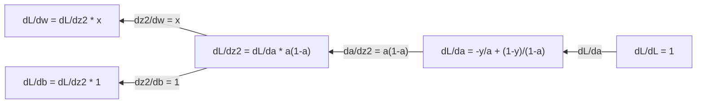
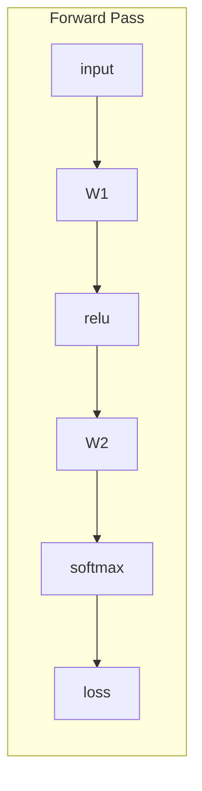
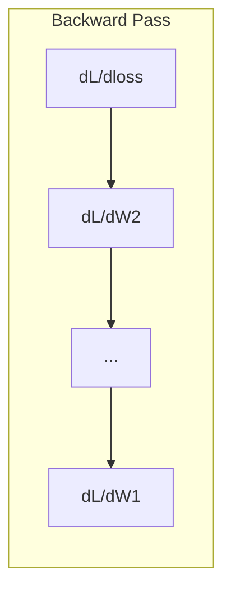

# Aprendizagem automática 微积分

> 导数会告诉你哪边是下坡──这是神经网络学习所需的一切──

**Type:** Learn
**Language:**Python
**Prerequisites:** Phase 1, Lessons 01-03
**Time:** ~60 minutes

## Objectivo de aprendizagem

- 計算常见 ML 函数(x^2、sigmoid、cross-entropy) de valores-chave e de resolução
- Desde zero para realizar Descenso Gradiente, em 1D e 2D Minimizar a Função de Perda
- 推导 linear regressão 模型的渐变,并通过手动更新权重来训练它
- Explicar a Matriz Hessiana, a série Taylor, e a sua ligação com os métodos de otimização

## 问题

Você tem uma rede neural que contém milhões de pesos. Cada pesos é um giro. Você precisa descobrir em que direção cada giro deve virar para fazer com que o modelo erra um pouco mais.

Sem mínimos, treinando a rede neural significa experimentar variadas mudanças, depois esperar boa sorte. Com um número de direções, você pode saber com certeza como cada peso afeta o erro.

## 概念

### O que é um número?

导数量衡变化率──对于函数 y = f(x),导数 f'(x) 会告诉你: Se você colocar x 微小地推动一点, y 会变化多少?

De forma geometrica, o número de direção é a inclinação de um ponto na linha.

**f(x) = x^2：**

| x | f(x) | f'(x)（斜率） |
|---|------|---------------|
| 0 | 0    | 0（平坦，在底部） |
| 1 | 1    | 2 |
| 2 | 4    | 4（该点处切线的斜率） |
| 3 | 9    | 6 |

Quando x=2, a inclinância é 4... se você colocar x para a direita mover muito pequeno, y 大约会增加这个移动量的4倍......

 формально определение:

```
f'(x) = lim   f(x + h) - f(x)
        h->0  -----------------
                     h
```

Em código, você vai saltar o limite, usando diretamente um muito pequeno h.

### 偏导数: uma vez só olha para uma variação

A perda da rede neural depende de milhares de milhões de pesos. O número de parâmetros mantém todas as variações imutáveis além de uma variação, e então procura orientação para essa variação.

```
f(x, y) = x^2 + 3xy + y^2

df/dx = 2x + 3y     (treat y as a constant)
df/dy = 3x + 2y     (treat x as a constant)
```

Cada número de parábolas respondeu: se eu apenas diminuir esse peso, como a perda mudaria?

### Gradiente: todos os vectores de configuração de

Gradiente 会把 cada um dos parâmetros de direção reunidos em um vetor.

```
grad f = [ df/dx, df/dy, df/dz ]
```

Gradiente indica a direção de maior elevação.

**f(x,y) = x^2 + y^2 的等高线图：**

Esta função forma um bowl-form curva, igual à linha alta é com o centro do círculo.

| 点 | grad f | -grad f（下降方向） |
|-------|--------|----------------------------|
| (1, 1) | [2, 2]（指向上坡，远离最小值） | [-2, -2]（指向下坡，朝向最小值） |
| (0, 0) | [0, 0]（平坦，在最小值处） | [0, 0] |

É o descendo gradual do gráfico.

### Relação com a otimização

訓練 Neural Network 就是优化──你有一个损失函数 L(w1, w2, ..., wn),它衡量模型有多错──你想最小化它──

```
Gradient descent update rule:

  w_new = w_old - learning_rate * dL/dw

For every weight:
  1. Compute the partial derivative of loss with respect to that weight
  2. Subtract a small multiple of it from the weight
  3. Repeat
```

Taxa de aprendizagem  controlar o progresso ∞ muito grande vai superar o objetivo ∞ muito pequeno vai subir muito lentamente ∞

**Loss landscape（1D 切片）：**

Função de perda L(w)  Com a mudança do peso w forma uma curva de um pivô.

| 特征 | 描述 |
|---------|-------------|
| Global minimum | 整条曲线上的最低点，即最佳解 |
| Local minimum | 比邻近位置更低、但不是整体最低点的谷 |
| Slope | Gradient Descent 会从任意起点沿斜率向下走 |

A descida gradual irá se prolongar em direção ao descenso da inclinância. Pode ser um problema local, mas em um espaço elevado, isso é muito raro.

### Número de valores em relação a números de resolução

Há duas formas de calcular os números.

解析方式:手动应用微积分规则──对于 f(x) = x^2,导数是 f'(x) = 2x──精确,快速──

Método de numeração: usar a definição para fazer a aproximação.

```
Numerical (central difference):

f'(x) ~= f(x + h) - f(x - h)
          -----------------------
                  2h

h = 0.0001 works well in practice
```

O número de direções de valores é mais lento, mas é aplicável a qualquer função.

### Manual de execução

Estes são os números que você vai ver repetidamente no ML.

```
Function        Derivative       Used in
--------        ----------       -------
f(x) = x^2     f'(x) = 2x      Loss functions (MSE)
f(x) = wx + b  f'(w) = x        Linear layer (gradient w.r.t. weight)
                f'(b) = 1        Linear layer (gradient w.r.t. bias)
                f'(x) = w        Linear layer (gradient w.r.t. input)
f(x) = e^x     f'(x) = e^x     Softmax, attention
f(x) = ln(x)   f'(x) = 1/x     Cross-entropy loss
f(x) = 1/(1+e^-x)  f'(x) = f(x)(1-f(x))   Sigmoid activation
```

对于 f ((x) = x^2:

```
f(x) = x^2    f'(x) = 2x

  x    f(x)   f'(x)   meaning
  -2    4      -4      slope tilts left (decreasing)
  -1    1      -2      slope tilts left (decreasing)
   0    0       0      flat (minimum!)
   1    1       2      slope tilts right (increasing)
   2    4       4      slope tilts right (increasing)
```

对于 f(w) = wx + b,且 x=3、b=1:

```
f(w) = 3w + 1    f'(w) = 3

The derivative with respect to w is just x.
If x is big, a small change in w causes a big change in output.
```

### 链式法则

Quando as funções se juntam, a lei da cadeia diz-lhe como procurar orientação.

```
If y = f(g(x)), then dy/dx = f'(g(x)) * g'(x)

Example: y = (3x + 1)^2
  outer: f(u) = u^2       f'(u) = 2u
  inner: g(x) = 3x + 1    g'(x) = 3
  dy/dx = 2(3x + 1) * 3 = 6(3x + 1)
```

Rede Neural é uma série de funções: input -> linear -> ativação -> linear -> ativação -> perda。Backpropagation é do output ao input反复应用链式法则── é o algoritmo inteiro──

### Matriz Hessiana

Gradiente 告诉你斜率──Hessian 告诉你曲率──

Hessian é um segundo grau de orientação dos números compostos Matrix。 para a função f ((x1, x2, ..., xn), Hessian é um (i, j) 项 é:

```
H[i][j] = d^2f / (dx_i * dx_j)
```

对于二变量函数 f ((x, y):

```
H = | d^2f/dx^2    d^2f/dxdy |
    | d^2f/dydx    d^2f/dy^2 |
```

**Hessian 在临界点（Gradient = 0 的地方）告诉你什么：**

| Hessian 性质 | 含义 | 示例曲面 |
|-----------------|---------|-----------------|
| 正定（所有 eigenvalues > 0） | Local minimum | 向上开口的碗 |
| 负定（所有 eigenvalues < 0） | Local maximum | 向下开口的碗 |
| 不定（eigenvalues 正负混合） | Saddle point | 马鞍形 |

**示例：**f(x, y) = x^2 - y^2(a sela 函数)

```
df/dx = 2x       df/dy = -2y
d^2f/dx^2 = 2    d^2f/dy^2 = -2    d^2f/dxdy = 0

H = | 2   0 |
    | 0  -2 |

Eigenvalues: 2 and -2 (one positive, one negative)
--> Saddle point at (0, 0)
```

Com f ((x, y) = x^2 + y^2 ((a bowlform função)

```
H = | 2  0 |
    | 0  2 |

Eigenvalues: 2 and 2 (both positive)
--> Local minimum at (0, 0)
```

**为什么 Hessian 在 ML 中重要：**

O método de Newton utiliza Hessian para tomar a descida gradiente melhor melhor optimization. Não é apenas a seguir a curva de curva, também considera a curva:

```
Newton's update:    w_new = w_old - H^(-1) * gradient
Gradient descent:   w_new = w_old - lr * gradient
```

O método de Newton 收更快, porque Hessian 会重新缩放Gradiente: 方向的步子更小,平坦方向的步子更大──

O problema é: para uma rede neural com N 个参数, Hessian é N x N. Um modelo com 100 milhões de parâmetros precisa de uma matriz com 1 bilhão de elementos. É por isso que usamos o método de aproximação.

| 方法 | 使用什么 | 成本 | 收敛 |
|--------|-------------|------|-------------|
| Gradient Descent | 只使用一阶导数 | 每步 O(N) | 慢（线性） |
| Newton's method | 完整 Hessian | 每步 O(N^3) | 快（二次） |
| L-BFGS | 从 Gradient 历史近似 Hessian | 每步 O(N) | 中等（超线性） |
| Adam | 每参数自适应 rate（对角 Hessian 近似） | 每步 O(N) | 中等 |
| Natural gradient | Fisher information matrix（统计 Hessian） | 每步 O(N^2) | 快 |

Na prática, Adam é o Optimizador padrão do Deep Learning.

### Série Taylor 近似

Qualquer função plana pode ser localmente usada em vários métodos de aproximação:

```
f(x + h) = f(x) + f'(x)*h + (1/2)*f''(x)*h^2 + (1/6)*f'''(x)*h^3 + ...
```

包含的项越多,近似越好, mas apenas no ponto x 附近成立──

**为什么 Taylor series 对 ML 重要：**

- **一阶 Taylor = Gradient Descent。**Quando você usa f(x + h) ~ f(x) + f'(x) *h 时, você está fazendo uma aproximação de linhação.

- **二阶 Taylor = Newton's method。**Utilize f(x + h) ~ f(x) + f'(x) *h + (1/2) *f'(x) *h^2 时, você obtém um segundo modelo── minimizá-lo-á obter h = -f'(x) /f'(x), também é o passo de Newton──

- **Loss Function 设计。**MSE e entropia cruzada são planejadas, o que significa que as expansões de Taylor deles se manifestam bem. Não é coincidência.

```
Approximation order    What it captures    Optimization method
-------------------    -----------------   -------------------
0th order (constant)   Just the value      Random search
1st order (linear)     Slope               Gradient descent
2nd order (quadratic)  Curvature           Newton's method
Higher orders          Finer structure     Rarely used in ML
```

关键洞见是: todas as optimizações baseadas em gradiente, em essência, são em local, a função de perda aproximada, e em direção ao valor mínimo da função aproximada.

### ML 中的积分

导数告诉你变化率──积分计算累积量,也就是曲线下面积──

No ML, você tem poucas maneiras de calcular, mas esse conceito está presente:

**概率。**对于具有密度 p(x) 的连续随机变量:
```
P(a < X < b) = integral from a to b of p(x) dx
```
概率 densidade curva em uma e b                                                                                                                                                                                                                                                                                                                                                                                                                                                                                                                   

**期望值。**按概率加权的平均结果:
```
E[f(X)] = integral of f(x) * p(x) dx
```
A perda esperada na distribuição de dados é um积分―― o treino minimizado é a sua experiência aproximada―.

**KL divergence。**∆ Medir duas distribuições diferentes:
```
KL(p || q) = integral of p(x) * log(p(x) / q(x)) dx
```
Utilizando VAEs, destilação do conhecimento e inferência Bayesiana.

**归一化常数。**Em inferência Bayesiana
```
p(w | data) = p(data | w) * p(w) / integral of p(data | w) * p(w) dw
```
A divisão é o ponto de todos os valores dos parâmetros possíveis. É geralmente indisponível, e é por isso que usamos o método MCMC e inferência variável, etc.

| 积分概念 | 在 ML 中出现的位置 |
|-----------------|----------------------|
| 曲线下面积 | 由 density functions 得到概率 |
| 期望值 | Loss Functions、risk minimization |
| KL divergence | VAEs、policy optimization、distillation |
| 归一化 | Bayesian posteriors、softmax denominator |
| Marginal likelihood | Model comparison、evidence lower bound (ELBO) |

### Grafico de computação 中的多变量链式法则

A lei de cadeia não se aplica apenas a funções de quantidade de um conjunto de linhas. Em rede neural, a variação pode ser dividida e combinada.



Passagem para trás 会从右到左计算 Gradiente:



Cada arco-íris multiplica-se em direção local. Gradiente de qualquer parâmetro, é a multiplicação de todas as direções locais de um caminho para outro. Quando o caminho se divide e se combina, você vai adicionar a contribuição de cada caminho.

Todo o conteúdo da backpropagation é: de saída a entrada, sistematicamente aplicado em gráfico de computação.

### Matriz Jacobiana

Quando uma função traz um vector 映射到 vector 时(por exemplo, a camada de rede neural), seu número de direções é uma matriz。 Jacobian 包含每个输出对每个输入的所有偏导数。

对于 f: R^n -> R^m, Jacobian J 是一个 m x n Matrix:

| | x1 | x2 | ... | xn |
|---|---|---|---|---|
| f1 | df1/dx1 | df1/dx2 | ... | df1/dxn |
| f2 | df2/dx1 | df2/dx2 | ... | df2/dxn |
| ... | ... | ... | ... | ... |
| fm | dfm/dx1 | dfm/dx2 | ... | dfm/dxn |

Você não vai para a Rede Neural Hand动计算 Jacobian──PyTorch 会处理它──, mas saber que ela existe, ajuda a entender a forma da Backpropagation: se uma camada colocar R^n 映射到R^m, seu Jacobian é m x n──Gradiente 会通过这个矩阵的转置向后流动──.

### Por que é importante para a rede neural ?

Cada peso na rede neural vai ter um gradiente. O gradiente vai dizer-lhe como ajustar esse peso para reduzir a perda.





Cada vez mais:
- `W1 = W1 - lr * dL/dW1`
- `W2 = W2 - lr * dL/dW2`

Passar para frente 计算预测和 Loss──pass para trás 计算 Loss  相对每权重的格里亚因──然后每权重都向下坡方向迈一小步──重复数百万步──这就是深度学习──


```figure
derivative-tangent
```

## Construí-lo

### 步骤 1: desde zero realizar um número de valores

```python
def numerical_derivative(f, x, h=1e-7):
    return (f(x + h) - f(x - h)) / (2 * h)

def f(x):
    return x ** 2

for x in [-2, -1, 0, 1, 2]:
    numerical = numerical_derivative(f, x)
    analytical = 2 * x
    print(f"x={x:2d}  f'(x) numerical={numerical:.6f}  analytical={analytical:.1f}")
```

Os valores de referência e os valores de análise correspondem a um número muito pequeno.

### 步骤 2: Orientação e Gradiente

```python
def numerical_gradient(f, point, h=1e-7):
    gradient = []
    for i in range(len(point)):
        point_plus = list(point)
        point_minus = list(point)
        point_plus[i] += h
        point_minus[i] -= h
        partial = (f(point_plus) - f(point_minus)) / (2 * h)
        gradient.append(partial)
    return gradient

def f_multi(point):
    x, y = point
    return x**2 + 3*x*y + y**2

grad = numerical_gradient(f_multi, [1.0, 2.0])
print(f"Numerical gradient at (1,2): {[f'{g:.4f}' for g in grad]}")
print(f"Analytical gradient at (1,2): [2*1+3*2, 3*1+2*2] = [{2*1+3*2}, {3*1+2*2}]")
```

### 步骤 3: Usando Descenso Gradiente 找到 f(x) = x^2 的最小值

```python
x = 5.0
lr = 0.1
for step in range(20):
    grad = 2 * x
    x = x - lr * grad
    print(f"step {step:2d}  x={x:8.4f}  f(x)={x**2:10.6f}")
```

A partir de x=5                                                                                                                                                                                                                                                                                                                                                                                                                                                                                                                        

### 步骤 4: Execução de Descenso Gradiente em função 2D

```python
def f_2d(point):
    x, y = point
    return x**2 + y**2

point = [4.0, 3.0]
lr = 0.1
for step in range(30):
    grad = numerical_gradient(f_2d, point)
    point = [p - lr * g for p, g in zip(point, grad)]
    loss = f_2d(point)
    if step % 5 == 0 or step == 29:
        print(f"step {step:2d}  point=({point[0]:7.4f}, {point[1]:7.4f})  f={loss:.6f}")
```

### 步骤 5: Comparar os valores-chave e os valores-chave

```python
import math

test_functions = [
    ("x^2",      lambda x: x**2,          lambda x: 2*x),
    ("x^3",      lambda x: x**3,          lambda x: 3*x**2),
    ("sin(x)",   lambda x: math.sin(x),   lambda x: math.cos(x)),
    ("e^x",      lambda x: math.exp(x),   lambda x: math.exp(x)),
    ("1/x",      lambda x: 1/x,           lambda x: -1/x**2),
]

x = 2.0
print(f"{'Function':<12} {'Numerical':>12} {'Analytical':>12} {'Error':>12}")
print("-" * 50)
for name, f, df in test_functions:
    num = numerical_derivative(f, x)
    ana = df(x)
    err = abs(num - ana)
    print(f"{name:<12} {num:12.6f} {ana:12.6f} {err:12.2e}")
```

### 步骤 6: Número de valores de cálculo Hessian

```python
def hessian_2d(f, x, y, h=1e-5):
    fxx = (f(x + h, y) - 2 * f(x, y) + f(x - h, y)) / (h ** 2)
    fyy = (f(x, y + h) - 2 * f(x, y) + f(x, y - h)) / (h ** 2)
    fxy = (f(x + h, y + h) - f(x + h, y - h) - f(x - h, y + h) + f(x - h, y - h)) / (4 * h ** 2)
    return [[fxx, fxy], [fxy, fyy]]

def saddle(x, y):
    return x ** 2 - y ** 2

def bowl(x, y):
    return x ** 2 + y ** 2

H_saddle = hessian_2d(saddle, 0.0, 0.0)
H_bowl = hessian_2d(bowl, 0.0, 0.0)
print(f"Saddle Hessian: {H_saddle}")  # [[2, 0], [0, -2]] -- mixed signs
print(f"Bowl Hessian:   {H_bowl}")    # [[2, 0], [0, 2]]  -- both positive
```

Saddle  Função de Hessian  Hessian  Hessian  Hessian  Hessian  Hessian  Hessian  Hessian  Hessian  Hessian  Hessian  Hessian  Hessian  Hessian  Hessian  Hessian  Hessian  Hessian  Hessian  Hessian  Hessian  Hessian  Hessian  Hessian  Hessian  Hessian  Hessian  Hessian  Hessian  Hessian  Hessian  Hessian  Hessian  Hessian  Hessian  Hessian  Hessian  Hessian  Hessian  Hessian  Hessian  Hessian  Hessian  Hessian  Hessian  Hessian  Hessian  Hessian  Hessian  Hessian  Hessian  Hessian  Hessian  Hessian  Hessian  Hessian  Hessian  Hessian  Hessian  Hessian  Hessian  Hessian  Hessian  Hessian  Hessian  Hessian  Hessian  Hessian  Hessian  Hessian  Hessian  Hessian  Hessian  Hessian  Hessian  Hessian  Hessian  Hessian  Hessian  Hessian  Hessian  Hessian  Hessian  Hessian  Hessian  Hessian  Hessian  Hessian  Hessian  Hessian  Hessian  Hessian  Hessian  Hessian  Hessian  Hessian  Hessian  Hessian  Hessian  Hessian  Hessian  Hessian  Hessian  Hessian  Hessian  Hessian  Hessian  Hessian  Hessian  Hessian  Hessian  Hessian  Hessian  Hessian  Hessian  Hessian  Hessian  Hessian  Hessian  Hessian  Hessian  Hessian  Hessian  Hessian  Hessian  Hessian

### 步骤 7:Taylor 近似的实际效果

```python
import math

def taylor_approx(f, f_prime, f_double_prime, x0, h, order=2):
    result = f(x0)
    if order >= 1:
        result += f_prime(x0) * h
    if order >= 2:
        result += 0.5 * f_double_prime(x0) * h ** 2
    return result

x0 = 0.0
for h in [0.1, 0.5, 1.0, 2.0]:
    true_val = math.sin(h)
    t1 = taylor_approx(math.sin, math.cos, lambda x: -math.sin(x), x0, h, order=1)
    t2 = taylor_approx(math.sin, math.cos, lambda x: -math.sin(x), x0, h, order=2)
    print(f"h={h:.1f}  sin(h)={true_val:.4f}  order1={t1:.4f}  order2={t2:.4f}")
```

Em x0=0 附近,sin(x) ~ x(一阶泰勒) ―― Para muito pequeno h, esta aproximação é muito boa; mas para maior h, vai falhar― é por isso que o Descenso Gradiente em taxas de aprendizagem menores  下效果最好: cada passo todos os hipóteses linear aproximação é preciso―

### Passo 8: Por que isso é importante para a rede neural

```python
import random

random.seed(42)

w = random.gauss(0, 1)
b = random.gauss(0, 1)
lr = 0.01

xs = [1.0, 2.0, 3.0, 4.0, 5.0]
ys = [3.0, 5.0, 7.0, 9.0, 11.0]

for epoch in range(200):
    total_loss = 0
    dw = 0
    db = 0
    for x, y in zip(xs, ys):
        pred = w * x + b
        error = pred - y
        total_loss += error ** 2
        dw += 2 * error * x
        db += 2 * error
    dw /= len(xs)
    db /= len(xs)
    total_loss /= len(xs)
    w -= lr * dw
    b -= lr * db
    if epoch % 40 == 0 or epoch == 199:
        print(f"epoch {epoch:3d}  w={w:.4f}  b={b:.4f}  loss={total_loss:.6f}")

print(f"\nLearned: y = {w:.2f}x + {b:.2f}")
print(f"Actual:  y = 2x + 1")
```

Cada ciclo de treinamento baseado em gradiente segue este modelo: pré-determinar, calcular, perder, calcular, aumentar o peso.

## Use-o

Usando NumPy 时, assim como operação será mais rápido ‧ mais simples:

```python
import numpy as np

x = np.array([1, 2, 3, 4, 5], dtype=float)
y = np.array([3, 5, 7, 9, 11], dtype=float)

w, b = np.random.randn(), np.random.randn()
lr = 0.01

for epoch in range(200):
    pred = w * x + b
    error = pred - y
    loss = np.mean(error ** 2)
    dw = np.mean(2 * error * x)
    db = np.mean(2 * error)
    w -= lr * dw
    b -= lr * db

print(f"Learned: y = {w:.2f}x + {b:.2f}")
```

Você acabou de construir o Descenso Gradiente. O PyTorch irá completar automaticamente o cálculo do Gradiente, mas o ciclo de atualização é o mesmo.

## 练习

1. Utilize调用两次 `numerical_derivative`Como realizar`numerical_second_derivative(f, x)` A prova de que x^3 em x=2 处的二阶导数是12──
2. Utilize Gradient Descent 找到 f(x, y) = (x - 3) ^ 2 + (y + 1) ^ 2 的最小值──从 (0, 0) 开始──答案应收到 (3, -1)──
3. Em um ciclo de descida gradiente, adicione o momento:维护一个会累积过去

## 关键术语

| 术语 | 人们常说 | 实际含义 |
|------|----------------|----------------------|
| Derivative | “斜率” | 函数在某一点的变化率。告诉你输入每变化一个单位，输出会变化多少。 |
| Partial derivative | “一个变量的导数” | 在保持其他所有变量不变时，对某一个变量求导。 |
| Gradient | “最陡上升方向” | 由所有偏导数组成的 Vector。指向让函数增长最快的方向。 |
| Gradient Descent | “往下坡走” | 从参数中减去 Gradient（乘以 learning rate），从而降低 Loss。Neural Network 训练的核心。 |
| Learning rate | “步长” | 控制每一步 Gradient Descent 有多大的标量。太大：发散。太小：收敛缓慢。 |
| Chain rule | “把导数相乘” | 对复合函数求导的规则：df/dx = df/dg * dg/dx。Backpropagation 的数学基础。 |
| Jacobian | “导数 Matrix” | 当一个函数把 Vector 映射到 Vector 时，Jacobian 是所有输出相对于输入的偏导数组成的 Matrix。 |
| Numerical derivative | “有限差分” | 通过在两个相邻点上评估函数并计算它们之间的斜率来近似导数。 |
| Backpropagation | “Reverse-mode autodiff” | 使用链式法则，从输出到输入逐层计算 Gradient。Neural Network 就是这样学习的。 |
| Hessian | “二阶导数 Matrix” | 所有二阶偏导数组成的 Matrix。描述函数的曲率。在临界点处 Hessian 正定意味着 local minimum。 |
| Taylor series | “多项式近似” | 使用函数的导数在某一点附近近似函数：f(x+h) ~ f(x) + f'(x)h + (1/2)f''(x)h^2 + ... 它是理解 Gradient Descent 和 Newton's method 为什么有效的基础。 |
| Integral | “曲线下面积” | 某个量在一个范围内的累积。在 ML 中，积分定义概率、期望值和 KL divergence。 |

## 延伸阅读

- [3Blue1Brown: Essence of Calculus](https://www.3blue1brown.com/topics/calculus)-  sobre o número de direções  积分 e lei da cadeia
- [Stanford CS231n: Backpropagation](https://cs231n.github.io/optimization-2/)- Gradiente  como fluir através da camada da rede neural
