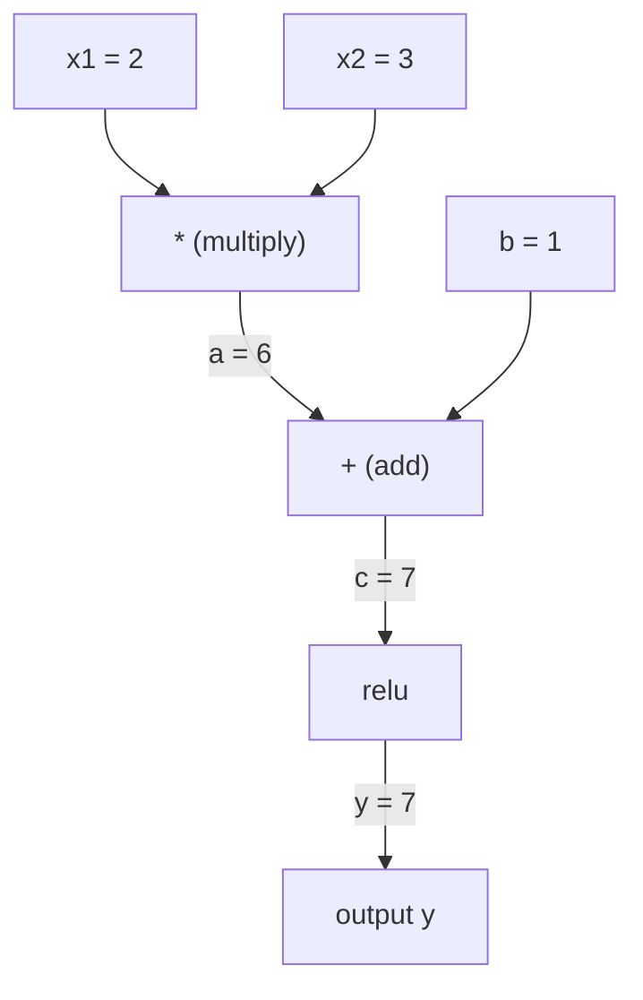
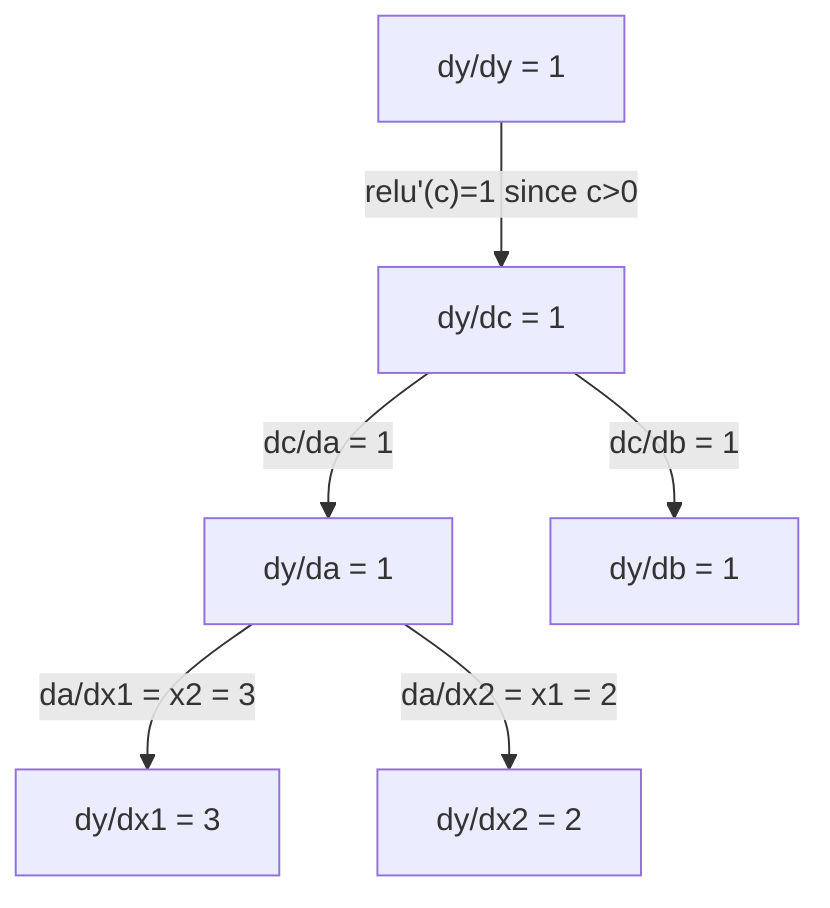

# Regra da cadeia e diferenciação automática

> A Regra da Cadeia é o motor de cada rede neural capaz de aprender.

**类型：**Construir
**语言：**Python
**前置要求：**Fase 1, Lição 04 (Derivados e Gradientes)
**时间：**Cerca de 90 minutos

## Objectivo de aprendizagem

- 构建一个极简 autograd 引擎(Valor classe),记录操作并通过反转模式自动调整 计算 Gradient
- Utilize topological sort em gráfico de computação 中实现前和后传
-  Utilizando apenas um motor de autogradamento implementado desde zero, construindo e treinando um perceptor de várias camadas no XOR
- Utilize verificação de gradiente, auto-difiguração com diferenças finitas de valores numéricos em relação à verificação de corretão

## 问题

Você pode calcular o número de funções simples. Mas a Rede Neural não é uma função simples. É composta por uma combinação de centenas de funções: multiplicar matriz, adicionar preconceito, aplicar ativação, multiplicar matriz novamente, softmax, perda de entropia.

Para treinar a rede, você precisa perder em relação a cada gradiente de peso. Para milhões de parâmetros manualmente, isso é impossível.

Regra da cadeia  fornecer base matemática.  Diferenciação automática  fornecer algoritmo.  2o, combinar, permitir que você possa passar em tempo normal com uma passagem para frente, através de qualquer conjunto de funções calcular Gradiente preciso.

É assim que funciona o PyTorch、TensorFlow 和 JAX. Você vai construir uma versão micro do zero.

## 核心概念

### Regra da cadeia

Se `y = f(g(x))`- Então ?`y`Comparado com`x`É um número de:

```
dy/dx = dy/dg * dg/dx = f'(g(x)) * g'(x)
```

沿着链条将导数相乘―― cada um dos eixos contribui com seu próprio local de direção――

exemplo:`y = sin(x^2)`

```
g(x) = x^2       g'(x) = 2x
f(g) = sin(g)     f'(g) = cos(g)

dy/dx = cos(x^2) * 2x
```

对于更深的组合,链条会继续延伸:

```
y = f(g(h(x)))

dy/dx = f'(g(h(x))) * g'(h(x)) * h'(x)
```

Cada camada da rede neural é um elemento da cadeia.

### Gráficos computacionais

O gráfico computacional 让链规则可视化──每个操作都将成为一个节点──数据沿图向前流动──Gradiente向后流动──

**Forward pass（计算值）：**



**Backward pass（计算 Gradient）：**



Passagem para trás 会在每个节点应用链规则,将 Gradiente de saída para entrada.

### Modelo de direção anterior versus Modelo de direção inversa

Há duas formas de aplicar a Regra da Cadeia no gráfico:

**Forward mode**Desde o início da entrada, será o número de direção para o futuro.`dx/dx = 1`,并通过每操作传播――适合输入少、输出多场景――

```
Forward mode: seed dx/dx = 1, propagate forward

  x = 2       (dx/dx = 1)
  a = x^2     (da/dx = 2x = 4)
  y = sin(a)  (dy/dx = cos(a) * da/dx = cos(4) * 4 = -2.615)
```

**Reverse mode**Desde o saída, vai Gradiente para o retorno.`dy/dy = 1`, e em ordem reversa através de cada operação de disseminação.

```
Reverse mode: seed dy/dy = 1, propagate backward

  y = sin(a)  (dy/dy = 1)
  a = x^2     (dy/da = cos(a) = cos(4) = -0.654)
  x = 2       (dy/dx = dy/da * da/dx = -0.654 * 4 = -2.615)
```

Rede Neural Há vários milhões de entradas (peso) e uma saída (perda) ―Modo inverso pode ser em uma única passagem para trás 中计算所有 Gradient―这是 Backpropagation 使用逆模式的原因―

| Mode | Seed | Direction | Best when |
|------|------|-----------|-----------|
| Forward | `dx_i/dx_i = 1` | 输入到输出 | 输入少、输出多 |
| Reverse | `dy/dy = 1` | 输出到输入 | 输入多、输出少（neural nets） |

### Utilizado no modo Forward de Dual Numbers

O modo avançado pode ser realizado com números duplos.`a + b*epsilon`, entre os `epsilon^2 = 0`- Não.

```
Dual number: (value, derivative)

(2, 1) means: value is 2, derivative w.r.t. x is 1

Arithmetic rules:
  (a, a') + (b, b') = (a+b, a'+b')
  (a, a') * (b, b') = (a*b, a'*b + a*b')
  sin(a, a')         = (sin(a), cos(a)*a')
```

A direção de cada variável de entrada será definida como 1―.

### 构建 Autograd 引擎

Uma máquina de auto-aumento precisa de três coisas:

1. **Value wrapping。**Envolver cada número em um objeto, para armazenar seu valor e gradiente.
2. **Graph recording。**Cada operação registra sua entrada e localização Gradiente função.
3. **Backward pass。**Para o gráfico fazer uma classificação topológica, então reverso através, em cada ponto aplicar a Regra da Cadeia.

É o PyTorch.`autograd`O que fazer.`torch.Tensor`classe 包裹值, em `requires_grad=True`时记录操作, e você调用 `.backward()`时计算 Gradiente。

### PyTorch Autograd 底层如何工作

Quando escrevi PyTorch:

```python
x = torch.tensor(2.0, requires_grad=True)
y = x ** 2 + 3 * x + 1
y.backward()
print(x.grad)  # 7.0 = 2*x + 3 = 2*2 + 3
```

PyTorch em reunião interna:

1. Por`x` criar um `Tensor`节点,并设置 `requires_grad=True`
2. Cada operação`**`- Não.`*`- Não.`+`) todos vão criar um novo ponto, e registar para trás  função
3. `y.backward()`触发对已记录图的反转模式自动调整
4. Cada ponto.`grad_fn`計算局部 Gradiente,并将它们传给父节点
5. Gradiente 通過加法(不是替换) acumulator到 `.grad`属性中

Este gráfico é um gráfico de movimento (defini-por-correr) e cada passagem avançada, a cidade construirá um novo gráfico.


```figure
chain-rule
```

## Construí-lo

### 步骤 1:Classe de valor

```python
class Value:
    def __init__(self, data, children=(), op=''):
        self.data = data
        self.grad = 0.0
        self._backward = lambda: None
        self._prev = set(children)
        self._op = op

    def __repr__(self):
        return f"Value(data={self.data:.4f}, grad={self.grad:.4f})"
```

Cada um .`Value`Todos armazenam seus próprios valores numéricos, dados Gradiente, um função para trás, bem como os pontos de orientação para gerar seus nódulos menores.

### 步骤 2:带 Gradiente de rastreamento de operações de cálculo

```python
    def __add__(self, other):
        other = other if isinstance(other, Value) else Value(other)
        out = Value(self.data + other.data, (self, other), '+')
        def _backward():
            self.grad += out.grad
            other.grad += out.grad
        out._backward = _backward
        return out

    def __mul__(self, other):
        other = other if isinstance(other, Value) else Value(other)
        out = Value(self.data * other.data, (self, other), '*')
        def _backward():
            self.grad += other.data * out.grad
            other.grad += self.data * out.grad
        out._backward = _backward
        return out

    def relu(self):
        out = Value(max(0, self.data), (self,), 'relu')
        def _backward():
            self.grad += (1.0 if out.data > 0 else 0.0) * out.grad
        out._backward = _backward
        return out
```

Cada operação cria um fechamento, sabe como calcular o local Gradiente,并乘以上游 Gradient(`out.grad`)。`+=`处理 é a situação em que um valor é usado por vários operadores.

### 步骤 3: Passagem para trás

```python
    def backward(self):
        topo = []
        visited = set()
        def build_topo(v):
            if v not in visited:
                visited.add(v)
                for child in v._prev:
                    build_topo(child)
                topo.append(v)
        build_topo(self)

        self.grad = 1.0
        for v in reversed(topo):
            v._backward()
```

Tipo topológico  assegurar cada ponto do gradiente em disseminação até seus nódulos infantis 之前已完整计算──种子 Gradiente é 1,0 ((dy/dy = 1)。

### 步骤 4: motor completo requer mais operações

Base Classe de Valor  suport加法、乘法和 relu── autograd  motor real  motor precisa de mais capacidade── abaixo estão as operações necessárias para construir Rede Neural:

```python
    def __neg__(self):
        return self * -1

    def __sub__(self, other):
        return self + (-other)

    def __radd__(self, other):
        return self + other

    def __rmul__(self, other):
        return self * other

    def __rsub__(self, other):
        return other + (-self)

    def __pow__(self, n):
        out = Value(self.data ** n, (self,), f'**{n}')
        def _backward():
            self.grad += n * (self.data ** (n - 1)) * out.grad
        out._backward = _backward
        return out

    def __truediv__(self, other):
        return self * (other ** -1) if isinstance(other, Value) else self * (Value(other) ** -1)

    def exp(self):
        import math
        e = math.exp(self.data)
        out = Value(e, (self,), 'exp')
        def _backward():
            self.grad += e * out.grad
        out._backward = _backward
        return out

    def log(self):
        import math
        out = Value(math.log(self.data), (self,), 'log')
        def _backward():
            self.grad += (1.0 / self.data) * out.grad
        out._backward = _backward
        return out

    def tanh(self):
        import math
        t = math.tanh(self.data)
        out = Value(t, (self,), 'tanh')
        def _backward():
            self.grad += (1 - t ** 2) * out.grad
        out._backward = _backward
        return out
```

**每个操作为什么重要：**

| Operation | Backward rule | Used in |
|-----------|--------------|---------|
| `__sub__` | 复用 add + neg | Loss 计算（pred - target） |
| `__pow__` | n * x^(n-1) | Polynomial activations、MSE（error^2） |
| `__truediv__` | 复用 mul + pow(-1) | Normalization、learning rate scaling |
| `exp` | exp(x) * upstream | Softmax、log-likelihood |
| `log` | (1/x) * upstream | Cross-entropy loss、log probabilities |
| `tanh` | (1 - tanh^2) * upstream | 经典 activation function |

O que é que é que é:`__sub__`和 `__truediv__`É definido por operações já existentes. Eles automaticamente obtêm o Gradiente correto, pois a Regra da Cadeia irá passar pela combinação de operações de adição/mul/pow da camada inferior.

### 步骤 5: Realização de Mini MLP a partir de zero

Com uma classe de valores completa, podemos construir uma rede neural. Não precisamos de PyTorch.

```python
import random

class Neuron:
    def __init__(self, n_inputs):
        self.w = [Value(random.uniform(-1, 1)) for _ in range(n_inputs)]
        self.b = Value(0.0)

    def __call__(self, x):
        act = sum((wi * xi for wi, xi in zip(self.w, x)), self.b)
        return act.tanh()

    def parameters(self):
        return self.w + [self.b]

class Layer:
    def __init__(self, n_inputs, n_outputs):
        self.neurons = [Neuron(n_inputs) for _ in range(n_outputs)]

    def __call__(self, x):
        return [n(x) for n in self.neurons]

    def parameters(self):
        return [p for n in self.neurons for p in n.parameters()]

class MLP:
    def __init__(self, sizes):
        self.layers = [Layer(sizes[i], sizes[i+1]) for i in range(len(sizes)-1)]

    def __call__(self, x):
        for layer in self.layers:
            x = layer(x)
        return x[0] if len(x) == 1 else x

    def parameters(self):
        return [p for layer in self.layers for p in layer.parameters()]
```

Um .`Neuron`计算 `tanh(w1*x1 + w2*x2 + ... + b)`Uma.`Layer`É um neurônio.`MLP`- Uma camada de cada um.`Value`, para que o uso`loss.backward()`Vai-se espalhar o gradiente para cada parâmetro.

**在 XOR 上训练：**

```python
random.seed(42)
model = MLP([2, 4, 1])  # 2 inputs, 4 hidden neurons, 1 output

xs = [[0, 0], [0, 1], [1, 0], [1, 1]]
ys = [-1, 1, 1, -1]  # XOR pattern (using -1/1 for tanh)

for step in range(100):
    preds = [model(x) for x in xs]
    loss = sum((p - y) ** 2 for p, y in zip(preds, ys))

    for p in model.parameters():
        p.grad = 0.0
    loss.backward()

    lr = 0.05
    for p in model.parameters():
        p.data -= lr * p.grad

    if step % 20 == 0:
        print(f"step {step:3d}  loss = {loss.data:.4f}")

print("\nPredictions after training:")
for x, y in zip(xs, ys):
    print(f"  input={x}  target={y:2d}  pred={model(x).data:6.3f}")
```

É o microgrado. Uma completa formação de rede neural que utiliza Python e diferenciação automática é a mesma coisa que é feita em grande escala em cada framework de aprendizagem profunda comercial.

### 步骤 6: Verificação de gradientes

Como você sabe se seu auto-dif é correto? Compará-lo com o índice de valores.

```python
def gradient_check(build_expr, x_val, h=1e-7):
    x = Value(x_val)
    y = build_expr(x)
    y.backward()
    autodiff_grad = x.grad

    y_plus = build_expr(Value(x_val + h)).data
    y_minus = build_expr(Value(x_val - h)).data
    numerical_grad = (y_plus - y_minus) / (2 * h)

    diff = abs(autodiff_grad - numerical_grad)
    return autodiff_grad, numerical_grad, diff
```

Em um complexo expressão, testá-lo:

```python
def expr(x):
    return (x ** 3 + x * 2 + 1).tanh()

ad, num, diff = gradient_check(expr, 0.5)
print(f"Autodiff:  {ad:.8f}")
print(f"Numerical: {num:.8f}")
print(f"Difference: {diff:.2e}")
# Difference should be < 1e-5
```

实现新操作时,渐进检查 至关重要――如果你的倒退通过有 bug,数值检查会发现它――每个严的深度学习 实现都会在开发期间运行渐进检查――

**什么时候使用 gradient checking：**

| Situation | Do gradient check? |
|-----------|-------------------|
| 向 autograd 添加新操作 | 是，始终要做 |
| 调试无法收敛的训练循环 | 是，先检查 Gradient |
| 生产训练 | 否，太慢（每个参数需要 2 次 forward pass） |
| autograd 代码的 unit tests | 是，将它自动化 |

### 步骤 7: Concerto de resultados

```python
x1 = Value(2.0)
x2 = Value(3.0)
a = x1 * x2          # a = 6.0
b = a + Value(1.0)    # b = 7.0
y = b.relu()          # y = 7.0

y.backward()

print(f"y = {y.data}")          # 7.0
print(f"dy/dx1 = {x1.grad}")   # 3.0 (= x2)
print(f"dy/dx2 = {x2.grad}")   # 2.0 (= x1)
```

Manual de inspecção:`y = relu(x1*x2 + 1)`❖ Como `x1*x2 + 1 = 7 > 0`O relú é a identidade.
`dy/dx1 = x2 = 3`- Não.`dy/dx2 = x1 = 2`◊ resultados do motor coincidem ◊

## Use-o

### Compreensão de PyTorch

```python
import torch

x1 = torch.tensor(2.0, requires_grad=True)
x2 = torch.tensor(3.0, requires_grad=True)
a = x1 * x2
b = a + 1.0
y = torch.relu(b)
y.backward()

print(f"PyTorch dy/dx1 = {x1.grad.item()}")  # 3.0
print(f"PyTorch dy/dx2 = {x2.grad.item()}")  # 2.0
```

Gradiente 相同── Resultados do cálculo do seu motor com PyTorch 一致, porque a base matemática é a mesma: através da Regra da Cadeia 实现 reverse-mode autodiff──

### Uma expressão mais complexa

```python
a = Value(2.0)
b = Value(-3.0)
c = Value(10.0)
f = (a * b + c).relu()  # relu(2*(-3) + 10) = relu(4) = 4

f.backward()
print(f"df/da = {a.grad}")  # -3.0 (= b)
print(f"df/db = {b.grad}")  #  2.0 (= a)
print(f"df/dc = {c.grad}")  #  1.0
```

## 交付内容

本课会产出:
- `outputs/skill-autodiff.md`-- uma habilidade para construir e modificar sistemas de autogradamento
- `code/autodiff.py`-- um motor de auto-grado de extrema simplificação que pode continuar a ser expandido

A classe de valor construída aqui é a base do ciclo de treinamento da rede neural na fase 3.

## 练习

1. À classe de valor 添加 `__pow__`, assim podes calcular`x ** n` 验证在 `x=2`时,`d/dx(x^3)`É assim .`12.0`- Não.

2. 添加 `tanh`作为激活函数──验证 `tanh'(0) = 1`且 `tanh'(2) = 0.0707`(Valoe aproximado)

3. Para um único neurônio  Construir um gráfico de computação:`y = relu(w1*x1 + w2*x2 + b)`△ calcular todos os cinco graus,并与 PyTorch 验证──

4. Utilize duplo número  realçar auto-difiguração de modo avançado `Dual`classe,并验证 it gives the same number as reverse-mode engine.

## 关键术语

| Term | What people say | What it actually means |
|------|----------------|----------------------|
| Chain rule | “把导数相乘” | 组合函数的导数等于每个函数在正确位置处的局部导数之积 |
| Computational graph | “网络图” | 一个有向无环图，其中节点是操作，边承载值（forward）或 Gradient（backward） |
| Forward mode | “向前推导数” | 将导数从输入传播到输出的 autodiff。每个输入变量需要一次 pass。 |
| Reverse mode | “Backpropagation” | 将 Gradient 从输出传播到输入的 autodiff。每个输出变量需要一次 pass。 |
| Autograd | “自动 Gradient” | 一个系统：记录对值执行的操作、构建 graph，并通过 Chain Rule 计算精确 Gradient |
| Dual numbers | “值加导数” | 形式为 a + b*epsilon（epsilon^2 = 0）的数字，可以在算术运算中携带导数信息 |
| Topological sort | “依赖顺序” | 对 graph 节点排序，使每个节点都位于其所有依赖之后。正确传播 Gradient 所必需。 |
| Gradient accumulation | “相加，不要替换” | 当一个值流入多个操作时，它的 Gradient 是所有传入 Gradient 贡献的总和 |
| Dynamic graph | “Define by run” | 每次 forward pass 都重新构建的 computation graph，允许模型内部使用 Python 控制流（PyTorch 风格） |
| Gradient checking | “数值验证” | 将 autodiff Gradient 与数值 finite-difference Gradient 对比，以验证正确性。调试时必不可少。 |
| MLP | “Multi-layer perceptron” | 一个包含一层或多层隐藏 neuron 的 Neural Network。每个 neuron 计算加权和加 bias，然后应用 activation function。 |
| Neuron | “加权和 + activation” | 基本单元：output = activation(w1*x1 + w2*x2 + ... + b)。weights 和 bias 是可学习参数。 |

## 延伸阅读

- [3Blue1Brown: Backpropagation calculus](https://www.youtube.com/watch?v=tIeHLnjs5U8)-- Exposição visual da regra da cadeia na rede neural
- [PyTorch Autograd mechanics](https://pytorch.org/docs/stable/notes/autograd.html)-- 真实系统的工作方式
- [Baydin et al., Automatic Differentiation in Machine Learning: a Survey](https://arxiv.org/abs/1502.05767)-- 综合参考
