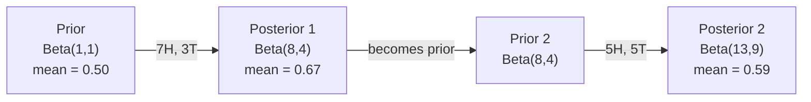

# Teorema de Bayes

> Probabilidade  preocupação é o que você espera que aconteça―Teorema de Bayes  preocupação é o que você aprendeu―

**类型：**Construir
**语言：**Python
**前置要求：**Fase 1, Lição 06 ((Fundamentos da probabilidade)
**时间：**- 75 minutos.

## Objectivo de aprendizagem

-  aplicar o teorema de Bayes, com base na probabilidade anterior e evidência  calcular a probabilidade posterior
- Desde zero construção de um com Laplace suavizamento e log-espaço computação de Bayes Ingênuo 文本分类器
- Comparar MLE e estimativa do MAP,并解释 MAP 如何应对L2 regularisation
- Utilize Beta-Binomial conjugate priorities para testes A/B  realçar atualização Bayesian sequencial

## 问题

Um exame médico tem uma taxa de precisão de 99%... o seu exame foi positivo... qual é a probabilidade de você realmente estar doente?

A maioria das pessoas dirá que 99%... a resposta real depende da raridade dessa doença... se apenas 1 em cada 10.000 pessoas tiverem doença, então um resultado positivo significa apenas que você tem uma probabilidade de doença de cerca de 1%... os outros 99% de resultados positivos são erros de saúde.

Não é um movimento de massa cerebral. É o teorema de Bayes. Cada filtro de spam, cada diagnóstico médico, cada modelo de ML de quantificação de incerteza, usa o mesmo tipo de raciocínio. Primeiro, temos uma crença.

Se você não entender isso, se você construir um sistema de inteligência artificial, você vai interpretar erroneamente os resultados do modelo, estabelecer prazos ruins e publicar previsões excessivamente confiantes.

## 概念

### Da probabilidade conjunta para Bayes .

Já sabes na lição 06 que a probabilidade condicional é:

```
P(A|B) = P(A and B) / P(B)
```

Para a sua definição:

```
P(B|A) = P(A and B) / P(A)
```

两个表达式共享同一个分子:P(A e B) ――令它们相等并重新整理:

```
P(A and B) = P(A|B) * P(B) = P(B|A) * P(A)

Therefore:

P(A|B) = P(B|A) * P(A) / P(B)
```

É o teorema de Bayes.

### Quatro partes

| Part | Name | What it means |
|------|------|---------------|
| P(A\|B) | Posterior | 看到 evidence B 之后，你对 A 的更新后 belief |
| P(B\|A) | Likelihood | 如果 A 为真，evidence B 出现的概率有多大 |
| P(A) | Prior | 在看到任何 evidence 之前，你对 A 的 belief |
| P(B) | Evidence | 在所有可能性下看到 B 的总概率 |

Evidências 项 P(B) 起归一化因子的作用── você pode usar a lei da probabilidade total 展开它:

```
P(B) = P(B|A) * P(A) + P(B|not A) * P(not A)
```

### 医学检测 exemplo

Uma doença afeta 1 em cada 10.000 pessoas. A taxa de verificação é de 99% e a taxa de erro é de 1%.

```
P(sick)          = 0.0001     (prior: disease is rare)
P(positive|sick) = 0.99       (likelihood: test catches it)
P(positive|healthy) = 0.01    (false positive rate)

P(positive) = P(positive|sick) * P(sick) + P(positive|healthy) * P(healthy)
            = 0.99 * 0.0001 + 0.01 * 0.9999
            = 0.000099 + 0.009999
            = 0.010098

P(sick|positive) = P(positive|sick) * P(sick) / P(positive)
                 = 0.99 * 0.0001 / 0.010098
                 = 0.0098
                 = 0.98%
```

Não chega a 1%: o que é o problema? Quando uma situação é muito rara, mesmo os exames precisos também geram falsos resultados.

### Filtro de spam exemplo

Recebeu um e-mail que contou com a palavra "loteria"?

```
P(spam)                = 0.3      (30% of email is spam)
P("lottery"|spam)      = 0.05     (5% of spam emails contain "lottery")
P("lottery"|not spam)  = 0.001    (0.1% of legitimate emails contain "lottery")

P("lottery") = 0.05 * 0.3 + 0.001 * 0.7
             = 0.015 + 0.0007
             = 0.0157

P(spam|"lottery") = 0.05 * 0.3 / 0.0157
                  = 0.955
                  = 95.5%
```

Uma palavra coloca a probabilidade de 30%                                                                                                                                                                                                                                                                                                                                                                                                                                                                                                                     

### Bayes ingênuo: suposição de independência

Naívo Bayes                                                                                                                                                                                                                                                                                                                                                                                                                                                                                                                         

```
P(class | feature_1, feature_2, ..., feature_n)
  = P(class) * P(feature_1|class) * P(feature_2|class) * ... * P(feature_n|class)
    / P(feature_1, feature_2, ..., feature_n)
```

Parte da "naiva" é a suposição de independência. No texto, o aparecimento de palavras não é independente. Mas essa suposição tem um efeito estranho na prática, pois a classificação só precisa de uma classificação, e não de uma boa probabilidade de gerar uma classificação.

Como as classes são iguais, você pode saltar por cima delas, apenas comparando moléculas:

```
score(class) = P(class) * product of P(feature_i | class)
```

Selecionar a melhor classificação.

### Estimação máxima de probabilidade (MLE)

Como obter dados de treinamento para a P                                                                                                                                                                                                                                                           

```
P("free"|spam) = (number of spam emails containing "free") / (total spam emails)
```

É o MLE: selecionar o valor de parâmetros mais provável de observação de dados. Você está no maximizar a função de probabilidade; para o cálculo de separação, ele se simplifica para a frequência relativa.

问题: Se um termo durante o treino nunca apareceu no spam, MLE vai dar-lhe uma probabilidade de zero.

```
P(word|class) = (count(word, class) + 1) / (total_words_in_class + vocabulary_size)
```

Dá a cada número mais um, para que as probabilidades não sejam de zero.

### MAP (Maksimal a posteriori)

MLE 问的是: quais são os parâmetros máximos de P((os parâmetros de dados)?

O MAP 问是: quais parâmetros maximizar P parâmetros em dados)?

Segundo o teorema de Bayes:

```
P(parameters|data) proportional to P(data|parameters) * P(parameters)
```

MAP irá em parâmetros integrar um anterior sobre si mesmo. Se você acha que os parâmetros devem ser menores, então codifique-o para punir o valor superior do anterior.

| Estimation | Optimizes | ML equivalent |
|------------|-----------|---------------|
| MLE | P(data\|params) | 未 regularize 的训练 |
| MAP | P(data\|params) * P(params) | L2 / L1 regularization |

### Bayesian vs frequentist: prática diferencial

Os frequentistas colocam os parâmetros como quantidades fixas mas desconhecidas. Eles perguntam: se eu repetisse esta experiência muitas vezes, o que aconteceria?

Bayesians Colocar parâmetros 视为分布── eles perguntam:  Baseado no que já observei, eu tenho alguma crença nesses parâmetros?

 Para a construção de sistemas de gestão de dados, as diferenças práticas são as seguintes:

| Aspect | Frequentist | Bayesian |
|--------|-------------|----------|
| Output | 点估计 | 值上的 distribution |
| Uncertainty | Confidence intervals（关于过程） | Credible intervals（关于 parameter） |
| Small data | 可能 overfit | Prior 起到 regularization 的作用 |
| Computation | 通常更快 | 通常需要 sampling（MCMC） |

A maioria dos níveis de produção de ML é frequentista de SGD 点估算) ⋅ quando você precisa de um bom nível de incerteza ⋅ medicinal decision ⋅ safety key system), ou muito pouco de dados ⋅ aprendizado de poucas tiras ⋅ começo frio) ⋅ quando os métodos bayesianos serão muito úteis ⋅

### Por que o pensamento bayesiano é importante para o ML?

Esta ligação é mais profunda:

**Priors 就是 regularization。**Os valores de parâmetros de Gaussian acima são a regularização L2.

**Posteriors 就是不确定性。**单个预测概率不能告诉你模型对该估计有多信心――Báiiense métodos 会给你一个分布:我认为P(spam) 间 0.8到0.95 之间――

**Bayes updates 就是 online learning。**O posterior de hoje será o anterior de amanhã. Quando o seu modelo vê novos dados, ele vai aumentar a atualização de suas crenças, em vez de re-treinar a partir de zero.

**Model comparison 是 Bayesian 的。**Critério de informação bayesiano (BIC) ▌probabilidade marginal 和 fatores de Bayes ▌ utilizam o raciocínio bayesiano em casos de seleção de modelos não adequados ▌


```figure
bayes-update
```

## Construí-lo
### 步骤 1: Função do teorema de Bayes

```python
def bayes(prior, likelihood, false_positive_rate):
    evidence = likelihood * prior + false_positive_rate * (1 - prior)
    posterior = likelihood * prior / evidence
    return posterior

result = bayes(prior=0.0001, likelihood=0.99, false_positive_rate=0.01)
print(f"P(sick|positive) = {result:.4f}")
```

### 步骤 2: Classificador Bayes

```python
import math
from collections import defaultdict

class NaiveBayes:
    def __init__(self, smoothing=1.0):
        self.smoothing = smoothing
        self.class_counts = defaultdict(int)
        self.word_counts = defaultdict(lambda: defaultdict(int))
        self.class_word_totals = defaultdict(int)
        self.vocab = set()

    def train(self, documents, labels):
        for doc, label in zip(documents, labels):
            self.class_counts[label] += 1
            words = doc.lower().split()
            for word in words:
                self.word_counts[label][word] += 1
                self.class_word_totals[label] += 1
                self.vocab.add(word)

    def predict(self, document):
        words = document.lower().split()
        total_docs = sum(self.class_counts.values())
        vocab_size = len(self.vocab)
        best_class = None
        best_score = float("-inf")
        for cls in self.class_counts:
            score = math.log(self.class_counts[cls] / total_docs)
            for word in words:
                count = self.word_counts[cls].get(word, 0)
                total = self.class_word_totals[cls]
                score += math.log((count + self.smoothing) / (total + self.smoothing * vocab_size))
            if score > best_score:
                best_score = score
                best_class = cls
        return best_class
```

As probabilidades de log podem evitar o fluxo inferior. Muitas probabilidades muito pequenas multiplicam-se para um ponto flutuante para obter números muito pequenos.

### 步骤 3: em spam dados treinamento

```python
train_docs = [
    "win free money now",
    "free lottery ticket winner",
    "claim your prize today free",
    "urgent offer free cash",
    "congratulations you won free",
    "meeting tomorrow at noon",
    "project update attached",
    "can we schedule a call",
    "quarterly report review",
    "lunch on thursday sounds good",
    "team standup notes attached",
    "please review the pull request",
]

train_labels = [
    "spam", "spam", "spam", "spam", "spam",
    "ham", "ham", "ham", "ham", "ham", "ham", "ham",
]

classifier = NaiveBayes()
classifier.train(train_docs, train_labels)

test_messages = [
    "free money waiting for you",
    "meeting rescheduled to friday",
    "you won a free prize",
    "please review the attached report",
]

for msg in test_messages:
    print(f"  '{msg}' -> {classifier.predict(msg)}")
```

### 步骤 4: probabilidade de aprendizagem

```python
def show_top_words(classifier, cls, n=5):
    vocab_size = len(classifier.vocab)
    total = classifier.class_word_totals[cls]
    probs = {}
    for word in classifier.vocab:
        count = classifier.word_counts[cls].get(word, 0)
        probs[word] = (count + classifier.smoothing) / (total + classifier.smoothing * vocab_size)
    sorted_words = sorted(probs.items(), key=lambda x: x[1], reverse=True)
    for word, prob in sorted_words[:n]:
        print(f"    {word}: {prob:.4f}")

print("\nTop spam words:")
show_top_words(classifier, "spam")
print("\nTop ham words:")
show_top_words(classifier, "ham")
```

## Use-o
O Scikit-Learn forneceu Bayes ingênuos que podem ser produzidos para realizar:

```python
from sklearn.feature_extraction.text import CountVectorizer
from sklearn.naive_bayes import MultinomialNB
from sklearn.metrics import classification_report

vectorizer = CountVectorizer()
X_train = vectorizer.fit_transform(train_docs)
clf = MultinomialNB()
clf.fit(X_train, train_labels)

X_test = vectorizer.transform(test_messages)
predictions = clf.predict(X_test)
for msg, pred in zip(test_messages, predictions):
    print(f"  '{msg}' -> {pred}")
```

O contectorizador de números  processar a tokenização e a construção do vocabulário―MultinomialNB em processamento interno de suavização e log-probabilidades― você fez a mesma coisa desde a versão de zero-writing com 40 行代码―

## Entrega-o
Esta construção de classe NaiveBayes  demonstrou um pipeline completo: tokenization  uso de estimativa de probabilidade de suavização de Laplace  previsão de log-spaces`code/bayes.py`O código do meio pode ser executado de um lado para outro, além da biblioteca padrão Python.

### Precessos conjuntos

Quando o anterior e posterior pertencem à mesma família de distribuição, este anterior é chamado de "conjugado". Isso permite que a atualização bayesiana em代数 seja muito limpa.

| Likelihood | Conjugate Prior | Posterior | Example |
|-----------|----------------|-----------|---------|
| Bernoulli | Beta(a, b) | Beta(a + successes, b + failures) | Coin flip bias estimation |
| Normal (known variance) | Normal(mu_0, sigma_0) | Normal(weighted mean, smaller variance) | Sensor calibration |
| Poisson | Gamma(a, b) | Gamma(a + sum of counts, b + n) | Modeling arrival rates |
| Multinomial | Dirichlet(alpha) | Dirichlet(alpha + counts) | Topic modeling, language models |

Isso é importante porque, quando não há antecedentes conjugados, você precisa de amostragem de Monte Carlo ou inferência variável para uma aproximação posterior.

A distribuição beta é a mais comum da prática conjugada anterior。Beta(a, b) Exprime sua crença em um determinado parâmetro de probabilidade。 o valor médio é a/(a+b)。a+b 越大, distribuição 越集中(越自信)。

Caso especial do beta anterior:
- Beta(1, 1) = uniforme── você sobre o parâmetro 没有意见──
- Beta(10, 10) = Está perto de 0,5  atingir o pico.
- Beta(1, 10) = para 0 偏斜──你相信参数 很小──

更新规则极其简单:

```
Prior:     Beta(a, b)
Data:      s successes, f failures
Posterior: Beta(a + s, b + f)
```

Não há amostras, só adição.

### Atualização Bayesiana Sequencial

A inferência Bayesiana é que o 天然是序列的── hoje posterior será o anterior de amanhã── é assim que o sistema real aprende em aumento sem re-processar todos os dados históricos──

具体例:估计一枚硬币是否公平──

**Day 1：还没有数据。**
Desde Beta ((1, 1) 开始一个制服前──你没有意见──
- Medida anterior: 0,5
- Prior em [0, 1] 上是平坦的

**Day 2：观察到 7 次正面，3 次反面。**
Posterior = Beta(1 + 7, 1 + 3) = Beta(8, 4)
- Medida posterior:8/12 = 0,667
- Evidências mostram que a moeda está em direcção à direita

**Day 3：又观察到 5 次正面，5 次反面。**
Utilize ontem posterior como hoje anterior.
Posterior = Beta(8 + 5, 4 + 5) = Beta(13, 9)
- Medida posterior:13/22 = 0,591
- Os dados do novo equilíbrio repassaram a estimativa para cerca de 0,5.



观测顺序不重要――Beta(1,1) 一次性用全部 12次正面和 8次反面更新,也会得到Beta(13, 9) 结果相同──Sequential update 和 batch update 在数学上等价──但序列更新 允许你在每一步做决策,而不必存储原始数据──

É a base do aprendizado on-line no sistema ML de produção. Para os bandidos, o sistema de amostragem de Thompson e os detectores de anomalias de streaming usam este modelo.

### Contacto com A/B Testing

A análise A/B é, em essência, uma inferência Bayesiana falsa.

设定: 你正在测试两种按颜色──Variante A(azul) e variante B(verde)──你想知道哪一个获得更多点击──

Teste de A/B Bayesiano:

1. **Prior。**两个变体都从Beta(1, 1) 开始──没有先进偏好──
2. **Data。**Variante A:1000 vezes mostração 50 vezes点击──Variante B:1000 vezes mostração 65 vezes点击──
3. **Posteriors。**
   - A:Beta(1 + 50, 1 + 950) = Beta(51, 951)。Média = 0,051
   - B:Beta(1 + 65, 1 + 935) = Beta(66, 936)。Medio = 0,066
4. **Decision。**计算 P(B > A)B's real taxa de conversão 高于 A's概率──

解析地计算 P(B > A) 很困难――但蒙特卡罗 让它变得非常简单:

```
1. Draw 100,000 samples from Beta(51, 951)  -> samples_A
2. Draw 100,000 samples from Beta(66, 936)  -> samples_B
3. P(B > A) = fraction of samples where B > A
```

Se P(B > A) > 0,95, lançar a variante B;; Se estiver entre 0,05 e 0,95, continuar a coletar dados;; Se P(B > A) < 0,05, lançar a variante A;;

Diferentes vantagens do teste A/B frequentista:
- Você vai obter uma probabilidade direta:
- Não há p-valor 混──没有 fail rejeitar a hipótese nula 这种回避表述──
- Você pode ver o resultado a qualquer momento, sem aumentar as taxas falsas positivas (((sem "problema de olhar")
- Você pode adotar conhecimento prévio, por exemplo, testes anteriores mostram taxas de conversão geralmente são de 3-8%.

| Aspect | Frequentist A/B | Bayesian A/B |
|--------|----------------|--------------|
| Output | p-value | P(B > A) |
| Interpretation | “如果 A=B，这些数据有多令人意外？” | “B 比 A 更好的可能性有多大？” |
| Early stopping | 会抬高 false positives | 任意时点都是安全的（前提是 prior 选择合理且 model specification 正确） |
| Prior knowledge | 不使用 | 编码为 Beta prior |
| Decision rule | p < 0.05 | P(B > A) > threshold |

## 练习
1. **Multiple tests。**Um paciente em dois exames independentes foi positivo em 99% de certeza, a taxa de incidência de doença é de 1 em cada 10.000 pessoas.

2. **Smoothing impact。**Utilize 0.01、0.1、1.0 和 10.0 de valores de suavizamento 运行垃圾邮件分类器──Top word probabilities 会如何变化?当平滑=0 且某个词只出现 中时会发生什么?

3. **Add features。**扩展 NaiveBayes classe, fazendo com que, além de contagens de palavras 之外, também use message length(short/long) como recurso。

4. **MAP by hand。**给定观测数据(10 vezes lançamentos de moeda em 7 vezes cabeças), usando Beta(2,2) estimativa MAP de bias anterior 计算──把它与 MLE estimativa(7/10) para comparar──

## 关键术语
| Term | What people say | What it actually means |
|------|----------------|----------------------|
| Prior | “我的初始猜测” | 观测 evidence 之前的 P(hypothesis)。在 ML 中：regularization 项。 |
| Likelihood | “数据拟合得有多好” | P(evidence\|hypothesis)。在特定 hypothesis 下，观测数据出现的概率有多大。 |
| Posterior | “我更新后的 belief” | P(hypothesis\|evidence)。Prior 乘以 likelihood，然后归一化。 |
| Evidence | “归一化常数” | 所有 hypotheses 下的 P(data)。确保 posterior 求和为 1。 |
| Naive Bayes | “那个简单的文本分类器” | 一个假设 features 在给定 class 时相互独立的分类器。尽管该假设不成立，效果仍然很好。 |
| Laplace smoothing | “Add-one smoothing” | 给每个 feature 增加一个小计数，以防止未见数据产生零概率。 |
| MLE | “直接用频率” | 选择最大化 P(data\|parameters) 的 parameters。没有 prior。在小数据上可能 overfit。 |
| MAP | “带 prior 的 MLE” | 选择最大化 P(data\|parameters) * P(parameters) 的 parameters。等价于 regularized MLE。 |
| Log-probability | “在 log space 中工作” | 使用 log(P) 而不是 P，避免许多小数相乘时发生 floating-point underflow。 |
| False positive | “错误警报” | 检测结果为阳性，但真实状态为阴性。它会推动 base rate fallacy。 |

## 延伸阅读
- [3Blue1Brown: Bayes' theorem](https://www.youtube.com/watch?v=HZGCoVF3YvM)- Uso de exames médicos exemplo de explicação visível
- [Stanford CS229: Generative Learning Algorithms](https://cs229.stanford.edu/notes2022fall/cs229-notes2.pdf)- ligação de Bayes e seus modelos discriminatórios
- [Think Bayes](https://greenteapress.com/wp/think-bayes/)- 免费书籍, contendo Python 代码 de estatísticas bayesianas
- [scikit-learn Naive Bayes](https://scikit-learn.org/stable/modules/naive_bayes.html)- Realização do nível de produção e quando utilizar as variantes
