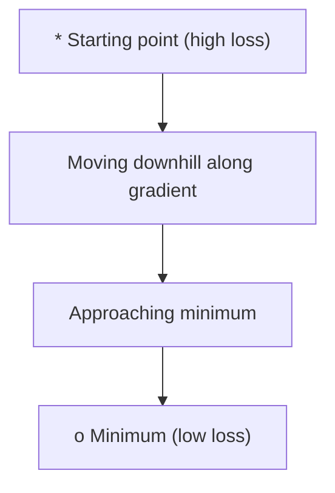
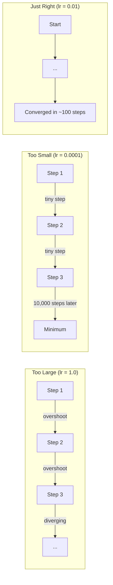
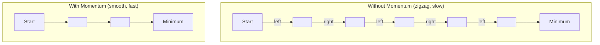
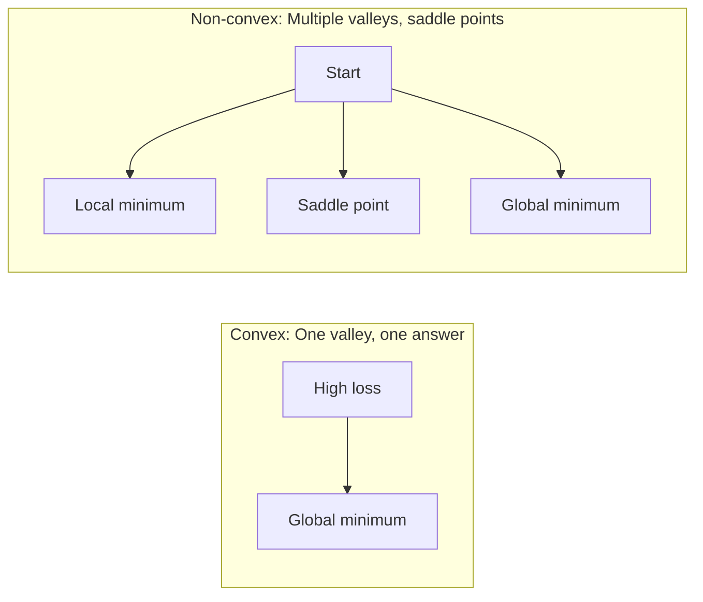
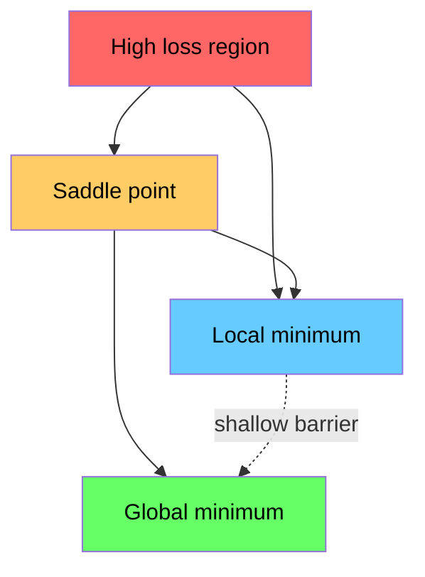

# Optimização

> Treinar uma rede neural é, em essência, procurar o ponto mínimo do Vale.

**Type:** Build
**Language:**Python
**Prerequisites:** Phase 1, Lessons 04-05 (Derivatives, Gradients)
**Time:** ~75 minutes

## Objectivo de aprendizagem
- Desde zero, a SGD de descida do gradiente de vainilha, e Adam
- Comparar a função Rosenbrock 收表现,并解释为什么Adam 会为每一个重量自适应调整学习率
- 区分 convex com não-convex Loss landscape,并解释 седло точка 在高维空间中的作用
-  configurar horários de aprendizagem de ritmo de decomposição de etapas  cozinha de anelação  aquecimento) para melhorar a estabilidade de treinamento

## 问题
Você tem uma função de perda. Ela diz-lhe que o modelo está errado. Você tem gradientes. Eles dizem-lhe em que direção a perda vai ficar pior. Agora você precisa de uma estratégia para baixo.

O método mais simples é: mover-se em direção inversa do gradiente. Usando um número chamado de taxa de aprendizagem para diminuir o ritmo. Repetir a execução. É o descenso do gradiente, e é realmente eficaz. Mas o ritmo de aprendizagem é muito grande, você vai atravessar diretamente todo o vale, entre os dois lados.

Cada um dos optimizadores do Deep Learning está a responder à mesma pergunta: como chegar mais rápido e confiável ao fundo do vale?

## 概念
### O que significa otimização

Otimizar é procurar o valor de entrada de uma função que pode minimizar ou maximizar. Em Machine Learning, essa função é o peso do modelo.

```
minimize L(w) where:
  L = loss function
  w = model weights (could be millions of parameters)
```

### Descenso gradual (vanilha)

Otimizador mais simples: cálculo Perda em relação a cada gradiente de peso: deixa cada peso mover-se em direção oposta ao seu gradiente:

```
w = w - lr * gradient
```

É o algoritmo completo.



### Taxa de aprendizagem: o hiperparâmetro mais importante

A taxa de aprendizagem controla o progresso.



Não existe uma fórmula que possa dar diretamente a taxa de aprendizagem correta. Você precisa encontrá-la através de experiência.

### SGD vs lote vs mini lote

A descida do gradiente de vainilha, em um passo, será em todo o conjunto de dados.

Descenso de gradiente estocástico (SGD) calculado em um único modelo de gradiente,并立即更新──它噪声大,但快──

Mini-batch gradiente descida 折中处理──先在一个小批次 (32、64、128、256 个样本) 计算上 Gradient,然后更新──这是实际中大家真正使用的方法──

| Variant | Batch size | Gradient quality | Speed per step | Noise |
|---------|-----------|-----------------|---------------|-------|
| Batch GD | 整个 dataset | 精确 | 慢 | 无 |
| SGD | 1 个样本 | 噪声很大 | 快 | 高 |
| Mini-batch | 32-256 | 良好估计 | 均衡 | 中等 |

O SGD e o ruído no mini-batch não são bugs.

### Momentum: Bola pequena que rola para baixo da montanha

A descida do gradiente de vainilha apenas vê o actual gradiente. Se o gradiente voltar a sua forma de flutuação (ou seja, em um vale estreito), o progresso será muito lento.

```
v = beta * v + gradient
w = w - lr * v
```

类比是: uma bola que se rola para baixo da montanha. Não se detém em cada pequena concha, não se reinicia.



`beta`(normalmente 0,9) controle reter muito informação histórica.

### Adam: taxas de aprendizagem adaptativas

Diferentes pesos  necessitam de diferentes taxas de aprendizagem  Alguns muito raros ganham peso de Gradiente, quando finalmente ganham Gradiente  devem dar passos maiores  Alguns continuam ganhando peso de Gradientes gigantes, se devem dar passos menores 

Adam, estimativa de momento adaptativo, vai para cada peso.

1. Primeiro momento ((m):Média corrente dos gradientes (((semelhante a momento)
2. Segundo momento ((v): gradientes quadrados de média corrente ((magnitude de gradiente)

```
m = beta1 * m + (1 - beta1) * gradient
v = beta2 * v + (1 - beta2) * gradient^2

m_hat = m / (1 - beta1^t)    bias correction
v_hat = v / (1 - beta2^t)    bias correction

w = w - lr * m_hat / (sqrt(v_hat) + epsilon)
```

Além de`sqrt(v_hat)`É um importante conhecimento. Os pesos dos grandes gradientes serão submetidos a um grande número de fases.

默认 hiperparâmetros:`lr=0.001, beta1=0.9, beta2=0.999, epsilon=1e-8` Estes valores embutidos para a maioria dos problemas são ineficazes

### Horários de taxa de aprendizagem

A taxa de aprendizagem fixa é uma forma de desvio. No início do treino, você deseja um grande passo, para obter um progresso rápido.

常见 agenda:

| Schedule | Formula | Use case |
|----------|---------|----------|
| Step decay | lr = lr * factor every N epochs | 简单，手动控制 |
| Exponential decay | lr = lr_0 * decay^t | 平滑降低 |
| Cosine annealing | lr = lr_min + 0.5 * (lr_max - lr_min) * (1 + cos(pi * t / T)) | Transformers，现代训练 |
| Warmup + decay | 线性上升，然后 decay | 大模型，防止早期不稳定 |

### Convexo vs não convexo

Função convexa 只有一个最小――渐进下降 总能找到它――像 `f(x) = x^2`Esse tipo de quadrático é convexo.

Funções de perda de rede neural são não convexas.



Na prática, os mínimos locais em redes neurais de alta dimensão são poucos problemas reais. A maioria dos mínimos locais é quase um mínimo global.

### Visualização de paisagem perdida

A perda é uma função de todos os pesos. Para um modelo com 100 milhões de pesos, a perda de paisagem existe em 1.000.000.000 dimensões no espaço.



Minima nítida 泛化差──Flat minima 泛化较好── isto também é um dos motivos pelo qual a SGD tem um impulso na precisão final dos testes 上经常优于亚当: seu ruído impede que o modelo permaneça no mínimo nítido──


```figure
gradient-descent
```

## Construí-lo
### 步骤 1: Defina uma função de teste

A função Rosenbrock é um padrão de otimização clássico. O seu mínimo está localizado em (1, 1), está em um pequeno vale de montanhas, fácil de encontrar, mas difícil de seguir em frente.

```
f(x, y) = (1 - x)^2 + 100 * (y - x^2)^2
```

```python
def rosenbrock(params):
    x, y = params
    return (1 - x) ** 2 + 100 * (y - x ** 2) ** 2

def rosenbrock_gradient(params):
    x, y = params
    df_dx = -2 * (1 - x) + 200 * (y - x ** 2) * (-2 * x)
    df_dy = 200 * (y - x ** 2)
    return [df_dx, df_dy]
```

### 步骤 2: Descenso de gradiente de vainilha

```python
class GradientDescent:
    def __init__(self, lr=0.001):
        self.lr = lr

    def step(self, params, grads):
        return [p - self.lr * g for p, g in zip(params, grads)]
```

### 步骤 3: SGD com impulso

```python
class SGDMomentum:
    def __init__(self, lr=0.001, momentum=0.9):
        self.lr = lr
        self.momentum = momentum
        self.velocity = None

    def step(self, params, grads):
        if self.velocity is None:
            self.velocity = [0.0] * len(params)
        self.velocity = [
            self.momentum * v + g
            for v, g in zip(self.velocity, grads)
        ]
        return [p - self.lr * v for p, v in zip(params, self.velocity)]
```

### 步骤 4: Adão

```python
class Adam:
    def __init__(self, lr=0.001, beta1=0.9, beta2=0.999, epsilon=1e-8):
        self.lr = lr
        self.beta1 = beta1
        self.beta2 = beta2
        self.epsilon = epsilon
        self.m = None
        self.v = None
        self.t = 0

    def step(self, params, grads):
        if self.m is None:
            self.m = [0.0] * len(params)
            self.v = [0.0] * len(params)

        self.t += 1

        self.m = [
            self.beta1 * m + (1 - self.beta1) * g
            for m, g in zip(self.m, grads)
        ]
        self.v = [
            self.beta2 * v + (1 - self.beta2) * g ** 2
            for v, g in zip(self.v, grads)
        ]

        m_hat = [m / (1 - self.beta1 ** self.t) for m in self.m]
        v_hat = [v / (1 - self.beta2 ** self.t) for v in self.v]

        return [
            p - self.lr * mh / (vh ** 0.5 + self.epsilon)
            for p, mh, vh in zip(params, m_hat, v_hat)
        ]
```

### 步骤 5: Correr e comparar

```python
def optimize(optimizer, func, grad_func, start, steps=5000):
    params = list(start)
    history = [params[:]]
    for _ in range(steps):
        grads = grad_func(params)
        params = optimizer.step(params, grads)
        history.append(params[:])
    return history

start = [-1.0, 1.0]

gd_history = optimize(GradientDescent(lr=0.0005), rosenbrock, rosenbrock_gradient, start)
sgd_history = optimize(SGDMomentum(lr=0.0001, momentum=0.9), rosenbrock, rosenbrock_gradient, start)
adam_history = optimize(Adam(lr=0.01), rosenbrock, rosenbrock_gradient, start)

for name, history in [("GD", gd_history), ("SGD+M", sgd_history), ("Adam", adam_history)]:
    final = history[-1]
    loss = rosenbrock(final)
    print(f"{name:6s} -> x={final[0]:.6f}, y={final[1]:.6f}, loss={loss:.8f}")
```

预期输出:Adam 收最快──带动的 SGD 路径更平滑──Vanilla GD Progresses em estreito vale do rio são lentos──

## Use-o
实践中, use PyTorch ou JAX Optimizers── eles processam grupos de parâmetros、desintegração de peso、clipagem gradiente 和 GPU aceleração──

```python
import torch

model = torch.nn.Linear(784, 10)

sgd = torch.optim.SGD(model.parameters(), lr=0.01, momentum=0.9)
adam = torch.optim.Adam(model.parameters(), lr=0.001)
adamw = torch.optim.AdamW(model.parameters(), lr=0.001, weight_decay=0.01)

scheduler = torch.optim.lr_scheduler.CosineAnnealingLR(adam, T_max=100)
```

经验法则:

- Desde Adam (r=0.001) começou.
- Quando você precisa da melhor precisão final, e puder suportar mais custos de modificação, muda para SGD de impulso de LR = 0,01, impulso = 0,9):
- Para transformadores utiliza AdamW(带 decoupled decadência de peso Adam)
- Para mais de várias épocas de treinamento, sempre utilize o cronograma de taxa de aprendizagem.
- Se o treino não estiver estável, reduzir a taxa de aprendizagem. Se o treino for lento, melhorar.

## Entrega-o
O presente curso produz um prompt para escolher o Optimizador adequado.`outputs/prompt-optimizer-guide.md`- Não.

As classes de otimização aqui construídas vão aparecer novamente na Fase 3, quando nós vamos treinar a partir de zero uma rede neural.

## 练习
1. **Learning rate sweep.**Na função Rosenbrock 上使用学习率 [0.0001, 0.0005, 0.001, 0.005, 0.01] 运行香基梯下降──对每一个学习率,在5000步后图图或印最终损失──找到仍能收的最大学习率──

2. **Momentum comparison.**Na função Rosenbrock 上使用动力值 [0.0, 0.5, 0.9, 0.99] 运行带动力的 SGD──追踪每一步的损失──哪个动力值 收最快?哪个会过失?

3. **Saddle point escape.**定义函数  função definida`f(x, y) = x^2 - y^2`(original ponto de um ponto de sela) ∼ desde (0.01, 0.01) 开始── Comparar GD de vainilha、带 momentum 的 SGD 和 Adam 的行为──哪个能逃离 Saddle Point?

4. **Implement learning rate decay.**Por GradientDescent classe 添加 exponencial decadência cronograma:`lr = lr_0 * 0.999^step` Comparar em função Rosenbrock  desempenho de decadência de uso superior com desempenho de decadência de não uso

## 关键术语
| Term | What people say | What it actually means |
|------|----------------|----------------------|
| Gradient descent | “Go downhill” | 通过减去按 learning rate 缩放后的 Gradient 来更新 weights。最基础的 Optimizer。 |
| Learning rate | “Step size” | 控制每次更新让 weights 移动多远的标量。太大会导致发散。太小会浪费计算。 |
| Momentum | “Keep rolling” | 将过去的 Gradients 累积到一个 velocity Vector 中。抑制震荡，并加速沿一致方向的移动。 |
| SGD | “Random sampling” | Stochastic gradient descent。用随机子集而不是完整 dataset 计算 Gradient。实践中几乎总是指 mini-batch SGD。 |
| Mini-batch | “A chunk of data” | 用于估计 Gradient 的一小部分训练数据（32-256 个样本）。平衡速度与 Gradient 准确性。 |
| Adam | “The default optimizer” | Adaptive Moment Estimation。跟踪每个 weight 的 Gradients 和 squared gradients 的 running averages，从而为每个 weight 提供自己的 learning rate。 |
| Bias correction | “Fix the cold start” | Adam 的 first 和 second moments 初始化为零。Bias correction 在早期步骤中通过除以 (1 - beta^t) 进行补偿。 |
| Learning rate schedule | “Change lr over time” | 在训练过程中调整 learning rate 的函数。早期大步，后期小步。 |
| Convex function | “One valley” | 任意 local minimum 都是 global minimum 的函数。Gradient descent 总能找到它。Neural Network losses 不是 convex。 |
| Saddle point | “Flat but not a minimum” | Gradient 为零，但在某些方向上是 minimum、在另一些方向上是 maximum 的点。高维空间中很常见。 |
| Loss landscape | “The terrain” | 在 weight space 上绘制出的 Loss function。通过沿两个随机方向切片来可视化。 |
| Convergence | “Getting there” | Optimizer 已到达一个继续更新也无法显著降低 Loss 的点。 |

## 延伸阅读
- [Sebastian Ruder: An overview of gradient descent optimization algorithms](https://ruder.io/optimizing-gradient-descent/)- Uma descrição completa de todos os principais optimizadores
- [Why Momentum Really Works (Distill)](https://distill.pub/2017/momentum/)- Interacção visual da dinâmica do momento
- [Adam: A Method for Stochastic Optimization (Kingma & Ba, 2014)](https://arxiv.org/abs/1412.6980)- Origem de papel de Adão, fácil de ler e breve
- [Visualizing the Loss Landscape of Neural Nets (Li et al., 2018)](https://arxiv.org/abs/1712.09913)-  mostrar papel nítido versus mínimo plano
