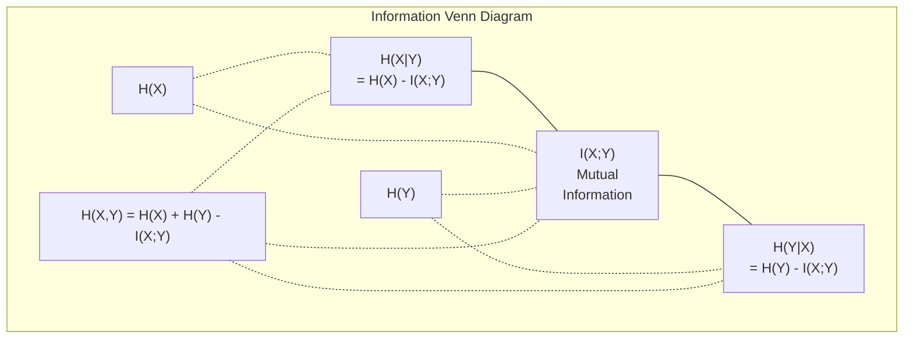

# Teoria da informação

> Teoria da informação  mede surpresa―perda de funções  estabelecer sobre ele―

**Type:** Learn
**Language:**Python
**Prerequisites:** Phase 1, Lesson 06 (Probability)
**Time:** ~60 分钟

## Objectivo de aprendizagem

- Desde zero computando entropia, entropia cruzada e divergência KL,并 explicar a relação entre eles
- 推导为什么最小化交叉热损等价格最大化日志概率
- 计算 características e informações mútuas entre o alvo, para classificação de importância das características
- 将 perplexity 解释为语言模型 从中选择的有效词汇规模

## 问题

Todos os modelos de classificação que você está treinando serão usados .`CrossEntropyLoss()` Você vê perplexidade em cada modelo de linguagem  Você vê perplexidade  Você vê divergência KL em VAEs、distilação 和 RLHF♦ Estes conceitos não são separados entre si♦ São todos os mesmos pensamentos sobre diferentes roupas♦

Teoria da informação para você forneceu uma raciocínio sobre a incerteza, a compressão e a previsão.

Esta aula irá construir cada fórmula a partir de zero, deixe-o ver de onde elas vêm e por que são eficazes.

## 概念

### 信息量(Surpresa)

Quando algo que não é muito possível acontecer, ele traz mais informações.

概率为 p 的事件的信息量是:

```
I(x) = -log(p(x))
```

Utilize em 2 por baixo de logs  obtém bits. Utilize natural logs  obtém nats.

```
Event              Probability    Surprise (bits)
Fair coin heads    0.5            1.0
Rolling a 6        0.167          2.58
1-in-1000 event    0.001          9.97
Certain event      1.0            0.0
```

O que é que se passa?

### Entropia (average surprise)

A entropia é uma distribuição de todas as expectativas surpreendentes dos resultados possíveis.

```
H(P) = -sum( p(x) * log(p(x)) )  for all x
```

公平硬币对二进制变量 具有最大エントロピー:1 bit──偏置硬币(99% 正面) 具有低エントロピー:0.08 bits──你已经知道会发生什么,因此每次抛几乎不会告诉你任何信息──

```
Fair coin:    H = -(0.5 * log2(0.5) + 0.5 * log2(0.5)) = 1.0 bit
Biased coin:  H = -(0.99 * log2(0.99) + 0.01 * log2(0.01)) = 0.08 bits
```

Entropia mede uma distribuição de incerteza inconstitucional. Não se pode comprimir para baixo dela.

### Cross-Entropy (你每日使用的 Loss Function)

Entropia cruzada  medida quando você usa a distribuição Q 来编码实际来自分布 P 的事件时,平均惊喜是多少──

```
H(P, Q) = -sum( p(x) * log(q(x)) )  for all x
```

P é a distribuição verdadeira (etiquetas) Q é a previsão do seu modelo. Se Q e P se combinarem completamente, a entropia cruzada e assim por diante, qualquer que não se combinem fará com que a entropia se torne grande.

Na classificação, P é um vetor de uma classe verdadeira, a probabilidade é de 1, outras são de 0.

```
H(P, Q) = -log(q(true_class))
```

É o que significa que a classe de perda de entropia cruzada é perfeita.

### KL Divergência (distribuições  distância entre distâncias)

A divergência KL  mede o uso de Q e não o P                                                                                                                                                                                                                                                        

```
D_KL(P || Q) = sum( p(x) * log(p(x) / q(x)) )  for all x
             = H(P, Q) - H(P)
```

A entropia cruzada é a entropia mais a divergência KL. Em virtude da verdadeira distribuição da entropia durante o treinamento é constante, a entropia cruzada minimizada é igual à divergência KL.

A divergência KL não é uma métrica de distância real.

### Informações mútuas

Informação mútua  medir saber uma variável 能告诉你另一个变量 多少信息──

```
I(X; Y) = H(X) - H(X|Y)
        = H(X) + H(Y) - H(X, Y)
```

Se X e Y são independentes, a informação mútua é para zero. Se um deles não lhe diz qualquer informação do outro, se eles são completamente relacionados, a informação mútua é como a entropia de uma variável.

Na seleção de recursos, a informação mútua entre recurso e alvo  高, significa que o recurso tem uso.

### Entropia condicional

H(Y X) 衡观察到 X 后, sobre Y ainda resta muita incerteza

```
H(Y|X) = H(X,Y) - H(X)
```

两个极端:
- Se X  totalmente decidir Y, então H  Y X                                                                                                                                                                                                                                                         
- Se X em relação a Y  não houver qualquer informação, então H     Y    X) = H                                                                                                                                                                                                                                                                                                                                                                                                                                                                                                   

Entropia condicional 始终非负,并且永远不超过 H(Y):

```
0 <= H(Y|X) <= H(Y)
```

Em Machine Learning, entropia condicional aparece em árvores de decisão. Em cada divisão, o algoritmo irá selecionar H(Y=X) a menor característica X, ou seja, a maior incerteza sobre o rótulo Y.

### Entropia conjunta

H(X,Y) é a entropia da distribuição conjunta de X 和 Y 一起的.

```
H(X,Y) = -sum sum p(x,y) * log(p(x,y))   for all x, y
```

关键性质:

```
H(X,Y) <= H(X) + H(Y)
```

Quando X e Y 独立时等号成立──若它们共享信息, joint entropy 就小于各自的 entropy 之和──这个缺失的 entropy 正是相互信息──



Estas relações:
- H(X,Y) = H(X) + H(Y que seja X) = H(Y) + H(X que seja)
- O valor de um valor de um valor de um valor de um valor de um valor de um valor de um valor de um valor de um valor de um valor de um valor de um valor de um valor de um valor de um valor de um valor de um valor de um valor de um valor de um valor de um valor de um valor de um valor de um valor de um valor de um valor de um valor de um valor de um valor de um valor de um valor de um valor de um valor de um valor de um valor de um valor de um valor de um valor de um valor de um valor de um valor de um valor de um valor de um valor de um valor de um valor de um valor de um valor de um valor de um valor de um valor de um valor de um valor de um valor de um valor de um valor de um valor de um valor de um valor de um valor de um valor de um valor de um valor de um valor de um valor de um valor de um valor de um valor de um valor de um valor de um valor de um valor de um valor de um valor de um valor de um valor de um valor de um valor de um valor de um valor de um valor de um valor de um valor de um valor de um valor de um valor de um valor de um valor de um valor de um valor de um valor de um valor de um valor de um valor de um valor de um valor de um valor de um valor de um valor de um valor de um valor de um valor de um valor de um valor de um valor de um valor de um valor de um valor de um valor de um valor de um valor de um valor de um valor de um valor de um valor de um valor de um valor de um valor de um valor de um valor de um valor de um valor de um valor de um valor de um valor de um valor de um valor de um valor de um valor de um valor de um valor de um valor de um valor de um valor de um valor de um valor de um valor de um valor de valor de valor de valor de um valor de valor de um valor de valor de valor de valor de um valor de valor de um valor de valor de valor de valor de valor de valor de valor de valor de valor de valor de valor de valor de valor de valor de valor de valor de valor de valor de valor de valor de valor de valor de valor de valor de valor de valor de valor de valor de valor de valor de valor de valor de valor de valor
- H(X,Y) = H(X) + H(Y) - I(X;Y)

### Informações mútuas (Depth Dive)

Informações mútuas I  X; Y) 量化知道一个变量会减少关于另一个变量的多少不确定性──

```
I(X;Y) = H(X) - H(X|Y)
       = H(Y) - H(Y|X)
       = H(X) + H(Y) - H(X,Y)
       = sum sum p(x,y) * log(p(x,y) / (p(x) * p(y)))
```

Sexualidade:
- Eu... sempre tive a certeza de que observar alguma coisa nunca te deixará perder informação.
- Quando e apenas quando X 和 Y 独立时,I(X;Y) = 0。
- I(X;Y) = I(Y;X)。 é um homologamento, diferente da divergência KL。
- I(X;X) = H(X)。 Uma variável Compartilhar toda a informação consigo mesmo。

**用于 feature selection 的 mutual information。**No ML, você deseja recursos para o alvo tem quantidade de informação. Informação mútua para você fornecer uma maneira de princípio para classificar recursos:

1. Para cada característica X_i, calcular I(X_i; Y), entre elas Y é a variável-alvo.
2. 按MI pontuação 排序 características。
3. Mantém-nos em boas condições.

Esta aplica-se a qualquer relação entre característica e alvo: linear, não linear, monótono ou outra relação.

| Method | Detects | Computational cost | Handles categorical? |
|--------|---------|-------------------|---------------------|
| Pearson correlation | Linear relationships | O(n) | No |
| Spearman correlation | Monotonic relationships | O(n log n) | No |
| Mutual information | 任意 statistical dependency | O(n log n) with binning | Yes |

### Limeamento de etiqueta e entropia cruzada

标准分类 使用硬目标:[0, 0, 1, 0]──true class 的概率为 1,其他全部为 0──Littering Label 会用软目标 替换它们:

```
soft_target = (1 - epsilon) * hard_target + epsilon / num_classes
```

Quando epsilon = 0,1 且有4 个类 时:
- Alvo duro: [0, 0, 1, 0]
- Alvo suave: [0,025, 0,025, 0,925, 0,025]

Desde Teoria da Informação 视角看, etiqueta suavizando  aumentou a entropia da distribuição de alvos.

Por que é que isso ajuda ?
- 防止模型 将 logits 推向极端值 ((在交叉内,要完美匹配一热目标 需要无限大的 logits)
- Como regularização: modelo não pode ter 100% de confiança
-  melhoria da calibração: pré测概率更好地 reflectir a incerteza real
-                                                                                                                                                                                                                                                                                                                                                                                                                                                                                                                              

Utilize etiqueta suavizante 变为:

```
L = (1 - epsilon) * CE(hard_target, prediction) + epsilon * H_uniform(prediction)
```

Segundo, a previsão de distância ao uniforme é a regularização direta da confiança.

### Por que a entropia cruzada é o núcleo da perda de classificação

Três perspectivas, com um final.

**Information Theory 视角。**A entropia cruzada mede a distribuição do seu modelo, e não a distribuição real. Gastava muitos bits quando o usou. Minimizando-o, o seu modelo se tornou um codificador de maior efeito da realidade.

**Maximum likelihood 视角。**对于 N 个 true classes 为 y_i 的训练样本:

```
Likelihood     = product( q(y_i) )
Log-likelihood = sum( log(q(y_i)) )
Negative log-likelihood = -sum( log(q(y_i)) )
```

Última linha é perda de entropia cruzada. Minimizar a entropia cruzada.

**Gradient 视角。**A entropia cruzada  Sobre as logitas  简单地是(previsto - verdadeiro) ⋅干净、稳定、计算快速── é a razão pela qual ela é perfeitamente combinada com softmax ⋅

### Bits vs Nats

A única diferença é o número de logos.

```
log base 2   -> bits      (information theory tradition)
log base e   -> nats      (machine learning convention)
log base 10  -> hartleys  (rarely used)
```

1 nat = 1/ln(2) bits = 1,4427 bits。PyTorch 和 TensorFlow 默认使用自然 log(nats)。

### Perplexidade

Perplexidade é um indicador de entropia cruzada. Diz-lhe que o modelo é incerto.

```
Perplexity = 2^H(P,Q)   (if using bits)
Perplexity = e^H(P,Q)   (if using nats)
```

Perplexidade para o modelo de linguagem de 50, em média, parece que deve ser escolhido entre os 50 tokens seguintes.

GPT-2 alcança cerca de 30 de perplexidade em padrões de referência comuns.


```figure
entropy-kl
```

## Construí-lo

### 第 1 步: Conteúdo de informação

```python
import math

def information_content(p, base=2):
    if p <= 0 or p > 1:
        return float('inf') if p <= 0 else 0.0
    return -math.log(p) / math.log(base)

def entropy(probs, base=2):
    return sum(
        p * information_content(p, base)
        for p in probs if p > 0
    )

fair_coin = [0.5, 0.5]
biased_coin = [0.99, 0.01]
fair_die = [1/6] * 6

print(f"Fair coin entropy:   {entropy(fair_coin):.4f} bits")
print(f"Biased coin entropy: {entropy(biased_coin):.4f} bits")
print(f"Fair die entropy:    {entropy(fair_die):.4f} bits")
```

### 步骤 2: Entropia cruzada e divergência KL

```python
def cross_entropy(p, q, base=2):
    total = 0.0
    for pi, qi in zip(p, q):
        if pi > 0:
            if qi <= 0:
                return float('inf')
            total += pi * (-math.log(qi) / math.log(base))
    return total

def kl_divergence(p, q, base=2):
    return cross_entropy(p, q, base) - entropy(p, base)

true_dist = [0.7, 0.2, 0.1]
good_model = [0.6, 0.25, 0.15]
bad_model = [0.1, 0.1, 0.8]

print(f"Entropy of true dist:     {entropy(true_dist):.4f} bits")
print(f"CE (good model):          {cross_entropy(true_dist, good_model):.4f} bits")
print(f"CE (bad model):           {cross_entropy(true_dist, bad_model):.4f} bits")
print(f"KL divergence (good):     {kl_divergence(true_dist, good_model):.4f} bits")
print(f"KL divergence (bad):      {kl_divergence(true_dist, bad_model):.4f} bits")
```

### 步骤 3: Entropia cruzada como perda de classificação

```python
def softmax(logits):
    max_logit = max(logits)
    exps = [math.exp(z - max_logit) for z in logits]
    total = sum(exps)
    return [e / total for e in exps]

def cross_entropy_loss(true_class, logits):
    probs = softmax(logits)
    return -math.log(probs[true_class])

logits = [2.0, 1.0, 0.1]
true_class = 0

probs = softmax(logits)
loss = cross_entropy_loss(true_class, logits)

print(f"Logits:      {logits}")
print(f"Softmax:     {[f'{p:.4f}' for p in probs]}")
print(f"True class:  {true_class}")
print(f"Loss:        {loss:.4f} nats")
print(f"Perplexity:  {math.exp(loss):.2f}")
```

### 步骤 4: Entropia cruzada é igual a probabilidade de log negativo

```python
import random

random.seed(42)

n_samples = 1000
n_classes = 3
true_labels = [random.randint(0, n_classes - 1) for _ in range(n_samples)]
model_logits = [[random.gauss(0, 1) for _ in range(n_classes)] for _ in range(n_samples)]

ce_loss = sum(
    cross_entropy_loss(label, logits)
    for label, logits in zip(true_labels, model_logits)
) / n_samples

nll = -sum(
    math.log(softmax(logits)[label])
    for label, logits in zip(true_labels, model_logits)
) / n_samples

print(f"Cross-entropy loss:      {ce_loss:.6f}")
print(f"Negative log-likelihood: {nll:.6f}")
print(f"Difference:              {abs(ce_loss - nll):.2e}")
```

### 步骤 5: Informação mútua

```python
def mutual_information(joint_probs, base=2):
    rows = len(joint_probs)
    cols = len(joint_probs[0])

    margin_x = [sum(joint_probs[i][j] for j in range(cols)) for i in range(rows)]
    margin_y = [sum(joint_probs[i][j] for i in range(rows)) for j in range(cols)]

    mi = 0.0
    for i in range(rows):
        for j in range(cols):
            pxy = joint_probs[i][j]
            if pxy > 0:
                mi += pxy * math.log(pxy / (margin_x[i] * margin_y[j])) / math.log(base)
    return mi

independent = [[0.25, 0.25], [0.25, 0.25]]
dependent = [[0.45, 0.05], [0.05, 0.45]]

print(f"MI (independent): {mutual_information(independent):.4f} bits")
print(f"MI (dependent):   {mutual_information(dependent):.4f} bits")
```

## Use-o

Usar NumPy para expressar o mesmo conceito, é o que você usa na prática:

```python
import numpy as np

def np_entropy(p):
    p = np.asarray(p, dtype=float)
    mask = p > 0
    result = np.zeros_like(p)
    result[mask] = p[mask] * np.log(p[mask])
    return -result.sum()

def np_cross_entropy(p, q):
    p, q = np.asarray(p, dtype=float), np.asarray(q, dtype=float)
    mask = p > 0
    return -(p[mask] * np.log(q[mask])).sum()

def np_kl_divergence(p, q):
    return np_cross_entropy(p, q) - np_entropy(p)

true = np.array([0.7, 0.2, 0.1])
pred = np.array([0.6, 0.25, 0.15])
print(f"Entropy:    {np_entropy(true):.4f} nats")
print(f"Cross-ent:  {np_cross_entropy(true, pred):.4f} nats")
print(f"KL div:     {np_kl_divergence(true, pred):.4f} nats")
```

Construíste-o a partir do zero.`torch.nn.CrossEntropyLoss()`◯ O que fazemos internamente── agora sabes por que a perda vai diminuir durante o processo de treinamento: a distribuição prevista do teu modelo está chegando à distribuição verdadeira, usando as nas de informação de perda para medir──

## 练习

1. 假设英文字母表服服从统一分布 ((26 个字母), calcular sua entropia。 então usar a frequência real da letra para estimar-la── qual é mais alta, porquê?

2. 某模型对真级为 1 的样本 输出 logits [5.0, 2.0, 0.5]──手算交叉输入损失,然后用你的 `cross_entropy_loss`Função 验证── que tipo de logits vai dar zero perdas?

3. Prova de divergência KL 不是对称的──select two distribuções P 和 Q, D_KL(P 計算 Q) 和 D_K 計算 Q) 和 D_L(Q  P)──explicar por que elas são diferentes──

4. 构建一个函数,为一段代码预测 序列计算困难──给定一个由 (true_token_index, predicted_logits) pares 组成的列表,返回该序列的困难──

## 关键术语

| Term | What people say | What it actually means |
|------|----------------|----------------------|
| Information content | “Surprise” | 编码一个事件所需的 bits（或 nats）数量：-log(p) |
| Entropy | “Randomness” | 一个 distribution 中所有 outcomes 的平均 surprise。衡量不可约 uncertainty。 |
| Cross-entropy | “The loss function” | 使用 model distribution Q 编码来自 true distribution P 的事件时的平均 surprise。 |
| KL divergence | “Distance between distributions” | 使用 Q 而不是 P 所浪费的额外 bits。等于 cross-entropy 减 entropy。不是对称的。 |
| Mutual information | “How related are X and Y” | 知道 Y 后，关于 X 的 uncertainty 减少量。为零表示独立。 |
| Softmax | “Turn logits into probabilities” | 取指数并归一化。将任意 real-valued vector 映射为有效 probability distribution。 |
| Perplexity | “How confused the model is” | Cross-entropy 的指数。model 在每一步从中选择的有效 vocabulary size。 |
| Bits | “Shannon's unit” | 使用以 2 为底的 log 衡量的信息。一个 bit 解决一次公平抛硬币。 |
| Nats | “ML's unit” | 使用 natural log 衡量的信息。PyTorch 和 TensorFlow 默认使用。 |
| Negative log-likelihood | “NLL loss” | 对 one-hot labels 来说，与 cross-entropy loss 完全相同。最小化它会最大化正确 predictions 的概率。 |

## 延伸阅读

- [Shannon 1948: A Mathematical Theory of Communication](https://people.math.harvard.edu/~ctm/home/text/others/shannon/entropy/entropy.pdf)- Origins, até hoje ainda fáceis de ler
- [Visual Information Theory (Chris Olah)](https://colah.github.io/posts/2015-09-Visual-Information/)- A melhor explicação visível para a entropia e a divergência KL
- [PyTorch CrossEntropyLoss docs](https://pytorch.org/docs/stable/generated/torch.nn.CrossEntropyLoss.html)- framework  como implementar o conteúdo que você está construindo
