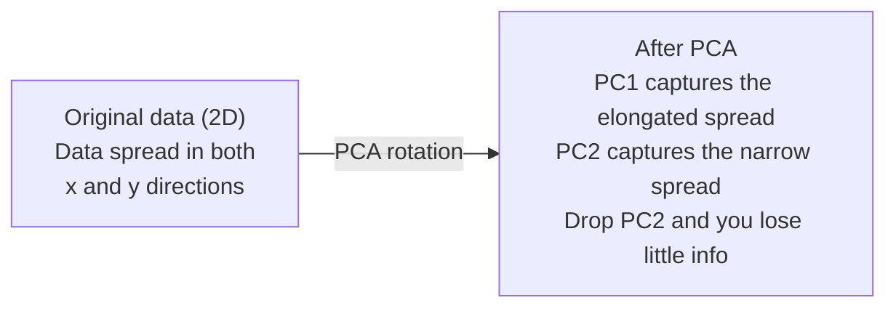

# Reduzir a dimensão

> Alta dimensão de dados tem estrutura.

**Type:** Build
**Language:**Python
**Prerequisites:** Phase 1, Lessons 01（Linear Algebra Intuition）、02（Vectors, Matrices & Operations）、03（Eigenvalues & Eigenvectors）、06（Probability & Distributions）
**Time:** ~90 分钟

## Objetivos de aprendizagem

- Desde zero a realização do PCA: datacenter, calcular matriz de covariância, compor e executar projetos
- Utilizando a razão de variação explicada 和 elbow método  escolher componentes principais
- Comparar PCA ̊t-SNE e UMAP em 2D visualização de resultados de números MNIST, e explicar o peso deles
- Utilize带 RBF kernel                                                                                                                                                                                                                                                                                                                                                                                                                                                                                                                      

## O problema

Você tem um cada um de amostras contendo 784 características de conjunto de dados. Talvez seja um número escrito à mão de valores de pixels. Talvez seja um nível de expressão genética. Talvez seja um comportamento do usuário. Você não pode visualizar 784 dimensões. Você não pode desenhar. Você nem pode pensar neles.

Mas a maioria destas 784 características é redundante. A informação real existe em uma superfície muito pequena. A "7" escrita por uma mão não precisa de 784 números independentes para descrever.

A redução de dimensão encontrará uma superfície menor. Ele reduz os dados 784 dimensionalmente a 2 10 ou 50 dimensões, mantendo a estrutura importante.

## O conceito

### A maldição da dimensionalidade

O espaço não está em conformidade com a percepção. Com o aumento da dimensão, há três coisas que falham.

**距离变得没有意义。**Em alta altura, a distância entre dois pontos arbitrários recebe o mesmo valor. Se cada ponto de distância entre cada outro ponto for diferente, a busca pelo vizinho mais próximo falhará.

```
Dimension    Avg distance ratio (max/min between random points)
2            ~5.0
10           ~1.8
100          ~1.2
1000         ~1.02
```

**体积集中在角落。**D 维 Unit Hypercube Há 2 个角. Em 100 维中, quase todos os volumúdos estão em um canto, longe do centro.

**你需要指数级更多的数据。**Para manter a mesma densidade de amostra em um espaço, de 2D a 20D significa que você precisa de 10 a 18 vezes mais dados. Você nunca terá dados suficientes.

### PCA: encontrar as direções que importam

A Análise de Componentes Principais (PCA) encontrará os maiores níveis de variação de dados.

- Não .

```
1. Center the data        (subtract the mean from each feature)
2. Compute covariance     (how features move together)
3. Eigendecomposition     (find the principal directions)
4. Sort by eigenvalue     (biggest variance first)
5. Project               (keep top k eigenvectors, drop the rest)
```

Por que usar a sua própria composição? A matriz de covariância é simétrica e semi-definida. Os seus próprios vetores são direções ortogonais no espaço de características. Os valores de eigen dizem-lhe em cada direção quanto variação capturado.



- **Before PCA:**Nuvem de dados  along x 和 y 两个轴呈对角线扩散
- **After PCA:**坐标系 são girados, fazendo PC1 em direção à variância máxima de z z z z z z z z z z z z z z z z z z z z z z z z z z z z z z z z z z z z z z z z z z z z z z z z z z z z z z z z z z z z z z z z z z z z z z z z z z z z z z z z z z z z z z z z z z z z z z z z z z z z z z z z z z z z z z z z z z z z z z z z z z z z z z z z z z z z z z z z z z z z z z z z z z z z z z z z z z z z z z z z z z z z z z z z z z z z z z z z z z z z z z z z z z z z z z z z z z z z z z z z z z z z z z z z z z z z z z z z z z z z z z z z z z z z z z z z z z z z z z z z z z z z z z z z z z z z z z z z z z z z z z z z z z z z z z z z z z z z z z z z z z z z z z z z z z z z z z z z z z z z z z z z z z z z z z z z z z z z z z z z z z z z z z z z z z z z z z z z z z z z z z z z z z z z z z z z z z z z z z z z z z z z z z z z z z z z z z z z z z z z z z z z z z z z z z z z z z z z z z z z z z z z z z z z z z z z z z z z z z z z z z z z z z z z z z z z z z z z z z z z z z z z z z z z z z z z z z z z z z z z z z z z z z z z z z z z z z z z z z z z z z z z z z z z z z
- **Dimensionality reduction:**Deixe o PC2 e coloque os dados no PC1, perdendo apenas pouca informação.

### Relação de variância explicada

Cada componente principal capta uma parte da variância total.

```
Component    Eigenvalue    Explained ratio    Cumulative
PC1          4.73          0.473              0.473
PC2          2.51          0.251              0.724
PC3          1.12          0.112              0.836
PC4          0.89          0.089              0.925
...
```

Quando a variância explicada cumulativa  atingir 0,95 时, você já sabe que esses componentes  capturaram 95% da informação                                                                                                                                                                                                                                                 

### Escolha do número de componentes

Três estratégias:

1. **Threshold.**Manter componentes suficientes para explicar a variação de 90-95%.
2. **Elbow method.** desenhar variação explicada de cada componente procurar pontos de rápida descida­ncia­ncia­ncia­ncia­ncia­ncia­ncia­ncia­ncia­ncia­ncia­ncia­ncia­ncia­ncia­ncia­ncia­ncia­ncia­ncia­cia­ncia­ncia­cia­ncia­cia­ncia­cia­na­cia­ncia­cia­ncia­cia­na­cia­na­cia­ncia­cia­na­cia­na­cia­na­cia­na­cia­na­cia­na­na­cia­na­na­cia­na­na­cia­na­na­cia­na­na­cia­na­na­cia­na­na­cia­na­na­cia­na­na­cia­na­na­cia­na­na­na­cia­na­na­na­na­cia­na­na­na­na­na­na­na­na­cia­na­na­na­na­na­na­na­na­na­na­na­na­na­na­na­na­na­na­na­na­na­na­na­na­na­na­na­na­na­na­na­na­na­na­na­na­na­na­na­na­na­na­na­na­na­na­na­na­na­na­na­na­na­na­na­na­na­na­na­na­na­na­na­na­na­na­na­na­na­na­na­na­na­na­na­na­na­na­na­na­na­na­na­na­na­na­na­na­na­na­na­na­na­na­na­na­na­na­na­na­na­na­na­na­na­na­na­na­na­na­na­na­na­na­na­na­na­na­na­na­na­na­na­na­na­na­na­na­na­na­na­na­na­na
3. **Downstream performance.**A melhor forma de obter a precisão do modelo de medição é a precisão de um modelo de processamento prévio.

### T-SNE: preservar os bairros

t-Distribuído Stochastic Neighbor Embedding (t-SNE) é para visualização designado.

直觉是: em espaço primitivo, com base na distância entre pontos calcula uma distribuição de probabilidade──近点得到高概率──远点得到低概率──然后找到一个2D排布,使相同的概率分布成立──在784维中是邻居的点,在2D中仍然保持为邻居──

Os principais elementos do t-SNE:
- Não linear. Pode desenvolver complexos variáveis de PCA que não podem ser tratados.
- Estocástica. Diferentes operações produzem diferentes layouts.
- Perplexidade 参数控制考虑多少邻居 (conclusão)
- 输出中 clusters 距离无意义――只有 clusters 本身有意义――
- Em grandes conjuntos de dados 上很慢──默认是O(n^2)──

### UMAP: estrutura global mais rápida e melhor

O método de trabalho da aproximação e projeção uniformes (UMAP) é semelhante ao t-SNE, mas tem duas vantagens:
- 更快── utilizou gráficos próximos aproximados, em vez de calcular todas as distâncias em pares──
- Melhor estrutura global, mais significante do que o t-SNE.

UMAP construiu um gráfico ponderado em um espaço elevado, então procurou um layout de nível baixo, e conservou o gráfico o máximo possível.

关键参数:
- `n_neighbors`O valor de um vizinho é o valor de um vizinho.
- `min_dist`Output: pontos de concentração mais estreitos. Valores menores geram aglomerados mais densos.

### Quando utilizar qual

| Method | Use case | Preserves | Speed |
|--------|----------|-----------|-------|
| PCA | Preprocessing before training | Global variance | Fast (exact), works on millions of samples |
| PCA | Quick exploratory visualization | Linear structure | Fast |
| t-SNE | Publication-quality 2D plots | Local neighborhoods | Slow (< 10k samples ideal) |
| UMAP | 2D visualization at scale | Local + some global structure | Medium (handles millions) |
| PCA | Feature reduction for models | Variance-ranked features | Fast |
| t-SNE / UMAP | Understanding cluster structure | Cluster separation | Medium to slow |

經驗法则: Usar PCA para fazer pré-processamento e compressão de dados. Quando você precisar de uma estrutura de 2D, use t-SNE ou UMAP.

### PCA do núcleo

標準PCA encontrará subespaços lineares── ele gira seu坐标系并丢轴── mas se os dados estiverem em múltiplas não lineares 上怎么办?

O kernel PCA é um espaço de características de alta dimensão induzido pela função do kernel.

- Não .
1. 计算 kernel matrix K, em que K_ij = k(x_i, x_j)
2. Em espaço de recursos em meio à matriz do kernel central
3. Para matrizes de kernel centradas fazer sua própria composição
4. 顶部 eigenvectors(按1/sqrt(eigenvalue) 缩放) é projeções

Funções de núcleo 常见:

| Kernel | Formula | Good for |
|--------|---------|----------|
| RBF (Gaussian) | exp(-gamma * \|\|x - y\|\|^2) | 大多数 nonlinear data、smooth manifolds |
| Polynomial | (x . y + c)^d | Polynomial relationships |
| Sigmoid | tanh(alpha * x . y + c) | Neural network-like mappings |

Qual é o uso de PCA do kernel e não de PCA padrão:

| Criterion | Standard PCA | Kernel PCA |
|-----------|-------------|------------|
| Data structure | Linear subspace | Nonlinear manifold |
| Speed | O(min(n^2 d, d^2 n)) | O(n^2 d + n^3) |
| Interpretability | Components are linear combinations of features | Components lack direct feature interpretation |
| Scalability | Works on millions of samples | Kernel matrix is n x n, memory-limited |
| Reconstruction | Direct inverse transform | Requires pre-image approximation |

经典例:2D: círculos concêntricos em meio dos círculos. Dos círculos, um círculo dentro de outro círculo.

### Erro de Reconstrução

A redução de dimensão é boa, você comprimiu 784 para 50 dimensões.

测量 erro de reconstrução:
1. 将数据投影到 k 维: X_reduced = X @ W_k
2. 重建: X_hat = X_reduzido @ W_k^T
3. 计算 MSE:médio((X - X_hat) ^2)

 Para PCA, erro de reconstrução e variação explicada 

```
Reconstruction error = sum of eigenvalues NOT included
Total variance = sum of ALL eigenvalues
Fraction lost = (sum of dropped eigenvalues) / (sum of all eigenvalues)
```

Cada componente de proporção de variância explicada é:

```
explained_ratio_k = eigenvalue_k / sum(all eigenvalues)
```

Colocar a variância explicada acumulativa para os componentes, obtém a curva "elbow" e os componentes são:
- 曲线变平的位置 (→ R$)
- Variância acumulada  transcende o seu limiar de posição( geralmente é 0,90 ou 0,95)
- Performance de tarefas em curso 进入平台期的位置

Erro de reconstrução não é apenas para escolher. Você pode usá-lo para detectar anomalias: Erro de reconstrução Highsamples são outliers, eles não correspondem ao subspaço aprendido.


```figure
pca-axes
```

## Construí-lo

### Passo 1: PCA a partir do zero

```python
import numpy as np

class PCA:
    def __init__(self, n_components):
        self.n_components = n_components
        self.components = None
        self.mean = None
        self.eigenvalues = None
        self.explained_variance_ratio_ = None

    def fit(self, X):
        self.mean = np.mean(X, axis=0)
        X_centered = X - self.mean

        cov_matrix = np.cov(X_centered, rowvar=False)

        eigenvalues, eigenvectors = np.linalg.eigh(cov_matrix)

        sorted_idx = np.argsort(eigenvalues)[::-1]
        eigenvalues = eigenvalues[sorted_idx]
        eigenvectors = eigenvectors[:, sorted_idx]

        self.components = eigenvectors[:, :self.n_components].T
        self.eigenvalues = eigenvalues[:self.n_components]
        total_var = np.sum(eigenvalues)
        self.explained_variance_ratio_ = self.eigenvalues / total_var

        return self

    def transform(self, X):
        X_centered = X - self.mean
        return X_centered @ self.components.T

    def fit_transform(self, X):
        self.fit(X)
        return self.transform(X)
```

### Passo 2: Teste em dados sintéticos

```python
np.random.seed(42)
n_samples = 500

t = np.random.uniform(0, 2 * np.pi, n_samples)
x1 = 3 * np.cos(t) + np.random.normal(0, 0.2, n_samples)
x2 = 3 * np.sin(t) + np.random.normal(0, 0.2, n_samples)
x3 = 0.5 * x1 + 0.3 * x2 + np.random.normal(0, 0.1, n_samples)

X_synthetic = np.column_stack([x1, x2, x3])

pca = PCA(n_components=2)
X_reduced = pca.fit_transform(X_synthetic)

print(f"Original shape: {X_synthetic.shape}")
print(f"Reduced shape:  {X_reduced.shape}")
print(f"Explained variance ratios: {pca.explained_variance_ratio_}")
print(f"Total variance captured: {sum(pca.explained_variance_ratio_):.4f}")
```

### Passo 3: Números MNIST em 2D

```python
from sklearn.datasets import fetch_openml

mnist = fetch_openml("mnist_784", version=1, as_frame=False, parser="auto")
X_mnist = mnist.data[:5000].astype(float)
y_mnist = mnist.target[:5000].astype(int)

pca_mnist = PCA(n_components=50)
X_pca50 = pca_mnist.fit_transform(X_mnist)
print(f"50 components capture {sum(pca_mnist.explained_variance_ratio_):.2%} of variance")

pca_2d = PCA(n_components=2)
X_pca2d = pca_2d.fit_transform(X_mnist)
print(f"2 components capture {sum(pca_2d.explained_variance_ratio_):.2%} of variance")
```

### Passo 4: Compare com sklearn

```python
from sklearn.decomposition import PCA as SklearnPCA
from sklearn.manifold import TSNE

sklearn_pca = SklearnPCA(n_components=2)
X_sklearn_pca = sklearn_pca.fit_transform(X_mnist)

print(f"\nOur PCA explained variance:     {pca_2d.explained_variance_ratio_}")
print(f"Sklearn PCA explained variance: {sklearn_pca.explained_variance_ratio_}")

diff = np.abs(np.abs(X_pca2d) - np.abs(X_sklearn_pca))
print(f"Max absolute difference: {diff.max():.10f}")

tsne = TSNE(n_components=2, perplexity=30, random_state=42)
X_tsne = tsne.fit_transform(X_mnist)
print(f"\nt-SNE output shape: {X_tsne.shape}")
```

### Passo 5: Comparação UMAP

```python
try:
    from umap import UMAP

    reducer = UMAP(n_components=2, n_neighbors=15, min_dist=0.1, random_state=42)
    X_umap = reducer.fit_transform(X_mnist)
    print(f"UMAP output shape: {X_umap.shape}")
except ImportError:
    print("Install umap-learn: pip install umap-learn")
```

## Usá-lo

Colocar PCA Usage classifier  anterior pré-processamento:

```python
from sklearn.decomposition import PCA as SklearnPCA
from sklearn.linear_model import LogisticRegression
from sklearn.model_selection import train_test_split
from sklearn.metrics import accuracy_score

X_train, X_test, y_train, y_test = train_test_split(
    X_mnist, y_mnist, test_size=0.2, random_state=42
)

results = {}
for k in [10, 30, 50, 100, 200]:
    pca_k = SklearnPCA(n_components=k)
    X_tr = pca_k.fit_transform(X_train)
    X_te = pca_k.transform(X_test)

    clf = LogisticRegression(max_iter=1000, random_state=42)
    clf.fit(X_tr, y_train)
    acc = accuracy_score(y_test, clf.predict(X_te))
    var_captured = sum(pca_k.explained_variance_ratio_)
    results[k] = (acc, var_captured)
    print(f"k={k:>3d}  accuracy={acc:.4f}  variance={var_captured:.4f}")
```

O desempenho vai ser muito menor do que 784 horas para entrar na plataforma.

## Envia-o

本课会产出:
- `outputs/skill-dimensionality-reduction.md`- uma habilidade técnica para escolher tarefas específicas

## Exercícios

1. 修改 PCA class 以支持 `inverse_transform`△ Usar 10、50 和 200 个组件 重建 MNIST dígitos──分别打印重建错误(相对于原始数据的平均平方差) △

2. No mesmo subconjunto MNIST 上运行 t-SNE,perplexity 值分别为 5、30 和 100─descrição de como a saída muda―Por que a perplexidade afetará a tensão do cluster?

3. Tem um com 50 características , mas apenas 5 características informativas de conjunto de dados `sklearn.datasets.make_classification`生成) ・ aplicada PCA,并检查 explicou curva de variação

## Termos-chave

| Term | What people say | What it actually means |
|------|----------------|----------------------|
| Curse of dimensionality | "Too many features" | 随着维度增长，距离、体积和数据密度都会表现得反直觉。Models 需要指数级更多的数据来补偿。 |
| PCA | "Reduce dimensions" | 旋转你的坐标系，使各轴与 maximum variance 的方向对齐，然后丢弃 low-variance axes。 |
| Principal component | "An important direction" | Covariance matrix 的一个 eigenvector。Feature space 中数据变化最大的方向。 |
| Explained variance ratio | "How much info this component has" | 一个 principal component 捕获的 total variance 比例。对前 k 个 ratios 求和，就能看到 k 个 components 保留了多少信息。 |
| Covariance matrix | "How features correlate" | 一个 symmetric matrix，其中 entry (i,j) 衡量 feature i 和 feature j 如何共同变化。Diagonal entries 是各自的 variances。 |
| t-SNE | "That cluster plot" | 一种 nonlinear 方法，通过保留 pairwise neighborhood probabilities 将高维数据映射到 2D。适合可视化，不适合 preprocessing。 |
| UMAP | "Faster t-SNE" | 一种基于 topological data analysis 的 nonlinear 方法。既保留 local structure，也保留部分 global structure。比 t-SNE 更容易扩展。 |
| Perplexity | "A t-SNE knob" | 控制每个点考虑的有效邻居数量。低 perplexity 聚焦非常 local 的结构。高 perplexity 捕获更宽泛的模式。 |
| Manifold | "The surface the data lives on" | Embedding在更高维空间中的低维表面。一张在 3D 中揉皱的纸是一个 2D manifold。 |

## Mais leitura

- [A Tutorial on Principal Component Analysis](https://arxiv.org/abs/1404.1100)(Shlens) - Desde零开始清晰推导 PCA
- [How to Use t-SNE Effectively](https://distill.pub/2016/misread-tsne/)(Wattenberg et al.) -                                                                                                                                                                                                                                                                                                                                                                                                                                                                                                                      
- [UMAP documentation](https://umap-learn.readthedocs.io/)- Orientação em teoria e prática do autor da UMAP
