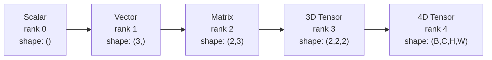
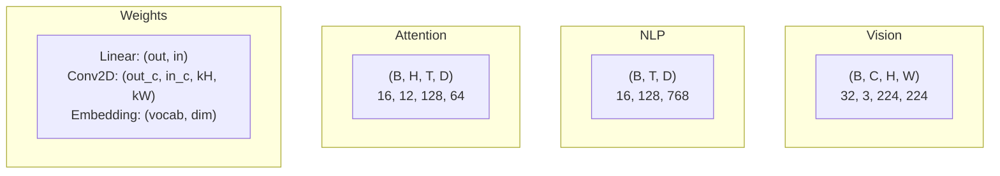
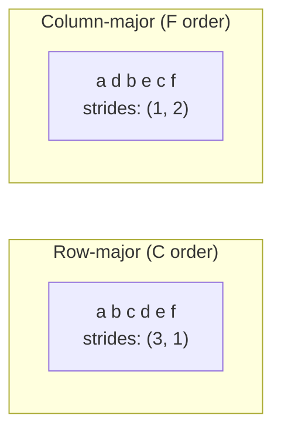
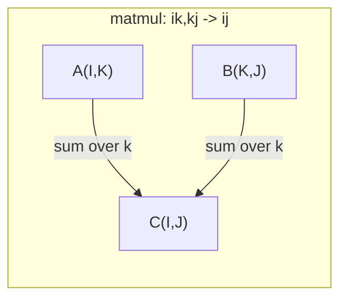

# Operações de tensão

> Tensores são a linguagem comum entre dados e Deep Learning. Cada imagem, cada frase, cada gradiente é movido por eles.

**Type:** Build
**Language:**Python
**前置要求：**Fase 1, Lições 01 (Intuição de álgebra linear),02 (Vectores, Matrizes e Operações)
**Time:** ~90 分钟

## Objectivo de aprendizagem
- Desde zero, a realização de uma classe tensor, apoiar formas, passos, remodelação, transposão e operações de elementos
-  aplicativo de radiodifusão  regras, em caso de não duplicação de dados  realizar o cálculo de tensores de diferentes formas 
- Produtos de pontos, multiplicidades de matrizes, produtos externos e operações em lote
-  Tracking Multi-Head Atenção Cada passo de tensor formas precisas

## 问题
Você construiu um transformador... passagem para a frente... parece muito limpo...`RuntimeError: mat1 and mat2 shapes cannot be multiplied (32x768 and 512x768)`Você está usando essas formas. Você está tentando transpor. Agora é o que eu faço.`Expected 4D input (got 3D input)`- Já tens um pouco de pressão. - Está tudo bem.

Os erros de forma são os mais comuns em código de aprendizagem profunda. Não são difíceis de conceber. Cada operação tem um contrato de forma. Mas eles se superpõe rapidamente. Um transformador pode criar várias transformações, transposões e transmissões.

Matrices  processar duas matérias entre um grupo de coisas.`(32, 3, 224, 224)`❖ Com 12 cabeças de auto-atenção também é 4D:`(batch, heads, seq_len, head_dim)`◊ Você precisa de um tipo que possa se generalizar para qualquer dimensão, uma estrutura de dados numerosa, e suas operações podem estar em todas as dimensões.

## 概念
### O que é um tensor

Tensor é um número de dimensões num número de números de um tipo de dados unificado chamado de tensor.**rank**(ou **order**Cada dimensão é uma.**axis**- Não.**shape**É um tuple, lista de cada eixo.



总元素数 = todos os tamanhos de multiplicidade.`(2, 3, 4)`包含 `2 * 3 * 4 = 24`个元素──

### Forma de tensor no meio do aprendizado profundo

De acordo com o costume, diferentes tipos de dados serão mapeados para formas específicas de tensor.



PyTorch utiliza NCHW(canais-primeiro) ――TensorFlow 默认使用 NHWC(canais-última)。 Não correspondentes layouts 会导致静默变慢或报错。

### Como funciona o layout da memória

Array 2D em 内存 是一段 1D bytes 序列──**Strides**Diz-te em cada eixo, antes de mais, como é que os elementos precisam de ser saltados.



Transpose 不移动数据── é trocar passos, fazer Tensor 变为 **non-contiguous**-- Elementos de uma linha em memória não mais se encontram em conjunto.

### Regras de radiodifusão

A transmissão permite que você, em caso de não-reprodução de dados, faça o cálculo de tensores de diferentes formas. Do lado direito para as formas. Duas dimensões em fase ou em uma das dimensões para 1 时兼容.

```
Tensor A:     (8, 1, 6, 1)
Tensor B:        (7, 1, 5)
Padded B:     (1, 7, 1, 5)
Result:       (8, 7, 6, 5)
```

### Einsum: operação de tensor de uso geral

Einstein soma usando letras marcadas para cada eixo. Aparece na entrada, mas não aparece na saída. Os eixos no meio serão solicitados e serão reservados.



关键模式:`i,i->`(produto ponto)`i,j->ij`(produto externo)`ii->`(traço)`ij->ji`(transposar)`bij,bjk->bik`(batch matmul)`bhtd,bhsd->bhts`(Ponto de atenção)


```figure
tensor-broadcast
```

## Construí-lo
- Não .`code/tensors.py` Cada passo cita-se a realização de cada uma delas

### 步骤 1: Tensor  armazenamento e passos

Tensor  armazenamento de uma lista de números e metadados de forma 平──strides 告诉索引逻辑 如何把多维索引 映射到平位置──

```python
class Tensor:
    def __init__(self, data, shape=None):
        if isinstance(data, (list, tuple)):
            self._data, self._shape = self._flatten_nested(data)
        elif isinstance(data, np.ndarray):
            self._data = data.flatten().tolist()
            self._shape = tuple(data.shape)
        else:
            self._data = [data]
            self._shape = ()

        if shape is not None:
            total = reduce(lambda a, b: a * b, shape, 1)
            if total != len(self._data):
                raise ValueError(
                    f"Cannot reshape {len(self._data)} elements into shape {shape}"
                )
            self._shape = tuple(shape)

        self._strides = self._compute_strides(self._shape)

    @staticmethod
    def _compute_strides(shape):
        if len(shape) == 0:
            return ()
        strides = [1] * len(shape)
        for i in range(len(shape) - 2, -1, -1):
            strides[i] = strides[i + 1] * shape[i + 1]
        return tuple(strides)
```

对于形 `(3, 4)`, passos é `(4, 1)`-- Avançar uma linha saltou 4 elementos, avançar uma linha saltou 1 elemento.

### 步骤 2: Refazer, apertar, desapertar

Redesignação  alteração de forma, mas não alteração de ordem de elementos。`-1`Deixe uma dimensão auto-determinar sua dimensão.

```python
t = Tensor(list(range(12)), shape=(2, 6))
r = t.reshape((3, 4))
r = t.reshape((-1, 3))
```

Squeeze 会移除大小为 1 的轴──Unsqueeze 会插入一个──Unsqueezing for broadcasting 至关重要 -- 一个偏向向向 `(D,)`Adição ao lote`(B, T, D)`- Não. - Não.`(1, 1, D)`- Não.

```python
t = Tensor(list(range(6)), shape=(1, 3, 1, 2))
s = t.squeeze()
v = Tensor([1, 2, 3])
u = v.unsqueeze(0)
```

### 第 3 步:Transpose 和 permute

Transponha  trocar dois eixos。 Permute 重新排序 todos os eixos。 é assim que se transforma entre a NHWC e a NCHW。

```python
mat = Tensor(list(range(6)), shape=(2, 3))
tr = mat.transpose(0, 1)

t4d = Tensor(list(range(24)), shape=(1, 2, 3, 4))
perm = t4d.permute((0, 2, 3, 1))
```

Transposar ou permuta  Depois, o Tensor está em memória não contiguo ∙`view`会在非连接的子 上失败 -- 使用 `reshape`, ou primeiro a utilizar`.contiguous()`- Não.

### 步骤 4: Operações e reduções por elementos

Opções de elementos-sabio (((add、multiply、subtract) irá aplicar independentemente a cada elemento,并保持 shape 不变──Reducções(suma、média、max) irá dobrar um ou mais eixos──

```python
a = Tensor([[1, 2], [3, 4]])
b = Tensor([[10, 20], [30, 40]])
c = a + b
d = a * 2
s = a.sum(axis=0)
```

A média global de agregação da CNN:`(B, C, H, W).mean(axis=[2, 3])` produzir `(B, C)` NLP 中 中的序列 mean pooling:`(B, T, D).mean(axis=1)` produzir `(B, D)`- Não.

### 步骤 5: Transmissão com NumPy

`tensors.py`Em meio`demo_broadcasting_numpy()`função  demonstrou o modelo central¬¬

```python
activations = np.random.randn(4, 3)
bias = np.array([0.1, 0.2, 0.3])
result = activations + bias

images = np.random.randn(2, 3, 4, 4)
scale = np.array([0.5, 1.0, 1.5]).reshape(1, 3, 1, 1)
result = images * scale

a = np.array([1, 2, 3]).reshape(-1, 1)
b = np.array([10, 20, 30, 40]).reshape(1, -1)
outer = a * b
```

通过广播 计算对距离:将 `(M, 2)`Reformulação`(M, 1, 2)`,将 `(N, 2)`Reformulação`(1, N, 2)`,相减、平方、沿最后一个轴 求和、取平方根──结果为:`(M, N)`- Não.

### 步骤 6: Operações de Einsum

`demo_einsum()`和 `demo_einsum_gallery()`Funções vão demonstrar, gradualmente, cada um dos seus padrões comuns.

```python
a = np.array([1.0, 2.0, 3.0])
b = np.array([4.0, 5.0, 6.0])
dot = np.einsum("i,i->", a, b)

A = np.array([[1, 2], [3, 4], [5, 6]], dtype=float)
B = np.array([[7, 8, 9], [10, 11, 12]], dtype=float)
matmul = np.einsum("ik,kj->ij", A, B)

batch_A = np.random.randn(4, 3, 5)
batch_B = np.random.randn(4, 5, 2)
batch_mm = np.einsum("bij,bjk->bik", batch_A, batch_B)
```

O custo de cálculo de uma contração é a multiplicidade de todos os tamanhos do índice (reservados e solicitados) para B=32、I=128、J=64、K=128`bij,bjk->bik`- Não .`32 * 128 * 64 * 128 = 33,554,432`O número de vezes adicionadas.

### 步骤 7: Mecanismo de atenção através de einsum

`demo_attention_einsum()`Função 端到端实现了 Multi-Head Attention──

```python
B, H, T, D = 2, 4, 8, 16
E = H * D

X = np.random.randn(B, T, E)
W_q = np.random.randn(E, E) * 0.02

Q = np.einsum("bte,ek->btk", X, W_q)
Q = Q.reshape(B, T, H, D).transpose(0, 2, 1, 3)

scores = np.einsum("bhtd,bhsd->bhts", Q, K) / np.sqrt(D)
weights = softmax(scores, axis=-1)
attn_output = np.einsum("bhts,bhsd->bhtd", weights, V)

concat = attn_output.transpose(0, 2, 1, 3).reshape(B, T, E)
output = np.einsum("bte,ek->btk", concat, W_o)
```

Cada passo é uma operação de tensão:projeção(por einsum 执行 matmul) 、head splitting(reshape + transpose) 、attention scores(por einsum 执行 batch matmul) 、weighted sum(por einsum 执行 batch matmul) 、head merging(transpose + reshape) 、output projeção(por einsum 执行 matmul) 。

## Use-o
### Scratch vs NumPy

| Operation | Scratch (Tensor class) | NumPy |
|---|---|---|
| Create | `Tensor([[1,2],[3,4]])` | `np.array([[1,2],[3,4]])` |
| Reshape | `t.reshape((3,4))` | `a.reshape(3,4)` |
| Transpose | `t.transpose(0,1)` | `a.T` or `a.transpose(0,1)` |
| Squeeze | `t.squeeze(0)` | `np.squeeze(a, 0)` |
| Sum | `t.sum(axis=0)` | `a.sum(axis=0)` |
| Einsum | N/A | `np.einsum("ij,jk->ik", a, b)` |

### Scratch vs PyTorch

```python
import torch

t = torch.tensor([[1, 2, 3], [4, 5, 6]], dtype=torch.float32)
t.shape
t.stride()
t.is_contiguous()

t.reshape(3, 2)
t.unsqueeze(0)
t.transpose(0, 1)
t.transpose(0, 1).contiguous()

torch.einsum("ik,kj->ij", A, B)
```

PyTorch  aumentou o suporte ao autograd 、 GPU 和 optimização dos kernels BLAS。 A semântica da forma é a mesma。 Se você entender a versão de arranque, os erros de forma do PyTorch vão tornar-se legíveis。

### Cada camada da rede neural é uma operação de tensão .

| Operation | Tensor Form | Einsum |
|---|---|---|
| Linear layer | `Y = X @ W.T + b` | `"bd,od->bo"` + bias |
| Attention QKV | `Q = X @ W_q` | `"btd,dh->bth"` |
| Attention scores | `Q @ K.T / sqrt(d)` | `"bhtd,bhsd->bhts"` |
| Attention output | `softmax(scores) @ V` | `"bhts,bhsd->bhtd"` |
| Batch norm | `(X - mu) / sigma * gamma` | element-wise + broadcast |
| Softmax | `exp(x) / sum(exp(x))` | element-wise + reduction |

## Entrega-o
O curso é elaborado em dois tipos de instruções:

1. **`outputs/prompt-tensor-shapes.md`**-- Um sistema de desmatches de tensor de forma debug.

2. **`outputs/prompt-tensor-debugger.md`**-- Um prompt debug passo a passo, quando o erro de forma bloqueia você, pode ser colado para qualquer assistente de IA no meio.

## 练习
1. **Easy -- Reshape round-trip.**Tome uma forma`(2, 3, 4)`A tensão vai remodelar-se.`(6, 4)`, reformula-lo para`(24,)`, e depois voltar a mudar .`(2, 3, 4)` através da impressão de dados planos 验证 证每一步的元素顺序都被保留──

2. **Medium -- Implement broadcasting.**Por`Tensor`classe 扩展一个 `broadcast_to(shape)`método,将大小为 1 de dimensões  expandir para a forma-alvo―, então modificar `_elementwise_op`, fazer a sua emissão automática antes de operação.`(3, 1)`和 `(1, 4)` realizar testes, resultados devem ser produzidos `(3, 4)`- Não.

3. **Hard -- Build einsum from scratch.**Realizar uma base`einsum(subscripts, *tensors)`função, pelo menos suport:dot produto`i,i->`)、matrix multiplicar`ij,jk->ik`)、produto externo`i,j->ij`) e transponder`ij->ji`)── resolver uma cadeia de subscritos, identificar índices contratados,并遍历所有指数组合──将你的结果与 `np.einsum`Comparado.

4. **Hard -- Attention shape tracker.**编写一个函数,输入 `batch_size`- Não.`seq_len`- Não.`embed_dim`和 `num_heads`,并印印多头注意每步的精确形:input、Q/K/V projeção、head split、attention scores、softmax weights、weighted sum、head merge、output projeção──与`demo_attention_einsum()`Output  fazer testes

## 关键术语
| Term | What people say | What it actually means |
|---|---|---|
| Tensor | “一个 Matrix，但有更多 dimensions” | 一个具有统一 type 以及已定义 shape、strides 和 operations 的多维数组 |
| Rank | “dimensions 的数量” | axes 的数量。一个 Matrix 的 rank 是 2，而不是等于它的 matrix rank |
| Shape | “Tensor 的大小” | 一个 tuple，列出每个 axis 上的大小。`(2, 3)` 表示 2 行、3 列 |
| Stride | “内存如何排列” | 沿每个 axis 前进一个位置需要跳过的元素数量 |
| Broadcasting | “shapes 不同时它也能直接工作” | 一组严格规则：从右对齐，dimensions 必须相等，或其中一个必须是 1 |
| Contiguous | “Tensor 是正常的” | 元素在内存中按逻辑 layout 顺序连续存储，没有间隙或重排 |
| Einsum | “一种花哨的 matmul 写法” | 一种通用记法，可以用一行表达任意 Tensor contraction、outer product、trace 或 transpose |
| View | “和 reshape 一样” | 一个共享相同 memory buffer，但具有不同 shape/stride metadata 的 Tensor。会在 non-contiguous data 上失败 |
| Contraction | “对某个 index 求和” | Tensor 之间共享的 index 被相乘并求和，从而产生更低 rank 结果的一般 operation |
| NCHW / NHWC | “PyTorch vs TensorFlow format” | image tensors 的 memory layout conventions。NCHW 把 channels 放在 spatial dims 之前，NHWC 把它们放在之后 |

## 延伸阅读
- [NumPy Broadcasting](https://numpy.org/doc/stable/user/basics.broadcasting.html)-- 带有可见化示例的规范规则
- [PyTorch Tensor Views](https://pytorch.org/docs/stable/tensor_view.html)- visualizações, h? h?
- [einops](https://github.com/arogozhnikov/einops)- Uma tensão de remodelação mais legível, mais segura
- [The Illustrated Transformer](https://jalammar.github.io/illustrated-transformer/)-- 可視化 Atenção de forma de tensor em movimento
- [Einstein Summation in NumPy](https://numpy.org/doc/stable/reference/generated/numpy.einsum.html)-- 带有示例的完整的总数文档
