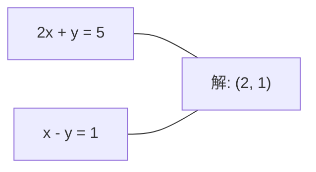
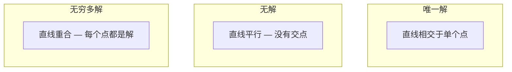

# Sistemas Lineares

> Ax = b é um dos problemas mais antigos da matemática, e ainda está a funcionar na sua rede neural.

**Type:** Build
**Language:**Python
**前置要求：**Fase 1,Lessões 01 (Intuição de álgebra linear),02 (Vectores e matrizes),03 (Transformações de matriz)
**Time:** ~120 minutes

## Objectivo de aprendizagem
- Utilização de rotação parcial e substituição de volta de eliminação gaussiana 求解 Ax = b
- Utilize LU、QR 和 Cholesky decomposições 分解 Matrix,并解释每种方法适用场景
- 推导 menor quadrado de equações normais,并将其与线性回归和脊回归 联系起来
- Utilize condição número  diagnóstico de sistemas mal condicionados,并 aplicar regularização 使其稳定

## 问题
Cada vez que você treina regressão linear, você está procurando resolver um sistema linear.`y = Wx + b`Quando você está a modificar este sistema, você está a tentar resolver um sistema linear, usando processos gaussianos.

方程 Ax = b 无处不在──A é uma matriz de componentes de fatores conhecidos──b é um vetor de componentes de componentes de dados conhecidos──x é o que você quer encontrar de números desconhecidos──x é o que você quer encontrar de dados.

Esta aula irá resolver todas as principais formas de construir a partir de zero. Você entenderá por que alguns métodos são mais rápidos e outros mais estáveis, por que alguns métodos são apenas aplicáveis a sistemas quadrados e outros podem lidar com sistemas sobredeterminados, bem como por que o número de condições da Matriz decide se sua resposta tem significado.

## 概念
### Ax = b = b = b = b = b = b = b = b = b = b = b = b = b = b = b = b = b = b = b = b = b = b = b = b = b = b = b = b = b = b = b = b = b = b = b = b = b = b = b = b = b = b = b = b = b = b = b = b = b = b = b = b = b = b = b = b = b = b = b = b = b = b = b = b = b = b = b = b = b = b = b = b = b = b = b = b = b = b = b = b = b = b = b = b = b = b = b = b = b = b = b = b = b = b = b = b = b = b = b = b = b = b = b = b = b = b = b = b = b = b = b = b = b = b = b = b = b = b = b = b = b = b = b = b = b = b = b = b = b = b = b = b = b = b = b = b = b = b = b = b = b = b = b = b = b = b = b = b = b = b = b = d = d = d = d = d = d = d = d = d = d = d = d = d = d = d = d = d = d = d = d = d = d = d = d = d = d = d = d = d = d = d = d = d = d = d = d = d = d = d = d = d = d = d = d = d = d = d = d = d = d = d = d = d = d = d = d = d = d = d = d = d = d = d = d = d = d = d = d d = d = d = d = d = d d = d = d = d = d = d = d d d d = d = d d d d = d = d = d = d = d d d d = d = d d d d d = d d d d = d = d d d d d = d d

Um sistema de equações lineares 具有几何解释── cada equação 定义一个超平面──解就是所有超平面相交的点(或点集)──

```
2x + y = 5          2D 中的两条直线。
x - y  = 1          它们相交于 x=2, y=1。
```



Podem surgir três situações:



Em matriz 形式中, "uma solução" significa A é invertível。 "Nenhuma solução" significa sistema é inconsistente。 "Soluções infinitas" significa A tem um espaço zero。 a maioria dos problemas ML 都 pertencem 没有精确解的类别, pois suas equações ((puntos de dados) são mais desconhecidos ((parametros) 更多。 é o lugar onde os menores quadrados 发挥作用。

### imagem de coluna vs imagem de linha

Há duas formas de entender Ax = b:

**Row picture.**Cada linha define uma equação. Cada equação é um hiperplano.

**Column picture.**Cada linha de A é um vetor. A questão é transformada em: Qual combinação linear de colunas de A pode produzir b?

```
A = | 2  1 |    b = | 5 |
    | 1 -1 |        | 1 |

Row picture: 同时求解 2x + y = 5 和 x - y = 1。

Column picture: 找到 x1, x2，使得：
  x1 * [2, 1] + x2 * [1, -1] = [5, 1]
  2 * [2, 1] + 1 * [1, -1] = [4+1, 2-1] = [5, 1]   check.
```

Imagem de coluna 更根本── Se b 位于 A de coluna espaço, o sistema já tem solução── Se b não estiver entre eles, você encontra coluna espaço no meio de seu ponto mais próximo── este ponto mais próximo é a solução de menor quadrado──

### Eliminação gaussiana

A eliminação gaussiana vai transformar Ax = b em sistema triangular superior Ux = c, e depois substituir de volta 求解── é o método mais direto──

- Não .

```
1. 对每一列 k（pivot column）：
   a. 在第 k 行及其下方，找到 column k 中最大的 entry（partial pivoting）。
   b. 将该行与第 k 行交换。
   c. 对 k 下方的每一行 i：
      - 计算 multiplier m = A[i][k] / A[k][k]
      - 从第 i 行中减去 m 倍的第 k 行。
2. Back substitute：从最后一个 equation 向上求解。
```

exemplo:

```
Original:
| 2  1  1 | 8 |       R2 = R2 - (2)R1     | 2  1   1 |  8 |
| 4  3  3 |20 |  -->  R3 = R3 - (1)R1 --> | 0  1   1 |  4 |
| 2  3  1 |12 |                            | 0  2   0 |  4 |

                       R3 = R3 - (2)R2     | 2  1   1 |  8 |
                                       --> | 0  1   1 |  4 |
                                           | 0  0  -2 | -4 |

Back substitute:
  -2 * x3 = -4    -->  x3 = 2
  x2 + 2  = 4     -->  x2 = 2
  2*x1 + 2 + 2 = 8 --> x1 = 2
```

O custo de cálculo da eliminação gaussiana é de O ((n^3) ⋅ para o sistema 1000x1000, que é aproximadamente 100 milhões de vezes operações de ponto flutuante ⋅ é muito rápido, mas se você precisar usar o mesmo sistema, também pode ser feito melhor ⋅

### Pivagem parcial: Por que é importante

 sem pivô, eliminação gaussiana pode falhar ou produzir resultados de lixo

```
Bad pivot:                       With partial pivoting:
| 0.001  1 | 1.001 |            先交换行：
| 1      1 | 2     |            | 1      1 | 2     |
                                 | 0.001  1 | 1.001 |
m = 1/0.001 = 1000              m = 0.001/1 = 0.001
R2 = R2 - 1000*R1               R2 = R2 - 0.001*R1
| 0.001  1     | 1.001   |      | 1      1     | 2     |
| 0     -999   | -999.0  |      | 0      0.999 | 0.999 |

x2 = 1.000（正确）              x2 = 1.000（正确）
x1 = (1.001 - 1)/0.001          x1 = (2 - 1)/1 = 1.000（正确）
   = 0.001/0.001 = 1.000        稳定，因为 multiplier 很小。
```

Em precisão limitada de aritmética de pontos flutuantes, a versão não pivotada pode perder dígitos significativos.

### Descomposição de LU

A decomposição de LU vai dividir A em matriz triangular inferior L e matriz triangular superior U:A = LU──L Matriz  armazenamento Eliminação Gaussian em meio aos multiplicadores──U Matrix é resultado da eliminação──

```
A = L @ U

| 2  1  1 |   | 1  0  0 |   | 2  1   1 |
| 4  3  3 | = | 2  1  0 | @ | 0  1   1 |
| 2  3  1 |   | 1  2  1 |   | 0  0  -2 |
```

Porque uma vez que há L e U, para qualquer novo b  solvendo Ax = b só precisa de O  n ^ 2):

```
Ax = b
LUx = b
令 y = Ux:
  Ly = b    (forward substitution, O(n^2))
  Ux = y    (back substitution, O(n^2))
```

O custo de O (n^3) é apenas pago na fatorização. Depois de cada solução, são O (n^2) O (n^2) O (n^3) é o mesmo que o O (n^3) e o custo é o mesmo que o O (n^3) e se você precisa de diferentes vectores de A (b) para resolver 1000 sistemas, o LU permite que a economia total seja de cerca de 1000/3 vezes.

Usando pivô parcial, você obtém PA = LU, onde P é a matriz de permutação dos swaps de linha registrada.

### Descomposição QR

A decomposição QR vai dividir A em matriz ortogonal Q 和 matriz triangular superior R:A = QR。

Matriz ortogonal 具有 Q^T Q = I 的性质──seus colunas são vetores ortônormais──乘以 Q 会保持长和角──

```
A = Q @ R

Q has orthonormal columns: Q^T Q = I
R is upper triangular

To solve Ax = b:
  QRx = b
  Rx = Q^T b    (只需乘以 Q^T，不需要 inversion)
  Back substitute to get x.
```

Em busca de solução de problemas de mínimos quadrados 时,QR比 LU em estabilidade numérica 上更好──Gram-Schmidt processo 逐列构建 Q:

```
Given columns a1, a2, ... of A:

q1 = a1 / ||a1||

q2 = a2 - (a2 . q1) * q1        (减去到 q1 上的 projection)
q2 = q2 / ||q2||                (normalize)

q3 = a3 - (a3 . q1) * q1 - (a3 . q2) * q2
q3 = q3 / ||q3||

R[i][j] = qi . aj    for i <= j
```

Cada passo vai mover-se ao longo de todos os componentes de vetores anteriores, apenas deixando uma nova direção ortogonais.

### Cholesky decomposição

Quando A é simétrica ((A = A^T) e positiva definida (((todos os valores próprios são por norma), você pode descompô-la em A = L^T, dos quais L é triangular inferior.

```
A = L @ L^T

| 4  2 |   | 2  0 |   | 2  1 |
| 2  5 | = | 1  2 | @ | 0  2 |

L[i][i] = sqrt(A[i][i] - sum(L[i][k]^2 for k < i))
L[i][j] = (A[i][j] - sum(L[i][k]*L[j][k] for k < j)) / L[j][j]    for i > j
```

Cholesky 快两倍比 LU, e só precisa de metade do espaço de armazenamento. É apenas aplicável a matrizes simétricas positivas definidas, mas esse tipo de Matriz aparece frequentemente:

- Matriz de covariância é semi-definida simétrica positiva através da regularização 可变为 positiva definida)
- A matriz do núcleo de processos gaussianos é definida simétrica positiva.
- Função convexa em mínimos de Hessian é simétrica positiva definida.
- A^T A 总是 simétrica positiva semi-definida。

Em processos gaussianos, você usa Cholesky para resolver a matriz do kernel K, e então procura resolver K alfa = y para obter o significado preditivo. O fator Cholesky também fornece o log-determinante de probabilidade marginal: log det(K) = 2 * soma(log(diag(L)))。

### Quadrados mínimos:当 Ax = b 没有精确解时

Se A é m x n 且 m > n(equações 多于未知), sistema é sobredeterminado.

```
minimize ||Ax - b||^2

这是 squared residuals 的总和：
  sum((A[i,:] @ x - b[i])^2 for i in range(m))
```

Minimizar 满足 equações normais:

```
A^T A x = A^T b
```

推导:展开A 求 Gradiente,并令其为零:2 A  A x - 2 A  T b = 0

```
Original system (overdetermined, 4 equations, 2 unknowns):
| 1  1 |         | 3 |
| 1  2 | x     = | 5 |       没有精确的 x 能满足全部 4 个 equations。
| 1  3 |         | 6 |
| 1  4 |         | 8 |

Normal equations:
A^T A = | 4  10 |    A^T b = | 22 |
        | 10 30 |            | 63 |

Solve: x = [1.5, 1.7]

这就是 linear regression。x[0] 是 intercept，x[1] 是 slope。
```

### Equações normais = regressão linear

Esta ligação é precisa. Em regressão linear, matriz de dados X Cada linha se refere a uma amostra, cada linha se refere a uma característica.

```
X^T X w = X^T y
w = (X^T X)^(-1) X^T y
```

É a solução fechada da regressão linear.`sklearn.linear_model.LinearRegression.fit()`cidade calcular este resultado ((( ou através de QR ou SVD  calcular resultados de igual preço)

Para Matrix adicione term term term regularização lambda * I, você já obtém regressão de cresta:

```
(X^T X + lambda * I) w = X^T y
w = (X^T X + lambda * I)^(-1) X^T y
```

Regularização 会让矩阵的条件更好(更容易准确求逆),并通过将重量向零收缩以防止过──当 lambda > 0 时,Matrix X^T X + lambda * I 总是对称正确,因此可以使用Cholesky 求解──

### Pseudoinversos (Moore-Penrose)

Pseudoinverso A+ irá inversionar matriz 推广到非平方 和 singular matrices── para qualquer Matrix A:

```
x = A+ b

where A+ = V Sigma+ U^T    (computed via SVD)
```

Sigma+ 通過對每非零 singular value 取相互并转置結果构成──如果 A = U Sigma V^T,则A+ = V Sigma+ U^T──

```
A = U Sigma V^T        (SVD)

Sigma = | 5  0 |       Sigma+ = | 1/5  0  0 |
        | 0  2 |                | 0  1/2  0 |
        | 0  0 |

A+ = V Sigma+ U^T
```

Pseudoinversos                                                                                                                                                                                                                                                                                                                                                                                                                                                                                                                         
- 唯一解: A+ b 给出该解──
- 无解:A+ b 给出最小平方的解决方案──
- Não há mais solução: A+ b                                                                                                                                                                                                                                                                                                                                                                                                                                                                                                                     

NumPy `np.linalg.lstsq`和 `np.linalg.pinv`内部都使用 SVD。

### Número de condição

Número de condição  Messa solução para pequenas variações de entrada há muita sensibilidade  Para Matrix A, o número de condição é:

```
kappa(A) = ||A|| * ||A^(-1)|| = sigma_max / sigma_min
```

Entre eles, sigma_max 和 sigma_min 分别是最大和最小单数值──

```
Well-conditioned (kappa ~ 1):        Ill-conditioned (kappa ~ 10^15):
b 中的小变化 -->                    b 中的小变化 -->
x 中的小变化                         x 中的巨大变化

| 2  0 |   kappa = 2/1 = 2          | 1   1          |   kappa ~ 10^15
| 0  1 |   safe to solve            | 1   1+10^(-15) |   solution is garbage
```

经验法则:
- - Não, não.
- - Não, não, não. - Não, não, não.
- para float64):solution 没有意义──matrix 实际上是单一──

Em ML, mal-condicionamento  ocorre em características  quase collinear 时── regularidade                                                                                                                                                                                                                                                                                                                                                                                                                                                                                                      

### Métodos iterativos: gradiente conjugado

Para sistemas muito grandes e raros (((milhões de desconhecidos), métodos diretos como LU ou Cholesky, os métodos iterativos vão passar por várias vezes para melhorar uma suposição para uma solução próxima―.

O gradiente conjugado (CG) em A é um gradiente positivo simétrico definido 时求解 Ax = b。 é encontrado em aritmética exata mais de n vezes 代 ︎, mas se os valores próprios de A ︎ se agruparem, normalmente será mais rápido ︎.

```
Algorithm sketch:
  x0 = initial guess (often zero)
  r0 = b - A x0           (residual)
  p0 = r0                 (search direction)

  For k = 0, 1, 2, ...:
    alpha = (rk . rk) / (pk . A pk)
    x_{k+1} = xk + alpha * pk
    r_{k+1} = rk - alpha * A pk
    beta = (r_{k+1} . r_{k+1}) / (rk . rk)
    p_{k+1} = r_{k+1} + beta * pk
    if ||r_{k+1}|| < tolerance: stop
```

CG Usado para:
- Optimização em larga escala (método Newton-CG)
- 求解 Discretizations de PDE
- Métodos do núcleo, entre os quais a matriz do núcleo 太大无法因子
- Como outros solventes iterativos de pré-condicionamento

A taxa de convergência depende do número de condições. A condição de sistemas melhores é mais rápida.

### O quadro completo:何时使用哪种方法

| Method | Requirements | Cost | Use case |
|--------|-------------|------|----------|
| Gaussian elimination | Square, nonsingular A | O(n^3) | 对 square system 的一次性求解 |
| LU decomposition | Square, nonsingular A | O(n^3) factor + O(n^2) solve | 使用相同 A 的多次求解 |
| QR decomposition | Any A (m >= n) | O(mn^2) | Least squares，numerically stable |
| Cholesky | Symmetric positive definite A | O(n^3/3) | Covariance matrices，Gaussian processes，ridge regression |
| Normal equations | Overdetermined (m > n) | O(mn^2 + n^3) | Linear regression（小 n） |
| SVD / pseudoinverse | Any A | O(mn^2) | Rank-deficient systems，minimum-norm solutions |
| Conjugate gradient | Symmetric positive definite, sparse A | O(n * k * nnz) | Large sparse systems，k = iterations |

### Conexão com a ML

Cada método desta aula aparece na classe ML de produção:

**Linear regression.**Solução de forma fechada 求解 normal equações X^T X w = X^T y。 isto pode ser através de Cholesky 若 n 很小) 、QR 若数稳定 很重要) 若SVD 若矩阵可能等级不足) 完成──

**Ridge regression.**Para X^T X 添加 lambda * I。 Sistema regular (X^T X + lambda * I) w = X^T y 总是可以通过Cholesky 求解,因为当 lambda > 0 时,X^T X + lambda * I 是对称正确的──

**Gaussian processes.**Mediana preditiva 需要求解 K alfa = y, em que K é matriz do kernel。对 K 做 Cholesky factorization 是标准方法。Log probabilidade marginal 使用 log det(K) = 2 soma(log(diag(L)))。

**Neural network initialization.**Inicialização ortogonais Utilize decomposição QR  Crie colunas para matrizes de peso ortônormais  Isso pode prevenir o colapso do sinal de redes profundas 

**Preconditioning.**Optimizadores de grande escala Usar Cholesky incompleto ou LU incompleto como pré-condições de solventes de gradiente conjugado。

**Feature engineering.**Número de condição de X^T X  diz-lhe características se são colineares.


```figure
linear-system-conditioning
```

## Construí-lo
### 步骤 1: Eliminação gaussiana com rotação parcial

```python
import numpy as np

def gaussian_elimination(A, b):
    n = len(b)
    Ab = np.hstack([A.astype(float), b.reshape(-1, 1).astype(float)])

    for k in range(n):
        max_row = k + np.argmax(np.abs(Ab[k:, k]))
        Ab[[k, max_row]] = Ab[[max_row, k]]

        if abs(Ab[k, k]) < 1e-12:
            raise ValueError(f"Matrix is singular or nearly singular at pivot {k}")

        for i in range(k + 1, n):
            m = Ab[i, k] / Ab[k, k]
            Ab[i, k:] -= m * Ab[k, k:]

    x = np.zeros(n)
    for i in range(n - 1, -1, -1):
        x[i] = (Ab[i, -1] - Ab[i, i+1:n] @ x[i+1:n]) / Ab[i, i]

    return x
```

### 步骤 2: decomposição da LU

```python
def lu_decompose(A):
    n = A.shape[0]
    L = np.eye(n)
    U = A.astype(float).copy()
    P = np.eye(n)

    for k in range(n):
        max_row = k + np.argmax(np.abs(U[k:, k]))
        if max_row != k:
            U[[k, max_row]] = U[[max_row, k]]
            P[[k, max_row]] = P[[max_row, k]]
            if k > 0:
                L[[k, max_row], :k] = L[[max_row, k], :k]

        for i in range(k + 1, n):
            L[i, k] = U[i, k] / U[k, k]
            U[i, k:] -= L[i, k] * U[k, k:]

    return P, L, U

def lu_solve(P, L, U, b):
    n = len(b)
    Pb = P @ b.astype(float)

    y = np.zeros(n)
    for i in range(n):
        y[i] = Pb[i] - L[i, :i] @ y[:i]

    x = np.zeros(n)
    for i in range(n - 1, -1, -1):
        x[i] = (y[i] - U[i, i+1:] @ x[i+1:]) / U[i, i]

    return x
```

### 步骤 3: Decomposição de Cholesky

```python
def cholesky(A):
    n = A.shape[0]
    L = np.zeros_like(A, dtype=float)

    for i in range(n):
        for j in range(i + 1):
            s = A[i, j] - L[i, :j] @ L[j, :j]
            if i == j:
                if s <= 0:
                    raise ValueError("Matrix is not positive definite")
                L[i, j] = np.sqrt(s)
            else:
                L[i, j] = s / L[j, j]

    return L
```

### 步骤 4: Quadrados mínimos através de equações normais

```python
def least_squares_normal(A, b):
    AtA = A.T @ A
    Atb = A.T @ b
    return gaussian_elimination(AtA, Atb)

def ridge_regression(A, b, lam):
    n = A.shape[1]
    AtA = A.T @ A + lam * np.eye(n)
    Atb = A.T @ b
    L = cholesky(AtA)
    y = np.zeros(n)
    for i in range(n):
        y[i] = (Atb[i] - L[i, :i] @ y[:i]) / L[i, i]
    x = np.zeros(n)
    for i in range(n - 1, -1, -1):
        x[i] = (y[i] - L.T[i, i+1:] @ x[i+1:]) / L.T[i, i]
    return x
```

### 步骤 5: Número de condição

```python
def condition_number(A):
    U, S, Vt = np.linalg.svd(A)
    return S[0] / S[-1]
```

## Use-o
Para combinar estas partes, em dados reais, realizar regressão linear e regressão de cresta:

```python
np.random.seed(42)
X_raw = np.random.randn(100, 3)
w_true = np.array([2.0, -1.0, 0.5])
y = X_raw @ w_true + np.random.randn(100) * 0.1

X = np.column_stack([np.ones(100), X_raw])

w_ols = least_squares_normal(X, y)
print(f"OLS weights (ours):    {w_ols}")

w_np = np.linalg.lstsq(X, y, rcond=None)[0]
print(f"OLS weights (numpy):   {w_np}")
print(f"Max difference: {np.max(np.abs(w_ols - w_np)):.2e}")

w_ridge = ridge_regression(X, y, lam=1.0)
print(f"Ridge weights (ours):  {w_ridge}")

from sklearn.linear_model import Ridge
ridge_sk = Ridge(alpha=1.0, fit_intercept=False)
ridge_sk.fit(X, y)
print(f"Ridge weights (sklearn): {ridge_sk.coef_}")
```

## Entrega-o
本课产出:
- `code/linear_systems.py`, contendo de zero realização de eliminação gaussiana, LU decomposição, Cholesky decomposição, mínimos quadrados e regressão de cresta
- Uma demonstração operacional, mostrando equações normais e a Regressão Linear de sklearn  produzindo o mesmo peso

## 练习
1. Use a sua eliminação gaussiana, o seu solvente de LU e `np.linalg.solve`求解 sistema `[[1,2,3],[4,5,6],[7,8,10]] x = [6, 15, 27]`❖ testar ❖ em tolerância de ponto flutuante

2. 生成一个50x5 随机矩阵 X 和 目标 y = X @ w_true + noise──分别使用正常方程、QR(通过 `np.linalg.qr`)、SVD( através `np.linalg.svd`) e `np.linalg.lstsq`求解 w―比较四个解决方案──测量 X^T X 的条件数,并解释它如何影响你信任哪种方法──

3. 通過让两列几乎相同来创建一个几乎单一矩阵 (例如, coluna 2 = coluna 1 + 1e-10 * noise) ⋅ calcular seu número de condição ⋅分别在有规律化和无规律化的情况下求解 Ax = b(加0.01 * I) ⋅ Compare soluções 和残留物──解释为什么规律化有帮助──

4. Para uma matriz definida positiva simétrica aleatória 100x100  realizar algoritmo de gradiente conjugado 统计它收到容忍 1e-8 需要多少次反复──与 n 代复的理论最大值进行比较──

5. Em grande para 10 ̊50 ̊200 ̊500 de matrizes definidas simétricas positivas, para o seu solvente Cholesky ̊ seu solvente LU 和 ̊`np.linalg.solve`计时――绘制结果――验证 Cholesky 大约比 LU 快 2 倍――

## 关键术语
| Term | What people say | What it actually means |
|------|----------------|----------------------|
| Linear system | "Solve for x" | 一组 linear equations Ax = b。找到 x 意味着找到在 transformation A 下产生 output b 的 input。 |
| Gaussian elimination | "Row reduce" | 使用 row operations 系统性地将 diagonal 下方的 entries 置零，产生可通过 back substitution 求解的 upper triangular system。O(n^3)。 |
| Partial pivoting | "Swap rows for stability" | 在 column k 中进行 elimination 前，将该 column 中 absolute value 最大的行交换到 pivot 位置。防止除以很小的数。 |
| LU decomposition | "Factor into triangles" | 写成 A = LU，其中 L 是 lower triangular（存储 multipliers），U 是 upper triangular（eliminated matrix）。将 O(n^3) 成本摊销到多次求解中。 |
| QR decomposition | "Orthogonal factorization" | 写成 A = QR，其中 Q 的 columns 是 orthonormal，R 是 upper triangular。对于 least squares，比 LU 更稳定。 |
| Cholesky decomposition | "Square root of a matrix" | 对 symmetric positive definite A，写成 A = LL^T。成本是 LU 的一半。用于 covariance matrices、kernel matrices 和 ridge regression。 |
| Least squares | "Best fit when exact is impossible" | 当 system overdetermined（equations 多于 unknowns）时，最小化 squared residuals 的总和 ||Ax - b||^2。 |
| Normal equations | "The calculus shortcut" | A^T A x = A^T b。将 ||Ax - b||^2 的 Gradient 设为零。这就是 linear regression 的 closed-form solution。 |
| Pseudoinverse | "Inversion for non-square matrices" | A+ = V Sigma+ U^T via SVD。对于任意 Matrix，无论 square 或 rectangular、singular 与否，给出 minimum-norm least-squares solution。 |
| Condition number | "How trustworthy is this answer" | kappa = sigma_max / sigma_min。衡量对 input perturbations 的敏感性。大约损失 log10(kappa) 位精度。 |
| Ridge regression | "Regularized least squares" | 求解 (X^T X + lambda I) w = X^T y。添加 lambda I 改善 conditioning，并将 weights 向零收缩。防止 overfitting。 |
| Conjugate gradient | "Iterative Ax=b for big matrices" | 用于 symmetric positive definite systems 的 iterative solver。最多 n 步收敛。适合 factorization 成本过高的大型 sparse systems。 |
| Overdetermined system | "More data than parameters" | 在 m-by-n system 中 m > n。不存在精确解。Least squares 找到最佳近似。这就是每个 regression problem。 |
| Back substitution | "Solve from the bottom up" | 给定 upper triangular system，先求解最后一个 equation，然后向后 substitute。O(n^2)。 |
| Forward substitution | "Solve from the top down" | 给定 lower triangular system，先求解第一个 equation，然后向前 substitute。O(n^2)。用于 LU solves 中的 L step。 |

## 延伸阅读
- [MIT 18.06: Linear Algebra](https://ocw.mit.edu/courses/18-06-linear-algebra-spring-2010/)(Gilbert Strang) --  Sobre sistemas lineares e factorizations de matriz
- [Numerical Linear Algebra](https://people.maths.ox.ac.uk/trefethen/text.html)(Trefethen & Bau) -- Entender estabilidade numérica, condicionamento e algoritmos por que falhar
- [Matrix Computations](https://www.cs.cornell.edu/cv/GolubVanLoan4/golubandvanloan.htm)(Golub & Van Loan) --  abrangendo todos os tipos de algoritmos de matriz
- [3Blue1Brown: Inverse Matrices](https://www.3blue1brown.com/lessons/inverse-matrices)-- para a busca de solução Ax = b 几何义的可视化直觉
