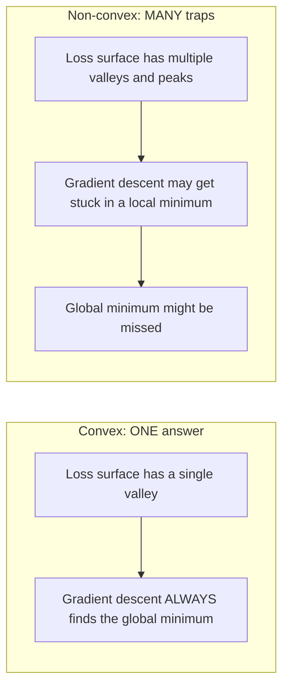
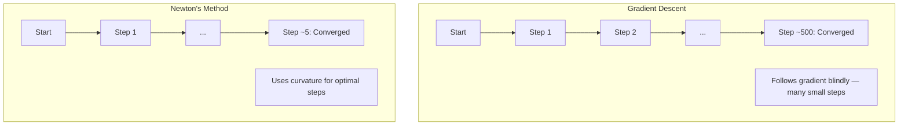
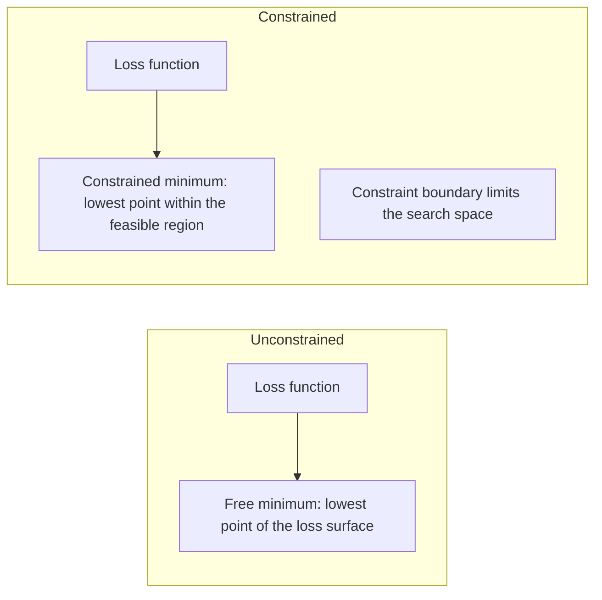
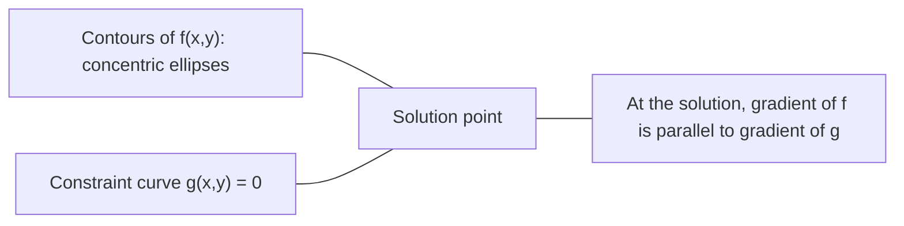

# 凸优化

> 凸问题只有一个谷底――Neural Network 有数百万个――理解这种差异很重要――

**类型：**Construção
**语言：**Python
**前置要求：**Fase 1, Lições 04 ((Calculo para ML) 、08 ((Optimização)
**时间：**Cerca de 90 minutos

## Objectivo de aprendizagem

- Utilize definição、二阶导数和 Hessian 判据测试 um função se for um função de cam
-                                                                                                                                                                                                                                                                                                                                                                                                                                                                                                                              
- Utilize multiplicadores de lagrança 求解带约束的优化问题,并解释 KKT condições
- Explicação de porquê a perda de rede neural é não-confundida, mas a SGD ainda consegue encontrar uma boa solução.

## 问题

Lição 08 - Otimizador pode se mover em qualquer superfície, mas não tem garantia. O Descenso Gradiente pode entrar em um local de baixo valor, em um ponto de sela, ou em um ponto de vibração permanente. Você ainda usa isso, porque a rede neural não é de baixo valor, e não há alternativa.

Mas muitos problemas do ML são de contagem. Régresso linear, regressão logística, SVMs, LASSO, regressão de bordo. Para estes problemas, há ferramentas mais fortes: com garantia matemática de otimização.

Compreender a conexão tem três valores. Primeiro, ele diz-lhe o problema quando é simples, quando é difícil, quando não conexão. Segundo, ele fornece ferramentas mais rápidas para o problema com conexão, como o método de Newton.

## 概念

### 凸集

Se, para um conjunto S, qualquer dois pontos, o intervalo entre eles está totalmente no S, então o conjunto S é um conjunto de formas.

| 凸集 | 非凸 |
|---|---|
| **矩形**：内部任意两点都可以用一条仍在内部的线段连接 | **星形/月牙形**：两个内部点之间的线段可能穿过集合外部 |
| **三角形**：对所有内部点都满足相同性质 | **甜甜圈/环形**：中间的孔意味着某些线段会离开集合 |
| 任意两点之间的线段都留在集合内 | 某些点对之间的线段会离开集合 |

形式化测试: para S 中任意点 x、y, bem como qualquer t em [0, 1],点 tx + (1-t) y 也在 S 中。

凸集 exemplo:
- Uma linha reta, um plano, toda a R^n
- Uma bola (round 球体 超球)
- Uma metade do espaço: {x: a^T x <= b}
- 任意数凸集的交交交

Não-conclusão exemplo:
- Um doce doce círculo
- 两个不相交交的并集
- Qualquer conjunto de armadilhas ou buracos

### 凸函数

Se a função f define um domínio como um conjunto de contagens, e para os dois pontos x、y, bem como qualquer t em [0, 1]:

```
f(tx + (1-t)y) <= t*f(x) + (1-t)*f(y)
```

几何上看: linha entre qualquer ponto da imagem está situada sobre a imagem ou sobre a imagem.

| 属性 | 凸函数 | 非凸函数 |
|---|---|---|
| **线段测试** | 图像上任意两点之间的线段位于曲线**之上或之上** | 图像上某些点之间的线段会下探到曲线**之下** |
| **形状** | 单个向上弯曲的碗/谷底 | 多个峰和谷，曲率混合 |
| **局部最小值** | 每个局部最小值都是全局最小值 | 可能存在多个高度不同的局部最小值 |

常见凸函数:
- f(x) = x^2(抛物线)
- F (x) = (x) = (x) = (x) = (x) = (x) = (x) = (x) = (x) = (x) = (x) = (x) = (x) = (x) = (x) = (x) = (x) = (x) = (x) = (x) = (x) = (x) = (x) = (x) = (x) = (x) = (x) = (x) = (x) = (x) = (x) = (x) = (x) = (x) = (x) = (x) = (x) = (x) = (x) = (x) = (x) = (x) = (x) = (x) = (x) = (x) = (x) = (x) = (x) = (x) = (x) = (x) = (x) = (x) = (x) = (x) = (x) = (x) = (x) = (x) = = (x) = (x) = = (x) = = = = (x) = = (x) = = = = (x) = = = (x) = = = = = = (x) = = = = = = = = = (x) = = = = = = = = = = = = = = = = = = = = = = = = = = = = = = = = = = = = = = = = = = = = = = = = = = = = = = = = = = = = = = = = = = = = = = = = = = = = = = = = = = = = = = = = = = = = = = = = = = = = = = = = = = = = = = = = = = = = = = = = = = = = = = = = = = = = = = = = = = = = = = = = = = = = = = = = = = = = = = = = = = = = = = = = = = = = = = = = = = = = = = = = = = = = = = = = = = = = = = = = = = = = = = = = = =
- f(x) = e^x(指数)
- f(x) = max(0, x)(ReLU, apesar de ser dividido por um segmento de sexo)
- f(x) = -log(x) para x > 0(负对数)
- 任意线性函数 f(x) = a^T x + b(既凸又)

### 测试凸性

Três testes práticos, do mais fácil ao mais rigoroso.

**测试 1：二阶导数测试（1D）。**Se para todos os x tiver f'(x) >= 0, então f é uma função de contagem.

- f(x) = x^2:f'(x) = 2 >= 0。凸。
- f(x) = x^3:f'(x) = 6x。x < 0 时为负──非凸──
- f(x) = e^x: f'(x) = e^x > 0。凸。

**测试 2：Hessian 测试（多变量）。**Se a Matriz Hessia H(x) para todos os x são semidefinidos positivos, então f é a função de contagem.

**测试 3：定义测试。**直接检查不等式 f(tx + (1-t) y) <= t*f(x) + (1-t) *f(y)。适用于导数难以计算的函数。

### Por que é importante?

凸优化的核心定理:

**对于凸函数，每个局部最小值都是全局最小值。**

Isto significa que a Descenso Gradiente não será atrapada. Qualquer caminho para baixo vai para a mesma resposta.



结果:
- Não precisa de reiniciar
- Não precisa de uma modulação de taxa de aprendizagem complexa
- Pode provar a receita (a taxa depende da função)
- 解是唯一的 (Dentro da região plana)

### Câmbio e não-câmbio no meio do ML

| 问题 | 凸？ | 原因 |
|---------|---------|-----|
| Linear regression (MSE) | 是 | Loss 关于权重是二次的 |
| Logistic regression | 是 | Log-loss 关于权重是凸的 |
| SVM (hinge loss) | 是 | 线性函数的最大值 |
| LASSO (L1 regression) | 是 | 凸函数之和是凸的 |
| Ridge regression (L2) | 是 | 二次 + 二次 = 凸 |
| Neural Network（任意 Loss） | 否 | 非线性 activations 会产生非凸 landscape |
| k-means clustering | 否 | 离散分配步骤 |
| Matrix factorization | 否 | 未知量的乘积 |

O modelo linear de perda de conchas é de conchas. Uma vez que se juntam a camadas ocultas de ativasões não lineares, a conchas são destruídas.

### Matriz Hessiana

函数 f: R^n -> Hessian H de R é constituído por n x n matrizes.

```
H[i][j] = d^2 f / (dx_i dx_j)
```

对于 f ((x, y) = x^2 + 3xy + y^2:

```
df/dx = 2x + 3y       d^2f/dx^2 = 2      d^2f/dxdy = 3
df/dy = 3x + 2y       d^2f/dydx = 3      d^2f/dy^2 = 2

H = [ 2  3 ]
    [ 3  2 ]
```

Hessian 告诉你曲率信息:
- Valores próprios totalmente por-core: função em cada direção
- Valores próprios 全为负: em cada direção acima de tudo para baixo 曲 (, local máximo)
- 符号混合: ponto de sela (( certas direções para cima, outras direções para baixo)
- 零 eigenvalue: este sentido é plano de

Para contagem, o Hessiano deve estar em todas as posições semidefinido positivo, não apenas em um ponto.

### Método de Newton

Descenso Gradiente Utilize a informação de uma fase (Gradiente) ―― Método de Newton Utilize a informação de segunda fase (Hessian) ―― Ele está no ponto de preparação para uma segunda aproximação, e então salta diretamente para o valor mínimo dessa segunda função。

```
Update rule:
  x_new = x - H^(-1) * gradient

Compare to gradient descent:
  x_new = x - lr * gradient
```

O método de Newton utiliza o Hessian 替代标量学习率── que irá ajustá-lo automaticamente de acordo com a curva local.



优点:
- 接近最小值时二次收( cada passo erro diferença
- Não precisa de um ritmo de aprendizagem
- Não importa como você faz a questão de fazer a quantidade de trabalho)

缺点:
- 計算 Hessian 需要 O(n^2) 内存,求逆需要 O(n^3)
- Para uma rede neural com um peso de 100 milhões, isso significa 10 a 12 artigos e 10 a 18 operações.
- Não é prático para o Deep Learning

### 约束优化

无约束优化:在所有 x 上最小化 f(x) ⋅
约束优化: em condições de约束, minimizar f (x) ⋅

现实问题有约束――你想最小化成本,但预算有限――你想最小化错误,但模型复杂度有限――



### Multiplicadores de lagrança

Multiplicadores de lagrança 方法把束問題转换为无束問題──

问题:在 g(x) = 0 的约束下最小化 f(x) 』

解法: introduzir um novo变量 (Lagrange multiplier lambda),并求解无约束问题:

```
L(x, lambda) = f(x) + lambda * g(x)
```

Em L, L's Gradiente 为零:

```
dL/dx = df/dx + lambda * dg/dx = 0
dL/dlambda = g(x) = 0
```

几何直觉: em um conjunto de valores mínimos, o gradiente de f 必须与约束 g 的 gradiente平行── se eles não são iguais, você pode mover-se ao longo do conjunto de curvas, e reduzir ainda mais f──



exemplo: em x + y = 1 de约束下最小化 f(x,y) = x^2 + y^2。

```
L = x^2 + y^2 + lambda(x + y - 1)

dL/dx = 2x + lambda = 0  =>  x = -lambda/2
dL/dy = 2y + lambda = 0  =>  y = -lambda/2
dL/dlambda = x + y - 1 = 0

From first two: x = y
Substituting: 2x = 1, so x = y = 0.5, lambda = -1
```

Linea directa x + y = 1 acima da distância do ponto de origem do ponto mais próximo é (0,5, 0,5)。

### Condições da KKT

As condições de Karush-Kuhn-Tucker vão multiplicar os multiplicadores de Lagrange  expandir para não é igual

问题:在 g_i(x) <= 0,i = 1, ..., m 的约束下最小化 f(x) 』

Condições de KKT ((最优性的必要条件):

```
1. Stationarity:    df/dx + sum(lambda_i * dg_i/dx) = 0
2. Primal feasibility:  g_i(x) <= 0  for all i
3. Dual feasibility:    lambda_i >= 0  for all i
4. Complementary slackness:  lambda_i * g_i(x) = 0  for all i
```

A laxidade complementar é o elemento fundamental.

As condições KKT são o núcleo dos SVMs;. os vetores de suporte são o conjunto ativo de dados pontos.

### Regularização  como o 约束优化

A regularização de L1 e L2 não é uma técnica arbitrária.

**L2 regularization (Ridge)：**

```
minimize  Loss(w)  subject to  ||w||^2 <= t

Equivalent unconstrained form:
minimize  Loss(w) + lambda * ||w||^2
```

约束 约束 约束 约束 约束 约束 约束 约束 约束 约束 约束 约束 约束 约束 约束 约束 约束 约束 约束 约束 约束 约束 约束 约束 约束 约束 约束 约束 约束 约束 约束 约束 约束 约束 约束 约束 约束 约束 约束 约束 约束 约束 约束 约束 约束 约束 约束 约束 约束 约束 约束 约束 约束 约束 约束 约束 约束 约束 约束 约束 约束 约束 约束 约束 约束 约束 约束 约束 约束 约 约 约 约 约 约 约 约 约 约 约 约 约 约 约 约 约 约 约 约 约 约 约 约 约 约 约 约 约 约 约 约 约 约 约 约 约 约 约 约 约 约 约 约 约                                                                                                                                                                                                                     

**L1 regularization (LASSO)：**

```
minimize  Loss(w)  subject to  ||w||_1 <= t

Equivalent unconstrained form:
minimize  Loss(w) + lambda * ||w||_1
```

约束 束 束 束 束 束 束 束 束 束 束 束 束 束 束 束 束 束 束 束 束 束 束 束 束 束 束 束 束 束 束 束 束 束 束 束 束 束 束 束 束 束 束 束 束 束 束 束 束 束 束 束 束 束 束 束 束 束 束 束 束 束 束 束 束 束 束 束 束 束 束 束 束 束 束 束 束 束 束 束 束 束 束 束 束 束 束 束 束 束 束 束 束 束 束 束 束 束 束 束 束 束 束 束 束 束 束 束 束 束 束 束 束 束 束 束 束 束 束 束 束 束 束 束 束 束 束 束 束 束 束 束  束 束                                                                                                                                                                                                                                                

| 属性 | L2 约束（圆） | L1 约束（菱形） |
|---|---|---|
| **约束形状** | 圆（更高维中是球面） | 菱形（2D 中旋转的正方形） |
| **Loss 等高线接触的位置** | 光滑边界：圆上的任意点 | 角点：与某个轴对齐 |
| **解的行为** | 权重较小但非零 | 某些权重恰好为零（稀疏） |
| **结果** | 权重收缩 | 特征选择 |

Isso explica por que L1 produzirá um modelo raro (títulos selecionados), enquanto L2 apenas reduzirá o peso.

### Dualismo

Cada problema de optimização de um conjunto de elementos (primário) tem um problema de acompanhamento (dual) e para o problema de contagem, primário e dual têm o mesmo valor máximo.

Função dupla de Lagrange:

```
Primal: minimize f(x) subject to g(x) <= 0
Lagrangian: L(x, lambda) = f(x) + lambda * g(x)
Dual function: d(lambda) = min_x L(x, lambda)
Dual problem: maximize d(lambda) subject to lambda >= 0
```

Por que a dualidade é importante:
- Dual problema, às vezes mais fácil de resolver do que primário
- SVMs em forma dupla 求解, entre os quais o problema depende dos dados entre pontos de produtos dotados (para ativar o truque do kernel)
- Dual  fornecer o ótimo primário 的下界, pode ser usado para verificar a qualidade

 concretos até aos SVM:

```
Primal: find w, b that maximize the margin 2/||w|| subject to
        y_i(w^T x_i + b) >= 1 for all i

Dual:   maximize sum(alpha_i) - 0.5 * sum_ij(alpha_i * alpha_j * y_i * y_j * x_i^T x_j)
        subject to alpha_i >= 0 and sum(alpha_i * y_i) = 0

The dual only involves dot products x_i^T x_j.
Replace x_i^T x_j with K(x_i, x_j) to get the kernel trick.
```

### Por que o Deep Learning ainda pode funcionar

Função de perda de rede neural 极其非凸── de acordo com cada padrão clássico, otimizá-los todos devem falhar── no entanto, a descida do gradiente estocástico pode encontrar de forma confiável uma boa solução── vários fatores explicam isso──

**大多数局部最小值已经足够好。**Em alto espaço, os pontos críticos são os pontos de sela, não o valor mínimo local. O mínimo local geralmente tem um valor de perda próximo ao mínimo local. Quando o espaço tem milhões de vezes, a probabilidade de um valor mínimo local é muito baixa.

**真正的障碍是 saddle points，而不是局部最小值。**Em uma função com n 个参数, o ponto de sela tem também uma direção de curvatura positiva e negativa. Para um ponto crítico de alta altura, todos os valores próprios são positivos (ou negativos).

**Overparameterization 会平滑 landscape。** número de parâmetros é maior que a de um modelo de treinamento, mas a rede tem superfícies de perda mais simples e mais conectadas.

**Loss landscape 结构：**

| 属性 | 低维空间 | 高维空间 |
|---|---|---|
| **Landscape** | 许多孤立的峰和谷 | 平滑连通的谷 |
| **最小值** | 许多孤立局部最小值 | 很少有糟糕局部最小值；大多数接近最优 |
| **导航** | 难以找到全局最小值 | 许多路径通向好的解 |
| **Critical points** | 局部最小值和 saddle points 混合 | 压倒性地是 saddle points，而非局部最小值 |

**随机噪声充当隐式 regularization。**Mini-batch SGD  introdução de ruído, prevenção de queda em mínimos nítidos―Minimos nítidos  fácil de adaptar; mínimos planos  generalização melhor―

###  prática do método

O método de Newton para um grande modelo não é prático.

**L-BFGS (Limited-memory BFGS)：**Utilize recent m 个 Gradient 差分近似逆 Hessian──需要 O(mn) 内存,而不是 O(n^2)── é aplicado ao máximo de cerca de 10.000 个参数 questões── é usado para clássico ML(logística regressão、CRFs), mas não é usado para Deep Learning──

**Natural gradient：**Utilize Fisher information matrix ([[log-probabilidade expectativa de Hessian]]) em vez de padrão Hessian。 This will consider概率分布的几何结构。 K-FAC (Curvatura aproximada Cronécker-factored) irá colocar Fisher Matrix 近似为 Cronécker product, fazendo com que seja disponível para a Rede Neural。

**Hessian-free optimization：**Utilize gradiente conjugado 求解 Hx = g, não forma claramente H― apenas precisa de produtos de vetor Hessano, que pode ser através de diferenciação automática em O n 时间内计算―

**Diagonal approximations：**O segundo momento de Adão é a aproximação hessiana de um ângulo de linha. Ada Hessian, através do estimador de Hutchinson, ampliou este ponto usando elementos diagonais hessianos reais.

| 方法 | 内存 | 每步成本 | 何时使用 |
|--------|--------|--------------|-------------|
| Gradient Descent | O(n) | O(n) | Baseline，大模型 |
| Newton's method | O(n^2) | O(n^3) | 小型凸问题 |
| L-BFGS | O(mn) | O(mn) | 中型凸问题 |
| Adam | O(n) | O(n) | Deep Learning 默认选择 |
| K-FAC | O(n) | 每层 O(n) | 研究、大 batch training |


```figure
convex-vs-nonconvex
```

## Construí-lo

### 步骤 1: exame de forma gráfica

Construir uma função, através de um ponto de análise e de uma definição de experiência.

```python
import random
import math

def check_convexity(f, dim, bounds=(-5, 5), samples=1000):
    violations = 0
    for _ in range(samples):
        x = [random.uniform(*bounds) for _ in range(dim)]
        y = [random.uniform(*bounds) for _ in range(dim)]
        t = random.uniform(0, 1)
        mid = [t * xi + (1 - t) * yi for xi, yi in zip(x, y)]
        lhs = f(mid)
        rhs = t * f(x) + (1 - t) * f(y)
        if lhs > rhs + 1e-10:
            violations += 1
    return violations == 0, violations
```

### Passo 2: Utilize o método de Newton em 2D

Utilize explicitamente Hessian  realizar o método de Newton.

```python
def newtons_method(f, grad_f, hessian_f, x0, steps=50, tol=1e-12):
    x = list(x0)
    history = [x[:]]
    for _ in range(steps):
        g = grad_f(x)
        H = hessian_f(x)
        det = H[0][0] * H[1][1] - H[0][1] * H[1][0]
        if abs(det) < 1e-15:
            break
        H_inv = [
            [H[1][1] / det, -H[0][1] / det],
            [-H[1][0] / det, H[0][0] / det],
        ]
        dx = [
            H_inv[0][0] * g[0] + H_inv[0][1] * g[1],
            H_inv[1][0] * g[0] + H_inv[1][1] * g[1],
        ]
        x = [x[0] - dx[0], x[1] - dx[1]]
        history.append(x[:])
        if sum(gi ** 2 for gi in g) < tol:
            break
    return history
```

### 步骤 3: Multiplicador de largura 求解器

通過在拉格兰基上执行 Gradient Descent 来求解约束优化──

```python
def lagrange_solve(f_grad, g_val, g_grad, x0, lr=0.01,
                   lr_lambda=0.01, steps=5000):
    x = list(x0)
    lam = 0.0
    history = []
    for _ in range(steps):
        fg = f_grad(x)
        gv = g_val(x)
        gg = g_grad(x)
        x = [
            xi - lr * (fgi + lam * ggi)
            for xi, fgi, ggi in zip(x, fg, gg)
        ]
        lam = lam + lr_lambda * gv
        history.append((x[:], lam, gv))
    return history
```

### 步骤 4: Comparar 1o estágio com 2o estágio

Em um mesmo segundo função, executar o método de descida gradual e Newton.

```python
def quadratic(x):
    return 5 * x[0] ** 2 + x[1] ** 2

def quadratic_grad(x):
    return [10 * x[0], 2 * x[1]]

def quadratic_hessian(x):
    return [[10, 0], [0, 2]]
```

O método de Newton vai ser usado em 1 步内收 (o que é preciso para a segunda função) ◦ Descenso gradual vai precisar de 100 步, pois os valores próprios de Hessian são 5 vezes diferentes, formando um vale de longa distância.

## Use-o

Quando se escolhe um modelo e um solvente, a análise gráfica pode ser aplicada diretamente.

对于凸问题(regressão logística、SVMs、LASSO):
- Utilize专用 solver(liblinear、CVXPY、scipy.optimize.minimize com método='L-BFGS-B')
-                                                                                                                                                                                                                                                                                                                                                                                                                                                                                                                              
- 2o Caso de método prático e rápido

对于非凸问题:
- Use一阶方法 (SGD、Adam)
-                                                                                                                                                                                                                                                                                                                                                                                                                                                                                                                              
- Utilize a sobreparametrização, o ruído e a modulação da taxa de aprendizagem como regularização conceitual
- Não percas tempo procurando o mínimo da área inteira.

```python
from scipy.optimize import minimize

result = minimize(
    fun=lambda w: sum((y - X @ w) ** 2) + 0.1 * sum(w ** 2),
    x0=np.zeros(d),
    method='L-BFGS-B',
    jac=lambda w: -2 * X.T @ (y - X @ w) + 0.2 * w,
)
```

Para SVM, dupla formulação, podes usar o truque do kernel:

```python
from sklearn.svm import SVC

svm = SVC(kernel='rbf', C=1.0)
svm.fit(X_train, y_train)
print(f"Support vectors: {svm.n_support_}")
```

## 练习

1. **凸性画廊。**Utilize Checkchercher Test test these functions'凸性: f(x) = x^4、f(x) = sin(x)、f(x,y) = x^2 + y^2、f(x,y) = x*y、f(x) = max(x, 0)。 Explique por que cada resultado é razoável。

2. **Newton vs Gradient Descent 竞赛。**Desde o ponto de partida (10, 10) 出发,在 f(x,y) = 50*x^2 + y^2 上运行两种方法──每种方法需要多少步才能达到损失 < 1e-10?

3. **Lagrange multiplier 几何。**Em um conjunto x + 2y = 4 下最小化 f(x,y) = (x-3)^2 + (y-3)^2── através do exame de forma a verificar o grau de f e o grau de g.

4. **Regularization 约束。**实现 L1-otimizar restringido: em ≠ x ≠ + y ≠ <= 1 ≠ ∞ ∞ ∞ ∞ ∞ ∞ ∞ ∞ ∞ ∞ ∞ ∞ ∞ ∞ ∞ ∞ ∞ ∞ ∞ ∞ ∞ ∞ ∞ ∞ ∞ ∞ ∞ ∞ ∞ ∞ ∞ ∞ ∞ ∞ ∞ ∞ ∞ ∞ ∞ ∞ ∞ ∞ ∞ ∞ ∞ ∞ ∞ ∞ ∞ ∞ ∞ ∞ ∞ ∞ ∞ ∞ ∞ ∞ ∞ ∞ ∞ ∞ ∞ ∞ ∞ ∞ ∞ ∞ ∞ ∞ ∞ ∞ ∞ ∞ ∞ ∞ ∞ ∞ ∞ ∞ ∞ ∞ ∞ ∞ ∞ ∞ ∞ ∞ ∞ ∞ ∞ ∞ ∞ ∞ ∞ ∞ ∞ ∞ ∞ ∞ ∞ ∞ ∞ ∞ ∞ ∞ ∞ ∞ ∞ ∞ ∞ ∞ ∞ ∞ ∞ ∞ ∞ ∞ ∞ ∞ ∞ ∞ ∞ ∞ ∞ ∞ ∞ ∞ ∞ ∞ ∞ ∞ ∞ ∞ ∞ ∞ ∞ ∞ ∞ ∞ ∞ ∞ ∞ ∞ ∞ ∞ ∞ ∞ ∞ ∞ ∞ ∞ ∞ ∞ ∞ ∞ ∞ ∞ ∞ ∞ ∞ ∞ ∞ ∞ ∞ ∞ ∞ ∞ ∞ ∞ ∞ ∞ ∞ ∞ ∞ ∞ ∞ ∞ ∞ ∞ ∞ ∞ ∞ ∞ ∞ ∞ ∞ ∞ ∞ ∞ ∞ ∞ ∞ ∞ ∞ ∞ ∞ ∞ ∞ ∞ ∞ ∞ ∞ ∞ ∞ ∞ ∞ ∞ ∞ ∞ ∞ ∞ ∞ ∞ ∞ ∞ ∞ ∞ ∞ ∞ ∞ ∞ ∞ ∞ ∞ ∞ ∞ ∞ ∞ ∞ ∞ ∞ ∞ ∞ ∞ ∞ ∞ ∞ ∞ ∞ ∞ ∞

5. **Hessian eigenvalue 分析。** calcular a função Rosenbrock em (1,1) 和 (-1,1) 处的赫西亚语――计算两个点处的自值――自值值 告诉你近最小值与远最小值处的曲率有什么区别?

## 关键术语

| 术语 | 含义 |
|------|---------------|
| 凸集 | 集合中任意两点之间的线段仍留在集合内部的集合 |
| 凸函数 | 图像上任意两点之间的线段位于图像之上或图像上的函数。等价地，Hessian 在所有位置都是 positive semidefinite |
| 局部最小值 | 比所有邻近点都低的点。对于凸函数，每个局部最小值都是全局最小值 |
| 全局最小值 | 函数在其整个定义域上的最低点 |
| Hessian Matrix | 所有二阶偏导数组成的 Matrix。编码曲率信息 |
| Positive semidefinite | Eigenvalues 全部非负的 Matrix。是“二阶导数 >= 0”的多维类比 |
| Condition number | Hessian 的最大 eigenvalue 与最小 eigenvalue 的比值。高 condition number 意味着拉长的谷和缓慢的 Gradient Descent |
| Newton's method | 使用逆 Hessian 确定步进方向和大小的二阶 Optimizer。接近最小值时二次收敛 |
| Lagrange multiplier | 为了将约束优化问题转换为无约束问题而引入的变量 |
| KKT conditions | 不等式约束下最优性的必要条件。推广了 Lagrange multipliers |
| Complementary slackness | 在解处，约束要么是 active 的，要么其 multiplier 为零。二者不会同时非零 |
| Duality | 每个约束问题都有一个伴随的 dual problem。对于凸问题，二者具有相同的最优值 |
| Strong duality | Primal 和 dual 的最优值相等。对满足 Slater's condition 的凸问题成立 |
| L-BFGS | 近似二阶方法，存储最近 m 个 Gradient 差分，而不是完整 Hessian |
| Saddle point | Gradient 为零，但在某些方向上是最小值、在另一些方向上是最大值的点 |
| Overparameterization | 使用比训练样本更多的参数。会平滑 Loss landscape 并减少糟糕局部最小值 |

## 延伸阅读

- [Boyd & Vandenberghe: Convex Optimization](https://web.stanford.edu/~boyd/cvxbook/)- Padrão de ensino, online gratuito
- [Bottou, Curtis, Nocedal: Optimization Methods for Large-Scale Machine Learning (2018)](https://arxiv.org/abs/1606.04838)- 连接凸优化理论与深度学习 实践
- [Choromanska et al.: The Loss Surfaces of Multilayer Networks (2015)](https://arxiv.org/abs/1412.0233)- Porque é que as paisagens da rede neural não parecem tão ruins?
- [Nocedal & Wright: Numerical Optimization](https://link.springer.com/book/10.1007/978-0-387-40065-5)- Método de Newton L-BFGS
