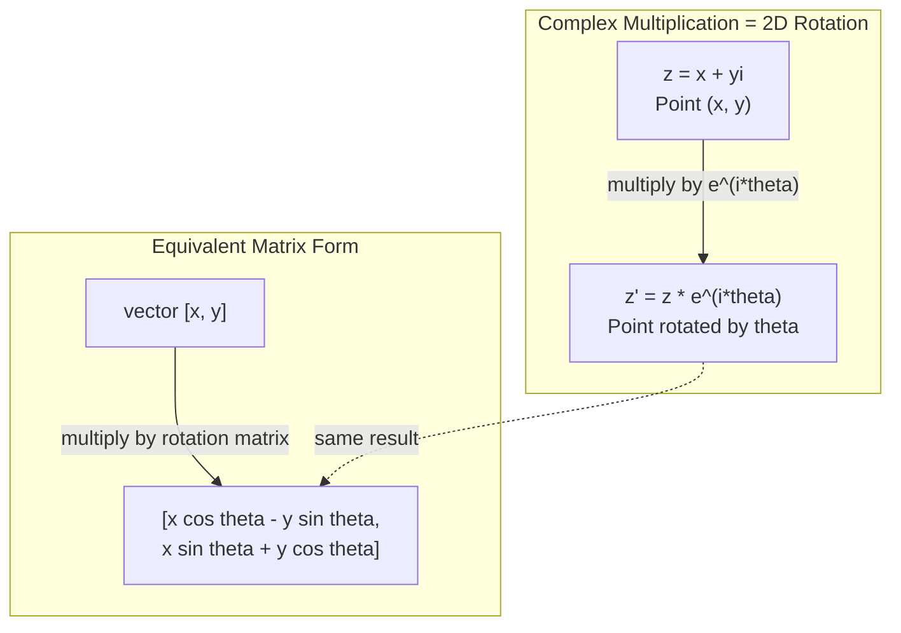
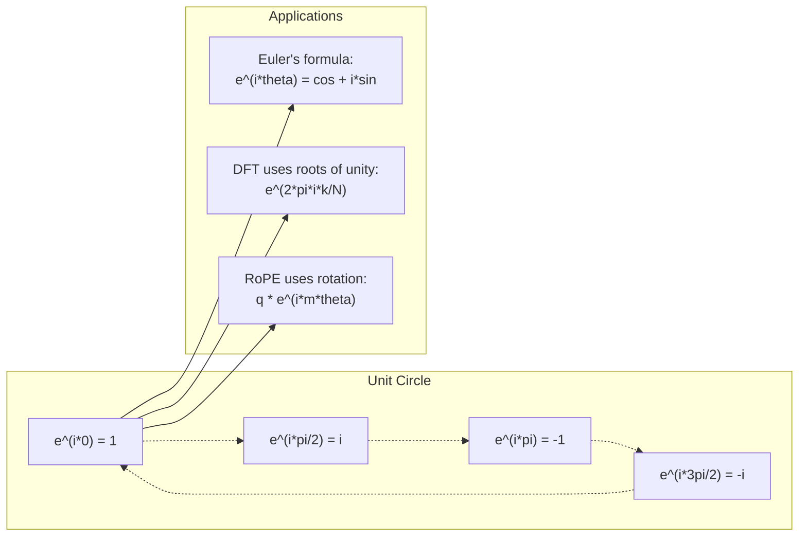

# AI 中中复数

> A raiz quadrada de -1 não é falsa. É a chave para a rotação, frequência e meio campo de processamento de sinais.

**Type:** Learn
**Language:**Python
**Prerequisites:** Phase 1, Lessons 01-04（linear algebra, calculus）
**Time:** ~60 分钟

## Objectivo de aprendizagem
- Em forma de linha reta e de extrema forma de坐标, executar o número de operações (加法、乘法、除法、共)
-  aplicar a fórmula de Euler em ∆ {\displaystyle \mathbb {\\displaystyle \mathbb {\\mathbb {\\mathbb {\\mathbb {\\mathbb {\\mathbb {\\mathbb {\\mathbb {\\mathbb {\\mathbb {\\mathbb {\\mathbb {\\mathbb {T}}}} }
- Utilize Duple Unit Root para implementar Transformação de Fourier discreta
- 解释复数旋转 如何构建变压器 中 RoPE 和正弦位置编码的基础

## 问题
Você abriu um artigo sobre as transformações de Fourier, por toda parte.`i`──你查看 Transformer 位置编码, ver diferentes frequências abaixo `sin`和 `cos` 也就是复指数的实部和虚部── você lê a quantical calculação, e descobre que tudo é usado para repetir o vector 空间 para expressar──

O número é um sistema matemático construído sobre a raiz quadrada de -1 e parece ser uma técnica matemática, mas não é uma técnica. É a linguagem natural da rotação e oscilação.

Se não entender o número duplo, você não consegue entender a Transformação de Fourier Discreta. Você não consegue entender a FFT. Você não consegue entender o RoPE em Modelo Moderno de Idiomas Modernos.

Esta aula irá começar do zero construção de quadros de cálculo, conectá-los à geometria, e exibir a posição do quadros em Machine Learning.

## 概念
### O que é o número?

O número de números tem duas partes:

```
z = a + bi

where:
  a is the real part
  b is the imaginary part
  i is the imaginary unit, defined by i^2 = -1
```

É assim. Você faz um eixo numérico expandir em uma superfície.

### 复数运算

**加法。**- Não, não, não.

```
(a + bi) + (c + di) = (a + c) + (b + d)i

Example: (3 + 2i) + (1 + 4i) = 4 + 6i
```

**乘法。**Utilize distribuição,并记住 i^2 = -1──

```
(a + bi)(c + di) = ac + adi + bci + bdi^2
                 = ac + adi + bci - bd
                 = (ac - bd) + (ad + bc)i

Example: (3 + 2i)(1 + 4i) = 3 + 12i + 2i + 8i^2
                            = 3 + 14i - 8
                            = -5 + 14i
```

**共轭。**翻转虚部的符号──

```
conjugate of (a + bi) = a - bi
```

Um multiplicador e o seu multiplicador são números reais:

```
(a + bi)(a - bi) = a^2 + b^2
```

**除法。**分子和分母同时乘以分母的共──

```
(a + bi) / (c + di) = (a + bi)(c - di) / (c^2 + d^2)
```

Isto vai acabar com a parte de divisão, obtendo um número de vezes mais puro.

### 复平面

复平面把每个复数映射到一个2D点――水平轴是实轴,垂直轴是虚轴――

```
z = 3 + 2i  corresponds to the point (3, 2)
z = -1 + 0i corresponds to the point (-1, 0) on the real axis
z = 0 + 4i  corresponds to the point (0, 4) on the imaginary axis
```

O número duplo é um vector de origem de um ponto, e também de um ponto.

### 极坐标形式

Qualquer ponto na superfície pode ser usado para descrevê-lo a distância do ponto de origem, bem como o ângulo do eixo real em relação a ele.

```
z = r * (cos(theta) + i*sin(theta))

where:
  r = |z| = sqrt(a^2 + b^2)     (magnitude, or modulus)
  theta = atan2(b, a)             (phase, or argument)
```

Formação directa (a + bi) adaptado à modalidade.

**极坐标形式下的乘法。**模长相乘, ângulo de imagem

```
z1 = r1 * e^(i*theta1)
z2 = r2 * e^(i*theta2)

z1 * z2 = (r1 * r2) * e^(i*(theta1 + theta2))
```

É por isso que o número de vezes é muito adequado para representar a rotação.

### A fórmula de Euler

O ponto de partida entre o índice de repunto e o triângulo:

```
e^(i*theta) = cos(theta) + i*sin(theta)
```

É a fórmula mais importante do curso.

```
e^(i*pi) = cos(pi) + i*sin(pi) = -1 + 0i = -1

Therefore: e^(i*pi) + 1 = 0
```

五个基本常数 ((e, i, pi, 1, 0) são conectados em um equácio juntos。

### Por que a fórmula de Euler para ML é importante?

A fórmula de Euler mostra,`e^(i*theta)`会随着太太 变化描绘单位圆――当太太 = 0 时,你在 (1, 0) ・当太太 = pi/2 时,你在 (0, 1) ・当太太 = pi 时,你在 (-1, 0) ・当太太 = 3*pi/2 时,你在 (0, -1) ・完整一圈旋转是太太 = 2*pi。

Isto significa que o índice de repetição é a rotação, enquanto a rotação não está presente no processamento de sinais e no ML.

### Contacto com 2D  rotativo

将复数 (x + yi) 乘以 e^(i*theta),会把点 (x, y) 周围原点旋转 theta 角──

```
Rotation via complex multiplication:
  (x + yi) * (cos(theta) + i*sin(theta))
  = (x*cos(theta) - y*sin(theta)) + (x*sin(theta) + y*cos(theta))i

Rotation via matrix multiplication:
  [cos(theta)  -sin(theta)] [x]   [x*cos(theta) - y*sin(theta)]
  [sin(theta)   cos(theta)] [y] = [x*sin(theta) + y*cos(theta)]
```

它们产生完全相同的结果──复数乘法就是 2D 旋转──旋转矩阵 只是用矩阵记法写出的复数乘法──



### Fázer e sinal de rotação

O índice de reapresentação e^(i*omega*t) é um ponto de rotação em torno de uma unidade de um círculo de um círculo de um círculo.

Esse movimento é um movimento de um movimento de um movimento.

```
e^(i*omega*t) = cos(omega*t) + i*sin(omega*t)

Real part:      cos(omega*t)    -- a cosine wave
Imaginary part: sin(omega*t)    -- a sine wave
```

É o modo de expressão do fator. Não se segue mais uma onda de cordas de um desvio, mas sim uma flecha de rotação plana.

### 单位根

N segundo ponto de divisão de unidades é N 个点:

```
w_k = e^(2*pi*i*k/N)    for k = 0, 1, 2, ..., N-1
```

Quando N = 4 时,根是:1, i, -1, -i(四个罗盘方向)
Quando N = 8 , você vai ter quatro direções, mais quatro direções em contra-esquina.

A unidade é a base da Transforma de Fourier Discreta.

### Contacto com DFT

信号 x[0], x[1], ..., x[N-1] de Transformação de Fourier Discreta é:

```
X[k] = sum_{n=0}^{N-1} x[n] * e^(-2*pi*i*k*n/N)
```

Cada X[k] mede o grau de correlação do sinal com a raiz da unidade k, ou seja, o grau de correlação com a frequência de uma onda de k de uma onda de k.

### Por que não estou a mentir?

Imaginary Esse termo é um acaso histórico.  Descartes 曾带带着轻蔑的意思使用它──但我并非比负数更虚──负数回答是:从3减到什么才能得到5? 虚数单位回答是:什么数平方后得到 -1?

Mais útil é entender que é um arco-íris de 90 graus. Se você coloca um número real multiplicado por i uma vez, você volta 90 graus para o eixo falso. Se você voltou a girar 90 graus para o eixo negativo, você volta 90 graus para o eixo falso. É por isso que i2 = -1 não é misterioso.

É por isso que o complexo não está em qualquer lugar no engenharia. Qualquer coisa que gira é adequada à descrição do complexo.

### 复指数 vs 三角函数

Antes da fórmula de Euler, o engenheiro escreveu sinais como A*cos(omega*t + phi) 振幅 A、frequency omega、相位 phi。 É possível, mas vai fazer o cálculo ficar doloroso。相加两个相位不同的余弦需要三角恒等式。

Utilize duplicate index, o mesmo sinal pode ser escrito como A*e^(i*(omega*t + phi))。相加两个信号只是相加两个复数──相乘(调制)只是模长相乘、角度相加──相位偏移变成角加法──频率偏移变成乘乘的phasor──

Todo o campo de processamento de sinais se tornou mais complexo, pois a matemática é mais limpa.

### Contacto com Transformer

**正弦位置编码**(原始 Transformer 论文):

```
PE(pos, 2i) = sin(pos / 10000^(2i/d))
PE(pos, 2i+1) = cos(pos / 10000^(2i/d))
```

Sin 和 cos 成对出现,它们是不同频率下复指数的实部和虚部──每个频率都为编码位置提供一种不同的分辨率──低频变化缓慢──粗略位置)──高频变化快速──精细位置──它们共同为每个位置提供独特频率纹──

**RoPE（Rotary Position Embedding）**Mais adiante. É obviamente usado para repetir a rotação de Matriz 乘以查询和键向量. A posição relativa entre dois Tokens se transforma em um ângulo de rotação. Atenção.

| Operation | Algebraic Form | Geometric Meaning |
|-----------|---------------|-------------------|
| 加法 | (a+c) + (b+d)i | 平面中的 Vector 加法 |
| 乘法 | (ac-bd) + (ad+bc)i | 旋转并缩放 |
| 共轭 | a - bi | 关于实轴反射 |
| 模长 | sqrt(a^2 + b^2) | 到原点的距离 |
| 相位 | atan2(b, a) | 相对正实轴的角度 |
| 除法 | multiply by conjugate | 反向旋转并重新缩放 |
| 幂 | r^n * e^(i*n*theta) | 旋转 n 次，按 r^n 缩放 |




```figure
roots-of-unity
```

## Construí-lo
### 步骤 1: Complexo 类

Construir um número complexo, apoiar o cálculo, a formação, a formação, e a transformação entre a forma de um esquema e a forma de um esquema.

```python
import math

class Complex:
    def __init__(self, real, imag=0.0):
        self.real = real
        self.imag = imag

    def __add__(self, other):
        return Complex(self.real + other.real, self.imag + other.imag)

    def __mul__(self, other):
        r = self.real * other.real - self.imag * other.imag
        i = self.real * other.imag + self.imag * other.real
        return Complex(r, i)

    def __truediv__(self, other):
        denom = other.real ** 2 + other.imag ** 2
        r = (self.real * other.real + self.imag * other.imag) / denom
        i = (self.imag * other.real - self.real * other.imag) / denom
        return Complex(r, i)

    def magnitude(self):
        return math.sqrt(self.real ** 2 + self.imag ** 2)

    def phase(self):
        return math.atan2(self.imag, self.real)

    def conjugate(self):
        return Complex(self.real, -self.imag)
```

### 步骤 2: 极坐标转换 com a fórmula de Euler

```python
def to_polar(z):
    return z.magnitude(), z.phase()

def from_polar(r, theta):
    return Complex(r * math.cos(theta), r * math.sin(theta))

def euler(theta):
    return Complex(math.cos(theta), math.sin(theta))
```

验证:`euler(theta).magnitude()`应始终为 1.0。`euler(0)`应给出 (1, 0)`euler(pi)`应给出 (-1, 0)

### 步骤 3: rotação

将点 (x, y) 旋转 the theta 角, apenas precisa de uma única multiplicidade multiplicada:

```python
point = Complex(3, 4)
rotated = point * euler(math.pi / 4)
```

模长保持不变──只有角度发生变──

### 步骤 4: DFT baseado em quadros de operações

```python
def dft(signal):
    N = len(signal)
    result = []
    for k in range(N):
        total = Complex(0, 0)
        for n in range(N):
            angle = -2 * math.pi * k * n / N
            total = total + Complex(signal[n], 0) * euler(angle)
        result.append(total)
    return result
```

É o DFT de O(N^2) ⋅ cada saída X[k] ⋅ são amostras de sinal multiplicadas pela unidade de raiz ⋅ ⋅ ⋅ ⋅ ⋅ ⋅ ⋅ ⋅ ⋅ ⋅ ⋅ ⋅ ⋅ ⋅ ⋅ ⋅ ⋅ ⋅ ⋅ ⋅ ⋅ ⋅ ⋅ ⋅ ⋅ ⋅ ⋅ ⋅ ⋅ ⋅ ⋅ ⋅ ⋅ ⋅ ⋅ ⋅ ⋅ ⋅ ⋅ ⋅ ⋅ ⋅ ⋅ ⋅ ⋅ ⋅ ⋅ ⋅ ⋅ ⋅ ⋅ ⋅ ⋅ ⋅ ⋅ ⋅ ⋅ ⋅ ⋅ ⋅ ⋅ ⋅ ⋅ ⋅ ⋅ ⋅ ⋅ ⋅ ⋅ ⋅ ⋅ ⋅ ⋅ ⋅ ⋅ ⋅ ⋅ ⋅ ⋅ ⋅ ⋅ ⋅ ⋅ ⋅ ⋅ ⋅ ⋅ ⋅ ⋅ ⋅ ⋅ ⋅ ⋅ ⋅ ⋅ ⋅ ⋅ ⋅ ⋅ ⋅ ⋅ ⋅ ⋅ ⋅ ⋅ ⋅ ⋅ ⋅ ⋅ ⋅ ⋅ ⋅ ⋅                                                                                                                                                                                                                                                            

### 步骤 5: DFT inverso

A DFT inversa irá reedificar o sinal original do espectro de frequência. Em comparação com a DFT em direção à direção, a única variação é: símbolo no índice de transformação, e é dividido em N.

```python
def idft(spectrum):
    N = len(spectrum)
    result = []
    for n in range(N):
        total = Complex(0, 0)
        for k in range(N):
            angle = 2 * math.pi * k * n / N
            total = total + spectrum[k] * euler(angle)
        result.append(Complex(total.real / N, total.imag / N))
    return result
```

Isso dará uma reconstrução perfeita. Primeiro aplicar DFT, reaplicar IDFT, você obterá o sinal original dentro da precisão da máquina.

### 步骤 6: unidade

```python
def roots_of_unity(N):
    return [euler(2 * math.pi * k / N) for k in range(N)]
```

验证 duas características:
- Cada raiz é de um.
- Elas são, em geral, um dos principais factores que contribuem para a construção de uma sociedade.

Estes elementos fazem com que a DFT seja reversível.

## Use-o
Python 内置支持复数──字面量 `j`Expressão de números de unidades.

```python
z = 3 + 2j
w = 1 + 4j

print(z + w)
print(z * w)
print(abs(z))

import cmath
print(cmath.phase(z))
print(cmath.exp(1j * cmath.pi))
```

Para o número, não há número original:

```python
import numpy as np

z = np.array([1+2j, 3+4j, 5+6j])
print(np.abs(z))
print(np.angle(z))
print(np.conj(z))
print(np.real(z))
print(np.imag(z))

signal = np.sin(2 * np.pi * 5 * np.linspace(0, 1, 128))
spectrum = np.fft.fft(signal)
freqs = np.fft.fftfreq(128, d=1/128)
```

## Entrega-o
运行 `code/complex_numbers.py`Para gerar`outputs/skill-complex-arithmetic.md`- Não.

## 练习
1. **手算复数运算。**計算 (2 + 3i) * (4 - i),并用代码验证──然后计算 (5 + 2i) / (1 - 3i)──把两个结果都画在复平面上,并检查乘法是否旋转并缩放第一数──

2. **旋转序列。**Desde o ponto (1, 0) 开始──连续乘以 e^(i*pi/6) 十二次──验证 12 次乘法后你会回到 (1, 0)──印印每一步的坐标,并确认它们描绘出一个正 12 边形──

3. **已知信号的 DFT。**创建一个信号,它在32个点上采样 sin(2*pi*3*t) 与 0.5*sin(2*pi*7*t) 之和──运行你的DFT──验证幅度频谱在频率 3 和 7 处有峰值,并且频率 7 处的峰值高度是频率 3 处的一半──

4. **单位根可视化。**計算 8 次单位根──验证它们的和为零──验证任意根乘以本原根 e^(2 *pi*i/8) 都会得到下一个根──

5. **旋转 Matrix 等价性。**Para 10 ângulos e 10 ângulos, os resultados da prova de multiplicidade multiplicada são os mesmos que os resultados da matriz rotativa de 2x2  executar o vector de multiplicidade matriz                                                                                                                                                                                                                                                                                                                                                                                                                                                                                

## 关键术语
| Term | What it means |
|------|---------------|
| 复数 | 形如 a + bi 的数，其中 a 是实部，b 是虚部，并且 i^2 = -1 |
| 虚数单位 | 数 i，定义为 i^2 = -1。它在哲学意义上并不“虚”——它是一个旋转算子 |
| 复平面 | x 轴为实轴、y 轴为虚轴的 2D 平面。也称为 Argand plane |
| 模长（模） | 到原点的距离：sqrt(a^2 + b^2)。写作 \|z\| |
| 相位（辐角） | 相对正实轴的角度：atan2(b, a)。写作 arg(z) |
| 共轭 | 关于实轴的镜像：a + bi 的共轭是 a - bi |
| 极坐标形式 | 将 z 表示为 r * e^(i*theta)，而不是 a + bi。让乘法变得容易 |
| Euler's formula | e^(i*theta) = cos(theta) + i*sin(theta)。连接指数函数与三角函数 |
| Phasor | 表示正弦信号的旋转复数 e^(i*omega*t) |
| 单位根 | k = 0 到 N-1 时的 N 个复数 e^(2*pi*i*k/N)。单位圆上等间隔的 N 个点 |
| DFT | Discrete Fourier Transform。使用单位根将信号分解为复正弦分量 |
| RoPE | Rotary Position Embedding。使用复数乘法在 Transformer Attention 中编码相对位置 |

## 延伸阅读
- [Visual Introduction to Euler's Formula](https://betterexplained.com/articles/intuitive-understanding-of-eulers-formula/)- Em circunstâncias de não utilização de jornal pesado
- [Su et al.: RoFormer (2021)](https://arxiv.org/abs/2104.09864)-  propõe o uso de repetidas rotações de rotário posição de inserção de
- [Vaswani et al.: Attention Is All You Need (2017)](https://arxiv.org/abs/1706.03762)-  propositar o original Transformer 论文
- [3Blue1Brown: Euler's formula with introductory group theory](https://www.youtube.com/watch?v=mvmuCPvRoWQ)- Para o que e^(i*pi) = -1 de explicação visual
- [Needham: Visual Complex Analysis](https://global.oup.com/academic/product/visual-complex-analysis-9780198534464)-                                                                                                                                                                                                                                                                                                                                                                                                                                                                                                                             
- [Strang: Introduction to Linear Algebra, Ch. 10](https://math.mit.edu/~gs/linearalgebra/)- Número de números e de caracteres
