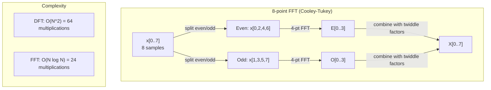
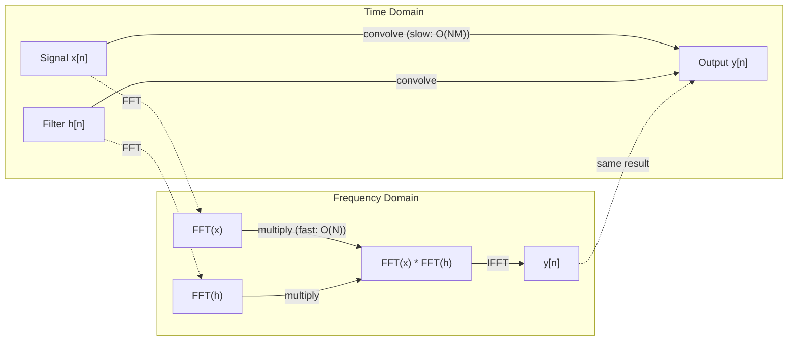

# Transformação de Fourier

> Cada sinal é uma superposição de ondas sinusais. A transformação de Fourier vai dizer-lhe qual é.

**Type:** Build
**Language:**Python
**Prerequisites:** Phase 1, Lessons 01-04, 19 (complex numbers)
**Time:** ~90 分钟

## Objectivo de aprendizagem
- Desde zero realizar DFT,并使用 O(N log N) de Cooley-Tukey FFT 验证它
- Compreender os coeficientes de frequência: do sinal para a amplitude, fase e espectro de potência
-  aplicar teorema de convolução, através da multiplicação FFT  executar convolução
- A descomposição de frequência de Fourier com codificação posicional do transformador e camadas de convolução da CNN  liga-se

## 问题
Uma série de valores de pressão que variam com o tempo. O preço de ação é uma série de valores de pixel intensidades em espaço.

Mas muitos padrões no domínio do tempo são invisíveis. Este sinal de áudio é um tom puro ou um acorde?

A transformação de Fourier irá transferir dados do domínio do tempo para o domínio da frequência. Ele recebe um sinal e o descompõe em ondas sinusais de diferentes frequências. Cada onda sinusa tem uma amplitude e uma fase.

Isto é importante para o ML, porque o pensamento de domínio de frequência 隨處可见──Convolutional neural networks 執行 convolution,而 convolution在頻域中就是乘法──Transformer positional encodings  使用頻度分解 来表示位置──Audio models(speech recognition、music generation) Processing spectrograms,也就是声音的频率表示──Time series models 会寻找周期性模式──理解Fourier transform,让你具备处理这些问题所需的词汇──

## 概念
### A definição de DFT

给定 N 个样本 x[0],x[1], ..., x[N-1],Discrete Fourier Transform 会生成 N 个 frequência coeficientes X[0], X[1], ..., X[N-1]:

```
X[k] = sum_{n=0}^{N-1} x[n] * e^(-2*pi*i*k*n/N)

for k = 0, 1, ..., N-1
```

Cada X[k] são números complexos. Sua magnitude. X[k] também representa a amplitude da frequência k.

关键洞见:`e^(-2*pi*i*k*n/N)`É um fator de rotação em frequência k. O DFT calcula a correlação entre o sinal e N 个等间隔频率. Se o sinal em frequência k 上包含能量, a correlação é muito grande.

### O significado de cada número

**X[0]: DC component。**É a soma de todas as amostras, com a proporção média de 成── é a constante de sinal de zero-freqüência (offset).

```
X[0] = sum_{n=0}^{N-1} x[n] * e^0 = sum of all samples
```

**X[k] for 1 <= k <= N/2: positive frequencies。**X[k] indicam cada N 个 amostras 中 k 个 ciclos de frequência──k 越大, frequência 越高(oscillação 越快)──

**X[N/2]: Nyquist frequency。**É a maior frequência que N 个 amostras podem representar.

**X[k] for N/2 < k < N: negative frequencies。**对于真实值信号,X[N-k] = conj(X[k])。频率负是正的镜像──这就是为什么有用信息位于前 N/2 + 1 个系数中──

### DFT inverso

Reversos DFT de frequência de coefícios Reconstruir sinal original:

```
x[n] = (1/N) * sum_{k=0}^{N-1} X[k] * e^(2*pi*i*k*n/N)

for n = 0, 1, ..., N-1
```

É a única diferença entre o DFT de frente e o símbolo do exponente em meio é que o símbolo é positivo, e tem um fator de normalização 1/N.

O DFT inverso é uma reconstrução perfeita. Não perde qualquer informação. Você pode passar do domínio do tempo ao domínio da frequência, voltar e não produzir qualquer erro.

### A FFT: a acelerar

Como definido acima, o DFT é O (N^2): para cada um dos coeficientes de saída N, temos que fazer uma operação em N = 1 milhão de horas.

A Transformação de Fourier Rápida (FFT) será calculada com O  N log N 計算同等結果──当 N = 1 milhão 时, isso é aproximadamente 20000000 vezes operações, e não um milhão de vezes── isso faz com que a análise de frequência 变得可行──

Algoritmo Cooley-Tukey (((mais comum FFT) usar dividir e conquistar:

1. O sinal será dividido em amostras indexadas e paradas.
2. 递归计算每一半的DFT──
3. Utilize "factores de dupla" e^(-2*pi*i*k/N) 合并两个半尺寸DFTs。

```
X[k] = E[k] + e^(-2*pi*i*k/N) * O[k]          for k = 0, ..., N/2 - 1
X[k + N/2] = E[k] - e^(-2*pi*i*k/N) * O[k]    for k = 0, ..., N/2 - 1

where E = DFT of even-indexed samples
      O = DFT of odd-indexed samples
```

Esta simetria significa que cada um dos níveis de execução de O (n) trabalho, e também há log2 (n) níveis (s) ⋅



FFT  requer comprimento de sinal é 2 ── Na prática, os sinais normalmente vão para pad zero até o próximo 2 ──

### Análise espectral

**power spectrum**É X [k] que é 2, ou seja, a magnitude quadrada de cada coeficiente de frequência.

**phase spectrum**É o ângulo ((X[k]), também é o offset de fase de cada frequência. Para a maioria das tarefas de análise, você se preocupa com o espectro de potência,并会忽略相──

```
Power at frequency k:  P[k] = |X[k]|^2 = X[k].real^2 + X[k].imag^2
Phase at frequency k:  phi[k] = atan2(X[k].imag, X[k].real)
```

### Resolução de frequência

A resolução de frequência do DFT depende das amostras num número N e da taxa de amostragem fs。

```
Frequency of bin k:      f_k = k * fs / N
Frequency resolution:    delta_f = fs / N
Maximum frequency:       f_max = fs / 2  (Nyquist)
```

Para distinguir duas frequências muito próximas, você precisa de mais amostras. Para capturar frequências altas, você precisa de uma taxa de amostragem mais alta.

### O teorema da convolução

É um dos resultados mais importantes do processamento de sinais e está diretamente relacionado com as CNNs.

**time domain 中的 convolution 等于 frequency domain 中的 pointwise multiplication。**

```
x * h = IFFT(FFT(x) . FFT(h))

where * is convolution and . is element-wise multiplication
```

Por que é importante:

- 两个长度为 N 和 M de sinais 直接卷曲 需要 O(N*M) operações。
- Baseada em FFT de convolução 需要 O(N log N):transform 两者、multiply、transform back。
- Para os núcleos grandes, a convolução FFT vai ser rápida.
- Isto é o que acontece nas camadas convolucionais com grandes campos receptivos.

Nota:DFT  calcular é uma convulsão circular (signal 会 wrap around) ・・・ Para convulsão linear (linear convulsão) ⋅ não wraparound (linear convulsão) ⋅ para calcular, os dois sinais serão zero pad até a longitude N + M - 1―



### Janela

DFT 假设信号是周期的,也就是把N个样本视为无限重复信号的一个周期――如果信号的起点和终点不是相同的值,就会在边界产生不连续性,并表现为虚假的高频内容――这称为光谱泄漏──

O tempo de exposição da janela em cálculo DFT anterior será o sinal 两端 taper到零, reduzindo assim a fuga.

Janela de frequência:

| Window | Shape | Main lobe width | Side lobe level | Use case |
|--------|-------|----------------|-----------------|----------|
| Rectangular | 平坦（无 window） | 最窄 | 最高 (-13 dB) | 当 signal 在 N 个 samples 中正好 periodic 时 |
| Hann | Raised cosine | 中等 | 低 (-31 dB) | 通用 spectral analysis |
| Hamming | Modified cosine | 中等 | 更低 (-42 dB) | Audio processing、speech analysis |
| Blackman | Triple cosine | 宽 | 非常低 (-58 dB) | 当 side lobe suppression 至关重要时 |

```
Hann window:    w[n] = 0.5 * (1 - cos(2*pi*n / (N-1)))
Hamming window: w[n] = 0.54 - 0.46 * cos(2*pi*n / (N-1))
```

Antes de DFT, a janela será aplicada com o sinal para multiplicação de elementos:`X = DFT(x * w)`- Não.

### Propriedades DFT

| Property | Time Domain | Frequency Domain |
|----------|-------------|-----------------|
| Linearity | a*x + b*y | a*X + b*Y |
| Time shift | x[n - k] | X[f] * e^(-2*pi*i*f*k/N) |
| Frequency shift | x[n] * e^(2*pi*i*f0*n/N) | X[f - f0] |
| Convolution | x * h | X * H (pointwise) |
| Multiplication | x * h (pointwise) | X * H (circular convolution, scaled by 1/N) |
| Parseval's theorem | sum \|x[n]\|^2 | (1/N) * sum \|X[k]\|^2 |
| Conjugate symmetry (real input) | x[n] real | X[k] = conj(X[N-k]) |

Teorema de Parseval expressa energia total em dois domínios entre os mesmos.

### Com relação a codificações posicionais

Origins Transformer Utilize sinusoidal codificação posicional:

```
PE(pos, 2i)   = sin(pos / 10000^(2i/d_model))
PE(pos, 2i+1) = cos(pos / 10000^(2i/d_model))
```

Cada parede de dimensões (2i, 2i+1) oscila com diferentes frequências. Frequências de alta (dimensão 0,1) a baixa (final) dimensões) em intervalos geométricos.

Ele fornece propriedades-chave:

- **Uniqueness:**Qualquer duas posições não terão a mesma codificação.
- **Bounded values:**Sin 和 cos 始终在 [-1, 1] 内。
- **Relative position:**A codificação de posição p+k pode ser expressa como uma função linear de posição p 处 codificação──modelo pode aprender a concentrar-se em posições relativas──

### Conexão com as CNNs

A camada de convolução 通過在信号或图像 上滑动一个学会过器 (kernel),将将其应用到输入――数学上,这就是 convolution operation――

De acordo com o teorema da convolução, isso é igual a:
1. Para entrada  execução FFT
2. Para o kernel  executar FFT
3. Multiplicar no domínio de frequência
4. Para efeitos da execução do IFFT

标准 CNN 实现使用直接卷积 (convolução direta) 对小型3x3 kernels 更快) . Mas para grandes kernels ou convolução global, baseada em FFT métodos será significativamente mais rápido. Algumas arquiteturas (por exemplo, FNet) totalmente usando FFT 替代注意,在 O(N log N) 而非 O(N^2) complexidade 下获得有竞争力的精度.

### Espectogramas e Transformação Fourier de Curto Tempo

单次 FFT 将给出整个信号的频率内容,但不能告诉你这些频率何时出现──p频率 随着时间的增加信号) 和弦所有频率同时存在) 可能具有相同的 magnitudo谱──

Transformação de Fourier de Tempo Curto (STFT)  através de janelas sobrepostas de sinal  上计算 FFT 来解决这个问题──结果是谱谱图:一种2D representação,其中一个轴是时间,另一个轴是频率──每个点的强度表示该时间上该频率的能量──

```
STFT procedure:
1. Choose a window size (e.g., 1024 samples)
2. Choose a hop size (e.g., 256 samples -- 75% overlap)
3. For each window position:
   a. Extract the windowed segment
   b. Apply a Hann/Hamming window
   c. Compute FFT
   d. Store the magnitude spectrum as one column of the spectrogram
```

Espectogramas são a representação padrão de entrada de modelos de áudio ML. Modelos de reconhecimento de fala (Whisper, DeepSpeech) processam espectrogramas mel, ou seja, as frequências são mapeadas até a escala mel, o que se ajusta mais à percepção de pitch humana.

### Aliasing

Se o sinal incluir frequências superiores a fs/2 (frequência Nyquist), a taxa de amostragem fs irá produzir cópias alias.

```
Example:
  True signal: 90 Hz sine wave
  Sampling rate: 100 Hz
  Apparent frequency: 100 - 90 = 10 Hz

  The samples from the 90 Hz signal at 100 Hz sampling rate
  are identical to the samples from a 10 Hz signal.
  No amount of math can recover the original 90 Hz.
```

É por isso que os conversores analógicos para digitais contêm filtros anti-aliasing, em amostragem. Antes de moverem-se para as frequências de Nyquist.

### O padding zero não vai melhorar a resolução

Um erro comum é: em FFT antes de um sinal  realizar padagem zero 会提升频分辨率──它不会──零 padding 只是在现有频段之间插值,让光谱看起来更平滑──但它无法揭露原始样品中不存在的频率细节──

A resolução de frequência verdadeira depende apenas do tempo de observação T = N / fs──para distinguir a diferença entre as duas frequências delta_f, você precisa pelo menos de dados T = 1 / delta_f 秒──para fazer qualquer coisa de zero-padding, não é possível mudar este limite fundamental──


```figure
fourier-synthesis
```

## Construí-lo
### 步骤 1: DFT a partir do zero

O ((N^2) DFT 直接来自定义──

```python
import math

class Complex:
    ...

def dft(x):
    N = len(x)
    result = []
    for k in range(N):
        total = Complex(0, 0)
        for n in range(N):
            angle = -2 * math.pi * k * n / N
            w = Complex(math.cos(angle), math.sin(angle))
            xn = x[n] if isinstance(x[n], Complex) else Complex(x[n])
            total = total + xn * w
        result.append(total)
    return result
```

### 步骤 2: DFT inverso

结构相同, exponente 为正,并除以 N。

```python
def idft(X):
    N = len(X)
    result = []
    for n in range(N):
        total = Complex(0, 0)
        for k in range(N):
            angle = 2 * math.pi * k * n / N
            w = Complex(math.cos(angle), math.sin(angle))
            total = total + X[k] * w
        result.append(Complex(total.real / N, total.imag / N))
    return result
```

### 步骤 3: FFT (Cooley-Tukey)

FFT recorrente 要求长度为 2 的──拆分为 even 和 odd,递归, então usar fatores de bico 合并──

```python
def fft(x):
    N = len(x)
    if N <= 1:
        return [x[0] if isinstance(x[0], Complex) else Complex(x[0])]
    if N % 2 != 0:
        return dft(x)

    even = fft([x[i] for i in range(0, N, 2)])
    odd = fft([x[i] for i in range(1, N, 2)])

    result = [Complex(0)] * N
    for k in range(N // 2):
        angle = -2 * math.pi * k / N
        twiddle = Complex(math.cos(angle), math.sin(angle))
        t = twiddle * odd[k]
        result[k] = even[k] + t
        result[k + N // 2] = even[k] - t
    return result
```

### 步骤 4: Auxiliares de análise espectral

```python
def power_spectrum(X):
    return [xk.real ** 2 + xk.imag ** 2 for xk in X]

def convolve_fft(x, h):
    N = len(x) + len(h) - 1
    padded_N = 1
    while padded_N < N:
        padded_N *= 2

    x_padded = x + [0.0] * (padded_N - len(x))
    h_padded = h + [0.0] * (padded_N - len(h))

    X = fft(x_padded)
    H = fft(h_padded)

    Y = [xk * hk for xk, hk in zip(X, H)]

    y = idft(Y)
    return [y[n].real for n in range(N)]
```

## Use-o
Em trabalho real, usando o Numpy de FFT, é apoiado por bibliotecas C altamente optimizadas.

```python
import numpy as np

signal = np.sin(2 * np.pi * 5 * np.arange(256) / 256)
spectrum = np.fft.fft(signal)
freqs = np.fft.fftfreq(256, d=1/256)

power = np.abs(spectrum) ** 2

positive_freqs = freqs[:len(freqs)//2]
positive_power = power[:len(power)//2]
```

对于窗户和更高级的光谱分析:

```python
from scipy.signal import windows, stft

window = windows.hann(256)
windowed = signal * window
spectrum = np.fft.fft(windowed)
```

 Para a convulsão:

```python
from scipy.signal import fftconvolve

result = fftconvolve(signal, kernel, mode='full')
```

 Para os espectrogramas:

```python
from scipy.signal import stft

frequencies, times, Zxx = stft(signal, fs=sample_rate, nperseg=256)
spectrogram = np.abs(Zxx) ** 2
```

Espectograma Matrix forma é (n_frequências, n_time_frames) ⋅ cada linha são uma janela de tempo ⋅ power spectrum ⋅ é o modelo de áudio ML ⋅ como entrada ⋅ consumação ⋅

## Entrega-o
运行 `code/fourier.py` 生成`outputs/prompt-spectral-analyzer.md`- Não.

## 练习
1. **Pure tone identification。**                                                                                                                                                                                                                                                                                                                                                                                                                                                                                                                             

2. **FFT vs DFT verification。**生成一个长度为 64 的随机信号――同时计算 DFT(O(N^2)) 和 FFT──验证所有系数在 1e-10 以内匹配──在长度为 256、512、1024 和 2048 的信号上分别计时两个函数──绘制 DFT time 与 FFT time 的比例──

3. **Convolution theorem proof by example。**创建信号 x = [1, 2, 3, 4, 0, 0, 0, 0] 和 filter h = [1, 1, 1, 0, 0, 0, 0, 0]──直接计算它们的圆形卷积 (圆形卷积) ─然后通过FFT 计算(transform、multiply、inverse transform) ─验证结果匹配──现在通过适当的零执行线形卷积──

4. **Windowing effects。**Crear um sinal, é 10 Hz 和 12 Hz( muito próximo) duas ondas sinusais de和──以 128 Hz amostragem 1 秒──分别在无窗、汉窗 和汉窗 下计算电源谱──哪个窗是最容易区分两个峰?为什么?

5. **Positional encoding analysis。**Por d_modelo = 128 和 max_pos = 512 生成 sinusidal positional encodings──对每一对位置 (p1, p2),计算它们编码的点产品──说明点产品 只依赖于p1 - p2的位置,而不依赖于绝对位置──随着距离 增加,点产品会发生什么?

## 关键术语
| Term | What it means |
|------|---------------|
| DFT (Discrete Fourier Transform) | 将 N 个 time-domain samples 转换为 N 个 frequency-domain coefficients。每个 coefficient 都是与该 frequency 上 complex sinusoid 的 correlation |
| FFT (Fast Fourier Transform) | 用于计算 DFT 的 O(N log N) algorithm。Cooley-Tukey algorithm 递归拆分 even/odd indices |
| Inverse DFT | 从 frequency coefficients 重建 time-domain signal。公式与 DFT 相同，但 exponent sign 相反，并带有 1/N scaling |
| Frequency bin | DFT output 中的每个 index k 表示 frequency k*fs/N Hz。"bin" 是离散的 frequency slot |
| DC component | X[0]，zero-frequency coefficient。与 signal mean 成比例 |
| Nyquist frequency | fs/2，在 sampling rate fs 下可表示的最大 frequency。高于它的 frequencies 会 alias |
| Power spectrum | \|X[k]\|^2，每个 frequency coefficient 的 squared magnitude。显示 energy 在 frequencies 上的分布 |
| Phase spectrum | angle(X[k])，每个 frequency component 的 phase offset。在 analysis 中通常会忽略 |
| Spectral leakage | 将 non-periodic signal 当作 periodic 处理导致的虚假 frequency content。可通过 windowing 减少 |
| Window function | 在 DFT 前应用的 tapering function（Hann、Hamming、Blackman），用于减少 spectral leakage |
| Twiddle factor | FFT butterfly computation 中用于合并 sub-DFTs 的 complex exponential e^(-2*pi*i*k/N) |
| Convolution theorem | time domain 中的 convolution 等于 frequency domain 中的 pointwise multiplication。它是 signal processing 和 CNNs 的基础 |
| Circular convolution | signal 会 wrap around 的 convolution。这是 DFT 自然计算的内容 |
| Linear convolution | 没有 wraparound 的标准 convolution。通过在 DFT 前 zero-padding 实现 |
| Parseval's theorem | 总 energy 在 Fourier transform 中保持不变。sum \|x[n]\|^2 = (1/N) sum \|X[k]\|^2 |
| Aliasing | 当 sampling rate 不足时，高于 Nyquist 的 frequencies 表现为较低 frequencies |

## 延伸阅读
- [Cooley & Tukey: An Algorithm for the Machine Calculation of Complex Fourier Series (1965)](https://www.ams.org/journals/mcom/1965-19-090/S0025-5718-1965-0178586-1/)-                                                                                                                                                                                                                                                                                                                                                                                                                                                                                                                             
- [3Blue1Brown: But what is the Fourier Transform?](https://www.youtube.com/watch?v=spUNpyF58BY)-  Sobre as melhores transformações de Fourier
- [Lee-Thorp et al.: FNet: Mixing Tokens with Fourier Transforms (2021)](https://arxiv.org/abs/2105.03824)- Em transformadores , em vez de auto-atentação ,
- [Smith: The Scientist and Engineer's Guide to Digital Signal Processing](http://www.dspguide.com/)- 免费在线教材, abrangendo profundamente FFT, vidro e análise espectral
- [Vaswani et al.: Attention Is All You Need (2017)](https://arxiv.org/abs/1706.03762)- Descomposição de frequência de Fourier  Derivados de codificações sinusoidais de posição
- [Radford et al.: Whisper (2022)](https://arxiv.org/abs/2212.04356)- Utilize mel-spectrogramas  como representação de entrada de reconhecimento de fala
