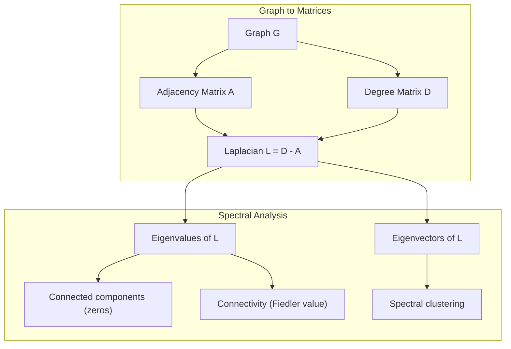
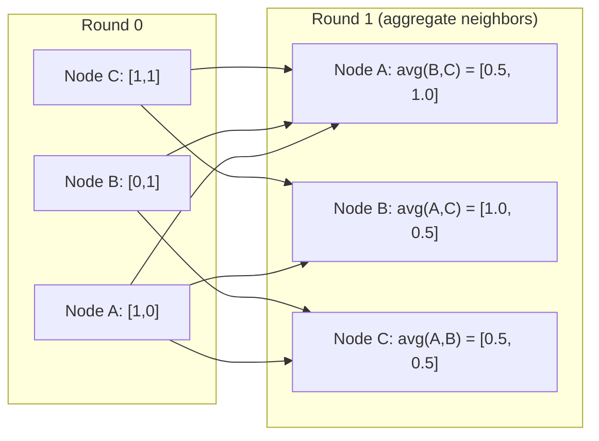

# 面向 Machine Learning                                                                                                                                                                                                                                                                                                                                                                                                                                                                                                                         

> O gráfico é uma estrutura de dados de relacionamento. Se os seus dados contêm ligações, você precisa de teoria de gráficos.

**Type:** Build
**Language:**Python
**Prerequisites:** Phase 1, Lessons 01-03（linear algebra, matrices）
**Time:** ~90 分钟

## Objectivo de aprendizagem
- Construir uma classe de gráfico, contendo matriz/lista adjacente  表示,并实现 BFS 和 DFS 遍历
- 计算 graph Laplacian,并使用其自身值 检测连接组件 和对节点 聚类
- 将一轮 GNN 风格的消息传递 实现为正常化邻接矩阵乘法
- Utilize Fiedler vector  aplicar agrupamento espectral para dividir gráfico

## 问题
Redes sociais, moléculas, bases de conhecimento, redes de citações, mapas de estrada são gráficos. Tradicionalmente, a linguagem de texto gerada por computadores (ML) é uma forma de comunicação.

考虑一个社交网络――你想预测某用户会购买什么产品――他们的购买历史很重要――但他们朋友的购买历史更重要――连接本身承载信号――

Ou pensar numa molécula. Você pensa prever se ela vai se juntar a uma proteína.

Graph Neural Networks (GNNs) são os campos de crescimento mais rápido no Deep Learning. Eles impulsionam a descoberta de drogas, recomendação social, detecção de fraudes e raciocínio gráfico de conhecimento.

Precisas de quatro coisas:
1. Uma forma de mostrar gráficos para matrizes (para que você possa fazer multiplicações para eles)
2. Usado para explorar a estrutura do gráfico de algoritmos de travessia
3. Laplacian, é a teoria dos gráficos espectrais.
4. Mensagem de passagem, é fazer GNNs 工作的操作

## 概念
### Gráficos: nós e bordas

Um gráfico G = (V, E) dos vértices (nodos) V 和 bordas E 组成──每条 edge 连接两个节点──

**Directed vs undirected。**Em gráfico não direcionado, edge (u, v) mostra u 连接到 v,并且 v também连接到 u── em gráfico não direcionado, edge (u, v) mostra u 指向 v, mas反向不一定成立──

**Weighted vs unweighted。**Em gráficos não ponderados, bordas devem existir ou não existir. Em gráficos ponderados, cada bordas tem um peso numérico, como distância, custo ou força.

| Graph type | Example |
|-----------|---------|
| Undirected, unweighted | Facebook friendship network |
| Directed, unweighted | Twitter follow network |
| Undirected, weighted | Road map（distances） |
| Directed, weighted | Web page links（PageRank scores） |

### A Matriz de Adjacência

Matriz de adjacência A é o núcleo de um gráfico que contém n 个 nós:

```
A[i][j] = 1    if there is an edge from node i to node j
A[i][j] = 0    otherwise
```

对于不方向图,A 是对称:A[i][j] = A[j][i]。对于权重图,A[i][j] =边 (i, j) 的重量。

**示例：一个 triangle：**

```
Nodes: 0, 1, 2
Edges: (0,1), (1,2), (0,2)

A = [[0, 1, 1],
     [1, 0, 1],
     [1, 1, 0]]
```

Matriz adjacente é cada entrada de GNN.

### Graduação

Grafico de entrada e saída do ponto de entrada.

Matriz de graus D é diagonal:

```
D[i][i] = degree of node i
D[i][j] = 0    for i != j
```

Para o triângulo exemplo:D = diagonal ((2, 2, 2), pois cada nó está conectado a outros dois nós.

Grau 告诉你节点的重要性──High degree = hub node──a distribuição de graus de uma rede 揭示了它的结构──social networks 遵循电力规律──少量枢纽,许多叶节)──random graphs 具有波森分布级──

### BFS e DFS

Dois algoritmos básicos de travesso gráfico.

**Breadth-First Search (BFS)：**Primeiro explorar todos os vizinhos, reexplorar vizinhos de vizinhos.

```
BFS from node 0:
  Visit 0
  Queue: [1, 2]        (neighbors of 0)
  Visit 1
  Queue: [2, 3]        (add neighbors of 1)
  Visit 2
  Queue: [3]           (neighbors of 2 already visited)
  Visit 3
  Queue: []            (done)
```

BFS em gráficos não ponderados encontrar os caminhos mais curtos. A distância do ponto de partida para qualquer nó é igual ao nível BFS do nó da primeira vez que é encontrado. É por isso que BFS será usado nas redes sociais.

**Depth-First Search (DFS)：**Na recuperação, o máximo possível de profundidade.

```
DFS from node 0:
  Visit 0
  Stack: [1, 2]        (neighbors of 0)
  Visit 2               (pop from stack)
  Stack: [1, 3]         (add neighbors of 2)
  Visit 3               (pop from stack)
  Stack: [1]
  Visit 1               (pop from stack)
  Stack: []             (done)
```

DFS pode ser utilizado:
- 查找 componentes conectados(从未访问的节点 运行 DFS)
- Detecção de ciclo ((DFS árvore 中的后边)
- Classificação topológica (reverso para a ordem de finalização do DFS)

| Algorithm | Data structure | Finds | Use case |
|-----------|---------------|-------|----------|
| BFS | Queue | Shortest paths | Social network distance, knowledge graph traversal |
| DFS | Stack | Components, cycles | Connectivity, topological sort |

### O gráfico laplaciano

L = D - A。 teoria dos gráficos espectrais 中最重要的矩阵──

 Para o triângulo:

```
D = [[2, 0, 0],    A = [[0, 1, 1],    L = [[2, -1, -1],
     [0, 2, 0],         [1, 0, 1],         [-1, 2, -1],
     [0, 0, 2]]         [1, 1, 0]]         [-1, -1,  2]]
```

Laplaciano 具有非常重要的性质:

1. **L 是 positive semi-definite。**Todos os valores próprios são >= 0

2. **zero eigenvalues 的数量等于 connected components 的数量。**Um gráfico conectado 恰恰有一个零 eigenvalue──一个有3 个离线组件的图片──三个零 eigenvalue──

3. **最小的 non-zero eigenvalue（Fiedler value）衡量 connectivity。**较大的Fiedler value 表示图 连接良好──较小的Fiedler value 表示图 有一个薄弱点,也就是瓶──

4. **Fiedler value 的 eigenvector（Fiedler vector）揭示最佳切分。**值为正的节点 进入一组,值为负的节点 进入另一组──这是光谱集群──



### Propriedades Espectrais

Os valores próprios da matriz adjacente e do Laplaciano podem revelar propriedades estruturais em caso de não fazer qualquer travessia.

**Spectral clustering**É o seguinte:
1. 计算 Laplacian L
2. 找到 L's k 个最小 eigenvectors(跳过第一个; para os gráficos conectados, é全 1)
3. Para usar estes vetores próprios como um novo padrão de cada nó
4. Em estas sessões, o que significa

Por que isso é válido? Os vetores próprios de L  codificados no gráfico                                                                                                                                                                                                                                                     

**Random walk connection。**Normal Laplacian 与 graph 上的随机走行 有关──随机走行的静止分布 与节点度 成比例──混合时间(步行 收得有多快) depende da lacuna espectral──

### Mensagem de passagem

É o núcleo das redes neurais gráficas. Cada nó coleciona mensagens de seus vizinhos, as agrega e, depois, atualiza o seu estado.

```
h_v^(k+1) = UPDATE(h_v^(k), AGGREGATE({h_u^(k) : u in neighbors(v)}))
```

Em forma mais simples, AGGREGATE = média, UPDATE = transformação linear + ativação:

```
h_v^(k+1) = sigma(W * mean({h_u^(k) : u in neighbors(v)}))
```

Isto é, na verdade, disfarçado em outra forma de multiplicação de matriz. Se H é a matriz de todas as características do nó, A é a matriz adjacente:

```
H^(k+1) = sigma(A_norm * H^(k) * W)
```

Dentre eles, A_norma é matriz de adjacência normalizada (((

Uma ronda de mensagem passando 让每个节点 看到它的近邻――两轮让它看到邻居的邻居――K 轮让每个节点 获得来自其K-hop社区的信息――



### 概念与 ML 应用

| Concept | ML Application |
|---------|---------------|
| Adjacency matrix | GNN input representation |
| Graph Laplacian | Spectral clustering, community detection |
| BFS/DFS | Knowledge graph traversal, path finding |
| Degree distribution | Node importance, feature engineering |
| Message passing | GNN layers (GCN, GAT, GraphSAGE) |
| Eigenvalues of L | Community detection, graph partitioning |
| Spectral clustering | Unsupervised node grouping |
| PageRank | Node importance, web search |


```figure
graph-degree-distribution
```

## Construí-lo
### 步骤 1: desde zero para realizar Grafico

```python
class Graph:
    def __init__(self, n_nodes, directed=False):
        self.n = n_nodes
        self.directed = directed
        self.adj = {i: {} for i in range(n_nodes)}

    def add_edge(self, u, v, weight=1.0):
        self.adj[u][v] = weight
        if not self.directed:
            self.adj[v][u] = weight

    def neighbors(self, node):
        return list(self.adj[node].keys())

    def degree(self, node):
        return len(self.adj[node])

    def adjacency_matrix(self):
        import numpy as np
        A = np.zeros((self.n, self.n))
        for u in range(self.n):
            for v, w in self.adj[u].items():
                A[u][v] = w
        return A

    def degree_matrix(self):
        import numpy as np
        D = np.zeros((self.n, self.n))
        for i in range(self.n):
            D[i][i] = self.degree(i)
        return D

    def laplacian(self):
        return self.degree_matrix() - self.adjacency_matrix()
```

lista de adjacência`self.adj`) pode ser alta eficiência de armazenamento vizinhos.

### 步骤 2: BFS e DFS

```python
from collections import deque

def bfs(graph, start):
    visited = set()
    order = []
    distances = {}
    queue = deque([(start, 0)])
    visited.add(start)
    while queue:
        node, dist = queue.popleft()
        order.append(node)
        distances[node] = dist
        for neighbor in graph.neighbors(node):
            if neighbor not in visited:
                visited.add(neighbor)
                queue.append((neighbor, dist + 1))
    return order, distances


def dfs(graph, start):
    visited = set()
    order = []
    stack = [start]
    while stack:
        node = stack.pop()
        if node in visited:
            continue
        visited.add(node)
        order.append(node)
        for neighbor in reversed(graph.neighbors(node)):
            if neighbor not in visited:
                stack.append(neighbor)
    return order
```

BFS 使用 deque(double-ended queue) para implementar O(1) popleft。DFS 使用 list 作为堆──两者都会恰好访问每个节点 一次,时间复杂度为 O(V + E)。

### 步骤 3:Componentes conectados e valores próprios laplacianos

```python
def connected_components(graph):
    visited = set()
    components = []
    for node in range(graph.n):
        if node not in visited:
            order, _ = bfs(graph, node)
            visited.update(order)
            components.append(order)
    return components


def laplacian_eigenvalues(graph):
    import numpy as np
    L = graph.laplacian()
    eigenvalues = np.linalg.eigvalsh(L)
    return eigenvalues
```

`eigvalsh`Utilizado para matrizes simétricas, e Laplacian para gráficos não direcionados 始终是对称.

### 步骤 4: Agrupamento espectral

```python
def spectral_clustering(graph, k=2):
    import numpy as np
    L = graph.laplacian()
    eigenvalues, eigenvectors = np.linalg.eigh(L)
    features = eigenvectors[:, 1:k+1]

    labels = np.zeros(graph.n, dtype=int)
    for i in range(graph.n):
        if features[i, 0] >= 0:
            labels[i] = 0
        else:
            labels[i] = 1
    return labels
```

对于 k=2,Fiedler vector 符号会将图分成两个集群──对于 k>2,你会在前 k 个个个个个个个个个个个个个个个个个个个个个个个个个个个个个个个个个个个个个个个个个个个个个个个个个个个个个个个个个个个个个个个个个个个个个个个个个个个个个个个个个个个个个个个个个个个个个个个个个个个个个个个个个个个个个个个个个个个个个个个个个个个个个个个个个个个个个个个个个个个个个个个个个个个个个个个个个个个个个个个个个个个个个个个个个个个个个个个个个个个个个个个个个个个个个个个个个个个个个个个个个个个个个个个个个个个个个个个个个个个个个个个个个个个个个个个个个个个个个个个个个个个个个个个个个个个个个个个个个个个个个个个个个个个个个个个个个个个个个个个个个个个个个个个个个个个个个个个个个个个个个个个个个个个个个个个个个个个个个个个个个个个个个个个个个个个个个个个个个个个个个个个个个个个个个个个个个个个个个个个个个个个个个个个个个个个个个个个个个个个个个个个个个个个个个个个个个个个个个个个个个个个个个个个个个个个个个个个个个个个个个个个个个个个个个个个个个个个个个个个个个个个个个个个个个个个个个个个个个个个个个个个个个个个个个个个个个个个个个个

### 步骤 5: Mensagem de passagem

```python
def message_passing(graph, features, weight_matrix):
    import numpy as np
    A = graph.adjacency_matrix()
    row_sums = A.sum(axis=1, keepdims=True)
    row_sums[row_sums == 0] = 1
    A_norm = A / row_sums
    aggregated = A_norm @ features
    output = aggregated @ weight_matrix
    return output
```

Esta é uma rodada de mensagem GNN passando. As novas características de cada nó são a média ponderada das características de seus vizinhos, repassando a matriz de peso.

## Use-o
Utilize networkx 和 numpy, as mesmas operações são de linha única:

```python
import networkx as nx
import numpy as np

G = nx.karate_club_graph()

A = nx.adjacency_matrix(G).toarray()
L = nx.laplacian_matrix(G).toarray()

eigenvalues = np.linalg.eigvalsh(L.astype(float))
print(f"Smallest eigenvalues: {eigenvalues[:5]}")
print(f"Connected components: {nx.number_connected_components(G)}")

communities = nx.community.greedy_modularity_communities(G)
print(f"Communities found: {len(communities)}")

pr = nx.pagerank(G)
top_nodes = sorted(pr.items(), key=lambda x: x[1], reverse=True)[:5]
print(f"Top 5 PageRank nodes: {top_nodes}")
```

networkx pode ser usado para otimizar os backends C  processar gráficos de qualquer tamanho  em produção  usá-lo  usando a versão de implementar do zero para entender o que está fazendo 

### Análise espectral de nómpia

```python
import numpy as np

A = np.array([
    [0, 1, 1, 0, 0],
    [1, 0, 1, 0, 0],
    [1, 1, 0, 1, 0],
    [0, 0, 1, 0, 1],
    [0, 0, 0, 1, 0]
])

D = np.diag(A.sum(axis=1))
L = D - A

eigenvalues, eigenvectors = np.linalg.eigh(L)
print(f"Eigenvalues: {np.round(eigenvalues, 4)}")
print(f"Fiedler value: {eigenvalues[1]:.4f}")
print(f"Fiedler vector: {np.round(eigenvectors[:, 1], 4)}")

fiedler = eigenvectors[:, 1]
group_a = np.where(fiedler >= 0)[0]
group_b = np.where(fiedler < 0)[0]
print(f"Cluster A: {group_a}")
print(f"Cluster B: {group_b}")
```

Fiedler vector 承担了主要工作──正值条目位于一个集群,负值条目位于另一个集群──不需要再进化优化,只需要一次自定义组合──

## Entrega-o
本课产出:
- `outputs/skill-graph-analysis.md`: para análise de dados estruturados graficamente

## Relações

| Concept | Where it shows up |
|---------|------------------|
| Adjacency matrix | GCN, GAT, GraphSAGE input |
| Laplacian | Spectral clustering, ChebNet filters |
| BFS | Knowledge graph traversal, shortest path queries |
| Message passing | Every GNN layer, neural message passing |
| Spectral gap | Graph connectivity, mixing time of random walks |
| Degree distribution | Power-law networks, node feature engineering |
| Connected components | Preprocessing, handling disconnected graphs |
| PageRank | Node importance ranking, attention initialization |

GNNs 值得特别说明──GCN(Kipf & Welling, 2017) em operação de convolução de gráfico Utilize Added Auto-loops de matriz de adjacência,A_hat = A + I:

```text
H^(l+1) = sigma(D_hat^(-1/2) * A_hat * D_hat^(-1/2) * H^(l) * W^(l))
```

Entre eles A_hat = A + I(adjacência加自环),D_hat é a matriz de grau de A_hat, e os self-loops                                                                                                                                                                                                                                                                                                                                                                                                                                                                                         

## 练习
1. **从零实现 PageRank。**Desde pontuações uniformes 开始──每一步:score(v) = (1-d) /n + d * soma(score(u) /out_degree(u)), dos quais u 是所有指向 v 的节点──使用 d=0.85──运行直到收(变化 < 1e-6)──在一个小型网页图 上测试──

2. **使用 spectral clustering 查找 communities。**                                                                                                                                                                                                                                                                                                                                                                                                                                                                                                                             

3. **为 weighted graphs 中的 shortest paths 实现 Dijkstra's algorithm。**Em um gráfico com pesos uniformes, os resultados serão comparados com o BFS.

4. **构建一个 2-layer message passing network。**Utilize diferentes matrizes de peso  aplicate duas vezes mensagens passando 展示经过2轮后, cada nódo possui informações de seu bairro de 2 hop 

5. **分析一个真实世界 graph。**Utilize Karate Club graph(34 nós, 78 bordas)。 calcular distribuição de graus、Laplacian eigenvalues 和 espectral clustering。将 espectral clustering 结果与已知地面真理分比较──

## 关键术语
| Term | What people say | What it actually means |
|------|----------------|----------------------|
| Graph | “Nodes and edges” | 一种数学结构 G=(V,E)，用于编码 pairwise relationships |
| Adjacency matrix | “The connection table” | 一个 n x n matrix，其中如果 nodes i 和 j 相连，则 A[i][j] = 1 |
| Degree | “一个 node 有多 connected” | 接触某个 node 的 edges 数量 |
| Laplacian | “D minus A” | L = D - A，其 eigenvalues 会揭示 graph structure 的 matrix |
| Fiedler value | “The algebraic connectivity” | L 的最小 non-zero eigenvalue，用于衡量 graph 连接得有多好 |
| BFS | “Level-by-level search” | 在深入之前先访问所有 neighbors 的 traversal，可找到 shortest paths |
| DFS | “Go deep first” | 在回溯之前沿一条 path 走到末端的 traversal |
| Message passing | “Nodes talk to neighbors” | 每个 node 从其 neighbors 聚合信息，这是 GNNs 的核心 |
| Spectral clustering | “Cluster by eigenvectors” | 使用 graph 的 Laplacian 的 eigenvectors 来划分 graph |
| Connected component | “A separate piece” | 一个 maximal subgraph，其中每个 node 都能到达其他每个 node |

## 延伸阅读
- **Kipf & Welling (2017)**: Classificação semi-supervisionada com redes de convolução gráfica。开启现代 GNNs 的论文── demonstrou como as convoluções dos gráficos espectrais podem ser simplificadas para a passagem de mensagens。
- **Spielman (2012)**:Teoria do Gráfico Espectrálico Notas de aula― Sobre Laplacianos、Gáficos Espectrais 和 Grafico de partição―
- **Hamilton (2020)**O estudo da representação gráfica foi publicado em 17 de janeiro de 2006 e foi publicado em 18 de janeiro de 2006 e publicado em 18 de janeiro de 2007.
- **Bronstein et al. (2021)**:Depth Learning Geometric: Grids, Grupos, Graphs, Geodesics, e Gauges。统一框架论文。
- **Veličković et al. (2018)**:Graph Attention Networks──Utilise mecanismos de atenção                                                                                                                                                                                                                                                                                                                                                                                                                                                                                                             
