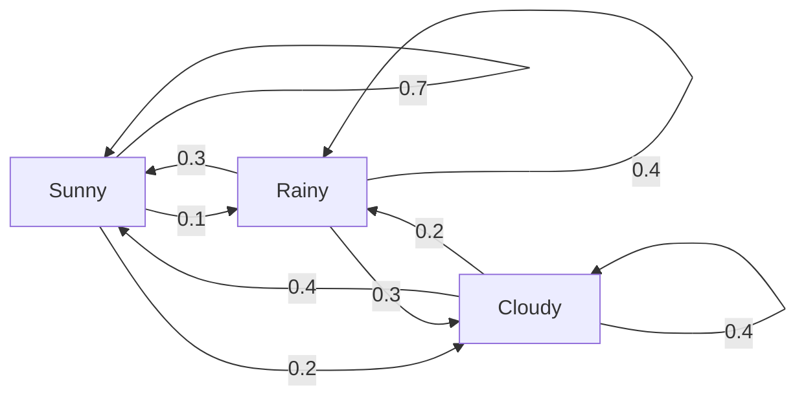
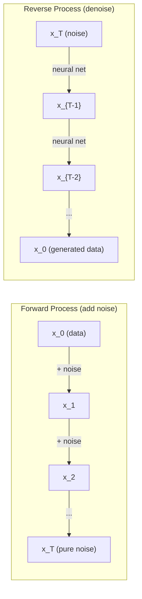

# Processos estocásticos

> 具有结构的随机性──random walks、Markov chains 和 diffusion models 背后的数学──

**Type:** Learn
**Language:**Python
**Prerequisites:** Phase 1, Lessons 06-07（probability, Bayes）
**Time:** ~75 分钟

## Objectivo de aprendizagem
- 模拟 1D 和 2D random walks,并验证位移的平方(n) 缩放规律
- Construir cadeia Markov 模拟器,并通过自己的组合 计算其静止分布
-                                                                                                                                                                                                                                                                                                                                                                                                                                                                                                                              
- Para avançar o processo de difusão com o movimento browniano                                                                                                                                                                                                                                                                                                                                                                                                                                                                                                               

## 问题
Muitos sistemas de IA envolvem a aleatoriedade de evolução ao longo do tempo. Não é aleatoriedade estática, mas aleatoriedade estruturada, cada passo depende do que aconteceu antes.

Os modelos de linguagem uma vez geram um token. Cada token depende do contexto anterior. O modelo produz uma distribuição de probabilidade, de um modo de análise, e depois continua.

Os modelos de difusão  gradualmente para imagem adicionar ruído, até que se torne puro ruído estático.

Agentes de aprendizagem de reforço em ambiente tomam ações. Cada ação leva, com alguma probabilidade, a um novo estado. Agente em um mundo acidental segue uma política acidental.

A amostragem MCMC é o pilar da inferência Bayesiana, que constrói uma cadeia de Markov, sua distribuição estácionária é a seguinte.

Tudo isto é baseado em quatro ideias básicas:
1. Caminhos aleatórios  最简单的 stochastic process
2. Cadeias de Markov  带有过渡矩阵的结构化随机性
3. Dinâmica de Langevin  带噪声的渐进下降
4. Metropolis-Hastings   从任意分布采样

## 概念
### Caminhos aleatórios

Desde a posição 0 开始── cada passo,抛一枚公平硬币──正面:向右移动(+1)──反面:向左移动(-1)──

经过 n 步后, sua posição é n 个随机 +/-1 值的总和──期望位置是 0((esta caminhada é imparcial 的) ・・・ mas a distância do ponto de origem é a expectativa de que a distância seja aumentada 

Este andar é justo, as duas direções não se deslocam. Mas com o tempo, ele vai descer do ponto de partida e vai mais longe.

```
Step 0:  Position = 0
Step 1:  Position = +1 or -1
Step 2:  Position = +2, 0, or -2
...
Step 100: Expected distance from origin ~ 10 (sqrt(100))
Step 10000: Expected distance from origin ~ 100 (sqrt(10000))
```

**在 2D 中**,caminhar 以相等概率向上、向下、向左或向右移动──距离原点同样遵循平方n) 缩放规则──路径将描绘出类似碎形的模式──

**为什么是 sqrt(n)？**Cada passo é de uma probabilidade de +1 ou -1──n 步后, posição S_n = X_1 + X_2 + ... + X_n, cada X_i é +/-1──n. Cada passo é de uma variação é 1, e cada passo é independente um do outro, então Var(S_n) = n── desvio padrão = sqrt(n)──de acordo com o teorema do limite central, S_n / sqrt(n) 收到標準正常分布──

Esse tipo de quadrado é colocado em ML em qualquer lugar.

**与 Brownian motion 的联系。**取一个步尺为 1/sqrt(n) 、每单位时间 n 步的随机走──当 n 趋近无穷时,这个走会收到布朗运动 B(t)  一个连续时间过程,其中 B(t) 服从平均值为 0、变量 为 t 的正常分布──

O movimento browniano é a base matemática da difusão. Ele descreve o movimento de fluxo de partículas no corpo, bem como o movimento do preço das ações, bem como o processo de ruído nos modelos de difusão.

**Gambler's ruin。**Uma caminhada aleatória desde a posição k                                                                                                                                                                                                                                                                                                                                                                                                                                                                                                                    

### Cadeias de Markov

A cadeia de Markov é um sistema, que depende de uma probabilidade fixa de transferência entre estados.

```
P(X_{t+1} = j | X_t = i, X_{t-1} = ...) = P(X_{t+1} = j | X_t = i)
```

É a propriedade de Markov. Significa que você pode usar uma matriz de transição P para descrever toda a dinâmica:

```
P[i][j] = probability of going from state i to state j
```

Cada linha de P's pede e é para 1... você tem que ir a algum lugar.

**示例 —— Weather：**

```
States: Sunny (0), Rainy (1), Cloudy (2)

P = [[0.7, 0.1, 0.2],    (if sunny: 70% sunny, 10% rainy, 20% cloudy)
     [0.3, 0.4, 0.3],    (if rainy: 30% sunny, 40% rainy, 30% cloudy)
     [0.4, 0.2, 0.4]]    (if cloudy: 40% sunny, 20% rainy, 40% cloudy)
```

De qualquer estado 开始──经过多次过渡 后, estados de distribuição 收会到静止分布 pi,其中 pi * P = pi──这是P's eigenvalue 为 1 的左 eigenvector──

Para a cadeia meteorológica, a distribuição estácional é [0,53, 0,18, 0,29]  长期来看, não importa o estado inicial é o que é, 53% do tempo é ensolarado.



**计算 stationary distribution。**Há duas formas:

1. **Power method**A distribuição inicial será repetida de forma arbitrária.
2. **Eigenvalue method**: encontrar o valor próprio de P para o próprio vetor esquerdo de 1。 isto é igual ao valor próprio de P^T para o próprio vetor de 1。

两种方法都要求链 满足收条件――

**收敛条件。**Se uma cadeia Markov  satisfazer as seguintes condições, ela receberá a única distribuição estacionária:
- **Irreducible**Cada estado pode chegar a qualquer outro estado.
- **Aperiodic**A cadeia não terá ciclo fixo

A maioria das cadeias que encontram no ML satisfazem estas duas condições.

**Absorbing states。**Se entrar em um estado, ele nunca sairá. Este estado é absorvendo. Absorvendo cadeias de Markov pode ser usado para construir com estados terminais.

**Mixing time。**需要多少步,chain 才会接近stationary distribution? formalized地说,就是 total distância de variação com a distância de estacionalidade reduzir a algum 值以下的所需步数――Fast mixing = 需要的步数少──P's spectral gap(1 减去第二大自值) control mixing time──gap 越大, mixing 越快──

### Compartilhar com Modelos de Língua

Modelo de linguagem 中的代币生成 近似是一个马克沃过程──给定当前文text,模型输出下一个代币 上的分布──Temperatura 控制敏度:

```
P(token_i) = exp(logit_i / temperature) / sum(exp(logit_j / temperature))
```

- Temperatura = 1,0: Standard Distribution
- Temperatura < 1,0:更尖(更确定性)
- Temperatura > 1,0:更平坦(更随机)
- Temperatura -> 0:argmax(com avidez)

Amostração de topo-k 截断至概率最高的 k 个代币――Top-p(núcleo) amostração 截断至累积概率 超过 p 的最小代币 集合──两者都会修改马科夫过渡概率──

### Movimento brownista

O limite de tempo contínuo de caminhada aleatória.
1. B(0) = 0
2. B (t) - B (s) 服从均值为 0、variância 为 t - s de distribuição normal
3. Não-reparados

O movimento browniano é continuado, mas é indiscutível. Está em movimento em cada medida.

Em um movimento de separação, você pode ser assim, como o movimento browniano:

```
B(t + dt) = B(t) + sqrt(dt) * z,    where z ~ N(0, 1)
```

sqrt(dt) 缩放很重要── é derivado do teorema do limite central de caminhadas aleatórias.

### Dinâmica de Langevin

Descenso Gradiente 寻找函数的最小值──Langevin dinâmica 寻找与 exp(-U(x)/T) 成正比的概率分布,其中 U 是能量函数,T 是温度──

```
x_{t+1} = x_t - dt * gradient(U(x_t)) + sqrt(2 * T * dt) * z_t
```

Há duas formas de agir na partícula:
1. **Gradient force**(-dt * gradiente(U)):推向低能量(类似 Gradiente Descent)
2. **Random force**(sqrt(2*T*dt) * z):推向随机方向(exploração)

Quando a temperatura T = 0 时, é puro descida gradiente. Temperatura alta.

**与 diffusion models 的联系。**O processo avançado do modelo de difusão é:

```
x_t = sqrt(alpha_t) * x_{t-1} + sqrt(1 - alpha_t) * noise
```

É uma cadeia de Markov que mistura dados e ruído. Depois de passares por passos suficientes, é o ruído gaussiano.

processo inverso  do ruído voltar para os dados  Também é uma cadeia de Markov, mas suas probabilidades de transição são obtidas pela Rede Neural.



### MCMC: Markov Chain Monte Carlo

Às vezes você precisa de um que pode obter valor (permitir diferir um constante) mas não pode tomar diretamente uma distribuição p (x) em um modelo.

**Metropolis-Hastings**构造一个静止分布 为 p(x) 的马科夫链:

1. De alguma posição x                                                                                                                                                                                                                                                                                                                                                                                                                                                                                                                          
2. 提议一个新位置 x'
3. 計算 aceitação:a) * Q (x) = p (x) = (x) * (x) * (x) = (x)
4. 以概率 min(1, a) 接受 x'──否则留在 x──
5. - Não, não.

Se Q é simétrico de (por exemplo, Q) x'x (x) = Q (x, x) = N (x, x) = sigma^2)), a relação 可简化为 a = p (x) / p (x) 你只需要概率的比率  normalizing constant 会相互抵消──

Em condições de temperatura, esta cadeia garante receita até p (x) ⋅ mas se a proposta 太小 (太小) 随机走) 或太大 (太大) 高拒绝), receita pode ser muito lenta.

**为什么它有效。**Relação de aceitação  assegurar o equilíbrio detalhado: situado em x e não se move para x', igual à probabilidade de situado em x e não se mover para x。 Equilíbrio detalhado significa p(x) é a distribuição estacionária da cadeia── portanto, passou por bastantes passos 后, exemplos de p(x)──

**实践注意事项：**
- **Burn-in**O processo de distribuição estável é o seguinte:
- **Thinning**A partir de agora, a produção de amostras de cada tipo deve ser reduzida.
- **Multiple chains**A partir de diferentes pontos de funcionamento, várias cadeias são executadas. Se elas forem recebidas até a mesma distribuição, há evidências de receção.
- **Acceptance rate**Para as propostas de Gaussian, a melhor taxa de aceitação é de aproximadamente 23% (Roberts & Rosenthal, 2001):

### Processos estocásticos em IA

| Process | AI Application |
|---------|---------------|
| Random walk | RL 中的 exploration、Node2Vec embeddings |
| Markov chain | Text generation、MCMC sampling |
| Brownian motion | Diffusion models（forward process） |
| Langevin dynamics | Score-based generative models、SGLD |
| Markov decision process | Reinforcement learning |
| Metropolis-Hastings | Bayesian inference、posterior sampling |


```figure
random-walk-diffusion
```

## Construí-lo
### 步骤 1: Simulador de caminhada aleatória

```python
import numpy as np

def random_walk_1d(n_steps, seed=None):
    rng = np.random.RandomState(seed)
    steps = rng.choice([-1, 1], size=n_steps)
    positions = np.concatenate([[0], np.cumsum(steps)])
    return positions


def random_walk_2d(n_steps, seed=None):
    rng = np.random.RandomState(seed)
    directions = rng.choice(4, size=n_steps)
    dx = np.zeros(n_steps)
    dy = np.zeros(n_steps)
    dx[directions == 0] = 1   # right
    dx[directions == 1] = -1  # left
    dy[directions == 2] = 1   # up
    dy[directions == 3] = -1  # down
    x = np.concatenate([[0], np.cumsum(dx)])
    y = np.concatenate([[0], np.cumsum(dy)])
    return x, y
```

1D caminhar  armazenamento soma cumulativa── cada passo é +1 ou -1── atravessado n                                                                                                                                                                                                                                                                                                                                                                                                                                                                                                      

### 步骤 2: cadeia de Markov

```python
class MarkovChain:
    def __init__(self, transition_matrix, state_names=None):
        self.P = np.array(transition_matrix, dtype=float)
        self.n_states = len(self.P)
        self.state_names = state_names or [str(i) for i in range(self.n_states)]

    def step(self, current_state, rng=None):
        if rng is None:
            rng = np.random.RandomState()
        probs = self.P[current_state]
        return rng.choice(self.n_states, p=probs)

    def simulate(self, start_state, n_steps, seed=None):
        rng = np.random.RandomState(seed)
        states = [start_state]
        current = start_state
        for _ in range(n_steps):
            current = self.step(current, rng)
            states.append(current)
        return states

    def stationary_distribution(self):
        eigenvalues, eigenvectors = np.linalg.eig(self.P.T)
        idx = np.argmin(np.abs(eigenvalues - 1.0))
        stationary = np.real(eigenvectors[:, idx])
        stationary = stationary / stationary.sum()
        return np.abs(stationary)
```

distribuição estacionária é o próprio valor de P para o próprio vetor esquerdo de 1。 nós através de calcular os próprios vetores de P^T para encontrá-lo(transferirá os próprios vetores esquerdo para os próprios vetores direitos)。

### 步骤 3: Dinâmica de Langevin

```python
def langevin_dynamics(grad_U, x0, dt, temperature, n_steps, seed=None):
    rng = np.random.RandomState(seed)
    x = np.array(x0, dtype=float)
    trajectory = [x.copy()]
    for _ in range(n_steps):
        noise = rng.randn(*x.shape)
        x = x - dt * grad_U(x) + np.sqrt(2 * temperature * dt) * noise
        trajectory.append(x.copy())
    return np.array(trajectory)
```

Gradiente vai x   impulsionar para baixo energia  ruído  impedir que ele se entre em paralisação local                                                                                                                                                                                                                                                 

### 步骤 4: Metrópole-Hastings

```python
def metropolis_hastings(target_log_prob, proposal_std, x0, n_samples, seed=None):
    rng = np.random.RandomState(seed)
    x = np.array(x0, dtype=float)
    samples = [x.copy()]
    accepted = 0
    for _ in range(n_samples - 1):
        x_proposed = x + rng.randn(*x.shape) * proposal_std
        log_ratio = target_log_prob(x_proposed) - target_log_prob(x)
        if np.log(rng.rand()) < log_ratio:
            x = x_proposed
            accepted += 1
        samples.append(x.copy())
    acceptance_rate = accepted / (n_samples - 1)
    return np.array(samples), acceptance_rate
```

O algoritmo propõe um novo ponto, verifica se tem uma probabilidade mais alta (ou em relação à probabilidade de crescimento), e depois repete:

## Use-o
Na prática, você usará uma biblioteca madura para implementar esses algoritmos. Mas entender o mecanismo para depurar e ajustar é muito importante.

```python
import numpy as np

rng = np.random.RandomState(42)
walk = np.cumsum(rng.choice([-1, 1], size=10000))
print(f"Final position: {walk[-1]}")
print(f"Expected distance: {np.sqrt(10000):.1f}")
print(f"Actual distance: {abs(walk[-1])}")
```

### Usando matrizes de transição de numpy

```python
import numpy as np

P = np.array([[0.7, 0.1, 0.2],
              [0.3, 0.4, 0.3],
              [0.4, 0.2, 0.4]])

distribution = np.array([1.0, 0.0, 0.0])
for _ in range(100):
    distribution = distribution @ P

print(f"Stationary distribution: {np.round(distribution, 4)}")
```

Depois de passar por várias iterações, ele recebe uma distribuição estática, seja de onde você comece.

### Conexão com o quadro real

- **PyTorch diffusion：**Abraçando o rosto`diffusers`Em meio`DDPMScheduler`实现了前和逆马科夫链
- **NumPyro / PyMC：**Usando o MCMC(NUTS sampleler, é uma melhoria para Metropolis-Hastings) para realizar inferência bayesiana
- **Gymnasium (RL)：**Função de passo ambiente  define um processo de decisão Markov

### 验证 Convergência de cadeia Markov

```python
import numpy as np

P = np.array([[0.9, 0.1], [0.3, 0.7]])

eigenvalues = np.linalg.eigvals(P)
spectral_gap = 1 - sorted(np.abs(eigenvalues))[-2]
print(f"Eigenvalues: {eigenvalues}")
print(f"Spectral gap: {spectral_gap:.4f}")
print(f"Approximate mixing time: {1/spectral_gap:.1f} steps")
```

O espaço espectral  diz-te cadeia  esquece sua velocidade inicial. O espaço é 0.2 significa cerca de 5 passos.

## Entrega-o
本课产出:
- `outputs/prompt-stochastic-process-advisor.md` Um prompt, para ajudar a identificar determinados problemas, adaptado a quaisquer estruturas de processo estocástico

## Relações

| Concept | Where it shows up |
|---------|------------------|
| Random walk | Node2Vec graph embeddings、RL 中的 exploration |
| Markov chain | LLMs 中的 Token generation、MCMC sampling |
| Brownian motion | DDPM 中的 forward diffusion process、SDE-based models |
| Langevin dynamics | Score-based generative models、stochastic gradient Langevin dynamics (SGLD) |
| Stationary distribution | MCMC convergence target、PageRank |
| Metropolis-Hastings | Bayesian posterior sampling、simulated annealing |
| Temperature | LLM sampling、RL 中的 Boltzmann exploration、simulated annealing |
| Mixing time | MCMC 的 convergence speed、spectral gap analysis |
| Absorbing state | End-of-sequence token、RL 中的 terminal states |
| Detailed balance | MCMC samplers 的 correctness guarantee |

Modelos de difusão 值得特别关注──DDPM(Ho et al., 2020) definiram uma cadeia Markov avançada:

```
q(x_t | x_{t-1}) = N(x_t; sqrt(1-beta_t) * x_{t-1}, beta_t * I)
```

Entre eles beta_t é um cronograma de ruído.

```
p_theta(x_{t-1} | x_t) = N(x_{t-1}; mu_theta(x_t, t), sigma_t^2 * I)
```

Cada passo da geração é um passo aprendido na cadeia de Markov. Entender cadeias de Markov significa entender modelos de difusão como e por que podem gerar dados.

SGLD(Stochastic Gradient Langevin Dynamics) vai combinar o mini-batch Gradient Descent com o ruído Langevin 结起来──你不计算完整的 Gradient,而是使用 Stochastic estimate并添加校准的噪音──随着学习率 衰退,SGLD 会从优化 过渡到样品采样  你几乎免费得到近似的贝叶斯后样品──这是从神经网络 获得不确定性估计的最简单方式之一──

穿越这些联系的关键洞见是: processos stochastic não são apenas ferramentas teóricas. Eles são mecanismos de cálculo modernos no sistema AI. Quando você ajusta a temperatura do LLM, você está ajustando uma cadeia de Markov. Quando você treina um modelo de difusão, você está aprendendo a reverter um processo semelhante ao movimento browniano. Quando você executa inferências bayesianas, você está construindo uma cadeia posterior de recepção.

## 练习
1. **模拟 1000 条 10000 步的 random walks。**绘制最终位置的分布──验证它近似为平均 0、标准偏差平方rt(10000) = 100 的高西亚──

2. **使用 Markov chain 构建 text generator。**Em um pequeno corpo, você pode aprender a fazer uma transição para cada palavra, para que você possa fazer uma transição para a próxima palavra.

3. **使用 Metropolis-Hastings 实现 simulated annealing。**Desde alta temperatura 开始 (几乎接受所有内容), então gradualmente降温 (仅接受改进) ⋅ Usar para encontrar o mínimo valor de função com muitos mínimos locais.

4. **比较不同 temperatures 下的 Langevin dynamics。**Do potencial de poço duplo U(x) = (x^2 - 1)^2 中采样──低温 时,样本 聚集在一个井中──高温 时,它们分布在两个井中──找到链 在井中 之间混合的关键温度──

5. **实现 forward diffusion process。**A partir de um sinal 1D (por exemplo, onda sinusa) começar a utilizar um cronograma de ruído linear, em 100 passos, gradualmente adicionar ruído.

## 关键术语
| Term | What people say | What it actually means |
|------|----------------|----------------------|
| Random walk | “抛硬币式移动” | 一个 position 在每一步按随机 increments 改变的过程 |
| Markov property | “无记忆性” | future 只依赖当前 state，而不依赖 history |
| Transition matrix | “概率表” | P[i][j] = 从 state i 移动到 state j 的概率 |
| Stationary distribution | “长期平均” | 满足 pi*P = pi 的分布 pi —— chain 的 equilibrium |
| Brownian motion | “随机抖动” | random walk 的 continuous-time limit，B(t) ~ N(0, t) |
| Langevin dynamics | “带噪声的 Gradient Descent” | 结合 deterministic Gradient 与 random perturbation 的 update rule |
| MCMC | “向目标行走” | 构造一个 stationary distribution 为你想要的分布的 Markov chain |
| Metropolis-Hastings | “提议并接受/拒绝” | 使用 acceptance ratios 来确保收敛的 MCMC algorithm |
| Temperature | “随机性旋钮” | 控制 exploration 与 exploitation 之间权衡的参数 |
| Diffusion process | “噪声进，噪声出” | Forward：逐渐添加 noise。Reverse：逐渐移除 noise。生成 data。 |

## 延伸阅读
- **Ho, Jain, Abbeel (2020)** Denoising Diffusion Probability Models.  开启 diffusion model 革命的 DDPM 论文──清晰推导了前进和反转马科夫链──
- **Song & Ermon (2019)**  Modelagem gerativa estimando os gradientes da distribuição de dados. Utilize dinâmica Langevin  conduzir a amostragem  metodologia baseada em pontuação──
- **Roberts & Rosenthal (2004)** Geral state space Markov chains and MCMC algorithms.                                                                                                                                                                                                                                                      
- **Norris (1997)** Markov Chains. 标准教材── abrangem convergência、distribuições estacionárias 和 tempos de batimento──
- **Welling & Teh (2011)**  Aprendizagem baiesa através da Dinâmica de Langevin Gradiente Estocástico.                                                                                                                                                                                                                                                 
