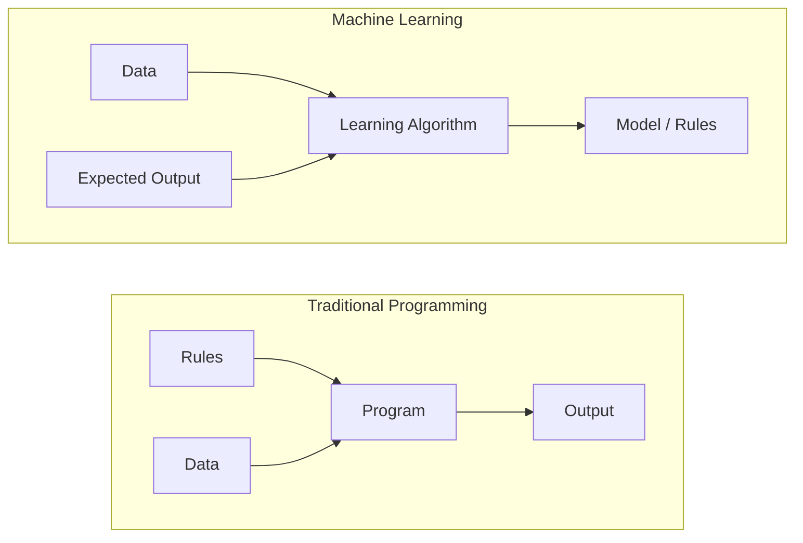
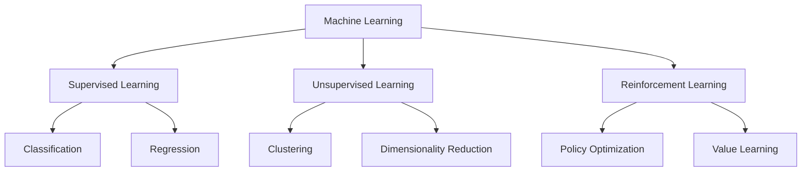
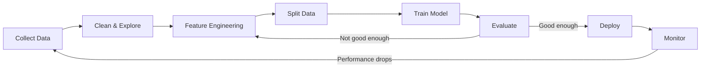
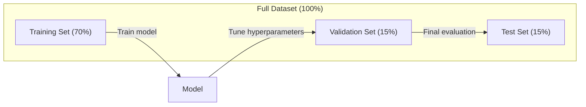
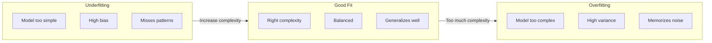
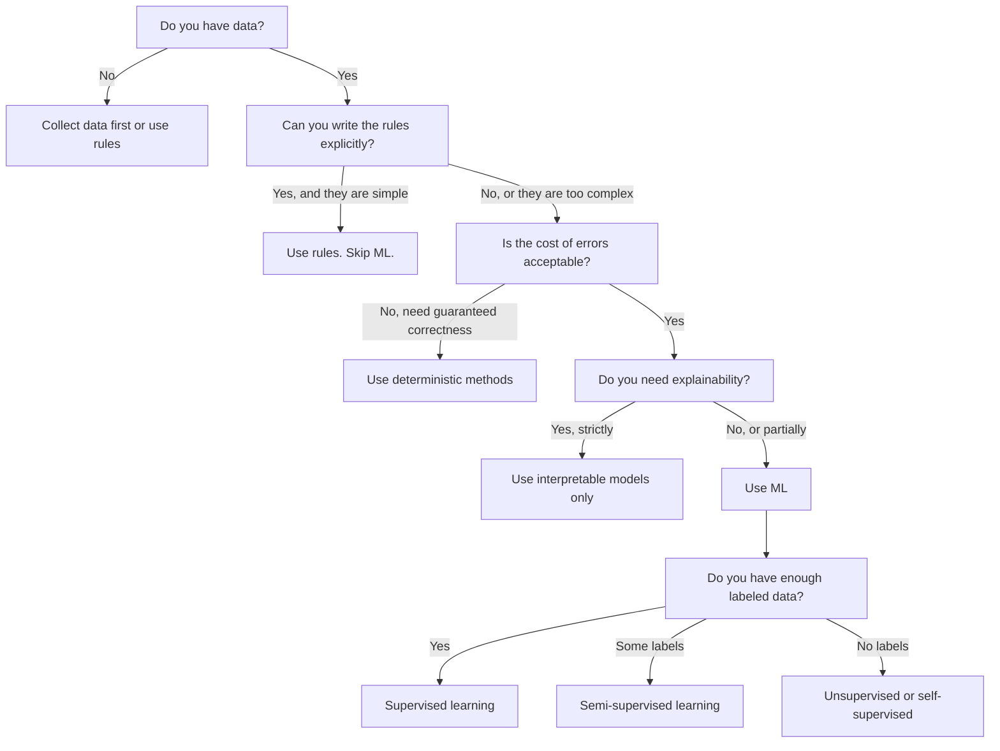

# O que é Machine Learning?

> O Machine Learning é uma forma de um computador procurar um modelo em dados, e não regras de escrita manual.

**类型：**- aprendizagem
**语言：**Python
**先修要求：**Fase 1 (Fundamentos matemáticos)
**时间：**Cerca de 45 minutos

## Objectivo de aprendizagem

- 解释监督无监督和加强学习的区别,并判断给定问题适用哪种类型
- Desde zero para alcançar o classificador centróide mais próximo, não usar a linha de base aleatória para avaliá-lo
- 区分 Classificação 和 Regressão 任务,并为每种任务选择合适的 Loss Function
-  avaliar se os problemas de negócios são adequados para a utilização do ML ou melhor para a resolução de regras de determinação

## 问题

Você quer construir um filtro de lixo. A prática tradicional é: sentar-se e escrever algumas centenas de regras. Se o e-mail contém 'DONOS GRATIS', marque-o como lixo. Se tiver mais de 3 sentimentos, marque-o como lixo. Você passou algumas semanas a escrever regras. Então o emissor de lixo mudou a frase.

O Machine Learning  mudou esse modo. Você deixou de escrever regras, mas deu a um computador milhares de e-mails com tags (spam ou não spam), deixe-o encontrar regras.

Esta transição da regra de redação para a aprendizagem de dados é o núcleo do Machine Learning. Todos os motores de recomendação, assistentes de voz, veículos automáticos e modelos de linguagem funcionam dessa forma.

## 概念

### Aprender a partir de dados, em vez de aprender a partir de regras

传统编程和机器学习 以相反的方向解决问题──



傳統編程:你编寫規則──程序把規則應用到數據上并產生輸出──

Machine Learning: você fornece dados e espera de saída.

O modelo treinado é uma regra, codificada em forma digital (peso, parâmetros) e generalizada a partir de amostras já vistas, para fazer previsões de dados nunca vistos.

### Três tipos de aprendizado de máquina



**Supervised Learning**Você tem um par de entrada e saída.
-  Aqui há 10.000 张 em seu rótulo para fotos de gatos ou cães.
-  Aqui há características e preços de habitação.

**Unsupervised Learning**Não há etiqueta, modelo, auto-busca de estrutura.
-  Aqui há 10.000 条客户购买历史──找出自然分组──
-  Aqui há 1.000 维的数据点── em conservação da estrutura, reduzindo-se a 2 维──

**Reinforcement Learning**O agente em ambiente toma medidas, e obtém recompensa ou penalidade.
- Jogar este jogo. Ganhou +1, perdeu -1...
- Controlar o braço do aparelho. Levar o objeto.

Você na prática construiu a maioria dos conteúdos usando o aprendizado supervisionado.

### 超越三大类型

Os três tipos acima são muito claros, mas o mundo real ML  frequentemente fica confuso.

**Semi-supervised learning**Utilize一小部分 data etiquetada 和大量未标签的数据──你可能有100张带标签的医学图像和100,000张未标签图像──技术包括:

- **Label propagation：**Construir um gráfico de dados de pontos de ligação semelhante.
- **Pseudo-labeling：**Em dados rotulados 上训练模型, use-o para prever o rótulo dos dados não rotulados, então em todo o dados re-entrenar.
- **Consistency regularization：**Para uma entrada e sua versão de menor perturbação, o modelo deve dar a mesma previsão. Mesmo sem rótulo, isso também pode funcionar.

**Self-supervised learning**A partir do próprio dados criar supervisão. Não é necessário um rótulo artificial.

- **Masked language modeling (BERT)：**隐藏句中 15% 的词,训练模型 预测缺失的词──标签 来源原始文本──
- **Contrastive learning (SimCLR)：**取一张图像, create two enhanced versions── training model 识别它们来自同一张图像,同时将它们与其他图像的增强版本区分──
- **Next-token prediction (GPT)：**给定前面所有词,预测下一个词―― cada texto em seu arquivo será um exemplo de treinamento――

Estes não são independentes de três tipos diferentes. Eles são combinados com estratégias de pensamento supervisionado e não supervisionado.

### Classificação vs Regressão

Estas são duas das principais tarefas de aprendizagem supervisionada.

| 方面 | Classification | Regression |
|--------|---------------|------------|
| 输出 | 离散类别 | 连续数值 |
| 示例 | “这封邮件是垃圾邮件吗？” | “房价会是多少？” |
| 输出空间 | {cat, dog, bird} | 任意实数 |
| Loss Function | Cross-entropy, accuracy | Mean squared error, MAE |
| 决策 | 类别之间的边界 | 拟合数据的曲线 |

Classificação 回答属于哪个类别?Regression 回答多少?

Algumas questões podem ser expressas de duas formas.

### ML 工作流

Cada projeto de aprendizagem automática segue a mesma linha, independentemente do algoritmo usado.



**Collect Data**Recolher dados originais. Mais dados são quase sempre melhores, mas a qualidade é mais importante do que a quantidade.

**Clean & Explore**O processo de tratamento de falta de valor, eliminação de repetição, distribuição de visualização, descoberta de anomalias, geralmente ocupa entre 60 e 80% do tempo total do projeto.

**Feature Engineering**O que é mais importante é que o algoritmo de um postinho seja mais importante.

**Split Data**O modelo em dados de treinamento 上训练, você em dados de validação 上调超参数,并在测试数据 上报告最终性能──

**Train Model**:把 training data 输入算法──算法调整内部参数,以最小化损失函数──

**Evaluate**Se o desempenho é inaceitável, volte a tentar diferentes características, algoritmos ou hiperparâmetros.

**Deploy**: colocar o modelo no ambiente de produção, fazer com que ele seja previsto para novos dados.

**Monitor**• Performance de seguimento contínuo: ■ Data Distribution: Change: • Data drift: • Data drift: • Data drift: • Data drift: • Data drift: • Data drift: • Data drift: • Data drift: • Data drift: • Data drift: • Data drift: • Data drift: • Data drift: • Data drift: • Data drift: • Data drift: • Data drift: • Data drift: • Data drift: • Data drift: • Data drift: • Data drift: • Data drift: • Data drift: • Data drift: • Data drift: • Data drift: • Data drift: • Data drift: • Data drift: • Data drift: • Data drift: • Data drift: • Data drift: • Data drift: • Data drift: • Data drift: • Data drift: • data drift: • data drift: • data drift: • data drift: • data flow: • data flow: • data flow: • data flow: • data flow: • data flow: • data flow: • data flow: • data flow: • data flow: • data flow: • data flow: • data flow: • data flow; • data flow; • data; • data; • data; • • • • • • • • • • • • • • • • • • • • • • • • • • • • • • • • • • • • • • • • • • • • • • • • • • • • • • • • • • • • • • • • • • • • • • • • • • • • • • • • • • • • • • • • • • • • • • • • • • • • • • • • • • • • • • • • • • • • • • • • • • • • • • • • • • • • • • • • • • • • • • • • • • • • • • • • • • • • • • • • • • • • • • • • • • • • • • • • • • • • • • • • • • • • • • • • • • • • • • • • • • • • • • • • • • • • • • • • • • • • • • • • • • • • • • • • • • • • • • • • • • • • • • • • • • • • • • • •

### Formação, validação e teste

É o conceito fundamental mais fácil de enganar para os iniciantes. Você deve avaliar o modelo de dados que nunca viu durante a formação.



| 划分 | 目的 | 使用时机 | 典型大小 |
|-------|---------|-----------|-------------|
| Training | model 从这些数据中学习 | 训练期间 | 60-80% |
| Validation | 调整 hyperparameter、比较 model | 每次训练运行之后 | 10-20% |
| Test | 最终无偏 performance 估计 | 只在最后使用一次 | 10-20% |

O conjunto de testes é sagrado. Você só pode vê-lo uma vez. Se você continuar a ajustar o modelo de desempenho do teste, você está na prática no conjunto de testes, o número de seu relatório também não tem sentido.

对于小数据集,使用k-fold cross-validation:把数据分成k 份,在k-1 份训练,在剩余1 份验证,轮换进行,并对结果取平均――

### O super-ajustamento vs. o sub-ajustamento



**Underfitting**Modelo 太简单,无法捕捉中的模式――就像用一条直线去适合曲关系―― formação erro 高――test error 也高――

**Overfitting**O modelo é muito complexo, lembrando os dados de treinamento, incluindo o ruído.

**Good fit**Modelo 捕捉真实模式,而不记忆噪声──training error 和 test error 都相对较低──

Sinais de excesso de equipamento:
- Precidez de treinamento 远高于 validação
- O modelo em dados de treinamento apresenta um bom desempenho, mas em novos dados apresenta um desempenho muito ruim.
- 增加更多训练数据 会提升性能(modelo 原本是记忆而不是学习)

修复 sobre-ajustamento:
-  obter mais dados de formação
- 降低模型复杂性 ((更少参数、更简单建筑)
- Regularização (para um peso maior)
- Abandono durante o treino随机将神经元 置零)
- Paragem antecipada ((( quando erro de validação 开始上升时停止训练)

修复 sub-ajustamento:
- Utilize mais complexo modelo
- 添加更多 recurso
- 降低 regularização
- 訓練更久

### Comércio de variações de parcialidade

É o quadro matemático de trás.

**Bias**O modelo linear terá um alto preconceito. O alto preconceito levará a um desajuste.

**Variance**O modelo de alta variação em diferentes grupos de dados durante o treino dá previsões muito diferentes.

| Model complexity | Bias | Variance | 结果 |
|-----------------|------|----------|--------|
| 过低（用 linear model 拟合弯曲数据） | High | Low | Underfitting |
| 刚好合适 | Medium | Medium | 良好的 generalization |
| 过高（用 degree-20 polynomial 拟合 10 个点） | Low | High | Overfitting |

总 error = Bias^2 + Variância + ruído incontrolável

Você não consegue reduzir o ruído irredutível. É o próprio dados.

### Não há teorema do almoço livre

Não existe um único algoritmo que seja o melhor para todos os problemas. Algoritmos que se apresentam bem em uma categoria de problemas podem ser muito fracos em outra categoria. É por isso que um cientista de dados vai experimentar vários algoritmos e comparar resultados.

实践中, escolher depende de:
- Tens muitos dados
- Há muitas características
- Relação é linear ou não linear
- É necessário a interpretação
- Você pode carregar quanto recursos de cálculo

### 什么时候不要使用机器学习

ML é muito forte, mas não é sempre um instrumento correto. Antes de usar o modelo, pergunte-se se realmente precisa dele.

**不要在以下情况下使用 ML：**

- **规则简单且定义明确。**税费计算、排序算法、单位转换―― se você puder usar várias declarações se escrever lógicas, o modelo só aumentará a complexidade, sem nenhum benefício―
- **你没有数据或数据很少。**ML  necessita de aprender a partir de amostras. Apenas 10 pontos de dados, não consegue treinar algo significativo.
- **错误成本是灾难性的，并且你需要保证正确性。**medicamento do cálculo 核反应堆控制 密码学验证──ML modelo é probabilidade.
- **lookup table 或 heuristic 可以解决问题。**Se um limite simples ou uma tabela cobrir 99% das situações, adicionar ML aumentaria o custo de manutenção, mas não significaria melhorias.
- **你无法解释决策，而 explainability 又是必需的。**Recebendo uma análise de dados, o sistema de gestão de dados (SMS) é um sistema de gestão de dados que permite a análise de dados e de dados.
- **问题变化得比你重新训练还快。**Se as regras mudam diariamente, e o re-treinamento requer uma semana, o modelo é sempre passado.

Use este diagrama de fluxo de decisão:




```figure
f3-learning-boundary
```

## Construí-lo

`code/ml_intro.py`O código central realiza um classificador centróide mais próximo do zero, que é o mais simples algoritmo ML. Ele mostra a ideia central: aprender a partir de dados, e então fazer previsão de novos dados.

### 步骤 1: desde zero implementar Classificador de centróides mais próximo

Classificador centróide mais próximo 会计算训练数据 中每个类的中心 (中) △ mean (mean) △预测时,它将将每个新点分配给离近中心所属的类的距离──

```python
class NearestCentroid:
    def fit(self, X, y):
        self.classes = np.unique(y)
        self.centroids = np.array([
            X[y == c].mean(axis=0) for c in self.classes
        ])

    def predict(self, X):
        distances = np.array([
            np.sqrt(((X - c) ** 2).sum(axis=1))
            for c in self.centroids
        ])
        return self.classes[distances.argmin(axis=0)]
```

É o que se passa com o algoritmo. Não há descida gradual, não há iteração, não há hiperparâmetro.

### 步骤 2: em Data sintética 上训练

Nós geramos um conjunto de dados de classificação 2D, dos quais duas classes têm uma leve sobreposição.

```python
rng = np.random.RandomState(42)
X_class0 = rng.randn(100, 2) + np.array([1.0, 1.0])
X_class1 = rng.randn(100, 2) + np.array([-1.0, -1.0])
X = np.vstack([X_class0, X_class1])
y = np.array([0] * 100 + [1] * 100)
```

### 步骤 3: Comparar com a linha de base

Cada modelo de ML deve ser comparado com uma linha de base trivial. A linha de base aqui vai prever uma classe. Se o seu modelo de ML não consegue superar as suposições, então há problemas.

```python
baseline_preds = rng.choice([0, 1], size=len(y_test))
baseline_acc = np.mean(baseline_preds == y_test)
```

Neste conjunto de dados, o classificador de centróides deve alcançar uma precisão de 90% ou mais.

### Por que é importante ?

Classificador centróide mais próximo 极其简单── não tem hiperparâmetro, não há iteração, não há descida gradiente── mas captura o modelo ML básico:

1. Dos dados de formação**学习**Uma espécie de "centroides")
2. Usar para indicar novos dados**预测**(distância mais próxima)
3. Com base **评估**(随机猜测)

Cada algoritmo de ML, desde a regressão logística até os transformadores, segue o mesmo modelo de três etapas.

### 步骤 4:Classificador Centroid fazer não até o que

Classificador centróide mais próximo  supõe que cada classe forme uma única mancha― desenha um limite de decisão linear― ele falha nas seguintes circunstâncias:

- classe tem vários clusters (por exemplo, números 1 pode ser usado em várias formas diferentes de escrever)
- O limite de decisão é não linear (por exemplo, uma classe envolve outra classe)
- característica de escala 差异很大(distância 被最大规模的特征 主导)

Estes limites provocam todos os outros algoritmos que você vai aprender. Os vizinhos mais próximos de K podem lidar com vários clusters.

## Use-o

SHOP  fornecer `NearestCentroid`E gerador de dados sintéticos:

```python
from sklearn.neighbors import NearestCentroid
from sklearn.datasets import make_classification
from sklearn.model_selection import train_test_split

X, y = make_classification(
    n_samples=500, n_features=2, n_redundant=0,
    n_clusters_per_class=1, random_state=42
)
X_train, X_test, y_train, y_test = train_test_split(X, y, test_size=0.3)

clf = NearestCentroid()
clf.fit(X_train, y_train)
print(f"Accuracy: {clf.score(X_test, y_test):.3f}")
```

## Entrega-o

本课会生成 `outputs/prompt-ml-problem-framer.md`, é um rápido, pode transformar um problema de negócio confuso em uma tarefa específica de ML. . . . . . . . . . . . . . . . . . . . . . . . . . . . . . . . . . . . . . . . . . . . . . . . . . . . . . . . . . . . . . . . . . . . . . . . . . . . . . . . . . . . . . . . . . . . . . . . . . . . . . . . . . . . . . . . . . . . . . . . . . . . . . . . . . . . . . . . . . . . . . . . . . . . . . . . . . . . . . . . . . . . . . . . . . . . . . . . . . . . . . . . . . . . . . . . . . . . . . . . . . . . . . . . . . . . . . . . . . . . . . . . . . . . . . . . . . . . . . . . . . . . . . . . . . . . . . . . . . . . . . . . . . . . . . . . . . . . . . . . . . . . . . . . . . . . . . . . . . . . . . . . . . . . . . . . . . . . . . . . . . . . . . . . . . . . . . . . . . . . . . . . . . . . . . . . . . . . . . . . . . . . . . . . . . . . . . . . . . . . . . . . . . . . . . . . . . . . . . . . . . . . . . . . . . . . . . . . . . . . . . . . . . . . . . . . . . . . . . . . . . . . . . . . . . . . . . . . . . . . . . . . . . . . . . . . . . . . . . . . . . . . . . . .

## 关键术语

| 术语 | 人们常说 | 实际含义 |
|------|----------------|----------------------|
| Model | “The AI” | 一个带有可学习 parameter 的数学函数，用于把输入映射到输出 |
| Training | “Teaching the AI” | 运行 optimization algorithm 来调整 model parameter，使预测匹配已知输出 |
| Feature | “An input column” | 数据中可测量的属性，model 用它进行预测 |
| Label | “The answer” | training example 的已知输出，用于计算 error signal |
| Hyperparameter | “A setting you tweak” | 训练前设置的 parameter，用于控制学习过程（learning rate、layer 数量） |
| Loss Function | “How wrong the model is” | 衡量预测输出与实际输出之间差距的函数，训练会尝试将其最小化 |
| Overfitting | “It memorized the test” | model 学到了 training-specific noise，而不是通用模式，因此在新数据上失败 |
| Underfitting | “It didn't learn anything” | model 太简单，无法捕捉数据中的真实模式 |
| Generalization | “It works on new data” | model 对未训练过的数据做出准确预测的能力 |
| Cross-validation | “Testing on different chunks” | 反复把数据拆分为 train/test fold 并对结果取平均，从而得到更稳健的 performance 估计 |
| Regularization | “Keeping weights small” | 向 Loss Function 添加 penalty term，以抑制过于复杂的 model |
| Data drift | “The world changed” | 传入数据的统计分布随时间发生变化，导致 model performance 下降 |

## 练习

1. 选择任意数据集 (例如 Iris、Titanic) ⋅按 70/15/15 拆分为火车/验证/test──解释为什么不应该在测试集 上调整超参数──
2. 列出三个真世界问题──对每个问题,判断它是分类、退缩还是集群,以及它是监督还是没有监督──
3. Um modelo alcança 99% de precisão nos dados de treinamento, mas apenas 60% nos dados de teste.

## 延伸阅读

- [An Introduction to Statistical Learning](https://www.statlearning.com/)- 免费教材, abrangendo todos os métodos clássicos de ML,并配有实践示例
- [Google's Machine Learning Crash Course](https://developers.google.com/machine-learning/crash-course)- Introdução simplificada ao conceito de ML
- [Scikit-learn User Guide](https://scikit-learn.org/stable/user_guide.html)- Referência prática para implementar o ML em Python
