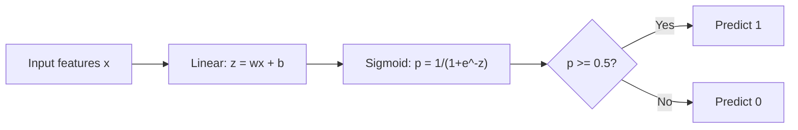
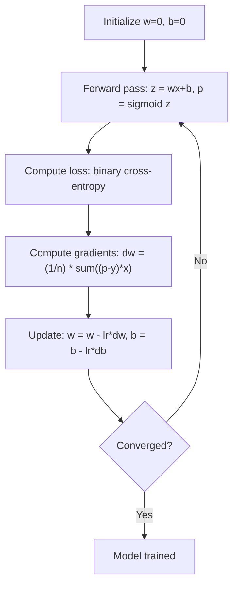

# Regressão logística

> A regressão logística irá transformar uma linha reta em curva S, com probabilidade responder a questão de "ou não".

**类型：**Construir
**语言：**Python
**先修要求：**Fase 2 Lição 1-2 (O que é ML, Regressão Linear)
**时间：**Cerca de 90 minutos

## Objectivo de aprendizagem

- Utilize sigmoid função 和 perda de entropia cruzada binária desde zero para realizar regressão logística
- 計算并解释 二进制分类 中的精度、回忆、F1 score 和混矩阵
- Explicação de por que a MSE não se adequa à Classificação, bem como por que a entropia binária cruzada irá gerar uma superfície de custo convexa
- Construir para classificação multi-classe de softmax modelo de regressão,并评估 limiar sintonização

## 问题

Você pensa que, de acordo com o tumor, é maligno ou benigno. Você tenta usar regressão linear. Você pode experimentar uma regressão linear. Você pode experimentar uma regressão linear. Você pode experimentar uma regressão linear. Você pode experimentar uma regressão linear. Você pode experimentar uma regressão linear. Você pode experimentar uma regressão linear. Você pode experimentar uma regressão linear. Você pode experimentar uma regressão linear. Você pode experimentar uma regressão linear. Você pode experimentar uma regressão linear. Você pode experimentar uma regressão linear. Você pode experimentar uma regressão linear. Você pode experimentar uma regressão linear. Você pode experimentar uma regressão linear. Você pode experimentar uma regressão linear. Você pode experimentar uma regressão linear. Você pode experimentar uma regressão linear. Você pode experimentar uma regressão linear. Você pode experimentar uma regressão linear. Você pode experimentar uma regressão linear. Você pode experimentar uma regressão linear.

A regressão logística resolveu este problema. Usou o mesmo conjunto de linhas (wx + b), então, através da função sigmoide, comprimiu qualquer número para (0, 1) 范围内;;

É um dos algoritmos mais amplamente utilizados na prática. Apesar de haver regressão, a regressão logística é um algoritmo de classificação, e não um algoritmo de regressão.

## 核心概念

### Por que a Regressão Linear não é adequada à Classificação

假设根据学习时长预测通过/未通过(1/0)。Regressão linear 会拟合一条穿越数据的直线:

```
hours:  1   2   3   4   5   6   7   8   9   10
actual: 0   0   0   0   1   1   1   1   1   1
```

O valor de um planeamento linear pode ser -0,2 em 1 horas, em 10 horas, em 1,3 pontos. Este valor não é probabilidade.

Classificação  necessita de uma função satisfatória das seguintes condições:
- 输出 0 到 1  之间的值(概率)
- 产生清晰的转变 (Limite de decisão)
- Não será distante dos limites

### Função sigmoide

Função sigmoide está fazendo assim:

```
sigmoid(z) = 1 / (1 + e^(-z))
```

Sexualidade:
- Quando z é um grande número de números, sigmoid(z)  aproximar 1
- Quando z é um grande número negativo, sigmoid(z)  aproximar 0
- Quando z = 0 时,sigmoid(z) = 0,5
- 输出始终位于 entre 0 e 1 
- A função está plana e fácil de executar

Sua derivada 具有方便的形式:sigmoid'(z) = sigmoid(z) * (1 - sigmoid(z))。这让渐进式 计算更高效──

### Regressão logística = Modelo linear + Sigmoide

模型先计算 z = wx + b(与线性回归相同), então aplicar sigmoid:



输出 p é explicado como P  y = 1  x), isto é, a probabilidade de entrada pertencente à classe 1   decisão limite  localizado em posição de wx + b = 0, neste momento sigmoide 输出恰好为 0.5 

### Perda de entropia cruzada binária

Não pode ser utilizado em regressão logística em MSE, mas em MSE, com sigmoide, gerará uma superfície de custos não-grande, existindo muitos mínimos locais.

```
Loss = -(1/n) * sum(y * log(p) + (1-y) * log(1-p))
```

Por que é eficaz:
- Quando y = 1 e p 接近 1 时:log(1) = 0, portanto, perda 接近 0(正确,低成本)
- Quando y=1 且 p 接近 0 时:log(0) 接近负无穷, portanto perda 很大(错误,高成本)
- Quando y=0 且 p 接近 0 时:log(1) = 0, portanto, perda 接近 0(正确,低成本)
- Quando y=0 且 p 接近 1 时:log(0) 接近负无穷, portanto perda 很大(错误,高成本)

Para a regressão logística, esta função de perda é de forma simbólica, portanto, só garante um mínimo global.

### A Regressão Logística Desce Gradualmente

sigmoid 搭配 binary cross-entropy 时,Gradiente 具有简洁形式:

```
dL/dw = (1/n) * sum((p - y) * x)
dL/db = (1/n) * sum(p - y)
```

Eles parecem com a regressão linear Gradiente  completamente o mesmo. Diferença está em p = sigmoide(wx + b), em vez de p = wx + b。 sigmoide  introduziu não linear, mas Gradiente 更新规则保持不变。



### Limite de decisão

Para 2D 输入(Duas características), o limite de decisão é satisfazer as seguintes condições:

```
w1*x1 + w2*x2 + b = 0
```

Um lado do ponto é classificado como 1, outro lado do ponto é classificado como 0― Regressão lógica 总是产生线性决策界限―如果需要曲的界限,要么添加多项式特性,要么使用非线性模型―

### Utilize Softmax  Classificação de classes múltiplas

Regressão logística binária 处理两个类──对于 k 个类,使用软max函数:

```
softmax(z_i) = e^(z_i) / sum(e^(z_j) for all j)
```

Cada classe tem seu próprio vetor de peso. O modelo para cada classe calcula uma pontuação z_i, então softmax irá converter as pontuações em probabilidade total e de 1 . A classe de previsão é a classe com maior probabilidade.

Função de perda 变为 entropia cruzada categórica:

```
Loss = -(1/n) * sum(sum(y_k * log(p_k)))
```

Entre eles, y_k para a classe verdadeira 为 1, para todas as outras classes 为 0(um codificação quente)

### Metricas de avaliação

 Dependendo apenas da precisão não basta Para um conjunto de dados de 95% negativo  5% positivo, um modelo de um total de previsão negativa pode obter 95% de precisão, mas não serve

**Confusion Matrix**- Não .

| | Predicted Positive | Predicted Negative |
|---|---|---|
| Actually Positive | True Positive (TP) | False Negative (FN) |
| Actually Negative | False Positive (FP) | True Negative (TN) |

**Precision**Entre todas as previsões positivas, há quantas positivas?
```
Precision = TP / (TP + FP)
```

**Recall**(Sensibilidade): Em todos os exemplos positivos, quantos capturamos?
```
Recall = TP / (TP + FN)
```

**F1 Score**Precision 和 recall of harmonic mean──equilibrando duas métricas──
```
F1 = 2 * (Precision * Recall) / (Precision + Recall)
```

 prioridades consideradas:
- **Precision**Quando são falsos positivos (False Positive)
- **Recall**Quando os falsos negativos são negativos, não quero que o tumor desapareça.
- **F1**Quando você precisa de um equilíbrio de uma única métrica


```figure
logistic-sigmoid
```

## Construí-lo

### 步骤 1: Função sigmoide e geração de dados

```python
import random
import math

def sigmoid(z):
    z = max(-500, min(500, z))
    return 1.0 / (1.0 + math.exp(-z))


random.seed(42)
N = 200
X = []
y = []

for _ in range(N // 2):
    X.append([random.gauss(2, 1), random.gauss(2, 1)])
    y.append(0)

for _ in range(N // 2):
    X.append([random.gauss(5, 1), random.gauss(5, 1)])
    y.append(1)

combined = list(zip(X, y))
random.shuffle(combined)
X, y = zip(*combined)
X = list(X)
y = list(y)

print(f"Generated {N} samples (2 classes, 2 features)")
print(f"Class 0 center: (2, 2), Class 1 center: (5, 5)")
print(f"First 5 samples:")
for i in range(5):
    print(f"  Features: [{X[i][0]:.2f}, {X[i][1]:.2f}], Label: {y[i]}")
```

### 步骤 2: Realização da Regressão Logística a partir do zero

```python
class LogisticRegression:
    def __init__(self, n_features, learning_rate=0.01):
        self.weights = [0.0] * n_features
        self.bias = 0.0
        self.lr = learning_rate
        self.loss_history = []

    def predict_proba(self, x):
        z = sum(w * xi for w, xi in zip(self.weights, x)) + self.bias
        return sigmoid(z)

    def predict(self, x, threshold=0.5):
        return 1 if self.predict_proba(x) >= threshold else 0

    def compute_loss(self, X, y):
        n = len(y)
        total = 0.0
        for i in range(n):
            p = self.predict_proba(X[i])
            p = max(1e-15, min(1 - 1e-15, p))
            total += y[i] * math.log(p) + (1 - y[i]) * math.log(1 - p)
        return -total / n

    def fit(self, X, y, epochs=1000, print_every=200):
        n = len(y)
        n_features = len(X[0])
        for epoch in range(epochs):
            dw = [0.0] * n_features
            db = 0.0
            for i in range(n):
                p = self.predict_proba(X[i])
                error = p - y[i]
                for j in range(n_features):
                    dw[j] += error * X[i][j]
                db += error
            for j in range(n_features):
                self.weights[j] -= self.lr * (dw[j] / n)
            self.bias -= self.lr * (db / n)
            loss = self.compute_loss(X, y)
            self.loss_history.append(loss)
            if epoch % print_every == 0:
                print(f"  Epoch {epoch:4d} | Loss: {loss:.4f} | w: [{self.weights[0]:.3f}, {self.weights[1]:.3f}] | b: {self.bias:.3f}")
        return self

    def accuracy(self, X, y):
        correct = sum(1 for i in range(len(y)) if self.predict(X[i]) == y[i])
        return correct / len(y)


split = int(0.8 * N)
X_train, X_test = X[:split], X[split:]
y_train, y_test = y[:split], y[split:]

print("\n=== Training Logistic Regression ===")
model = LogisticRegression(n_features=2, learning_rate=0.1)
model.fit(X_train, y_train, epochs=1000, print_every=200)

print(f"\nTrain accuracy: {model.accuracy(X_train, y_train):.4f}")
print(f"Test accuracy:  {model.accuracy(X_test, y_test):.4f}")
print(f"Weights: [{model.weights[0]:.4f}, {model.weights[1]:.4f}]")
print(f"Bias: {model.bias:.4f}")
```

### 步骤 3: Desde zero para conseguir a matriz de confusão e métricas

```python
class ClassificationMetrics:
    def __init__(self, y_true, y_pred):
        self.tp = sum(1 for t, p in zip(y_true, y_pred) if t == 1 and p == 1)
        self.tn = sum(1 for t, p in zip(y_true, y_pred) if t == 0 and p == 0)
        self.fp = sum(1 for t, p in zip(y_true, y_pred) if t == 0 and p == 1)
        self.fn = sum(1 for t, p in zip(y_true, y_pred) if t == 1 and p == 0)

    def accuracy(self):
        total = self.tp + self.tn + self.fp + self.fn
        return (self.tp + self.tn) / total if total > 0 else 0

    def precision(self):
        denom = self.tp + self.fp
        return self.tp / denom if denom > 0 else 0

    def recall(self):
        denom = self.tp + self.fn
        return self.tp / denom if denom > 0 else 0

    def f1(self):
        p = self.precision()
        r = self.recall()
        return 2 * p * r / (p + r) if (p + r) > 0 else 0

    def print_confusion_matrix(self):
        print(f"\n  Confusion Matrix:")
        print(f"                  Predicted")
        print(f"                  Pos   Neg")
        print(f"  Actual Pos     {self.tp:4d}  {self.fn:4d}")
        print(f"  Actual Neg     {self.fp:4d}  {self.tn:4d}")

    def print_report(self):
        self.print_confusion_matrix()
        print(f"\n  Accuracy:  {self.accuracy():.4f}")
        print(f"  Precision: {self.precision():.4f}")
        print(f"  Recall:    {self.recall():.4f}")
        print(f"  F1 Score:  {self.f1():.4f}")


y_pred_test = [model.predict(x) for x in X_test]
print("\n=== Classification Report (Test Set) ===")
metrics = ClassificationMetrics(y_test, y_pred_test)
metrics.print_report()
```

### 步骤 4: Limite de decisão  análise

```python
print("\n=== Decision Boundary ===")
w1, w2 = model.weights
b = model.bias
print(f"Decision boundary: {w1:.4f}*x1 + {w2:.4f}*x2 + {b:.4f} = 0")
if abs(w2) > 1e-10:
    print(f"Solved for x2:     x2 = {-w1/w2:.4f}*x1 + {-b/w2:.4f}")

print("\nSample predictions near the boundary:")
test_points = [
    [3.0, 3.0],
    [3.5, 3.5],
    [4.0, 4.0],
    [2.5, 2.5],
    [5.0, 5.0],
]
for point in test_points:
    prob = model.predict_proba(point)
    pred = model.predict(point)
    print(f"  [{point[0]}, {point[1]}] -> prob={prob:.4f}, class={pred}")
```

### 步骤 5: Use softmax 处理 multi-class

```python
class SoftmaxRegression:
    def __init__(self, n_features, n_classes, learning_rate=0.01):
        self.n_features = n_features
        self.n_classes = n_classes
        self.lr = learning_rate
        self.weights = [[0.0] * n_features for _ in range(n_classes)]
        self.biases = [0.0] * n_classes

    def softmax(self, scores):
        max_score = max(scores)
        exp_scores = [math.exp(s - max_score) for s in scores]
        total = sum(exp_scores)
        return [e / total for e in exp_scores]

    def predict_proba(self, x):
        scores = [
            sum(self.weights[k][j] * x[j] for j in range(self.n_features)) + self.biases[k]
            for k in range(self.n_classes)
        ]
        return self.softmax(scores)

    def predict(self, x):
        probs = self.predict_proba(x)
        return probs.index(max(probs))

    def fit(self, X, y, epochs=1000, print_every=200):
        n = len(y)
        for epoch in range(epochs):
            grad_w = [[0.0] * self.n_features for _ in range(self.n_classes)]
            grad_b = [0.0] * self.n_classes
            total_loss = 0.0
            for i in range(n):
                probs = self.predict_proba(X[i])
                for k in range(self.n_classes):
                    target = 1.0 if y[i] == k else 0.0
                    error = probs[k] - target
                    for j in range(self.n_features):
                        grad_w[k][j] += error * X[i][j]
                    grad_b[k] += error
                true_prob = max(probs[y[i]], 1e-15)
                total_loss -= math.log(true_prob)
            for k in range(self.n_classes):
                for j in range(self.n_features):
                    self.weights[k][j] -= self.lr * (grad_w[k][j] / n)
                self.biases[k] -= self.lr * (grad_b[k] / n)
            if epoch % print_every == 0:
                print(f"  Epoch {epoch:4d} | Loss: {total_loss / n:.4f}")
        return self

    def accuracy(self, X, y):
        correct = sum(1 for i in range(len(y)) if self.predict(X[i]) == y[i])
        return correct / len(y)


random.seed(42)
X_3class = []
y_3class = []

centers = [(1, 1), (5, 1), (3, 5)]
for label, (cx, cy) in enumerate(centers):
    for _ in range(50):
        X_3class.append([random.gauss(cx, 0.8), random.gauss(cy, 0.8)])
        y_3class.append(label)

combined = list(zip(X_3class, y_3class))
random.shuffle(combined)
X_3class, y_3class = zip(*combined)
X_3class = list(X_3class)
y_3class = list(y_3class)

split_3 = int(0.8 * len(X_3class))
X_train_3 = X_3class[:split_3]
y_train_3 = y_3class[:split_3]
X_test_3 = X_3class[split_3:]
y_test_3 = y_3class[split_3:]

print("\n=== Multi-class Softmax Regression (3 classes) ===")
softmax_model = SoftmaxRegression(n_features=2, n_classes=3, learning_rate=0.1)
softmax_model.fit(X_train_3, y_train_3, epochs=1000, print_every=200)
print(f"\nTrain accuracy: {softmax_model.accuracy(X_train_3, y_train_3):.4f}")
print(f"Test accuracy:  {softmax_model.accuracy(X_test_3, y_test_3):.4f}")

print("\nSample predictions:")
for i in range(5):
    probs = softmax_model.predict_proba(X_test_3[i])
    pred = softmax_model.predict(X_test_3[i])
    print(f"  True: {y_test_3[i]}, Predicted: {pred}, Probs: [{', '.join(f'{p:.3f}' for p in probs)}]")
```

### 步骤 6: Ajuste de limiar

```python
print("\n=== Threshold Tuning ===")
print("Default threshold: 0.5. Adjusting the threshold trades precision for recall.\n")

thresholds = [0.3, 0.4, 0.5, 0.6, 0.7]
print(f"{'Threshold':>10} {'Accuracy':>10} {'Precision':>10} {'Recall':>10} {'F1':>10}")
print("-" * 52)

for t in thresholds:
    y_pred_t = [1 if model.predict_proba(x) >= t else 0 for x in X_test]
    m = ClassificationMetrics(y_test, y_pred_t)
    print(f"{t:>10.1f} {m.accuracy():>10.4f} {m.precision():>10.4f} {m.recall():>10.4f} {m.f1():>10.4f}")
```

## Use-o

Agora, com um pouco de aprendizagem, faça o mesmo.

```python
from sklearn.linear_model import LogisticRegression as SklearnLR
from sklearn.metrics import accuracy_score, precision_score, recall_score, f1_score
from sklearn.metrics import confusion_matrix, classification_report
from sklearn.model_selection import train_test_split
from sklearn.preprocessing import StandardScaler
import numpy as np

np.random.seed(42)
X_0 = np.random.randn(100, 2) + [2, 2]
X_1 = np.random.randn(100, 2) + [5, 5]
X_sk = np.vstack([X_0, X_1])
y_sk = np.array([0] * 100 + [1] * 100)

X_tr, X_te, y_tr, y_te = train_test_split(X_sk, y_sk, test_size=0.2, random_state=42)

scaler = StandardScaler()
X_tr_sc = scaler.fit_transform(X_tr)
X_te_sc = scaler.transform(X_te)

lr = SklearnLR()
lr.fit(X_tr_sc, y_tr)
y_pred = lr.predict(X_te_sc)

print("=== Scikit-learn Logistic Regression ===")
print(f"Accuracy:  {accuracy_score(y_te, y_pred):.4f}")
print(f"Precision: {precision_score(y_te, y_pred):.4f}")
print(f"Recall:    {recall_score(y_te, y_pred):.4f}")
print(f"F1:        {f1_score(y_te, y_pred):.4f}")
print(f"\nConfusion Matrix:\n{confusion_matrix(y_te, y_pred)}")
print(f"\nClassification Report:\n{classification_report(y_te, y_pred)}")
```

Seu de zero 实现将产生相同的决策界 和尺度──Scikit-learn 增加解决器选项──liblinear、lbfgs、saga)、自动规律化、多类策略──one-vs-rest、multinomial) 以及数值稳定优化──

## Entrega-o

本课会产出:
- `code/logistic_regression.py`- Regressão logística de zero realização, contendo métricas

## 练习

1. 生成一个不是线性分离的数据集 (例如两个同心圆) ――训练物流回归并观察它的失败――然后添加多项式特性(x1^2、x2^2、x1*x2)并再次训练――展示精度 得到提升──
2. Por 3 classes softmax modelo  realçar uma matriz de confusão multi-classe ⋅ calcular por classe precisão 和 recall ⋅ qual classe mais difícil Classificação?
3. Desde zero construção da curva ROC── para 100 valores de limiar entre 0 a 1 , calcular taxa positiva verdadeira 和 taxa positiva falsa── usar regra trapezoidal  calcular AUC(área sob a curva)。

## 关键术语

| Term | 人们常说 | 实际含义 |
|------|----------------|----------------------|
| Logistic regression | “用于 Classification 的 Regression” | 一个 linear model 后接 sigmoid function，用于输出 class probabilities |
| Sigmoid function | “S-curve” | function 1/(1+e^(-z))，将任意实数映射到 (0, 1) 范围 |
| Binary cross-entropy | “Log loss” | Loss Function -[y*log(p) + (1-y)*log(1-p)]，会严厉惩罚自信但错误的预测 |
| Decision boundary | “分界线” | 模型输出概率等于 0.5 的 surface，用于分隔 predicted classes |
| Softmax | “Multi-class sigmoid” | 将 scores 的 Vector 转换为总和为 1 的概率的 function |
| Precision | “选中的有多少是相关的” | TP / (TP + FP)，positive predictions 中实际为 positive 的比例 |
| Recall | “相关的有多少被选中” | TP / (TP + FN)，actual positives 中被模型正确识别的比例 |
| F1 score | “平衡 Accuracy” | precision 和 recall 的 harmonic mean：2*P*R / (P+R) |
| Confusion matrix | “错误分解” | 展示每个 class pair 的 TP、TN、FP、FN 计数的表格 |
| Threshold | “cutoff” | 超过该 probability value 时模型预测 class 1（默认 0.5，可调） |
| One-hot encoding | “类别的二进制列” | 将 class k 表示为一个 Vector：除位置 k 为 1 外，其余位置均为 0 |
| Categorical cross-entropy | “Multi-class log loss” | binary cross-entropy 到 k 个 classes 的扩展，使用 one-hot encoded labels |
