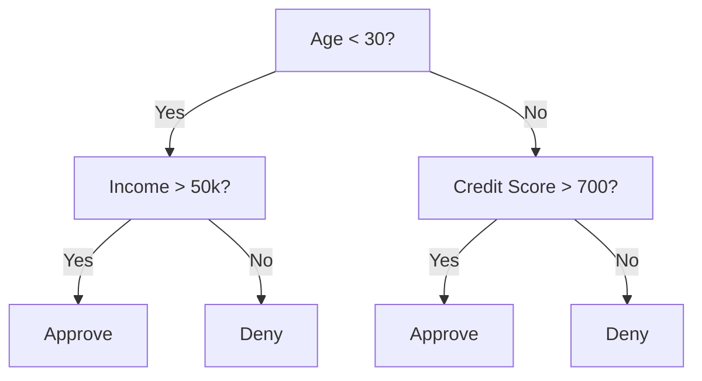
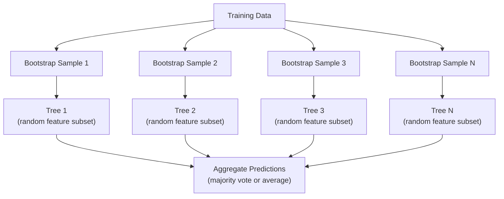

# Árvores de decisão e florestas aleatórias

> A árvore de decisão é apenas um processo. Mas a floresta, composta por muitas árvores, é uma das ferramentas mais poderosas do ML.

**类型：**Construir
**语言：**Python
**先修要求：**Fase 1 ((Lessões 09 Teoria da Informação, 06 Probabilidade)
**时间：**Cerca de 90 minutos

## Objectivo de aprendizagem

-                                                                                                                                                                                                                                                                                                                                                                                                                                                                                                                              
- Desde零 construir um árvore de decisão classificador,并加入 pre-tuning 控制(max profundidade、min amostras)
- Use bootstrap sampling 和 feature randomization  Construir floresta aleatória,并 explicar por que ele pode reduzir a variância
- Comparar a importância da característica MDI com a importância da permutação,并识别 MDI

## 问题

Você tem dados tabulares, faz uma mostra, faz uma característica, há também uma coluna-alvo que você quer prever. Você pode subir diretamente a uma rede neural. Mas para dados tabulares, modelos baseados em árvores, árvores de decisão, florestas aleatórias, árvores aumentadas por gradientes, continua melhor do que o Deep Learning.

Porquê?A árvore  não precisa de pré-processamento 就能处理混合特征 类型(numeric 和 categorical)  Eles não precisam de recursos de engenharia 就能处理非线性关系── eles têm interpretabilidade: você pode ver a árvore, ver exatamente uma previsão é como se produzir── enquanto as florestas aleatórias 会对许多树 求平均,对中等规模数据集 上的过 具有很强的抗力──

Este curso vai usar a divisão recorrente de zero construir árvores de decisão, e depois construir floresta aleatória sobre ela. Você vai realizar critérios de divisão 背后的数学 (Gini impureza, entropia, ganho de informação),并理解为什么一组弱学习者会成强学习者.

## 核心概念

### Árvore de decisão fazer o quê

Árvore de decisão                                                                                                                                                                                                                                                                                                                                                                                                                                                                                                                          



Cada nó interno usa um limiar 测试某特征── cada nó de folha faz uma previsão── para classificar um novo ponto de dados, você começa com a raiz, ao longo dos ramos, avança até chegar a uma folha──

Árvore                                                                                                                                                                                                                                                                                                                                                                                                                                                                                                                            

### Critérios de separação: Medir a impureza

Em cada nó, temos um grupo de amostras. Queremos que sejam divididas, para que os nódos de criança gerados sejam tão puros quanto possível.

**Gini impurity**Measurando é: se, de acordo com a distribuição de classes do nó   dado a um rótulo de seleção de amostra         , que é mal classificado probabilidade                                                                                                                                                                                                                                                                                                                                                                                                                                                                             

```
Gini(S) = 1 - sum(p_k^2)

where p_k is the proportion of class k in set S.
```

对于纯节点(全部属于同一个类),Gini = 0──对于50/50 classes的二进制分区,Gini = 0.5──越低越好──

```
Example: 6 cats, 4 dogs

Gini = 1 - (0.6^2 + 0.4^2) = 1 - (0.36 + 0.16) = 0.48
```

**Entropy**衡量 node 中的信息量 (message node)  (message node)  (message node)  (message node)  (message node)  (message node)  (message node)  (message node)  (message node)  (message node)  (message node)  (message node)  (message node)  (message node)  (message node)  (message node)  (message node)  (message node)  (message node)  (message node)  (message node)  (message node)  (message node)  (message node)  (message node)  (message)  (message)  (message)  (message)  (message)  (message)  (message)  (message)  (message)  (message)  (message) )

```
Entropy(S) = -sum(p_k * log2(p_k))
```

Para nós puros, entropia = 0── para divisão binária 50/50, entropia = 1,0──越低越好──

```
Example: 6 cats, 4 dogs

Entropy = -(0.6 * log2(0.6) + 0.4 * log2(0.4))
        = -(0.6 * -0.737 + 0.4 * -1.322)
        = 0.442 + 0.529
        = 0.971 bits
```

**Information gain**É a redução da impureza após a divisão (entropia ou Gini).

```
IG(S, feature, threshold) = Impurity(S) - weighted_avg(Impurity(S_left), Impurity(S_right))

where the weights are the proportions of samples in each child.
```

Cada nó acima do algoritmo ganancioso: tentar cada característica 和每个可能的门──select make information gain the biggest `(feature, threshold)`- Não.

### Divisão 如何工作

对于当前节上包含 n 个特征、m 个样本的数据集:

1. Para cada característica j ((j = 1 até n):
   - 按 feature j 对样本 排序
   -                                                                                                                                                                                                                                                               
   - 计算每个门 的信息获取
2.  seleccionar o ganho de informação
3. 将数据 split for left ((feature <= threshold) e right ((feature > threshold)
4. Para cada criança

Esta espécie de método ganancioso não garante obter a melhor árvore da região inteira.

### 停止条件

Se não houver condições para parar, a árvore continuará a crescer até que cada folha seja pura, cada folha uma amostra.

**Pre-pruning**"Ao fim de um arbre, a sua forma de crescer é de parar".
- Profundeza máxima: quando a árvore  atingir a profundidade definida 时停止 split
- Minima amostra por folha: se um nó de amostra menor que k, então parar
- Informações mínimas: se a melhor divisão para a melhoria da impureza for menor que um limiar, então parar
- Número máximo de nódulos de folhas: limite de folhas

**Post-pruning**Primeiro, produzir uma árvore completa, depois, voltar para a edificação:
- Custo-complexidade poda(squikit-learn Uso): adicionar um com folhas Número de árvores em proporção de penalidade
- Reduzido erro de poda: se o removimento de uma subárvore não aumenta o erro de validação, é removido

Pre-tadoura 更简单也更快──Pós-tadoura geralmente pode produzir árvores melhores, pois não vai parar muito cedo aqueles que podem trazer uma divisão útil subsequente.

### Utilizando árvores de decisão de Regressão

 Para a Regressão, a previsão de folha é o valor médio dos valores-alvo entre a folha e o critério de separação também irá variar:

**Variance reduction**替代 informação ganho:

```
VR(S, feature, threshold) = Var(S) - weighted_avg(Var(S_left), Var(S_right))
```

选择使变化 降低最多的分区――Tree 会把输入空间 划分为多个区域,并预测一个常数 (平均值) 在每个区域中预测一个常数 (平均值) △

### Florestas aleatórias: força do conjunto

 única árvore de decisão                                                                                                                                                                                                                                                                                                                                                                                                                                                                                                                       



两种随机性 让树木 多样性:

**Bagging（bootstrap aggregating）：**Cada árvore está em uma amostra de arranque.

**Feature randomization：**Em cada divisão, apenas considere um subconjunto de características arbitrárias. Para a Classificação, a默认是 sqrt(n_features) ⋅ Para a Regressão, é n_features/3── isso impedirá que todas as árvores estejam no mesmo recurso dominante.

关键洞见: para muitas árvores descorreladas 求平均, pode reduzir a variação em circunstâncias de não aumentar a viés.

### Importância das características

Florestas aleatórias 天然提供 características de importância pontuações──最常见的方法:

**Mean Decrease in Impurity (MDI)：**Para cada característica, todos os árvores em todos os nós que usam essa característica                                                                                                                                                                                                                                                                                                                                                                                                                                                                                                            

```
importance(feature_j) = sum over all nodes where feature_j is used:
    (n_samples_at_node / n_total_samples) * impurity_decrease
```

Este método é muito rápido, mas pode ser calculado durante o treino, mas tem características de alta cardinalidade e muitas possibilidades de pontos de divisão.

**Permutation importance**É outra maneira: fazer com que os valores de uma característica sejam perturbados, e medir a precisão do modelo, diminuindo o quanto.

### Árvore 何時胜過 Neural Network

Árvores e florestas em dados tabulares acima normalmente superam as redes neurais.

| Factor | Trees | Neural networks |
|--------|-------|----------------|
| Mixed types (numeric + categorical) | 原生支持 | 需要 encoding |
| Small datasets (< 10k rows) | 表现良好 | 容易 overfit |
| Feature interactions | 通过 splitting 找到 | 需要 architecture design |
| Interpretability | 完全透明 | Black box |
| Training time | 分钟级 | 小时级 |
| Hyperparameter sensitivity | 低 | 高 |

Quando os dados têm estrutura espacial ou seqüencial (imagem, texto, áudio)


```figure
decision-tree-depth
```

## Construí-lo

### 步骤 1:Gini impureza e entropia

A partir da zero construção, estes dois critérios de divisão, e verificam que eles são bons para determinar quais são as divisões.

```python
import math

def gini_impurity(labels):
    n = len(labels)
    if n == 0:
        return 0.0
    counts = {}
    for label in labels:
        counts[label] = counts.get(label, 0) + 1
    return 1.0 - sum((c / n) ** 2 for c in counts.values())

def entropy(labels):
    n = len(labels)
    if n == 0:
        return 0.0
    counts = {}
    for label in labels:
        counts[label] = counts.get(label, 0) + 1
    return -sum(
        (c / n) * math.log2(c / n) for c in counts.values() if c > 0
    )
```

### 步骤 2: encontrar a melhor divisão

尝试每个特征 和每个门── Returnar informações ganha o máximo daquele─

```python
def information_gain(parent_labels, left_labels, right_labels, criterion="gini"):
    measure = gini_impurity if criterion == "gini" else entropy
    n = len(parent_labels)
    n_left = len(left_labels)
    n_right = len(right_labels)
    if n_left == 0 or n_right == 0:
        return 0.0
    parent_impurity = measure(parent_labels)
    child_impurity = (
        (n_left / n) * measure(left_labels) +
        (n_right / n) * measure(right_labels)
    )
    return parent_impurity - child_impurity
```

### 步骤 3: Construir a classe DecisionTree

Divisão recorrente, previsão e rastreamento de importância das características.

```python
class DecisionTree:
    def __init__(self, max_depth=None, min_samples_split=2,
                 min_samples_leaf=1, criterion="gini",
                 max_features=None):
        self.max_depth = max_depth
        self.min_samples_split = min_samples_split
        self.min_samples_leaf = min_samples_leaf
        self.criterion = criterion
        self.max_features = max_features
        self.tree = None
        self.feature_importances_ = None

    def fit(self, X, y):
        self.n_features = len(X[0])
        self.feature_importances_ = [0.0] * self.n_features
        self.n_samples = len(X)
        self.tree = self._build(X, y, depth=0)
        total = sum(self.feature_importances_)
        if total > 0:
            self.feature_importances_ = [
                fi / total for fi in self.feature_importances_
            ]

    def predict(self, X):
        return [self._predict_one(x, self.tree) for x in X]
```

### 步骤 4: Construir a classe RandomForest

Probelamento de bootstrap, aleatorização de características e votação majoritária.

```python
class RandomForest:
    def __init__(self, n_trees=100, max_depth=None,
                 min_samples_split=2, max_features="sqrt",
                 criterion="gini"):
        self.n_trees = n_trees
        self.max_depth = max_depth
        self.min_samples_split = min_samples_split
        self.max_features = max_features
        self.criterion = criterion
        self.trees = []

    def fit(self, X, y):
        n = len(X)
        for _ in range(self.n_trees):
            indices = [random.randint(0, n - 1) for _ in range(n)]
            X_boot = [X[i] for i in indices]
            y_boot = [y[i] for i in indices]
            tree = DecisionTree(
                max_depth=self.max_depth,
                min_samples_split=self.min_samples_split,
                max_features=self.max_features,
                criterion=self.criterion,
            )
            tree.fit(X_boot, y_boot)
            self.trees.append(tree)

    def predict(self, X):
        all_preds = [tree.predict(X) for tree in self.trees]
        predictions = []
        for i in range(len(X)):
            votes = {}
            for preds in all_preds:
                v = preds[i]
                votes[v] = votes.get(v, 0) + 1
            predictions.append(max(votes, key=votes.get))
        return predictions
```

完整实现及所有辅助方法 见 `code/trees.py`- Não.

## Use-o

Usar um pequeno aprendizado, treinar floresta aleatória

```python
from sklearn.ensemble import RandomForestClassifier
from sklearn.datasets import load_iris
from sklearn.model_selection import train_test_split

X, y = load_iris(return_X_y=True)
X_train, X_test, y_train, y_test = train_test_split(X, y, random_state=42)

rf = RandomForestClassifier(n_estimators=100, random_state=42)
rf.fit(X_train, y_train)
print(f"Accuracy: {rf.score(X_test, y_test):.4f}")
print(f"Feature importances: {rf.feature_importances_}")
```

Na prática, as árvores aumentadas em gradiente (XGBoost, LightGBM, CatBoost) são geralmente mais fortes do que as florestas aleatórias, pois elas são construídas em ordem de árvores, cada árvore está em erro de correção de árvores na frente.

## Entrega-o

本课会产出 `outputs/prompt-tree-interpreter.md`, é um aplicativo usado para explicar as divisões de árvores de decisão para empresas. Introduzi-lo na estrutura da árvore já treinada.

## 练习

1. Em um conjunto de dados 2D que contém 3 classes, a árvore de decisão é dividida em três partes.

2. Para árvores de regressão                                                                                                                                                                                                                                                                                                                                                                                                                                                                                                                      

3. Construção contém 1、5、10、50 和 200 árvores floresta aleatória.

4. Em 5 conjuntos de dados diferentes, a impureza de Gini e a entropia são comparadas como um critério de divisão.

5. 实现 permutation importance── em um conjunto de dados 上将它与MDI importance比较, uma das características é ruído aleatório, mas com alta cardinalidade──MDI 会把噪音功能排得很高──Permutation importance 不会──

## 关键术语

| Term | 人们常说 | 实际含义 |
|------|----------------|----------------------|
| Decision tree | “用于 predictions 的流程图” | 一种通过学习一系列 if/else splits，将 feature space 划分为矩形区域的 model |
| Gini impurity | “node 有多混杂” | 在某个 node 上 misclassify 一个 random sample 的概率。0 = pure，0.5 = binary 情况下的最大 impurity |
| Entropy | “node 中的混乱程度” | node 上的信息量。0 = pure，1.0 = binary 情况下的最大 uncertainty。来自 information theory |
| Information gain | “split 有多好” | split 后 impurity 的降低量。用于选择 splits 的 greedy criterion |
| Pre-pruning | “提前停止 tree” | 通过设置 max depth、min samples 或 min gain thresholds，提前停止 tree growth |
| Post-pruning | “事后修剪 tree” | 先生成完整 tree，再移除不会提升 validation performance 的 subtrees |
| Bagging | “在随机 subsets 上训练” | Bootstrap aggregating。在不同的有放回 random sample 上训练每个 model |
| Random forest | “一堆 trees” | Decision trees 的 ensemble，每棵 tree 都在 bootstrap sample 上训练，并在每次 split 使用 random feature subsets |
| Feature importance (MDI) | “哪些 features 重要” | 每个 feature 贡献的总 impurity decrease，在所有 trees 和 nodes 上求和 |
| Permutation importance | “打乱后检查” | 随机打乱某个 feature 的 values 时 accuracy 的下降量。对于 noisy features，比 MDI 更可靠 |
| Variance reduction | “info gain 的 regression 版本” | Information gain 的 regression tree 对应形式。选择使 target variance 降低最多的 split |
| Bootstrap sample | “带重复的 random sample” | 从原始 dataset 中有放回抽取得到的 random sample。大小相同，但包含 duplicates |

## 延伸阅读

- [Breiman: Random Forests (2001)](https://link.springer.com/article/10.1023/A:1010933404324)- Origins foresta aleatória
- [Grinsztajn et al.: Why do tree-based models still outperform deep learning on tabular data? (2022)](https://arxiv.org/abs/2207.08815)-  Sobre árvores vs redes neurais em tarefas tabuleiras                                                                                                                                                                                                                                                                                                                                                                                                                                                                                                             
- [scikit-learn Decision Trees documentation](https://scikit-learn.org/stable/modules/tree.html)- 带视觉化工具 的实践指南
- [XGBoost: A Scalable Tree Boosting System (Chen & Guestrin, 2016)](https://arxiv.org/abs/1603.02754)- 主导 Kaggle' s gradiente de aumento 论文
