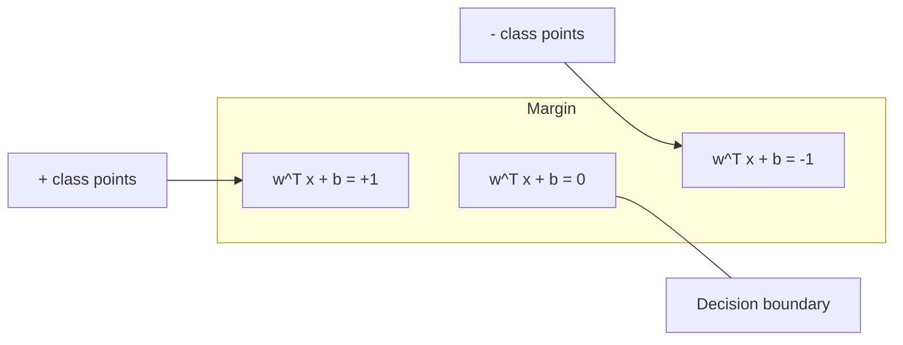
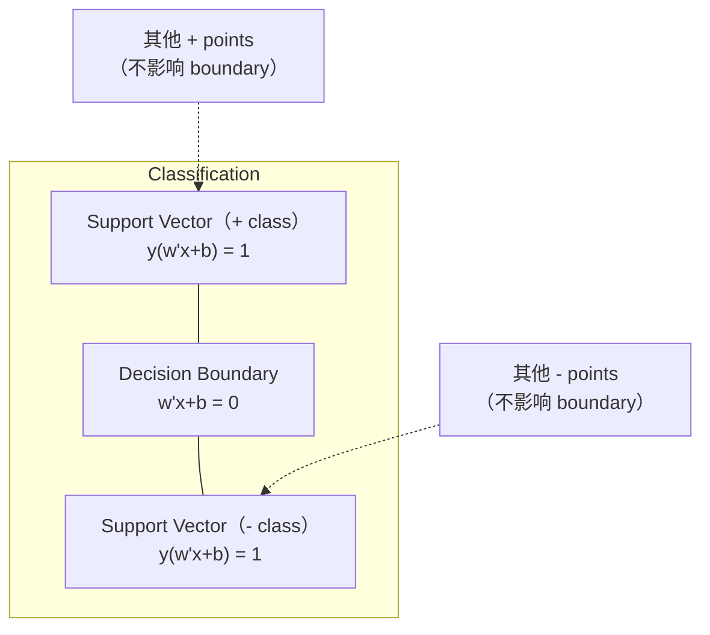
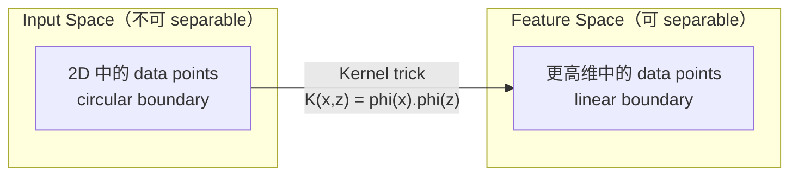

# Máquinas de apoio de vetores

> Entre as duas categorias, encontrar a rua mais larga.

**Type:** Build
**Language:**Python
**先修要求：**Fase 1 ((Lessões 08 Optimização, 14 Normas e Distanças, 18 Optimização Convexa)
**Time:** ~90 分钟

## Objectivo de aprendizagem
- Utilize perda de carris e formulação primária de descida de gradiente, desde zero para realizar um SVM linear
-                                                                                                                                                                                                                                                                                                                                                                                                                                                                                                                              
- Comparar kernels lineares, polinômios e RBF, e explicar truque do kernel  como evitar um alto nível de visão
-  avaliação por parâmetro C  controlo da largura da margem e dos erros de classificação 

## 问题
Você tem dois tipos de pontos de dados, precisa desenhar uma linha reta (ou hiperplano) para separá-los.

选择边界 最大的那一条──margin é o limite de decisão com a distância entre os dois pontos de dados mais próximos.

Esta intuição levou a Support Vector Machines, que é um dos algoritmos mais elegantes da matemática do ML. Os SVMs antes do Deep Learning eram métodos de classificação predominantes, e ainda são a melhor escolha entre os problemas de pequenos conjuntos de dados, grandes quantidades de dados e modelos que precisam de princípios, compreensão plena e garantia teórica.

SVMs  пряма连接 до Фаза 1: a otimização é convexa de (Lessão 18) , margem com normas para medir (Lessão 14) e o truque do kernel utilizando produtos de pontos, em não realmente calcular o espaço elevado, em caso de processamento de limites não lineares.

## 概念
### Máximo classificador de intervalo

给定 labels y_i in {-1, +1} 和 feature vectors x_i linearmente separable data, nós queremos encontrar um hiperplano w^T x + b = 0 来分离类别。

A distância do ponto x_i até o hiperplano é:

```
distance = |w^T x_i + b| / ||w||
```

对于正确分类的点:y_i * (w^T x_i + b) > 0──margem é de hiperplano até o lado de perto de ponto de distância dos dois vezes──



problema de otimização:

```
maximize    2 / ||w||     (margin width)
subject to  y_i * (w^T x_i + b) >= 1  for all i
```

É fácil otimizar:

```
minimize    (1/2) ||w||^2
subject to  y_i * (w^T x_i + b) >= 1  for all i
```

Este é um programa quadrático convexo. Ele tem uma solução global única. Está bem localizado nos limites de margem.

### Vêctores de suporte:关键的少数点



A maioria dos pontos de treinamento são únicos. Só existem vetores de suporte. É importante. É por isso que os SVM são eficientes em memória.

O número de vetores de suporte também deu uma definição de erro de generalização. Em relação ao tamanho do conjunto de dados, os vetores de suporte são menores, a generalização é melhor.

### Margem suave: Utilize parameter C 处理噪声

Os dados verdadeiros são muito poucos completamente separaveis. Alguns pontos podem estar no lado errado da fronteira, ou no interior da margem.

```
minimize    (1/2) ||w||^2 + C * sum(xi_i)
subject to  y_i * (w^T x_i + b) >= 1 - xi_i
            xi_i >= 0  for all i
```

a variavel de flexibilidade xi_i 衡量点 i 违反差距的程度──C 控制这种交易:

| C value | Behavior |
|---------|----------|
| Large C | 对 violations 施加重罚。margin 窄，misclassifications 更少。Overfits |
| Small C | 允许更多 violations。margin 宽，misclassifications 更多。Underfits |

C é força de regularização de um número de vezes maior C = menor regularização de um número menor C = mais regularização de um número maior C = menor regularização de um número menor C = mais regularização de um número maior C = menor regularização de um número menor C = mais regularização de um número maior C = menor regularização de um número menor C = menor C = mais regularização de um número maior C = menor regularização de um número maior C = menor C = menor regularização de um número maior C = menor C = menor C = menor C = mais regularização de um número maior C = menor C = menor C = menor C = menor C = menor C = menor C = menor C = menor C = menor

### Perda de colchão: Função de perda de SVM

SVM de margem macia pode ser reescrevido para otimização sem restrições:

```
minimize    (1/2) ||w||^2 + C * sum(max(0, 1 - y_i * (w^T x_i + b)))
```

项 max(0, 1 - y_i * f(x_i)) é a perda de carcaça.

```
单个点的 Hinge loss：

loss
  |
  | \
  |  \
  |   \
  |    \
  |     \_______________
  |
  +-----|-----|-------->  y * f(x)
       0     1

当 y*f(x) >= 1 时为 zero loss（正确分类，位于 margin 外）。
当 y*f(x) < 1 时为 linear penalty。
```

Com perda logística (regressão logística)

```
Hinge:     max(0, 1 - y*f(x))          在 margin 处 hard cutoff
Logistic:  log(1 + exp(-y*f(x)))        平滑，永远不会精确为零
```

Perda de colchão  produz soluções escassas(apenas vetores de suporte 有非零贡献) ――perda lógica Utilize todos os pontos de dados―, o que torna os SVMs em tempo de previsão mais eficientes em memória―.

### Use gradiente descida  тренинг linear SVM

Você pode usar perda de carris, adicionando a regularização de L2 para treinar a descida de gradiente de SVM linear, sem precisar de resolver QP restringido:

```
L(w, b) = (lambda/2) * ||w||^2 + (1/n) * sum(max(0, 1 - y_i * (w^T x_i + b)))

关于 w 的 Gradient：
  If y_i * (w^T x_i + b) >= 1:  dL/dw = lambda * w
  If y_i * (w^T x_i + b) < 1:   dL/dw = lambda * w - y_i * x_i

关于 b 的 Gradient：
  If y_i * (w^T x_i + b) >= 1:  dL/db = 0
  If y_i * (w^T x_i + b) < 1:   dL/db = -y_i
```

Isto é chamado de formulação primária. É o tempo de execução de cada época para O (n * d), em que n é o número de amostras, d é o número de características.

### Dual formulação e truque do núcleo

O problema do SVM do duplo Lagrangiano ((( provém da fase 1 Lição 18, condições de KKT) é:

```
maximize    sum(alpha_i) - (1/2) * sum_ij(alpha_i * alpha_j * y_i * y_j * (x_i . x_j))
subject to  0 <= alpha_i <= C
            sum(alpha_i * y_i) = 0
```

Dual apenas envolve produtos de pontos entre dados x_i. x_j。 é um fundamental.

```
Linear kernel:      K(x, z) = x . z
Polynomial kernel:  K(x, z) = (x . z + c)^d
RBF (Gaussian):     K(x, z) = exp(-gamma * ||x - z||^2)
```

O kernel RBF irá mapear dados para um espaço infinito-dimensional. O espaço de entrada pode ser usado para aprender qualquer limite de decisão suave.



truque do kernel em situações em que não entra em alto espaço, calcular o produto de pontos no espaço.

### MPS para regressão (MPS)

Apoio Vêtor Regressão irá rodar dados adequados a uma largura para um tubo de epsilon.

```
minimize    (1/2) ||w||^2 + C * sum(xi_i + xi_i*)
subject to  y_i - (w^T x_i + b) <= epsilon + xi_i
            (w^T x_i + b) - y_i <= epsilon + xi_i*
            xi_i, xi_i* >= 0
```

Parâmetro epsilon  controlar largura do tubo 越宽 = vetores de suporte 越少 = fit 更平滑──tube 越窄 = vetores de suporte 越多 = fit 更紧──

### Por que os SVM                                                                                                                                                                                                                                                                                                                                                                                                                                                                                                                         

Os SVM dominaram o ML desde o final dos anos 1990 até o início de 2010. O Deep Learning superou-os por vários motivos:

| Factor | SVMs | Deep learning |
|--------|------|---------------|
| Feature engineering | 需要它 | 学习 features |
| Scalability | kernel 为 O(n^2) 到 O(n^3) | 使用 SGD 时每个 epoch 为 O(n) |
| Image/text/audio | 需要 handcrafted features | 从 raw data 学习 |
| Large datasets (>100k) | 慢 | 扩展良好 |
| GPU acceleration | 收益有限 | 巨大加速 |

Os SVM ainda vencem nesses cenários:
- Pequenas datas ((100 a baixas milhares de amostras)
- 高维 dados escassos(带 TF-IDF características 的文本)
- Quando você precisa de matemática (margem)
- Quando o tempo de treinamento                                                                                                                                                                                                                                                                                                                                                                                                                                                                                                                        
- 具有清晰 margin structure  具有清晰 margin structure  具有清晰 margin structure 具有清晰 margin structure 具有清晰 margin structure 具有清晰 margin structure 具有清晰 margin structure 具有清晰 margin structure 具有清晰 margin structure 具有清晰 margin structure 具有清晰 margin structure 具有清晰 margin structure 具有清晰 margin structure 具有清晰 margin structure 具有清晰 margin structure 具有清晰 margin structure 具有清晰 margin structure 具有清晰 margin structure 具有清晰 margin structure 具有清晰 margin structure 具有清晰 margin structure 具有清晰 margin structure 具有清晰 margin structure 具有清晰 margin structure 具有清晰 margin structure 具有清晰 margin structure 具有清晰 margin structure 具有清晰 margin structure 具有清晰 margin 具有清晰 margin structure 具有清晰 具有清晰 margin structure 具有清晰 具有清晰 margin structure 具有清晰 具有清晰 margin 具有清晰 具有清晰 具有清晰 具有清晰 具有清晰的二二二二二二二二二二二二二二二二二二二二二二二二二二二二二二二二二二二二二二二二二二二二二二二二二二二二二二二二二二二二二二二二二二二二二二二二二二二二二二二二二二二二二二二二二二二二二二二二二二二二二二二二二二二二二二二二二二二二二二二二二二二二二二二二二二二二二二二二二二二二二二二二二二二二二二二二二二二二二二二二二二二二二二二二二二二二二二二二二二二二二二二二二二二二二二二二二二二二二二二二二二二二二二二二二二二二二二二二二二二二二二二二二二二二二二二二二二二二二二二二二二二二二二二二二二二二二二二二二二二二二二二二二二二二二二二二二二二二二二二
- Detecção de anomalias (SVM de uma classe)


```figure
svm-margin
```

## Construí-lo
### 步骤 1: Perda de enxaguada e gradiente

基础――计算一个批量的关损失及其梯度――

```python
def hinge_loss(X, y, w, b):
    n = len(X)
    total_loss = 0.0
    for i in range(n):
        margin = y[i] * (dot(w, X[i]) + b)
        total_loss += max(0.0, 1.0 - margin)
    return total_loss / n
```

### 步骤 2: SVM linear através da descida de gradiente

通過最小化定期關關損失 来訓練──不需要 QP solver──

```python
class LinearSVM:
    def __init__(self, lr=0.001, lambda_param=0.01, n_epochs=1000):
        self.lr = lr
        self.lambda_param = lambda_param
        self.n_epochs = n_epochs
        self.w = None
        self.b = 0.0

    def fit(self, X, y):
        n_features = len(X[0])
        self.w = [0.0] * n_features
        self.b = 0.0

        for epoch in range(self.n_epochs):
            for i in range(len(X)):
                margin = y[i] * (dot(self.w, X[i]) + self.b)
                if margin >= 1:
                    self.w = [wj - self.lr * self.lambda_param * wj
                              for wj in self.w]
                else:
                    self.w = [wj - self.lr * (self.lambda_param * wj - y[i] * X[i][j])
                              for j, wj in enumerate(self.w)]
                    self.b -= self.lr * (-y[i])

    def predict(self, X):
        return [1 if dot(self.w, x) + self.b >= 0 else -1 for x in X]
```

### 步骤 3: Funções do núcleo

实现 linear、polinômio 和 RBF kernels。

```python
def linear_kernel(x, z):
    return dot(x, z)

def polynomial_kernel(x, z, degree=3, c=1.0):
    return (dot(x, z) + c) ** degree

def rbf_kernel(x, z, gamma=0.5):
    diff = [xi - zi for xi, zi in zip(x, z)]
    return math.exp(-gamma * dot(diff, diff))
```

### 步骤 4: Identificação de margem e vetor de suporte

訓練後,识别哪些点是支持向量,并计算边界宽度──

```python
def find_support_vectors(X, y, w, b, tol=1e-3):
    support_vectors = []
    for i in range(len(X)):
        margin = y[i] * (dot(w, X[i]) + b)
        if abs(margin - 1.0) < tol:
            support_vectors.append(i)
    return support_vectors
```

完整实现和所有 demos 见 `code/svm.py`- Não.

## Use-o
Utilize scikit-learn:

```python
from sklearn.svm import SVC, LinearSVC, SVR
from sklearn.preprocessing import StandardScaler
from sklearn.pipeline import Pipeline

clf = Pipeline([
    ("scaler", StandardScaler()),
    ("svm", SVC(kernel="rbf", C=1.0, gamma="scale")),
])
clf.fit(X_train, y_train)
print(f"Accuracy: {clf.score(X_test, y_test):.4f}")
print(f"Support vectors: {clf['svm'].n_support_}")
```

importante: treinar SVM                                                                                                                                                                                                                                                                                                                                                                                                                                                                                                                      

对于大数据集,使用 `LinearSVC`(Fomulação primária, cada época é o O (n))`SVC`(formulação dupla, O  n ^ 2) até O  n ^ 3)):

```python
from sklearn.svm import LinearSVC

clf = Pipeline([
    ("scaler", StandardScaler()),
    ("svm", LinearSVC(C=1.0, max_iter=10000)),
])
```

## 练习
1. 生成一 2D linearly separable dataset──训练你的线性SVM,并识别支持向量──验证支持向量 是最接近决策边界的点──

2. Em um conjunto de dados ruidosos 上将 C de 0,001 变化到 1000──为每 C value 绘制决策界限──观察从宽边缘(不适合) 到狭边边缘(过) 的过渡──

3. 创建一个类界限 为圆形(非线性) 的数据集──展示线性SVM 会失败──计算RBF kernel matrix,并展示类别在内核诱导功能空间 中变得分离性──

4. Em um mesmo conjunto de dados, comparar a perda de hinge com a perda logística. Treinar um SVM linear e regressão logística.

5. 实现 SVR(epsilon-insensível perda) ・・・将它拟合到 y = sin(x) + ruído。 desenhar previsões 周围的epsilon tube,并突出显示支持向量(tube 外的点) ・・・

## 关键术语
| Term | What it actually means |
|------|----------------------|
| Support vectors | 最接近 decision boundary 的 training points。唯一决定 hyperplane 的点 |
| Margin | decision boundary 与最近 support vectors 之间的距离。SVMs 会最大化它 |
| Hinge loss | max(0, 1 - y*f(x))。正确分类且位于 margin 外时为零。否则为 linear penalty |
| C parameter | margin width 与 classification errors 之间的 trade-off。Large C = narrow margin，small C = wide margin |
| Soft margin | 通过 slack variables 允许 margin violations 的 SVM formulation。处理 non-separable data |
| Kernel trick | 在不显式映射到高维 feature space 的情况下，计算该空间中的 dot products |
| Linear kernel | K(x, z) = x . z。等价于标准 dot product。用于 linearly separable data |
| RBF kernel | K(x, z) = exp(-gamma * \|\|x-z\|\|^2)。映射到 infinite dimensions。学习任意 smooth boundary |
| Polynomial kernel | K(x, z) = (x . z + c)^d。映射到 polynomial combinations 的 feature space |
| Dual formulation | SVM problem 的重写形式，只依赖数据点之间的 dot products。支持 kernels |
| SVR | Support Vector Regression。围绕数据拟合 epsilon-tube。tube 内的点具有 zero loss |
| Slack variables | xi_i：衡量一个点违反 margin 的程度。正确分类且位于 margin 外的点为零 |
| Maximum margin | 选择能够最大化到每个类别最近点距离的 hyperplane 的原则 |

## 延伸阅读
- [Vapnik: The Nature of Statistical Learning Theory (1995)](https://link.springer.com/book/10.1007/978-1-4757-3264-1)-  Sobre os SVM e o aprendizado estatístico
- [Cortes & Vapnik: Support-vector networks (1995)](https://link.springer.com/article/10.1007/BF00994018)- papel SVM original
- [Platt: Sequential Minimal Optimization (1998)](https://www.microsoft.com/en-us/research/publication/sequential-minimal-optimization-a-fast-algorithm-for-training-support-vector-machines/)- 让SVM training 变得实用 SMO algoritmo
- [scikit-learn SVM documentation](https://scikit-learn.org/stable/modules/svm.html)- 包含实施细节的实践指南
- [LIBSVM: A Library for Support Vector Machines](https://www.csie.ntu.edu.tw/~cjlin/libsvm/)- 大多数 SVM implementações 背后的C++ biblioteca
