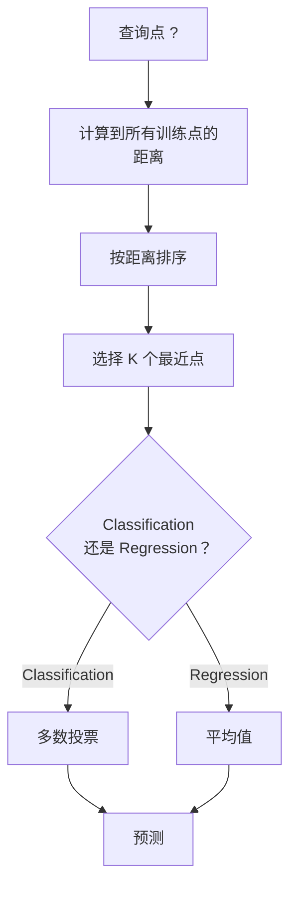
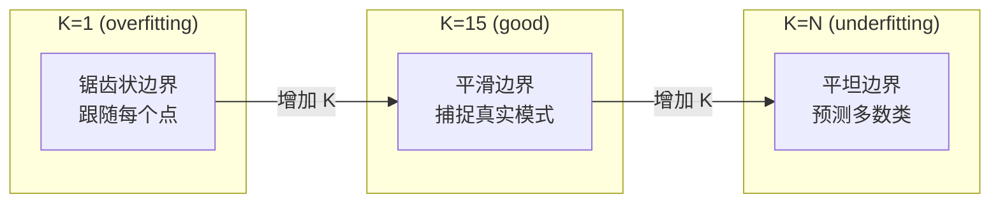
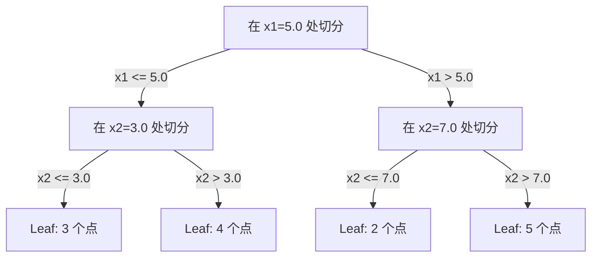

# Os vizinhos mais próximos e as distâncias

> 保存一切──通过查看你的邻居来预测── é o algoritmo mais simples e realmente eficaz──

**Type:** Build
**Language:**Python
**前置要求：**Fase 1 ((Lessão 14 Normas e Distanças)
**Time:** ~90 分钟

## Objectivo de aprendizagem
- A partir do zero, a Classificação KNN e a Regressão, apoiada pela C e a Distância de
- Comparar L1、L2、cosine 和 Minkowski 距离度,并为给定数据类型选择合适度
- Explicar a dimensão do desastre, e demonstrar por que a KNN em alta dimensão do espaço se desintegra
- Construir árvore KD para alcançar alta eficiência de busca vizinha mais próxima,并分析它何时优于原力

## 问题
Você tem um conjunto de dados. Um novo ponto de dados está chegando. Você precisa classificar ou prever seu valor. Com os parâmetros de aprendizagem de dados, como regressão linear ou SVMs, você só precisa encontrar o K 个 treinamento ponto mais próximo do novo ponto e deixá-los votar.

É o que é o K-vizinho mais próximo. Não há fase de treinamento. Não há necessidade de aprender. Não há necessidade de minimizar a função de perda.

Parece simples a não ser capaz de trabalhar. Mas a KNN é competitiva em muitas questões, especialmente em pequenos conjuntos de dados.

A KNN também tem diferentes nomes em diferentes lugares da IA moderna. Os bancos de dados vetores estão em Embeddings e executam a pesquisa KNN. A geração aumentada de recuperação (RAG) vai procurar K 个近期文档片段――推系统会寻找相似用户或物品――o algoritmo é o mesmo―― é diferente de tamanho e estrutura de dados――

## 概念
### Como funciona a KNN

                                                                                                                                                                                                                                                                                                                                                                                                                                                                                                                             

1.  calcular a distância de cada ponto de consulta para o centro de dados
2. 按距离排序
3. 取最近的 K 个点
4. 对于分类:在 K 个邻居中进行多数投票
5. 对于 Regression:对 K 个邻居的值取平均 (%)



É o algoritmo completo. Não há nenhuma combinação. Não há descida gradual.

### Escolher K

K é o único hiperparâmetro. Controla o trade-off de variação de viés:

| K | 行为 |
|---|----------|
| K = 1 | 决策边界跟随每一个点。训练误差为零。高方差。Overfits |
| Small K (3-5) | 对局部结构敏感。可以捕捉复杂边界 |
| Large K | 边界更平滑。对噪声更稳健。可能 underfit |
| K = N | 对每个点都预测多数类。最大 bias |

常见起点是对包含 N 个点的数据集使用 K = sqrt(N)。二分类时使用奇数 K,以避免平票──



### Metricas de distância

A função distância define o que se chama de proximidade. Diferentes medidas geram diferentes vizinhos. Diferentes previsões.

**L2 (Euclidean)**É um erro de escolha.

```
d(a, b) = sqrt(sum((a_i - b_i)^2))
```

Para a sensibilidade à medida das características, utilizam-se as características L2 e KNN, sempre para padronização.

**L1 (Manhattan)**Em relação ao L2, é mais resistente a valores fora do limite, pois não é resistente ao valor do diferencial quadrado.

```
d(a, b) = sum(|a_i - b_i|)
```

**Cosine distance**∆ medir ângulos entre vetores ∆,                                                                                                                                                                                                                                                         

```
d(a, b) = 1 - (a . b) / (||a|| * ||b||)
```

**Minkowski**Utilize parametros p 泛化 L1 和 L2──

```
d(a, b) = (sum(|a_i - b_i|^p))^(1/p)

p=1: Manhattan
p=2: Euclidean
p->inf: Chebyshev (max absolute difference)
```

Utilize que tipo de medida depende dos dados:

| 数据类型 | 最佳度量 | 原因 |
|-----------|------------|-----|
| 数值特征，尺度相近 | L2 (Euclidean) | 默认选择，适用于空间数据 |
| 数值特征，存在 outliers | L1 (Manhattan) | 稳健，不会放大大差异 |
| Text embeddings | Cosine | 大小是噪声，方向是含义 |
| 高维稀疏 | Cosine 或 L1 | L2 受维度灾难影响严重 |
| 混合类型 | Custom distance | 按特征类型组合度量 |

### KNN ponderado

O KNN padrão concede o mesmo peso a todos os vizinhos K, mas a distância de 0,1 vizinho deve ser mais importante do que a distância de 5,0 vizinho.

**Distance-weighted KNN**按距离的倒数为每个邻居加权:

```
weight_i = 1 / (distance_i + epsilon)

For classification: weighted vote
For regression:     weighted average = sum(w_i * y_i) / sum(w_i)
```

Quando os pontos de consulta e de treinamento se combinam perfeitamente, o epsilon pode evitar a separação em zero.

O KNN ponderado é muito sensível à escolha de K, pois os vizinhos distantes contribuem muito pouco.

### 维度灾难

KNN  desempenho irá em alta altura em deterioração. Não é uma preocupação confusa, mas um fato matemático.

**问题 1：距离会收敛。**Com o aumento da dimensão, a relação entre a distância máxima e a distância mínima se aproxima de 1.

```
In d dimensions, for random uniform points:

d=2:    max_dist / min_dist = varies widely
d=100:  max_dist / min_dist ~ 1.01
d=1000: max_dist / min_dist ~ 1.001

When all distances are nearly equal, "nearest" is meaningless.
```

**问题 2：体积会爆炸。**Para capturar K de vizinhos em proporções fixas de dados, é necessário ampliar o meio de pesquisa, para que cobre uma grande parte do espaço característico.

**问题 3：角落占主导。**Em d 维单位超立体, a maior parte do volume é concentrada perto do canto, em vez do centro. Com o crescimento do d, o número de pontos de massa que contêm os corpos em um quadrado se aproxima de zero.

实际后果:KNN em aproximadamente 20-50 个特征内表现良好――超过这个范围之后, você precisa realizar uma redução de dimensionalidade na aplicação de KNN (PCA、UMAP、t-SNE), ou usar para utilizar dados dentro de estruturas de busca baseadas em árvores de baixo nível――

### Árvores KD: Rapidez vizinha mais próxima 搜索

A força bruta KNN calcula o ponto de consulta até a distância de cada ponto de treinamento. A complexidade de cada consulta é O ((n * d) ⋅ para grandes conjuntos de dados, é muito lento.

KD-tree 会沿征轴递归划分空间―― em cada camada, ela faz a secção em uma determinada dimensão de acordo com o número médio――



Para encontrar o vizinho mais próximo, primeiro atravesse a árvore para incluir a folha do ponto de consulta, depois volte para trás, e só em áreas próximas pode conter mais perto quando os verificar.

平均查询时间:低维时为 O(log n) ・・・ mas KD-árboles 在高维(d > 20) 会退化为 O(n),因为回溯能排除的分支越来越少──

### Árvores de bola: 更适合中等维度

As árvores de bolas vão dividir os dados em super-bolas em conjunto, em vez de em caixas de eixos em conjunto. Cada ponto define uma bola, o centro + o raio, contendo todos os pontos na árvore.

O que é o melhor para a família das KD-trees?
- Em média, melhor desempenho (~50)
- 能处理 não-axial à estrutura
- Mas o limite mais próximo significa que, ao procurar, pode cortar mais ramos.

Para uma pesquisa de grande escala real, será usado o método mais próximo de vizinhos (HNSW, FIV, quantização de produtos).

### Aprendizagem preguiçosa vs aprendizagem ansiosa

KNN é um aprendiz preguiçoso: treinamento não faz trabalho, todos os trabalhos são realizados em previsão. A maioria dos outros algoritmos (regressão linear, SVMs, redes neurais) são aprendizes ansiosos: eles fazem grandes quantidades de cálculos durante o treinamento para construir um modelo e então a previsão é rápida.

| 方面 | Lazy (KNN) | Eager (SVM, neural net) |
|--------|------------|------------------------|
| 训练时间 | O(1)，只存储数据 | O(n * epochs) |
| 预测时间 | 每次查询 O(n * d) | O(d) 或 O(parameters) |
| 预测时内存 | 存储整个训练集 | 只存储模型参数 |
| 适应新数据 | 立即添加点 | 重新训练模型 |
| 决策边界 | 隐式，在运行时计算 | 显式，训练后固定 |

Aprendizagem preguiçosa 适合以下场景:
- Número de dados (também conhecido como número de dados)
- Só preciso de poucas perguntas.
- Tu queres treinar tempo para zero
- Número de dados, pesquisa bruta de força

### KNN para regressão

A regressão não faz a maioria dos votos, mas sim a média dos objetivos dos vizinhos K 个.

```
prediction = (1/K) * sum(y_i for i in K nearest neighbors)

Or with distance weighting:
prediction = sum(w_i * y_i) / sum(w_i)
where w_i = 1 / distance_i
```

A regressão KNN 产生分段常数预测(使用加权时为分段平滑) ・・・ não pode ser extraída para fora do âmbito dos dados de treinamento。 Se o objetivo de treinamento estiver entre 0 a 100, o KNN 永远不会预测 200。


```figure
knn-smoothness
```

## Construí-lo
### 步骤 1: Funções de distância

实现 L1、L2、cosine 和 Minkowski 距离──这些内容直接连接到阶段 1 课 14──

```python
import math

def l2_distance(a, b):
    return math.sqrt(sum((ai - bi) ** 2 for ai, bi in zip(a, b)))

def l1_distance(a, b):
    return sum(abs(ai - bi) for ai, bi in zip(a, b))

def cosine_distance(a, b):
    dot_val = sum(ai * bi for ai, bi in zip(a, b))
    norm_a = math.sqrt(sum(ai ** 2 for ai in a))
    norm_b = math.sqrt(sum(bi ** 2 for bi in b))
    if norm_a == 0 or norm_b == 0:
        return 1.0
    return 1.0 - dot_val / (norm_a * norm_b)

def minkowski_distance(a, b, p=2):
    if p == float('inf'):
        return max(abs(ai - bi) for ai, bi in zip(a, b))
    return sum(abs(ai - bi) ** p for ai, bi in zip(a, b)) ** (1 / p)
```

### 步骤 2: Classificador e regressor KNN

Construção de KNN completa, apoio de K ̊ de distância de medida e de aumento de distância de opção 

```python
class KNN:
    def __init__(self, k=5, distance_fn=l2_distance, weighted=False,
                 task="classification"):
        self.k = k
        self.distance_fn = distance_fn
        self.weighted = weighted
        self.task = task
        self.X_train = None
        self.y_train = None

    def fit(self, X, y):
        self.X_train = X
        self.y_train = y

    def predict(self, X):
        return [self._predict_one(x) for x in X]
```

### 步骤 3: Árvore KD para uma busca eficiente

Desde zero construção da árvore KD, de acordo com cada dimensão, o número médio é devolvido ao

```python
class KDTree:
    def __init__(self, X, indices=None, depth=0):
        # Recursively partition the data
        self.axis = depth % len(X[0])
        # Split on median of the current axis
        ...

    def query(self, point, k=1):
        # Traverse to leaf, then backtrack
        ...
```

完整实现见 `code/knn.py`, que contém todos os métodos e demonstrações de apoio.

### 步骤 4: Escalagem de características

A KNN precisa de uma escala de características, pois a distância para as características é muito pequena.

```python
def standardize(X):
    n = len(X)
    d = len(X[0])
    means = [sum(X[i][j] for i in range(n)) / n for j in range(d)]
    stds = [
        max(1e-10, (sum((X[i][j] - means[j]) ** 2 for i in range(n)) / n) ** 0.5)
        for j in range(d)
    ]
    return [[((X[i][j] - means[j]) / stds[j]) for j in range(d)] for i in range(n)], means, stds
```

## Use-o
Utilize scikit-learn:

```python
from sklearn.neighbors import KNeighborsClassifier
from sklearn.preprocessing import StandardScaler
from sklearn.pipeline import Pipeline

clf = Pipeline([
    ("scaler", StandardScaler()),
    ("knn", KNeighborsClassifier(n_neighbors=5, metric="euclidean")),
])
clf.fit(X_train, y_train)
print(f"Accuracy: {clf.score(X_test, y_test):.4f}")
```

Quando o conjunto de dados é grande e dimensional, ele pode ser usado automaticamente com árvores KD ou árvores de bolas.`algorithm`- É um ponto de controlo.

Para pesquisa de grande escala de vizinhos próximos ((数百万个矢量), use FAISS、Annoy 或 Vector database:

```python
import faiss

index = faiss.IndexFlatL2(dimension)
index.add(embeddings)
distances, indices = index.search(query_vectors, k=5)
```

## 练习
1. Em um conjunto de dados 2D que contém 3 categorias, a Classificação KNN foi implementada.

2. Em 2、5、10、50、100 和 500 维中生成 1000 随机点──对每个维度计算最大双向距离与最小双向距离的比值──绘制该比值随维度变化的图,以可视化维度灾难──

3. Em texto Classificação  problema sobre comparação KNN de L1、L2 e distância cosínica(usando TF-IDF Vectores) ・・・ que tipo de medida dá a melhor precisão? por que cosínio 往往在文本上胜出?

4.  realizando KD-tree, e em 2D、10D 和 50D, separadamente em relação a 1k、10k 和 100k pontos de dados conjunto de medição de tempo de consulta e a relação de força bruta.

5. Por isso, o aumento de ruído pode ser mais fácil de prever, especialmente em K maior tempo.

## 关键术语
| 术语 | 它实际意味着什么 |
|------|----------------------|
| K-nearest neighbors | 一种非参数算法，通过寻找距离查询点最近的 K 个训练点来预测 |
| Lazy learning | 训练时不进行计算。所有工作都发生在预测时。KNN 是典型例子 |
| Eager learning | 训练时进行大量计算以构建紧凑模型。大多数 ML 算法都是 eager |
| Curse of dimensionality | 在高维中，距离会收敛，neighborhoods 会扩展到覆盖空间的大部分，使 KNN 失效 |
| KD-tree | 沿特征轴递归划分空间的二叉树。在低维中查询为 O(log n) |
| Ball tree | 嵌套超球体构成的树。在中等维度（最高约 ~50）中比 KD-trees 表现更好 |
| Weighted KNN | neighbors 按距离倒数加权。更近的 neighbors 对预测影响更大 |
| Feature scaling | 将特征归一化到可比较范围。KNN 等基于距离的方法需要它 |
| Majority vote | 通过统计 K 个 neighbors 中哪个类别最常见来进行 Classification |
| Brute force search | 计算到每个训练点的距离。每次查询 O(n*d)。精确但在大 n 时很慢 |
| Approximate nearest neighbor | 能比精确搜索快得多地找到近似最近点的算法（HNSW、LSH、IVF） |
| Voronoi diagram | 一种空间划分，其中每个区域包含所有比任何其他训练点都更接近某个训练点的点。K=1 KNN 会产生 Voronoi 边界 |

## 延伸阅读
- [Cover & Hart: Nearest Neighbor Pattern Classification (1967)](https://ieeexplore.ieee.org/document/1053964)- 奠基性的 KNN 论文, provando sua taxa de erro até o dobro do Bayes ideal
- [Friedman, Bentley, Finkel: An Algorithm for Finding Best Matches in Logarithmic Expected Time (1977)](https://dl.acm.org/doi/10.1145/355744.355745)- Origins KD-tree 论文
- [Beyer et al.: When Is "Nearest Neighbor" Meaningful? (1999)](https://link.springer.com/chapter/10.1007/3-540-49257-7_15)- vizinho mais próximo 维度灾难的形式化分析
- [scikit-learn Nearest Neighbors documentation](https://scikit-learn.org/stable/modules/neighbors.html)- 包含算法选择的实践指南 (incluindo algoritmo de selecção de práticas)
- [FAISS: A Library for Efficient Similarity Search](https://github.com/facebookresearch/faiss)Meta utiliza a biblioteca de pesquisas de vizinhos mais próximos de mil milhões de dólares .
