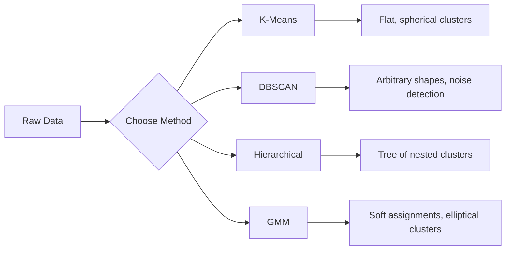

# Aprender sem supervisão

> Não há etiquetas, não há professores.

**类型:**Construção
**语言:**Python
**前置条件:**Fase 1 ((Normas e Distâncias, Probabilidade e Distribuição) Fase 2 Lições 1-6
**时间:**- 90 minutos.

## Objectivo de aprendizagem

- Desde a realização de K-Means、DBSCAN 和 Gaussian Mix Models, e compará-los em agrupamento
- Use silhouette score 和 elbow method  avaliação de cluster 质量,并选择最优 K
- 解释 DBSCAN 何时优于 K-Means,并识别哪种算法能处理非球形群 和外形
- Utilize Clustering  método de construção de tubo de detecção de anomalias, para marcar desvio do modo normal de pontos

## 问题

Até agora, cada seção de ML   aula  todo pressupõe dados com tag: É entrada, é saída correta Em mundo real, o custo de tag é alto Em hospitais há milhões de registros de pacientes, mas não há ninguém manual para dar a cada registro de tag doenças categorias Em sites de comércio eletrônico há milhões de sessões de usuários, mas não há ninguém manual para marcar grupos de clientes Em equipes de segurança há diários de rede, mas ninguém marca cada anomalia

O aprendizado não supervisionado encontra um padrão sem ser informado sobre o que procurar. Ele descobre pontos de dados semelhantes, encontra estruturas ocultas e expõe anomalias. Se o aprendizado supervisionado é como se tivesse respostas a partir de materiais de aprendizagem, então o aprendizado não supervisionado é apenas olhar para os dados originais, até que o padrão se manifeste.

O problema é: sem etiqueta, você não pode medir diretamente o que é certo ou errado. Você precisa de diferentes ferramentas para avaliar se a estrutura do algoritmo é significativa.

## 核心概念

### Clustering:把相似的事物分到一起

Clustering irá distribuir cada ponto de dados em um grupo, tornando os pontos do mesmo grupo mais semelhantes uns aos outros do que os pontos do outro grupo.



### K-Means: método de força principal

K-Means vai dividir os dados em K 个群── cada cluster tem um centroide, cada ponto pertence ao centroide mais próximo.

Algoritmo de Lloyd:

1. 随机选择 K 个点作为初始中心点
2. Distribuir cada ponto de dados para o centroide mais próximo
3. Calcular o valor médio de cada centróide
4. 重复步骤 2-3, até que o resultado da distribuição não mude

目標函数 (inércia) mede a distância quadrada total de cada ponto até o centroide em que se encontra. K-Means 会最小化这个值,但只能找到局部最小值.

### 选择 K

两种标准方法:

**Elbow method：**Para K = 1, 2, 3, ..., n 运行 K-Means── desenhar a inercia com K's relation图── buscar elbow, isto é, continuar a aumentar o cluster 时 inercia 不再显著下降的位置──

**Silhouette score：**Para cada ponto, medir a similaridade com o próprio aglomerado a) em relação a outros aglomerados mais recentes b) como; coefficiente de silhueta 为 (b - a) / max a, b), o alcance de -1 (分错 aglomerado) a +1 (cluster 划分良好) ⋅ para todos os pontos de média obter o total de分数。

### DBSCAN: Clustering baseado na densidade

K-Means 假设 cluster 球形的,并要求你先选择 K――DBSCAN Não faz estas duas hipóteses―― ele vai transformar o cluster 集团 集团 集团 集团 集团 集团 集团 集团 集团 集团 集团 集团 集团 集团 集团 集团 集团 集团 集团 集团 集团 集团 集团 集团 集团 集团 集团 集团 集团 集团 集团 集团 集团 集团 集团 集团 集团 集团 集团 集团 集团 集团 集团 集团 集团 集团 集团 集团 集团 集团 集团 集团 集团 集团 集团 集团 集团 集团 集团 集团 集团 集团 集团 集团 集团 集团 集团 集团 集团 集团 集团 集团 集团 集团 集团 集团 集团 集团 集团 集团 集团 集团 集团 集团 集团 集团 集团 集团 集团 集团 集团 集团 集团 集团 集团 集团 集 集团 集团 集 集 集 集 集 集 集 集 集 集 集 集 集 集 集 集 集 集 集 集 集 集 集 集 集 集 集 集 集 集 集 集 集 集 集 集 集 集 集 集 集 集 集 集 集 集 集 集 集 集 集 集 集 集 集 集 集 集 

两个参数:
- **eps**: Quadro de área
- **min_samples**: Número mínimo de pontos necessários para formar uma área

Três categorias:
- **Core point**: em eps  distância                                                                                                                                                                                                                                                                                                                                                                                                                                                                                                                       
- **Border point**Está localizado num ponto central, mas não é o ponto central.
- **Noise point**Não é um ponto central nem um ponto de fronteira.

DBSCAN 会把彼此位于eps 范围内的核心点 连接成同一个集群──Border point 会加入附近核心点 所在的集群──Noise point Não pertence a nenhum cluster──

优点:能发现任意形的集群,自动确定集群 数量,识别outlier──弱点:难以处理密度差较大的集群──

### Clustering hierárquico

构建嵌套 cluster 的树(dendrogram) ⋅

Aglomerativo ((自底向上):
1. De cada ponto são seus próprios grupos
2. 合并两个最近的集群
3. 重复, até que só resta um grupo
4. Em esperanças de nível de divisão do dendrograma, obtém K 个 cluster

A proximidade entre os grupos pode ser medida assim:
- **Single linkage**: Minima distância entre dois aglomerados
- **Complete linkage**: a maior distância entre qualquer dois pontos
- **Average linkage**: Distância média entre todos os pontos
- **Ward's method**: conduzir ao cluster interno total diferença aumentar mínimo de forma de combinação

### Modelos de mistura gaussiana (GMM)

K-Means 给出硬分配: cada ponto pertence de fato a um cluster.

GMM  hipóteses dados gerados por K 个 Gaussian distribuição de mistura, cada distribuição tem seu próprio valor médio e covariância.

- **E-step**Calculação de cada ponto pertence a cada probabilidade gaussiana
- **M-step**O valor médio de cada Gaussian, a covariância e o peso de mistura, para maximizar a probabilidade de dados

O GMM pode construir um aglomerado de forma circular (e não apenas K-Means 那样球形), e pode naturalmente tratar aglomerados sobrepostos.

### Qual é o método que usamos?

| Method | Best for | Avoid when |
|--------|----------|------------|
| K-Means | 大型数据集、球形 cluster、已知 K | 形状不规则、存在 outlier |
| DBSCAN | K 未知、任意形状、outlier detection | 密度差异大、维度非常高 |
| Hierarchical | 小型数据集、需要 dendrogram、K 未知 | 大型数据集（O(n^2) memory） |
| GMM | 重叠 cluster、需要软分配 | 非常大的数据集、维度过多 |

### Clustering fazer Detecção de Anomalias

Clustering 天然支持 detecção de anomalia:
- **K-Means**A distância de qualquer centroide é uma anomalia .
- **DBSCAN**De acordo com a definição, o ponto de ruído é a anomalia.
- **GMM**Em todos os Gaussian , a probabilidade é muito baixa .


```figure
kmeans-step
```

## Construí-lo

### 步骤 1: desde o início da realização dos K-Means

```python
import math
import random


def euclidean_distance(a, b):
    return math.sqrt(sum((ai - bi) ** 2 for ai, bi in zip(a, b)))


def kmeans(data, k, max_iterations=100, seed=42):
    random.seed(seed)
    n_features = len(data[0])

    centroids = random.sample(data, k)

    for iteration in range(max_iterations):
        clusters = [[] for _ in range(k)]
        assignments = []

        for point in data:
            distances = [euclidean_distance(point, c) for c in centroids]
            nearest = distances.index(min(distances))
            clusters[nearest].append(point)
            assignments.append(nearest)

        new_centroids = []
        for cluster in clusters:
            if len(cluster) == 0:
                new_centroids.append(random.choice(data))
                continue
            centroid = [
                sum(point[j] for point in cluster) / len(cluster)
                for j in range(n_features)
            ]
            new_centroids.append(centroid)

        if all(
            euclidean_distance(old, new) < 1e-6
            for old, new in zip(centroids, new_centroids)
        ):
            print(f"  Converged at iteration {iteration + 1}")
            break

        centroids = new_centroids

    return assignments, centroids
```

### 步骤 2: Método de cotovelo 和 pontuação de silhueta

```python
def compute_inertia(data, assignments, centroids):
    total = 0.0
    for point, cluster_id in zip(data, assignments):
        total += euclidean_distance(point, centroids[cluster_id]) ** 2
    return total


def silhouette_score(data, assignments):
    n = len(data)
    if n < 2:
        return 0.0

    clusters = {}
    for i, c in enumerate(assignments):
        clusters.setdefault(c, []).append(i)

    if len(clusters) < 2:
        return 0.0

    scores = []
    for i in range(n):
        own_cluster = assignments[i]
        own_members = [j for j in clusters[own_cluster] if j != i]

        if len(own_members) == 0:
            scores.append(0.0)
            continue

        a = sum(euclidean_distance(data[i], data[j]) for j in own_members) / len(own_members)

        b = float("inf")
        for cluster_id, members in clusters.items():
            if cluster_id == own_cluster:
                continue
            avg_dist = sum(euclidean_distance(data[i], data[j]) for j in members) / len(members)
            b = min(b, avg_dist)

        if max(a, b) == 0:
            scores.append(0.0)
        else:
            scores.append((b - a) / max(a, b))

    return sum(scores) / len(scores)


def find_best_k(data, max_k=10):
    print("Elbow method:")
    inertias = []
    for k in range(1, max_k + 1):
        assignments, centroids = kmeans(data, k)
        inertia = compute_inertia(data, assignments, centroids)
        inertias.append(inertia)
        print(f"  K={k}: inertia={inertia:.2f}")

    print("\nSilhouette scores:")
    for k in range(2, max_k + 1):
        assignments, centroids = kmeans(data, k)
        score = silhouette_score(data, assignments)
        print(f"  K={k}: silhouette={score:.4f}")

    return inertias
```

### 步骤 3: Desde o início da implementação do DBSCAN

```python
def dbscan(data, eps, min_samples):
    n = len(data)
    labels = [-1] * n
    cluster_id = 0

    def region_query(point_idx):
        neighbors = []
        for i in range(n):
            if euclidean_distance(data[point_idx], data[i]) <= eps:
                neighbors.append(i)
        return neighbors

    visited = [False] * n

    for i in range(n):
        if visited[i]:
            continue
        visited[i] = True

        neighbors = region_query(i)

        if len(neighbors) < min_samples:
            labels[i] = -1
            continue

        labels[i] = cluster_id
        seed_set = list(neighbors)
        seed_set.remove(i)

        j = 0
        while j < len(seed_set):
            q = seed_set[j]

            if not visited[q]:
                visited[q] = True
                q_neighbors = region_query(q)
                if len(q_neighbors) >= min_samples:
                    for nb in q_neighbors:
                        if nb not in seed_set:
                            seed_set.append(nb)

            if labels[q] == -1:
                labels[q] = cluster_id

            j += 1

        cluster_id += 1

    return labels
```

### 步骤 4: Modelo de mistura gaussiana (algoritmo EM)

```python
def gmm(data, k, max_iterations=100, seed=42):
    random.seed(seed)
    n = len(data)
    d = len(data[0])

    indices = random.sample(range(n), k)
    means = [list(data[i]) for i in indices]
    variances = [1.0] * k
    weights = [1.0 / k] * k

    def gaussian_pdf(x, mean, variance):
        d = len(x)
        coeff = 1.0 / ((2 * math.pi * variance) ** (d / 2))
        exponent = -sum((xi - mi) ** 2 for xi, mi in zip(x, mean)) / (2 * variance)
        return coeff * math.exp(max(exponent, -500))

    for iteration in range(max_iterations):
        responsibilities = []
        for i in range(n):
            probs = []
            for j in range(k):
                probs.append(weights[j] * gaussian_pdf(data[i], means[j], variances[j]))
            total = sum(probs)
            if total == 0:
                total = 1e-300
            responsibilities.append([p / total for p in probs])

        old_means = [list(m) for m in means]

        for j in range(k):
            r_sum = sum(responsibilities[i][j] for i in range(n))
            if r_sum < 1e-10:
                continue

            weights[j] = r_sum / n

            for dim in range(d):
                means[j][dim] = sum(
                    responsibilities[i][j] * data[i][dim] for i in range(n)
                ) / r_sum

            variances[j] = sum(
                responsibilities[i][j]
                * sum((data[i][dim] - means[j][dim]) ** 2 for dim in range(d))
                for i in range(n)
            ) / (r_sum * d)
            variances[j] = max(variances[j], 1e-6)

        shift = sum(
            euclidean_distance(old_means[j], means[j]) for j in range(k)
        )
        if shift < 1e-6:
            print(f"  GMM converged at iteration {iteration + 1}")
            break

    assignments = []
    for i in range(n):
        assignments.append(responsibilities[i].index(max(responsibilities[i])))

    return assignments, means, weights, responsibilities
```

### 步骤 5: gerar dados de teste e executar todos os conteúdos

```python
def make_blobs(centers, n_per_cluster=50, spread=0.5, seed=42):
    random.seed(seed)
    data = []
    true_labels = []
    for label, (cx, cy) in enumerate(centers):
        for _ in range(n_per_cluster):
            x = cx + random.gauss(0, spread)
            y = cy + random.gauss(0, spread)
            data.append([x, y])
            true_labels.append(label)
    return data, true_labels


def make_moons(n_samples=200, noise=0.1, seed=42):
    random.seed(seed)
    data = []
    labels = []
    n_half = n_samples // 2
    for i in range(n_half):
        angle = math.pi * i / n_half
        x = math.cos(angle) + random.gauss(0, noise)
        y = math.sin(angle) + random.gauss(0, noise)
        data.append([x, y])
        labels.append(0)
    for i in range(n_half):
        angle = math.pi * i / n_half
        x = 1 - math.cos(angle) + random.gauss(0, noise)
        y = 1 - math.sin(angle) - 0.5 + random.gauss(0, noise)
        data.append([x, y])
        labels.append(1)
    return data, labels


if __name__ == "__main__":
    centers = [[2, 2], [8, 3], [5, 8]]
    data, true_labels = make_blobs(centers, n_per_cluster=50, spread=0.8)

    print("=== K-Means on 3 blobs ===")
    assignments, centroids = kmeans(data, k=3)
    print(f"  Centroids: {[[round(c, 2) for c in cent] for cent in centroids]}")
    sil = silhouette_score(data, assignments)
    print(f"  Silhouette score: {sil:.4f}")

    print("\n=== Elbow Method ===")
    find_best_k(data, max_k=6)

    print("\n=== DBSCAN on 3 blobs ===")
    db_labels = dbscan(data, eps=1.5, min_samples=5)
    n_clusters = len(set(db_labels) - {-1})
    n_noise = db_labels.count(-1)
    print(f"  Found {n_clusters} clusters, {n_noise} noise points")

    print("\n=== GMM on 3 blobs ===")
    gmm_assignments, gmm_means, gmm_weights, _ = gmm(data, k=3)
    print(f"  Means: {[[round(m, 2) for m in mean] for mean in gmm_means]}")
    print(f"  Weights: {[round(w, 3) for w in gmm_weights]}")
    gmm_sil = silhouette_score(data, gmm_assignments)
    print(f"  Silhouette score: {gmm_sil:.4f}")

    print("\n=== DBSCAN on moons (non-spherical clusters) ===")
    moon_data, moon_labels = make_moons(n_samples=200, noise=0.1)
    moon_db = dbscan(moon_data, eps=0.3, min_samples=5)
    n_moon_clusters = len(set(moon_db) - {-1})
    n_moon_noise = moon_db.count(-1)
    print(f"  Found {n_moon_clusters} clusters, {n_moon_noise} noise points")

    print("\n=== K-Means on moons (will fail to separate) ===")
    moon_km, moon_centroids = kmeans(moon_data, k=2)
    moon_sil = silhouette_score(moon_data, moon_km)
    print(f"  Silhouette score: {moon_sil:.4f}")
    print("  K-Means splits moons poorly because they are not spherical")

    print("\n=== Anomaly detection with DBSCAN ===")
    anomaly_data = list(data)
    anomaly_data.append([20.0, 20.0])
    anomaly_data.append([-5.0, -5.0])
    anomaly_data.append([15.0, 0.0])
    anomaly_labels = dbscan(anomaly_data, eps=1.5, min_samples=5)
    anomalies = [
        anomaly_data[i]
        for i in range(len(anomaly_labels))
        if anomaly_labels[i] == -1
    ]
    print(f"  Detected {len(anomalies)} anomalies")
    for a in anomalies[-3:]:
        print(f"    Point {[round(v, 2) for v in a]}")
```

## Use-o

Usando um pouco de aprendizagem, o mesmo algoritmo pode ser feito:

```python
from sklearn.cluster import KMeans, DBSCAN, AgglomerativeClustering
from sklearn.mixture import GaussianMixture
from sklearn.metrics import silhouette_score as sklearn_silhouette

km = KMeans(n_clusters=3, random_state=42).fit(data)
db = DBSCAN(eps=1.5, min_samples=5).fit(data)
agg = AgglomerativeClustering(n_clusters=3).fit(data)
gmm_model = GaussianMixture(n_components=3, random_state=42).fit(data)
```

Desde o início da implementação, a versão irá exibir exatamente estes dados em cálculo. K-Means em distribuição e recomputo entre os tempos. DBSCAN desde o início da expansão do cluster. GMM em espera e maximização.

## Entrega-o

Este curso é produzido a partir de K-Means, DBSCAN e GMM realizados.

## 练习

1. 实现 K-Means++ inicialização: não escolher o centroide, mas antes escolher o primeiro centroide, depois cada centroide é selecionado para comparar a probabilidade de uma distância quadrada em relação à distância de um centroide com a velocidade de recepção e a inicialização do centroide.
2. Para encaminhar o código para o mundo, você pode fazer uma lista de dados de um sistema de dados de um sistema de dados de um sistema de dados de um sistema de dados de um sistema de dados de um sistema de dados de um sistema de dados de um sistema de dados de um sistema de dados de um sistema de dados de um sistema de dados de um sistema de dados de um sistema de dados de um sistema de dados de um sistema de dados de dados de um sistema de dados de um sistema de dados de um sistema de dados de dados de um sistema de dados de dados de um sistema de dados de dados de um sistema de dados de dados de um sistema de dados de dados de um sistema de dados de dados de um sistema de dados de dados de dados de um sistema de dados de dados de dados de dados de um sistema de dados de dados de dados de dados de dados de dados de dados de dados de dados de dados de dados de dados de dados de dados de dados de dados de dados de dados de dados de dados de dados de dados de dados de dados de dados de dados de dados de dados de dados de dados de dados de dados de dados de dados de dados de dados de dados de dados de dados de dados de dados de dados de dados de dados de dados de dados de dados de dados de dados de dados de dados de dados de dados de dados de dados de dados de dados de dados de dados de dados de dados de dados de dados de dados de dados de dados de dados de dados de dados de dados de dados de dados de dados de dados de dados de dados de dados de dados de dados de dados de dados de dados de dados de dados de dados de dados de dados de dados de dados de dados de dados de dados de dados de dados de dados de dados de dados de dados de dados de dados de dados de dados de dados de dados de dados de dados de dados de dados de dados de dados de dados de dados de dados de dados de dados de dados de dados de dados de dados de dados de dados de dados de dados de dados de dados de dados de dados de dados de dados de dados de dados de dados de dados de dados de dados de dados de dados de dados de dados de dados de dados de dados de dados de dados de dados de dados de dados de dados de dados de dados de dados de dados de dados de dados de dados de dados de dados de dados de dados de dados de dados de dados de dados de dados de dados de dados de dados de dados de dados de dados de
3. Construir um simples pipeline de detecção de anomalias: operando no mesmo dados DBSCAN e GMM, marcando dois métodos considerados como pontos de fora de linha:

## 关键术语

| Term | What people say | What it actually means |
|------|----------------|----------------------|
| Clustering | “把相似的事物分组” | 将数据划分为若干子集，使组内相似度高于组间相似度，并由特定距离度量来衡量 |
| Centroid | “cluster 的中心” | 分配给某个 cluster 的所有点的均值；K-Means 将其用作 cluster 的代表 |
| Inertia | “cluster 有多紧凑” | 每个点到其所属 centroid 的平方距离之和；越低表示越紧凑 |
| Silhouette score | “cluster 分离得有多好” | 对每个点计算 (b - a) / max(a, b)，其中 a 是平均 cluster 内距离，b 是最近 cluster 的平均距离 |
| Core point | “稠密区域中的点” | 在 DBSCAN 中，eps 距离内至少有 min_samples 个邻居的点 |
| EM algorithm | “软 K-Means” | Expectation-Maximization：迭代计算成员概率（E-step）并更新 distribution 参数（M-step） |
| Dendrogram | “cluster 的树” | 一种树状图，展示 hierarchical clustering 中 cluster 被合并的顺序以及合并时的距离 |
| Anomaly | “一个 outlier” | 不符合预期模式的数据点，在 DBSCAN 中被识别为 noise，或在 GMM 中被识别为低概率点 |

## 延伸阅读

- [Stanford CS229 - Unsupervised Learning](https://cs229.stanford.edu/notes2022fall/main_notes.pdf)- Andrew Ng  sobre Clustering e EM Notas de aula
- [scikit-learn Clustering Guide](https://scikit-learn.org/stable/modules/clustering.html)- Comparar as aplicações práticas de todos os algoritmos de agrupamento, e acompanhar exemplos visíveis
- [DBSCAN original paper (Ester et al., 1996)](https://www.aaai.org/Papers/KDD/1996/KDD96-037.pdf)-  propositar clustering baseado na densidade
