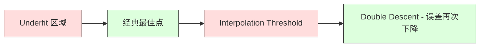
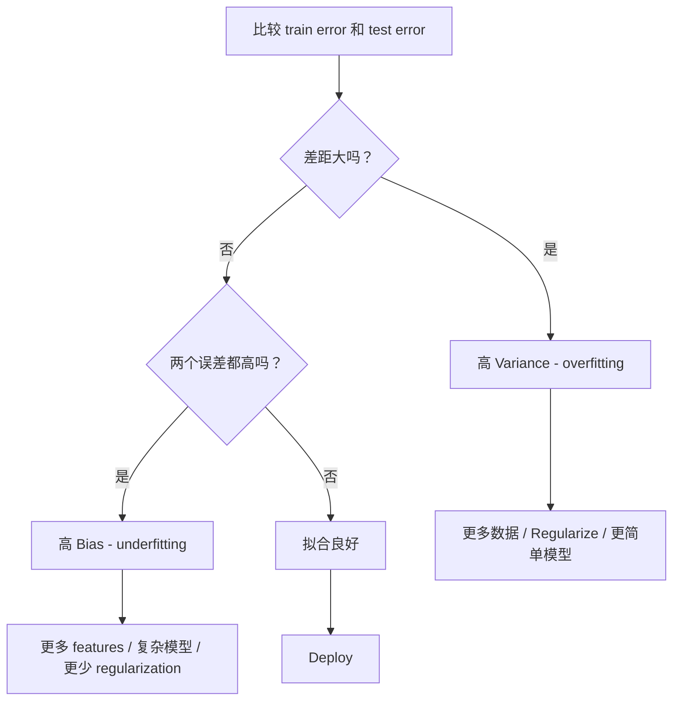
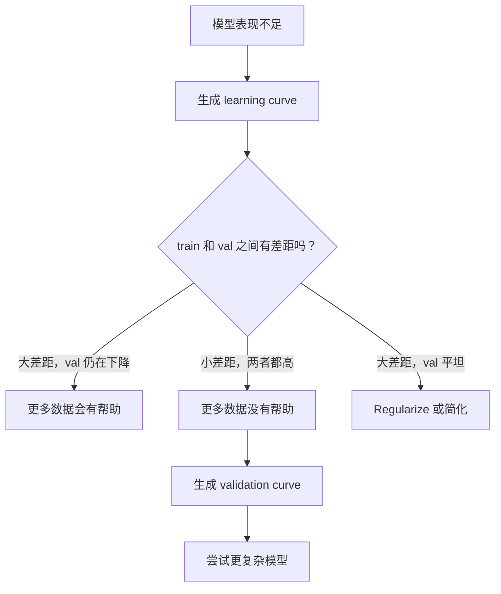

# Comércio de variações de parcialidade

> Cada tipo de erro de modelo vem de uma das três fontes: Preconceito, Variância ou ruído.

**Type:** Learn
**Language:**Python
**Prerequisites:** Phase 2, Lessons 01-09（ML 基础、Regression、Classification、评估）
**Time:** ~75 分钟

## Objectivo de aprendizagem
- 推导期望预测 erro de variação de preconceito
- Uso de treinamento de erro e teste de erro Modelo de diagnóstico de existência de alta preconceito ou alta variação
- 解释 Regularização 技术(L1、L2、dropout、early stopping) como usar Bias 换取 Variância
- 实现 experimento, visualização Diferente complexidade Modelo de Tradeoff de Bias-Variance

## 问题
Você treinou um modelo. Há um erro nos dados de teste.

Se o seu modelo for muito simples (por exemplo, usando regressão linear em conjuntos de dados de curvas), ele continuará errando sobre o modelo real. É o Bias. Se o seu modelo for muito complexo (por exemplo, usando um polinômio de grau 20 em 15 pontos de dados), ele irá se adequar perfeitamente aos dados de treinamento, mas em novos dados fornecerá previsões de variações dramáticas.

Para a capacidade de modelo fixa, você não pode minimizar os dois ao mesmo tempo. Reduzir a Precição, a Variância aumenta. Reduzir a Variância, a Precição aumenta. Entender este tradeoff é a habilidade de diagnóstico mais útil no Machine Learning.

## 概念
### Preconceito: 系统性误差

O prejuízo é a diferença entre a média de previsão e o valor real do modelo. Se você treinar em um conjunto de treinos diferentes de uma mesma distribuição, e comparar a média de previsão, o prejuízo é a diferença entre a média e o valor real.

Alta Bias significa que o modelo é muito duro, incapaz de capturar o modelo real. Usando uma linha reta para se adequar à linha de poluição, não importa quanto dados lhe seja dado, ele vai ficar errado através da curva.

```
高 Bias（underfitting）：
  模型总是预测大致相同的错误结果。
  训练误差：高
  测试误差：高
  二者差距：小
```

### Variância: sensibilidade aos dados do treino

A variação é medida pelo número de variações que ocorrem quando você treina em diferentes conjuntos de dados. Se as pequenas variações no conjunto de treinamento levarem a grandes alterações no modelo, a variação é muito alta.

Alta Variação significa que o modelo está em um nível de treinamento em dados de ruído, e não em sinais de nível inferior.

```
高 Variance（overfitting）：
  模型完美拟合训练数据，但在新数据上失败。
  训练误差：低
  测试误差：高
  二者差距：大
```

### A decomposição

 Para qualquer ponto x, o erro de previsão de expectativa abaixo da perda quadrada pode ser precisamente dividido em:

```
Expected Error = Bias^2 + Variance + Irreducible Noise

where:
  Bias^2   = (E[f_hat(x)] - f(x))^2
  Variance = E[(f_hat(x) - E[f_hat(x)])^2]
  Noise    = E[(y - f(x))^2]             (sigma^2)
```

- `f(x)`É verdade
- `f_hat(x)`É modelo prévio
- `E[...]`É a expectativa de diferentes grupos de treinamento
- `y`É o que eu quero dizer.

No entanto, não há um modelo que possa fazer melhor do que o sigma^2 e sua tarefa é encontrar o equilíbrio entre o viés^2 e a variância.

### Complicidade do modelo vs erro


经典的U 形曲线:

| Complexity | Bias | Variance | Total Error |
|-----------|------|----------|-------------|
| 过低 | 高 | 低 | 高（underfitting） |
| 刚刚好 | 中等 | 中等 | 最低 |
| 过高 | 低 | 高 | 高（overfitting） |

### 作为 Bias-Variance 控制的规范化

A regularização aumentará a preconceito para reduzir a variância.

- **L2 (Ridge):**A redução da propriedade é uma redução do poder de propriedade.
- **L1 (Lasso):**将某些权重精确推推到零── executar a seleção de recursos──
- **Dropout:**Durante o treino, as neurônicas são desactivadas.
- **Early stopping:**Em modelo totalmente adequado treinamento dados antes de parar de treinar.

Regularização 强度(lambda、drop-out rate、epoch 数) irá controlar diretamente a sua posição na curva de Bias-Variance 曲线──更多 Regularização significa mais Bias、更少变化──

### Duplo Descenso: 现代视角

经典理论认为:超过最佳点后,更多复杂度总是有害──但自2019年以来的研究显示意外现象──如果继续将模型容量增加到远超插值 (se você continuar a aumentar a capacidade do modelo para um limite de interpolação muito longo), o modelo terá parâmetros suficientes para se adequar perfeitamente ao seu lugar de treinamento), o erro de teste poderá diminuir novamente──



Este "doble descendência" explica por que redes neurais superparametrizadas em grande escala (para a maioria dos neurais) ainda podem ser bem generalizadas.

 Sobre a dupla descida 关键观察:
- Ele aparece em modelos lineares, árvores de decisão e redes neurais.
- Em interpolação 区域, mais dados na verdade pode ser prejudicial (sample-wise double descent)
- 更多训练 epochs Também pode levar a ela ((epoca-sabio descida dupla)
- A regularização vai ser um pico de planeamento, mas não vai eliminá-lo.

Por que ocorre esta situação? No limiar de interpolação, o modelo apenas tem capacidade suficiente para se adequar a todos os pontos de treinamento. É forçado a entrar em uma solução muito específica, esta solução atravessa cada ponto, e as pequenas perturbações dos dados podem levar à mudança enorme do nível de adaptação. Aqui está a variação.

| Regime | Parameters vs Samples | Behavior |
|--------|----------------------|----------|
| Underparameterized | p << n | 经典 tradeoff 适用 |
| Interpolation threshold | p ~ n | Variance 达到峰值，测试误差激增 |
| Overparameterized | p >> n | Implicit regularization 开始起作用，测试误差下降 |

Desde o ponto de vista prático: se você usa redes neurais ou grandes conjuntos de árvores, não fique no limiar de interpolação.

### Diagnóstico do seu modelo



| Symptom | Diagnosis | Fix |
|---------|-----------|-----|
| 高 train error，高 test error | Bias | 更多 features、复杂模型、更少 regularization |
| 低 train error，高 test error | Variance | 更多数据、regularization、更简单模型、dropout |
| 低 train error，低 test error | 拟合良好 | Ship it |
| Train error 下降，test error 上升 | Overfitting 正在发生 | Early stopping |

### Estratégias Práticas

**当 Bias 是问题时：**
- 添加 polinômio ou características de interação
- Utilize更灵活的模型 (por exemplo, usando um conjunto de árvores em vez de linear)
-                                                                                                                                                                                                                                                                                                                                                                                                                                                                                                                              
- 訓練更久 (((se ainda não recebeu)

**当 Variance 是问题时：**
- Get more training dados
- Use bagging (forestas aleatórias)
- 增加 regularisation ((更高 lambda、更多 drop-out)
- Seleção de características (em função de eliminação de ruído)
- Use cruzada validação 尽早发现它

### Métodos de montagem e de redução de diferença

Os métodos de montagem são as ferramentas mais práticas para combater a variação.

**Bagging (Bootstrap Aggregating)**Os modelos de bootstrap são treinados em diferentes amostras de dados de treinamento, e depois são avaliados em média.

É matematicamente válido porque: se a média N 个独立预测, cada variação de cada previsão é sigma^2, então a variação de valor médio é sigma^2 / N. Estes modelos não são realmente independentes, portanto, a redução é menor que 1/N, mas ainda é bastante observavel.

**Boosting**通过顺序构建模型来降低 Bias, cada novo modelo está preocupado com os erros do conjunto atual.

| Method | Primary Effect | Bias Change | Variance Change |
|--------|---------------|-------------|-----------------|
| Bagging | 降低 Variance | 不变 | 降低 |
| Boosting | 降低 Bias | 降低 | 可能增加 |
| Stacking | 同时降低两者 | 取决于 meta-learner | 取决于 base models |
| Dropout | Implicit bagging | 略微增加 | 降低 |

**实践规则：**Se o seu modelo base tiver alta variação ((árvores profundas ‒ polinômios de alto grau), use sacking―se o seu modelo base tiver alta viés ‒ troncos rasos ‒ modelos lineares simples ‒), use boosting―

### Curvas de aprendizagem

As curvas de aprendizagem vão desenhar erros de treinamento e erros de verificação para funções de grande porte de treinamento. São as ferramentas de diagnóstico mais práticas que você possui. Diferente de comparação de treinamento/teste individual, as curvas de aprendizagem mostram o trajeto do modelo e dizem-lhe se mais dados são úteis.


Como interpretá-las:

| Scenario | Training Error | Validation Error | Gap | What It Means | What to Do |
|----------|---------------|-----------------|-----|---------------|------------|
| 高 Bias | 高 | 高 | 小 | 模型无法捕捉模式 | 更多 features、复杂模型、更少 regularization |
| 高 Variance | 低 | 高 | 大 | 模型记忆训练数据 | 更多数据、regularization、更简单模型 |
| 拟合良好 | 中等 | 中等 | 小 | 模型 generalizes well | Ship it |
| 高 Variance，正在改善 | 低 | 随更多数据下降 | 缩小 | 数据可以修复的 Variance 问题 | 收集更多数据 |
| 高 Bias，平坦 | 高 | 高且平坦 | 小且平坦 | 更多数据没有帮助 | 改变 model architecture |

关键洞察: Se as duas curvas estiverem em plano, a diferença é pequena, mas os dois erros são altos, mais dados não serão utilizados. Você precisa de um modelo melhor.

### como gerar curvas de aprendizagem

Há duas formas:

**Approach 1: 改变训练集大小，固定模型。**保持模型和超参数 不变──在越来越大的训练数据集上训练──测量每小小下的训练误差和验证误差──这是标准学习曲线──

**Approach 2: 改变模型复杂度，固定数据。**保持数据不变──扫描一个复杂度参数(polinômio grau、árvore profundidade、camadas 数量)──测量每个复杂度下训练误差和验证误差── é uma curva de validação, irá mostrar diretamente Bias-Variance Tradeoff──

Os dois métodos se complementam. O primeiro diz-lhe se mais dados ajudam. O segundo diz-lhe se diferentes modelos ajudam. Antes de decidir o próximo passo, ambos devem ser executados.




```figure
bias-variance
```

## Construí-lo
`code/bias_variance.py`O código-fonte é um código-fonte de código-fonte de código-fonte de código-fonte de código-fonte de código-fonte de código-fonte de código-fonte de código-fonte de código-fonte de código-fonte de código-fonte de código-fonte de código-fonte de código-fonte de código-fonte de código-fonte de código-fonte de código-fonte de código-fonte de código-fonte de código-fonte de código-fonte de código-fonte de código-fonte de código-fonte de código-fonte de código-fonte de código-fonte de código-fonte de código-fonte de código-fonte de código-fonte de código-fonte de código-fonte de código-fonte de código-fonte de código-fonte de código-fonte de código-fonte de código-fonte de código-fonte de código-fonte de código-fonte de código-fonte de código-fonte de código-fonte de código-fonte de código-fonte de código-fonte de código-fonte de código-fonte de código-fonte de código-fonte de código-fonte de código-fonte de código-fonte de código-fonte-fonte-fonte-fonte-fonte-fonte-fonte-fonte-fonte-fonte-fonte-fonte-fonte-fonte-fonte-fonte-fonte-fonte-fonte-fonte-fonte-fonte-fonte-fonte-fonte-fonte-fonte-fonte-fonte-fonte-fonte-fonte-fonte-fonte-fonte-fonte-fonte-fonte-fonte-fonte-fonte-fonte-fonte-fonte-fonte-fonte-fonte-fonte-fonte-fonte-fonte-fonte-fonte-fonte-fonte-on-on-on-on-on-on-on-on-on-on-on-on-on-on-on-on-on-on-on-on-on-on-on-on-on-on

### 步骤 1: Gerenciamento de dados sintéticos a partir de funções conhecidas

Nós usamos o ruído gaussiano .`f(x) = sin(1.5x) + 0.5x`◊ saber a função real permite calcular as variações e preconceitos precisas.

```python
def true_function(x):
    return np.sin(1.5 * x) + 0.5 * x

def generate_data(n_samples=30, noise_std=0.5, x_range=(-3, 3), seed=None):
    rng = np.random.RandomState(seed)
    x = rng.uniform(x_range[0], x_range[1], n_samples)
    y = true_function(x) + rng.normal(0, noise_std, n_samples)
    return x, y
```

### 步骤 2: Bootstrap Sampling e Fitting Polinômio

Para cada grau polinômio, nós tiramos muitos conjuntos de treinamento de bootstrap, adaptamos o polinômio e fixamos a grade de teste 上记录预测── isto fornecerá uma distribuição de pré-ação para cada teste──

```python
def fit_polynomial(x_train, y_train, degree, lam=0.0):
    X = np.column_stack([x_train ** d for d in range(degree + 1)])
    if lam > 0:
        penalty = lam * np.eye(X.shape[1])
        penalty[0, 0] = 0
        w = np.linalg.solve(X.T @ X + penalty, X.T @ y_train)
    else:
        w = np.linalg.lstsq(X, y_train, rcond=None)[0]
    return w
```

Nós estamos em 200 diferentes amostras de arranque para cima e para baixo. Cada amostra de arranque é extraída da mesma distribuição de nível inferior, mas contém pontos diferentes.

### 步骤 3: Computação Bias^2, Decompositividade de Variância

Com 200 grupos de previsão em cada teste, podemos calcular diretamente de acordo com a definição:

```python
mean_pred = predictions.mean(axis=0)
bias_sq = np.mean((mean_pred - y_true) ** 2)
variance = np.mean(predictions.var(axis=0))
total_error = np.mean(np.mean((predictions - y_true) ** 2, axis=1))
```

- `mean_pred`É de amostras de arranque  estimativa de E[f_hat(x)
- `bias_sq`É o quadrado da diferença entre a previsão média e o valor real
- `variance`É através de bootstrap amostras de pré-estimados média de deslocamento
- `total_error`应该近似等于偏差^2 + variação + ruído

### 步骤 4: Curvas de aprendizagem

As curvas de aprendizagem em manter a complexidade do modelo fixas ao mesmo tempo que o treinamento de escavação.

```python
def demo_learning_curves():
    sizes = [10, 15, 20, 30, 50, 75, 100, 150, 200, 300]
    degree = 5

    for n in sizes:
        train_errors = []
        test_errors = []
        for seed in range(50):
            x_train, y_train = generate_data(n_samples=n, seed=seed * 100)
            w = fit_polynomial(x_train, y_train, degree)
            train_pred = predict_polynomial(x_train, w)
            train_mse = np.mean((train_pred - y_train) ** 2)
            test_pred = predict_polynomial(x_test, w)
            test_mse = np.mean((test_pred - y_test) ** 2)
            train_errors.append(train_mse)
            test_errors.append(test_mse)
        # 对多次运行取平均，得到 learning curve 上的点
```

对于高变化模型 (小数据上的级 5), você verá:
- O erro de treinamento começou a ser muito baixo, com mais dados, a memória torna-se difícil e aumenta.
- O erro de teste começou a ser muito alto, e a diminuição de sinais aumentou com o modelo.
- Distinguir com mais dados e diminuir

对于高偏 模型 (( grau 1), dois erros são rapidamente recebidos para o mesmo alto valor, mais dados não ajudam.

### 第 5 步:Regulamentação

代码 também contém `demo_regularization_sweep()`, fixa um polinômio de alto grau (o grau 15), e vai mudar a força de regularização da Ridge de 0,001 扫描到100── isto mostra de outro ângulo Tradeoff de Bias-Variance: nós não alteramos a complexidade do modelo, mas alteramos a intensidade do bloco──

```python
def demo_regularization_sweep():
    alphas = [0.001, 0.005, 0.01, 0.05, 0.1, 0.5, 1.0, 5.0, 10.0, 50.0, 100.0]
    for alpha in alphas:
        results = bias_variance_decomposition([15], lam=alpha)
        r = results[15]
        print(f"alpha={alpha:.3f}  bias={r['bias_sq']:.4f}  var={r['variance']:.4f}")
```

Em baixo alfa, baixo-grado-15 polinômio  quase não é limitado. Variação  dominante, pois o modelo persegue cada amostra de arranque no meio do ruído. Em baixo alfa, punição forte para fazer o modelo realmente se tornar uma função de constante próxima.

Isto é com o alterar o grau polinômio  obtém a mesma curva U, apenas através de um ciclo de rotas em vez de opções separadas para controlar. Na prática, a regularização é o método preferido para controlar o tradeoff, pois permite o controle de particulados, sem necessidade de alterar o conjunto de características.

## Use-o
SHOP  fornecer `learning_curve`和 `validation_curve`, pode automatizar estes diagnósticos, sem precisar de escrever bucles de arranque.

### Curva de validação:扫描 Modelo de complexidade

```python
from sklearn.model_selection import validation_curve
from sklearn.pipeline import make_pipeline
from sklearn.preprocessing import PolynomialFeatures
from sklearn.linear_model import Ridge

degrees = list(range(1, 16))
train_scores_all = []
val_scores_all = []

for d in degrees:
    pipe = make_pipeline(PolynomialFeatures(d), Ridge(alpha=0.01))
    train_scores, val_scores = validation_curve(
        pipe, X, y, param_name="polynomialfeatures__degree",
        param_range=[d], cv=5, scoring="neg_mean_squared_error"
    )
    train_scores_all.append(-train_scores.mean())
    val_scores_all.append(-val_scores.mean())
```

Isso lhe dará diretamente o resultado de validação em relação ao resultado do trem, quando os dois são diferentes, quando o resultado é diferente, quando o resultado é diferente.

### Curva de aprendizagem:扫描 Tamanho do conjunto de treinamento

```python
from sklearn.model_selection import learning_curve

pipe = make_pipeline(PolynomialFeatures(5), Ridge(alpha=0.01))
train_sizes, train_scores, val_scores = learning_curve(
    pipe, X, y, train_sizes=np.linspace(0.1, 1.0, 10),
    cv=5, scoring="neg_mean_squared_error"
)
train_mse = -train_scores.mean(axis=1)
val_mse = -val_scores.mean(axis=1)
```

- Não .`train_mse`和 `val_mse`Comparado com`train_sizes`O desenho de uma curva diz-te tudo sobre o modelo.

### Utilize Regularização 扫描的 Cross-Validation

```python
from sklearn.model_selection import cross_val_score

alphas = [0.001, 0.01, 0.1, 1.0, 10.0, 100.0]
for alpha in alphas:
    pipe = make_pipeline(PolynomialFeatures(10), Ridge(alpha=alpha))
    scores = cross_val_score(pipe, X, y, cv=5, scoring="neg_mean_squared_error")
    print(f"alpha={alpha:>7.3f}  MSE={-scores.mean():.4f} +/- {scores.std():.4f}")
```

Isso vai para a força de regularização de complexidade do modelo fixo. Você vai ver o mesmo Bias-Variância Tradeoff: baixo alfa significa alta variância, alto alfa significa alta viés.

### 整合起来: diagnóstico completo Fluxo de trabalho

Na prática, você vai executar estes diagnósticos em ordem:

1. 訓練你的模型──計算列車 和 測試錯誤──
2. Se ambos estão altos: Você tem preconceito.
3. Se o treinamento 低但测试 高:你有变化 问题── gerar curva de aprendizagem, ver se mais dados ajudam── se não, vamos regularizar──
4. Crie a curva de validação, scan os principais parâmetros de complexidade.
5. Em melhor ponto, gerar curva de aprendizagem. Se a diferença ainda for grande, você precisa de mais dados ou regularização.
6. Utilização `cross_val_score`尝试不同 alpha 值的Ridge/Lasso──select cross-validated error 最低的 alpha──

Para a maioria dos conjuntos de dados tabuleiros, isso leva 10-15 minutos de tempo de cálculo, mas pode economizar algumas horas de adivinhação.

## Entrega-o
本课产出:`outputs/prompt-model-diagnostics.md`

## 练习
1. Utilização `noise_std=0`(sem ruído) Operar a descomposição. O que acontece?

2. O que é que isso vai fazer com que o grau de variância do polinômio melhor se mova?

3. Para experimentar a regularização L2 (Ridge regression) ⋅ para um polinômio de alto grau fixo (degree 15), será lambda de 0 扫描到100──绘制偏差^2 和变量 随 lambda 变化的函数图──

4. 将真实函数 do polinômio 修改为 `sin(x)`◊ Variação Bias-Descoberta Como mudou?

5. 实现一个简单的bootstrap agregating(bagging)wrapper:在bootstrap samples 上训练 10 个模型并平均预测──展示这会降低变化,且几乎不增加 Bias──

## 关键术语
| Term | What people say | What it actually means |
|------|----------------|----------------------|
| Bias | “模型太简单” | 来自错误假设的系统性误差。平均模型预测与真实值之间的差距。 |
| Variance | “模型在 overfitting” | 来自对训练数据敏感性的误差。预测在不同训练集之间变化的程度。 |
| Irreducible error | “数据中的噪声” | 来自真实数据生成过程中的随机性的误差。没有模型能消除它。 |
| Underfitting | “学得不够” | 模型有高 Bias。即使在训练数据上也会错过真实模式。 |
| Overfitting | “记住了数据” | 模型有高 Variance。它拟合了训练数据中无法 generalize 的噪声。 |
| Regularization | “约束模型” | 添加惩罚来降低模型复杂度，用 Bias 换取更低 Variance。 |
| Double descent | “更多参数可能有帮助” | 当模型容量远超 interpolation threshold 时，测试误差会再次下降。 |
| Model complexity | “模型有多灵活” | 模型拟合任意模式的容量。由 architecture、features 或 regularization 控制。 |

## 延伸阅读
- [Hastie, Tibshirani, Friedman: Elements of Statistical Learning, Ch. 7](https://hastie.su.domains/ElemStatLearn/)-- Bias-Variance 分解的权威论述
- [Belkin et al., Reconciling modern machine learning practice and the bias-variance trade-off (2019)](https://arxiv.org/abs/1812.11118)-- dupla descendência 论文
- [Nakkiran et al., Deep Double Descent (2019)](https://arxiv.org/abs/1912.02292)-- de acordo com a época 和 de acordo com a amostra, descida dupla
- [Scott Fortmann-Roe: Understanding the Bias-Variance Tradeoff](http://scott.fortmann-roe.com/docs/BiasVariance.html)-- 清晰的可视化解释
