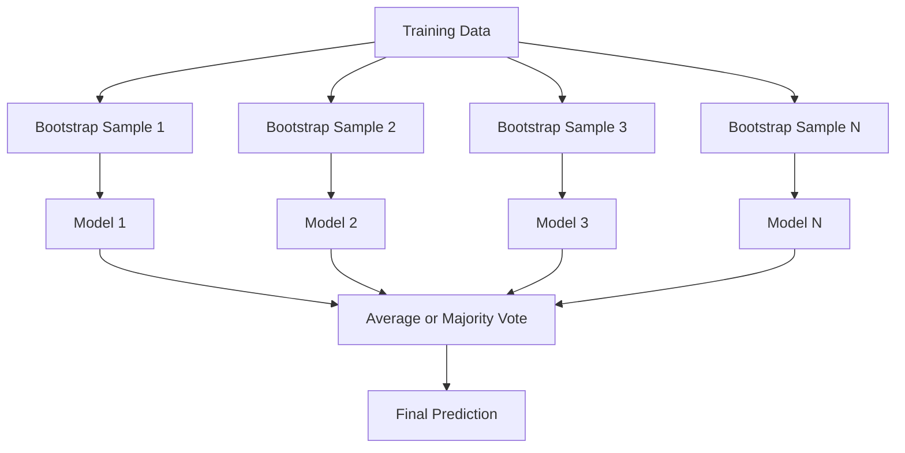
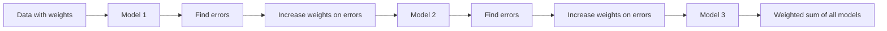
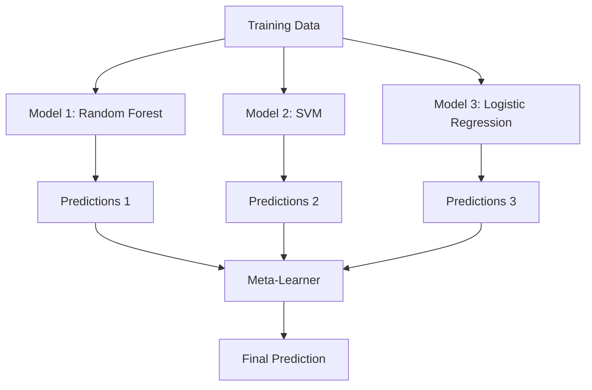

# Métodos de Ensemble

> Um grupo de aprendizes fracos, se estiverem juntos, tornar-se-ão um aprendiz forte. Não é uma metáfora.

**Type:** Build
**Language:**Python
**Prerequisites:** Phase 2, Lesson 10 (Bias-Variance Tradeoff)
**Time:** ~120 分钟

## Objectivo de aprendizagem

- Desde zero implementar AdaBoost 和 gradiente de aumento,并 explicar o aumento  como por ordem reduzir o viés
- Construir um conjunto de sacos, demonstrar a variância em relação a modelos relacionados
- De cada método, o componente de erro é indicado em relação ao emagrecimento, ao aumento e ao empilhamento.
-  avaliar a diversidade do conjunto,并 explicar por que, com a adesão de mais estudantes fracos independentes, a precisão da maioria dos votos irá aumentar

## 问题

单个决策树 训练速度快且易解释,但会过于适应――单个线路模型 在复杂边界上会过于适应―― você pode passar alguns dias a conceber uma estrutura de modelo perfeita――或者, você pode reunir um lote de modelos imperfeitos, obtendo um resultado melhor do que qualquer um deles――

Os métodos de conjunto são feitos assim. Eles são dados tabuleiros, são as técnicas mais confiáveis de competição de Kaggle, apoiam a maioria dos sistemas de produção de ML, e mostram de forma real o efeito real do tradeoff de variação de viés.

## 概念

### Por que os conjuntos são eficazes

假设你有N 个独立分类器,每个的精度都是p > 0.5──a maioria dos votos é precisa de:

```
P(majority correct) = sum over k > N/2 of C(N,k) * p^k * (1-p)^(N-k)
```

 Para 21 a precisão a média é de 60% de classificadores, a precisão da maioria dos votos a maioria é de 74%

关键要求是 **diversity**Se todos os modelos cometerem os mesmos erros, a sua combinação não ajuda.

- Não é o mesmo que fazer.
- Diferentes subconjuntos de características (forestas aleatórias)
- 顺序式 correção de erro(boosting)
- Não é igual a nós.

### Acompanhamento de empilhadeiras

Bagging  através de diferentes amostras de bootstrap de dados em treinamento                                                                                                                                                                                                                                                                                                                                                                                                                                                                                                             



A amostra de bootstrap é a mesma que a original. Em cada bootstrap, surgem 63,2% de amostras únicas.

Bagging em quase nenhuma variação de aumento, reduzindo a variação. Cada árvore individual se encaixa em sua própria amostra de arranque, mas a sobrecapacitação de cada árvore é diferente, portanto, exige uma média de resgate de ruído.

**Random Forests**É com um mecanismo extra de embalagem: em cada divisão, apenas considerar o subconjunto de características de cada vez. Isso obriga a produzir mais diversidade entre as árvores.`sqrt(n_features)`, bem como Regressão`n_features / 3`- Não.

### Aumento de [[顺序式 Correção de erro]]

O aumento de 按顺序训练模型── cada novo modelo está preocupado com exemplos anteriores de erros de previsão do modelo──



Aumento  redução de preconceito. Cada novo modelo corrigirá erros sistêmicos do conjunto. A previsão final é a soma ponderada de todos os modelos, dos quais um modelo melhor em desempenho obterá um maior peso.

O peso está em: se correr muito, o impulso pode ser super-ajustado, porque ele vai continuar a se adaptar a exemplos mais difíceis, enquanto alguns deles podem ser apenas ruído.

### AdaBoost

AdaBoost (Adaptive Boosting) é o primeiro algoritmo de impulsionamento prático. Pode ser usado em conjunto com qualquer aluno base, normalmente usando troncos de decisão (deepness-1 trees)

- Não .

```
1. Initialize sample weights: w_i = 1/N for all i

2. For t = 1 to T:
   a. Train weak learner h_t on weighted data
   b. Compute weighted error:
      err_t = sum(w_i * I(h_t(x_i) != y_i)) / sum(w_i)
   c. Compute model weight:
      alpha_t = 0.5 * ln((1 - err_t) / err_t)
   d. Update sample weights:
      w_i = w_i * exp(-alpha_t * y_i * h_t(x_i))
   e. Normalize weights to sum to 1

3. Final prediction: H(x) = sign(sum(alpha_t * h_t(x)))
```

O modelo com erro menor obtém um alfa maior. As amostras com erro maior obtêm um peso maior.

### Aumento gradual

O aumento do gradiente aumentará a generalização para a Função de Perda arbitrária. Não é re-aumentar as amostras, mas permitir que cada novo modelo se adapte aos resíduos do conjunto atual.

```
1. Initialize: F_0(x) = argmin_c sum(L(y_i, c))

2. For t = 1 to T:
   a. Compute pseudo-residuals:
      r_i = -dL(y_i, F_{t-1}(x_i)) / dF_{t-1}(x_i)
   b. Fit a tree h_t to the residuals r_i
   c. Find optimal step size:
      gamma_t = argmin_gamma sum(L(y_i, F_{t-1}(x_i) + gamma * h_t(x_i)))
   d. Update:
      F_t(x) = F_{t-1}(x) + learning_rate * gamma_t * h_t(x)

3. Final prediction: F_T(x)
```

Para a perda de erro quadrado, os pseudo-resíduos são os resíduos reais:`r_i = y_i - F_{t-1}(x_i)`❖ Cada árvore                                                                                                                                                                                                                                                                                                                                                                                                                                                                                                                         

Taxa de aprendizagem (R) Controlar a taxa de contribuição de cada árvore. Taxas de aprendizagem menores.

### XGBoost: Por que é que é que é que é que é que é que é que é que é que é que é que é que é que é que é que é que é que é que é que é que é que é que é que é que é que é que é que é que é que é que é que é que é que é que é que é que é que é que é que é que é que é que é que é que é que é que é que é que é que é que é que é que é que é que é que é que é que é que é que é que é que é que é que é que é que é que é que é que é que é que é que é que é que é que é que é que é que é que é que é que é que é que é que é que é que é que é que é que é que é que é que é que é que é que é que é que é que é que é que é que é que é que é que é que é que é que é que é que é que é que é que é que é que é que é que é que é que é que é que é que é que é que é que é que é que é que é que é que é que é que é que é que é que é que é que é que é que é que é que é que é que é que é que é que é que é que é que é que é que é que é que é que é que é que é que é que é que é que é que é que é que é que é que é que é que é que é que é que é que é que é que é que é que é que é que é que é que é que é que é que é que é que é que é que é que é que é que é que é que é que é que é que é que é que é que é que é que é que é que é que é que é que é que é que é que é que é que é que é que é que é que é que é que é que é que é que é que é que é que é que é que é que é que é que é que é que é que é que é que é que é que é que é que é que é que é que é que é que é que é que é que é que é que é que é que é que é que é que é que é que é que é

XGBoost (eXtreme Gradient Boosting) é um aumento de gradiente de um engenheiro optimizado, que faz com que ele seja rápido e não seja facilmente superado:

- **Regularized objective:**Para o peso das folhas 施加 L1 和 L2 penas, prevenir a árvore única 过度自信
- **Second-order approximation:**Ao mesmo tempo, usar derivados de primeira e segunda fase de perda, para fazer melhores decisões de divisão
- **Sparsity-aware splits:**                                                                                                                                                                                                                                                                                                                                                                                                                                                                                                                             
- **Column subsampling:**Como florestas aleatórias, em cada divisão, as características são tomadas para aumentar a diversidade
- **Weighted quantile sketch:**Em dados distribuídos 上高效 buscar características contínuas de pontos de divisão
- **Cache-aware block structure:** para linhas de cache de CPU  optimização do layout de memória

 Para os dados tabuleiros, XGBoost (e seu sucessor LightGBM) continuam a ser melhores que a Rede Neural― isto não vai mudar em breve― se os seus dados podem ser colocados em filas e colunas  no quadro  composto, por favor, comece com o aumento de gradiente 

### Estacionamento (Meta-Learning)

A pilha de modelos de base irá prever várias previsões como características do meta-aprendiz.



Meta-learner irá aprender para quais entradas deve confiar em qual modelo base. Se a floresta aleatória em certas regiões tiver melhor desempenho, enquanto a SVM em outras regiões tiver melhor desempenho, meta-learner irá aprender a sua própria situação de condução.

Para evitar vazamento de dados, as previsões de modelos base devem passar por um conjunto de treinamento de validação cruzada.

### Votação

É um conjunto simples.

- **Hard voting:**Para as etiquetas de classe  votar em maioria¬¬¬¬¬¬¬¬¬¬¬¬¬¬¬¬¬¬¬¬¬¬¬¬¬¬¬¬¬¬¬¬¬¬¬¬¬¬¬¬¬¬¬¬¬¬¬¬¬¬¬¬¬¬¬¬¬¬¬¬¬¬¬¬¬¬¬¬¬¬¬¬¬¬¬¬¬¬¬¬¬¬¬¬¬¬¬¬¬¬¬¬¬¬¬¬¬¬¬¬¬¬¬¬¬¬¬¬¬¬¬¬¬¬¬¬¬¬¬¬¬¬¬¬¬¬¬¬¬¬¬¬¬¬¬¬¬¬¬¬¬¬¬¬¬¬¬¬¬¬¬¬¬¬¬¬¬¬¬¬¬¬¬¬¬¬¬¬¬¬¬¬¬¬¬¬¬¬¬¬¬¬¬¬¬¬¬¬¬¬¬¬¬¬¬¬¬¬¬¬¬¬¬¬¬¬¬¬¬¬¬¬¬¬¬¬¬¬¬¬¬¬¬¬¬¬¬¬¬¬¬¬¬¬¬¬¬¬¬¬¬¬¬¬¬¬¬¬¬¬¬¬¬¬¬¬¬¬¬¬¬¬¬¬¬¬¬¬¬¬¬¬¬¬¬¬¬¬¬¬¬¬¬¬¬¬¬¬¬¬¬¬¬¬¬¬¬¬¬¬¬¬¬¬¬¬¬¬¬¬¬¬¬¬¬¬¬¬¬¬¬¬¬¬¬¬¬¬¬¬¬¬¬¬¬¬¬¬¬¬¬¬¬¬¬¬¬¬¬¬¬¬¬¬¬¬¬¬¬¬¬¬¬¬¬¬¬¬¬¬¬¬¬¬¬¬¬¬¬¬¬¬¬¬¬¬¬¬¬¬¬¬¬¬¬¬¬¬¬¬¬¬¬¬¬¬¬¬¬¬¬¬¬¬¬¬¬¬¬¬¬¬¬¬¬¬¬¬¬¬¬¬¬¬¬¬¬¬¬¬¬¬¬¬¬¬¬¬¬¬¬¬¬¬¬¬¬¬¬¬¬¬¬¬¬¬¬¬¬¬¬¬¬¬¬¬¬¬¬¬¬¬¬¬¬¬¬¬¬¬¬¬¬¬¬¬¬¬¬
- **Soft voting:**Para probabilidades previsíveis 求平均, escolha probabilidade média máxima classe 通常より良い,因为它利用信頼情報


```figure
f3-ensemble-average
```

## Construí-lo

### 步骤 1: Decisição Stump(Base Learner)

`code/ensembles.py`O código do meio realizou tudo a partir de zero. Nós começamos com o tronco de decisão.

```python
class DecisionStump:
    def __init__(self):
        self.feature_idx = None
        self.threshold = None
        self.polarity = 1
        self.alpha = None

    def fit(self, X, y, weights):
        n_samples, n_features = X.shape
        best_error = float("inf")

        for f in range(n_features):
            thresholds = np.unique(X[:, f])
            for thresh in thresholds:
                for polarity in [1, -1]:
                    pred = np.ones(n_samples)
                    pred[polarity * X[:, f] < polarity * thresh] = -1
                    error = np.sum(weights[pred != y])
                    if error < best_error:
                        best_error = error
                        self.feature_idx = f
                        self.threshold = thresh
                        self.polarity = polarity

    def predict(self, X):
        n = X.shape[0]
        pred = np.ones(n)
        idx = self.polarity * X[:, self.feature_idx] < self.polarity * self.threshold
        pred[idx] = -1
        return pred
```

### 步骤 2: Realizar AdaBoost a partir de zero

```python
class AdaBoostScratch:
    def __init__(self, n_estimators=50):
        self.n_estimators = n_estimators
        self.stumps = []
        self.alphas = []

    def fit(self, X, y):
        n = X.shape[0]
        weights = np.full(n, 1 / n)

        for _ in range(self.n_estimators):
            stump = DecisionStump()
            stump.fit(X, y, weights)
            pred = stump.predict(X)

            err = np.sum(weights[pred != y])
            err = np.clip(err, 1e-10, 1 - 1e-10)

            alpha = 0.5 * np.log((1 - err) / err)
            weights *= np.exp(-alpha * y * pred)
            weights /= weights.sum()

            stump.alpha = alpha
            self.stumps.append(stump)
            self.alphas.append(alpha)

    def predict(self, X):
        total = sum(a * s.predict(X) for a, s in zip(self.alphas, self.stumps))
        return np.sign(total)
```

### 步骤 3: Desde zero a realização de um aumento gradual

```python
class GradientBoostingScratch:
    def __init__(self, n_estimators=100, learning_rate=0.1, max_depth=3):
        self.n_estimators = n_estimators
        self.lr = learning_rate
        self.max_depth = max_depth
        self.trees = []
        self.initial_pred = None

    def fit(self, X, y):
        self.initial_pred = np.mean(y)
        current_pred = np.full(len(y), self.initial_pred)

        for _ in range(self.n_estimators):
            residuals = y - current_pred
            tree = SimpleRegressionTree(max_depth=self.max_depth)
            tree.fit(X, residuals)
            update = tree.predict(X)
            current_pred += self.lr * update
            self.trees.append(tree)

    def predict(self, X):
        pred = np.full(X.shape[0], self.initial_pred)
        for tree in self.trees:
            pred += self.lr * tree.predict(X)
        return pred
```

### 步骤 4: Comparar com o

A nossa implementação do zero pode ser produzida com o produto.`AdaBoostClassifier`和 `GradientBoostingClassifier`Com a precisão mais próxima, todos os métodos serão comparados.

## Use-o

### Qual é o tempo de usar cada método?

| Method | Reduces | Best for | Watch out for |
|--------|---------|----------|---------------|
| Bagging / Random Forest | Variance | noisy data、features 很多 | 对 bias 没有帮助 |
| AdaBoost | Bias | clean data、简单 base learners | 对 outliers 和 noise 敏感 |
| Gradient Boosting | Bias | tabular data、比赛 | 训练慢，不调参容易 overfit |
| XGBoost / LightGBM | Both | 生产环境 tabular ML | hyperparameters 很多 |
| Stacking | Both | 争取最后 1-2% accuracy | 复杂，存在 meta-learner overfitting 风险 |
| Voting | Variance | 快速组合 diverse models | 只有在模型足够 diverse 时才有帮助 |

### Tabela de dados de produção

Para a maioria dos problemas de previsão tabuleira, recomenda-se a seguinte ordem de tentativa:

1. Utilize paramétricos de**LightGBM 或 XGBoost**
2. 调优 n_estimators、learning_rate、max_depth、min_child_weight
3. Se precisar de uma melhoria de 0,5%, construir um conjunto de empilhamento que contenha 3-5 modelos diversos
4. Total utilização de validação cruzada

Embora a pesquisa ainda esteja em curso, a Rede Neural em dados tabuleiros é quase sempre proporcional ao aumento de gradientes.

## Entrega-o

本课会产出 `outputs/prompt-ensemble-selector.md`-- One help you for a given dataset  choose adapt adapt ensemble method                                                                                                                                                                                                                                                                                                                                                                                                                                                                                                               `outputs/skill-ensemble-builder.md`, que contém um conjunto completo de seleções.

## 练习

1. Modificar AdaBoost 实现, acompanhar a precisão de treinamento em cada rodada posterior.

2. 通过向回归树 添加随机特征子样本,从零实现一个随机森林──使用 `max_features=sqrt(n_features)`訓練 100 樹並對予測 求平均──将差異減少與單樹比较──

3. Em aumento de gradiente 实现中添加早期停止: cada rodada após o seguimento da perda de validação, se continuamente 10 rodadas não aumentam, então parar.

4. Construir um conjunto de empilhamento que contém três modelos base ([[regressão logística]], árvore de decisão]], e um conjunto de meta-aprendizaje de regressão logística ⋅ utilizando 5 vezes a validação cruzada ⋅ produzir meta-funções ⋅ comparando cada modelo base ⋅ separadamente ⋅ comparando

5. Em um mesmo conjunto de dados, use os parâmetros padrão para executar XGBoost. A sua precisão será comparada com a sua gradiente de zero, aumentando a comparação.

## 关键术语

| Term | 常见说法 | 实际含义 |
|------|----------------|----------------------|
| Bagging | “在 random subsets 上训练” | Bootstrap aggregating：在 bootstrap samples 上训练模型，对 predictions 求平均以降低 variance |
| Boosting | “关注 hard examples” | 按顺序训练模型，每个模型纠正当前 ensemble 的错误，以降低 bias |
| AdaBoost | “重新加权数据” | 通过 sample weight updates 实现 boosting；misclassified points 会在下一个 learner 中获得更高 weight |
| Gradient boosting | “拟合 residuals” | 通过让每个新模型拟合 Loss Function 的 negative Gradient 来实现 boosting |
| XGBoost | “Kaggle 武器” | 带有 regularization、second-order optimization 和系统级加速技巧的 gradient boosting |
| Stacking | “模型叠在模型上” | 将 base models 的 predictions 作为 meta-learner 的 input features |
| Random forest | “许多 randomized trees” | 使用 decision trees 的 bagging，并在每次 split 时加入 random feature subsampling 以增加 diversity |
| Ensemble diversity | “犯不同错误” | 模型的错误必须不相关，ensemble 才能优于单个模型 |
| Out-of-bag error | “免费 validation” | 不在某次 bootstrap draw 中的 samples（约 36.8%）可作为 validation set，无需单独 holdout |

## 延伸阅读

- [Schapire & Freund: Boosting: Foundations and Algorithms](https://mitpress.mit.edu/9780262526036/)-- AdaBoost 创建者所著的书
- [Friedman: Greedy Function Approximation: A Gradient Boosting Machine (2001)](https://statweb.stanford.edu/~jhf/ftp/trebst.pdf)-- original gradiente de aumento 论文
- [Chen & Guestrin: XGBoost (2016)](https://arxiv.org/abs/1603.02754)-- XGBoost 论文
- [Wolpert: Stacked Generalization (1992)](https://www.sciencedirect.com/science/article/abs/pii/S0893608005800231)-- 原始 论文
- [scikit-learn Ensemble Methods](https://scikit-learn.org/stable/modules/ensemble.html)-- 实用参考
