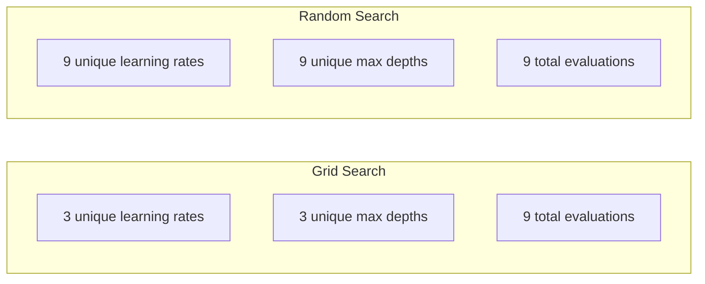
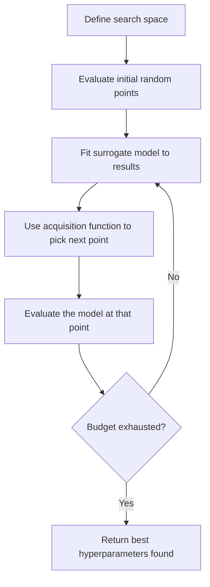
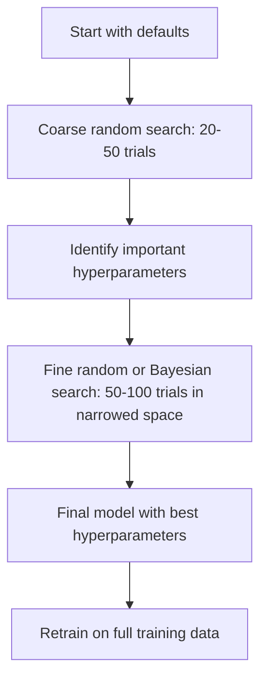
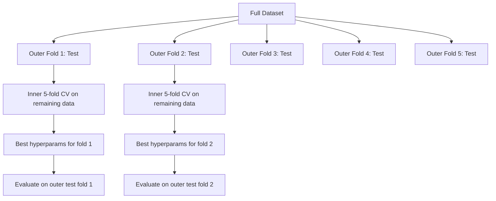

# Apontação de hiperparâmetros

> Os hiperparâmetros são os que determinam se o modelo é plano ou brilhante.

**Type:** Build
**Language:**Python
**Prerequisites:** Phase 2, Lesson 11 (Ensemble Methods)
**Time:** ~90 分钟

## Objectivo de aprendizagem
- A partir do zero, a busca em rede, a busca aleatória e a otimização bayesiana, comparam a sua eficiência de captação
- Explica por que quando a quantidade de hiperparâmetros é menor, a pesquisa aleatória é melhor do que a pesquisa em rede.
- Utilize surrogate model 和 acquisition function  construção da otimização bayesiana  ciclo para orientar a pesquisa
- design a hyperparameter tuning 策略, através de adequação de validação cruzada  evitar a validação de conjunto 过拟合

## 问题
Seu gradiente de aumento 模型有学习率、数量树、最大深度、minéchantillons per leaf、subsample ratio 和列échantillon ratio──也就是六个超参数──如果每个都有5个合理取值,那么网就有5^6 = 15,625种组合──每次训练需要10秒──全部尝试一遍需要43 小时的计算时间──

A pesquisa de grade é o método mais intuitivo, também o mais ruim, mas a maior escala. A pesquisa aleatória com menos quantidade de cálculo pode ser melhor. A otimização baiesa pode ser melhor.

## 概念
### Parâmetros vs. Hiperparâmetros

Os parâmetros são os que são aprendidos durante o processo de treinamento (peso, preconceito, limiar de separação).

| Hyperparameter | 控制什么 | 典型范围 |
|---------------|-----------------|---------------|
| Learning rate | 每次更新的步长 | 0.001 到 1.0 |
| Number of trees/epochs | 训练时长 | 10 到 10,000 |
| Max depth | 模型复杂度 | 1 到 30 |
| Regularization (lambda) | 防止过拟合 | 0.0001 到 100 |
| Batch size | Gradient 估计噪声 | 16 到 512 |
| Dropout rate | 被丢弃的 neurons 比例 | 0.0 到 0.5 |

### Pesquisa da Gradeira

A pesquisa de grade irá avaliar cada tipo de conjunto de valores definidos. É muito fácil de entender, mas vai crescer com os hiperparâmetros.

```
Grid for 2 hyperparameters:

  learning_rate: [0.01, 0.1, 1.0]
  max_depth:     [3, 5, 7]

  Evaluations: 3 x 3 = 9 combinations

  (0.01, 3)  (0.01, 5)  (0.01, 7)
  (0.1,  3)  (0.1,  5)  (0.1,  7)
  (1.0,  3)  (1.0,  5)  (1.0,  7)
```

A pesquisa de grade tem uma falha fundamental: se um hiperparâmetro  é importante, enquanto outro não é importante, a maioria das avaliações são desperdiçadas.

### Pesquisa aleatória

A pesquisa aleatória não é feita a partir de valores da grade, mas sim de hiperparâmetros de distribuição.



Por que vai acontecer o evento?

- A grande maioria dos hiperparâmetros tem uma dimensão muito baixa. Para um determinado problema, apenas 1 a 2 hiperparâmetros são realmente importantes.
- A pesquisa da rede irá avaliar os desperdícios em dimensões não importantes.
- No mesmo orçamento, a pesquisa aleatória cobrirá mais intensamente dimensões importantes.
- Em 60 testes aleatórios, se houver o melhor ponto no espaço de busca, você tem 95% de probabilidade de encontrar um ponto dentro de 5% de melhor ponto.

### Optimização Bayesiana

Pesquisa aleatória irá ignorar resultados. Não vai aprender a taxas de aprendizagem mais altas, levará a divergências, nem vai aprender a profundidade 3.



两个关键组件:

**Surrogate model:**Um modelo de avaliação de baixo custo (normalmente processo de Gauss), usado para uma função objetiva de caro valor, fornece valores de previsão e estimativas de incerteza em qualquer ponto do espaço de busca.

**Acquisition function:**通过平衡利用 (在已知好点附近搜索) 和探索 (在不确定性高的区域搜索)), decidir o próximo passo para avaliar onde.

- **Expected Improvement (EI):**O que esperamos que este ponto possa aumentar em relação ao valor máximo atual?
- **Upper Confidence Bound (UCB):**预测值加上某倍数的不确定性――更高的 UCB表示这个点有潜力,或者还没有充分探索――
- **Probability of Improvement (PI):**Qual é a probabilidade de este ponto superar o valor ideal atual?

A otimização bayesiana geralmente pode ser usada em comparação com a pesquisa aleatória Menos de 2 a 5 vezes de vezes de avaliação para encontrar melhores hiperparâmetros. Comparado com o modelo real de treinamento, a expansão do modelo substitutivo adequado pode ser ignorada.

### Parar cedo

Não é necessário que cada treino seja concluído. Se uma configuração é muito ruim após 10 épocas, basta parar e continuar a próxima.

策略:
- **Patience-based:**Se a perda de validação 连续 N 个 epochs 没有提升,就停止
- **Median pruning:**Se o resultado médio de um julgamento for inferior ao resultado do mesmo passo que já foi concluído, basta parar.
- **Hyperband:**Dê-se uma quantidade de dotações distribuídas em orçamentos menores, e depois aumentar gradualmente o orçamento das melhores dotações

A banda hiperterrestre  especialmente eficaz. Em comparação com a avaliação do orçamento completo, pode ser possível encontrar uma boa configuração 10 a 50 vezes.

### Programadores de Taxas de Aprendizagem

A taxa de aprendizagem é quase sempre o mais importante hiperparâmetro.

| Scheduler | Formula | 何时使用 |
|-----------|---------|-------------|
| Step decay | 每 N 个 epochs 乘以 0.1 | 经典 CNN 训练 |
| Cosine annealing | lr * 0.5 * (1 + cos(pi * t / T)) | 现代默认选择 |
| Warmup + decay | 先线性增加，再 cosine decay | Transformers |
| One-cycle | 在一个 cycle 内先增加再减少 | 快速收敛 |
| Reduce on plateau | 指标停滞时按因子降低 | 稳妥默认选择 |

### Importância do hiperparâmetro

Não todos os hiperparâmetros são igualmente importantes.

**高重要性：**
- Taxa de aprendizagem (始终优先调)
- Número de estimadores / épocas ((Use paragem precoce, em vez de调它)
- Força de regularização

**中等重要性：**
- Profundeza máxima / número de camadas
- Minas amostras por folha / decadência de peso
- Relação de submuestras

**低重要性：**
- Max características ((para florestas aleatórias)
- 具体激活函数 的选择
- Tamanho do lote ((在合理范围内)

Primeiro, o restante é um valor de referência.

### Estratégia prática



具体工作流:

1. **从库的默认值开始。**Eles são escolhidos por praticantes experientes, geralmente já atingindo 80% do efeito.
2. **粗粒度 random search。**Uso largo alcance, 20-50 vezes de teste, uso de paragem precoce, rápida terminação de corridas,
3. **分析结果。**Quais são os hiperparametros relacionados com a performance?
4. **精细搜索。**Em espaços reduzidos, utilizar a otimização Bayesiana ou a busca aleatória focada.
5. **使用找到的最佳 hyperparameters 在全部训练数据上重新训练。**

### Validação cruzada 集成

Em um único parâmetro de validação dividido em cima de hiperparâmetros, há risco. Os melhores hiperparâmetros podem ser adaptados para uma determinada validação.

- **Outer loop**(Avaliar): será dividido em treino+val 和 test.
- **Inner loop**(调优):将 train+val 拆分为 train 和 val── procurar os melhores hiperparâmetros──



Cada dobra externa encontra independentemente os seus melhores hiperparametros.

Utilize sklearn:

```python
from sklearn.model_selection import cross_val_score, GridSearchCV
from sklearn.ensemble import GradientBoostingRegressor

inner_cv = GridSearchCV(
    GradientBoostingRegressor(),
    param_grid={
        "learning_rate": [0.01, 0.05, 0.1],
        "max_depth": [2, 3, 5],
        "n_estimators": [50, 100, 200],
    },
    cv=5,
    scoring="neg_mean_squared_error",
)

outer_scores = cross_val_score(
    inner_cv, X, y, cv=5, scoring="neg_mean_squared_error"
)

print(f"Nested CV MSE: {-outer_scores.mean():.4f} +/- {outer_scores.std():.4f}")
```

É muito caro ((5 pistas externas x 5 pistas internas x 27 pontos de grade = 675 vezes o modelo se encaixa), mas pode fornecer uma estimativa de desempenho confiável;; quando você relata o resultado final no artigo, ou risco de decisão maior ao usá-lo;;

### Dicas Práticas

**从 learning rate 开始。**Para o método baseado em gradientes, ele sempre é o hiperparâmetro mais importante. Uma taxa de aprendizagem ruim fará com que todas as outras configurações perdam significado.

**对 learning rate 和 regularization 使用 log-uniform distributions。**A diferença entre 0,001 e 0,01 é igualmente importante, com a diferença entre 0,1 e 1,0.

**使用 early stopping，而不是调 n_estimators。**Para impulsionar e redes neurais, por exemplo, colocar n_estimatores ou épocas setter higher, deixando parar cedo decidir quando parar.

**预算分配。**A redução do orçamento de 60% foi aplicada nos dois primeiros hiperparâmetros mais importantes.

**尺度很重要。**永遠不要在日志尺度上搜索批量(16、32、64 就可以) ・・・始终在日志尺度上搜索学习率──让搜索分布匹配超参数 影响模型的方式──

| Model Type | Top Hyperparameters | Recommended Search | Budget |
|-----------|--------------------|--------------------|--------|
| Random Forest | n_estimators, max_depth, min_samples_leaf | Random search，50 次 trials | 低（训练快） |
| Gradient Boosting | learning_rate, n_estimators, max_depth | Bayesian，100 次 trials + early stopping | 中 |
| Neural Network | learning_rate, weight_decay, batch_size | Bayesian 或 random，100+ 次 trials | 高（训练慢） |
| SVM | C, gamma (RBF kernel) | 在 log scale 上 grid，25-50 次 trials | 低（2 个参数） |
| Lasso/Ridge | alpha | 在 log scale 上 1D search，20 次 trials | 很低 |
| XGBoost | learning_rate, max_depth, subsample, colsample | Bayesian，100-200 次 trials + early stopping | 中 |

**拿不准时：**Usar pesquisa aleatória, testes números pelo menos para hiperparâmetros 2 vezes o número de números, por exemplo, 6 个超参数 = pelo menos 12 vezes testes)  Você vai ficar surpreso com a descoberta de que, 50 vezes testes de pesquisa aleatória 经常能击败精心设计的网格搜索──


```figure
k-fold-cv
```

## Construí-lo
### 步骤 1: desde zero implementar Pesquisa de Grade

`code/tuning.py`O código do meio realizou a busca em rede de zero, a busca aleatória e um simples otimizador bayesiano.

```python
def grid_search(model_fn, param_grid, X_train, y_train, X_val, y_val):
    keys = list(param_grid.keys())
    values = list(param_grid.values())
    best_score = -float("inf")
    best_params = None
    n_evals = 0

    for combo in itertools.product(*values):
        params = dict(zip(keys, combo))
        model = model_fn(**params)
        model.fit(X_train, y_train)
        score = evaluate(model, X_val, y_val)
        n_evals += 1

        if score > best_score:
            best_score = score
            best_params = params

    return best_params, best_score, n_evals
```

### 步骤 2: Desde zero realizar Rápido Pesquisa

```python
def random_search(model_fn, param_distributions, X_train, y_train,
                  X_val, y_val, n_iter=50, seed=42):
    rng = np.random.RandomState(seed)
    best_score = -float("inf")
    best_params = None

    for _ in range(n_iter):
        params = {k: sample(v, rng) for k, v in param_distributions.items()}
        model = model_fn(**params)
        model.fit(X_train, y_train)
        score = evaluate(model, X_val, y_val)

        if score > best_score:
            best_score = score
            best_params = params

    return best_params, best_score, n_iter
```

### 步骤 3:Optimização Bayesian (Baiesia)

核心思想:将Gaussian process 拟合到已观测的(hiperparameter, score)配对上, então com a função de aquisição decidir o próximo passo看哪里──

```python
class SimpleBayesianOptimizer:
    def __init__(self, search_space, n_initial=5):
        self.search_space = search_space
        self.n_initial = n_initial
        self.X_observed = []
        self.y_observed = []

    def _kernel(self, x1, x2, length_scale=1.0):
        dists = np.sum((x1[:, None, :] - x2[None, :, :]) ** 2, axis=2)
        return np.exp(-0.5 * dists / length_scale ** 2)

    def _fit_gp(self, X_new):
        X_obs = np.array(self.X_observed)
        y_obs = np.array(self.y_observed)
        y_mean = y_obs.mean()
        y_centered = y_obs - y_mean

        K = self._kernel(X_obs, X_obs) + 1e-4 * np.eye(len(X_obs))
        K_star = self._kernel(X_new, X_obs)

        L = np.linalg.cholesky(K)
        alpha = np.linalg.solve(L.T, np.linalg.solve(L, y_centered))
        mu = K_star @ alpha + y_mean

        v = np.linalg.solve(L, K_star.T)
        var = 1.0 - np.sum(v ** 2, axis=0)
        var = np.maximum(var, 1e-6)

        return mu, var

    def _expected_improvement(self, mu, var, best_y):
        sigma = np.sqrt(var)
        z = (mu - best_y) / (sigma + 1e-10)
        ei = sigma * (z * norm_cdf(z) + norm_pdf(z))
        return ei

    def suggest(self):
        if len(self.X_observed) < self.n_initial:
            return sample_random(self.search_space)

        candidates = [sample_random(self.search_space) for _ in range(500)]
        X_cand = np.array([to_vector(c) for c in candidates])
        mu, var = self._fit_gp(X_cand)
        ei = self._expected_improvement(mu, var, max(self.y_observed))
        return candidates[np.argmax(ei)]

    def observe(self, params, score):
        self.X_observed.append(to_vector(params))
        self.y_observed.append(score)
```

GP surrogado em cada candidato dá duas coisas: pré测分数(mu) 和不确定性(var) ――Expected Improvement 会平衡二者:它偏好模型预测高分的点,或不确定性高的点──早期大多数点都有较高不确定性,因此优化器会进行探索──后期则将集中到最有希望的区域──

### 步骤 4: Compare todos os métodos

Na mesma meta sintética 上运行三种方法并比较── esta comparação usa um envelope simplificado, diretamente com a função objetiva 调用每个优化器(没有模型训练), portanto, a API com base no modelo acima 实现不同:

```python
def synthetic_objective(params):
    lr = params["learning_rate"]
    depth = params["max_depth"]
    return -(np.log10(lr) + 2) ** 2 - (depth - 4) ** 2 + 10

param_grid = {
    "learning_rate": [0.001, 0.01, 0.1, 1.0],
    "max_depth": [2, 3, 4, 5, 6, 7, 8],
}

grid_best = None
grid_score = -float("inf")
grid_history = []
for combo in itertools.product(*param_grid.values()):
    params = dict(zip(param_grid.keys(), combo))
    score = synthetic_objective(params)
    grid_history.append((params, score))
    if score > grid_score:
        grid_score = score
        grid_best = params

param_dist = {
    "learning_rate": ("log_float", 0.001, 1.0),
    "max_depth": ("int", 2, 8),
}

rand_best = None
rand_score = -float("inf")
rand_history = []
rng = np.random.RandomState(42)
for _ in range(28):
    params = {k: sample(v, rng) for k, v in param_dist.items()}
    score = synthetic_objective(params)
    rand_history.append((params, score))
    if score > rand_score:
        rand_score = score
        rand_best = params

optimizer = SimpleBayesianOptimizer(param_dist, n_initial=5)
bayes_history = []
for _ in range(28):
    params = optimizer.suggest()
    score = synthetic_objective(params)
    optimizer.observe(params, score)
    bayes_history.append((params, score))
bayes_score = max(s for _, s in bayes_history)

print(f"{'Method':<20} {'Best Score':>12} {'Evaluations':>12}")
print("-" * 50)
print(f"{'Grid Search':<20} {grid_score:>12.4f} {len(grid_history):>12}")
print(f"{'Random Search':<20} {rand_score:>12.4f} {len(rand_history):>12}")
print(f"{'Bayesian Opt':<20} {bayes_score:>12.4f} {len(bayes_history):>12}")
```

Em um mesmo orçamento, a otimização baiesa geralmente pode encontrar o melhor resultado mais rápido, pois não avalia o desperdício em regiões claramente ruins.

## Use-o
### Optuna em prática

Optuna é a recomendação de ajuste rigoroso de hiperparâmetros.

```python
import optuna

def objective(trial):
    lr = trial.suggest_float("learning_rate", 1e-4, 1e-1, log=True)
    n_est = trial.suggest_int("n_estimators", 50, 500)
    max_depth = trial.suggest_int("max_depth", 2, 10)

    model = GradientBoostingRegressor(
        learning_rate=lr,
        n_estimators=n_est,
        max_depth=max_depth,
    )
    model.fit(X_train, y_train)
    return mean_squared_error(y_val, model.predict(X_val))

study = optuna.create_study(direction="minimize")
study.optimize(objective, n_trials=100)

print(f"Best params: {study.best_params}")
print(f"Best MSE: {study.best_value:.4f}")
```

Características principais da Optuna:
- `suggest_float(..., log=True)`Usado para melhor adaptado em escala de logs (a taxa de aprendizagem, regularização)
- `suggest_int`Utilizando para parâmetros inteiros
- `suggest_categorical`Usado para separar
- Introdução MedianPruner, usado para testes péssimos  para fazer paragem precoce
- `study.trials_dataframe()`Usado para análise

### Optuna com poda

A poda de esperanças não é interrompida, economizando assim um grande número de cálculos.

```python
import optuna
from sklearn.model_selection import cross_val_score

def objective(trial):
    params = {
        "learning_rate": trial.suggest_float("lr", 1e-4, 0.5, log=True),
        "max_depth": trial.suggest_int("max_depth", 2, 10),
        "n_estimators": trial.suggest_int("n_estimators", 50, 500),
        "subsample": trial.suggest_float("subsample", 0.5, 1.0),
    }

    model = GradientBoostingRegressor(**params)
    scores = cross_val_score(model, X_train, y_train, cv=3,
                             scoring="neg_mean_squared_error")
    mean_score = -scores.mean()

    trial.report(mean_score, step=0)
    if trial.should_prune():
        raise optuna.TrialPruned()

    return mean_score

pruner = optuna.pruners.MedianPruner(n_startup_trials=10, n_warmup_steps=5)
study = optuna.create_study(direction="minimize", pruner=pruner)
study.optimize(objective, n_trials=200)
```

`MedianPruner`O valor médio de um teste é inferior ao mesmo passo do número médio de todos os testes concluídos quando o processo é interrompido.`trial.report()`报告中间指标,并调用 `trial.should_prune()`Verifique se o julgamento deve parar.`n_startup_trials=10` assegure que existam pelo menos 10 ensaios  após a conclusão completa, a poda  apenas será iniciada Isto normalmente pode economizar 40-60% da quantidade total de cálculo

### - Sim. - Sim. - Sim.

Para experiências rápidas, aprenda a fazer.`GridSearchCV`- Não.`RandomizedSearchCV`和 `HalvingRandomSearchCV`- Não .

```python
from sklearn.model_selection import RandomizedSearchCV
from scipy.stats import loguniform, randint

param_dist = {
    "learning_rate": loguniform(1e-4, 0.5),
    "max_depth": randint(2, 10),
    "n_estimators": randint(50, 500),
}

search = RandomizedSearchCV(
    GradientBoostingRegressor(),
    param_dist,
    n_iter=100,
    cv=5,
    scoring="neg_mean_squared_error",
    random_state=42,
    n_jobs=-1,
)
search.fit(X_train, y_train)
print(f"Best params: {search.best_params_}")
print(f"Best CV MSE: {-search.best_score_:.4f}")
```

Para a taxa de aprendizagem e regularização`loguniform`△ para um número inteiro de hiperparâmetros `randint`- Não.`n_jobs=-1`O sinal vai ser usado em todos os núcleos da CPU.

### Hiperparâmetro Tuning 中的常见错误

**通过 preprocessing 产生 data leakage。**Se estiveres na validação cruzada antes de entrar no conjunto de dados completo, para que se encaixe um escalador, a informação da validação vai ser divulgada para o treinamento.`Pipeline`Assim, só se encaixa no treino.

**对 validation set 过拟合。**运行数千次试验 实际上等于在验证集上训练――最终性能估计应使用嵌套横验证,或者留出一个在调优期间从不碰的独立试验集――

**搜索范围太窄。**Se o seu melhor valor estiver na borda do espaço de busca, indique que o alcance da busca não é amplo o suficiente.

**忽略交互效应。**Em meio a um aumento, a taxa de aprendizagem e o número de estimadores têm uma forte interacção.

**没有对 iterative models 使用 early stopping。**Para aumentar o gradiente e as redes neurais, os n_estimatores ou épocas                                                                                                                                                                                                                                                                                                                                                                                                                                                                                                         

## 练习
1. Com o mesmo orçamento total, a pesquisa em rede e a pesquisa aleatória (por exemplo, 50 avaliações) foram encontradas em diferentes sementes.

2. A partir de zero, a partir de 81 configurações, cada treinamento começa com uma época.

3. 给课11 中的梯度提升 实现添加一个学习率调度器 (学习率调度调度调度调度调度调度调度调度调度调度调度调度调度调度调度调度)  Em comparação com a taxa fixa de aprendizagem, ajuda?

4. Optuna em Set de Dados Verdadeiros (por exemplo, do do sklearn)`optuna.visualization.plot_param_importances(study)`查看哪些超参数最重要――¿É que corresponde a ordem de importância desta aula?

5. 实现一简单的收购功能(Expected Improvement),并演示探索与利用──绘制替代模型的平均值和不确定性,并演示 EI 选择下一步评估的位置──

## 关键术语
| Term | 人们通常说 | 实际含义 |
|------|----------------|----------------------|
| Hyperparameter | “你选择的一个设置” | 训练前设置的值，用来控制学习过程，不是从数据中学习得到的 |
| Grid search | “尝试每一种组合” | 在指定 parameter grid 上进行穷举搜索。成本呈指数级增长。 |
| Random search | “就是随机采样” | 从分布中采样 hyperparameters。比 grid search 更好地覆盖重要维度。 |
| Bayesian optimization | “智能搜索” | 使用 objective 的 surrogate model 来决定下一步评估哪里，平衡 exploration 和 exploitation |
| Surrogate model | “一个便宜的近似” | 一个模型（通常是 Gaussian process），根据已观测评估来近似昂贵的 objective function |
| Acquisition function | “下一步看哪里” | 通过平衡 expected improvement 和不确定性，为候选点打分。EI 和 UCB 是常见选择。 |
| Early stopping | “停止浪费时间” | 当 validation performance 停止提升时，提前终止训练 |
| Hyperband | “配置的锦标赛分组” | 自适应资源分配：用小预算启动许多 configs，保留最好的并增加它们的预算 |
| Learning rate scheduler | “训练期间改变 lr” | 一个函数，用于在训练过程中调整 learning rate，以获得更好的收敛 |

## 延伸阅读
- [Bergstra & Bengio: Random Search for Hyper-Parameter Optimization (2012)](https://jmlr.org/papers/v13/bergstra12a.html)-- 证明 random 胜过网 的论文
- [Snoek et al., Practical Bayesian Optimization of Machine Learning Algorithms (2012)](https://arxiv.org/abs/1206.2944)-- Utilizando a otimização Bayesiana do ML
- [Li et al., Hyperband: A Novel Bandit-Based Approach (2018)](https://jmlr.org/papers/v18/16-558.html)-- Hiperbanda 论文
- [Optuna: A Next-generation Hyperparameter Optimization Framework](https://arxiv.org/abs/1907.10902)-- Optuna 论文
- [Probst et al., Tunability: Importance of Hyperparameters (2019)](https://jmlr.org/papers/v20/18-444.html)-- 哪些 hiperparameters 重要
