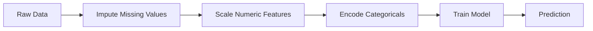
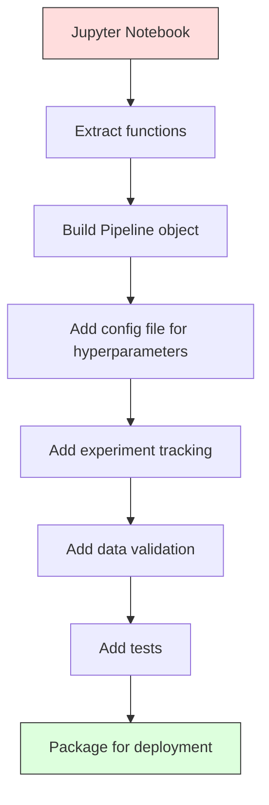

# Tubos de transporte de água

> O modelo não é um produto. A linha de pipeline cobre todo o processo, desde dados brutos até previsão implementada, e cada passo tem de ser reproduzido.

**Type:** Build
**Language:**Python
**Prerequisites:** Phase 2, Lesson 12 (Hyperparameter Tuning)
**Time:** ~120 minutes

## Objectivo de aprendizagem
- A partir de zero construir um pipeline de ML, imputar, escalar, codificar e treinar modelos 串联 into a single object of replicable
- Identificar vazamento de dados  cenário,并 explicar Pipeline  como passar apenas em treinamento de dados 上拟合变压器 防止泄漏
- Construir um ColumTransformer, para características numéricas e categorias  aplicar diferentes pré-processamento
-  Realizar a serialização do pipeline, demonstrar que um pipeline já concebido em formação e produção produz resultados concordantes

## 问题
Você tem um bloco de notas: ele carrega dados, usa mediana preencher valores faltantes, acrescentar recursos, treinamento modelo, e imprimir precisão.

Um mês depois, alguém re-treinou o modelo, mas obteve resultados diferentes. O mediano está em um conjunto completo de dados que contém dados de teste.

Estas não são hipóteses. São as causas mais comuns de falhas de sistemas de ML em produção.

## 概念
### O que é um oleoduto

O pipeline é um conjunto de transformações de dados ordenadas, posteriormente seguidas de um modelo. Cada passo é o primeiro passo de saída como entrada. O pipeline inteiro só se combina com os dados de treinamento.



Pipeline 保证:
- Transformações apenas em dados de treinamento
- Inferência 时应用 totalmente as mesmas transformações
- Todo o objeto pode ser serializado, e como um artefato
- A validação cruzada será aplicada em cada folha do gasoduto, para evitar pequenas fugas

### Data Leak: Silent Killer

O vazamento de dados ocorre no conjunto de testes ou no treinamento de contaminação de informação em dados futuros.

**Leaky（错误）：**
```python
X = df.drop("target", axis=1)
y = df["target"]

scaler = StandardScaler()
X_scaled = scaler.fit_transform(X)

X_train, X_test = X_scaled[:800], X_scaled[800:]
y_train, y_test = y[:800], y[800:]
```

O Scalar viu os dados de teste. A média e a desviação padrão contêm amostras de teste.

**Correct：**
```python
X_train, X_test = X[:800], X[800:]

scaler = StandardScaler()
X_train_scaled = scaler.fit_transform(X_train)
X_test_scaled = scaler.transform(X_test)
```

Usar Pipeline 时, você não precisa pensar especialmente sobre este problema.

### Escola de condução

sklearn `Pipeline`O que é que é isso?`.fit()`- Não.`.predict()`和 `.score()`, em ordem de aplicação todos os passos:

```python
from sklearn.pipeline import Pipeline
from sklearn.preprocessing import StandardScaler
from sklearn.linear_model import LogisticRegression

pipe = Pipeline([
    ("scaler", StandardScaler()),
    ("model", LogisticRegression()),
])

pipe.fit(X_train, y_train)
predictions = pipe.predict(X_test)
```

Quando você está a usar`pipe.fit(X_train, y_train)`时:
1. Escaler em X_train 上调用 `fit_transform`
2. Modelo em escala X_train 上调用 `fit`

Quando você está a usar`pipe.predict(X_test)`时:
1. Scaler em X_test 上调用 `transform`Não é o que se passa .
2. Modelo em escala X_test 上调用 `predict`

O escalador nunca verá dados de teste no processo de montagem.

### ColunaTransformador:不同列使用不同管道

O conjunto de dados real também contém colunas numéricas e categorias, que requerem diferentes pré-processamento.`ColumnTransformer` responsabilizar-se-á por esta situação.

```python
from sklearn.compose import ColumnTransformer
from sklearn.preprocessing import StandardScaler, OneHotEncoder
from sklearn.impute import SimpleImputer

numeric_pipe = Pipeline([
    ("impute", SimpleImputer(strategy="median")),
    ("scale", StandardScaler()),
])

categorical_pipe = Pipeline([
    ("impute", SimpleImputer(strategy="most_frequent")),
    ("encode", OneHotEncoder(handle_unknown="ignore")),
])

preprocessor = ColumnTransformer([
    ("num", numeric_pipe, ["age", "income", "score"]),
    ("cat", categorical_pipe, ["city", "gender", "plan"]),
])

full_pipeline = Pipeline([
    ("preprocess", preprocessor),
    ("model", GradientBoostingClassifier()),
])
```

OneHotEncoder 中的 `handle_unknown="ignore"`Para a produção 至关重要── quando surge uma nova categoria (por exemplo, modelos nunca vistos de cidades), ela produz um vetor total zero, em vez de uma queda direta―.

### Perseguimento de Experimentos

Pipeline 让训练可复现, mas você também precisa rastrear os experimentos 之间发生了什么: usando quais hiperparametros 哪个数据集版本、测量是什么?,运行的是哪个代码──

**MLflow**É a solução de código aberto mais comum:

```python
import mlflow

with mlflow.start_run():
    mlflow.log_param("max_depth", 5)
    mlflow.log_param("n_estimators", 100)
    mlflow.log_param("learning_rate", 0.1)

    pipe.fit(X_train, y_train)
    accuracy = pipe.score(X_test, y_test)

    mlflow.log_metric("accuracy", accuracy)
    mlflow.sklearn.log_model(pipe, "model")
```

Cada vez que executamos, nós registamos os parâmetros, métricas, artefatos e modelos completos. Você pode comparar corridas, repetir qualquer experimento, e implementar qualquer versão de modelo.

**Weights & Biases (wandb)**提供相同功能,并带有主机仪表板:

```python
import wandb

wandb.init(project="my-pipeline")
wandb.config.update({"max_depth": 5, "n_estimators": 100})

pipe.fit(X_train, y_train)
accuracy = pipe.score(X_test, y_test)

wandb.log({"accuracy": accuracy})
```

### Modelo de versão

完成实验追踪 后,你需要管理模型版本──哪个模型在生产?哪个正在舞台上?上周使用的是哪个?

Registro de Modelo de MLflow 提供:
- **Version tracking:**Cada modelo que se conserve obtém um número de versão
- **Stage transitions:**"Stage" ‧"Produzção"‧"Arquivo"
- **Approval workflow:**O modelo deve ser claramente promovido para a produção
- **Rollback:**立即切回 前前的版本

### Versão de dados com DVC

O código usou git para fazer versões. O dados também deveria ser versão, mas git não pode processar grandes arquivos.

```
dvc init
dvc add data/training.csv
git add data/training.csv.dvc data/.gitignore
git commit -m "Track training data"
dvc push
```

DVC irá armazenar os dados reais em armazenamento remoto (S3、GCS、Azure) e manter um muito pequeno em git.`.dvc`Quando você checa um compromisso,`dvc checkout`Será recuperado o dado preciso que usou na época.

Isso significa que cada compromisso foi fixado ao mesmo tempo código e dados.

### Experimentos Reproduíveis

Uma experiência realista requer quatro coisas:

1. **Fixed random seeds:**Para numpy、random 和 framework(torch、sklearn) configuração de sementes
2. **Pinned dependencies:**Use带精确版本的 requirements.txt ou poetry.lock
3. **Versioned data:**Utilize DVC ou ferramentas similares
4. **Config files:**Todos os hiperparâmetros são colocados no config, e não em código rígido.

```python
import numpy as np
import random

def set_seed(seed=42):
    random.seed(seed)
    np.random.seed(seed)
    try:
        import torch
        torch.manual_seed(seed)
        torch.cuda.manual_seed_all(seed)
        torch.backends.cudnn.deterministic = True
    except ImportError:
        pass
```

### Do Notebook ao Production Pipeline



典型演进过程:

1. **Notebook exploration:**快速 experimentações  visualizações  ideias de características
2. **Extract functions:**A análise de dados e de dados sobre a utilização de dados de dados e de dados de dados
3. **Build Pipeline:**将 transformações 串联成 sklearn Pipeline ou classe personalizada
4. **Config management:**Vai transferir todos os hiperparâmetros para a configuração YAML/JSON
5. **Experiment tracking:**添加 MLflow ou logging
6. **Data validation:**No treinamento, pre-exame esquemas, distribuições e padrões de valores faltantes
7. **Tests:**Para transformadores  redigir testes unitários, para o Pipeline completo  redigir testes de integração
8. **Deployment:**Serialize Pipeline, use API(FastAPI、Flask)封装,并 containerize

### Erros comuns no transporte de gasodutos

| Mistake | Why it is bad | Fix |
|---------|-------------|-----|
| 在 splitting 前对完整数据 fitting | Data leakage | 使用带 cross_val_score 的 Pipeline |
| 在 Pipeline 外做 feature engineering | Train 与 serve 时 transforms 不一致 | 把所有 transforms 放入 Pipeline |
| 不处理 unknown categories | Production 中出现新值会崩溃 | OneHotEncoder(handle_unknown="ignore") |
| Hardcoded column names | schema 变化时会出错 | 从 config 使用 column name lists |
| 没有 data validation | bad data 会导致悄无声息的错误 predictions | 在 prediction 前添加 schema checks |
| Training/serving skew | 模型在 prod 中看到不同 features | training 和 serving 共用一个 Pipeline 对象 |


```figure
f3-pipeline-flow
```

## Construí-lo
`code/pipeline.py`O código do meio é construído a partir de zero um oleoduto completo de ML:

### 步骤 1: Transformador personalizado

```python
class CustomTransformer:
    def __init__(self):
        self.means = None
        self.stds = None

    def fit(self, X):
        self.means = np.mean(X, axis=0)
        self.stds = np.std(X, axis=0)
        self.stds[self.stds == 0] = 1.0
        return self

    def transform(self, X):
        return (X - self.means) / self.stds

    def fit_transform(self, X):
        return self.fit(X).transform(X)
```

### 步骤 2: Construção de oleodutos

```python
class PipelineFromScratch:
    def __init__(self, steps):
        self.steps = steps

    def fit(self, X, y=None):
        X_current = X.copy()
        for name, step in self.steps[:-1]:
            X_current = step.fit_transform(X_current)
        name, model = self.steps[-1]
        model.fit(X_current, y)
        return self

    def predict(self, X):
        X_current = X.copy()
        for name, step in self.steps[:-1]:
            X_current = step.transform(X_current)
        name, model = self.steps[-1]
        return model.predict(X_current)
```

### 步骤 3: Utilize Pipeline  realizar a validação cruzada

代码演示了使用管道的跨验证 如何防止数据泄漏:scaler 会分别在每个折的训练数据上 fit──

### 第 4 步: usar o gasoduto de produção completo do sklearn

Um gasoduto completo, contendo`ColumnTransformer`、多条 vias de pré-processamento 和一个模型,并使用正确的交叉验证与实验记录 进行训练──

## Entrega-o
本课产出:
- `outputs/prompt-ml-pipeline.md`-- Usar para construir e configurar os oleodutos ML
- `code/pipeline.py`- Um pipeline completo, do zero  implementado até sklearn  versão

## 练习
1. Construir um pipeline, processar contendo 3 colunas numéricas e 2 colunas categóricas dos conjuntos de dados.`ColumnTransformer`Para a numerologia  aplicar imputação mediana + escalação, para categorias  aplicar imputação mais frequente + codificação de um só calor― utilizar 5 vezes validação cruzada  realizar treinamento―

2. Por isso, o resultado da verificação de dados é muito mais rápido.

3. Utilização `joblib.dump`serialize Seu Pipeline. em monólogo.

4. Para Pipeline adicionar um transformador personalizado, para duas colunas numéricas mais importantes criar características polinômicas ((grau 2) ・・・ que posição deve colocar Pipeline?

5. Por pipeline  configuração de rastreamento de fluxo ML.`mlflow ui`) Compare corridas,并选择最佳模型──

## 关键术语
| Term | What people say | What it actually means |
|------|----------------|----------------------|
| Pipeline | "Chain of transforms + model" | 一组有序的已拟合 transformers 和一个模型，作为一个整体应用以防止泄漏 |
| Data leakage | "Test info leaked into training" | 使用 training set 之外的信息构建模型，从而夸大 performance estimates |
| ColumnTransformer | "Different preprocessing per column" | 对不同列子集应用不同 Pipelines，并合并结果 |
| Experiment tracking | "Logging your runs" | 为每次 training run 记录 parameters、metrics、artifacts 和 code versions |
| MLflow | "Track and deploy models" | 用于 experiment tracking、model registry 和 deployment 的 open-source platform |
| DVC | "Git for data" | 面向 large data files 的 version control system，在 git 中存储 hashes，在 remote storage 中存储数据 |
| Model registry | "Model version catalog" | 使用 stage labels（staging、production、archived）追踪 model versions 的系统 |
| Training/serving skew | "It worked in the notebook" | Training 与 inference 期间数据处理方式存在差异，导致 silent errors |
| Reproducibility | "Same code, same result" | 使用相同代码、数据和配置获得完全相同结果的能力 |

## 延伸阅读
- [scikit-learn Pipeline docs](https://scikit-learn.org/stable/modules/compose.html)-- 官方 Referência do gasoduto
- [MLflow documentation](https://mlflow.org/docs/latest/index.html)-- rastreamento de experimentos e registro de modelos
- [DVC documentation](https://dvc.org/doc)-- versão de dados
- [Sculley et al., Hidden Technical Debt in Machine Learning Systems (2015)](https://papers.nips.cc/paper/2015/hash/86df7dcfd896fcaf2674f757a2463eba-Abstract.html)--  Sobre a complexidade dos sistemas de inteligência artificial
- [Google ML Best Practices: Rules of ML](https://developers.google.com/machine-learning/guides/rules-of-ml)-- 实用生产 ML 建议
