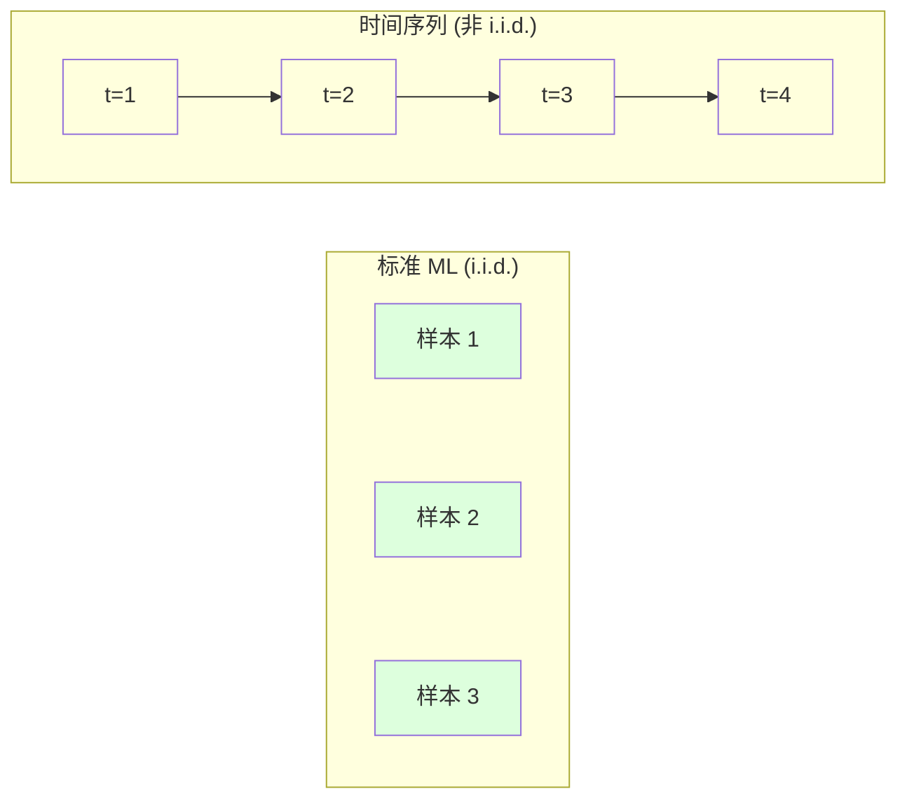
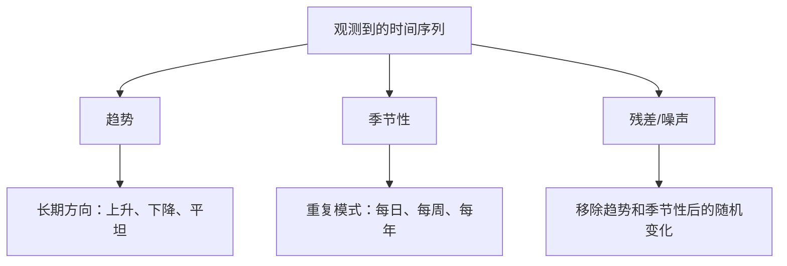
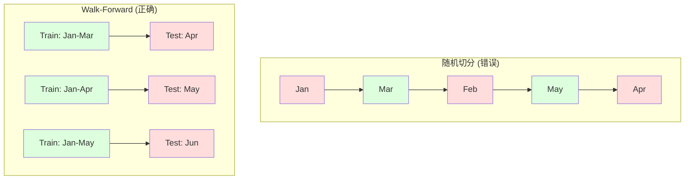

# 时间序列基础

> O passado pode prever o futuro.

**Type:** Build
**Language:**Python
**Prerequisites:** Phase 2, Lessons 01-09
**Time:** ~90 分钟

## Objectivo de aprendizagem

- Descompondo a sequência temporal em componentes de tendência, estação e diferença, e verifica a equidade.
-  Realizar características de atraso e estatística de rolagem, transformar a sequência de tempo em questão de supervisão de aprendizagem
- Construir validação avançada  framework, prevenir futuras vazamentos de dados até treinamento
- Explicar por que a divisão de trem / teste de um sequência de tempo não é eficaz, e mostrar a diferença de desempenho entre o trenagem e o tempo real.

## 问题

Você tem dados por ordem de tempo. Vendas diárias, temperatura por hora, taxa de uso de CPU por minuto, preço de ações por semana. Você quer prever o próximo valor, a próxima semana, o próximo trimestre.

Você tira fora padrão ML 工具箱:随机火车/测试分分,横证,输入特征矩阵,输出预测,每个步都是错的,

 Time sequence  rompe o padrão ML Dependendo da hipótese  Sample não é independente                                                                                                                                                                                                                                                 

Um modelo com validação cruzada aleatória  obtém 95% de precisão, com uma avaliação correta baseada no tempo é possível apenas 55%. Essa diferença não é um detalhe técnico.

Este curso abrange o conteúdo básico: o que os dados do tempo são diferentes, como avaliar honestamente o modelo, e como transformar a sequência do tempo em características padrão que o modelo ML pode usar.

## 概念

### O tempo é diferente.

标准 ML 假设 i.i.d. -- 独立同分布── cada amostra é extraída da mesma distribuição, e independente de outras amostra── sequência de tempo simultaneamente infringe estes dois pontos:

- **不独立。**O preço da ação de hoje depende do preço de ontem.
- **不同分布。**As vendas de 12 meses parecem diferentes de 3 meses.

Estas violações não são pequenas. Eles vão mudar a forma como você construi características, a forma como avalia o modelo, bem como quais algoritmos são usáveis.



No ML padrão, os modelos podem ser trocados entre si.

### 时间序列的组成部分 时间序列的组成部分 时间序列的组成部分

Cada sequência de tempo é composta do seguinte:



- **趋势**A taxa de crescimento anual de rendimentos é de 10% e a temperatura global é de 10%.
- **季节性**O volume de vendas aumentou em 12 de julho.
- **残差**Se o resíduo parece um ruído branco, explicação para a degradação da captura do sinal.

### Planície

Se a propriedade estatística de uma sequência de tempo não mudar com o tempo, é planejada.

**为什么重要：**O valor médio da sequência não-estabilizada irá deslocar-se. Em um modelo de treinamento em dados de 1 de janeiro, o valor médio aprendido será diferente do valor médio apresentado em 2 de janeiro.

**如何检查：**Em janelas calcula a média de rolamento e a desvio padrão de rolamento. Se elas se deslocam, o sequência é não-plano.

**如何修复：**差分── não construir o valor original, mas construir a variação entre os valores continuados:

```
diff[t] = value[t] - value[t-1]
```

Se uma vez a diferença não consegue fazer a sequência ser estabilizada, vamos aplicá-la novamente.

**示例：**

Primeiro período: [100, 102, 106, 112, 120]
一阶差分: [2, 4, 6, 8]( ainda em alta tendência)
二阶差分: [2, 2, 2](常数 -- 平稳)

O primeiro ciclo tem duas tendências. O primeiro ciclo transforma-o em tendências lineares. O segundo ciclo torna-o em planos. Na prática, raramente é necessário mais de duas tendências.

**形式化检验：**O teste Augmented Dickey-Fuller (ADF) é um teste estatístico padrão de planeamento. O método de estatística de rolagem no código fornece um teste de visualização prática.

### Desde relacionado

Desde o tempo de medida t de valor e o tempo t-k  passados k 步                                                                                                                                                                                                                                                     

**ACF 告诉你：**
- Se o ACF em lag 5 后降到零, então o valor anterior de 5 步无关紧要――
- Se o ACF tiver um pico de 12 meses atrás, há uma temporada anual.
- Para criar um pouco de atraso, o uso até que o ACF se torne ignorável, o atraso é sempre.

**PACF (Partial Autocorrelation Function)**Se hoje estiver relacionado com 3 天前, apenas porque os dois estão relacionados com ontem, então o lag 3 de PACF será zero, e o lag 3 de ACF não será zero.

### 滞后特征:把时间序列转换为监督学习

标准 ML 模型 需要特征矩阵 X 和目标 y──时间序列只给你一列值──桥梁就是滞后特征──

取序列 [10, 12, 14, 13, 15], criar lag-1 和 lag-2

| lag_2 | lag_1 | target |
|-------|-------|--------|
| 10    | 12    | 14     |
| 12    | 14    | 13     |
| 14    | 13    | 15     |

Agora você tem um padrão de regressão 问题── qualquer modelo de ML 模型(regressão linear、 floresta aleatória、 aumento gradiente) pode ser usado para atingir o objetivo de previsão  

Outras características do engenharia:
- **Rolling statistics:**Recent k 个值的 mean、std、min、max
- **Calendar features:**O dia de férias é o fim de semana.
- **Differenced values:**Comparado com o passo anterior
- **Expanding statistics:**累累计平均 累计 sum
- **Ratio features:**当前值 / rolling mean (preço médio de rotação)
- **Interaction features:**1 * dia_da_semana(工作日对动量的影响)

**多少个 lag？**Use autocorrelação função. Se ACF até lag 10 são significativos, use pelo menos 10 lags. Se existirem períodos de tempo, contém lag 7 ((ou pode incluir 14)  Mais lag irá dar ao modelo mais informações históricas, mas também aumentará o número de características adequadas, aumentando assim o risco de sobreajuste.

**target 对齐陷阱。**Quando se cria um traço atrasado, o objetivo deve ser o valor do tempo t, e todos os traços devem usar o valor do tempo t-1 ou mais cedo. Se você não tiver o menor interesse em considerar o valor do tempo t como um traço incluído, você já possui um prédictor perfeito - e um modelo completamente inútil. Este é o bug mais comum no projeto de traços de sequência de tempo.

### Validação de avanço

É o conceito mais importante deste curso. A validação cruzada de padrões K-fold irá distribuir as amostras para o trem e testar.



Validação de avanço:
1. Em截至时间 t 的数据上训练
2. 预测时间 t+1(或用于多步预测的 t+1 到 t+k)
3. Vai deslizar a janela para a frente
4. O que é isso?

Cada teste apenas contém todos os dados do treinamento, não há vazamentos futuros, o que lhe dará uma estimativa honesta, mostrando como o modelo será implementado.

**Expanding window**Utilize todos os dados históricos para fazer treinamento (Windows growth)**Sliding window**Use fixed size training window (Fixada grandeza de treinamento)  Quando você acredita que dados mais antigos ainda estão relacionados, use expandir Quando o mundo está mudando e dados antigos são prejudiciais, use deslizando

### ARIMA 直觉

ARIMA é um modelo clássico de sequência de tempo.

- **AR (Autoregressive):**Desde o passado valor para fazer previsão.
- **I (Integrated):**通过差分实现平稳性──I(d) 应用 d 次差分──
- **MA (Moving Average):**Desde passado 预测误差进行预测──MA(q) Uso recente 个误差──

ARIMA(p, d, q) 组合了三者──你基于ACF/PACF 分析或自动搜索(auto-ARIMA) 组合了三者──你基于ACF/PACF 分析或自动搜索(auto-ARIMA) 组合了三者──你基于ACF/PACF 分析或自动搜索(auto-ARIMA) 组合了三者──你基于ACF/PACF 分析或自动搜索(auto-ARIMA) 组合了三者──你基于ACF/PACF 分析或自动搜索(auto-ARIMA) 组合了三者──你基于ACF/PACF 分析或自动搜索的选择 p、d、q──

Não vamos implementar ARIMA a partir de zero - ela precisa de otimização numérica, além do alcance da aula.

### Qual é o tempo de usar?

| Approach | Best For | Handles Seasonality | Handles External Features |
|----------|---------|-------------------|------------------------|
| 滞后特征 + ML | 有很多外部特征的表格数据 | 通过 calendar features | 是 |
| ARIMA | 单个单变量序列、短期 | SARIMA 变体 | 否（ARIMAX 支持有限） |
| Exponential smoothing | 简单趋势 + 季节性 | 是（Holt-Winters） | 否 |
| Prophet | 业务预测、节假日 | 是（Fourier terms） | 有限 |
| Neural networks (LSTM, Transformer) | 长序列、多序列 | 学习得到 | 是 |

Para a maioria dos problemas reais, o atraso de características + aumento de gradiente é o ponto de partida mais forte.

### 预测 Horizonte e estratégias

单步预测会预测未来一个时间步――多步预测会预测多个时间步―― há três estratégias:

**Recursive (iterated):**预测 Next step, trazer o resultado da previsão como entrada do próximo passo. 简单,但错误会积累 - cada previsão usa uma previsão, portanto, err err err err err err err err err err 错误会复合.

**Direct:**Para cada horizonte  treinar modelos individuais。Modelo-1  previsão t+1,Modelo-5  previsão t+5── não há erros acumulados, mas cada modelo tem menos padrões de treinamento, e não compartilham informações。

**Multi-output:**訓練一個同時输出所有水平的模型──跨水平 共享信息,但需要支持多输出模型──或自定义 Loss Function──

Para a maioria dos problemas reais, horizonte curto (de 1 a 5 步) desde o recursivo (de início), horizonte longo (de início) usando horizonte direto (de início a fim de começar).

### 时间序列中的常见错误

| Mistake | Why it happens | How to fix |
|---------|---------------|-----------|
| 随机 train/test split | 来自标准 ML 的习惯 | 使用 walk-forward 或 temporal split |
| 使用未来特征 | 误把时间 t 的特征包含进去 | 审计每个特征的时间对齐 |
| 对季节性 overfitting | 模型记住了日历模式 | 在 test set 中留出一个完整季节周期 |
| 忽略尺度变化 | 收入翻倍但模式保持 | 建模百分比变化而非绝对值 |
| 过多滞后特征 | “更多历史更好” | 使用 ACF 确定相关 lag |
| 不做差分 | “模型会自己搞定” | 树模型能处理趋势；线性模型需要平稳性 |


```figure
f3-series-decompose
```

## Construí-lo

`code/time_series.py`O código central realizou o bloco de construção do núcleo a partir de zero.

### 滞后特征创建器

```python
def make_lag_features(series, n_lags):
    n = len(series)
    X = np.full((n, n_lags), np.nan)
    for lag in range(1, n_lags + 1):
        X[lag:, lag - 1] = series[:-lag]
    valid = ~np.isnan(X).any(axis=1)
    return X[valid], series[valid]
```

Isto transformará a sequência 1D em matriz de características, cada uma delas com a sua linha mais próxima.`n_lags`个值作为特征,并以当前值作为目标──

### Validação cruzada

```python
def walk_forward_split(n_samples, n_splits=5, min_train=50):
    assert min_train < n_samples, "min_train must be less than n_samples"
    step = max(1, (n_samples - min_train) // n_splits)
    for i in range(n_splits):
        train_end = min_train + i * step
        test_end = min(train_end + step, n_samples)
        if train_end >= n_samples:
            break
        yield slice(0, train_end), slice(train_end, test_end)
```

Cada vez que o tempo é feito, as informações do treinamento são rigorosas e precárias aos dados do teste.

### 简单 Autoregressiva 模型

O modelo de pura AR é a regressão linear de características atrasadas:

```python
class SimpleAR:
    def __init__(self, n_lags=5):
        self.n_lags = n_lags
        self.weights = None
        self.bias = None

    def fit(self, series):
        X, y = make_lag_features(series, self.n_lags)
        # Solve via normal equations
        X_b = np.column_stack([np.ones(len(X)), X])
        theta = np.linalg.lstsq(X_b, y, rcond=None)[0]
        self.bias = theta[0]
        self.weights = theta[1:]
        return self
```

Esta regressão linear é totalmente a mesma no conceito da lição 02 , mas é aplicada apenas na versão posterior do mesmo valor de variação no tempo.

### Inspecção de estabilidade

代码计算滚动统计, para avaliação de visibilidade e quantificação de estabilidade:

```python
def check_stationarity(series, window=50):
    rolling_mean = np.array([
        series[max(0, i - window):i].mean()
        for i in range(1, len(series) + 1)
    ])
    rolling_std = np.array([
        series[max(0, i - window):i].std()
        for i in range(1, len(series) + 1)
    ])
    return rolling_mean, rolling_std
```

Se a média de rolamento 漂移或滚动 std 变化,序列就是不平稳的──应用差分后再检查一次──

O código também passa pela comparação de sequências de primeira metade e segunda metade para verificar a estabilidade. Se a diferença média de valor for superior a metade da diferença padrão, ou a diferença de quadrado for superior a 2x, a sequência será marcada como não-estabilidade.

### Desde relacionado

```python
def autocorrelation(series, max_lag=20):
    n = len(series)
    mean = series.mean()
    var = series.var()
    acf = np.zeros(max_lag + 1)
    for k in range(max_lag + 1):
        cov = np.mean((series[:n-k] - mean) * (series[k:] - mean))
        acf[k] = cov / var if var > 0 else 0
    return acf
```

## Use-o

Usando o Sklern, podes transmitir o atraso a qualquer regressor:

```python
from sklearn.linear_model import Ridge
from sklearn.ensemble import GradientBoostingRegressor

X, y = make_lag_features(series, n_lags=10)

for train_idx, test_idx in walk_forward_split(len(X)):
    model = Ridge(alpha=1.0)
    model.fit(X[train_idx], y[train_idx])
    predictions = model.predict(X[test_idx])
```

对于ARIMA,使用统计模型:

```python
from statsmodels.tsa.arima.model import ARIMA

model = ARIMA(train_series, order=(5, 1, 2))
fitted = model.fit()
forecast = fitted.forecast(steps=30)
```

`time_series.py`O código do meio apresentou dois métodos, e usou a validação avançada para fazer comparações.

### sklearn TimeSeriesSplit

sklearn  forneceu a validação avançada de`TimeSeriesSplit`- Não .

```python
from sklearn.model_selection import TimeSeriesSplit

tscv = TimeSeriesSplit(n_splits=5)
for train_index, test_index in tscv.split(X):
    X_train, X_test = X[train_index], X[test_index]
    y_train, y_test = y[train_index], y[test_index]
    model.fit(X_train, y_train)
    score = model.score(X_test, y_test)
```

Isto é o mesmo que nós conseguimos desde o zero.`walk_forward_split`Mas agora está integrado no quadro de validação cruzada do sklearn.`cross_val_score`Uma utilização:

```python
from sklearn.model_selection import cross_val_score

scores = cross_val_score(model, X, y, cv=TimeSeriesSplit(n_splits=5))
print(f"Mean score: {scores.mean():.4f} +/- {scores.std():.4f}")
```

###  avaliação indicador

时间序列预测 usar Regressão Indicator, mas带有时间感知的 上下文:

- **MAE (Mean Absolute Error):**                                                                                                                                                                                                                                                              
- **RMSE (Root Mean Squared Error):**média erro quadrado de raiz quadrada. Em comparação com MAE, é mais pesado para grande erro que muitos pequenos erros.
- **MAPE (Mean Absolute Percentage Error):**Não há relação com a medida, mas os valores verdadeiros são não definidos.
- **Naive baseline comparison:**始终与简单基线比较――季节性天才基线 会预测上一周期的价值(昨天、上周) ・・・ Se o seu modelo não conseguir vencer os ingênuos, você pode explicar que há problemas――

### Características de rolagem

O código demonstra características de atraso adicionando estatísticas de rolagem ((7 天和 14 天窗口上的 mean、std、min、max) ⋅ Estas características fornecem ao modelo informações de tendências e variabilidade de curto prazo, enquanto estas informações só dependem das características de atraso não podem ser capturadas⋅

Por exemplo, se a média de rolamento aumenta, indica que há uma tendência de ascensão. Se a rotulagem aumenta, indica que a volatilidade aumenta. Estes são modelos baseados em árvores que podem ser aprendidos, mas os modelos lineares não podem ser aprendidos.

## Entrega-o

本课产出:
- `outputs/prompt-time-series-advisor.md`-- um pedido para definir a sequência de tempo
- `code/time_series.py`-- 滞后特征、前行验证、AR 模型、平稳性检查

### Você tem que bater a linha de base

Antes de construir qualquer modelo, primeiro estabeleça a linha de base:

1. **Last value (persistence).**Como hoje, amanhã, para muitas sequências, é difícil de vencer.
2. **Seasonal naive.**预测 Hoje se reunirá e na semana passada será o mesmo dia (ou no mesmo dia do ano passado).
3. **Moving average.**预测 Recent k 个值的平均值──能平滑噪音,但无法捕捉突变──

Se o seu modelo de ML superior fornecer uma linha de base sazonal ingênua, você tem um bug. O mais comum é: fuga futura de características, método de avaliação errada, ou a sequência em si mesmo é realmente casualidade e imprevisível.

### 实用建议

1. **从绘图开始。**Antes de qualquer construção, primeiro desenhe a sequência original. Procure tendências, estações, outliers, rupturas estruturais.

2. **先差分，再建模。**Se a sequência tiver tendências evidentes, antes de criar características atrasadas, fazemos diferenças. Os modelos baseados em árvores podem lidar com as tendências, mas os modelos lineares não podem, e as diferenças geralmente não têm problemas.

3. **至少留出一个完整季节周期。**Se houver uma semana de estação, o teste é feito pelo menos durante uma semana completa. Se for uma semana de estação, pelo menos durante uma semana completa.

4. **在生产中监控。**Com a mudança do mundo, o modelo de sequência de tempo irá se desintegrar com o tempo.

5. **警惕 regime changes。**Os modelos de treinamento em dados pré-epidêmicos não podem prever o comportamento pós-epidêmico.

6. **对偏斜序列做 log-transform。**O log pode estabilizar a diferença de quadros, transformando o modelo multiplicador em um modelo incremental, permitindo que o modelo linear possa ser processado.

## 练习

1. **平稳性实验。**Para a segunda tendência, quanto tempo é necessário para a diferença de rotação?

2. **Lag 选择。**Em sequência de estações (periodo = 7) calculado ACF. Qual é o maior atraso de auto-relação?

3. **Walk-forward vs random split。**Em lag lag lag lag features on training Ridge regression── use随机 80/20 split 和 walk-forward validation 评估──随机切分高估了多少性能?

4. **特征工程。**Para o lado de trás, a média de rodada (window=7) ‧ rodada std (window=7) 和 de dia de semana características── utilizando validação de avanço comparar a exatidão destas extra-traços anteriores─

5. **多步预测。**Modificar AR 模型, fazer-lhe prever o futuro 5 步而不是 1 步──比较两种策略:

## 关键术语

| Term | What people say | What it actually means |
|------|----------------|----------------------|
| Stationarity | “统计量不随时间变化” | 均值、方差和自相关结构随时间保持不变的序列 |
| Differencing | “连续值相减” | 计算 y[t] - y[t-1] 来移除趋势并实现平稳性 |
| Autocorrelation (ACF) | “一个序列与自身的相关程度” | 时间序列与自身滞后副本之间的相关性，作为 lag 的函数 |
| Partial autocorrelation (PACF) | “只有直接相关” | 移除所有更短 lag 的影响后，lag k 上的自相关 |
| Lag features | “把过去值作为输入” | 使用 y[t-1]、y[t-2]、...、y[t-k] 作为特征来预测 y[t] |
| Walk-forward validation | “尊重时间顺序的 cross-validation” | 训练数据在时间上始终先于测试数据的评估方式 |
| ARIMA | “经典时间序列模型” | AutoRegressive Integrated Moving Average：组合过去值（AR）、差分（I）和过去误差（MA） |
| Seasonality | “重复的日历模式” | 与日历周期（每日、每周、每年）相关的、规则且可预测的时间序列周期 |
| Trend | “长期方向” | 序列水平随时间持续上升或下降 |
| Expanding window | “使用所有历史” | 训练集随每个 fold 增长的 walk-forward validation |
| Sliding window | “固定大小的历史” | 训练集是向前滑动的固定长度窗口的 walk-forward validation |

## 延伸阅读

- [Hyndman and Athanasopoulos, Forecasting: Principles and Practice (3rd ed.)](https://otexts.com/fpp3/)--Best free time sequência pré-pregação material
- [scikit-learn Time Series Split](https://scikit-learn.org/stable/modules/generated/sklearn.model_selection.TimeSeriesSplit.html)-- sklearn de divisor de marcha para a frente
- [statsmodels ARIMA docs](https://www.statsmodels.org/stable/generated/statsmodels.tsa.arima.model.ARIMA.html)-- 带诊断的ARIMA 实现
- [Makridakis et al., The M5 Competition (2022)](https://www.sciencedirect.com/science/article/pii/S0169207021001874)-- 展示 ML 方法与统计方法大规模预测竞赛
