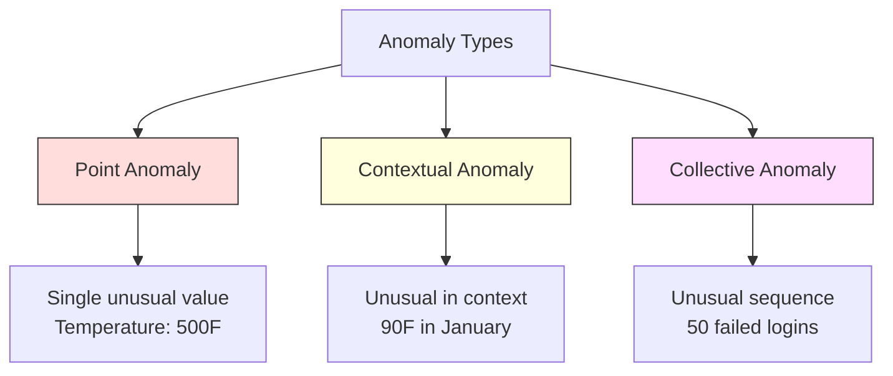
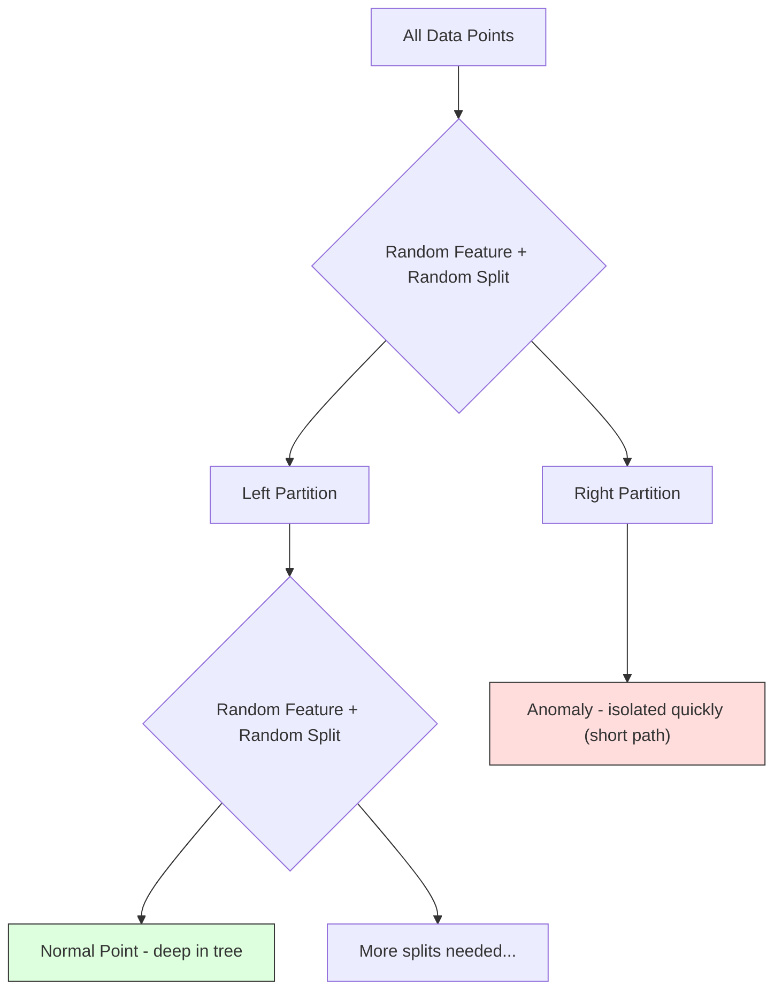
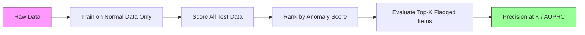

# Detecção de anomalias

> Normal                                                                                                                                                                                                                                                                                                                                                                                                                                                                                                                             

**Type:** Build
**Language:**Python
**Prerequisites:** Phase 2, Lessons 01-09
**Time:** ~75 minutes

## Objectivo de aprendizagem

- Desde zero para conseguir o Z-score, o IQR e o isolamento
- 区分点、文脈和集体异常,并为每种选择合适的检测方法, em que cada ponto de distinção e as anomalias coletivas são selecionadas para cada método de análise adequado.
- Explicação de por que a detecção de anomalias é expressa em dados normais, e não em anomalias.
- Comparar a detecção de anomalias não supervisionadas com a classificação supervisionada, e avaliar a nova anomalia

## 问题

Um cartão de crédito em 2 horas da tarde em Nova York foi usado, em seguida, em 2 horas da tarde em Tóquio foi usado. Um sensor de fábrica leu 150 graus, enquanto o alcance normal era de 80 a 120. Um servidor enviava 50.000 solicitações por segundo, enquanto o valor médio diário era de 200.

Estas são anomalias. Encontrá-las é importante. Fraude causará perda de bilhões de dólares.

O desafio consiste em: Você raramente possui anomalia com etiqueta Exemplos. A fraude apenas ocupa 0,1% das transações.

Anomalias Detecção Reverso transformou o problema. Não aprenda o que é anormal, mas aprenda o que é normal. Qualquer desvio de normal é suspeito.

## 概念

### Tipo de anomalias

Não são todas as anomalias iguais:

- **Point anomalies.**单个数据点无论上下文如何都非常异常──500 度的温度读数──一个通常消费 $50 的账户发生 $50.000 de transações.
- **Contextual anomalies.**某数据点在给定下文下异常──90° no verão é normal, no inverno é anormal──同一个值,不同上下文──
- **Collective anomalies.**Uma série de dados como um todo é anormal, mesmo que cada ponto de dados individual possa ser normal.

O método de análise de anomalias de pontos é o método de análise de anomalias de contexto.



### Não supervisionado

Na Classificação Padrão, você possui duas categorias de etiquetas. Na Detecção de Anomalia, normalmente se encontra uma das três situações seguintes:

1. **Fully unsupervised.**Não há nenhuma etiqueta. Você está em todo o sistema de detecção de dados, e espera que as anomalias sejam raras, não contaminando o modelo "normal".
2. **Semi-supervised.**Você tem um conjunto de dados que só contém dados normais. Você se encaixa neste conjunto de dados e então se encaixa em todos os outros dados. Se possível, é a configuração mais forte.
3. **Weakly supervised.**Você tem uma pequena quantidade de anomalias de etiquetas. Vai usá-las para avaliar, em vez de treinar. Primeiro, realizar treinamento sem supervisão, e depois medir precisão/recolha no conjunto de etiquetas.

关键洞见:Detecção de Anomalia e Classificação Há diferenças de natureza. Você está construindo uma distribuição de dados normais, em vez de aprender a fronteira de decisão entre duas categorias.

### Supervisão vs Não Supervisão:权衡

Se realmente houver anomalias de etiqueta, devemos usá-las para treinar a Classificação Supervisionada, ou apenas para avaliar a detecção não supervisionada?

**Supervised（当作 Classification 处理）：**
- Pode capturar a anomalia que já viu
- Tipo de anomalia conhecida com maior precisão
- Vai-se perder completamente a anomalia nova .
- Quando surgem novas anomalias, é necessário re-treinar.
- 需要足够多的异常示例(normalmente muito pouco)

**Unsupervised（对 normal 建模，标记偏离项）：**
- 能捕捉任何偏离正常的情况, incluindo o tipo de romance
- Não precisa de anomalias
- taxa de falsos positivos 更高(并非所有不寻常 都是坏事)
- Para a mudança de distribuição mais robusta

 na prática, o melhor sistema  combina dois: detecção não supervisionada  obter ampla cobertura, modelos supervisionados  processar anomalias de alta prioridade conhecidas   tipo,并让人工审查模糊案例──

### Z-Score 方法

O método mais simples é calcular a média e a desviação padrão de cada característica.

```text
z_score = (x - mean) / std
anomaly if |z_score| > threshold
```

默认 threshold is 3.0(Para a distribuição gaussiana, 99,7% dos dados normais 落在 3 个标准偏差范围内) ⋅

**优点：**简单――快速――可解释("Este valor a distância da normal tem 4,5 desvios padrão")

**缺点：**假设数据服从正常分布──对训练数据中的异常值 敏感(异常值 会移动 mean 并增大 std,使它们更难被检测出来)──在多模分布上失效──

**适用场景：**Data grande    monitor                                                                                                                                                                                                                                                                                                                                                                                                                                                                                                                        

**失效场景：**Dois locais de trabalho têm diferentes níveis de temperatura) DATA distorcida) DATA MUITO RARIO DE US$ 1000 no volume de transações (mas não é anômalo) DATA DE OUTLERES CONTENDOU

### IQR 方法

Porém, a diferença entre os valores de Z e de Z é mais forte.

```
Q1 = 25th percentile
Q3 = 75th percentile
IQR = Q3 - Q1
lower_bound = Q1 - factor * IQR
upper_bound = Q3 + factor * IQR
anomaly if x < lower_bound or x > upper_bound
```

O fator de reconhecimento é 1,5:

**优点：**Para valores fora de linha robustos (%) não são influenciados pelo extremo extremo ().

**缺点：**                                                                                                                                                                                                                                                              

**实践说明：**O coeficiente de inteligência intelectual (QI) é de 1,5 fator para os bigodes de um plano de caixa de resposta.

### Floresta de isolamento

关键洞见:anomalias Número de números são poucos e com população diferentes. Quando os dados são particionados aleatoriamente, as anomalias são mais fáceis de serem separadas, elas só precisam de menos divisões aleatórias para poderem se separar do resto dos dados.



**工作方式：**
1. Construir muitas árvores aleatórias (uma floresta isolada)
2. Em cada nó, escolha um recurso, e escolha um valor dividido entre min e max do recurso
3. Continuar dividido, até que cada ponto seja separado.
4. Anomalias em todas as árvores acima com comprimentos médios de caminho mais curtos

**为什么有效：**Pontos normais  localizadas em regiões densas. Precisa de muitas divisões aleatórias                                                                                                                                                                                                                                                                                                                                                                                                                                                                                                        

Pontuação Anomaly baseada no comprimento médio de caminho de todas as árvores, não usando o árvore de busca binária aleatória para normalização:

```
score(x) = 2^(-average_path_length(x) / c(n))
```

Entre eles `c(n)`É o comprimento esperado de uma amostra. Escorto 接近 1 表示异常──Score 接近 0.5 表示正常──Score 接近 0 表示非常正常(位于密集集深处)。

**优点：**没有分布假设──适用于高尺寸──扩展性好(由于每棵树使用子样本,所以相对于样本大小是子线性的)──处理混合特征类型──

**缺点：**難以處理密集區中的異常 (deficiências de mascaragem) 当许多特征无关乎意义 时,random splitting 效果较差──

**关键 hyperparameters：**
- `n_estimators`Árvores: Número de árvores: 100, normalmente suficiente. Mais árvores:
- `max_samples`A sub-sampulação é a razão da isolamento florestal  rapidez, cada árvore só vê uma pequena parte dos dados 
- `contamination`: 预期 anomalies 比例── apenas para definir um limiar── não afeta as pontuações 本身──

### Factor local de desvalorização (LOF)

LOF comparará a densidade local em torno de um determinado ponto com a densidade de seus vizinhos em torno de um ponto, uma região esparsa, mas em regiões densas, o ponto de cerimônia é anômalo.

**工作方式：**
1. Para cada ponto, encontrar seus quantos vizinhos mais próximos
2. 计算 local de acessibilidade densidade (neighborhood has多密)
3. Comparar a densidade de cada ponto com a densidade de seus vizinhos
4. Se a densidade de um ponto é menor que a de seus vizinhos, é mais estranho.

**LOF score：**
- LOF  aproximando-se de 1,0 Expressão de densidade com os vizinhos
- LOF é maior que 1.0 Expressão densidade  baixa que vizinhos (((可能異常)
- LOF 远大于 1.0 (por exemplo, 2.0+) significa densidade 显著更低 (significativamente menor)

"local" 部分至关重要── considerar um conjunto de dados de dois aglomerados: um contém 1000 pontos de aglomerado denso, outro contém 50 pontos de aglomerado espartito── um ponto de aglomerado de borda não é um local incomum, ele tem 50 vizinhos── mas se seus vizinhos diretos forem mais densos que ele, então ele é localmente incomum──LOF 捕捉到全球方法会漏掉这种微微差──

**优点：**检测 local anomalies ((( em seus vizinhos domínios de pontos anormais, mesmo que não sejam totalmente anormais) ⋅ Aplica-se a aglomerados de diferentes densidades ⋅

**缺点：**Em grandes conjuntos de dados, a implementação é lenta (n^2):

### Em relação

| Method | Assumptions | Speed | Handles High Dims | Detects Local Anomalies |
|--------|------------|-------|-------------------|------------------------|
| Z-score | Normal distribution | 非常快 | 是（逐 feature） | 否 |
| IQR | 无（逐 feature） | 非常快 | 是（逐 feature） | 否 |
| Isolation Forest | 无 | 快 | 是 | 部分 |
| LOF | Distance 有意义 | 慢 | 较差 | 是 |

###  avalia desafios

 avaliação de detectores de anomalias em comparação com os classificadores de avaliação

- **Extreme class imbalance.**Se as anomalias forem 0,1%, o "normal" será preenchido em todos os conteúdos.
- **AUROC 具有误导性。**Em grave desequilíbrio, mesmo que o modelo em prazos reais, a maioria das anomalias desaparecem, o Auróci também pode parecer errado.
- **更好的 metrics：**Precision@k(top k 被标记项中的多少是真实异常) 、AUPRC(precision-recall curve 下面积),以及在固定假正率 下的回忆──



### O canal de detecção de anomalias

实践中,Detecção de Anomalia  seguir o seguinte fluxo de trabalho:

1. **收集 baseline data.**Idealmente, escolher um período de anomalias que você sabe não há.
2. **Feature engineering.**Características primitivas, além de características derivadas, estatísticas de rotação, características de tempo, relações)
3. **训练 detector.**Em dados de base, é possível ver os modelos de aprendizagem "normal".
4. **对新数据打分.**Cada nova observação obtém uma pontuação de anomalia.
5. **Threshold selection.**选择 score cut-off──这是业务决策:更高门意味着虚假报警更少,但错过异常更多──
6. **Alert and investigate.**Pontos de entrada de revisão artificial ou resposta automática.
7. **Feedback collection.**记录被标记项是真实异常也是虚假警报―― use these data assessment detector,并随时间调整门──

O pipeline 永遠不是" Done"──Datos distribuições 会漂移, novas anomalias 类型會出現, limiares também precisam ser ajustados──把 Anomaly Detection 當作一個持續運行的系統,而不是一次性模型──


```figure
f3-anomaly-fence
```

## Construí-lo

`code/anomaly_detection.py`O código do meio realizou o Z-score, o IQR e a Floresta de Isolamento.

### Detector de pontuação Z

```python
def zscore_detect(X, threshold=3.0):
    mean = X.mean(axis=0)
    std = X.std(axis=0)
    std[std == 0] = 1.0
    z = np.abs((X - mean) / std)
    return z.max(axis=1) > threshold
```

简单且向量化──如果任何特征 超过门值,就标记该点──

### Detetor de RIC

```python
def iqr_detect(X, factor=1.5):
    q1 = np.percentile(X, 25, axis=0)
    q3 = np.percentile(X, 75, axis=0)
    iqr = q3 - q1
    iqr[iqr == 0] = 1.0
    lower = q1 - factor * iqr
    upper = q3 + factor * iqr
    outside = (X < lower) | (X > upper)
    return outside.any(axis=1)
```

### Desde zero realçar o isolamento florestal

Desde zero realizadas versões vão construir árvores de isolamento, fazer partição aleatória para o espaço de recursos:

```python
class IsolationTree:
    def __init__(self, max_depth):
        self.max_depth = max_depth

    def fit(self, X, depth=0):
        n, p = X.shape
        if depth >= self.max_depth or n <= 1:
            self.is_leaf = True
            self.size = n
            return self
        self.is_leaf = False
        self.feature = np.random.randint(p)
        x_min = X[:, self.feature].min()
        x_max = X[:, self.feature].max()
        if x_min == x_max:
            self.is_leaf = True
            self.size = n
            return self
        self.threshold = np.random.uniform(x_min, x_max)
        left_mask = X[:, self.feature] < self.threshold
        self.left = IsolationTree(self.max_depth).fit(X[left_mask], depth + 1)
        self.right = IsolationTree(self.max_depth).fit(X[~left_mask], depth + 1)
        return self
```

O distanciamento de um ponto requer o comprimento do caminho para determinar a sua pontuação de anomalia.

`IsolationForest`classe 包装了多树木:

```python
class IsolationForest:
    def __init__(self, n_estimators=100, max_samples=256, seed=42):
        self.n_estimators = n_estimators
        self.max_samples = max_samples

    def fit(self, X):
        sample_size = min(self.max_samples, X.shape[0])
        max_depth = int(np.ceil(np.log2(sample_size)))
        for _ in range(self.n_estimators):
            idx = rng.choice(X.shape[0], size=sample_size, replace=False)
            tree = IsolationTree(max_depth=max_depth)
            tree.fit(X[idx])
            self.trees.append(tree)

    def anomaly_score(self, X):
        avg_path = average path length across all trees
        scores = 2.0 ** (-avg_path / c(max_samples))
        return scores
```

Fator de normalização `c(n)`Está em contendo n 个 elementos de árvore de busca binária Uma vez não bem sucedida de busca de longo caminho esperado. É igual a `2 * H(n-1) - 2*(n-1)/n`, entre os `H`É um número armônico. Esta normalização garante a comparação de pontuações entre diferentes conjuntos de dados.

### Demo

代码生成多个测试场景:

1. **Single cluster with outliers.**Um aglomerado Gaussiano 2D, e inserido em uma posição distante do centro de anomalias. Todos os métodos aqui devem ser eficazes.
2. **Multimodal data.**Três aglomerados de diferentes tamanhos e densidades.
3. **High-dimensional data.**50 características, mas anomalias apenas em 5 delas.

Cada demo usa precisão, recall, F1 e Precision.

## Use-o

Utilize sklearn(使用库实现, em vez de desde zero实现):

```python
from sklearn.ensemble import IsolationForest
from sklearn.neighbors import LocalOutlierFactor

iso = IsolationForest(n_estimators=100, contamination=0.05, random_state=42)
iso.fit(X_train)
predictions = iso.predict(X_test)

lof = LocalOutlierFactor(n_neighbors=20, contamination=0.05, novelty=True)
lof.fit(X_train)
predictions = lof.predict(X_test)
```

Atenção,`contamination` Setar anomalias de previsão  Por exemplo,  Setar correctamente  É importante, muito baixo irá perder anomalias, muito alto irá produzir falsos alarmes

`anomaly_detection.py`O código-fonte do meio é comparado com a versão de zero implementação em dados iguais.

### Parâmetro de Contaminação

Sklern 中的 `contamination`Parâmetro decide como se transformar em prazos de previsões binárias. Não vai mudar as notas de nível inferior.

```python
iso_5 = IsolationForest(contamination=0.05)
iso_10 = IsolationForest(contamination=0.10)
```

Os dois têm resultados de anomalia iguais.`iso_5`标记 top 5%, enquanto `iso_10`标记 top 10%──如果不知道真实异常率(通常不知道),将污染 设置为"auto",并直接使用原始分点──根据虚假积极与虚假负的成本权衡 设置自己的门──

### Mudanças de controlo de segurança

另一个值得了解的无监督异常检测器──One-Class SVM 会在高维特征空间中围绕正常数据 拟合一个边界(使用内核技巧)──

```python
from sklearn.svm import OneClassSVM

oc_svm = OneClassSVM(kernel="rbf", gamma="auto", nu=0.05)
oc_svm.fit(X_train)
predictions = oc_svm.predict(X_test)
```

`nu`Parâmetro 近似表示异常的比例──One-Class SVM 在小到中等数据集上效果很好,但无法扩展到非常大的数据(kernel matrix 会平方增长)──

### Autoencoder abordagem(预览)

Autoencoder é o aprendizado de compressão e reedificação de dados da rede neural. Em dados normais, as anomalias terão maior número de erros de reconstrução, pois a rede apenas aprendeu a reedificar padrões normais.

Esta será a fase 3 (Deep Learning) da introdução, mas o princípio é o mesmo:

### Ensemble Detecção de Anomalias

Assim como os métodos do conjunto, irá melhorar a Classificação (Lessão 11) , a combinação de vários detectores de anomalias também irá melhorar os efeitos de detecção.

1. 运行多个探测器(Z-score、IQR、Isolation Forest、LOF)
2. Normalizar as pontuações de cada detector até [0, 1]
3. Para pontuações normalizadas                                                                                                                                                                                                                                                                                                                                                                                                                                                                                                                       
4. 标记平均分高于门 的点

Isso reduz os falsos positivos, pois diferentes métodos têm diferentes modos de falha.

Os conjuntos mais complexos serão atribuídos o peso de cada detector de acordo com a estimativa de confiabilidade (se houver um conjunto de validação de anomalias conhecidas, pode ser medido)

### 生产环境考虑

1. **Threshold drift.**随着数据分布 漂移, fixação do limiar 会过时――监控异常分的分布,并定期调整――
2. **Alert fatigue.**Alarmes falsos 太多时, operadores 会停止关注──先使用较高门
3. **Ensemble approach.**Em ambiente de produção, a combinação de vários detectores. Apenas em vários métodos se considera que um ponto é anormal e é o que o marca. Isso reduz significativamente os falsos positivos.
4. **Feature engineering.**Fonte: "Fonte: "Fonte: "Fonte: "Fonte: "Fonte: "Fonte: "Fonte: "Fonte: "Fonte: "Fonte: "Fonte: "Fonte: "Fonte: "Fonte: "Fonte: "Fonte: "Fonte: "Fonte: "Fonte: "Fonte: "Fonte: "Fonte: "Fonte: "Fonte: "Fonte: "Fonte: "Fonte: "Fonte: "Fonte: "Fonte: "Fonte: "Fonte: "Fonte: "Fonte: "Fonte: "Fonte: "Fonte: "Fonte: "Fonte: "Fonte: "Fonte: "Fonte: "Fonte: "Fonte: "Fonte: "Fonte: "Fonte: "Fonte: "Fonte: "Fonte: "Fonte: "Fonte: "Fonte: "Fonte: "Fonte: "Fonte: "Fonte: "Fonte: "Fonte: "Fonte: "Fonte: "Fonte: "Fonte: "Fonte: "Fonte: "Fonte: "Fonte: "Fonte: "Fonte: "Fonte: "Fonte: "Fonte: "Fonte: "Fonte: "Fonte: "Fonte: "Fonte: "Fonte: "Fonte: "Fonte: "Fonte: "Fonte: "Fonte: "Fonte: "Fonte: "Fonte: "Fute: "Fonte: "Fute: "Fute: "Fute: "Fute: "Fute: "Fute: "Fute: "Fute: "Fute: "Fute: "Fute: "Fute: "Fute: "Fute: "Fute: "Fute: "Fute: "Fute" é "Fute") "Fute: "Fute" é" é" é" é" é "
5. **Feedback loop.**Quando os operadores  investigarem os dados marcados e os confirmam ou rejeitam, estes sistemas de entrada  serão utilizados para avaliar e melhorar os detectores 

## Entrega-o

本课产出:
- `outputs/skill-anomaly-detector.md`-- uma habilidade de decisão para escolher um detector de adequação
- `code/anomaly_detection.py`-- desde zero realização de Z-score、IQR e isolamento floresta, e comparado com sklearn

### 选择 Prazo

A pontuação anómala é o valor continual. Você precisa de um limiar para tomar decisões binárias.

考虑两个场景:
- **Fraud detection.**漏掉欺诈代价很高(拒付、客户信任) ――Costos de falsos alarmes são 5 分钟―― será um limiar 设低以捕获更多欺诈,并接受更多虚假警报――
- **Equipment maintenance.**Falso alarme significa que uma vez não é necessário parar, custo para $50,000。missed failure 意味着 $500 mil de construções.

Em dois casos, o limite ideal depende da proporção de custos entre falsos positivos e falsos negativos.

###  expandir para o ambiente de produção

对于生产环境中的实时异常检测:

1. **Batch training, online scoring.**定期(每天、每周) em dados normais de curto prazo 上训练模型── cada nova observação até chegar a fazer uma pontuação──
2. **Feature computation must match.**Se você estiver usando as estatísticas de rolagem de 30 dias durante o treino, então você precisa de 30 dias de história para obter novas características de observação.
3. **Score distribution monitoring.**Seguir as pontuações de anomalia dependendo do tempo  Se a pontuação média subir, os dados estão mudando, o modelo  já passou 
4. **Explainability.**Quando você marcar uma anomalia 时,说明原因──Z-score:"Figuração X é superior ao normal 高 4.2 个标准偏差──" Isolamento Forest:"这个点平均在 3.1 次分中被隔离了(normal points 需要 8.5 次) 』"

## 练习

1. **Threshold tuning.**Usar prazos de 1.0 a 5.0                                                                                                                                                                                                                                                                                                                                                                                                                                                                                                                     

2. **Multivariate anomalies.**                                                                                                                                                                                                                                                                                                                                                                                                                                                                                                                             

3. **从零实现 LOF.**Utilize k-vizinhos mais próximos  realçar Local Outlier Factor                                                                                                                                                                                                                                                                                                                                                                                                                                                                                                             

4. **Streaming Anomaly Detection.**Modificar o detector de pontuação Z, fazê-lo funcionar em configuração de streaming: com o novo ponto de chegada e a nova média de execução e variação (Welford's online algorithm)

5. **Real-world evaluation.**select a data collection of known anomalies (por exemplo, fraude de cartão de crédito de Kaggle)  use precision@100、precision@500 和 AUPRC 评估全部四种方法── quais são os melhores métodos?

## 关键术语

| Term | 人们通常怎么说 | 它实际意味着什么 |
|------|----------------|----------------------|
| Anomaly | "Outlier，异常点" | 一个明显偏离 normal data 预期模式的数据点 |
| Point anomaly | "单个奇怪的值" | 一个无论上下文如何都异常的单独 observation |
| Contextual anomaly | "normal 值，错误上下文" | 一个在给定上下文（时间、位置等）下异常、但在另一个上下文中可能 normal 的 observation |
| Isolation Forest | "用 random splits 找 outliers" | 一种 random trees 的 ensemble，它能用比 normal points 更少的 splits 隔离 anomalies |
| Local Outlier Factor | "把 density 和 neighbors 比较" | 一种标记 local density 明显低于其 neighbors density 的点的方法 |
| Z-score | "距离 mean 的 standard deviations 数" | (x - mean) / std，用 standard deviation 为单位衡量某个点距离中心有多远 |
| IQR | "Interquartile range" | Q3 - Q1，衡量数据中间 50% 的 spread，用于 robust outlier detection |
| Contamination | "预期 anomalies 比例" | 一个 hyperparameter，用于告诉 detector 应该将数据中多大比例标记为 anomalous |
| Precision@k | "top k flags 中有多少是真的" | 只在 k 个最可疑点上计算的 precision，适用于 imbalanced Anomaly Detection |
| AUPRC | "Precision-recall curve 下的面积" | 一个汇总所有 thresholds 下 precision-recall 表现的 metric，对 imbalanced data 比 AUROC 更好 |

## 延伸阅读

- [Liu et al., Isolation Forest (2008)](https://cs.nju.edu.cn/zhouzh/zhouzh.files/publication/icdm08b.pdf)-- 原始 Isolamento Floresta 论文
- [Breunig et al., LOF: Identifying Density-Based Local Outliers (2000)](https://dl.acm.org/doi/10.1145/342009.335388)-- 原始 LOF 论文
- [scikit-learn Outlier Detection docs](https://scikit-learn.org/stable/modules/outlier_detection.html)-- Todos os detectores de anomalias de venda
- [Chandola et al., Anomaly Detection: A Survey (2009)](https://dl.acm.org/doi/10.1145/1541880.1541882)-- Análise de detecção de anomalias
- [Goldstein and Uchida, A Comparative Evaluation of Unsupervised Anomaly Detection Algorithms (2016)](https://journals.plos.org/plosone/article?id=10.1371/journal.pone.0152173)-- Comparar as evidências práticas de 10 métodos em um conjunto de dados real
