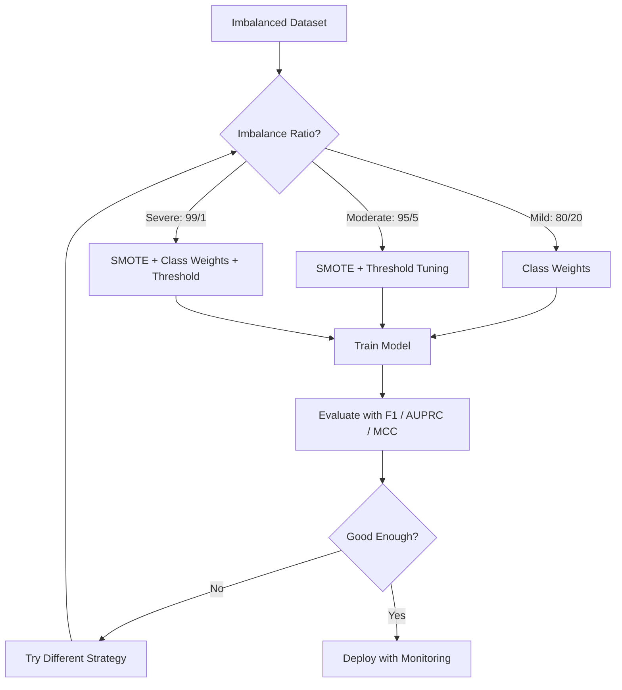
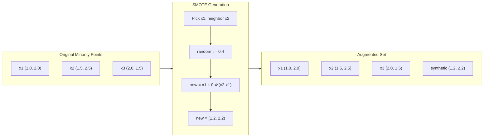
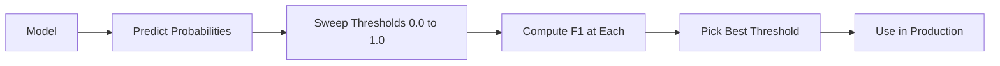
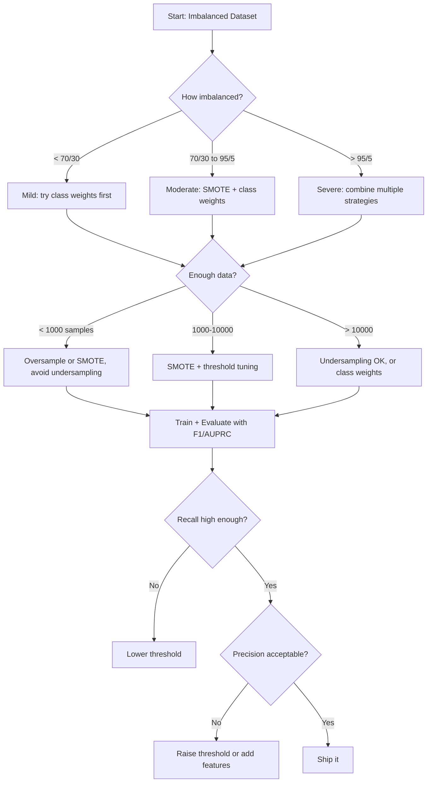

# 处理不平衡数据

> Quando os dados têm 99% de tudo, a precisão é uma mentira.

**类型：**Construir
**语言：**Python
**先修要求：**Fase 2, lições 01-09 (especialmente avaliação indicador)
**时间：**Cerca de 90 minutos

## Objectivo de aprendizagem

- Desde zero realizando SMOTE,并 explicando que a sobre-sampulagem sintética é diferente da cópia de dados
- Utilize F1、AUPRC 和 Matthews Correlation Coefficient  avalia não equilibrar classificador, em vez de usar precisão
- Comparar a ponderação de classe, o limite de sintonia e a estratégia de re-estampagem,并为给定的不平衡比例选择合适方法
- Construir um pipeline de dados incompletos, combinando SMOTE、pesos de classe e otimização de limiar

## 问题

Você construiu um modelo de teste de fraude. Ele atingiu 99,9% de precisão. Você está muito feliz.

Não é um erro. Quando apenas 0,1% das transações são fraudulentas, é uma prática racional. O modelo aprendeu que: sempre adivinhar a classe da maioria pode minimizar o erro geral. É tecnicamente correto, mas totalmente inútil.

Qualquer situação que seja realmente importante Classificação 场景,都会遇到这种情况――疾病诊断:1% 阳性率――网络入侵:0.01% 攻击――制造缺陷:0.5% 缺陷率――垃圾邮件过:20% 垃垃垃邮――流失预测:5% 流失用户――少数群 越重要,往往越稀少――

A precisão falhará, porque trata todas as previsões corretas como iguais. A precisão marca uma transação legal e a precisão de uma fraude, mas a precisão é apenas uma parte da razão pela qual o modelo existe.

## 概念

### Por que a precisão vai falhar

 considerar um conjunto de dados que contém 1000 amostras: 990 negativos, 10 positivos, um modelo de sempre pré-anunciar negativo:

|  | Predicted Positive | Predicted Negative |
|--|---|---|
| Actually Positive | 0 (TP) | 10 (FN) |
| Actually Negative | 0 (FP) | 990 (TN) |

Precuração = (0 + 990) / 1000 = 99,0%

O modelo capturou zero vezes de fraude, zero doenças, zero falhas, mas a precisão mostra 99% e é por isso que a precisão é muito perigosa para os problemas de desequilíbrio.

### Melhor indicador

**Precision**= TP / (TP + FP) ⋅ Em todos os exemplos marcados como positivos, há realmente positivos?

**Recall**= TP / (TP + FN) ⋅ Em todos os exemplos de verdadeiros positivos, nós capturamos quanto?

**F1 Score**= 2 * precisão * recall / (precision + recall) ――调和平均数──相比算术平均数,它会更严厉地惩罚精度和回忆 之间极端不平衡──

**F-beta Score**= (1 + beta^2) * precisão * recall / (beta^2 * precisão + recall) ・・・ quando beta > 1 时, recall 更重要。 quando beta < 1 时, precisão 更重要。 F2 在欺诈检测中很常见(漏掉欺诈比误报更糟) ・・・

**AUPRC**(Área Sob a Curva de Recuperação de Precisão) ―― semelhante a AUC-ROC, mas em relação ao desbalanço de dados tem mais informação── APRC do classificador de azar para a proporção de classe positiva((( Não como ROC, então é 0,5)── isso faz com que as melhorias sejam mais fáceis de ver──

**Matthews Correlation Coefficient**= (TP * TN - FP * FN) / sqrt((TP+FP)(TP+FN)(TN+FP)(TN+FN))。 O alcance é de -1 a +1── apenas quando o modelo em duas categorias apresenta um bom desempenho quando apenas dá uma alta porcentagem── mesmo que a diferença de tamanho das categorias seja grande, também mantenha o equilíbrio──

对于上始终预测负的模型:精度 = 0/0(未定义,通常设为 0),回忆 = 0/10 = 0,F1 = 0,MCC = 0──这些指标正确地识别出该模型无价值──

### Não equilíbrio de dados



### SMOTE: Técnica de extração de amostras de minorias sintéticas

随时过样本会复制现有的少数样本──这能起作用,但有过适合风险,因为模型会反复看到完全相同的点──

SMOTE irá criar novos modelos de minoria sintética, estes modelos parecem razoáveis, mas não são secundários.

1. Para cada menoridade, encontrem-na em outras minorias.
2. 随机选择一个邻居
3. Crie um novo padrão na linha entre x e o vizinho

公式:`new_sample = x + random(0, 1) * (neighbor - x)`

Isso irá criar uma amostra na verdadeira minoria de pontos entre valores, na mesma região do espaço de recursos, em vez de apenas copiar dados já existentes.



### Estratégia de amostragem

**Random Oversampling**A maioria dos participantes é a maioria dos participantes.
- 优点:简单, não há perda de informação
- 缺点: completa repeat vai levar a sobre-adaptado, aumentar o tempo de treinamento

**Random Undersampling**• Mover a maioria de amostras, fazendo com que a sua quantidade corresponda à minoria.
- 优点: training快,简单
- 缺点: Descargar a maioria potencialmente útil dados,

**SMOTE**A criação de uma minoria sintética
- 优点: gerar novos dados, em comparação com o sobre-ampliamento aleatório  reduzir o sobre-aplicado
- 缺点:可能在决策边界 附近创建噪声样本,不考虑多数阶级的分布

| Strategy | Data Changed | Risk | When to Use |
|----------|-------------|------|-------------|
| Oversample | 复制 minority | 过拟合 | 小数据集，中等不平衡 |
| Undersample | 移除 majority | 信息损失 | 大数据集，需要快速训练 |
| SMOTE | 添加 synthetic minority | 边界噪声 | 中等不平衡，有足够 minority 样本用于 k-NN |

### Peso de classe

Em vez de alterar dados, não é como alterar o modelo para o tratamento de erros.

Para um que contém 950 negativos e 50 positivos, as duas divisões são:
- classe negativa 的权重 = n_samples / (2 * n_negativo) = 1000 / (2 * 950) = 0,526
- classe positiva 的权重 = n_samples / (2 * n_positive) = 1000 / (2 * 50) = 10,0

classe positiva  obteve 19 倍权重──误分类 错分类 错分类 错分类 错分类 错分类 错分类 19 负类 模块── modelo é forçado a se preocupar com a classe minoritária──

Em regressão logística, isso modificará a Função de Perda:

```
weighted_loss = -sum(w_i * [y_i * log(p_i) + (1-y_i) * log(1-p_i)])
```

Entre eles, a seleção depende da categoria de amostras.

Pesos de classe em sentido esperado e sobre-amplificação em matemática, mas não criam novos pontos de dados. Isso os faz mais rápidos, evitando o risco de sobre-adaptação de repetidas amostras.

### Apontação do limiar

Mas, 0,5 é arbitrário. Quando a classe está desequilibrada, o valor máximo geralmente deve ser muito baixo.

流程:
1. Treinar um modelo
2. Em conjunto de validação 上获取预测概率
3. De 0,0 a 1,0 valor de análise
4. Em cada valor calculado F1 ((ou indicador de sua escolha)
5. 选择使指标最大的值 (em inglês)



Um modelo pode ser classificado como não-fraudado em um negócio de fraude P (fraud) = 0,15♦ em 0,5, ele será classificado como não-fraudado em 0,10♦ em 0,10♦ em que ele será corretamente capturado.

### Aprendizagem sensível aos custos

Forma generalizada de pesos de classe não é a utilização de custos unificados, mas a distribuição de custos de classe errada específica:

| | Predict Positive | Predict Negative |
|--|---|---|
| Actually Positive | 0 (correct) | C_FN = 100 |
| Actually Negative | C_FP = 1 | 0 (correct) |

漏掉一笔欺诈交易 (FN) 漏掉一笔欺诈交易 (FN) 漏掉一笔欺诈交易 (FN) 漏掉一笔欺诈交易 (FP) 漏掉一笔欺诈交易 (FP) 漏掉一笔欺诈交易 (FP) 漏掉一笔欺诈交易 (FP) 漏掉一笔欺诈交易 (FP) 漏掉一笔欺诈交易 (FP) 漏掉一笔欺诈交易 (FP) 漏掉一笔欺诈交易) 漏掉一笔欺诈交易 (FP) 漏掉一次的成本比一次错报 (FP) 漏掉一次) 漏漏漏交易 (FP) 漏漏漏漏交易 (FP) 漏漏漏漏交易) 漏漏漏漏漏交易 (FP) 漏漏漏漏交易) 漏漏漏漏漏交易 (FP) 漏漏漏漏交易 (FN) 漏漏漏漏交易) 漏漏漏漏漏交易 (FN) 漏漏漏漏漏交易) 漏漏漏漏漏漏漏漏漏漏漏漏漏漏漏漏漏漏漏漏漏漏漏漏漏漏漏漏漏漏漏漏漏漏漏漏漏漏漏漏漏漏漏漏漏漏漏漏漏漏漏漏漏漏漏漏漏漏漏漏漏漏漏漏漏漏漏漏漏漏漏漏漏漏漏漏漏漏漏漏漏漏漏漏漏漏漏漏漏漏漏漏漏漏漏漏漏漏漏漏漏漏漏漏漏漏漏漏漏漏漏漏漏漏漏漏漏漏漏漏漏漏漏漏漏漏漏漏漏漏漏漏漏漏漏漏漏漏漏漏漏漏漏漏漏漏漏漏漏漏漏漏漏漏漏漏漏漏漏漏漏漏漏漏漏漏漏漏漏漏漏漏漏漏漏漏漏漏漏漏漏漏漏漏漏漏漏漏漏漏漏漏漏漏漏漏漏漏漏漏漏漏漏漏漏漏漏漏漏漏漏漏漏漏漏漏漏漏漏漏漏漏漏漏漏漏漏漏漏漏漏漏漏漏漏漏漏漏漏漏漏漏漏漏漏漏漏漏漏漏漏漏漏漏漏漏漏漏漏漏漏漏漏漏漏漏漏漏漏

Quando você pode estimar os custos do mundo real, é a maneira mais básica de fazer isso. O diagnóstico de câncer e uma falha de relatório levam a um exame extra-vivo, o que é um custo completamente diferente.

###                                                                                                                                                                                                                                                                                                                                                                                                                                                                                                                              




```figure
class-imbalance
```

## Construí-lo

### 步骤 1: gerar um conjunto de dados desequilibrado

```python
import numpy as np


def make_imbalanced_data(n_majority=950, n_minority=50, seed=42):
    rng = np.random.RandomState(seed)

    X_maj = rng.randn(n_majority, 2) * 1.0 + np.array([0.0, 0.0])
    X_min = rng.randn(n_minority, 2) * 0.8 + np.array([2.5, 2.5])

    X = np.vstack([X_maj, X_min])
    y = np.concatenate([np.zeros(n_majority), np.ones(n_minority)])

    shuffle_idx = rng.permutation(len(y))
    return X[shuffle_idx], y[shuffle_idx]
```

### 步骤 2: desde zero a realização do SMOTE

```python
def euclidean_distance(a, b):
    return np.sqrt(np.sum((a - b) ** 2))


def find_k_neighbors(X, idx, k):
    distances = []
    for i in range(len(X)):
        if i == idx:
            continue
        d = euclidean_distance(X[idx], X[i])
        distances.append((i, d))
    distances.sort(key=lambda x: x[1])
    return [d[0] for d in distances[:k]]


def smote(X_minority, k=5, n_synthetic=100, seed=42):
    rng = np.random.RandomState(seed)
    n_samples = len(X_minority)
    k = min(k, n_samples - 1)
    synthetic = []

    for _ in range(n_synthetic):
        idx = rng.randint(0, n_samples)
        neighbors = find_k_neighbors(X_minority, idx, k)
        neighbor_idx = neighbors[rng.randint(0, len(neighbors))]
        t = rng.random()
        new_point = X_minority[idx] + t * (X_minority[neighbor_idx] - X_minority[idx])
        synthetic.append(new_point)

    return np.array(synthetic)
```

### 步骤 3: Otrasampulação aleatória e sub-sampulação

```python
def random_oversample(X, y, seed=42):
    rng = np.random.RandomState(seed)
    classes, counts = np.unique(y, return_counts=True)
    max_count = counts.max()

    X_resampled = list(X)
    y_resampled = list(y)

    for cls, count in zip(classes, counts):
        if count < max_count:
            cls_indices = np.where(y == cls)[0]
            n_needed = max_count - count
            chosen = rng.choice(cls_indices, size=n_needed, replace=True)
            X_resampled.extend(X[chosen])
            y_resampled.extend(y[chosen])

    X_out = np.array(X_resampled)
    y_out = np.array(y_resampled)
    shuffle = rng.permutation(len(y_out))
    return X_out[shuffle], y_out[shuffle]


def random_undersample(X, y, seed=42):
    rng = np.random.RandomState(seed)
    classes, counts = np.unique(y, return_counts=True)
    min_count = counts.min()

    X_resampled = []
    y_resampled = []

    for cls in classes:
        cls_indices = np.where(y == cls)[0]
        chosen = rng.choice(cls_indices, size=min_count, replace=False)
        X_resampled.extend(X[chosen])
        y_resampled.extend(y[chosen])

    X_out = np.array(X_resampled)
    y_out = np.array(y_resampled)
    shuffle = rng.permutation(len(y_out))
    return X_out[shuffle], y_out[shuffle]
```

### 步骤 4: Trazer pesos de classe de regressão logística

```python
def sigmoid(z):
    return 1.0 / (1.0 + np.exp(-np.clip(z, -500, 500)))


def logistic_regression_weighted(X, y, weights, lr=0.01, epochs=200):
    n_samples, n_features = X.shape
    w = np.zeros(n_features)
    b = 0.0

    for _ in range(epochs):
        z = X @ w + b
        pred = sigmoid(z)
        error = pred - y
        weighted_error = error * weights

        gradient_w = (X.T @ weighted_error) / n_samples
        gradient_b = np.mean(weighted_error)

        w -= lr * gradient_w
        b -= lr * gradient_b

    return w, b


def compute_class_weights(y):
    classes, counts = np.unique(y, return_counts=True)
    n_samples = len(y)
    n_classes = len(classes)
    weight_map = {}
    for cls, count in zip(classes, counts):
        weight_map[cls] = n_samples / (n_classes * count)
    return np.array([weight_map[yi] for yi in y])
```

### 步骤 5: Ajuste de limiar

```python
def find_optimal_threshold(y_true, y_probs, metric="f1"):
    best_threshold = 0.5
    best_score = -1.0

    for threshold in np.arange(0.05, 0.96, 0.01):
        y_pred = (y_probs >= threshold).astype(int)
        tp = np.sum((y_pred == 1) & (y_true == 1))
        fp = np.sum((y_pred == 1) & (y_true == 0))
        fn = np.sum((y_pred == 0) & (y_true == 1))

        if metric == "f1":
            precision = tp / (tp + fp) if (tp + fp) > 0 else 0.0
            recall = tp / (tp + fn) if (tp + fn) > 0 else 0.0
            score = 2 * precision * recall / (precision + recall) if (precision + recall) > 0 else 0.0
        elif metric == "recall":
            score = tp / (tp + fn) if (tp + fn) > 0 else 0.0
        elif metric == "precision":
            score = tp / (tp + fp) if (tp + fp) > 0 else 0.0

        if score > best_score:
            best_score = score
            best_threshold = threshold

    return best_threshold, best_score
```

### 步骤 6: avaliação de função

```python
def confusion_matrix_values(y_true, y_pred):
    tp = np.sum((y_pred == 1) & (y_true == 1))
    tn = np.sum((y_pred == 0) & (y_true == 0))
    fp = np.sum((y_pred == 1) & (y_true == 0))
    fn = np.sum((y_pred == 0) & (y_true == 1))
    return tp, tn, fp, fn


def compute_metrics(y_true, y_pred):
    tp, tn, fp, fn = confusion_matrix_values(y_true, y_pred)
    accuracy = (tp + tn) / (tp + tn + fp + fn)
    precision = tp / (tp + fp) if (tp + fp) > 0 else 0.0
    recall = tp / (tp + fn) if (tp + fn) > 0 else 0.0
    f1 = 2 * precision * recall / (precision + recall) if (precision + recall) > 0 else 0.0

    denom = np.sqrt(float((tp + fp) * (tp + fn) * (tn + fp) * (tn + fn)))
    mcc = (tp * tn - fp * fn) / denom if denom > 0 else 0.0

    return {
        "accuracy": accuracy,
        "precision": precision,
        "recall": recall,
        "f1": f1,
        "mcc": mcc,
    }
```

### 步骤 7: Comparar todos os métodos

```python
X, y = make_imbalanced_data(950, 50, seed=42)
split = int(0.8 * len(y))
X_train, X_test = X[:split], X[split:]
y_train, y_test = y[:split], y[split:]

# Baseline: no treatment
w_base, b_base = logistic_regression_weighted(
    X_train, y_train, np.ones(len(y_train)), lr=0.1, epochs=300
)
probs_base = sigmoid(X_test @ w_base + b_base)
preds_base = (probs_base >= 0.5).astype(int)

# Oversampled
X_over, y_over = random_oversample(X_train, y_train)
w_over, b_over = logistic_regression_weighted(
    X_over, y_over, np.ones(len(y_over)), lr=0.1, epochs=300
)
preds_over = (sigmoid(X_test @ w_over + b_over) >= 0.5).astype(int)

# SMOTE
minority_mask = y_train == 1
X_minority = X_train[minority_mask]
synthetic = smote(X_minority, k=5, n_synthetic=len(y_train) - 2 * int(minority_mask.sum()))
X_smote = np.vstack([X_train, synthetic])
y_smote = np.concatenate([y_train, np.ones(len(synthetic))])
w_sm, b_sm = logistic_regression_weighted(
    X_smote, y_smote, np.ones(len(y_smote)), lr=0.1, epochs=300
)
preds_smote = (sigmoid(X_test @ w_sm + b_sm) >= 0.5).astype(int)

# Class weights
sample_weights = compute_class_weights(y_train)
w_cw, b_cw = logistic_regression_weighted(
    X_train, y_train, sample_weights, lr=0.1, epochs=300
)
probs_cw = sigmoid(X_test @ w_cw + b_cw)
preds_cw = (probs_cw >= 0.5).astype(int)

# Threshold tuning (tune on held-out validation set, not test set)
probs_val = sigmoid(X_val @ w_cw + b_cw)
best_thresh, best_f1 = find_optimal_threshold(y_val, probs_val, metric="f1")
preds_thresh = (probs_cw >= best_thresh).astype(int)
```

O código-fonte irá executar todos esses conteúdos em um script e imprimir os resultados.

## Use-o

借助小学学习和不平衡学习, estas técnicas são necessárias apenas uma linha:

```python
from sklearn.linear_model import LogisticRegression
from sklearn.metrics import classification_report, f1_score
from sklearn.model_selection import train_test_split
from imblearn.over_sampling import SMOTE
from imblearn.under_sampling import RandomUnderSampler
from imblearn.pipeline import Pipeline

X_train, X_test, y_train, y_test = train_test_split(X, y, stratify=y)

model_weighted = LogisticRegression(class_weight="balanced")
model_weighted.fit(X_train, y_train)
print(classification_report(y_test, model_weighted.predict(X_test)))

smote = SMOTE(random_state=42)
X_resampled, y_resampled = smote.fit_resample(X_train, y_train)
model_smote = LogisticRegression()
model_smote.fit(X_resampled, y_resampled)
print(classification_report(y_test, model_smote.predict(X_test)))

pipeline = Pipeline([
    ("smote", SMOTE()),
    ("model", LogisticRegression(class_weight="balanced")),
])
pipeline.fit(X_train, y_train)
print(classification_report(y_test, pipeline.predict(X_test)))
```

Desde a versão de zero realizado, mostramos claramente que cada tipo de tecnologia tem feito o que é.

## Entrega-o

本课会产出:
- `outputs/skill-imbalanced-data.md`-- ‧ ‧ ‧ ‧ ‧ ‧ ‧ ‧ ‧ ‧ ‧ ‧ ‧ ‧ ‧ ‧ ‧ ‧ ‧ ‧ ‧ ‧ ‧ ‧ ‧ ‧ ‧ ‧ ‧ ‧ ‧ ‧ ‧ ‧ ‧ ‧ ‧ ‧ ‧ ‧ ‧ ‧ ‧ ‧ ‧ ‧ ‧ ‧ ‧ ‧ ‧ ‧ ‧ ‧ ‧ ‧ ‧ ‧ ‧ ‧ ‧ ‧ ‧ ‧ ‧ ‧ ‧ ‧ ‧ ‧ ‧ ‧ ‧ ‧ ‧ ‧ ‧ ‧ ‧ ‧ ‧ ‧ ‧ ‧ ‧ ‧ ‧ ‧ ‧ ‧ ‧ ‧ ‧ ‧ ‧ ‧ ‧ ‧ ‧ ‧ ‧ ‧ ‧ ‧ ‧ ‧ ‧ ‧ ‧ ‧ 

## 练习

1. **Borderline-SMOTE**: Modificar SMOTE 实现, apenas para a minoria próxima ao limite de decisão 点生成合成样本(即那些 k-nearest neighbours contain majority class 样本的点) ⋅ 在类别重叠的数据集上与标准 SMOTE比较结果──

2. **Cost matrix optimization**A partir daí, a empresa desenvolveu um projeto de aprendizagem de custo-sensível, em que a matriz de custos é um parametro.

3. **Threshold calibration**A redução da probabilidade de recall de precisão da curva de recall de precisão da preparação anterior à preparação anterior à preparação anterior à preparação anterior à preparação inicial do modelo não alterará a classificação, mas fará com que a probabilidade seja mais significativa.

4. **Ensemble with balanced bagging**A maioria dos modelos são comparados com modelos individuais de SMOTE.

5. **Imbalance ratio experiment**A partir de agora, a SMOTE pode ser utilizada em diferentes tipos de sistemas de informação, como:

## 关键术语

| Term | What people say | What it actually means |
|------|----------------|----------------------|
| Class imbalance | “一个类别的样本多得多” | 数据集中类别分布显著偏斜，导致模型偏向 majority class |
| SMOTE | “Synthetic oversampling” | 通过在现有 minority 样本及其 k-nearest minority neighbors 之间插值，创建新的 minority 样本 |
| Class weights | “让 rare class 上的错误代价更高” | 用特定类别的权重乘以 Loss Function，使模型对 minority 误分类施加更重惩罚 |
| Threshold tuning | “移动 decision boundary” | 将 Classification 的概率 cutoff 从默认 0.5 改为能优化目标指标的值 |
| Precision-recall tradeoff | “你不能两者兼得” | 降低阈值会抓住更多 positive（更高 recall），但也会标记更多 false positive（更低 precision），反之亦然 |
| AUPRC | “PR curve 下的面积” | 将 precision-recall curve 汇总为一个数字；当类别严重不平衡时，比 AUC-ROC 信息量更大 |
| Matthews Correlation Coefficient | “平衡指标” | 预测标签与真实标签之间的相关性；只有模型在两个类别上都表现良好时才会产生高分 |
| Cost-sensitive learning | “不同错误的代价不同” | 将现实世界中的误分类成本纳入训练目标，使模型优化总成本，而不是错误数量 |
| Random oversampling | “复制 minority” | 重复 minority class 样本以平衡类别数量；简单，但有过拟合到重复点的风险 |

## 延伸阅读

- [SMOTE: Synthetic Minority Over-sampling Technique (Chawla et al., 2002)](https://arxiv.org/abs/1106.1813)-- Origins SMOTE 论文, até hoje ainda é o trabalho mais citado no aprendizado desequilibrado
- [Learning from Imbalanced Data (He & Garcia, 2009)](https://ieeexplore.ieee.org/document/5128907)-- Total abrangente de amostragem, métodos sensíveis ao custo e a nível de algoritmos
- [imbalanced-learn documentation](https://imbalanced-learn.org/stable/)-- Python 库, fornecer SMOTE 变体、subsampling  estratégias e pipeline 集成
- [The Precision-Recall Plot Is More Informative than the ROC Plot (Saito & Rehmsmeier, 2015)](https://journals.plos.org/plosone/article?id=10.1371/journal.pone.0118432)-- Qual é o tempo e por que é que as curvas de PR devem ser usadas em vez de curvas ROC
