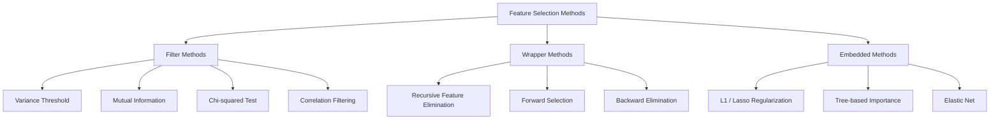
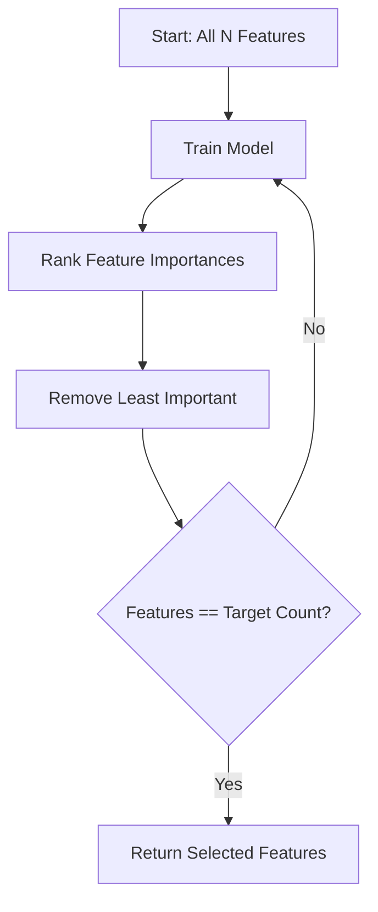
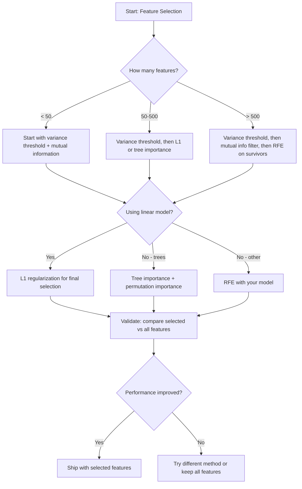

# Seleção de características

> Mais características não são melhores.

**Type:** Build
**Language:**Python
**先修要求：**Fase 2, lições 01-09, 08(特征工程)
**Time:** ~75 分钟

## Objectivo de aprendizagem
- Desde zero implementar métodos de filtro (três anos de diferença, informação mútua, quadrado) e métodos de embalagem (realização de RFE, selecção de futuro)
-  Explicar por que a informação mútua                                                                                                                                                                                                                                                                                                                                                                                                                                                                                                                     
- Comparar a regularização L1 (seleção integrada) com a seleção de embalagens (RFE) (seleção de embalagens),并评估它们的计算权衡
- Construir um pipeline de seleção de recursos de vários métodos combinados, e demonstrar o efeito da generalização em dados mantidos

## 问题
Você tem 500 características. Seu modelo treina muito devagar, está sempre em excesso de peso e ninguém consegue explicar o que aprendeu. Você continua a adicionar mais características, esperando melhorar o desempenho.

É a expressão real da maldição da dimensionalidade. Com as características do número de crescimento, o espaço de características de volume aumentou explosivamente.

A seleção de características é uma solução.

O objetivo não é usar todas as informações disponíveis, mas usar informações corretas.

## 概念
### Seleção de características

Cada tipo de seleção de características 方法都属于以下三类之一:



**Filter methods**Utilize statistics measurements independently for each feature 打分──它们不使用模型──速度快,但会漏掉功能相互作用── utilizadas por diferentes características.

**Wrapper methods** training model  evaluar subconjuntos de recursos utilizam o desempenho do modelo  como porcentagem  resultados melhores, mas o custo é mais alto, pois é necessário repetidamente re-entrenar o modelo

**Embedded methods**Durante o processo de treinamento de modelos, a seleção de características é realizada em um processo de regularização L1.

### Limite de variação

O filtro mais simples é: se uma característica não muda entre as amostras, quase não traz informação.

 Considere uma característica, entre 1000 amostras, há 999 ▌ são 0,0 ▌a sua variação 接近零 ▌não há modelo ▌que possa usá-la para distinguir categorias ▌em remoção ▌

```
variance(x) = mean((x - mean(x))^2)
```

 definir um limite (por exemplo, 0.01) : : : : : : : : : : : : : : : : : : : : : : : : : : : : : : : : : : : : : : : : : : : : : : : : : : : : : : : : : : : : : : : : : : : : : : : : : : : : : : : : : : : : : : : : : : : : : : : : : : : : : : : : : : : : : : : : : : : : : : : : : : : : : : : : : : : : : : : : : : : : : : : : : : : : : : : : : : : : : : : : : : : : : 

Utilizacêncaso: como um passo de pré-processamento anterior a outros métodos, quase a zero custo captura características claramente inúteis.

Limitação: uma característica pode ter alta variação, mas ainda é puro ruído.

### Informações mútuas

Informação mútua  Messa saber o valor da característica X pode reduzir em grande medida a incerteza do objetivo Y 

```
I(X; Y) = sum_x sum_y p(x, y) * log(p(x, y) / (p(x) * p(y)))
```

Se X 和 Y 独立,则 p(x, y) = p(x) * p(y), portanto log 项为零,I(X; Y) = 0。X 能告诉你越多关于Y的信息,相互信息就越高。

Comparado com a correlação, a informação mútua pode capturar relações não-lineares. Uma característica pode ter uma correlação com o alvo é zero, mas a informação mútua é muito alta, pois a relação pode ser quadrática ou periódica.

 Para características contínuas, primeiro discretar 成 bins( baseado em estimativas de histograma)。 o número de bins irá afetar a estimativa resultado:bins 太少会丢失信息,bins 太多会增加噪音──常见选择:sqrt(n) bins 或 Sturges' rule(1 + log2(n))。


### Eliminação de características recorrentes (RFE)

RFE é um método de envoltura.

1. Utilize todas as características  training modelo
2. 按重要性对特征 排名(modelos lineares Use coefficientes, trees Use impureza reduction)
3. 移除最不重要 feature (em inglês)
4. 重复, até que restem características de número esperado



A RFE considerará as interações de características, pois o modelo verá ao mesmo tempo todas as características restantes.

成本:You need to train model N - target 次。 para 500 características、target 为 10 situação, é 490 vezes treinamento。 para modelos caros, isso será muito lento。 pode através de cada passo mover vários recursos para acelerar(por exemplo, 10% de cada rodada de transferência de parte inferior)。

### L1 (Lasso) Regularização

L1 regularização 会把 weights 的绝对值加入 Loss Function:

```
loss = prediction_error + alpha * sum(|w_i|)
```

Características de controlo de parâmetros alfa  被剪枝的激进程度──alpha 越高,越多重量 会精确变成零──

Por que é preciso definir o limite? L1 penalidade em espaço de peso criar uma zona de restrição de forma, mas muito pouco se torna normal.

É assim que a seleção de características embutidas: modelo em treino quais características devem ser ignoradas.

优势: apenas precisa de uma formação,能处理相关特征(选择其中一个并把其他置零),内置于大多数线性模型实现中──

Limite: apenas aplicável a modelos lineares. Não pode captar a importância das características não lineares.

### Importância da característica baseada na árvore

Árvores de decisão  e seus conjuntos  florestas aleatórias  aumento gradiente                                                                                                                                                                                                                                                    

Para os árvores de floresta aleatória:

```
importance(feature_j) = (1/T) * sum over all trees of
    sum over all nodes splitting on feature_j of
        (n_samples * impurity_decrease)
```

Isso dará uma pontuação de importância normalizada para cada característica. Pode automaticamente lidar com relações não lineares e interações de características.

Nota:importância baseada em árvore 会偏向具有许多独特值的特征 (高 Cardinality) △随机 ID 列会显得重要,因为它能完美分每样子──使用 permutation importance 作为智能检查──

### Importância da permutação

Uma espécie de método modelo-agnóstico:

1.                                                                                                                                                                                                                                                                                                                                                                                                                                                                                                                              
2. Para cada característica: como misturar os valores, a performance de medição diminui
3. A baixa é maior, a característica é mais importante.

Se a mistura de uma característica não prejudica o desempenho, o modelo não depende dela. Se o desempenho desmorona, essa característica é muito importante.

Importância da permutação  evitou o viés de cardinalidade da importância baseada em árvores  mas é muito lento: cada característica precisa de uma avaliação completa, e deve ser repetida várias vezes para obter estabilidade 

### Tabela de comparação

| Method | Type | Speed | Nonlinear | Feature Interactions |
|--------|------|-------|-----------|---------------------|
| Variance threshold | Filter | 非常快 | 否 | 否 |
| Mutual information | Filter | 快 | 是 | 否 |
| Correlation filter | Filter | 快 | 否 | 否 |
| RFE | Wrapper | 慢 | 取决于 model | 是 |
| L1 / Lasso | Embedded | 快 | 否（linear） | 否 |
| Tree importance | Embedded | 中等 | 是 | 是 |
| Permutation importance | Model-agnostic | 慢 | 是 | 是 |

### Diagrama de fluxo de decisão




```figure
f3-feature-prune
```

## Construí-lo
### 步骤 1: Gerar dados sintéticos com estrutura de características conhecida

```python
import numpy as np


def make_feature_selection_data(n_samples=500, seed=42):
    rng = np.random.RandomState(seed)

    x1 = rng.randn(n_samples)
    x2 = rng.randn(n_samples)
    x3 = rng.randn(n_samples)
    x4 = x1 + 0.1 * rng.randn(n_samples)
    x5 = x2 + 0.1 * rng.randn(n_samples)

    informative = np.column_stack([x1, x2, x3, x4, x5])

    correlated = np.column_stack([
        x1 * 0.9 + 0.1 * rng.randn(n_samples),
        x2 * 0.8 + 0.2 * rng.randn(n_samples),
        x3 * 0.7 + 0.3 * rng.randn(n_samples),
        x1 * 0.5 + x2 * 0.5 + 0.1 * rng.randn(n_samples),
        x2 * 0.6 + x3 * 0.4 + 0.1 * rng.randn(n_samples),
    ])

    noise = rng.randn(n_samples, 10) * 0.5

    X = np.hstack([informative, correlated, noise])
    y = (2 * x1 - 1.5 * x2 + x3 + 0.5 * rng.randn(n_samples) > 0).astype(int)

    feature_names = (
        [f"info_{i}" for i in range(5)]
        + [f"corr_{i}" for i in range(5)]
        + [f"noise_{i}" for i in range(10)]
    )

    return X, y, feature_names
```

Nós sabemos a verdade fundamental: características 0-4 são informativas, e 3 和 4 são cópias correlacionadas de 0 和 1), características 5-9 com características informativas, relacionadas, características 10-19 são ruído puro.

### 步骤 2: limiar de variação

```python
def variance_threshold(X, threshold=0.01):
    variances = np.var(X, axis=0)
    mask = variances > threshold
    return mask, variances
```

### 步骤 3: Informação mútua (discreta)

```python
def discretize(x, n_bins=10):
    min_val, max_val = x.min(), x.max()
    if max_val == min_val:
        return np.zeros_like(x, dtype=int)
    bin_edges = np.linspace(min_val, max_val, n_bins + 1)
    binned = np.digitize(x, bin_edges[1:-1])
    return binned


def mutual_information(X, y, n_bins=10):
    n_samples, n_features = X.shape
    mi_scores = np.zeros(n_features)

    y_vals, y_counts = np.unique(y, return_counts=True)
    p_y = y_counts / n_samples

    for f in range(n_features):
        x_binned = discretize(X[:, f], n_bins)
        x_vals, x_counts = np.unique(x_binned, return_counts=True)
        p_x = dict(zip(x_vals, x_counts / n_samples))

        mi = 0.0
        for xv in x_vals:
            for yi, yv in enumerate(y_vals):
                joint_mask = (x_binned == xv) & (y == yv)
                p_xy = np.sum(joint_mask) / n_samples
                if p_xy > 0:
                    mi += p_xy * np.log(p_xy / (p_x[xv] * p_y[yi]))
        mi_scores[f] = mi

    return mi_scores
```

### 步骤 4: Eliminação da característica recorrente

```python
def simple_logistic_importance(X, y, lr=0.1, epochs=100):
    n_samples, n_features = X.shape
    w = np.zeros(n_features)
    b = 0.0

    for _ in range(epochs):
        z = X @ w + b
        pred = 1.0 / (1.0 + np.exp(-np.clip(z, -500, 500)))
        error = pred - y
        w -= lr * (X.T @ error) / n_samples
        b -= lr * np.mean(error)

    return w, b


def rfe(X, y, n_features_to_select=5, lr=0.1, epochs=100):
    n_total = X.shape[1]
    remaining = list(range(n_total))
    rankings = np.ones(n_total, dtype=int)
    rank = n_total

    while len(remaining) > n_features_to_select:
        X_subset = X[:, remaining]
        w, _ = simple_logistic_importance(X_subset, y, lr, epochs)
        importances = np.abs(w)

        least_idx = np.argmin(importances)
        original_idx = remaining[least_idx]
        rankings[original_idx] = rank
        rank -= 1
        remaining.pop(least_idx)

    for idx in remaining:
        rankings[idx] = 1

    selected_mask = rankings == 1
    return selected_mask, rankings
```

### 步骤 5: Seleção de características L1

```python
def soft_threshold(w, alpha):
    return np.sign(w) * np.maximum(np.abs(w) - alpha, 0)


def l1_feature_selection(X, y, alpha=0.1, lr=0.01, epochs=500):
    n_samples, n_features = X.shape
    w = np.zeros(n_features)
    b = 0.0

    for _ in range(epochs):
        z = X @ w + b
        pred = 1.0 / (1.0 + np.exp(-np.clip(z, -500, 500)))
        error = pred - y

        gradient_w = (X.T @ error) / n_samples
        gradient_b = np.mean(error)

        w -= lr * gradient_w
        w = soft_threshold(w, lr * alpha)
        b -= lr * gradient_b

    selected_mask = np.abs(w) > 1e-6
    return selected_mask, w
```

### 步骤 6: Importância baseada em árvores (árvore de decisão simples)

```python
def gini_impurity(y):
    if len(y) == 0:
        return 0.0
    classes, counts = np.unique(y, return_counts=True)
    probs = counts / len(y)
    return 1.0 - np.sum(probs ** 2)


def best_split(X, y, feature_idx):
    values = np.unique(X[:, feature_idx])
    if len(values) <= 1:
        return None, -1.0

    best_threshold = None
    best_gain = -1.0
    parent_gini = gini_impurity(y)
    n = len(y)

    for i in range(len(values) - 1):
        threshold = (values[i] + values[i + 1]) / 2.0
        left_mask = X[:, feature_idx] <= threshold
        right_mask = ~left_mask

        n_left = np.sum(left_mask)
        n_right = np.sum(right_mask)

        if n_left == 0 or n_right == 0:
            continue

        gain = parent_gini - (n_left / n) * gini_impurity(y[left_mask]) - (n_right / n) * gini_impurity(y[right_mask])

        if gain > best_gain:
            best_gain = gain
            best_threshold = threshold

    return best_threshold, best_gain


def tree_importance(X, y, n_trees=50, max_depth=5, seed=42):
    rng = np.random.RandomState(seed)
    n_samples, n_features = X.shape
    importances = np.zeros(n_features)

    for _ in range(n_trees):
        sample_idx = rng.choice(n_samples, size=n_samples, replace=True)
        feature_subset = rng.choice(n_features, size=max(1, int(np.sqrt(n_features))), replace=False)

        X_boot = X[sample_idx]
        y_boot = y[sample_idx]

        tree_imp = _build_tree_importance(X_boot, y_boot, feature_subset, max_depth)
        importances += tree_imp

    total = importances.sum()
    if total > 0:
        importances /= total

    return importances


def _build_tree_importance(X, y, feature_subset, max_depth, depth=0):
    n_features = X.shape[1]
    importances = np.zeros(n_features)

    if depth >= max_depth or len(np.unique(y)) <= 1 or len(y) < 4:
        return importances

    best_feature = None
    best_threshold = None
    best_gain = -1.0

    for f in feature_subset:
        threshold, gain = best_split(X, y, f)
        if gain > best_gain:
            best_gain = gain
            best_feature = f
            best_threshold = threshold

    if best_feature is None or best_gain <= 0:
        return importances

    importances[best_feature] += best_gain * len(y)

    left_mask = X[:, best_feature] <= best_threshold
    right_mask = ~left_mask

    importances += _build_tree_importance(X[left_mask], y[left_mask], feature_subset, max_depth, depth + 1)
    importances += _build_tree_importance(X[right_mask], y[right_mask], feature_subset, max_depth, depth + 1)

    return importances
```

### 步骤 7: Execute todos os métodos e compare

O código-fonte irá funcionar em um mesmo conjunto de dados sintéticos, e imprimir uma tabela de comparação, mostrando quais características cada método escolheu.

## Use-o
Utilize scikit-learn 时, seleção de recursos  já em linha de produção 中:

```python
from sklearn.feature_selection import (
    VarianceThreshold,
    mutual_info_classif,
    RFE,
    SelectFromModel,
)
from sklearn.linear_model import Lasso, LogisticRegression
from sklearn.ensemble import RandomForestClassifier

vt = VarianceThreshold(threshold=0.01)
X_filtered = vt.fit_transform(X)

mi_scores = mutual_info_classif(X, y)
top_k = np.argsort(mi_scores)[-10:]

rfe_selector = RFE(LogisticRegression(), n_features_to_select=10)
rfe_selector.fit(X, y)
X_rfe = rfe_selector.transform(X)

lasso_selector = SelectFromModel(Lasso(alpha=0.01))
lasso_selector.fit(X, y)
X_lasso = lasso_selector.transform(X)

rf = RandomForestClassifier(n_estimators=100)
rf.fit(X, y)
importances = rf.feature_importances_
```

Estes desde o zero  realizar precisamente mostrou cada método dentro do que acontece ∙∙`var(X, axis=0)`Não aplicam máscaras. Informação mútua está na tabela de contingência.

A versão de sklearn  aumentou a robustez, por exemplo, mutual_info_classif, usando a estimativa de densidade k-NN, e não a integração de tubo (binning) 、velocidade (C 实现) 、 e integrar os canais de transporte.

## Entrega-o
本课产出:
- `outputs/skill-feature-selector.md`-- Usando para escolher o método de seleção de características correto de árvore de decisão de referência rápida

## 练习
1. **Forward selection**A redução da velocidade de transmissão é um processo de transmissão de dados que permite a obtenção de resultados de RFE.

2. **Stability selection**A seleção de recursos L1 é estavel. Comparar com a seleção L1 de uma única vez, qual é mais confiável?

3. **Multicollinearity detection**A matriz de correlação de todas as características: calcular. Realizar uma função, um limite de correlação determinado, por exemplo 0,9, de cada par de características altamente correlacionadas, remover uma característica, reter informações mútuas com o alvo, e ainda mais o alto.

4. **Feature selection pipeline**O que é o problema? O que é que é o problema? O que é que é o problema? O que é que é o problema?

5. **Permutation importance from scratch**A primeira é a seguinte:: realçar a importância da permutação.

## 关键术语
| Term | What people say | What it actually means |
|------|----------------|----------------------|
| Filter method | “独立为 features 打分” | 一种 feature selection 方法，不训练 model，而是使用统计度量对 features 排名，并孤立地评估每个 feature |
| Wrapper method | “用 model 挑 features” | 一种 feature selection 方法，通过训练 model 并使用其 performance 作为 selection criterion 来评估 feature subsets |
| Embedded method | “model 在训练期间选择 features” | 作为 model fitting 一部分发生的 feature selection，例如 L1 regularization 会把 weights 推向零 |
| Mutual information | “一个变量能告诉你关于另一个变量的多少信息” | 给定 X 的知识后，关于 Y 的不确定性减少量的度量，能够捕捉线性和非线性 dependencies |
| Recursive Feature Elimination | “训练、排名、剪枝、重复” | 一种迭代式 wrapper method，会训练 model、移除最不重要的 feature(s)，并重复直到达到 target count |
| L1 / Lasso regularization | “会消灭 features 的 penalty” | 将 weight 绝对值之和加入 Loss Function，这会把不重要 feature 的 weights 推到精确为零 |
| Variance threshold | “移除 constant features” | 丢弃在 samples 之间 variance 低于指定 threshold 的 features，过滤掉不携带信息的 features |
| Feature importance | “哪些 features 最重要” | 表示每个 feature 对 model predictions 贡献程度的分数，可由 split gains（trees）或 coefficient magnitudes（linear）计算 |
| Permutation importance | “shuffle 并测量损害” | 通过随机 shuffle 每个 feature 的 values，并测量由此导致的 model performance 下降来评估 feature importance |
| Curse of dimensionality | “features 太多，data 不够” | 添加 features 会使 feature space 的体积指数级增长，导致 data 稀疏且 distances 失去意义的现象 |

## 延伸阅读
- [An Introduction to Variable and Feature Selection (Guyon & Elisseeff, 2003)](https://jmlr.org/papers/v3/guyon03a.html)- métodos de selecção de características, que ainda são amplamente citados
- [scikit-learn Feature Selection Guide](https://scikit-learn.org/stable/modules/feature_selection.html)-- 关于过器,包装和嵌入式方法的实用参考,包含代码示例
- [Stability Selection (Meinshausen & Buhlmann, 2010)](https://arxiv.org/abs/0809.2932)-- combinar a sub-sampulação com a seleção de características, para obter resultados robustos e reprodutíveis
- [Beware Default Random Forest Importances (Strobl et al., 2007)](https://bmcbioinformatics.biomedcentral.com/articles/10.1186/1471-2105-8-25)--  demonstrar importância baseada em árvores 中的 Kardinality bias,并提出条件重要性 作为替代方案
