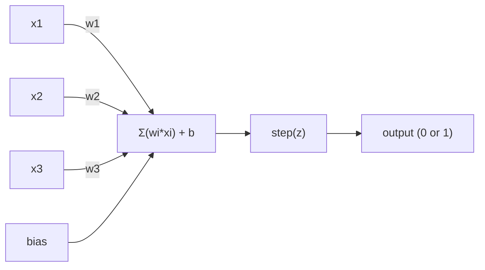
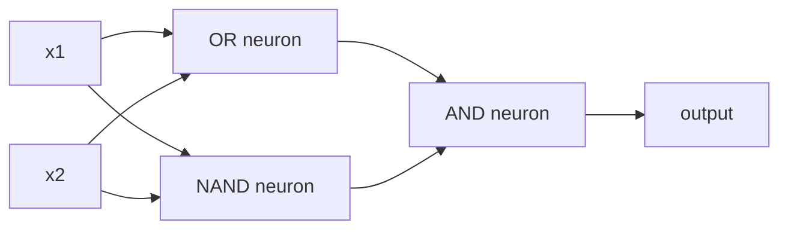

# Perceptron

> Perceptron é o átomo da rede neural. Se o desligar, verás pesos, um viés e uma decisão.

**类型：**Construção
**语言：**Python
**先修要求：**Fase 1 ((Algebra Linear 直觉)
**时间：**- 60 minutos.

## Objectivo de aprendizagem
- Usar Python desde zero para implementar um Perceptron, incluindo regra de atualização de peso e função de ativação de passo
- Explicação de porquê um único Perceptron só pode resolver problemas linearmente separaveis, não demonstra o caso de falha do XOR
- Através de um conjunto OR、NAND 和 AND portões Construir um multi-camada perceptron para resolver XOR
- Utilize sigmoid ativação 和 backpropagation  treinar uma rede de duas camadas, fazer sua aprendizagem automática XOR

## 问题
Você já entendeu o produto de vetores e pontos. Você sabe que a Matrix transformará as entradas em saídas. Mas como a máquina realmente *aprende* que tipo de transformação deve usar?

Perceptron respondeu a esta questão. É a máquina de aprendizagem mais simples: recebe algumas entradas, multiplica os pesos, adiciona o preconceito, e então toma uma decisão binária.

Compreender Perceptron, significa entender o código aprendizagem até que ponto é: constante ajuste de números, até que a saída                                                                                                                                                                                                                                                                                                                                                                                                                                                                                              

## 概念
### Um neurônio, uma decisão.

Um Perceptron recebe n 个 inputs, multiplicará cada entrada por um peso, procura, adiciona viés, e então transfere o resultado para uma função de ativação.



Função de passo 非常直接: Se a soma ponderada加 bias >= 0, então a saída 为 1──否则, saída 为 0──

```
step(z) = 1  if z >= 0
           0  if z < 0
```

Este é um classificador linear. Pesos e preconceitos definem uma linha.

### O limite da decisão

Para duas entradas, a Perceptron vai desenhar uma linha no espaço 2D:

```
  x2
  ┤
  │  Class 1        /
  │    (0)          /
  │                /
  │               / w1·x1 + w2·x2 + b = 0
  │              /
  │             /     Class 2
  │            /        (1)
  ┼───────────/──────────── x1
```

O processo de treinamento irá mover esta linha até que possa separar-se correctamente dessas classes.

### A Regra do Aprendizagem

Regra de aprendizagem Perceptron 很简单:

```
For each training example (x, y_true):
    y_pred = predict(x)
    error = y_true - y_pred

    For each weight:
        w_i = w_i + learning_rate * error * x_i
    bias = bias + learning_rate * error
```

Se a previsão for correta, erro = 0, nada mudará. Se ela for de 0, mas deve ser 1, pesos aumentam. Se ela for de 1, mas deve ser 0, pesos diminuem.

### O problema do XOR

O problema está aqui. Veja estes portões lógicos:

```
AND gate:           OR gate:            XOR gate:
x1  x2  out         x1  x2  out         x1  x2  out
0   0   0           0   0   0           0   0   0
0   1   0           0   1   1           0   1   1
1   0   0           1   0   1           1   0   1
1   1   1           1   1   1           1   1   0
```

E 和 OR é linearmente separavel de: você pode desenhar uma linha,把 0 和 1 分开;; XOR 则不是──没有任何一条直线能把 [0,1] 和 [1,0] 与 [0,0] 和 [1,1] 分开──

```
AND (separable):        XOR (not separable):

  x2                      x2
  1 ┤  0     1            1 ┤  1     0
    │     /                 │
  0 ┤  0 / 0              0 ┤  0     1
    ┼──/──────── x1         ┼──────────── x1
       line works!          no single line works!
```

Isto é uma limitação fundamental. Um único Perceptron só pode resolver problemas linearmente separaveis. Minsky e Papert provaram isso em 1969, e isso quase fez com que a pesquisa de redes neurais paralisasse durante uma década.

 solução: 把 Perceptron 堆叠成层――multi-layer perceptron pode através de 组合成一个非线性决定来解决XOR――


```figure
perceptron-boundary
```

## Construí-lo
### 步骤 1: A classe Perceptron

```python
class Perceptron:
    def __init__(self, n_inputs, learning_rate=0.1):
        self.weights = [0.0] * n_inputs
        self.bias = 0.0
        self.lr = learning_rate

    def predict(self, inputs):
        total = sum(w * x for w, x in zip(self.weights, inputs))
        total += self.bias
        return 1 if total >= 0 else 0

    def train(self, training_data, epochs=100):
        for epoch in range(epochs):
            errors = 0
            for inputs, target in training_data:
                prediction = self.predict(inputs)
                error = target - prediction
                if error != 0:
                    errors += 1
                    for i in range(len(self.weights)):
                        self.weights[i] += self.lr * error * inputs[i]
                    self.bias += self.lr * error
            if errors == 0:
                print(f"Converged at epoch {epoch + 1}")
                return
        print(f"Did not converge after {epochs} epochs")
```

### 步骤 2: em portões lógicos 上训练

```python
and_data = [
    ([0, 0], 0),
    ([0, 1], 0),
    ([1, 0], 0),
    ([1, 1], 1),
]

or_data = [
    ([0, 0], 0),
    ([0, 1], 1),
    ([1, 0], 1),
    ([1, 1], 1),
]

not_data = [
    ([0], 1),
    ([1], 0),
]

print("=== AND Gate ===")
p_and = Perceptron(2)
p_and.train(and_data)
for inputs, _ in and_data:
    print(f"  {inputs} -> {p_and.predict(inputs)}")

print("\n=== OR Gate ===")
p_or = Perceptron(2)
p_or.train(or_data)
for inputs, _ in or_data:
    print(f"  {inputs} -> {p_or.predict(inputs)}")

print("\n=== NOT Gate ===")
p_not = Perceptron(1)
p_not.train(not_data)
for inputs, _ in not_data:
    print(f"  {inputs} -> {p_not.predict(inputs)}")
```

### 步骤 3: observar XOR 失败

```python
xor_data = [
    ([0, 0], 0),
    ([0, 1], 1),
    ([1, 0], 1),
    ([1, 1], 0),
]

print("\n=== XOR Gate (single perceptron) ===")
p_xor = Perceptron(2)
p_xor.train(xor_data, epochs=1000)
for inputs, expected in xor_data:
    result = p_xor.predict(inputs)
    status = "OK" if result == expected else "WRONG"
    print(f"  {inputs} -> {result} (expected {expected}) {status}")
```

Não converge para sempre. É uma única Perceptron que não consegue aprender a XOR.

### 步骤 4: Usar duas camadas  resolver XOR

技巧是:XOR = (x1 OR x2) E NÃO (x1 E x2)



```python
def xor_network(x1, x2):
    or_neuron = Perceptron(2)
    or_neuron.weights = [1.0, 1.0]
    or_neuron.bias = -0.5

    nand_neuron = Perceptron(2)
    nand_neuron.weights = [-1.0, -1.0]
    nand_neuron.bias = 1.5

    and_neuron = Perceptron(2)
    and_neuron.weights = [1.0, 1.0]
    and_neuron.bias = -1.5

    hidden1 = or_neuron.predict([x1, x2])
    hidden2 = nand_neuron.predict([x1, x2])
    output = and_neuron.predict([hidden1, hidden2])
    return output


print("\n=== XOR Gate (multi-layer network) ===")
for inputs, expected in xor_data:
    result = xor_network(inputs[0], inputs[1])
    print(f"  {inputs} -> {result} (expected {expected})")
```

Quatro situações são todas corretas. Colocar o Perceptron em camadas, pode criar um único Perceptron.

### 步骤 5: treinar uma rede de duas camadas

Passo 4 手动连接了重量── isso é eficaz para XOR, mas para você que já não sabe o que é o verdadeiro problema de pesos certos já não é adequado── solução:

```python
class TwoLayerNetwork:
    def __init__(self, learning_rate=0.5):
        import random
        random.seed(0)
        self.w_hidden = [[random.uniform(-1, 1), random.uniform(-1, 1)] for _ in range(2)]
        self.b_hidden = [random.uniform(-1, 1), random.uniform(-1, 1)]
        self.w_output = [random.uniform(-1, 1), random.uniform(-1, 1)]
        self.b_output = random.uniform(-1, 1)
        self.lr = learning_rate

    def sigmoid(self, x):
        import math
        x = max(-500, min(500, x))
        return 1.0 / (1.0 + math.exp(-x))

    def forward(self, inputs):
        self.inputs = inputs
        self.hidden_outputs = []
        for i in range(2):
            z = sum(w * x for w, x in zip(self.w_hidden[i], inputs)) + self.b_hidden[i]
            self.hidden_outputs.append(self.sigmoid(z))
        z_out = sum(w * h for w, h in zip(self.w_output, self.hidden_outputs)) + self.b_output
        self.output = self.sigmoid(z_out)
        return self.output

    def train(self, training_data, epochs=10000):
        for epoch in range(epochs):
            total_error = 0
            for inputs, target in training_data:
                output = self.forward(inputs)
                error = target - output
                total_error += error ** 2

                d_output = error * output * (1 - output)

                saved_w_output = self.w_output[:]
                hidden_deltas = []
                for i in range(2):
                    h = self.hidden_outputs[i]
                    hd = d_output * saved_w_output[i] * h * (1 - h)
                    hidden_deltas.append(hd)

                for i in range(2):
                    self.w_output[i] += self.lr * d_output * self.hidden_outputs[i]
                self.b_output += self.lr * d_output

                for i in range(2):
                    for j in range(len(inputs)):
                        self.w_hidden[i][j] += self.lr * hidden_deltas[i] * inputs[j]
                    self.b_hidden[i] += self.lr * hidden_deltas[i]
```

```python
net = TwoLayerNetwork(learning_rate=2.0)
net.train(xor_data, epochs=10000)
for inputs, expected in xor_data:
    result = net.forward(inputs)
    predicted = 1 if result >= 0.5 else 0
    print(f"  {inputs} -> {result:.4f} (rounded: {predicted}, expected {expected})")
```

Ele e o Passo 4 têm duas diferenças importantes. Primeiro, o sigmoide substituiu a função de passo, porque é plano, então o gradiente existe.`train`方法把 error from output Backpropagation to hidden layer,并按每一个重量调整它们──这是 20 行代码中的 Backpropagation──

É o caminho para a lição 03`d_output`和 `hidden_deltas`Mas a matemática é a regra da cadeia. Aplica-la ao gráfico da rede.

## Use-o
Você está construindo desde zero, tudo existe em uma importação:

```python
from sklearn.linear_model import Perceptron as SkPerceptron
import numpy as np

X = np.array([[0,0],[0,1],[1,0],[1,1]])
y = np.array([0, 0, 0, 1])

clf = SkPerceptron(max_iter=100, tol=1e-3)
clf.fit(X, y)
print([clf.predict([x])[0] for x in X])
```

O teu 30o.`Perceptron`A classe faz a mesma coisa. A versão de Sklearn aumentou as verificações de convergência, as várias funções de perda, bem como o suporte de entrada escassa, mas o ciclo central é completamente o mesmo: a função ponderada de soma, passo, erro, e o peso atualizado.

A diferença real é evidente na escala.

- Função de passo 会变成 sigmoid、ReLU ou outra ativação plana
- Pesos 会通过后扩散 自动学习(Lessão 03)
- camadas vai ficar mais profunda: 3 ̊10 ̊100+ camadas
- O mesmo princípio ainda é válido: cada camada é de saída de camada anterior, criar novas características no meio.

Só pode desenhar uma linha reta. Coloca-as juntas e podes desenhar qualquer forma.

## Entrega-o
本课会产出:
- `outputs/skill-perceptron.md`- Uma habilidade, explica quando é necessário uma arquitetura de camada única e multi-camada

## 练习
1. Em NAND gate, qualquer circuito lógico pode ser construído por NAND.
2. Modificar a classe Perceptron, fazê-lo em cada época Seguir o limite de decisão ((w1*x1 + w2*x2 + b = 0) ⋅ Imprimir em AND gate                                                                                                                                                                                                                                                                                                                                                                                                                                                                                 
3. Construir um Perceptron de 3 entradas: só quando 3 entradas entre pelo menos 2 个为 1 时才输出 1(função de voto da maioria) ⋅ é linearmente separable de?

## 关键术语
| Term | What people say | What it actually means |
|------|----------------|----------------------|
| Perceptron | “一个假的 neuron” | 一个 linear classifier：inputs 与 weights 的 dot product，加上 bias，再通过 step function |
| Weight | “一个 input 有多重要” | 一个 multiplier，用来缩放每个 input 对 decision 的贡献 |
| Bias | “threshold” | 一个 constant，用来平移 decision boundary，让 Perceptron 即使在 inputs 为零时也能触发 |
| Activation function | “压缩数值的东西” | 一个在 weighted sum 之后应用的 function：Perceptron 使用 step function，现代 networks 使用 sigmoid/ReLU |
| Linearly separable | “你能在它们之间画一条线” | 一个 dataset，其中单个 hyperplane 可以完美分离 classes |
| XOR problem | “Perceptron 做不到的那件事” | single-layer networks 无法学习 non-linearly-separable functions 的证明 |
| Decision boundary | “classifier 发生切换的位置” | 将 input space 分成两个 classes 的 hyperplane w*x + b = 0 |
| Multi-layer perceptron | “一个真正的 Neural Network” | 按 layers 堆叠的 Perceptron，其中每一层的 output 会输入到下一层 |

## 延伸阅读
- Frank Rosenblatt, The Perceptron: Um Modelo Probabilístico para Armazenamento e Organização de Informações no Cerebro(1958) -- 开创这一切的原始论文
- Minsky & Papert, Perceptrons 1969 -- Este livro provou que a XOR não pode ser resolvida por redes de camada única, e fez o estudo da Perceptron parar por uma década.
- Michael Nielsen, Neural Networks and Deep Learning, Capítulo 1http://neuralnetworksanddeeplearning.com/）--免费在线资源, é a melhor explicação visível sobre como a Perceptron compõe redes
