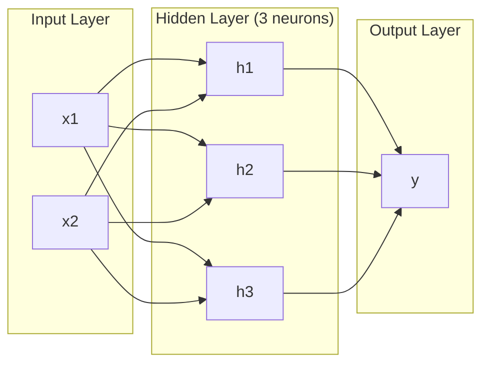
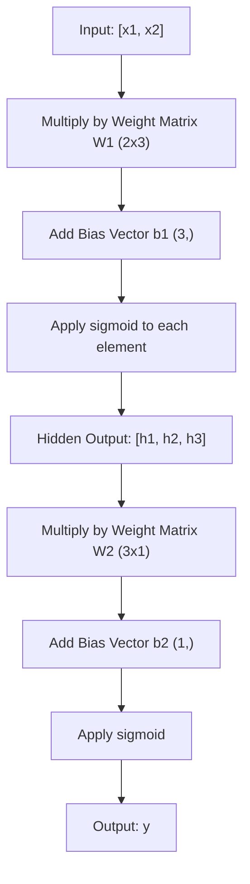
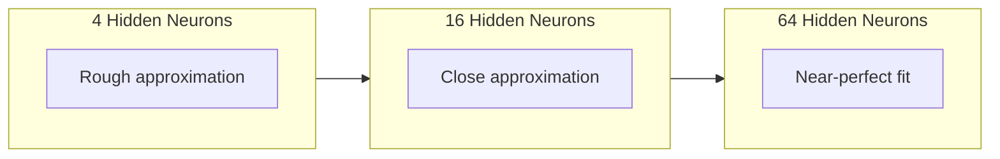

# Multilevel network e Pass Forward

> Um neurônio desenha uma linha... colocá-las juntas, e então podes desenhar qualquer coisa...

**Type:** 构建
**Languages:** Python
**Prerequisites:** Phase 01（Math Foundations），Lesson 03.01（The Perceptron）
**Time:** 约 90 分钟

## Objectivo de aprendizagem

- Utilize Layer 和 Network class desde zero construir uma rede de várias camadas, completar completo Pass Forward
-                                                                                                                                                                                                                                                                                                                                                                                                                                                                                                                              
- 解释堆叠非线性激活 如何让网络学习 曲的决策边界
- Utilize 2-2-1 架构和手工调好的 sigmoid 权重解决 XOR 问题

## 问题

单个神经元就是一个画线器――仅此而已――它只能在你的数据中画出一条直线――AI em cada problema real - 图像识别,语言理解,下围棋 - 都需要曲线――把神经元堆叠成层,就是获得曲线的方法――

Em 1969, Minsky 和 Papert provou que esta limitação é fatal: uma única rede de camadas não pode aprender XOR── não é muito difícil de aprender − em vez de matemática fazer não chega── XOR real valor de cálculo [0,1] 和 [1,0]  colocado de um lado, [0,0] 和 [1,1]  colocado do outro lado── não há uma linha direta que possa separá-los──

Isso fez com que o financiamento da rede neural fique parado por mais de dez anos. Após o incidente, o método de reparação foi evidente: não usar apenas uma camada.

Esta composição é uma rede de várias camadas. É a base de cada modelo de aprendizagem profunda no ambiente de produção de hoje. Passagem avançada - dados de entrada, fluxo, camada oculta até saída - é a primeira coisa que você deve construir antes de qualquer outra coisa que possa funcionar.

## 概念

### 层:输入,Hidden,输出

Uma rede multi-camada tem três classes:

**输入层**-- 严格来说不是一层――它保存原始数据――两个特征意味着两个输入节点――这里不发生计算――

**Hidden layer**-- 工作发生的地方── cada neurônio recebe cada saída de uma camada superior, aplica peso e um viés, e então transfere o resultado para a função activa── é chamado de Hidden, porque você não vê esses valores diretamente nos dados de treinamento──

**输出层**-- 最终答案──对于二分类,使用一个带 sigmoid 的神经元──对于五分类,每个类一个神经元──



É uma rede de 2-3-1 ⋅ duas entradas, três neurônios escondidos, uma saída ⋅ cada ligação tem um peso ⋅ cada neurônio ⋅ entrada exceto ⋅ todos têm um viés ⋅

Cada camada produz um conjunto de vectores numéricos, chamados de estado oculto. Para o texto, o estado oculto aumentará a dimensão. Colocar uma palavra codificada em 768 números para capturar o significado. Para as imagens, elas diminuirão a dimensão. Colocar milhões de imagens em expressões gerenciáveis.

### Neuroenósio

Cada neurônio faz três coisas:

1. Cada entrada será multiplicada pelo peso do correspondente
2. Vai multiplicar todas as vezes e fazer adicionar um preconceito
3. Acionar e transmitir função de ativação

Agora, a função activar é sigmoid:

```
sigmoid(z) = 1 / (1 + e^(-z))
```

O sigmoide vai reduzir o número arbitrário para (0, 1) ∞ ∞ ∞ ∞ ∞ ∞ ∞ ∞ ∞ ∞ ∞ ∞ ∞ ∞ ∞ ∞ ∞ ∞ ∞ ∞ ∞ ∞ ∞ ∞ ∞ ∞ ∞ ∞ ∞ ∞ ∞ ∞ ∞ ∞ ∞ ∞ ∞ ∞ ∞ ∞ ∞ ∞ ∞ ∞ ∞ ∞ ∞ ∞ ∞ ∞ ∞ ∞ ∞ ∞ ∞ ∞ ∞ ∞ ∞ ∞ ∞ ∞ ∞ ∞ ∞ ∞ ∞ ∞ ∞ ∞ ∞ ∞ ∞ ∞ ∞ ∞ ∞ ∞ ∞ ∞ ∞ ∞ ∞ ∞ ∞ ∞ ∞ ∞ ∞ ∞ ∞ ∞ ∞ ∞ ∞ ∞ ∞ ∞ ∞ ∞ ∞ ∞ ∞ ∞ ∞ ∞ ∞ ∞ ∞ ∞ ∞ ∞ ∞ ∞ ∞ ∞ ∞ ∞ ∞ ∞ ∞ ∞ ∞ ∞ ∞ ∞ ∞ ∞ ∞ ∞ ∞ ∞ ∞ ∞ ∞ ∞ ∞ ∞ ∞ ∞ ∞ ∞ ∞ ∞ ∞ ∞ ∞ ∞ ∞ ∞ ∞ ∞ ∞ ∞ ∞ ∞ ∞ ∞ ∞ ∞ ∞ ∞ ∞ ∞ ∞ ∞ ∞ ∞ ∞ ∞ ∞ ∞ ∞ ∞ ∞ ∞ ∞ ∞ ∞ ∞ ∞ ∞ ∞ ∞ ∞ ∞ ∞ ∞ ∞ ∞ ∞ ∞ ∞ ∞ ∞ ∞ ∞ ∞ ∞ ∞ ∞ ∞ ∞ ∞ ∞ ∞ ∞ ∞ ∞ ∞ ∞ ∞ ∞ ∞ ∞ ∞ ∞ ∞ ∞ ∞ ∞ ∞ ∞ ∞ ∞ ∞ ∞ ∞ ∞ ∞ ∞ ∞ ∞ ∞ ∞ ∞ ∞ ∞ ∞ ∞ ∞ ∞ ∞ ∞ ∞ ∞ ∞ 

### Passagem de Forward: dados como se movem

Passagem avançada irá fazer a entrada de dados por camadas através da rede, até chegar à saída.



Em cada camada, três operações ocorrem em ordem:

```
z = W * input + b       (linear transformation)
a = sigmoid(z)           (activation)
```

Uma camada de entrada se torna uma camada de entrada de baixo.

### Matrix 维度

追踪维度 é a mais importante habilidade de aprendizagem em Deep Learning.

| Step | Operation | Dimensions | Result Shape |
|------|-----------|------------|-------------|
| 输入 | x | -- | (2,) |
| Hidden 线性部分 | W1 * x + b1 | W1: (3, 2), b1: (3,) | (3,) |
| Hidden 激活 | sigmoid(z1) | -- | (3,) |
| 输出线性部分 | W2 * h + b2 | W2: (1, 3), b2: (1,) | (1,) |
| 输出激活 | sigmoid(z2) | -- | (1,) |

規則:第 k 層の重量 マトリックス W の形は (neurônios_in_layer_k, neurônios_in_layer_k_minus_1) 』行对应应应上一层。列对应上一层。

### Teorema de aproximação universal

Em 1989, George Cybenko provou um fato extraordinário: uma rede neural com uma única camada oculta e neurônios suficientes para se aproximar de qualquer função continuada com precisão de qualquer expectativa.

Isso não significa uma camada oculta 总是最佳选择── significa que a estrutura tem capacidade em teoria── na prática, redes mais profundas (mais camadas, cada camada menos neurônios) podem usar muito menos do que a gama de componentes de uma rede larga e larga para aprender a mesma função── é por isso que o Deep Learning pode funcionar──

直觉是: cada neurônio na camada oculta aprende uma camada ou característica. Se houver camadas suficientes e as colocar na posição correta, poderão aproximar-se de qualquer curva plana.



### Componente

Rede Neural é possível reunir. Você pode compor-las, juntar-as, executá-las. Modelo de sussurro Utilize uma rede de codificadores  processar áudio, e use uma rede de decodificadores independente.


```figure
mlp-forward
```

## Construí-lo

Pure Python── não usar numpy── cada Matrix 操作都从零编写──

### 步骤 1: Sigmoid 激活

```python
import math

def sigmoid(x):
    x = max(-500.0, min(500.0, x))
    return 1.0 / (1.0 + math.exp(-x))
```

Colocar o valor de sujeira até [-500, 500] pode evitar a sobreposição.`math.exp(500)`Muito grande, mas ainda limitado.`math.exp(1000)`É um grande...

### 步骤 2: Classe de camadas

Todas as operações mais importantes no Deep Learning são Matrix 乘法── Cada camada、 cada cabeça de atenção、 cada passagem para a frente -- 底层都是matmul── uma camada linear 接收一个输入向量,将它乘以权重矩阵,并加上偏差向量:y = Wx + b── esta única camada ocupa 90% da quantidade de cálculo na Rede Neural──

Uma camada de armazenamento de uma Matriz de peso e um vetor de viés. Seu método de avanço recebe um vetor de entrada e retorna ao output de ativado.

```python
class Layer:
    def __init__(self, n_inputs, n_neurons, weights=None, biases=None):
        if weights is not None:
            self.weights = weights
        else:
            import random
            self.weights = [
                [random.uniform(-1, 1) for _ in range(n_inputs)]
                for _ in range(n_neurons)
            ]
        if biases is not None:
            self.biases = biases
        else:
            self.biases = [0.0] * n_neurons

    def forward(self, inputs):
        self.last_input = inputs
        self.last_output = []
        for neuron_idx in range(len(self.weights)):
            z = sum(
                w * x for w, x in zip(self.weights[neuron_idx], inputs)
            )
            z += self.biases[neuron_idx]
            self.last_output.append(sigmoid(z))
        return self.last_output
```

权重矩阵的形是 (n_neurons, n_inputs) ――每一行是一个神经元跨所有输入的权重──forward method 遍历神经元,计算加权和加偏见,应用 sigmoid,并收集结果──

### 步骤 3: Classe de rede

Uma rede é uma lista de camadas. Passagem de frente irá ligá-las: saída de entrada de primeira linha para primeira linha.

```python
class Network:
    def __init__(self, layers):
        self.layers = layers

    def forward(self, inputs):
        current = inputs
        for layer in self.layers:
            current = layer.forward(current)
        return current
```

É o que acontece com o avanço.

### 步骤 4: Usando o manual de boa resolução do peso do XOR

Na lição 01 , nós através de composição OR、NAND 和 AND perceptron  resolvemos XOR。 agora com nossa classe de camada e rede fazer o mesmo ⋅2-2-1 架构: duas entradas、 dois neurônios ocultos、 um output。

```python
hidden = Layer(
    n_inputs=2,
    n_neurons=2,
    weights=[[20.0, 20.0], [-20.0, -20.0]],
    biases=[-10.0, 30.0],
)

output = Layer(
    n_inputs=2,
    n_neurons=1,
    weights=[[20.0, 20.0]],
    biases=[-30.0],
)

xor_net = Network([hidden, output])

xor_data = [
    ([0, 0], 0),
    ([0, 1], 1),
    ([1, 0], 1),
    ([1, 1], 0),
]

for inputs, expected in xor_data:
    result = xor_net.forward(inputs)
    predicted = 1 if result[0] >= 0.5 else 0
    print(f"  {inputs} -> {result[0]:.6f} (rounded: {predicted}, expected: {expected})")
```

较大的权重(20, -20) Deixe o sigmoide exibido como a fase jump função。 primeira neurona oculta 近似 OR。 segunda近似 NAND。输出神经元把它们组合成 AND,也就是 XOR。

### 步骤 5: 圆形分类

Uma questão mais difícil: classificar pontos 2D em centros de ponto de origem, com um diâmetro de 0,5 círculo dentro ou fora do círculo.

```python
import random
import math

random.seed(42)

data = []
for _ in range(200):
    x = random.uniform(-1, 1)
    y = random.uniform(-1, 1)
    label = 1 if (x * x + y * y) < 0.25 else 0
    data.append(([x, y], label))

circle_net = Network([
    Layer(n_inputs=2, n_neurons=8),
    Layer(n_inputs=8, n_neurons=1),
])
```

Usando o peso como o tempo, o efeito da rede não vai ser bom. Mas o Forward pass ainda vai funcionar.

```python
correct = 0
for inputs, expected in data:
    result = circle_net.forward(inputs)
    predicted = 1 if result[0] >= 0.5 else 0
    if predicted == expected:
        correct += 1

print(f"Accuracy with random weights: {correct}/{len(data)} ({100*correct/len(data):.1f}%)")
```

Como o peso de peso é mais preciso - geralmente até mesmo mais do que o de um grupo de pessoas.

## Use-o

PyTorch usou quatro linhas de código para completar tudo o que está acima:

```python
import torch
import torch.nn as nn

model = nn.Sequential(
    nn.Linear(2, 8),
    nn.Sigmoid(),
    nn.Linear(8, 1),
    nn.Sigmoid(),
)

x = torch.tensor([[0.0, 0.0], [0.0, 1.0], [1.0, 0.0], [1.0, 1.0]])
output = model(x)
print(output)
```

`nn.Linear(2, 8)`É a sua classe de camadas: forma 为 (8, 2) do peso da matriz, forma 为 (8,) do viés vetor.`nn.Sigmoid()`É o seu sigmoid 函数, cada elemento aplicado.`nn.Sequential`É a sua classe de rede:

A diferença é na velocidade e na escala. O PyTorch funciona em GPUs, processando milhões de amostras em lote, e calcula automaticamente para Gradiente de Backpropagation.

## Entrega-o

Este curso produz um prompt repetível, para projetar a estrutura de rede:

- `outputs/prompt-network-architect.md`

Quando você precisa decidir quantas camadas, quantas neuronas por camada e quais funções ativadoras usar, pode usá-la.

## 练习

1. Construir uma 2-4-2-1 网络( duas camadas ocultas), e usar os dados XOR em como fazer o seu peso de operação Forward pass;.

2. A camada oculta do sistema de classificação em círculo grande do 8 para 2, para 32...

3. Em uma classe de rede , você pode implementar um .`count_parameters`método, retornar o peso e o número total de preconceitos.

4. Para um 3-4-4-2 网络构建 Forward pass──向它输入 RGB 颜值(归结到0-1),并观察两个输出──这是一个两类简单颜色分类器的构建──

5. Usar um leaky step função substituir sigmoid: se z < 0, então retornar 0.01 * z, senão retornar 1.0。 usar o mesmo manual em Step 4 , em XOR 上运行 Forward pass。 ainda é válido?

## 关键术语

| Term | 人们会怎么说 | 它实际意味着什么 |
|------|----------------|----------------------|
| Forward pass | “运行模型” | 将输入推过每一层 -- 乘以权重、加上 bias、激活 -- 以产生输出 |
| Hidden layer | “中间部分” | 输入和输出之间的任意层，其值不会在数据中被直接观察到 |
| Multi-layer network | “一个深的 Neural Network” | 按顺序堆叠的神经元层，其中每一层的输出会输入到下一层 |
| Activation function | “非线性” | 在线性变换之后应用的函数，用来把曲线引入决策边界 |
| Sigmoid | “S 曲线” | sigma(z) = 1/(1+e^(-z))，将任意实数压缩到 (0,1)，平滑且处处可微 |
| Weight matrix | “参数” | 一个 shape 为 (current_layer_neurons, previous_layer_neurons) 的 Matrix W，包含可学习的连接强度 |
| Bias vector | “偏移量” | 在 Matrix 乘法之后添加的 Vector，使神经元即使在所有输入为零时也能激活 |
| Universal approximation | “Neural Network 可以学习任何东西” | 一个拥有足够多神经元的单 hidden layer 可以逼近任意连续函数 -- 但“足够多”可能意味着数十亿 |
| Linear transformation | “Matrix 乘法步骤” | z = W * x + b，激活前的计算，将输入映射到一个新空间 |
| Decision boundary | “分类器切换的地方” | 输入空间中的一个曲面，网络输出在这里跨过分类阈值 |

## 延伸阅读

- Michael Nielsen, "Networks Neurais e Aprendizagem Profunda", Capítulo 1-2 (http://neuralnetworksanddeeplearning.com/) -- 关于 Forward pass 和网络结构最清晰的免费解释,包含交互式可视化
- Cybenko, "Aproximação por Superposições de uma Função Sigmoidal" (1989) -- inicial universal teorema de aproximação 论文,出乎意料地易读
- 3Blue1Brown, "Mas o que é uma rede neural?"https://www.youtube.com/watch?v=aircAruvnKk) -- 20 minutos visualização de nível, peso e passagem para frente, ajudar a construir um modelo de mente correto
- O Conselho Europeu de Administração e de Desenvolvimento Económico e Social (CEP)https://www.deeplearningbook.org/) -- Multilayer Network's Standard Reference, leitura online livre
